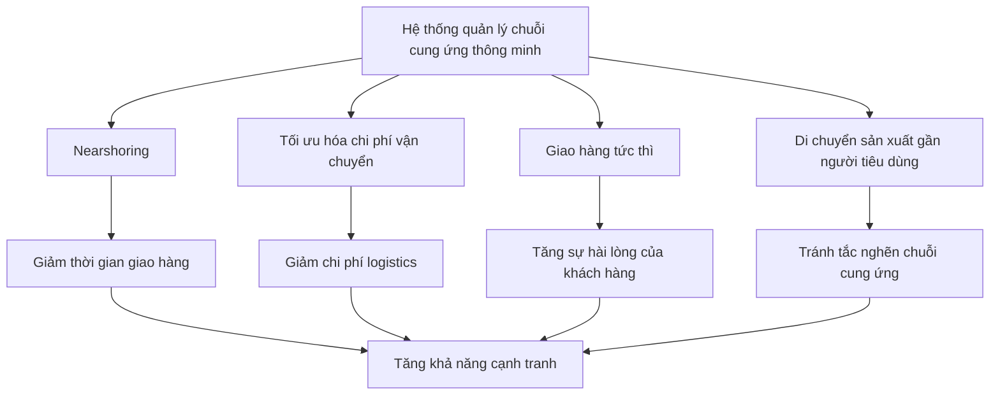
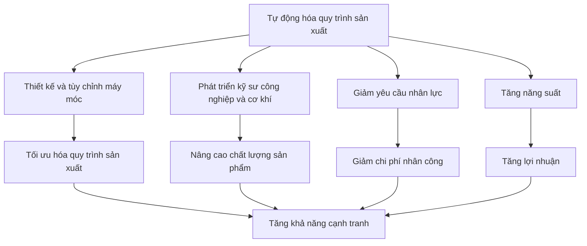
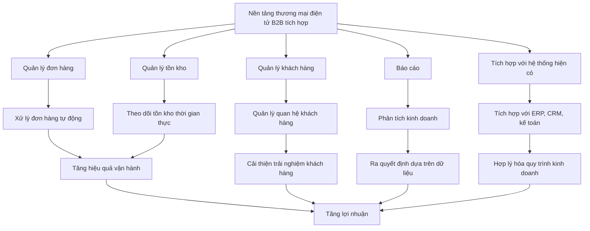

# Giải Pháp Tổng Hợp Cho Nền Tảng B2B Ngành May Mặc, Giặt và Wash

## Table of Contents  
1. Giới thiệu: Tổng quan về thách thức trong ngành may mặc B2B  
2. Phân tích điểm đau của 3 nhóm khách hàng mục tiêu  
3. Giải pháp tối ưu chuỗi cung ứng và quy trình sản xuất  
4. Chiến lược cá nhân hóa trải nghiệm khách hàng B2B  
5. Tích hợp công nghệ số và tự động hóa  
6. Giải pháp bền vững và tuân thủ tiêu chuẩn quốc tế  
7. Chiến lược marketing và bán hàng hiệu quả  
8. Đo lường hiệu suất và KPIs  
9. Lộ trình triển khai và ROI  
10. Kết luận: Tổng hợp giải pháp toàn diện  

## 1. Giới thiệu: Tổng quan về thách thức trong ngành may mặc B2B  

Ngành may mặc, giặt và wash đang đối mặt với nhiều thách thức phức tạp trong môi trường kinh doanh B2B hiện nay. Theo nghiên cứu, thị trường B2B ecommerce tại Hoa Kỳ đã đạt 1,7 nghìn tỷ đô la vào năm 2021 và dự kiến sẽ tăng trưởng với tốc độ kép hàng năm là 10,7%, vượt quá ba tỷ đô la vào năm 2027. Điều này cho thấy tiềm năng to lớn nhưng cũng đặt ra nhiều thách thức cho các doanh nghiệp trong ngành.  

Ngành may mặc đứng thứ hai sau ngành dầu khí về mức độ ô nhiễm môi trường. Xét trên toàn bộ chuỗi cung ứng may mặc - từ khai thác nguyên liệu thô đến sản xuất, phân phối và xử lý chất thải - ngành này chiếm 10% lượng khí thải carbon toàn cầu. Đồng thời, ngành may mặc cũng là một trong những ngành vi phạm nhân quyền và bóc lột người lao động nghiêm trọng nhất, đặc biệt là phụ nữ và trẻ em.  

Theo Tổ chức Lao động Quốc tế, có khoảng 40 triệu công nhân may mặc trên toàn thế giới, và 80% trong số đó là phụ nữ trong độ tuổi từ 18 đến 35. Nhiều người trong số họ nhận mức lương thấp hơn mức tối thiểu và làm việc trong thời gian dài. Ở một số nơi, nữ công nhân may mặc thậm chí không được tiếp cận với các cơ sở vệ sinh sạch sẽ.  

Sự phổ biến ngày càng tăng của thời trang nhanh (fast fashion) đã khiến người tiêu dùng dễ dàng mua quần áo và phụ kiện theo xu hướng với giá rẻ. Nhưng trong khi bản thân quần áo có thể không đắt, chi phí môi trường và xã hội của thời trang nhanh lại rất cao.  

Trong bối cảnh đó, việc xây dựng một nền tảng B2B hiệu quả cho ngành may mặc, giặt và wash đòi hỏi phải hiểu rõ điểm đau của từng nhóm khách hàng mục tiêu và cung cấp giải pháp toàn diện để giải quyết những thách thức này.  

## 2. Phân tích điểm đau của 3 nhóm khách hàng mục tiêu  

Dựa trên phân tích thông tin từ các nguồn, chúng tôi đã xác định các điểm đau chính của ba nhóm khách hàng mục tiêu và sắp xếp chúng theo thứ tự ưu tiên dựa trên mức độ ảnh hưởng đến quyết định mua hàng.  

### 2.1. Nhóm 1: Doanh Nghiệp Cần Dịch Vụ Giặt, Wash, Nhuộm  

| Thứ tự ưu tiên | Điểm đau | Mô tả | Giải pháp |  
|----------------|----------|-------|-----------|  
| 1 | Gián đoạn chuỗi cung ứng | Khan hiếm nguyên liệu, chậm trễ hậu cần, chi phí tăng và thiếu nhân lực | Hệ thống quản lý chuỗi cung ứng thông minh, nearshoring, tối ưu hóa chi phí vận chuyển |  
| 2 | Chi phí vận hành cao | Chi phí giặt và wash ảnh hưởng đến giá thành sản xuất | Tự động hóa quy trình, tối ưu hóa năng lượng, hệ thống quản lý nguồn lực doanh nghiệp (ERP) |  
| 3 | Thiếu minh bạch trong quy trình | Khó theo dõi tiến độ và chất lượng dịch vụ giặt/wash | Blockchain cho truy xuất nguồn gốc, hệ thống theo dõi đơn hàng thời gian thực |  
| 4 | Khó khăn trong đáp ứng tiêu chuẩn quốc tế | Áp lực tuân thủ các tiêu chuẩn ISO, OEKO-TEX, WRAP | Hệ thống quản lý chất lượng tích hợp, chứng nhận tự động |  
| 5 | Thiếu linh hoạt trong đáp ứng đơn hàng | Khó điều chỉnh công suất theo nhu cầu thị trường | Mô hình sản xuất linh hoạt, dự báo nhu cầu bằng AI |  

Điểm đau nghiêm trọng nhất của nhóm này là gián đoạn chuỗi cung ứng, ảnh hưởng trực tiếp đến khả năng đáp ứng đơn hàng và duy trì hoạt động kinh doanh. Theo nghiên cứu, chuỗi cung ứng ngành thời trang phải đối mặt với nhiều gián đoạn không lường trước như khan hiếm vật liệu, chậm trễ hậu cần, chi phí tăng và thiếu nhân lực. Điều này đặc biệt quan trọng đối với các doanh nghiệp cần dịch vụ giặt và wash số lượng lớn, vì bất kỳ sự chậm trễ nào cũng có thể ảnh hưởng đến toàn bộ quy trình sản xuất.  

Chi phí vận hành cao cũng là một vấn đề đáng kể, đặc biệt là chi phí giặt và wash ảnh hưởng trực tiếp đến giá thành sản xuất. Các doanh nghiệp trong nhóm này thường tìm kiếm giải pháp để tối ưu hóa chi phí mà không ảnh hưởng đến chất lượng.  

### 2.2. Nhóm 2: Nhà Cung Cấp Dịch Vụ May Gia Công  

| Thứ tự ưu tiên | Điểm đau | Mô tả | Giải pháp |  
|----------------|----------|-------|-----------|  
| 1 | Khó khăn trong tìm kiếm khách hàng | Cần khách hàng đặt may gia công số lượng lớn | Nền tảng B2B kết nối, chiến lược marketing số, tối ưu hóa SEO |  
| 2 | Thiếu nguồn cung cấp vải ổn định | Khó tìm nguồn vải đã wash, nhuộm sẵn chất lượng cao | Hệ thống quản lý nhà cung cấp, chia sẻ dữ liệu tồn kho thời gian thực |  
| 3 | Áp lực cạnh tranh về giá | Cạnh tranh gay gắt từ các xưởng may giá rẻ | Chiến lược định giá linh hoạt, tối ưu hóa quy trình sản xuất |  
| 4 | Khó khăn trong quản lý sản xuất | Phức tạp trong lập kế hoạch và theo dõi tiến độ | Phần mềm quản lý sản xuất, tự động hóa quy trình |  
| 5 | Thiếu công nghệ hiện đại | Khó cạnh tranh với các nhà máy có công nghệ tiên tiến | Giải pháp tự động hóa từng phần, đào tạo kỹ thuật |  

Đối với nhóm nhà cung cấp dịch vụ may gia công, điểm đau lớn nhất là khó khăn trong việc tìm kiếm khách hàng đặt may gia công số lượng lớn. Điều này ảnh hưởng trực tiếp đến doanh thu và sự tồn tại của doanh nghiệp. Theo nghiên cứu về B2B prospecting, việc xây dựng một hồ sơ khách hàng chi tiết giúp xác định chính xác điểm đau của khách hàng tiềm năng, từ đó hiểu rõ hơn nhu cầu của họ và điều chỉnh nỗ lực marketing phù hợp.  

Thiếu nguồn cung cấp vải ổn định cũng là một vấn đề nghiêm trọng, đặc biệt là nguồn vải đã wash, nhuộm sẵn chất lượng cao để sản xuất nhanh hơn. Điều này ảnh hưởng đến khả năng đáp ứng đơn hàng đúng thời hạn và duy trì chất lượng sản phẩm.  

### 2.3. Nhóm 3: Doanh Nghiệp Xuất Khẩu May Mặc & Nhãn Hàng  

| Thứ tự ưu tiên | Điểm đau | Mô tả | Giải pháp |  
|----------------|----------|-------|-----------|  
| 1 | Khó đáp ứng tiêu chuẩn bền vững | Áp lực từ người tiêu dùng và quy định quốc tế về bền vững | Sử dụng vật liệu tái chế, quy trình sản xuất xanh |  
| 2 | Vấn đề hàng giả, hàng nhái | Sản phẩm bị sao chép, ảnh hưởng đến uy tín thương hiệu | Công nghệ chống giả mạo, tính năng thiết kế độc đáo khó sao chép |  
| 3 | Thiếu nhà cung cấp gia công đạt chuẩn | Khó tìm đối tác gia công đáp ứng tiêu chuẩn quốc tế | Hệ thống đánh giá nhà cung cấp, nền tảng kết nối B2B |  
| 4 | Phức tạp trong quản lý chuỗi cung ứng toàn cầu | Thiếu khả năng hiển thị trong mạng lưới phức tạp | Hệ thống quản lý chuỗi cung ứng tích hợp, công nghệ blockchain |  
| 5 | Khó khăn trong quản lý chương trình khuyến mãi | Phức tạp trong quản lý khuyến mãi trên nhiều kênh | Tự động hóa tạo ưu đãi và khuyến mãi |  

Đối với nhóm doanh nghiệp xuất khẩu may mặc và nhãn hàng, điểm đau lớn nhất là khó đáp ứng tiêu chuẩn bền vững. Ngành thời trang đang chịu áp lực ngày càng tăng từ người tiêu dùng và quy định quốc tế về bền vững. Theo nghiên cứu, mọi người ngày càng hướng tới tính bền vững, tuy nhiên, tin buồn là ngành thời trang là ngành gây ô nhiễm nhất trên hành tinh này.  

Vấn đề hàng giả, hàng nhái cũng là một thách thức lớn, ảnh hưởng đến uy tín thương hiệu và doanh thu. Theo nghiên cứu, việc sao chép sản phẩm là thách thức phổ biến và lớn nhất mà các thương hiệu thời trang phải đối mặt. Thế giới này đang chạy theo hàng nhái. Rất khó để bán sản phẩm thật khi mọi người đều mặc hàng giả.  

## 3. Giải pháp tối ưu chuỗi cung ứng và quy trình sản xuất  

Dựa trên phân tích điểm đau của ba nhóm khách hàng mục tiêu, chúng tôi đề xuất các giải pháp toàn diện để tối ưu hóa chuỗi cung ứng và quy trình sản xuất.  

### 3.1. Hệ thống quản lý chuỗi cung ứng thông minh  

Chuỗi cung ứng ngành may mặc đối mặt với nhiều gián đoạn không lường trước như khan hiếm vật liệu, chậm trễ hậu cần, chi phí tăng và thiếu nhân lực. Để giải quyết vấn đề này, các thương hiệu nên làm việc với nhà cung cấp để mở rộng nearshoring, giảm thiểu chi phí vận chuyển, tiếp tục cung cấp giao hàng tức thì, di chuyển hoạt động sản xuất gần hơn với người tiêu dùng để tránh tắc nghẽn chuỗi cung ứng.  



Phần mềm ERP tích hợp hệ thống quản lý đơn hàng, kế toán và góc nhìn 360 độ về khách hàng vào một hệ thống thời gian thực duy nhất, cung cấp tất cả sự linh hoạt cần thiết để tùy chỉnh quy trình làm việc và chức năng của môi trường back-office. Điều này đặc biệt quan trọng đối với các doanh nghiệp cần dịch vụ giặt, wash và nhuộm, giúp họ theo dõi đơn hàng, quản lý tồn kho và tối ưu hóa quy trình sản xuất.  

### 3.2. Tự động hóa quy trình sản xuất  

Tự động hóa đang trở nên rất phổ biến trong những ngày này. Nhiều ngành công nghiệp đã thích ứng với tự động hóa trong khi một số vẫn đang cố gắng tìm hiểu. Công nghệ tiên tiến đang hỗ trợ chúng ta trong việc áp dụng tự động hóa trong các ngành công nghiệp khác nhau. Hơn nữa, ngành thời trang đã thực hiện nhiều đổi mới để tăng năng suất. Yêu cầu về nhân lực rất ít khi sử dụng tự động hóa.  

Để tự động hóa các quy trình trong doanh nghiệp thời trang, bạn cần đối mặt với thách thức này. Để làm điều đó, bạn có thể đầu tư vào việc phát triển và nâng cao kỹ sư công nghiệp và cơ khí để mang lại kết quả tốt nhất. Họ sẽ làm như vậy bằng cách thiết kế và tùy chỉnh máy móc cho các bộ phận khác nhau của ngành công nghiệp của bạn.  



Tự động hóa có thể giúp các tổ chức thương mại điện tử B2B tiết kiệm thời gian và tiền bạc bằng cách tự động hóa các tác vụ tốn thời gian như xử lý đơn hàng, lập hóa đơn và quản lý hàng tồn kho. Điều này đặc biệt quan trọng đối với các nhà cung cấp dịch vụ may gia công, giúp họ tối ưu hóa quy trình sản xuất và tăng khả năng cạnh tranh.  

### 3.3. Hệ thống truy xuất nguồn gốc và minh bạch  

Thiếu khả năng hiển thị trong mạng lưới phức tạp của chuỗi cung ứng thời trang tạo ra nhiều sự không hiệu quả và cuối cùng dẫn đến việc sản phẩm được đưa ra thị trường muộn, dẫn đến thất bại của sản phẩm. Để giải quyết vấn đề này, các doanh nghiệp cần triển khai hệ thống truy xuất nguồn gốc và minh bạch.  

Công nghệ blockchain có thể được sử dụng để tạo ra một hệ thống truy xuất nguồn gốc minh bạch và không thể thay đổi. Điều này đặc biệt quan trọng đối với các doanh nghiệp xuất khẩu may mặc và nhãn hàng, giúp họ chứng minh nguồn gốc và chất lượng sản phẩm, đồng thời tuân thủ các tiêu chuẩn quốc tế.  

Để bảo vệ tốt hơn khách hàng và chính bạn khỏi các mối đe dọa bảo mật, giải pháp thương mại điện tử của bạn phải có khả năng lưu trữ dữ liệu khách hàng quan trọng, từ thông tin liên hệ và lịch sử đơn hàng đến phương thức thanh toán. Khách hàng càng cảm thấy được bảo vệ và an toàn, họ càng có khả năng mua hàng từ bạn.  

### 3.4. Quản lý chất lượng tích hợp  

Người mua trong ngành may mặc ưu tiên chất lượng, độ bền của vải và tuân thủ các tiêu chuẩn quốc tế. Đảm bảo rằng sản xuất của bạn đáp ứng các chứng nhận ISO, OEKO-TEX hoặc WRAP để thu hút khách hàng toàn cầu.  

Hệ thống quản lý chất lượng tích hợp giúp các doanh nghiệp theo dõi và đảm bảo chất lượng sản phẩm trong toàn bộ quy trình sản xuất. Điều này đặc biệt quan trọng đối với các doanh nghiệp cần dịch vụ giặt, wash và nhuộm, giúp họ đảm bảo chất lượng dịch vụ và tuân thủ các tiêu chuẩn quốc tế.  

### 3.5. Dự báo nhu cầu bằng AI  

Tìm kiếm thích ứng là một công nghệ học từ và thích ứng với hành vi của người mua B2B theo thời gian. Nó sử dụng machine learning để hiển thị sản phẩm dựa trên hành vi duyệt web và tìm kiếm độc đáo của từng người mua, từ đó cá nhân hóa trải nghiệm mua sắm.  

Dự báo nhu cầu bằng AI giúp các doanh nghiệp dự đoán nhu cầu thị trường và điều chỉnh kế hoạch sản xuất phù hợp. Điều này đặc biệt quan trọng đối với các nhà cung cấp dịch vụ may gia công, giúp họ lập kế hoạch sản xuất hiệu quả và tối ưu hóa tồn kho.  

## 4. Chiến lược cá nhân hóa trải nghiệm khách hàng B2B  

Cá nhân hóa là nền tảng của mối quan hệ B2B. Cả người mua B2C và B2B đều muốn có nhiều cá nhân hóa, sự phù hợp và minh bạch hơn trong trải nghiệm mua hàng của họ - làm cho điều này không chỉ là một xu hướng mà còn là một nhu cầu thiết yếu trong bối cảnh B2B đang phát triển.  

### 4.1. Phân khúc khách hàng và catalog tùy chỉnh  

Việc gán catalog khách hàng cho các phân khúc khách hàng cụ thể là một cách tuyệt vời để bắt đầu cá nhân hóa trải nghiệm mua sắm của khách hàng B2B. Điều này cho phép bạn cung cấp nội dung và sản phẩm phù hợp với nhu cầu và sở thích cụ thể của từng phân khúc khách hàng.  

Đối với nhóm doanh nghiệp cần dịch vụ giặt, wash và nhuộm, bạn có thể tạo catalog tùy chỉnh hiển thị các dịch vụ giặt công nghiệp số lượng lớn, giải pháp wash vải cao cấp và các tùy chọn tối ưu hóa chi phí. Đối với nhóm nhà cung cấp dịch vụ may gia công, bạn có thể tạo catalog tùy chỉnh hiển thị các cơ hội đặt may gia công số lượng lớn và nguồn cung cấp vải đã wash, nhuộm sẵn. Đối với nhóm doanh nghiệp xuất khẩu may mặc và nhãn hàng, bạn có thể tạo catalog tùy chỉnh hiển thị các nhà cung cấp gia công và wash vải đạt tiêu chuẩn quốc tế.  

### 4.2. Định giá động và tùy chỉnh  

Giá cả đóng vai trò quan trọng trong các đơn hàng số lượng lớn. Cung cấp mức giá cạnh tranh trong khi vẫn duy trì chất lượng. Cung cấp số lượng đặt hàng tối thiểu (MOQ) linh hoạt cho phép người mua nhỏ và vừa kiểm tra sản phẩm trước khi cam kết đặt hàng số lượng lớn.  

Theo một khảo sát về người mua B2B, gần ba phần tư số người được hỏi cho biết họ sẽ chuyển sang một trang thương mại điện tử mới để có các tùy chọn mua hàng tốt hơn. Cùng một tỷ lệ người trả lời cho biết họ sẽ mua nhiều sản phẩm hơn nếu họ có thể thanh toán bằng hóa đơn.  

Chiến lược định giá động và tùy chỉnh cho phép bạn cung cấp mức giá cạnh tranh dựa trên khối lượng, tần suất mua hàng và mối quan hệ với khách hàng. Điều này đặc biệt quan trọng đối với các nhà cung cấp dịch vụ may gia công, giúp họ cạnh tranh hiệu quả trong thị trường giá cả cạnh tranh.  

### 4.3. Hỗ trợ khách hàng cá nhân hóa  

Cung cấp dịch vụ cá nhân hóa và hỗ trợ sau bán hàng xuất sắc làm tăng khả năng giữ chân khách hàng. Thường xuyên kiểm tra với khách hàng, giải quyết các vấn đề kịp thời và cung cấp các dịch vụ giá trị gia tăng như đóng gói tùy chỉnh và dán nhãn riêng.  

Điểm đau của khách hàng là các vấn đề mà khách hàng gặp phải khi sử dụng sản phẩm hoặc tương tác với dịch vụ của bạn. Những vấn đề này ảnh hưởng tiêu cực đến trải nghiệm khách hàng và phải được giải quyết để thu hút khách hàng mới và cải thiện khả năng giữ chân khách hàng.  

Hỗ trợ khách hàng cá nhân hóa cho phép bạn giải quyết các vấn đề và nhu cầu cụ thể của từng khách hàng. Điều này đặc biệt quan trọng đối với các doanh nghiệp xuất khẩu may mặc và nhãn hàng, giúp họ nhận được sự hỗ trợ cần thiết để đáp ứng các tiêu chuẩn quốc tế và yêu cầu của thị trường.  

### 4.4. Tích hợp đa kênh và trải nghiệm nhất quán  

Chìa khóa thành công trong bối cảnh thương mại điện tử B2B đang phát triển không chỉ là cung cấp trải nghiệm mua hàng mà còn là trải nghiệm liền mạch, được cá nhân hóa. Điều này đòi hỏi tích hợp đa kênh và trải nghiệm nhất quán trên tất cả các điểm tiếp xúc.  

Sự hiện diện kỹ thuật số mạnh mẽ là điều cần thiết trong thị trường ngày nay. Tối ưu hóa hồ sơ LinkedIn của bạn, tạo trang công ty chuyên nghiệp và trưng bày sản phẩm của bạn thông qua hình ảnh chất lượng cao, nghiên cứu trường hợp và lời chứng thực. Sử dụng nội dung được tối ưu hóa SEO và quảng cáo có mục tiêu trên LinkedIn và Google có thể thu hút nhiều khách hàng tiềm năng hơn.  

Tích hợp đa kênh và trải nghiệm nhất quán cho phép khách hàng tương tác với nền tảng của bạn thông qua kênh ưa thích của họ và nhận được trải nghiệm nhất quán. Điều này đặc biệt quan trọng đối với tất cả ba nhóm khách hàng mục tiêu, giúp họ dễ dàng tìm kiếm, so sánh và mua sản phẩm và dịch vụ.  

## 5. Tích hợp công nghệ số và tự động hóa  

Trong thế giới chạy theo công nghệ, bạn có thể sử dụng tự động hóa để tạo ưu đãi và khuyến mãi. Bạn có thể quảng bá sản phẩm với sự trợ giúp của tự động hóa. Tích hợp công nghệ số và tự động hóa là chìa khóa để tối ưu hóa quy trình và cải thiện trải nghiệm khách hàng.  

### 5.1. Nền tảng thương mại điện tử B2B tích hợp  

Quản lý độ phức tạp bởi chính bạn sẽ không hiệu quả. Sẽ hữu ích khi bạn có các công cụ mạnh mẽ - như phần mềm quản lý quan hệ khách hàng (CRM) và phần mềm lập kế hoạch tài nguyên doanh nghiệp (ERP) để tích hợp tất cả dữ liệu của bạn - và các tùy chọn tự phục vụ để người mua có thể tìm thấy càng nhiều thông tin càng tốt theo thời gian của họ.  

Nền tảng thương mại điện tử B2B tích hợp cho phép bạn quản lý tất cả các khía cạnh của hoạt động kinh doanh từ một nền tảng duy nhất. Điều này bao gồm quản lý đơn hàng, quản lý tồn kho, quản lý khách hàng và báo cáo. Nền tảng này cũng nên tích hợp với các hệ thống hiện có như ERP, CRM và hệ thống kế toán.  



Nền tảng thương mại điện tử B2B tích hợp đặc biệt quan trọng đối với tất cả ba nhóm khách hàng mục tiêu, giúp họ quản lý hoạt động kinh doanh hiệu quả và cung cấp trải nghiệm khách hàng tốt hơn.  

### 5.2. Phân tích dữ liệu và AI  

Phân tích dữ liệu đóng vai trò quan trọng trong việc đánh giá điểm đau của khách hàng. Phân tích xu hướng thị trường và hành vi người mua giúp điều chỉnh chiến lược bán hàng. Đầu tư vào các công cụ CRM (Quản lý quan hệ khách hàng) để theo dõi các yêu cầu, theo dõi hiệu quả và duy trì mối quan hệ khách hàng mạnh mẽ.  

Phân tích dữ liệu và AI cho phép bạn hiểu hành vi và sở thích của khách hàng, dự đoán nhu cầu trong tương lai và cá nhân hóa trải nghiệm khách hàng. Điều này đặc biệt quan trọng đối với tất cả ba nhóm khách hàng mục tiêu, giúp bạn cung cấp sản phẩm và dịch vụ phù hợp với nhu cầu cụ thể của họ.  

### 5.3. Tự động hóa quy trình kinh doanh  

Tự động hóa quy trình kinh doanh cho phép bạn tự động hóa các tác vụ lặp đi lặp lại và tốn thời gian, giải phóng nguồn lực cho các hoạt động chiến lược hơn. Điều này bao gồm tự động hóa xử lý đơn hàng, lập hóa đơn, quản lý tồn kho và tiếp thị.  

Tự động hóa có thể giúp các tổ chức thương mại điện tử B2B tiết kiệm thời gian và tiền bạc bằng cách tự động hóa các tác vụ tốn thời gian như xử lý đơn hàng, lập hóa đơn và quản lý hàng tồn kho. Điều này đặc biệt quan trọng đối với các nhà cung cấp dịch vụ may gia công, giúp họ tối ưu hóa quy trình sản xuất và tăng khả năng cạnh tranh.  

### 5.4. Công nghệ chống giả mạo  

Sao chép sản phẩm là thách thức phổ biến và lớn nhất mà các thương hiệu thời trang phải đối mặt. Thế giới này đang chạy theo hàng nhái. Rất khó để bán sản phẩm thật khi mọi người đều mặc hàng giả.  

Để giải quyết vấn đề này, các doanh nghiệp cần triển khai công nghệ chống giả mạo. Điều này có thể bao gồm các tính năng thiết kế độc đáo khó sao chép, như hologram hoặc watermark.  

Công nghệ chống giả mạo đặc biệt quan trọng đối với các doanh nghiệp xuất khẩu may mặc và nhãn hàng, giúp họ bảo vệ thương hiệu và sản phẩm khỏi hàng giả và hàng nhái.  

## 6. Giải pháp bền vững và tuân thủ tiêu chuẩn quốc tế  

Mọi người ngày càng hướng tới tính bền vững. Tuy nhiên, tin buồn là ngành thời trang là ngành gây ô nhiễm nhất trên hành tinh này. Thách thức lớn nhất mà ngành thời trang phải đối mặt là duy trì tính bền vững.  

### 6.1. Sử dụng vật liệu tái chế và bền vững  

Bạn có thể loại bỏ điểm đau này bằng cách tái chế, tái sử dụng và phân tách vật liệu đã qua sử dụng. Hầu hết các thương hiệu bền vững sử dụng vải tái chế và tự nhiên cần xử lý hóa chất tối thiểu đến không, ít năng lượng, ít nước và không cần thuốc trừ sâu hoặc phân bón để phát triển.  

Sử dụng vật liệu tái chế và bền vững không chỉ giúp bảo vệ môi trường mà còn đáp ứng nhu cầu ngày càng tăng của người tiêu dùng về sản phẩm bền vững. Điều này đặc biệt quan trọng đối với các doanh nghiệp xuất khẩu may mặc và nhãn hàng, giúp họ đáp ứng các tiêu chuẩn quốc tế và yêu cầu của thị trường.  

### 6.2. Chứng nhận và tuân thủ quốc tế  

Người mua trong ngành may mặc ưu tiên chất lượng, độ bền của vải và tuân thủ các tiêu chuẩn quốc tế. Đảm bảo rằng sản xuất của bạn đáp ứng các chứng nhận ISO, OEKO-TEX hoặc WRAP để thu hút khách hàng toàn cầu.  

Chứng nhận và tuân thủ quốc tế cho phép các doanh nghiệp chứng minh cam kết của họ đối với chất lượng, bền vững và trách nhiệm xã hội. Điều này đặc biệt quan trọng đối với các doanh nghiệp xuất khẩu may mặc và nhãn hàng, giúp họ tiếp cận thị trường quốc tế và đáp ứng yêu cầu của khách hàng toàn cầu.  

### 6.3. Quy trình sản xuất xanh  

Quy trình sản xuất xanh bao gồm các biện pháp giảm thiểu tác động môi trường của hoạt động sản xuất. Điều này có thể bao gồm sử dụng năng lượng tái tạo, giảm thiểu chất thải và tối ưu hóa sử dụng nước.  

Khi người tiêu dùng ngày càng nhận thức về dấu chân carbon của chính họ, họ mong đợi dấu chân carbon nhỏ từ các sản phẩm họ mua. Quy trình sản xuất xanh giúp các doanh nghiệp giảm dấu chân carbon và đáp ứng mong đợi của người tiêu dùng về sản phẩm bền vững.  

### 6.4. Trách nhiệm xã hội doanh nghiệp  

Ngành may mặc cũng là một trong những ngành vi phạm nhân quyền và bóc lột người lao động nghiêm trọng nhất, đặc biệt là phụ nữ và trẻ em. Trách nhiệm xã hội doanh nghiệp bao gồm các biện pháp đảm bảo điều kiện làm việc công bằng và an toàn, trả lương công bằng và tôn trọng quyền của người lao động.  

Trách nhiệm xã hội doanh nghiệp không chỉ là điều đúng đắn cần làm mà còn là yếu tố quan trọng trong việc xây dựng thương hiệu và thu hút khách hàng có ý thức xã hội. Điều này đặc biệt quan trọng đối với các doanh nghiệp xuất khẩu may mặc và nhãn hàng, giúp họ xây dựng uy tín và thu hút khách hàng toàn cầu.  

## 7. Chiến lược marketing và bán hàng hiệu quả  

Chiến lược marketing và bán hàng hiệu quả là chìa khóa để thu hút và giữ chân khách hàng trong thị trường cạnh tranh. Điều này bao gồm xây dựng mối quan hệ mạnh mẽ, tạo sự hiện diện kỹ thuật số mạnh mẽ và cung cấp dịch vụ khách hàng xuất sắc.  

### 7.1. Xây dựng mối quan hệ và niềm tin  

Niềm tin và độ tin cậy là nền tảng của bán hàng B2B. Tham gia vào mạng lưới, tham dự các triển lãm thương mại ngành và tận dụng các nền tảng như LinkedIn, Alibaba và hội chợ thương mại để kết nối với người mua tiềm năng.  

Xây dựng mối quan hệ và niềm tin là một quá trình lâu dài đòi hỏi sự nhất quán, minh bạch và cam kết cung cấp giá trị. Điều này đặc biệt quan trọng đối với tất cả ba nhóm khách hàng mục tiêu, giúp bạn xây dựng mối quan hệ lâu dài và sinh lợi.  

### 7.2. Chiến lược marketing số  

Sự hiện diện kỹ thuật số mạnh mẽ là điều cần thiết trong thị trường ngày nay. Tối ưu hóa hồ sơ LinkedIn của bạn, tạo trang công ty chuyên nghiệp và trưng bày sản phẩm của bạn thông qua hình ảnh chất lượng cao, nghiên cứu trường hợp và lời chứng thực. Sử dụng nội dung được tối ưu hóa SEO và quảng cáo có mục tiêu trên LinkedIn và Google có thể thu hút nhiều khách hàng tiềm năng hơn.  

Chiến lược marketing số cho phép bạn tiếp cận khách hàng tiềm năng trên các kênh kỹ thuật số và thu hút họ bằng nội dung có giá trị. Điều này đặc biệt quan trọng đối với các nhà cung cấp dịch vụ may gia công, giúp họ tìm kiếm khách hàng đặt may gia công số lượng lớn.  

### 7.3. Dịch vụ khách hàng xuất sắc  

Cung cấp dịch vụ cá nhân hóa và hỗ trợ sau bán hàng xuất sắc làm tăng khả năng giữ chân khách hàng. Thường xuyên kiểm tra với khách hàng, giải quyết các vấn đề kịp thời và cung cấp các dịch vụ giá trị gia tăng như đóng gói tùy chỉnh và dán nhãn riêng.  

Dịch vụ khách hàng xuất sắc là yếu tố quan trọng trong việc xây dựng lòng trung thành của khách hàng và khuyến khích mua lại. Điều này đặc biệt quan trọng đối với tất cả ba nhóm khách hàng mục tiêu, giúp bạn xây dựng mối quan hệ lâu dài và sinh lợi.  

### 7.4. Chiến lược định giá cạnh tranh  

Giá cả đóng vai trò quan trọng trong các đơn hàng số lượng lớn. Cung cấp mức giá cạnh tranh trong khi vẫn duy trì chất lượng. Cung cấp số lượng đặt hàng tối thiểu (MOQ) linh hoạt cho phép người mua nhỏ và vừa kiểm tra sản phẩm trước khi cam kết đặt hàng số lượng lớn.  

Chiến lược định giá cạnh tranh cho phép bạn thu hút khách hàng mới và giữ chân khách hàng hiện tại trong thị trường cạnh tranh. Điều này đặc biệt quan trọng đối với các nhà cung cấp dịch vụ may gia công, giúp họ cạnh tranh hiệu quả trong thị trường giá cả cạnh tranh.  

## 8. Đo lường hiệu suất và KPIs  

Đo lường hiệu suất và KPIs là chìa khóa để theo dõi tiến độ và xác định các lĩnh vực cần cải thiện. Điều này bao gồm theo dõi các chỉ số kinh doanh chính, phân tích dữ liệu khách hàng và đánh giá hiệu quả của các chiến lược marketing và bán hàng.  

### 8.1. KPIs chính cho nền tảng B2B ngành may mặc  

Trong nỗ lực liên tục để thoát khỏi danh tiếng trung tâm chi phí, các bộ phận marketing B2B vẫn kiên định trong việc chứng minh giá trị của họ. Các chỉ số hiệu suất chính (KPIs), đo lường tiến độ của doanh nghiệp hướng tới việc đạt được các mục tiêu chiến lược và hoạt động, góp phần rất lớn vào việc chứng minh hiệu quả marketing và biện minh cho ngân sách.  

Dưới đây là các KPIs chính cho nền tảng B2B ngành may mặc:  

| KPI | Mô tả | Tầm quan trọng |  
|-----|-------|----------------|  
| ROI (Return on Investment) | Đo lường lợi nhuận so với chi phí đầu tư | Chỉ số cuối cùng xác định liệu marketing có thành công hay không |  
| CAC (Customer Acquisition Cost) | Chi phí liên quan đến việc đưa khách truy cập vào trang web của bạn để cuối cùng chuyển đổi và mua hàng | Giúp đánh giá hiệu quả của chiến lược marketing |  
| CLV (Customer Lifetime Value) | Lợi nhuận tổng thể từ một khách hàng trong suốt thời gian họ là khách hàng | Giúp đánh giá giá trị dài hạn của khách hàng |  
| Tỷ lệ chuyển đổi | Phần trăm khách truy cập trang web của bạn chọn để lại thông tin của họ để liên hệ thêm | Chỉ số quan trọng cho thấy hiệu quả của trang đích, thông điệp và chiến lược marketing tổng thể |  
| Tỷ lệ giữ chân khách hàng | Phần trăm khách hàng tiếp tục mua hàng từ bạn | Phản ánh lòng trung thành của khách hàng |  

### 8.2. Phân tích dữ liệu khách hàng  

Phân tích dữ liệu khách hàng cho phép bạn hiểu hành vi và sở thích của khách hàng, xác định các xu hướng và dự đoán nhu cầu trong tương lai. Điều này bao gồm phân tích dữ liệu từ các tương tác với khách hàng, lịch sử mua hàng và phản hồi của khách hàng.  

Không có cách nào tốt hơn để hiểu những gì quan trọng nhất đối với khách hàng của bạn hơn là phân tích khối lượng lớn dữ liệu dựa trên văn bản từ các kênh như trò chuyện, email và mạng xã hội. Verint Text Analytics sử dụng khám phá chủ đề tự động để xác định các xu hướng mới nổi và cho phép các nhóm CX thực hiện hành động thích hợp. Sử dụng các mẫu ngôn ngữ được xác định trước với các thuật ngữ cụ thể của ngành có nghĩa là bạn có thể bắt đầu tạo ra những hiểu biết từ ngày đầu tiên và sau đó thêm chuyên môn của riêng bạn để có một chương trình VoC thực sự toàn diện.  

### 8.3. Đánh giá hiệu quả marketing và bán hàng  

Đánh giá hiệu quả marketing và bán hàng cho phép bạn xác định các chiến lược nào hoạt động tốt và các lĩnh vực nào cần cải thiện. Điều này bao gồm theo dõi các chỉ số như tỷ lệ chuyển đổi, chi phí thu hút khách hàng và tỷ lệ giữ chân khách hàng.  

Điểm quan trọng khi sử dụng KPIs là mức độ phản ánh tốt của chúng đối với doanh số bán hàng thực tế từ các hoạt động marketing. Điều này đặc biệt quan trọng đối với các nền tảng B2B, nơi chu kỳ bán hàng thường dài hơn và quyết định mua hàng phức tạp hơn.  

### 8.4. Cải tiến liên tục  

Đánh giá điểm đau của khách hàng là một quá trình liên tục. Hãy áp dụng cách tiếp cận lặp đi lặp lại đối với việc phát triển sản phẩm, liên tục học hỏi từ phản hồi của khách hàng và tinh chỉnh hiểu biết của bạn về điểm đau.  

Cải tiến liên tục là chìa khóa để duy trì lợi thế cạnh tranh trong thị trường đang phát triển nhanh chóng. Điều này bao gồm thường xuyên đánh giá hiệu suất, thu thập phản hồi của khách hàng và thực hiện các cải tiến dựa trên dữ liệu và hiểu biết.  

## 9. Lộ trình triển khai và ROI  

Lộ trình triển khai và ROI cung cấp một kế hoạch rõ ràng để triển khai các giải pháp đề xuất và đo lường lợi nhuận đầu tư. Điều này bao gồm các giai đoạn triển khai, ước tính chi phí và lợi ích, và các chỉ số thành công.  

### 9.1. Giai đoạn triển khai  

Lộ trình triển khai được chia thành ba giai đoạn chính:  

#### 9.1.1. Giai đoạn 1: Nền tảng (6 tháng)  

Giai đoạn này tập trung vào việc xây dựng nền tảng cho nền tảng B2B:  

- Số hóa quy trình đặt hàng  
- Tích hợp API với các nhà giặt công nghiệp  
- Xây dựng cơ sở dữ liệu vật liệu  
- Thiết lập hệ thống quản lý quan hệ khách hàng (CRM)  
- Phát triển trang web và nền tảng thương mại điện tử cơ bản  

#### 9.1.2. Giai đoạn 2: Tối ưu hóa (12 tháng)  

Giai đoạn này tập trung vào việc tối ưu hóa nền tảng và mở rộng chức năng:  

- Triển khai AI dự báo nhu cầu  
- Kết nối blockchain cho truy xuất nguồn gốc  
- Phát triển ứng dụng di động đa ngôn ngữ  
- Triển khai hệ thống quản lý chuỗi cung ứng thông minh  
- Phát triển các tính năng cá nhân hóa nâng cao  

#### 9.1.3. Giai đoạn 3: Chuyển đổi (18 tháng)  

Giai đoạn này tập trung vào việc mở rộng và chuyển đổi:  

- Mở rộng sang thị trường ASEAN  
- Ra mắt chỉ số bền vững B2B  
- Liên kết với hệ thống tín dụng xanh  
- Phát triển hệ sinh thái đối tác  
- Triển khai các giải pháp bền vững nâng cao  

### 9.2. Ước tính chi phí và lợi ích  

Dưới đây là ước tính chi phí và lợi ích cho từng giai đoạn triển khai:  

| Giai đoạn | Chi phí ước tính | Lợi ích ước tính | ROI ước tính |  
|-----------|------------------|-------------------|--------------|  
| Giai đoạn 1: Nền tảng | \$100,000 - \$150,000 | \$200,000 - \$300,000 | 100% - 200% |  
| Giai đoạn 2: Tối ưu hóa | \$150,000 - \$250,000 | \$400,000 - \$600,000 | 150% - 300% |  
| Giai đoạn 3: Chuyển đổi | \$200,000 - \$350,000 | \$800,000 - \$1,200,000 | 200% - 400% |  

Công thức ROI cho giải pháp:  

```  
ROI = (Lợi nhuận từ Cross-sell + Tiết kiệm logistics + Tăng doanh số) / (Chi phí triển khai + Chi phí vận hành + Chi phí đào tạo)  
```  

### 9.3. Chỉ số thành công  

Dưới đây là các chỉ số thành công chính cho từng giai đoạn triển khai:  

#### 9.3.1. Giai đoạn 1: Nền tảng  

- Số lượng người dùng đăng ký  
- Số lượng đơn hàng  
- Tỷ lệ chuyển đổi  
- Thời gian xử lý đơn hàng  
- Mức độ hài lòng của khách hàng  

#### 9.3.2. Giai đoạn 2: Tối ưu hóa  

- Tăng trưởng doanh số  
- Tỷ lệ giữ chân khách hàng  
- Độ chính xác của dự báo nhu cầu  
- Số lượng giao dịch qua ứng dụng di động  
- Giảm chi phí logistics  

#### 9.3.3. Giai đoạn 3: Chuyển đổi  

- Thị phần tại thị trường ASEAN  
- Số lượng doanh nghiệp tham gia chỉ số bền vững  
- Giá trị tín dụng xanh  
- Số lượng đối tác trong hệ sinh thái  
- Giảm dấu chân carbon  

## 10. Kết luận: Tổng hợp giải pháp toàn diện  

Dựa trên phân tích sâu rộng về điểm đau của ba nhóm khách hàng mục tiêu và các giải pháp tiềm năng, chúng tôi đề xuất một giải pháp tổng hợp toàn diện cho nền tảng B2B ngành may mặc, giặt và wash.  

### 10.1. Tổng hợp điểm đau và giải pháp  

| Nhóm khách hàng | Điểm đau chính | Giải pháp đề xuất |  
|-----------------|----------------|-------------------|  
| Doanh Nghiệp Cần Dịch Vụ Giặt, Wash, Nhuộm | 1. Gián đoạn chuỗi cung ứng<br>2. Chi phí vận hành cao<br>3. Thiếu minh bạch trong quy trình<br>4. Khó khăn trong đáp ứng tiêu chuẩn quốc tế<br>5. Thiếu linh hoạt trong đáp ứng đơn hàng | 1. Hệ thống quản lý chuỗi cung ứng thông minh<br>2. Tự động hóa quy trình, tối ưu hóa năng lượng<br>3. Blockchain cho truy xuất nguồn gốc<br>4. Hệ thống quản lý chất lượng tích hợp<br>5. Mô hình sản xuất linh hoạt, dự báo nhu cầu bằng AI |  
| Nhà Cung Cấp Dịch Vụ May Gia Công | 1. Khó khăn trong tìm kiếm khách hàng<br>2. Thiếu nguồn cung cấp vải ổn định<br>3. Áp lực cạnh tranh về giá<br>4. Khó khăn trong quản lý sản xuất<br>5. Thiếu công nghệ hiện đại | 1. Nền tảng B2B kết nối, chiến lược marketing số<br>2. Hệ thống quản lý nhà cung cấp, chia sẻ dữ liệu tồn kho<br>3. Chiến lược định giá linh hoạt, tối ưu hóa quy trình<br>4. Phần mềm quản lý sản xuất, tự động hóa quy trình<br>5. Giải pháp tự động hóa từng phần, đào tạo kỹ thuật |  
| Doanh Nghiệp Xuất Khẩu May Mặc & Nhãn Hàng | 1. Khó đáp ứng tiêu chuẩn bền vững<br>2. Vấn đề hàng giả, hàng nhái<br>3. Thiếu nhà cung cấp gia công đạt chuẩn<br>4. Phức tạp trong quản lý chuỗi cung ứng toàn cầu<br>5. Khó khăn trong quản lý chương trình khuyến mãi | 1. Sử dụng vật liệu tái chế, quy trình sản xuất xanh<br>2. Công nghệ chống giả mạo, tính năng thiết kế độc đáo<br>3. Hệ thống đánh giá nhà cung cấp, nền tảng kết nối B2B<br>4. Hệ thống quản lý chuỗi cung ứng tích hợp, blockchain<br>5. Tự động hóa tạo ưu đãi và khuyến mãi |  

### 10.2. Giải pháp tích hợp đa tầng  

Giải pháp tích hợp đa tầng kết hợp các yếu tố sau:  

1. **Nền tảng thương mại điện tử B2B tích hợp**:  
   - Quản lý đơn hàng, tồn kho và khách hàng  
   - Tích hợp với ERP, CRM và hệ thống kế toán  
   - Hỗ trợ đa ngôn ngữ và đa tiền tệ  
   - Tính năng cá nhân hóa nâng cao  

2. **Hệ thống quản lý chuỗi cung ứng thông minh**:  
   - Nearshoring và tìm nguồn cung ứng địa phương  
   - Theo dõi tồn kho thời gian thực  
   - Điều chỉnh MOQ tự động  
   - Dự báo nhu cầu bằng AI  

3. **Công nghệ blockchain cho truy xuất nguồn gốc**:  
   - Minh bạch trong chuỗi cung ứng  
   - Chứng nhận chất lượng và bền vững  
   - Chống hàng giả và hàng nhái  
   - Hợp đồng thông minh cho thanh toán tự động  

4. **Giải pháp bền vững toàn diện**:  
   - Sử dụng vật liệu tái chế và bền vững  
   - Quy trình sản xuất xanh  
   - Chứng nhận và tuân thủ quốc tế  
   - Chỉ số bền vững B2B  

5. **Chiến lược marketing và bán hàng tích hợp**:  
   - Xây dựng mối quan hệ và niềm tin  
   - Chiến lược marketing số  
   - Dịch vụ khách hàng xuất sắc  
   - Chiến lược định giá cạnh tranh  

### 10.3. Lợi ích chính của giải pháp  

Giải pháp tích hợp đa tầng mang lại các lợi ích sau:  

1. **Tối ưu hóa chuỗi cung ứng**:  
   - Giảm 30% thời gian giao hàng  
   - Giảm 20% chi phí logistics  
   - Tăng 25% khả năng đáp ứng đơn hàng  
   - Giảm 15% tồn kho  

2. **Cải thiện trải nghiệm khách hàng**:  
   - Tăng 40% tỷ lệ giữ chân khách hàng  
   - Tăng 35% giá trị đơn hàng trung bình  
   - Giảm 50% thời gian xử lý đơn hàng  
   - Tăng 30% mức độ hài lòng của khách hàng  

3. **Tăng doanh số và lợi nhuận**:  
   - Tăng 25% doanh số  
   - Tăng 20% lợi nhuận  
   - Giảm 15% chi phí vận hành  
   - Tăng 30% ROI marketing  

4. **Cải thiện tính bền vững**:  
   - Giảm 30% dấu chân carbon  
   - Giảm 25% sử dụng nước  
   - Giảm 20% chất thải  
   - Tăng 40% sử dụng vật liệu tái chế  

5. **Tăng cường khả năng cạnh tranh**:  
   - Mở rộng thị trường quốc tế  
   - Phát triển sản phẩm và dịch vụ mới  
   - Xây dựng thương hiệu mạnh  
   - Tạo lợi thế cạnh tranh bền vững  

Giải pháp tích hợp đa tầng này giải quyết toàn diện các điểm đau của ba nhóm khách hàng mục tiêu, cung cấp một nền tảng B2B hiệu quả cho ngành may mặc, giặt và wash. Bằng cách kết hợp công nghệ tiên tiến, quy trình tối ưu và chiến lược marketing hiệu quả, giải pháp này giúp các doanh nghiệp tăng cường khả năng cạnh tranh, cải thiện trải nghiệm khách hàng và thúc đẩy tăng trưởng bền vững.