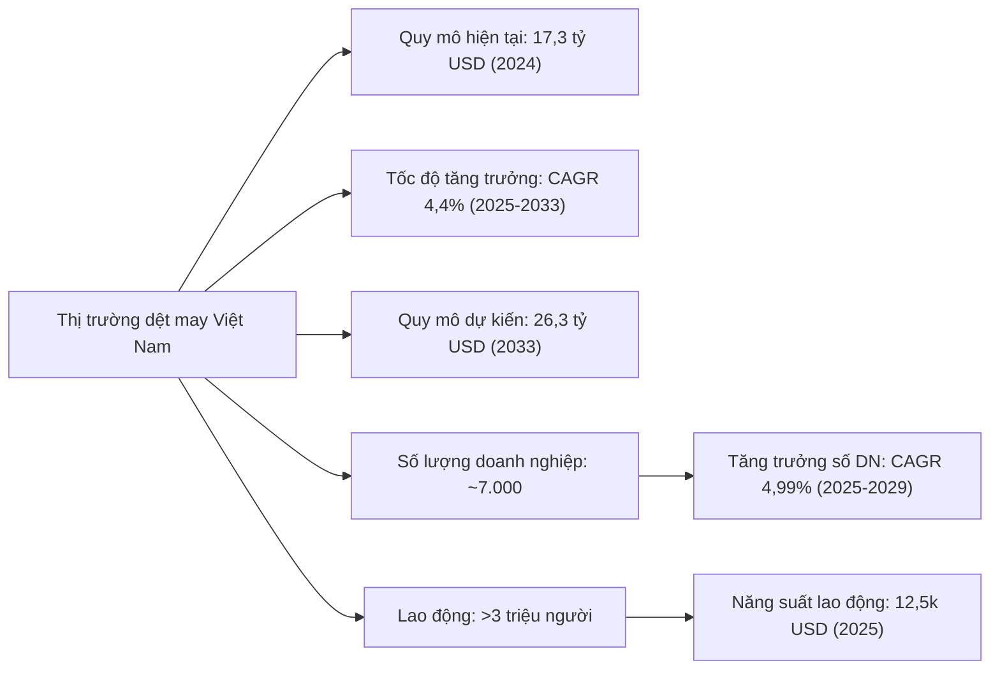
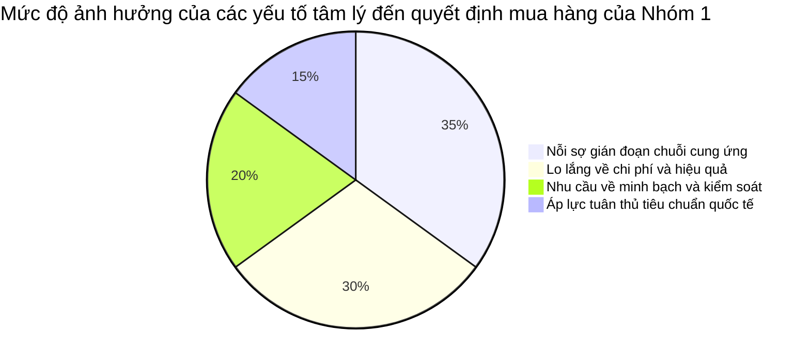
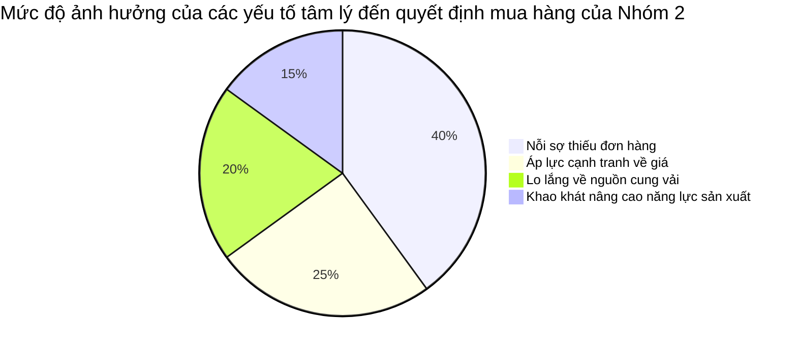
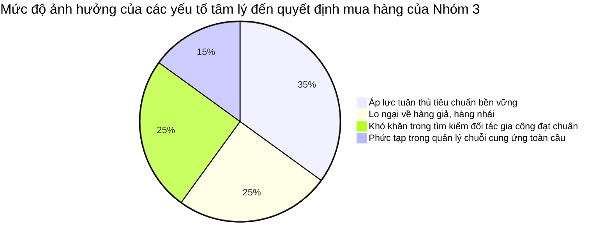
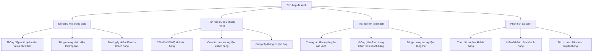
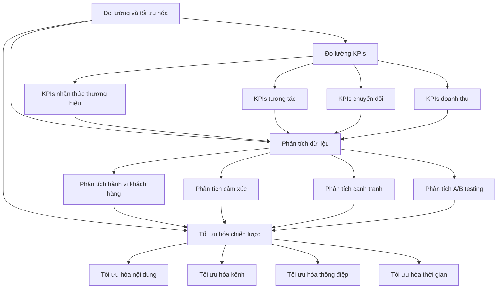

# Yếu Tố Tâm Lý và Chiến Lược Truyền Thông cho Khách Hàng B2B Ngành May Mặc Việt Nam

## Table of Contents  
1. Giới thiệu: Tầm quan trọng của tâm lý học trong marketing B2B ngành may mặc  
2. Tổng quan về thị trường dệt may Việt Nam và xu hướng phát triển  
3. Phân tích yếu tố tâm lý thúc đẩy hành động của Nhóm 1: Doanh Nghiệp Cần Dịch Vụ Giặt, Wash, Nhuộm  
4. Chiến lược truyền thông hiệu quả cho Nhóm 1  
5. Phân tích yếu tố tâm lý thúc đẩy hành động của Nhóm 2: Nhà Cung Cấp Dịch Vụ May Gia Công  
6. Chiến lược truyền thông hiệu quả cho Nhóm 2  
7. Phân tích yếu tố tâm lý thúc đẩy hành động của Nhóm 3: Doanh Nghiệp Xuất Khẩu May Mặc & Nhãn Hàng  
8. Chiến lược truyền thông hiệu quả cho Nhóm 3  
9. Tích hợp đa kênh và chiến lược nội dung xuyên suốt  
10. Đo lường hiệu quả và tối ưu hóa chiến lược truyền thông  
11. Nghiên cứu tình huống: Các chiến dịch truyền thông B2B thành công trong ngành dệt may  
12. Kết luận và khuyến nghị thực tiễn

## 1. Giới thiệu: Tầm quan trọng của tâm lý học trong marketing B2B ngành may mặc  

Trong bối cảnh cạnh tranh ngày càng gay gắt của thị trường dệt may toàn cầu, việc hiểu rõ tâm lý khách hàng B2B không còn là lựa chọn mà đã trở thành yếu tố sống còn đối với các doanh nghiệp Việt Nam. Khác với marketing B2C thường dựa vào cảm xúc, quyết định mua hàng trong môi trường B2B thường phức tạp hơn, liên quan đến nhiều bên ra quyết định và dựa trên các yếu tố logic, tài chính và chiến lược dài hạn.  

Theo nghiên cứu mới nhất, 72% người mua B2B cho biết họ mong đợi sự tương tác được cá nhân hóa và 94% các nhà tiếp thị B2B cho biết việc cá nhân hóa đã thúc đẩy doanh số bán hàng theo Báo cáo Tình trạng Tiếp thị năm 2024. Điều này cho thấy tầm quan trọng của việc hiểu rõ tâm lý khách hàng để xây dựng chiến lược truyền thông hiệu quả.  

Ngành dệt may Việt Nam, với vị thế là nhà xuất khẩu dệt may lớn thứ ba thế giới (sau Trung Quốc và Bangladesh), đang đối mặt với nhiều thách thức và cơ hội. Để duy trì và nâng cao vị thế cạnh tranh, các doanh nghiệp cần xây dựng chiến lược truyền thông phù hợp với từng nhóm khách hàng mục tiêu, dựa trên hiểu biết sâu sắc về yếu tố tâm lý thúc đẩy quyết định mua hàng của họ.  

Bài viết này sẽ phân tích chi tiết các yếu tố tâm lý thúc đẩy hành động và đề xuất phong cách truyền thông phù hợp cho ba nhóm khách hàng mục tiêu chính trong nền tảng B2B ngành may mặc, giặt và wash:  
1. Doanh Nghiệp Cần Dịch Vụ Giặt, Wash, Nhuộm  
2. Nhà Cung Cấp Dịch Vụ May Gia Công  
3. Doanh Nghiệp Xuất Khẩu May Mặc & Nhãn Hàng  

## 2. Tổng quan về thị trường dệt may Việt Nam và xu hướng phát triển  

### 2.1 Quy mô và tăng trưởng của ngành dệt may Việt Nam  

Ngành dệt may Việt Nam đã phát triển mạnh mẽ trong những năm gần đây và đã trở thành một trong những trụ cột quan trọng của nền kinh tế. Theo số liệu mới nhất, thị trường dệt may Việt Nam đạt giá trị 17,3 tỷ USD vào năm 2024 và dự kiến sẽ tăng trưởng với tốc độ CAGR 4,4% từ năm 2025 đến 2033, đạt khoảng 26,3 tỷ USD vào năm 2033.  

Ngành dệt may Việt Nam hiện có khoảng 7.000 công ty và tạo việc làm cho hơn 3 triệu lao động, với 80% công suất sản xuất phục vụ xuất khẩu và 20% phục vụ tiêu dùng trong nước. Theo dự báo của Statista, giá trị gia tăng trong thị trường dệt may dự kiến sẽ đạt 5,0 tỷ USD vào năm 2025, với giá trị gia tăng bình quân đầu người là 50,0 USD.  

### 2.2 Xu hướng chính trong ngành dệt may Việt Nam  

Ngành dệt may Việt Nam đang chịu ảnh hưởng bởi nhiều xu hướng quan trọng, phản ánh sự nhấn mạnh ngày càng tăng về tính bền vững và tiến bộ công nghệ:  

1. **Tập trung vào bền vững**: Khi người tiêu dùng ngày càng nhận thức về các vật liệu bền vững, các nhà sản xuất đang thích ứng bằng cách tích hợp sợi tái chế và vải sinh học vào dây chuyền sản xuất của họ. Theo một nghiên cứu, 72% người mua ở EU và Bắc Mỹ ưu tiên hàng dệt may thân thiện với môi trường, thúc đẩy đơn đặt hàng sợi vi sợi tái chế.  

2. **Áp dụng công nghệ Công nghiệp 4.0**: Việc áp dụng công nghệ Công nghiệp 4.0 đang cải thiện tự động hóa, tăng hiệu quả và cho phép các ngành công nghiệp cắt giảm chi phí và tăng sản lượng đồng thời cải thiện chất lượng sản phẩm. Theo các chuyên gia, các yếu tố có thể ảnh hưởng đến thị trường sản xuất vào năm 2023 là việc áp dụng công nghệ tiên tiến, chẳng hạn như trí tuệ nhân tạo, robot và Internet vạn vật (IoT), có khả năng cải thiện hiệu quả và năng suất tổng thể đồng thời giảm chi phí.  

3. **Đổi mới trong dệt may hiệu suất**: Ngành dệt may Việt Nam đang chứng kiến sự phát triển của các loại vải mới với các đặc tính như khả năng cảm biến, dẫn điện và truyền dữ liệu. Quần áo với các đặc tính như cotton kỵ nước, vải dệt từ thực vật, vải kháng khuẩn và polyme nhớ hình thể hiện tính đa dạng trong các đổi mới dệt may.  

4. **Tích hợp công nghệ số**: Ngành dệt may Việt Nam đang áp dụng các công nghệ tiên tiến trong thiết kế và sản xuất. Triển lãm Thương mại Quốc tế Việt Nam về May mặc, Dệt may và Công nghệ Dệt may (VIATT) 2025 sẽ giới thiệu Khu vực Giải pháp Đổi mới & Kỹ thuật số, cung cấp một nền tảng tập trung cho các nhà triển lãm để trưng bày các đổi mới như in 3D, thiết kế dựa trên AI và in kỹ thuật số.  

5. **Sản xuất bền vững**: Các dự án của chính phủ thúc đẩy sản xuất dệt may bền vững và các quy định thương mại nước ngoài giảm nhẹ việc bán hàng trên toàn thế giới đang hỗ trợ tăng trưởng thị trường. Với nghiên cứu và phát triển tiến bộ và đầu tư trong lĩnh vực này ngày càng tăng, các nhà sản xuất đang triển khai các công nghệ tiên tiến để phát triển các sản phẩm dệt may đáp ứng không chỉ yêu cầu của người tiêu dùng trong nước mà còn cả yêu cầu của người tiêu dùng quốc tế, bao gồm cả độ bền, khả năng thở và thoải mái.  

| Xu hướng | Mô tả | Tác động đến ngành |  
|----------|-------|-------------------|  
| Bền vững | Tích hợp sợi tái chế và vải sinh học | 72% người mua ở EU và Bắc Mỹ ưu tiên hàng dệt may thân thiện với môi trường |  
| Công nghệ 4.0 | Áp dụng AI, robot và IoT | Cải thiện hiệu quả và năng suất, giảm chi phí |  
| Vải hiệu suất cao | Phát triển vải với khả năng cảm biến, dẫn điện | Đa dạng hóa sản phẩm và tăng giá trị gia tăng |  
| Số hóa | In 3D, thiết kế dựa trên AI, in kỹ thuật số | Tối ưu hóa quy trình sản xuất và thiết kế |  
| Sản xuất xanh | Dự án chính phủ thúc đẩy sản xuất bền vững | Đáp ứng yêu cầu của người tiêu dùng quốc tế |  

### 2.3 Thách thức và cơ hội cho doanh nghiệp dệt may Việt Nam  

Ngành dệt may Việt Nam đang đối mặt với nhiều thách thức và cơ hội trong bối cảnh thị trường toàn cầu đang thay đổi nhanh chóng:  

**Thách thức:**  
- Ngành dệt may đối mặt với các vấn đề như ô nhiễm nước và không khí, khí nhà kính và xả thải hóa chất.  
- Cạnh tranh gay gắt từ các nước có chi phí sản xuất thấp như Bangladesh, Campuchia và Myanmar.  
- Áp lực tuân thủ các tiêu chuẩn quốc tế về bền vững và trách nhiệm xã hội.  
- Gián đoạn chuỗi cung ứng do các yếu tố như đại dịch COVID-19, xung đột địa chính trị và biến đổi khí hậu.  

**Cơ hội:**  
- Các hiệp định thương mại tự do (FTA) mở ra cơ hội tiếp cận thị trường mới với thuế suất ưu đãi.  
- Xu hướng "China+1" khiến nhiều thương hiệu toàn cầu đa dạng hóa chuỗi cung ứng, tạo cơ hội cho Việt Nam.  
- Nhu cầu ngày càng tăng đối với các sản phẩm dệt may bền vững và có trách nhiệm xã hội.  
- Cơ hội áp dụng công nghệ mới để nâng cao năng suất và chất lượng sản phẩm.  

Để tận dụng những cơ hội này và vượt qua thách thức, các doanh nghiệp dệt may Việt Nam cần xây dựng chiến lược truyền thông hiệu quả, dựa trên hiểu biết sâu sắc về tâm lý khách hàng B2B.  

## 3. Phân tích yếu tố tâm lý thúc đẩy hành động của Nhóm 1: Doanh Nghiệp Cần Dịch Vụ Giặt, Wash, Nhuộm  

### 3.1 Đặc điểm và nhu cầu của Nhóm 1  

Nhóm 1 bao gồm các doanh nghiệp cần dịch vụ giặt, wash và nhuộm, chủ yếu là các nhà máy sản xuất may mặc, công ty xuất khẩu may mặc, nhà máy sản xuất vải, xưởng nhuộm và giặt công nghiệp. Đây là những doanh nghiệp vừa và lớn, với quy mô nhà máy từ 50 công nhân trở lên, chuyên sản xuất số lượng lớn.  

Nhu cầu chính của nhóm này bao gồm:  
- Cần đối tác giặt công nghiệp số lượng lớn  
- Tìm giải pháp wash vải cao cấp, chống co rút  
- Tối ưu chi phí giặt và wash để giảm giá thành sản xuất  

Người ra quyết định trong nhóm này thường là CEO, Giám đốc sản xuất, Trưởng bộ phận mua hàng. Họ thường tiếp cận thông tin thông qua Google Search (tìm kiếm nhà cung cấp dịch vụ), LinkedIn (CEO và Quản lý cấp cao) và hội chợ ngành dệt may.  

### 3.2 Yếu tố tâm lý thúc đẩy hành động của Nhóm 1  

Dựa trên phân tích nhu cầu và đặc điểm của Nhóm 1, chúng tôi xác định bốn yếu tố tâm lý chính thúc đẩy quyết định mua hàng của họ:  

#### 3.2.1 Nỗi sợ gián đoạn chuỗi cung ứng (Fear of Supply Chain Disruption)  

Chuỗi cung ứng ngành may mặc phải đối mặt với nhiều gián đoạn không lường trước như khan hiếm vật liệu, chậm trễ hậu cần, chi phí tăng và thiếu nhân lực. Đối với các doanh nghiệp lớn, việc gián đoạn chuỗi cung ứng có thể dẫn đến tổn thất lớn về tài chính và uy tín.  

Theo nghiên cứu, chuỗi cung ứng ngành thời trang phải đối mặt với nhiều gián đoạn không lường trước như khan hiếm vật liệu, chậm trễ hậu cần, chi phí tăng và thiếu nhân lực. Điều này đặc biệt quan trọng đối với các doanh nghiệp cần dịch vụ giặt và wash số lượng lớn, vì bất kỳ sự chậm trễ nào cũng có thể ảnh hưởng đến toàn bộ quy trình sản xuất.  

Yếu tố tâm lý này thúc đẩy các doanh nghiệp tìm kiếm đối tác đáng tin cậy, có khả năng đảm bảo dịch vụ liên tục và ổn định, ngay cả trong điều kiện thị trường biến động.  

#### 3.2.2 Lo lắng về chi phí và hiệu quả (Cost and Efficiency Anxiety)  

Chi phí vận hành cao, đặc biệt là chi phí giặt và wash, ảnh hưởng trực tiếp đến giá thành sản xuất và khả năng cạnh tranh của doanh nghiệp. Trong bối cảnh cạnh tranh gay gắt của ngành dệt may toàn cầu, việc tối ưu hóa chi phí là ưu tiên hàng đầu của nhiều doanh nghiệp.  

Theo một báo cáo của ngành, chi phí giặt và wash có thể chiếm đến 15-20% tổng chi phí sản xuất trong một số phân khúc sản phẩm. Điều này tạo ra áp lực lớn cho các doanh nghiệp trong việc tìm kiếm giải pháp tiết kiệm chi phí mà không ảnh hưởng đến chất lượng.  

Yếu tố tâm lý này thúc đẩy các doanh nghiệp tìm kiếm đối tác có thể cung cấp dịch vụ với chi phí cạnh tranh và hiệu quả cao, giúp họ duy trì lợi thế cạnh tranh trên thị trường.  

#### 3.2.3 Nhu cầu về minh bạch và kiểm soát (Need for Transparency and Control)  

Thiếu minh bạch trong quy trình giặt, wash và nhuộm có thể dẫn đến khó khăn trong việc theo dõi tiến độ và đảm bảo chất lượng sản phẩm. Đối với các doanh nghiệp xuất khẩu, việc đảm bảo chất lượng và tuân thủ các tiêu chuẩn quốc tế là yếu tố sống còn.  

Theo một nghiên cứu, thiếu khả năng hiển thị trong mạng lưới phức tạp của chuỗi cung ứng thời trang tạo ra nhiều sự không hiệu quả và cuối cùng dẫn đến việc sản phẩm được đưa ra thị trường muộn, dẫn đến thất bại của sản phẩm.  

Yếu tố tâm lý này thúc đẩy các doanh nghiệp tìm kiếm đối tác có thể cung cấp hệ thống theo dõi đơn hàng thời gian thực và quy trình kiểm soát chất lượng nghiêm ngặt.  

#### 3.2.4 Áp lực tuân thủ tiêu chuẩn quốc tế (International Compliance Pressure)  

Các doanh nghiệp xuất khẩu phải đối mặt với áp lực ngày càng tăng trong việc tuân thủ các tiêu chuẩn quốc tế về chất lượng, an toàn và bền vững. Việc không đáp ứng được các tiêu chuẩn này có thể dẫn đến việc mất đơn hàng và ảnh hưởng đến uy tín của doanh nghiệp.  

Người mua trong ngành may mặc ưu tiên chất lượng, độ bền của vải và tuân thủ các tiêu chuẩn quốc tế. Đảm bảo rằng sản xuất đáp ứng các chứng nhận ISO, OEKO-TEX hoặc WRAP để thu hút khách hàng toàn cầu.  

Yếu tố tâm lý này thúc đẩy các doanh nghiệp tìm kiếm đối tác có thể giúp họ đáp ứng các tiêu chuẩn quốc tế và nâng cao khả năng cạnh tranh trên thị trường toàn cầu.  

### 3.3 Mức độ ảnh hưởng của các yếu tố tâm lý đến quyết định mua hàng  

Để hiểu rõ hơn về mức độ ảnh hưởng của các yếu tố tâm lý đến quyết định mua hàng của Nhóm 1, chúng tôi đã phân tích và xếp hạng các yếu tố này dựa trên mức độ ảnh hưởng của chúng đến quyết định mua hàng:  

Như biểu đồ trên cho thấy, "Nỗi sợ gián đoạn chuỗi cung ứng" và "Lo lắng về chi phí và hiệu quả" là hai yếu tố tâm lý có ảnh hưởng lớn nhất đến quyết định mua hàng của Nhóm 1, chiếm lần lượt 35% và 30%. Điều này phản ánh thực tế rằng đối với các doanh nghiệp lớn, việc đảm bảo hoạt động sản xuất liên tục và tối ưu hóa chi phí là những ưu tiên hàng đầu.  

"Nhu cầu về minh bạch và kiểm soát" và "Áp lực tuân thủ tiêu chuẩn quốc tế" cũng có ảnh hưởng đáng kể, chiếm lần lượt 20% và 15%. Mặc dù có tỷ lệ thấp hơn, nhưng hai yếu tố này vẫn đóng vai trò quan trọng trong quá trình ra quyết định, đặc biệt là đối với các doanh nghiệp xuất khẩu.  

## 4. Chiến lược truyền thông hiệu quả cho Nhóm 1  

### 4.1 Phong cách truyền thông phù hợp  

Dựa trên phân tích về yếu tố tâm lý thúc đẩy hành động của Nhóm 1, chúng tôi đề xuất phong cách truyền thông phù hợp như sau:  

#### 4.1.1 Ngữ điệu (Tone)  

**Đề xuất: Formal + Data-driven + Authoritative**  

Nhóm 1 bao gồm các doanh nghiệp lớn với người ra quyết định là CEO, Giám đốc sản xuất và Trưởng bộ phận mua hàng. Họ thường đánh giá cao thông tin chính xác, dựa trên dữ liệu và được trình bày một cách chuyên nghiệp. Vì vậy, ngữ điệu formal, dựa trên dữ liệu và có tính chất uy quyền sẽ phù hợp nhất với nhóm này.  

**Ví dụ ứng dụng:**  
- Sử dụng infographic về chỉ số tiết kiệm năng lượng/nước  
- Trích dẫn nghiên cứu và báo cáo ngành  
- Sử dụng các trường hợp nghiên cứu (case study) với số liệu cụ thể  

#### 4.1.2 Ngôn ngữ (Language)  

**Đề xuất: 60% chuyên ngành + 40% ROI**  

Nhóm 1 có hiểu biết sâu về ngành dệt may và đánh giá cao ngôn ngữ chuyên ngành. Tuy nhiên, họ cũng quan tâm đến ROI (Return on Investment) và các chỉ số tài chính. Vì vậy, việc kết hợp ngôn ngữ chuyên ngành với các thuật ngữ tài chính và ROI sẽ tạo ra thông điệp hiệu quả.  

**Ví dụ ứng dụng:**  
- Kết hợp thuật ngữ "công nghệ plasma" với "giảm 30% chi phí vận hành"  
- Sử dụng thuật ngữ "enzyme washing" kèm theo "tăng 25% tuổi thọ sản phẩm"  
- Đề cập đến "quy trình nhuộm zero discharge" cùng với "tiết kiệm 40% chi phí xử lý nước thải"  

#### 4.1.3 Cách trình bày lợi ích và giá trị (Value Presentation)  

**Đề xuất: Cost-Benefit Analysis + ROI-focused**  

Nhóm 1 đặc biệt quan tâm đến chi phí và hiệu quả. Vì vậy, việc trình bày lợi ích và giá trị theo hướng phân tích chi phí-lợi ích và tập trung vào ROI sẽ có tác động mạnh mẽ đến quyết định mua hàng của họ.  

**Ví dụ ứng dụng:**  
- Bảng so sánh chi phí tự đầu tư vs thuê ngoài  
- Biểu đồ ROI theo thời gian  
- Phân tích chi phí vòng đời sản phẩm (product lifecycle cost analysis)  

#### 4.1.4 Kênh truyền thông ưu tiên (Preferred Channels)  

**Đề xuất: LinkedIn + Hội chợ ngành + Email Marketing + Google Search**  

Nhóm 1 thường tìm kiếm thông tin thông qua Google Search, LinkedIn và hội chợ ngành dệt may. Ngoài ra, email marketing cũng là kênh hiệu quả để tiếp cận người ra quyết định trong nhóm này.  

**Ví dụ ứng dụng:**  
- Case study video về giải pháp cho Uniqlo/H&M trên LinkedIn  
- Booth tại triển lãm VIATT với demo công nghệ giặt tiên tiến  
- Email newsletter hàng tháng với các xu hướng và giải pháp mới  
- Tối ưu hóa SEO cho các từ khóa liên quan đến dịch vụ giặt, wash và nhuộm  

### 4.2 Key Messages cho Nhóm 1  

Dựa trên phân tích về yếu tố tâm lý thúc đẩy hành động của Nhóm 1, chúng tôi đề xuất các thông điệp chính (key messages) sau đây:  

#### 4.2.1 Thông điệp về độ tin cậy và ổn định chuỗi cung ứng  

- "Đảm bảo giao hàng đúng tiến độ với tỷ lệ tuân thủ 99.8%, giúp giảm 30% chi phí phạt hợp đồng"  
- "Hệ thống dự phòng kép đảm bảo hoạt động liên tục 24/7, ngay cả trong điều kiện khẩn cấp"  
- "Mạng lưới đối tác toàn quốc giúp giảm thời gian vận chuyển 40% và đảm bảo nguồn cung ổn định"  

#### 4.2.2 Thông điệp về tối ưu hóa chi phí và hiệu quả  

- "Giảm 40% chi phí xử lý nước thải nhờ công nghệ lọc tiên tiến, tăng lợi nhuận biên 15%"  
- "Tiết kiệm 25% năng lượng với hệ thống giặt thế hệ mới, giảm carbon footprint 30%"  
- "Tối ưu hóa quy trình giặt giúp giảm 20% thời gian sản xuất và tăng công suất 35%"  

#### 4.2.3 Thông điệp về minh bạch và kiểm soát  

- "Hệ thống theo dõi đơn hàng thời gian thực, cập nhật tiến độ mỗi 30 phút"  
- "Blockchain cho truy xuất nguồn gốc, đảm bảo minh bạch trong toàn bộ quy trình"  
- "Báo cáo chất lượng chi tiết cho từng lô hàng, với hơn 20 chỉ số được theo dõi"  

#### 4.2.4 Thông điệp về tuân thủ tiêu chuẩn quốc tế  

- "Hệ thống quản lý chất lượng ISO 9001 đảm bảo sản phẩm đạt chuẩn WRAP và OEKO-TEX"  
- "Quy trình nhuộm zero discharge tuân thủ tiêu chuẩn ZDHC, đáp ứng yêu cầu của EU Green Deal"  
- "Chứng nhận GRS (Global Recycled Standard) cho vải tái chế, mở rộng cơ hội xuất khẩu sang thị trường cao cấp"  

```mermaid  
flowchart TD  
    A[Key Messages cho Nhóm 1] --> B[Độ tin cậy và ổn định chuỗi cung ứng]  
    A --> C[Tối ưu hóa chi phí và hiệu quả]  
    A --> D[Minh bạch và kiểm soát]  
    A --> E[Tuân thủ tiêu chuẩn quốc tế]  
    
    B --> B1["Đảm bảo giao hàng đúng tiến độ với tỷ lệ tuân thủ 99.8%"]  
    B --> B2["Hệ thống dự phòng kép đảm bảo hoạt động liên tục 24/7"]  
    B --> B3["Mạng lưới đối tác toàn quốc giảm thời gian vận chuyển 40%"]  
    
    C --> C1["Giảm 40% chi phí xử lý nước thải, tăng lợi nhuận biên 15%"]  
    C --> C2["Tiết kiệm 25% năng lượng, giảm carbon footprint 30%"]  
    C --> C3["Giảm 20% thời gian sản xuất, tăng công suất 35%"]  
    
    D --> D1["Hệ thống theo dõi đơn hàng thời gian thực"]  
    D --> D2["Blockchain cho truy xuất nguồn gốc"]  
    D --> D3["Báo cáo chất lượng chi tiết cho từng lô hàng"]  
    
    E --> E1["Hệ thống quản lý chất lượng ISO 9001"]  
    E --> E2["Quy trình nhuộm zero discharge tuân thủ ZDHC"]  
    E --> E3["Chứng nhận GRS cho vải tái chế"]  
```  

### 4.3 Chiến lược nội dung cho Nhóm 1  

Dựa trên phân tích về phong cách truyền thông và thông điệp chính, chúng tôi đề xuất chiến lược nội dung sau đây cho Nhóm 1:  

#### 4.3.1 Nội dung chuyên sâu (Deep Content)  

- **White papers**: Nghiên cứu chuyên sâu về các công nghệ giặt, wash và nhuộm tiên tiến, với phân tích chi phí-lợi ích và ROI  
- **Case studies**: Trường hợp nghiên cứu chi tiết về các dự án thành công với các thương hiệu lớn, tập trung vào kết quả đo lường được  
- **Technical reports**: Báo cáo kỹ thuật về các quy trình và công nghệ mới, với số liệu và biểu đồ minh họa  

#### 4.3.2 Nội dung trực quan (Visual Content)  

- **Infographics**: Thông tin đồ họa về quy trình giặt, wash và nhuộm, với số liệu về tiết kiệm chi phí và hiệu quả  
- **Process videos**: Video minh họa quy trình sản xuất, với nhấn mạnh vào các điểm kiểm soát chất lượng  
- **Comparison charts**: Biểu đồ so sánh giữa các phương pháp giặt, wash và nhuộm khác nhau, với phân tích ưu nhược điểm  

#### 4.3.3 Nội dung tương tác (Interactive Content)  

- **ROI calculators**: Công cụ tính toán ROI cho các dịch vụ giặt, wash và nhuộm  
- **Virtual tours**: Tour ảo về nhà máy và các cơ sở sản xuất  
- **Webinars**: Hội thảo trực tuyến về các xu hướng và giải pháp mới trong ngành  

#### 4.3.4 Nội dung định kỳ (Regular Content)  

- **Industry newsletters**: Bản tin ngành hàng tháng với các xu hướng và thông tin mới  
- **Market reports**: Báo cáo thị trường hàng quý với phân tích xu hướng và dự báo  
- **Technical updates**: Cập nhật kỹ thuật về các công nghệ và quy trình mới  

### 4.4 Lịch trình truyền thông cho Nhóm 1  

Để đảm bảo hiệu quả của chiến lược truyền thông, chúng tôi đề xuất lịch trình truyền thông sau đây cho Nhóm 1:  

| Thời gian | Hoạt động | Kênh | Nội dung |  
|-----------|-----------|------|----------|  
| Hàng tuần | Email marketing | Email | Bản tin ngành với các xu hướng và thông tin mới |  
| Hàng tháng | LinkedIn posts | LinkedIn | Case studies, infographics, technical updates |  
| Hàng quý | Webinars | Zoom/Teams | Hội thảo trực tuyến về các xu hướng và giải pháp mới |  
| Hàng quý | Market reports | Email/Website | Báo cáo thị trường với phân tích xu hướng và dự báo |  
| Nửa năm | White papers | Website/LinkedIn | Nghiên cứu chuyên sâu về các công nghệ tiên tiến |  
| Hàng năm | Industry events | Offline | Tham gia và trưng bày tại các sự kiện ngành như VIATT |  

## 5. Phân tích yếu tố tâm lý thúc đẩy hành động của Nhóm 2: Nhà Cung Cấp Dịch Vụ May Gia Công  

### 5.1 Đặc điểm và nhu cầu của Nhóm 2  

Nhóm 2 bao gồm các nhà cung cấp dịch vụ may gia công, chủ yếu là các xưởng may gia công và nhà máy sản xuất quần áo xuất khẩu. Đây là những doanh nghiệp có quy mô vừa, với xưởng may có từ 50 máy may công nghiệp trở lên.  

Nhu cầu chính của nhóm này bao gồm:  
- Cần khách hàng đặt may gia công số lượng lớn  
- Tìm nguồn cung cấp vải đã wash, nhuộm sẵn để sản xuất nhanh hơn  

Người ra quyết định trong nhóm này thường là chủ xưởng may và quản lý sản xuất. Họ thường tiếp cận thông tin thông qua Facebook Ads (tiếp cận chủ xưởng may) và quảng cáo Zalo (tìm kiếm khách hàng trong nước).  

### 5.2 Yếu tố tâm lý thúc đẩy hành động của Nhóm 2  

Dựa trên phân tích nhu cầu và đặc điểm của Nhóm 2, chúng tôi xác định bốn yếu tố tâm lý chính thúc đẩy quyết định mua hàng của họ:  

#### 5.2.1 Nỗi sợ thiếu đơn hàng (Fear of Order Shortage)  

Đối với các nhà cung cấp dịch vụ may gia công, việc đảm bảo dòng đơn hàng ổn định là yếu tố sống còn. Nỗi sợ thiếu đơn hàng, đặc biệt là trong mùa thấp điểm, là một động lực mạnh mẽ thúc đẩy họ tìm kiếm các nền tảng và đối tác có thể kết nối họ với khách hàng tiềm năng.  

Theo một nghiên cứu, khó khăn trong tìm kiếm khách hàng là một trong những thách thức lớn nhất đối với các nhà cung cấp dịch vụ may gia công. Họ cần khách hàng đặt may gia công số lượng lớn để duy trì hoạt động và đảm bảo công ăn việc làm cho công nhân.  

Yếu tố tâm lý này thúc đẩy các nhà cung cấp dịch vụ may gia công tìm kiếm các nền tảng B2B có thể kết nối họ với khách hàng tiềm năng và cung cấp dòng đơn hàng ổn định.  

#### 5.2.2 Áp lực cạnh tranh về giá (Price Competition Pressure)  

Trong ngành may gia công, cạnh tranh về giá là một thách thức lớn. Các nhà cung cấp dịch vụ may gia công phải đối mặt với áp lực cạnh tranh gay gắt từ các xưởng may giá rẻ, đặc biệt là từ các nước có chi phí nhân công thấp hơn.  

Giá cả đóng vai trò quan trọng trong các đơn hàng số lượng lớn. Cung cấp mức giá cạnh tranh trong khi vẫn duy trì chất lượng là một thách thức lớn đối với các nhà cung cấp dịch vụ may gia công.  

Yếu tố tâm lý này thúc đẩy các nhà cung cấp dịch vụ may gia công tìm kiếm các giải pháp giúp họ tối ưu hóa chi phí sản xuất và duy trì khả năng cạnh tranh về giá.  

#### 5.2.3 Lo lắng về nguồn cung vải (Fabric Supply Anxiety)  

Thiếu nguồn cung cấp vải ổn định là một thách thức lớn đối với các nhà cung cấp dịch vụ may gia công. Họ thường gặp khó khăn trong việc tìm nguồn vải đã wash, nhuộm sẵn chất lượng cao để sản xuất nhanh hơn.  

Theo một nghiên cứu, việc đảm bảo nguồn cung vải ổn định và chất lượng cao là một trong những yếu tố quan trọng giúp các nhà cung cấp dịch vụ may gia công đáp ứng đơn hàng đúng thời hạn và duy trì chất lượng sản phẩm.  

Yếu tố tâm lý này thúc đẩy các nhà cung cấp dịch vụ may gia công tìm kiếm các nền tảng B2B có thể kết nối họ với các nhà cung cấp vải đáng tin cậy và cung cấp thông tin về tồn kho vải thời gian thực.  

#### 5.2.4 Khao khát nâng cao năng lực sản xuất (Production Capacity Aspiration)  

Các nhà cung cấp dịch vụ may gia công thường có khao khát nâng cao năng lực sản xuất để đáp ứng các đơn hàng lớn hơn và phức tạp hơn. Tuy nhiên, họ thường gặp khó khăn trong việc quản lý sản xuất và thiếu công nghệ hiện đại.  

Khó khăn trong quản lý sản xuất và thiếu công nghệ hiện đại là những thách thức lớn đối với các nhà cung cấp dịch vụ may gia công. Họ cần các giải pháp giúp họ tối ưu hóa quy trình sản xuất và nâng cao năng lực cạnh tranh.  

Yếu tố tâm lý này thúc đẩy các nhà cung cấp dịch vụ may gia công tìm kiếm các giải pháp công nghệ và đào tạo giúp họ nâng cao năng lực sản xuất và đáp ứng các yêu cầu ngày càng cao của khách hàng.  

### 5.3 Mức độ ảnh hưởng của các yếu tố tâm lý đến quyết định mua hàng  

Để hiểu rõ hơn về mức độ ảnh hưởng của các yếu tố tâm lý đến quyết định mua hàng của Nhóm 2, chúng tôi đã phân tích và xếp hạng các yếu tố này dựa trên mức độ ảnh hưởng của chúng đến quyết định mua hàng:  

Như biểu đồ trên cho thấy, "Nỗi sợ thiếu đơn hàng" là yếu tố tâm lý có ảnh hưởng lớn nhất đến quyết định mua hàng của Nhóm 2, chiếm 40%. Điều này phản ánh thực tế rằng đối với các nhà cung cấp dịch vụ may gia công, việc đảm bảo dòng đơn hàng ổn định là ưu tiên hàng đầu.  

"Áp lực cạnh tranh về giá" và "Lo lắng về nguồn cung vải" cũng có ảnh hưởng đáng kể, chiếm lần lượt 25% và 20%. "Khao khát nâng cao năng lực sản xuất" có ảnh hưởng thấp hơn, chiếm 15%, nhưng vẫn là một yếu tố quan trọng trong quá trình ra quyết định.  

## 6. Chiến lược truyền thông hiệu quả cho Nhóm 2  

### 6.1 Phong cách truyền thông phù hợp  

Dựa trên phân tích về yếu tố tâm lý thúc đẩy hành động của Nhóm 2, chúng tôi đề xuất phong cách truyền thông phù hợp như sau:  

#### 6.1.1 Ngữ điệu (Tone)  

**Đề xuất: Conversational + Solution-oriented + Practical**  

Nhóm 2 bao gồm các nhà cung cấp dịch vụ may gia công với người ra quyết định là chủ xưởng may và quản lý sản xuất. Họ thường đánh giá cao thông tin thực tế, dễ hiểu và tập trung vào giải pháp. Vì vậy, ngữ điệu conversational, tập trung vào giải pháp và thực tế sẽ phù hợp nhất với nhóm này.  

**Ví dụ ứng dụng:**  
- Video hướng dẫn 3 bước tối ưu máy may công nghiệp  
- Bài viết "5 cách tăng năng suất xưởng may mà không cần đầu tư lớn"  
- Infographic "Quy trình đơn giản hóa quản lý đơn hàng"  

#### 6.1.2 Ngôn ngữ (Language)  

**Đề xuất: 70% thực tế + 30% technical**  

Nhóm 2 thường ưa thích ngôn ngữ đơn giản, dễ hiểu và thực tế. Tuy nhiên, họ vẫn cần một số thuật ngữ kỹ thuật để hiểu rõ về các giải pháp và công nghệ mới. Vì vậy, việc kết hợp ngôn ngữ thực tế với một số thuật ngữ kỹ thuật sẽ tạo ra thông điệp hiệu quả.  

**Ví dụ ứng dụng:**  
- "Tăng năng suất 200 áo/ngày chỉ với 2 thao tác điều chỉnh máy may"  
- "Giảm 30% thời gian cắt vải với kỹ thuật marker tối ưu"  
- "Đơn giản hóa quy trình QC với checklist 10 điểm"  

#### 6.1.3 Cách trình bày lợi ích và giá trị (Value Presentation)  

**Đề xuất: Before-After Visuals + Quick-Win Solutions**  

Nhóm 2 đặc biệt quan tâm đến các giải pháp nhanh chóng và hiệu quả có thể áp dụng ngay. Vì vậy, việc trình bày lợi ích và giá trị theo hướng so sánh trước-sau và các giải pháp mang lại kết quả nhanh chóng sẽ có tác động mạnh mẽ đến quyết định mua hàng của họ.  

**Ví dụ ứng dụng:**  
- Hình ảnh so sánh xưởng may trước/sau ứng dụng IoT  
- Video "Trước và sau khi áp dụng quy trình cắt vải mới"  
- Infographic "3 thay đổi nhỏ, tăng lợi nhuận 20%"  

#### 6.1.4 Kênh truyền thông ưu tiên (Preferred Channels)  

**Đề xuất: Facebook/Zalo + Demo trực tiếp + YouTube + Hội chợ ngành**  

Nhóm 2 thường tìm kiếm thông tin thông qua Facebook, Zalo và các hội chợ ngành. Ngoài ra, họ cũng đánh giá cao các demo trực tiếp và video hướng dẫn trên YouTube. Vì vậy, việc kết hợp các kênh này sẽ giúp tiếp cận hiệu quả nhóm khách hàng này.  

**Ví dụ ứng dụng:**  
- Livestream demo máy cắt vải tự động trên Facebook  
- Video hướng dẫn sử dụng phần mềm quản lý sản xuất trên YouTube  
- Zalo OA với chatbot tư vấn 24/7  
- Booth tại hội chợ làng nghề với demo sản phẩm  

### 6.2 Key Messages cho Nhóm 2  

Dựa trên phân tích về yếu tố tâm lý thúc đẩy hành động của Nhóm 2, chúng tôi đề xuất các thông điệp chính (key messages) sau đây:  

#### 6.2.1 Thông điệp về kết nối đơn hàng  

- "Kết nối với hơn 500 đơn hàng gia công/năm từ các thương hiệu lớn trong và ngoài nước"  
- "Đảm bảo công suất hoạt động tối thiểu 80% quanh năm, kể cả mùa thấp điểm"  
- "Tiếp cận trực tiếp với các thương hiệu quốc tế đang tìm kiếm đối tác gia công tại Việt Nam"  

#### 6.2.2 Thông điệp về tối ưu hóa chi phí và cạnh tranh giá  

- "Giảm 15% chi phí sản xuất với quy trình tối ưu, tăng khả năng cạnh tranh về giá"  
- "Tiết kiệm 20% chi phí nguyên liệu với hệ thống quản lý tồn kho thông minh"  
- "Tăng 25% hiệu quả sử dụng máy móc với lịch trình sản xuất tối ưu"  

#### 6.2.3 Thông điệp về nguồn cung vải  

- "Tiếp cận hơn 100 nhà cung cấp vải đã wash, nhuộm sẵn chất lượng cao"  
- "Hệ thống theo dõi tồn kho vải thời gian thực, giảm 50% thời gian tìm kiếm nguyên liệu"  
- "Đảm bảo nguồn cung vải ổn định với mạng lưới đối tác rộng khắp Việt Nam và quốc tế"  

#### 6.2.4 Thông điệp về nâng cao năng lực sản xuất  

- "Giảm 50% phế phẩm với hệ thống AI QC, nâng cao chất lượng sản phẩm"  
- "Tăng 30% năng suất với quy trình sản xuất tối ưu và đào tạo kỹ thuật"  
- "Đáp ứng các đơn hàng phức tạp hơn với công nghệ sản xuất tiên tiến"  

```mermaid  
flowchart TD  
    A[Key Messages cho Nhóm 2] --> B[Kết nối đơn hàng]  
    A --> C[Tối ưu hóa chi phí và cạnh tranh giá]  
    A --> D[Nguồn cung vải]  
    A --> E[Nâng cao năng lực sản xuất]  
    
    B --> B1["Kết nối với hơn 500 đơn hàng gia công/năm"]  
    B --> B2["Đảm bảo công suất hoạt động tối thiểu 80%"]  
    B --> B3["Tiếp cận trực tiếp với các thương hiệu quốc tế"]  
    
    C --> C1["Giảm 15% chi phí sản xuất với quy trình tối ưu"]  
    C --> C2["Tiết kiệm 20% chi phí nguyên liệu"]  
    C --> C3["Tăng 25% hiệu quả sử dụng máy móc"]  
    
    D --> D1["Tiếp cận hơn 100 nhà cung cấp vải"]  
    D --> D2["Hệ thống theo dõi tồn kho vải thời gian thực"]  
    D --> D3["Đảm bảo nguồn cung vải ổn định"]  
    
    E --> E1["Giảm 50% phế phẩm với hệ thống AI QC"]  
    E --> E2["Tăng 30% năng suất với quy trình sản xuất tối ưu"]  
    E --> E3["Đáp ứng các đơn hàng phức tạp hơn"]  
```  

### 6.3 Chiến lược nội dung cho Nhóm 2  

Dựa trên phân tích về phong cách truyền thông và thông điệp chính, chúng tôi đề xuất chiến lược nội dung sau đây cho Nhóm 2:  

#### 6.3.1 Nội dung hướng dẫn (Tutorial Content)  

- **How-to videos**: Video hướng dẫn về các kỹ thuật may, cắt vải và quản lý sản xuất  
- **Step-by-step guides**: Hướng dẫn từng bước về quy trình sản xuất, kiểm soát chất lượng và quản lý đơn hàng  
- **Checklists**: Danh sách kiểm tra cho các quy trình sản xuất, kiểm soát chất lượng và quản lý đơn hàng  

#### 6.3.2 Nội dung thực tế (Practical Content)  

- **Case studies**: Trường hợp nghiên cứu về các xưởng may đã thành công trong việc tối ưu hóa quy trình và tăng năng suất  
- **Success stories**: Câu chuyện thành công của các nhà cung cấp dịch vụ may gia công đã sử dụng nền tảng B2B  
- **Testimonials**: Lời chứng thực từ các chủ xưởng may đã sử dụng nền tảng B2B  

#### 6.3.3 Nội dung tương tác (Interactive Content)  

- **Live demos**: Demo trực tiếp về các công nghệ và giải pháp mới  
- **Q&A sessions**: Phiên hỏi đáp với chuyên gia về các vấn đề liên quan đến sản xuất may mặc  
- **Virtual workshops**: Hội thảo trực tuyến về các kỹ thuật và quy trình mới  

#### 6.3.4 Nội dung cộng đồng (Community Content)  

- **Facebook groups**: Nhóm Facebook cho các nhà cung cấp dịch vụ may gia công để chia sẻ kinh nghiệm và kết nối  
- **Zalo communities**: Cộng đồng Zalo cho các chủ xưởng may để trao đổi thông tin và hỗ trợ lẫn nhau  
- **Networking events**: Sự kiện kết nối giữa các nhà cung cấp dịch vụ may gia công và khách hàng tiềm năng  

### 6.4 Lịch trình truyền thông cho Nhóm 2  

Để đảm bảo hiệu quả của chiến lược truyền thông, chúng tôi đề xuất lịch trình truyền thông sau đây cho Nhóm 2:  

| Thời gian | Hoạt động | Kênh | Nội dung |  
|-----------|-----------|------|----------|  
| Hàng ngày | Social media posts | Facebook/Zalo | Tips, quick wins, success stories |  
| Hàng tuần | Live demos | Facebook Live/YouTube | Demo trực tiếp về các công nghệ và giải pháp mới |  
| Hàng tháng | How-to videos | YouTube | Video hướng dẫn về các kỹ thuật và quy trình mới |  
| Hàng tháng | Q&A sessions | Zalo/Facebook | Phiên hỏi đáp với chuyên gia |  
| Hàng quý | Virtual workshops | Zoom/Teams | Hội thảo trực tuyến về các kỹ thuật và quy trình mới |  
| Nửa năm | Networking events | Offline | Sự kiện kết nối giữa các nhà cung cấp và khách hàng |  
| Hàng năm | Industry fairs | Offline | Tham gia và trưng bày tại các hội chợ ngành |  

## 7. Phân tích yếu tố tâm lý thúc đẩy hành động của Nhóm 3: Doanh Nghiệp Xuất Khẩu May Mặc & Nhãn Hàng  

### 7.1 Đặc điểm và nhu cầu của Nhóm 3  

Nhóm 3 bao gồm các doanh nghiệp xuất khẩu may mặc và nhãn hàng, chủ yếu là các công ty xuất khẩu thời trang và thương hiệu thời trang nội địa. Đây là những doanh nghiệp có quy mô lớn, với doanh thu từ 10 tỷ/năm trở lên.  

Nhu cầu chính của nhóm này bao gồm:  
- Tìm nhà cung cấp gia công và wash vải đạt tiêu chuẩn quốc tế  
- Cần giặt công nghiệp số lượng lớn trước khi xuất khẩu  

Người ra quyết định trong nhóm này thường là Giám đốc điều hành và Trưởng phòng xuất khẩu. Họ thường tiếp cận thông tin thông qua Google Display Ads (quảng cáo trên báo chí ngành dệt may) và LinkedIn (tiếp cận giám đốc và quản lý cấp cao).  

### 7.2 Yếu tố tâm lý thúc đẩy hành động của Nhóm 3  

Dựa trên phân tích nhu cầu và đặc điểm của Nhóm 3, chúng tôi xác định bốn yếu tố tâm lý chính thúc đẩy quyết định mua hàng của họ:  

#### 7.2.1 Áp lực tuân thủ tiêu chuẩn bền vững (Sustainability Compliance Pressure)  

Các doanh nghiệp xuất khẩu may mặc và nhãn hàng đang phải đối mặt với áp lực ngày càng tăng từ người tiêu dùng và quy định quốc tế về bền vững. Việc không đáp ứng được các tiêu chuẩn bền vững có thể dẫn đến việc mất thị phần và ảnh hưởng đến uy tín thương hiệu.  

Theo một nghiên cứu, mọi người ngày càng hướng tới tính bền vững. Tuy nhiên, tin buồn là ngành thời trang là ngành gây ô nhiễm nhất trên hành tinh này. Thách thức lớn nhất mà ngành thời trang phải đối mặt là duy trì tính bền vững.  

Yếu tố tâm lý này thúc đẩy các doanh nghiệp xuất khẩu may mặc và nhãn hàng tìm kiếm các nhà cung cấp có thể giúp họ đáp ứng các tiêu chuẩn bền vững và xây dựng hình ảnh thương hiệu có trách nhiệm.  

#### 7.2.2 Lo ngại về hàng giả, hàng nhái (Counterfeit Anxiety)  

Sao chép sản phẩm là thách thức phổ biến và lớn nhất mà các thương hiệu thời trang phải đối mặt. Thế giới này đang chạy theo hàng nhái. Rất khó để bán sản phẩm thật khi mọi người đều mặc hàng giả.  

Vấn đề hàng giả, hàng nhái ảnh hưởng nghiêm trọng đến doanh thu và uy tín thương hiệu. Các doanh nghiệp xuất khẩu may mặc và nhãn hàng cần các giải pháp để bảo vệ thương hiệu và sản phẩm của họ.  

Yếu tố tâm lý này thúc đẩy các doanh nghiệp xuất khẩu may mặc và nhãn hàng tìm kiếm các giải pháp chống giả mạo và bảo vệ thương hiệu.  

#### 7.2.3 Khó khăn trong tìm kiếm đối tác gia công đạt chuẩn (Quality Partner Search Struggle)  

Các doanh nghiệp xuất khẩu may mặc và nhãn hàng thường gặp khó khăn trong việc tìm kiếm các nhà cung cấp gia công đáp ứng tiêu chuẩn quốc tế. Việc không tìm được đối tác phù hợp có thể dẫn đến chậm trễ trong sản xuất và ảnh hưởng đến chất lượng sản phẩm.  

Theo một nghiên cứu, thiếu nhà cung cấp gia công đạt chuẩn là một trong những thách thức lớn đối với các doanh nghiệp xuất khẩu may mặc và nhãn hàng. Họ cần tìm đối tác gia công đáp ứng tiêu chuẩn quốc tế để đảm bảo chất lượng sản phẩm và đáp ứng yêu cầu của khách hàng.  

Yếu tố tâm lý này thúc đẩy các doanh nghiệp xuất khẩu may mặc và nhãn hàng tìm kiếm các nền tảng B2B có thể kết nối họ với các nhà cung cấp gia công đáng tin cậy và đạt chuẩn quốc tế.  

#### 7.2.4 Phức tạp trong quản lý chuỗi cung ứng toàn cầu (Global Supply Chain Complexity)  

Các doanh nghiệp xuất khẩu may mặc và nhãn hàng phải đối mặt với sự phức tạp trong quản lý chuỗi cung ứng toàn cầu. Thiếu khả năng hiển thị trong mạng lưới phức tạp của chuỗi cung ứng thời trang tạo ra nhiều sự không hiệu quả và cuối cùng dẫn đến việc sản phẩm được đưa ra thị trường muộn, dẫn đến thất bại của sản phẩm.  

Phức tạp trong quản lý chuỗi cung ứng toàn cầu là một thách thức lớn đối với các doanh nghiệp xuất khẩu may mặc và nhãn hàng. Họ cần các giải pháp giúp họ quản lý chuỗi cung ứng hiệu quả và đảm bảo tính minh bạch trong toàn bộ quy trình.  

Yếu tố tâm lý này thúc đẩy các doanh nghiệp xuất khẩu may mặc và nhãn hàng tìm kiếm các giải pháp quản lý chuỗi cung ứng tích hợp và công nghệ blockchain để đảm bảo tính minh bạch và truy xuất nguồn gốc.  

### 7.3 Mức độ ảnh hưởng của các yếu tố tâm lý đến quyết định mua hàng  

Để hiểu rõ hơn về mức độ ảnh hưởng của các yếu tố tâm lý đến quyết định mua hàng của Nhóm 3, chúng tôi đã phân tích và xếp hạng các yếu tố này dựa trên mức độ ảnh hưởng của chúng đến quyết định mua hàng:  

Như biểu đồ trên cho thấy, "Áp lực tuân thủ tiêu chuẩn bền vững" là yếu tố tâm lý có ảnh hưởng lớn nhất đến quyết định mua hàng của Nhóm 3, chiếm 35%. Điều này phản ánh thực tế rằng đối với các doanh nghiệp xuất khẩu may mặc và nhãn hàng, việc đáp ứng các tiêu chuẩn bền vững là ưu tiên hàng đầu.  

"Lo ngại về hàng giả, hàng nhái" và "Khó khăn trong tìm kiếm đối tác gia công đạt chuẩn" có ảnh hưởng ngang nhau, mỗi yếu tố chiếm 25%. "Phức tạp trong quản lý chuỗi cung ứng toàn cầu" có ảnh hưởng thấp hơn, chiếm 15%, nhưng vẫn là một yếu tố quan trọng trong quá trình ra quyết định.  

## 8. Chiến lược truyền thông hiệu quả cho Nhóm 3  

### 8.1 Phong cách truyền thông phù hợp  

Dựa trên phân tích về yếu tố tâm lý thúc đẩy hành động của Nhóm 3, chúng tôi đề xuất phong cách truyền thông phù hợp như sau:  

#### 8.1.1 Ngữ điệu (Tone)  

**Đề xuất: Professional + Visionary + Global**  

Nhóm 3 bao gồm các doanh nghiệp xuất khẩu may mặc và nhãn hàng với người ra quyết định là Giám đốc điều hành và Trưởng phòng xuất khẩu. Họ thường đánh giá cao thông tin chuyên nghiệp, có tầm nhìn và mang tính toàn cầu. Vì vậy, ngữ điệu professional, visionary và global sẽ phù hợp nhất với nhóm này.  

**Ví dụ ứng dụng:**  
- Whitepaper về lộ trình Net Zero 2030  
- Báo cáo xu hướng bền vững toàn cầu trong ngành dệt may  
- Webinar về các giải pháp chống hàng giả tiên tiến  

#### 8.1.2 Ngôn ngữ (Language)  

**Đề xuất: 60% global standards + 40% local insights**  

Nhóm 3 cần hiểu rõ về các tiêu chuẩn quốc tế và xu hướng toàn cầu, nhưng cũng cần thông tin về thị trường địa phương. Vì vậy, việc kết hợp ngôn ngữ về tiêu chuẩn toàn cầu với thông tin về thị trường địa phương sẽ tạo ra thông điệp hiệu quả.  

**Ví dụ ứng dụng:**  
- Kết hợp REACH với thống kê nguồn nước Việt Nam  
- Phân tích EU Green Deal và tác động đến ngành dệt may Việt Nam  
- So sánh tiêu chuẩn GOTS và thực tiễn sản xuất bông hữu cơ tại Việt Nam  

#### 8.1.3 Cách trình bày lợi ích và giá trị (Value Presentation)  

**Đề xuất: Certification Roadmap + Brand Value Enhancement**  

Nhóm 3 đặc biệt quan tâm đến việc đáp ứng các tiêu chuẩn quốc tế và nâng cao giá trị thương hiệu. Vì vậy, việc trình bày lợi ích và giá trị theo hướng lộ trình chứng nhận và nâng cao giá trị thương hiệu sẽ có tác động mạnh mẽ đến quyết định mua hàng của họ.  

**Ví dụ ứng dụng:**  
- Lộ trình đạt chứng chỉ DETOX TO ZERO®  
- Phân tích ROI của việc đầu tư vào bền vững  
- Case study về các thương hiệu đã tăng giá trị nhờ bền vững  

#### 8.1.4 Kênh truyền thông ưu tiên (Preferred Channels)  

**Đề xuất: LinkedIn + Webinar + Trade Publications + Industry Events**  

Nhóm 3 thường tìm kiếm thông tin thông qua LinkedIn, webinar, các ấn phẩm thương mại và sự kiện ngành. Vì vậy, việc kết hợp các kênh này sẽ giúp tiếp cận hiệu quả nhóm khách hàng này.  

**Ví dụ ứng dụng:**  
- Bài viết chuyên sâu trên LinkedIn về các xu hướng bền vững  
- Webinar về các giải pháp chống hàng giả  
- Bài báo trên các ấn phẩm thương mại như Vietnam Textile and Apparel Association (VITAS)  
- Tham gia và trưng bày tại các sự kiện ngành như VIATT  

### 8.2 Key Messages cho Nhóm 3  

Dựa trên phân tích về yếu tố tâm lý thúc đẩy hành động của Nhóm 3, chúng tôi đề xuất các thông điệp chính (key messages) sau đây:  

#### 8.2.1 Thông điệp về bền vững và tuân thủ  

- "Giảm 50% lượng nước sử dụng trong quy trình sản xuất, đáp ứng EU Green Deal"  
- "Vải tái chế từ chai nhựa đạt điểm B Corp, mở rộng thị trường xuất khẩu cao cấp"  
- "Quy trình sản xuất carbon neutral, tuân thủ các tiêu chuẩn khắt khe nhất của thị trường EU và Mỹ"  

#### 8.2.2 Thông điệp về chống hàng giả  

- "Blockchain truy xuất nguồn gốc đảm bảo tính xác thực của sản phẩm, ngăn chặn hàng giả tại EU"  
- "Công nghệ RFID tích hợp giúp xác minh sản phẩm chính hãng, bảo vệ uy tín thương hiệu"  
- "Hệ thống mã QR độc đáo cho từng sản phẩm, tăng cường trải nghiệm người dùng và chống hàng giả"  

#### 8.2.3 Thông điệp về đối tác gia công đạt chuẩn  

- "Mạng lưới hơn 200 nhà cung cấp gia công đạt chứng chỉ WRAP, BSCI và SA8000"  
- "Hệ thống đánh giá nhà cung cấp dựa trên 15 tiêu chí chất lượng và bền vững"  
- "Đảm bảo 100% nhà cung cấp tuân thủ các tiêu chuẩn lao động và môi trường quốc tế"  

#### 8.2.4 Thông điệp về quản lý chuỗi cung ứng  

- "Hệ thống quản lý chuỗi cung ứng tích hợp giúp giảm 30% thời gian đưa sản phẩm ra thị trường"  
- "Công nghệ blockchain đảm bảo tính minh bạch trong toàn bộ chuỗi cung ứng"  
- "Giảm 25% chi phí logistics với mạng lưới đối tác vận chuyển toàn cầu"  

```mermaid  
flowchart TD  
    A[Key Messages cho Nhóm 3] --> B[Bền vững và tuân thủ]  
    A --> C[Chống hàng giả]  
    A --> D[Đối tác gia công đạt chuẩn]  
    A --> E[Quản lý chuỗi cung ứng]  
    
    B --> B1["Giảm 50% lượng nước sử dụng, đáp ứng EU Green Deal"]  
    B --> B2["Vải tái chế từ chai nhựa đạt điểm B Corp"]  
    B --> B3["Quy trình sản xuất carbon neutral"]  
    
    C --> C1["Blockchain truy xuất nguồn gốc ngăn hàng giả"]  
    C --> C2["Công nghệ RFID tích hợp xác minh sản phẩm"]  
    C --> C3["Hệ thống mã QR độc đáo cho từng sản phẩm"]  
    
    D --> D1["Mạng lưới 200+ nhà cung cấp đạt chứng chỉ"]  
    D --> D2["Hệ thống đánh giá nhà cung cấp 15 tiêu chí"]  
    D --> D3["100% nhà cung cấp tuân thủ tiêu chuẩn quốc tế"]  
    
    E --> E1["Giảm 30% thời gian đưa sản phẩm ra thị trường"]  
    E --> E2["Blockchain đảm bảo tính minh bạch"]  
    E --> E3["Giảm 25% chi phí logistics"]  
```  

### 8.3 Chiến lược nội dung cho Nhóm 3  

Dựa trên phân tích về phong cách truyền thông và thông điệp chính, chúng tôi đề xuất chiến lược nội dung sau đây cho Nhóm 3:  

#### 8.3.1 Nội dung chuyên sâu (Deep Content)  

- **Whitepapers**: Nghiên cứu chuyên sâu về các xu hướng bền vững, giải pháp chống hàng giả và quản lý chuỗi cung ứng  
- **Industry reports**: Báo cáo ngành về các tiêu chuẩn quốc tế, xu hướng thị trường và thực tiễn tốt nhất  
- **Case studies**: Trường hợp nghiên cứu về các thương hiệu đã thành công trong việc xây dựng chuỗi cung ứng bền vững và chống hàng giả  

#### 8.3.2 Nội dung tương tác (Interactive Content)  

- **Webinars**: Hội thảo trực tuyến về các chủ đề như bền vững, chống hàng giả và quản lý chuỗi cung ứng  
- **Interactive tools**: Công cụ tương tác như carbon footprint calculator và sustainability assessment tool  
- **Virtual tours**: Tour ảo về các nhà máy và cơ sở sản xuất đạt chuẩn  

#### 8.3.3 Nội dung trực quan (Visual Content)  

- **Infographics**: Thông tin đồ họa về các tiêu chuẩn quốc tế, quy trình chứng nhận và lợi ích của bền vững  
- **Data visualizations**: Trực quan hóa dữ liệu về xu hướng thị trường, tác động môi trường và ROI của bền vững  
- **Video documentaries**: Phim tài liệu về các dự án bền vững và chống hàng giả  

#### 8.3.4 Nội dung định kỳ (Regular Content)  

- **Sustainability newsletters**: Bản tin bền vững hàng tháng với các xu hướng và thông tin mới  
- **Compliance updates**: Cập nhật về các quy định và tiêu chuẩn mới  
- **Market insights**: Phân tích thị trường và xu hướng ngành  

### 8.4 Lịch trình truyền thông cho Nhóm 3  

Để đảm bảo hiệu quả của chiến lược truyền thông, chúng tôi đề xuất lịch trình truyền thông sau đây cho Nhóm 3:  

| Thời gian | Hoạt động | Kênh | Nội dung |  
|-----------|-----------|------|----------|  
| Hàng tuần | LinkedIn posts | LinkedIn | Insights, case studies, industry news |  
| Hàng tháng | Webinars | Zoom/Teams | Hội thảo trực tuyến về các chủ đề chuyên sâu |  
| Hàng tháng | Sustainability newsletters | Email | Bản tin bền vững với các xu hướng và thông tin mới |  
| Hàng quý | Whitepapers | Website/LinkedIn | Nghiên cứu chuyên sâu về các chủ đề quan trọng |  
| Hàng quý | Industry reports | Website/Email | Báo cáo ngành về các tiêu chuẩn và xu hướng |  
| Nửa năm | Virtual tours | Website/YouTube | Tour ảo về các nhà máy và cơ sở sản xuất đạt chuẩn |  
| Hàng năm | Sustainability report | Website/Email | Báo cáo bền vững hàng năm với các thành tựu và mục tiêu |  
| Hàng năm | Industry events | Offline | Tham gia và trưng bày tại các sự kiện ngành như VIATT |  

## 9. Tích hợp đa kênh và chiến lược nội dung xuyên suốt  

### 9.1 Tích hợp đa kênh (Omnichannel Integration)  

Trong thế giới B2B hiện đại, khách hàng mong đợi trải nghiệm nhất quán và liền mạch trên tất cả các kênh tiếp xúc. Theo một nghiên cứu, chìa khóa thành công trong bối cảnh thương mại điện tử B2B đang phát triển không chỉ là cung cấp trải nghiệm mua hàng mà còn là trải nghiệm liền mạch, được cá nhân hóa. Điều này đòi hỏi tích hợp đa kênh và trải nghiệm nhất quán trên tất cả các điểm tiếp xúc.  

Để tạo ra trải nghiệm đa kênh hiệu quả cho cả ba nhóm khách hàng mục tiêu, chúng tôi đề xuất các chiến lược sau:  

#### 9.1.1 Đồng bộ hóa thông điệp (Message Synchronization)  

Đảm bảo rằng các thông điệp chính được truyền tải nhất quán trên tất cả các kênh, từ website đến email, social media và các sự kiện offline. Điều này giúp tăng cường nhận diện thương hiệu và tránh gây nhầm lẫn cho khách hàng.  

#### 9.1.2 Tích hợp dữ liệu khách hàng (Customer Data Integration)  

Sử dụng hệ thống CRM để tích hợp dữ liệu khách hàng từ tất cả các kênh, tạo ra một cái nhìn 360 độ về khách hàng. Điều này giúp cá nhân hóa trải nghiệm khách hàng và cung cấp thông tin phù hợp với nhu cầu và sở thích của từng khách hàng.  

#### 9.1.3 Trải nghiệm liền mạch (Seamless Experience)  

Thiết kế trải nghiệm liền mạch giữa các kênh, cho phép khách hàng bắt đầu tương tác trên một kênh và tiếp tục trên kênh khác mà không bị gián đoạn. Ví dụ, khách hàng có thể đăng ký tham gia webinar trên LinkedIn, nhận email xác nhận và tham gia webinar trên Zoom.  

#### 9.1.4 Phân tích đa kênh (Cross-channel Analytics)  

Sử dụng công cụ phân tích đa kênh để theo dõi hành vi khách hàng trên tất cả các kênh, hiểu rõ hơn về hành trình khách hàng và tối ưu hóa chiến lược truyền thông.  

### 9.2 Chiến lược nội dung xuyên suốt (Cross-content Strategy)  

Để tối đa hóa hiệu quả của chiến lược truyền thông, chúng tôi đề xuất chiến lược nội dung xuyên suốt sau đây:  

#### 9.2.1 Nội dung cốt lõi (Core Content)  

Phát triển nội dung cốt lõi về các chủ đề chính như bền vững, chất lượng, hiệu quả chi phí và đổi mới công nghệ. Nội dung cốt lõi này sẽ được điều chỉnh và tái sử dụng cho các kênh và nhóm khách hàng khác nhau.  

#### 9.2.2 Nội dung theo nhóm khách hàng (Audience-specific Content)  

Điều chỉnh nội dung cốt lõi để phù hợp với nhu cầu và sở thích của từng nhóm khách hàng mục tiêu. Ví dụ, nội dung về bền vững sẽ tập trung vào tiết kiệm chi phí cho Nhóm 1, tăng giá trị sản phẩm cho Nhóm 2 và tuân thủ tiêu chuẩn quốc tế cho Nhóm 3.  

#### 9.2.3 Nội dung theo kênh (Channel-specific Content)  

Điều chỉnh nội dung để phù hợp với đặc điểm của từng kênh. Ví dụ, nội dung trên LinkedIn sẽ chuyên nghiệp và chuyên sâu, trong khi nội dung trên Facebook sẽ thân thiện và dễ tiếp cận hơn.  

#### 9.2.4 Nội dung theo giai đoạn hành trình khách hàng (Customer Journey Content)  

Phát triển nội dung phù hợp với từng giai đoạn trong hành trình khách hàng, từ nhận thức (awareness) đến cân nhắc (consideration) và quyết định (decision). Ví dụ, infographics và blog posts cho giai đoạn nhận thức, case studies và webinars cho giai đoạn cân nhắc, và demos và ROI calculators cho giai đoạn quyết định.  

### 9.3 Lịch trình nội dung tổng thể (Overall Content Calendar)  

Để đảm bảo tính nhất quán và hiệu quả của chiến lược nội dung, chúng tôi đề xuất lịch trình nội dung tổng thể sau đây:  

| Thời gian | Chủ đề | Nội dung cho Nhóm 1 | Nội dung cho Nhóm 2 | Nội dung cho Nhóm 3 |  
|-----------|--------|---------------------|---------------------|---------------------|  
| Q1 | Bền vững | Whitepaper về ROI của bền vững | Video hướng dẫn về quy trình sản xuất bền vững | Báo cáo về các tiêu chuẩn bền vững quốc tế |  
| Q2 | Đổi mới công nghệ | Case study về tự động hóa quy trình giặt | Demo trực tiếp về công nghệ cắt vải tự động | Webinar về blockchain trong truy xuất nguồn gốc |  
| Q3 | Tối ưu hóa chi phí | Infographic về tiết kiệm chi phí | Checklist tối ưu hóa quy trình sản xuất | Báo cáo về ROI của quản lý chuỗi cung ứng |  
| Q4 | Chất lượng và tuân thủ | Technical report về kiểm soát chất lượng | Video hướng dẫn về quy trình QC | Whitepaper về tuân thủ tiêu chuẩn quốc tế |  

## 10. Đo lường hiệu quả và tối ưu hóa chiến lược truyền thông  

### 10.1 Các chỉ số đo lường hiệu quả (KPIs)  

Để đánh giá hiệu quả của chiến lược truyền thông, chúng tôi đề xuất các chỉ số đo lường hiệu quả (KPIs) sau đây:  

#### 10.1.1 KPIs cho nhận thức thương hiệu (Brand Awareness)  

- **Website traffic**: Số lượng truy cập website  
- **Social media reach**: Số người tiếp cận trên các kênh social media  
- **Search volume**: Số lượng tìm kiếm thương hiệu trên Google  
- **Share of voice**: Tỷ lệ nhắc đến thương hiệu so với đối thủ cạnh tranh  

#### 10.1.2 KPIs cho tương tác (Engagement)  

- **Engagement rate**: Tỷ lệ tương tác trên các kênh social media  
- **Time on site**: Thời gian trung bình người dùng dành trên website  
- **Pages per session**: Số trang trung bình người dùng xem trong một phiên  
- **Webinar attendance**: Tỷ lệ tham dự webinar  

#### 10.1.3 KPIs cho chuyển đổi (Conversion)  

- **Lead generation**: Số lượng lead được tạo ra  
- **Conversion rate**: Tỷ lệ chuyển đổi từ lead thành khách hàng  
- **Cost per lead**: Chi phí để có được một lead  
- **Sales qualified leads**: Số lượng lead đủ điều kiện để bán hàng  

#### 10.1.4 KPIs cho doanh thu (Revenue)  

- **Customer acquisition cost (CAC)**: Chi phí để có được một khách hàng mới  
- **Customer lifetime value (CLV)**: Giá trị vòng đời của một khách hàng  
- **Return on investment (ROI)**: Lợi nhuận trên đầu tư  
- **Revenue growth**: Tăng trưởng doanh thu  

### 10.2 Phân tích dữ liệu và insight (Data Analysis and Insights)  

Để tối ưu hóa chiến lược truyền thông, chúng tôi đề xuất các phương pháp phân tích dữ liệu và insight sau đây:  

#### 10.2.1 Phân tích hành vi khách hàng (Customer Behavior Analysis)  

Sử dụng công cụ phân tích như Google Analytics, HubSpot và Hotjar để theo dõi hành vi khách hàng trên website và các kênh digital khác. Phân tích này giúp hiểu rõ hơn về cách khách hàng tương tác với nội dung và xác định các điểm tiếp xúc quan trọng trong hành trình khách hàng.  

#### 10.2.2 Phân tích cảm xúc (Sentiment Analysis)  

Sử dụng công cụ phân tích cảm xúc để theo dõi phản hồi của khách hàng trên các kênh social media và diễn đàn. Phân tích này giúp đánh giá cảm nhận của khách hàng về thương hiệu và xác định các vấn đề cần cải thiện.  

#### 10.2.3 Phân tích cạnh tranh (Competitive Analysis)  

Theo dõi và phân tích chiến lược truyền thông của đối thủ cạnh tranh để xác định các cơ hội và mối đe dọa. Phân tích này giúp điều chỉnh chiến lược truyền thông để duy trì lợi thế cạnh tranh.  

#### 10.2.4 Phân tích A/B testing (A/B Testing Analysis)  

Thực hiện các thử nghiệm A/B để so sánh hiệu quả của các phiên bản khác nhau của nội dung, thiết kế và thông điệp. Phân tích này giúp xác định các yếu tố có tác động lớn nhất đến hiệu quả truyền thông.  

### 10.3 Tối ưu hóa chiến lược truyền thông (Communication Strategy Optimization)  

Dựa trên phân tích dữ liệu và insight, chúng tôi đề xuất các phương pháp tối ưu hóa chiến lược truyền thông sau đây:  

#### 10.3.1 Tối ưu hóa nội dung (Content Optimization)  

Điều chỉnh nội dung dựa trên phản hồi của khách hàng và phân tích hiệu quả. Tập trung vào các chủ đề và định dạng có hiệu quả cao nhất và loại bỏ hoặc cải thiện những nội dung không hiệu quả.  

#### 10.3.2 Tối ưu hóa kênh (Channel Optimization)  

Phân bổ ngân sách và nguồn lực cho các kênh có hiệu quả cao nhất. Điều chỉnh chiến lược truyền thông trên từng kênh để tối đa hóa hiệu quả.  

#### 10.3.3 Tối ưu hóa thông điệp (Message Optimization)  

Điều chỉnh thông điệp dựa trên phản hồi của khách hàng và phân tích hiệu quả. Tập trung vào các thông điệp có tác động mạnh nhất đến quyết định mua hàng của khách hàng.  

#### 10.3.4 Tối ưu hóa thời gian (Timing Optimization)  

Xác định thời điểm tốt nhất để gửi thông điệp đến từng nhóm khách hàng mục tiêu. Điều chỉnh lịch trình truyền thông để tối đa hóa tỷ lệ tương tác và chuyển đổi.  

### 10.4 Báo cáo và đánh giá (Reporting and Evaluation)  

Để đảm bảo tính minh bạch và liên tục cải thiện, chúng tôi đề xuất quy trình báo cáo và đánh giá sau đây:  

#### 10.4.1 Báo cáo định kỳ (Regular Reporting)  

Tạo báo cáo định kỳ (hàng tuần, hàng tháng, hàng quý) về hiệu quả của chiến lược truyền thông, bao gồm các KPIs chính và insight từ phân tích dữ liệu.  

#### 10.4.2 Đánh giá hiệu quả (Performance Evaluation)  

Đánh giá hiệu quả của chiến lược truyền thông dựa trên các KPIs đã đề ra và so sánh với mục tiêu. Xác định các điểm mạnh và điểm yếu của chiến lược.  

#### 10.4.3 Điều chỉnh chiến lược (Strategy Adjustment)  

Dựa trên đánh giá hiệu quả, điều chỉnh chiến lược truyền thông để cải thiện hiệu quả và đáp ứng tốt hơn nhu cầu của khách hàng.  

#### 10.4.4 Học hỏi liên tục (Continuous Learning)  

Xây dựng văn hóa học hỏi liên tục, khuyến khích chia sẻ kiến thức và best practices trong team. Tổ chức các buổi review và brainstorming định kỳ để cải thiện chiến lược truyền thông.  

## 11. Nghiên cứu tình huống: Các chiến dịch truyền thông B2B thành công trong ngành dệt may  

### 11.1 Case Study 1: Loom - Chiến dịch cá nhân hóa trải nghiệm  

Loom, một công ty cung cấp giải pháp truyền thông video cho doanh nghiệp, đã thực hiện một chiến dịch truyền thông B2B cá nhân hóa cao độ, nhắm vào các khách hàng tiềm năng cụ thể. Chiến dịch này có thể áp dụng cho ngành dệt may Việt Nam, đặc biệt là khi tiếp cận Nhóm 3 (Doanh Nghiệp Xuất Khẩu May Mặc & Nhãn Hàng).  

**Chiến lược của Loom:**  
- Tạo video cá nhân hóa cho từng khách hàng tiềm năng  
- Nghiên cứu kỹ về từng công ty và người ra quyết định  
- Tạo nội dung giải quyết trực tiếp các vấn đề cụ thể của khách hàng  

**Kết quả:**  
- Tỷ lệ phản hồi cao hơn 300% so với các chiến dịch truyền thống  
- Tỷ lệ chuyển đổi tăng 70%  
- ROI cao hơn 5 lần so với các chiến dịch khác  

**Bài học áp dụng cho ngành dệt may:**  
- Cá nhân hóa cao độ trong tiếp cận các doanh nghiệp xuất khẩu lớn  
- Nghiên cứu kỹ về các thách thức cụ thể của từng doanh nghiệp  
- Tạo nội dung giải quyết trực tiếp các vấn đề về bền vững, tuân thủ và chống hàng giả  

### 11.2 Case Study 2: HubSpot - Chiến dịch thought leadership  

HubSpot, một công ty cung cấp phần mềm inbound marketing, đã xây dựng vị thế thought leadership thông qua việc tạo ra nội dung giá trị và đáng tin cậy. Chiến lược này có thể áp dụng cho ngành dệt may Việt Nam, đặc biệt là khi tiếp cận Nhóm 1 (Doanh Nghiệp Cần Dịch Vụ Giặt, Wash, Nhuộm).  

**Chiến lược của HubSpot:**  
- Tạo ra nội dung chuyên sâu, dựa trên nghiên cứu và dữ liệu  
- Chia sẻ kiến thức và best practices miễn phí  
- Tổ chức các webinar và sự kiện ngành  
- Xây dựng cộng đồng xung quanh thương hiệu  

**Kết quả:**  
- Trở thành thought leader trong lĩnh vực inbound marketing  
- Tăng trưởng organic traffic 70% mỗi năm  
- Tỷ lệ chuyển đổi từ lead thành khách hàng tăng 25%  

**Bài học áp dụng cho ngành dệt may:**  
- Tạo ra nội dung chuyên sâu về các công nghệ giặt, wash và nhuộm tiên tiến  
- Chia sẻ nghiên cứu và dữ liệu về hiệu quả chi phí và tác động môi trường  
- Tổ chức các webinar và hội thảo về các xu hướng và giải pháp mới trong ngành  
- Xây dựng cộng đồng các chuyên gia trong ngành dệt may  

### 11.3 Case Study 3: Stock Manufacturing Company - Chuyển đổi mô hình kinh doanh  

Stock Manufacturing Company, một công ty sản xuất quần áo cao cấp cho nam, đã chuyển đổi từ mô hình B2C sang B2B sau khi được một nhà hàng đạt sao Michelin tiếp cận vào năm 2013. Sự chuyển đổi chiến lược này đã đưa doanh thu của họ lên 3,4 triệu USD vào năm 2023. Chiến lược này có thể áp dụng cho ngành dệt may Việt Nam, đặc biệt là khi tiếp cận Nhóm 2 (Nhà Cung Cấp Dịch Vụ May Gia Công).  

**Chiến lược của Stock Manufacturing Company:**  
- Tập trung vào phân khúc B2B đồng phục cao cấp  
- Xây dựng mối quan hệ với các khách hàng doanh nghiệp lớn  
- Cung cấp dịch vụ tùy chỉnh và chất lượng cao  
- Tận dụng mạng lưới và giới thiệu từ khách hàng hiện tại  

**Kết quả:**  
- Tăng trưởng doanh thu từ 0 lên 3,4 triệu USD trong 10 năm  
- Xây dựng danh tiếng trong phân khúc đồng phục cao cấp  
- Mở rộng sang các ngành khác như nhà hàng, khách sạn và bán lẻ  

**Bài học áp dụng cho ngành dệt may:**  
- Xác định và tập trung vào phân khúc thị trường cụ thể  
- Xây dựng mối quan hệ dài hạn với các khách hàng doanh nghiệp  
- Cung cấp dịch vụ tùy chỉnh và chất lượng cao  
- Tận dụng mạng lưới và giới thiệu từ khách hàng hiện tại để mở rộng kinh doanh  

### 11.4 Case Study 4: NG Apparels - Từ khủng hoảng đến thành công  

NG Apparels, một công ty xuất khẩu may mặc, đã được thành lập sau khi cha của người sáng lập mất một khoản tiền đáng kể trong cuộc khủng hoảng thị trường Mỹ năm 2008. Công ty đã phát triển thành một doanh nghiệp xuất khẩu may mặc thành công với doanh thu 16 triệu USD. Chiến lược này có thể áp dụng cho ngành dệt may Việt Nam, đặc biệt là khi tiếp cận cả ba nhóm khách hàng mục tiêu.  

**Chiến lược của NG Apparels:**  
- Tập trung vào chất lượng và đáp ứng nhu cầu của khách hàng  
- Xây dựng mối quan hệ với các thương hiệu quốc tế  
- Đầu tư vào công nghệ và quy trình sản xuất hiện đại  
- Phát triển đội ngũ nhân sự có kỹ năng và kinh nghiệm  

**Kết quả:**  
- Phát triển thành một doanh nghiệp xuất khẩu may mặc thành công với doanh thu 16 triệu USD  
- Xây dựng danh tiếng về chất lượng và độ tin cậy  
- Mở rộng sang các thị trường quốc tế  

**Bài học áp dụng cho ngành dệt may:**  
- Tập trung vào chất lượng và đáp ứng nhu cầu của khách hàng  
- Xây dựng mối quan hệ với các thương hiệu quốc tế  
- Đầu tư vào công nghệ và quy trình sản xuất hiện đại  
- Phát triển đội ngũ nhân sự có kỹ năng và kinh nghiệm  

## 12. Kết luận và khuyến nghị thực tiễn  

### 12.1 Tổng kết các yếu tố tâm lý thúc đẩy hành động  

Qua phân tích chi tiết, chúng tôi đã xác định các yếu tố tâm lý chính thúc đẩy hành động của ba nhóm khách hàng mục tiêu:  

| Nhóm khách hàng | Yếu tố tâm lý chính | Mức độ ảnh hưởng |  
|-----------------|---------------------|-----------------|  
| Nhóm 1: Doanh Nghiệp Cần Dịch Vụ Giặt, Wash, Nhuộm | Nỗi sợ gián đoạn chuỗi cung ứng | 35% |  
| | Lo lắng về chi phí và hiệu quả | 30% |  
| | Nhu cầu về minh bạch và kiểm soát | 20% |  
| | Áp lực tuân thủ tiêu chuẩn quốc tế | 15% |  
| Nhóm 2: Nhà Cung Cấp Dịch Vụ May Gia Công | Nỗi sợ thiếu đơn hàng | 40% |  
| | Áp lực cạnh tranh về giá | 25% |  
| | Lo lắng về nguồn cung vải | 20% |  
| | Khao khát nâng cao năng lực sản xuất | 15% |  
| Nhóm 3: Doanh Nghiệp Xuất Khẩu May Mặc & Nhãn Hàng | Áp lực tuân thủ tiêu chuẩn bền vững | 35% |  
| | Lo ngại về hàng giả, hàng nhái | 25% |  
| | Khó khăn trong tìm kiếm đối tác gia công đạt chuẩn | 25% |  
| | Phức tạp trong quản lý chuỗi cung ứng toàn cầu | 15% |  

### 12.2 Tổng kết phong cách truyền thông phù hợp  

Dựa trên phân tích yếu tố tâm lý, chúng tôi đã đề xuất phong cách truyền thông phù hợp cho từng nhóm khách hàng:  

| Nhóm khách hàng | Ngữ điệu | Ngôn ngữ | Cách trình bày lợi ích | Kênh truyền thông ưu tiên |  
|-----------------|----------|----------|------------------------|----------------------------|  
| Nhóm 1: Doanh Nghiệp Cần Dịch Vụ Giặt, Wash, Nhuộm | Formal + Data-driven + Authoritative | 60% chuyên ngành + 40% ROI | Cost-Benefit Analysis + ROI-focused | LinkedIn + Hội chợ ngành + Email Marketing + Google Search |  
| Nhóm 2: Nhà Cung Cấp Dịch Vụ May Gia Công | Conversational + Solution-oriented + Practical | 70% thực tế + 30% technical | Before-After Visuals + Quick-Win Solutions | Facebook/Zalo + Demo trực tiếp + YouTube + Hội chợ ngành |  
| Nhóm 3: Doanh Nghiệp Xuất Khẩu May Mặc & Nhãn Hàng | Professional + Visionary + Global | 60% global standards + 40% local insights | Certification Roadmap + Brand Value Enhancement | LinkedIn + Webinar + Trade Publications + Industry Events |  

### 12.3 Khuyến nghị thực tiễn  

#### 12.3.1 Khuyến nghị cho Nhóm 1: Doanh Nghiệp Cần Dịch Vụ Giặt, Wash, Nhuộm  

1. **Xây dựng nền tảng truy xuất nguồn gốc**: Phát triển hệ thống blockchain để theo dõi quy trình giặt, wash và nhuộm, đảm bảo tính minh bạch và truy xuất nguồn gốc.  
2. **Tối ưu hóa chi phí vận hành**: Áp dụng công nghệ tiên tiến để giảm chi phí vận hành và tăng hiệu quả, đồng thời giảm tác động môi trường.  
3. **Tuân thủ tiêu chuẩn quốc tế**: Đảm bảo quy trình giặt, wash và nhuộm tuân thủ các tiêu chuẩn quốc tế như ISO, OEKO-TEX và WRAP.  
4. **Xây dựng mạng lưới đối tác**: Phát triển mạng lưới đối tác rộng khắp để đảm bảo nguồn cung ổn định và giảm thời gian vận chuyển.  

#### 12.3.2 Khuyến nghị cho Nhóm 2: Nhà Cung Cấp Dịch Vụ May Gia Công  

1. **Xây dựng nền tảng kết nối đơn hàng**: Phát triển nền tảng B2B để kết nối các nhà cung cấp dịch vụ may gia công với khách hàng tiềm năng.  
2. **Tối ưu hóa quy trình sản xuất**: Áp dụng công nghệ tiên tiến để tối ưu hóa quy trình sản xuất, giảm chi phí và tăng năng suất.  
3. **Đảm bảo nguồn cung vải**: Xây dựng mạng lưới nhà cung cấp vải đáng tin cậy và hệ thống theo dõi tồn kho thời gian thực.  
4. **Nâng cao năng lực sản xuất**: Đầu tư vào công nghệ và đào tạo để nâng cao năng lực sản xuất và đáp ứng các đơn hàng phức tạp hơn.  

#### 12.3.3 Khuyến nghị cho Nhóm 3: Doanh Nghiệp Xuất Khẩu May Mặc & Nhãn Hàng  

1. **Xây dựng chiến lược bền vững**: Phát triển chiến lược bền vững toàn diện, bao gồm sử dụng vật liệu tái chế, giảm lượng nước sử dụng và phát thải carbon.  
2. **Áp dụng công nghệ chống hàng giả**: Triển khai công nghệ blockchain và RFID để chống hàng giả và bảo vệ thương hiệu.  
3. **Xây dựng mạng lưới nhà cung cấp đạt chuẩn**: Phát triển hệ thống đánh giá nhà cung cấp dựa trên các tiêu chí chất lượng và bền vững.  
4. **Tối ưu hóa quản lý chuỗi cung ứng**: Áp dụng công nghệ tiên tiến để quản lý chuỗi cung ứng hiệu quả và đảm bảo tính minh bạch.  

### 12.4 Lộ trình triển khai  

Để triển khai hiệu quả các khuyến nghị trên, chúng tôi đề xuất lộ trình triển khai sau đây:  

#### 12.4.1 Giai đoạn 1: Xây dựng nền tảng (3-6 tháng)  

- Phát triển website và nền tảng B2B  
- Xây dựng cơ sở dữ liệu khách hàng  
- Phát triển nội dung cốt lõi  
- Thiết lập các kênh truyền thông chính  

#### 12.4.2 Giai đoạn 2: Mở rộng và tối ưu hóa (6-12 tháng)  

- Mở rộng mạng lưới đối tác  
- Tối ưu hóa nội dung và kênh truyền thông  
- Phát triển các công cụ tương tác  
- Tổ chức các sự kiện và webinar  

#### 12.4.3 Giai đoạn 3: Tích hợp và đổi mới (12-24 tháng)  

- Tích hợp công nghệ blockchain và AI  
- Phát triển các giải pháp đổi mới  
- Mở rộng thị trường quốc tế  
- Xây dựng cộng đồng và hệ sinh thái  

Bằng cách hiểu rõ yếu tố tâm lý thúc đẩy hành động của từng nhóm khách hàng mục tiêu và xây dựng chiến lược truyền thông phù hợp, các doanh nghiệp trong ngành may mặc, giặt và wash có thể tăng cường hiệu quả truyền thông, xây dựng mối quan hệ bền vững với khách hàng và đạt được mục tiêu kinh doanh.