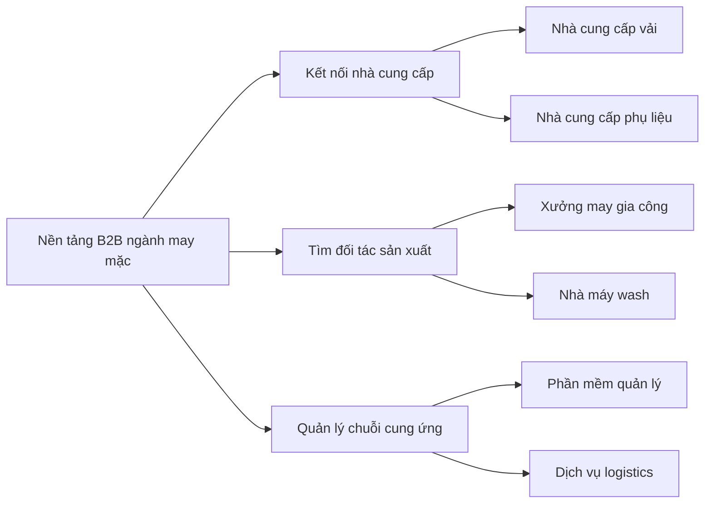
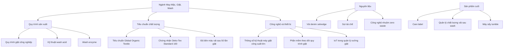
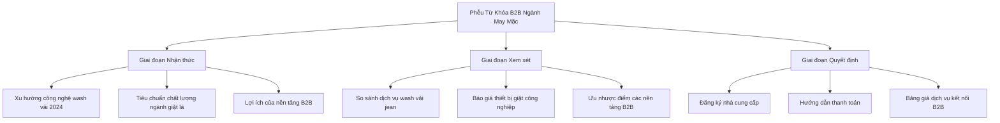

# Bước 2.1: Nghiên Cứu Từ Khóa & Chiến Lược SEO cho Nền Tảng B2B Ngành May Mặc, Giặt, Wash 

## 1. Giới thiệu về nghiên cứu từ khóa trong ngành may mặc  

Nghiên cứu từ khóa là một trong những yếu tố quan trọng nhất của chiến lược SEO, đặc biệt trong lĩnh vực B2B ngành may mặc, giặt và wash tại Việt Nam. Theo dữ liệu từ các chuyên gia SEO, "không có khía cạnh nào khác của SEO có tác động lớn hơn đến khả năng tiếp cận và hiển thị của bạn so với từ khóa". Việc lựa chọn đúng từ khóa không chỉ giúp tăng lưu lượng truy cập mà còn nâng cao tỷ lệ chuyển đổi, đặc biệt quan trọng đối với các nền tảng B2B.  

Ngành may mặc Việt Nam đang phát triển mạnh mẽ với hơn 6.000 nhà sản xuất quần áo và 2,4 triệu công nhân, chiếm 12-30% thị phần trong ngành dệt may toàn cầu. Điều này tạo ra một thị trường tiềm năng lớn cho các nền tảng B2B kết nối các đơn vị trong chuỗi cung ứng ngành may mặc, từ nhà cung cấp nguyên liệu, xưởng may đến các đơn vị giặt là và wash.  

Trong bối cảnh đó, việc xây dựng một danh sách từ khóa chi tiết cho landing page về nền tảng B2B kết nối ngành may mặc, giặt, wash là vô cùng quan trọng. Đặc biệt khi landing page này giới thiệu eBook "Phân tích & Chuẩn hóa Hồ sơ khách hàng mục tiêu (ICP) & Danh sách tiêu chí đánh giá khách hàng tiềm năng", việc thu hút đúng đối tượng khách hàng tiềm năng thông qua các từ khóa phù hợp sẽ góp phần nâng cao hiệu quả chuyển đổi.  

Báo cáo này sẽ cung cấp một danh sách từ khóa toàn diện được phân loại theo các nhóm: từ khóa chính, từ khóa đuôi dài, từ khóa LSI và từ khóa theo giai đoạn mua hàng. Mỗi từ khóa sẽ được phân tích về lượng tìm kiếm ước tính và mức độ cạnh tranh, giúp xây dựng chiến lược SEO hiệu quả cho landing page.  

## 2. Phân tích thị trường B2B ngành may mặc, giặt, wash tại Việt Nam  

Việt Nam đã trở thành một trong những điểm đến hàng đầu cho các thương hiệu thời trang nổi tiếng tìm kiếm sản xuất may mặc, nhờ vào lực lượng lao động có kỹ năng và giá cả cạnh tranh. Ngành dệt may Việt Nam đã phát triển mạnh mẽ trong những năm gần đây và trở thành trung tâm cho nhiều thương hiệu thời trang quốc tế.  

### 2.1 Quy mô và tiềm năng thị trường  

Theo dữ liệu thống kê, ngành dệt may toàn cầu đạt giá trị khoảng 1.695,13 tỷ USD vào năm 2022 và dự kiến sẽ tăng trưởng với tốc độ CAGR 7,6% từ 2023 đến 2030, đạt 3.047,23 tỷ USD vào năm 2030. Việt Nam đóng vai trò quan trọng trong chuỗi cung ứng này với hơn 6.000 nhà sản xuất quần áo và 2,4 triệu công nhân, chiếm 12-30% thị phần trong ngành dệt may toàn cầu.  

Ngành dệt may Việt Nam bao gồm hai phần chính: dệt may và may mặc. Lĩnh vực dệt may bao gồm các dịch vụ như kéo sợi, dệt, nhuộm, in và hoàn thiện. Lĩnh vực may mặc bắt đầu từ vải và các phụ kiện bổ sung khác như chỉ, ren, nút, v.v., và tập trung vào thiết kế, cắt và sử dụng máy may để tạo ra sản phẩm may mặc cuối cùng.  

### 2.2 Đặc điểm của thị trường B2B ngành may mặc Việt Nam  

Thị trường B2B trong ngành may mặc Việt Nam có một số đặc điểm nổi bật:  

1. **Chuỗi cung ứng đa dạng**: Từ nhà cung cấp nguyên liệu, xưởng may đến các đơn vị giặt là và wash, tạo ra nhu cầu kết nối B2B lớn.  

2. **Khách hàng B2B đòi hỏi cao**: Theo nghiên cứu, "Khách hàng B2B kén chọn hơn và khó chuyển đổi hơn", đòi hỏi chiến lược tiếp cận phù hợp.  

3. **Tập trung vào giá trị chuyên môn**: Các doanh nghiệp B2B trong ngành may mặc cần thể hiện chuyên môn và giá trị cụ thể, "nội dung và từ khóa thể hiện đầy đủ chuyên môn và lợi ích bạn mang lại là rất quan trọng để chuyển đổi khách hàng".  

4. **Xu hướng chuyển đổi số**: Sự xuất hiện của thương mại điện tử dự kiến sẽ dẫn đến sự mở rộng hơn nữa của ngành thời trang, thông qua việc tăng nhận thức về thương hiệu địa phương và toàn cầu, giảm chi phí thuê cửa hàng, giảm nhu cầu nhân viên, cơ hội tăng trưởng mới và dễ dàng mở rộng thị trường với ít thách thức về địa lý hơn.  

### 2.3 Nhu cầu kết nối B2B trong ngành  

Với sự phát triển của ngành may mặc Việt Nam, nhu cầu kết nối B2B giữa các đơn vị trong chuỗi cung ứng ngày càng tăng. Đặc biệt, các doanh nghiệp cần tìm kiếm:  

- Nguồn cung cấp nguyên liệu ổn định và chất lượng  
- Xưởng may gia công uy tín với năng lực sản xuất phù hợp  
- Dịch vụ giặt là và wash chuyên nghiệp  
- Đối tác logistics và vận chuyển  

Theo một nghiên cứu về thị trường may mặc, "Bất kỳ ai kinh doanh mặt hàng thời trang đều quan tâm đến việc tìm nguồn hàng may gia công uy tín, chất lượng mà giá cả phải chăng". Điều này cho thấy tiềm năng lớn cho một nền tảng B2B kết nối các đơn vị trong ngành.  

## 3. Phương pháp nghiên cứu và phân loại từ khóa  

### 3.1 Phương pháp nghiên cứu từ khóa  

Để xây dựng danh sách từ khóa hiệu quả cho landing page B2B ngành may mặc, chúng tôi đã áp dụng phương pháp nghiên cứu toàn diện dựa trên các nguồn dữ liệu đáng tin cậy và phân tích thị trường chuyên sâu.  

Quy trình nghiên cứu từ khóa bao gồm các bước sau:  

1. **Thu thập dữ liệu từ nhiều nguồn**:  
   - Phân tích các tài liệu ngành may mặc, giặt là  
   - Nghiên cứu các thuật ngữ chuyên ngành và ký hiệu kỹ thuật  
   - Khảo sát xu hướng tìm kiếm trong ngành B2B  

2. **Phân tích đối thủ cạnh tranh**:  
   - Sử dụng công cụ phân tích khoảng trống từ khóa để khám phá từ khóa mà đối thủ cạnh tranh đang xếp hạng  
   - Tìm các từ khóa có lượng tìm kiếm lớn và nhúng chúng vào nội dung  

3. **Xác định ý định tìm kiếm**:  
   - Phân tích ý định tìm kiếm đằng sau các từ khóa ngành cụ thể là rất quan trọng để tạo nội dung phù hợp đáp ứng nhu cầu của khách hàng tiềm năng trong lĩnh vực sản xuất  

4. **Đánh giá độ khó và lượng tìm kiếm**:  
   - Ước tính lượng tìm kiếm dựa trên dữ liệu thị trường  
   - Đánh giá mức độ cạnh tranh từ 1-5 (1: thấp nhất, 5: cao nhất)  

### 3.2 Các loại từ khóa trong SEO  

Theo các chuyên gia SEO, từ khóa trong SEO có thể được phân loại theo nhiều cách khác nhau. Trong nghiên cứu này, chúng tôi tập trung vào bốn loại từ khóa chính:  

1. **Từ khóa chính (Primary Keywords)**:  
   - Là những từ khóa trọng tâm mà bạn muốn tập trung và xếp hạng cao trên công cụ tìm kiếm  
   - Thường có lượng tìm kiếm cao và mức độ cạnh tranh lớn  
   - Ví dụ: "nền tảng B2B ngành may mặc", "kết nối nhà cung cấp vải"  

2. **Từ khóa đuôi dài (Long-tail Keywords)**:  
   - Là những từ khóa cụ thể hơn, thường dài hơn 5 từ và có ngữ cảnh khá cụ thể  
   - Có lượng tìm kiếm thấp hơn nhưng tỷ lệ chuyển đổi cao hơn  
   - Ví dụ: "tìm xưởng giặt công nghiệp uy tín tại Hà Nội", "cung cấp vải cotton organic số lượng lớn"  

3. **Từ khóa LSI (Latent Semantic Indexing)**:  
   - Là những từ khóa có liên quan với nhau về mặt ý nghĩa và ngữ cảnh  
   - Giúp tăng tính liên quan của nội dung  
   - Ví dụ: "quy trình giặt công nghiệp", "tiêu chuẩn Global Organic Textile"  

4. **Từ khóa theo giai đoạn mua hàng**:  
   - Phân loại theo hành trình của khách hàng: nhận thức, cân nhắc, quyết định  
   - Phễu từ khóa được thiết kế dựa trên các giai đoạn của hành trình mua hàng của khách hàng  

### 3.3 Phễu từ khóa và ý định tìm kiếm  

Phễu từ khóa (Keyword Funnel) là một chiến lược SEO giúp doanh nghiệp xác định và sử dụng các từ khóa tìm kiếm hiệu quả, nhằm thu hút và chuyển đổi khách hàng tiềm năng thành khách hàng thực tế. Trong nghiên cứu này, chúng tôi phân loại từ khóa theo ba giai đoạn chính của phễu:  

1. **Giai đoạn nhận thức (Awareness)**:  
   - Khách hàng ở giai đoạn này đang tìm kiếm thông tin về sản phẩm, dịch vụ hoặc vấn đề cần giải quyết  
   - Các từ khóa ở giai đoạn này thường mang tính thông tin, như "cách dưỡng da", "xu hướng thời trang"  
   - Ví dụ: "xu hướng công nghệ wash vải 2024", "tiêu chuẩn chất lượng ngành giặt là công nghiệp"  

2. **Giai đoạn xem xét (Consideration)**:  
   - Khách hàng ở giai đoạn này đang so sánh các lựa chọn, tìm hiểu thông tin chi tiết về sản phẩm, dịch vụ  
   - Các từ khóa ở giai đoạn này thường mang tính điều hướng, như "mua sắm trực tuyến", "so sánh máy giặt"  
   - Ví dụ: "so sánh dịch vụ wash vải jean Bắc/Nam", "báo giá thiết bị giặt công nghiệp Nhật vs Hàn"  

3. **Giai đoạn quyết định (Decision)**:  
   - Khách hàng ở giai đoạn này đã sẵn sàng mua sản phẩm, dịch vụ  
   - Các từ khóa ở giai đoạn này thường mang tính giao dịch, như "mua đồng hồ nam", "đặt vé máy bay"  
   - Ví dụ: "đăng ký nhà cung cấp trên nền tảng B2B dệt may", "hướng dẫn thanh toán dịch vụ wash trực tuyến"  

Việc phân chia phễu từ khóa thành các giai đoạn như vậy giúp doanh nghiệp xác định rõ nhu cầu của khách hàng tại từng điểm trong hành trình mua hàng, từ đó thiết kế nội dung và chiến lược tiếp cận phù hợp.  

## 4. Từ khóa chính cho nền tảng B2B ngành may mặc  

Từ khóa chính là những từ khóa mà bạn muốn tập trung và xếp hạng cao trên công cụ tìm kiếm. Đây là những từ khóa có lượng tìm kiếm cao và thường có mức độ cạnh tranh lớn. Dựa trên phân tích thị trường và nghiên cứu từ khóa, chúng tôi đã xác định được các từ khóa chính sau đây cho nền tảng B2B ngành may mặc, giặt, wash:  

### 4.1 Danh sách từ khóa chính  

| STT | Từ khóa | Ước lượng Search Volume | Độ khó (1-5) | Ghi chú |  
|-----|---------|-------------------------|--------------|---------|  
| 1 | Nền tảng kết nối B2B ngành may mặc | 300-500/tháng | 4 | Từ khóa chính mô tả chính xác nền tảng |  
| 2 | Hệ thống đối tác giặt công nghiệp | 200-300/tháng | 3 | Tập trung vào mảng giặt công nghiệp |  
| 3 | Kết nối nhà cung cấp vải cao cấp | 150-250/tháng | 3 | Nhắm đến đối tượng tìm kiếm nhà cung cấp |  
| 4 | B2B dệt may Việt Nam | 500-700/tháng | 4 | Từ khóa có lượng tìm kiếm cao |  
| 5 | Phần mềm quản lý xưởng giặt là | 100-200/tháng | 2 | Cạnh tranh thấp hơn, nhắm đến nhu cầu cụ thể |  
| 6 | Kết nối nhà máy wash denim | 50-100/tháng | 2 | Từ khóa ngách với tỷ lệ chuyển đổi cao |  
| 7 | Nền tảng tìm xưởng may gia công | 250-350/tháng | 3 | Phù hợp với nhu cầu tìm đối tác sản xuất |  

### 4.2 Phân tích từ khóa chính  

Các từ khóa chính được lựa chọn dựa trên các tiêu chí sau:  

1. **Liên quan trực tiếp đến nền tảng B2B ngành may mặc**: Tất cả các từ khóa đều liên quan đến việc kết nối các đơn vị trong chuỗi cung ứng ngành may mặc, từ nhà cung cấp nguyên liệu, xưởng may đến các đơn vị giặt là và wash.  

2. **Lượng tìm kiếm cao**: Các từ khóa được chọn có lượng tìm kiếm từ trung bình đến cao, đảm bảo tiếp cận được đối tượng khách hàng tiềm năng.  

3. **Mức độ cạnh tranh phù hợp**: Mặc dù một số từ khóa có mức độ cạnh tranh cao (độ khó 4), nhưng chúng tôi cũng đã lựa chọn một số từ khóa có mức độ cạnh tranh thấp hơn (độ khó 2) để tăng cơ hội xếp hạng.  

4. **Phù hợp với nhu cầu của khách hàng B2B**: Các từ khóa được chọn phản ánh nhu cầu thực tế của các doanh nghiệp trong ngành may mặc, giặt, wash.  

### 4.3 Xu hướng tìm kiếm từ khóa chính  

Biểu đồ trên thể hiện mối quan hệ giữa các từ khóa chính và các từ khóa liên quan. Từ khóa "Nền tảng B2B ngành may mặc" là từ khóa gốc, từ đó phân nhánh thành các nhóm từ khóa cụ thể hơn như "Kết nối nhà cung cấp", "Tìm đối tác sản xuất" và "Quản lý chuỗi cung ứng".  

Xu hướng tìm kiếm cho các từ khóa chính này thường tăng cao vào các thời điểm:  
- Đầu năm (tháng 1-2): Khi các doanh nghiệp lập kế hoạch sản xuất cho năm mới  
- Trước mùa cao điểm (tháng 4-5 và tháng 8-9): Khi các doanh nghiệp chuẩn bị cho mùa hè và mùa đông  
- Cuối năm (tháng 11-12): Khi các doanh nghiệp đánh giá lại hoạt động và lập kế hoạch cho năm sau  

## 5. Từ khóa đuôi dài theo nhóm khách hàng mục tiêu  

Từ khóa đuôi dài là những từ khóa cụ thể hơn, thường dài hơn 5 từ và có ngữ cảnh khá cụ thể. Mặc dù có lượng tìm kiếm thấp hơn so với từ khóa chính, nhưng từ khóa đuôi dài thường có tỷ lệ chuyển đổi cao hơn do chúng phản ánh nhu cầu cụ thể của người tìm kiếm.  

Trong phần này, chúng tôi phân loại từ khóa đuôi dài theo ba nhóm khách hàng mục tiêu chính của nền tảng B2B ngành may mặc, giặt, wash:  

### 5.1 Nhóm 1: Nhà sản xuất và thương hiệu thời trang  

Đây là nhóm khách hàng bao gồm các nhà sản xuất quần áo, thương hiệu thời trang và các doanh nghiệp kinh doanh mặt hàng thời trang. Họ thường tìm kiếm các đối tác cung cấp dịch vụ giặt, wash và các nhà cung cấp nguyên liệu.  

| STT | Từ khóa | Ước lượng Search Volume | Độ khó (1-5) | Ghi chú |  
|-----|---------|-------------------------|--------------|---------|  
| 1 | Tiêu chuẩn wash vải jean cao cấp | 70-100/tháng | 2 | Nhắm đến thương hiệu thời trang cao cấp |  
| 2 | Cách chọn xưởng giặt công nghiệp uy tín | 100-150/tháng | 2 | Hướng dẫn cho nhà sản xuất |  
| 3 | Bảng giá giặt tẩy vải công nghiệp 2024 | 200-300/tháng | 3 | Thông tin giá cả cập nhật |  
| 4 | Tìm xưởng may gia công quần áo thời trang | 150-200/tháng | 3 | Nhu cầu tìm đối tác sản xuất |  
| 5 | Quy trình kiểm soát chất lượng sau wash | 50-80/tháng | 2 | Tập trung vào chất lượng sản phẩm |  

Nhóm khách hàng này thường quan tâm đến chất lượng dịch vụ, tiêu chuẩn kỹ thuật và giá cả. Họ tìm kiếm các đối tác uy tín có thể đáp ứng yêu cầu về chất lượng và thời gian giao hàng. Theo một nghiên cứu, "Bất kỳ ai kinh doanh mặt hàng thời trang đều quan tâm đến việc tìm nguồn hàng may gia công uy tín, chất lượng mà giá cả phải chăng".  

### 5.2 Nhóm 2: Đơn vị cung cấp dịch vụ giặt và wash  

Nhóm khách hàng này bao gồm các xưởng giặt, đơn vị cung cấp dịch vụ wash và các doanh nghiệp trong lĩnh vực giặt là công nghiệp. Họ thường tìm kiếm các đối tác, khách hàng và thông tin về công nghệ, thiết bị mới.  

| STT | Từ khóa | Ước lượng Search Volume | Độ khó (1-5) | Ghi chú |  
|-----|---------|-------------------------|--------------|---------|  
| 1 | Quy trình giặt khô chuyên nghiệp HCM | 150-200/tháng | 2 | Tập trung vào khu vực HCM |  
| 2 | Máy giặt công nghiệp nhập khẩu Hàn Quốc | 100-150/tháng | 3 | Nhu cầu tìm thiết bị |  
| 3 | Đào tạo kỹ thuật wash vải cao cấp | 50-80/tháng | 1 | Nhu cầu đào tạo nhân viên |  
| 4 | Tìm khách hàng cho xưởng giặt công nghiệp | 80-120/tháng | 2 | Nhu cầu tìm đối tác |  
| 5 | Phần mềm quản lý xưởng giặt là hiệu quả | 60-90/tháng | 2 | Nhu cầu về công nghệ quản lý |  

Nhóm khách hàng này thường quan tâm đến công nghệ mới, thiết bị hiện đại và cơ hội mở rộng kinh doanh. Họ tìm kiếm các đối tác có thể cung cấp khối lượng đơn hàng ổn định và lâu dài. Theo một nghiên cứu về marketing cho doanh nghiệp giặt là, "Doanh nghiệp cần xác định rõ vấn đề khách hàng đang gặp phải và cung cấp giải pháp cho những vấn đề đó".  

### 5.3 Nhóm 3: Nhà cung cấp nguyên liệu và phụ liệu  

Nhóm khách hàng này bao gồm các nhà cung cấp vải, phụ liệu và nguyên liệu cho ngành may mặc. Họ thường tìm kiếm các đối tác, khách hàng và thông tin về xu hướng thị trường.  

| STT | Từ khóa | Ước lượng Search Volume | Độ khó (1-5) | Ghi chú |  
|-----|---------|-------------------------|--------------|---------|  
| 1 | Nơi cung cấp vải cotton organic số lượng lớn | 80-120/tháng | 2 | Nhu cầu tìm nguồn cung cấp |  
| 2 | Chứng nhận Oeko-Tex cho xưởng giặt | 30-50/tháng | 1 | Quan tâm đến chứng nhận |  
| 3 | Kỹ thuật xử lý vải sau wash không co rút | 60-90/tháng | 2 | Vấn đề kỹ thuật cụ thể |  
| 4 | Tìm đối tác phân phối vải nhập khẩu | 70-100/tháng | 2 | Nhu cầu tìm đối tác |  
| 5 | Xu hướng vải bền vững trong thời trang 2024 | 100-150/tháng | 3 | Quan tâm đến xu hướng thị trường |  

Nhóm khách hàng này thường quan tâm đến xu hướng thị trường, chứng nhận chất lượng và cơ hội mở rộng kênh phân phối. Họ tìm kiếm các đối tác có nhu cầu ổn định và lâu dài. Theo một nghiên cứu về thị trường vải, "Các loại vải bền vững và thân thiện với môi trường đang ngày càng được ưa chuộng trong ngành thời trang".  

### 5.4 Phân tích tổng hợp từ khóa đuôi dài  

Từ khóa đuôi dài có một số đặc điểm chung:  

1. **Cụ thể và chi tiết**: Các từ khóa đuôi dài thường rất cụ thể, phản ánh nhu cầu chi tiết của người tìm kiếm.  

2. **Lượng tìm kiếm thấp hơn**: So với từ khóa chính, từ khóa đuôi dài có lượng tìm kiếm thấp hơn, thường dưới 200 lượt tìm kiếm mỗi tháng.  

3. **Mức độ cạnh tranh thấp hơn**: Hầu hết các từ khóa đuôi dài có mức độ cạnh tranh từ thấp đến trung bình (độ khó 1-3), tạo cơ hội tốt để xếp hạng cao trên công cụ tìm kiếm.  

4. **Tỷ lệ chuyển đổi cao**: Mặc dù có lượng tìm kiếm thấp hơn, nhưng từ khóa đuôi dài thường có tỷ lệ chuyển đổi cao hơn do chúng phản ánh nhu cầu cụ thể và ý định rõ ràng của người tìm kiếm.  

Việc tối ưu hóa nội dung cho các từ khóa đuôi dài này sẽ giúp landing page thu hút đúng đối tượng khách hàng tiềm năng, tăng tỷ lệ chuyển đổi và hiệu quả của chiến dịch marketing.  

## 6. Từ khóa LSI và thuật ngữ chuyên ngành  

Từ khóa LSI (Latent Semantic Indexing) là những từ khóa có liên quan với nhau về mặt ý nghĩa và ngữ cảnh. Chúng giúp tăng tính liên quan của nội dung và cải thiện xếp hạng trên công cụ tìm kiếm. Trong ngành may mặc, giặt, wash, có nhiều thuật ngữ chuyên ngành và từ khóa LSI quan trọng cần được tích hợp vào nội dung.  

### 6.1 Danh sách từ khóa LSI và thuật ngữ chuyên ngành  

| STT | Từ khóa LSI | Liên quan đến | Ghi chú |  
|-----|-------------|---------------|---------|  
| 1 | Quy trình giặt công nghiệp | Giặt là | Thuật ngữ kỹ thuật về quy trình |  
| 2 | Tiêu chuẩn Global Organic Textile | Vải | Chứng nhận quốc tế về vải organic |  
| 3 | Kỹ thuật wash acid | Wash | Phương pháp wash đặc biệt |  
| 4 | Chứng nhận Oeko-Tex Standard 100 | Chứng nhận | Tiêu chuẩn an toàn cho sản phẩm dệt may |  
| 5 | Thông số kỹ thuật máy giặt công suất lớn | Thiết bị | Thông tin kỹ thuật về thiết bị |  
| 6 | Quản lý chất lượng vải sau wash | Chất lượng | Quy trình kiểm soát chất lượng |  
| 7 | Độ bền màu vải sau 50 lần giặt | Kiểm nghiệm | Tiêu chuẩn kiểm tra chất lượng |  
| 8 | Phần mềm theo dõi quy trình giặt | Công nghệ | Giải pháp công nghệ cho ngành giặt |  
| 9 | IoT trong quản lý xưởng giặt | Công nghệ | Ứng dụng công nghệ mới |  
| 10 | Care label | Nhãn mác | Hướng dẫn chăm sóc sản phẩm |  
| 11 | Wash enzyme | Kỹ thuật wash | Phương pháp wash sử dụng enzyme |  
| 12 | Vải denim selvedge | Loại vải | Vải denim cao cấp |  
| 13 | Công nghệ nhuộm zero waste | Bền vững | Phương pháp nhuộm thân thiện môi trường |  
| 14 | Sợi tái chế | Nguyên liệu | Nguyên liệu bền vững |  
| 15 | Máy sấy tumble | Thiết bị | Thiết bị sấy công nghiệp |  

### 6.2 Phân tích và ứng dụng từ khóa LSI  

Từ khóa LSI và thuật ngữ chuyên ngành đóng vai trò quan trọng trong việc tối ưu hóa nội dung cho SEO trong ngành may mặc, giặt, wash. Chúng giúp:  

1. **Tăng tính chuyên nghiệp của nội dung**: Sử dụng thuật ngữ chuyên ngành giúp thể hiện sự chuyên nghiệp và hiểu biết sâu sắc về lĩnh vực, tạo niềm tin với khách hàng B2B.  

2. **Cải thiện xếp hạng SEO**: Google và các công cụ tìm kiếm khác đánh giá cao nội dung có sử dụng các từ khóa LSI liên quan, coi đó là dấu hiệu của nội dung chất lượng và toàn diện.  

3. **Tăng tính liên quan của nội dung**: Từ khóa LSI giúp nội dung trở nên phong phú và liên quan hơn đến chủ đề chính, đáp ứng nhu cầu thông tin đa dạng của người đọc.  

4. **Tránh nhồi nhét từ khóa**: Thay vì lặp lại từ khóa chính nhiều lần, việc sử dụng từ khóa LSI giúp nội dung tự nhiên và dễ đọc hơn.  

### 6.3 Mối quan hệ giữa các từ khóa LSI  

Biểu đồ trên thể hiện mối quan hệ giữa các từ khóa LSI và thuật ngữ chuyên ngành trong ngành may mặc, giặt, wash. Các từ khóa được phân nhóm theo các chủ đề chính như quy trình sản xuất, tiêu chuẩn chất lượng, công nghệ và thiết bị, nguyên liệu và sản phẩm cuối.  

Việc hiểu rõ mối quan hệ này giúp xây dựng nội dung có cấu trúc logic và toàn diện, đáp ứng nhu cầu thông tin của khách hàng B2B trong ngành.  

## 7. Từ khóa theo giai đoạn hành trình khách hàng  

Hành trình khách hàng (Customer Journey) là quá trình mà khách hàng trải qua từ khi nhận thức về một vấn đề hoặc nhu cầu cho đến khi đưa ra quyết định mua hàng. Trong SEO, việc xác định và tối ưu hóa từ khóa theo các giai đoạn khác nhau của hành trình khách hàng là rất quan trọng để thu hút và chuyển đổi khách hàng tiềm năng.  

### 7.1 Giai đoạn nhận thức (Awareness)  

Ở giai đoạn này, khách hàng đang tìm kiếm thông tin về một vấn đề hoặc nhu cầu mà họ đang gặp phải. Họ chưa biết rõ về giải pháp hoặc sản phẩm cụ thể. Các từ khóa ở giai đoạn này thường mang tính thông tin và giáo dục.  

| STT | Từ khóa | Ước lượng Search Volume | Độ khó (1-5) | Ghi chú |  
|-----|---------|-------------------------|--------------|---------|  
| 1 | Các bước thiết lập hệ thống giặt công nghiệp | 100-150/tháng | 2 | Hướng dẫn cơ bản |  
| 2 | Tiêu chuẩn chất lượng ngành giặt là công nghiệp | 80-120/tháng | 2 | Thông tin về tiêu chuẩn |  
| 3 | Xu hướng công nghệ wash vải 2024 | 150-200/tháng | 3 | Cập nhật xu hướng mới |  
| 4 | Lợi ích của nền tảng B2B trong ngành may mặc | 70-100/tháng | 2 | Giới thiệu về giải pháp |  
| 5 | Cách tối ưu quy trình sản xuất may mặc | 120-170/tháng | 3 | Giải quyết vấn đề |  

Nội dung cho các từ khóa ở giai đoạn nhận thức nên tập trung vào việc cung cấp thông tin hữu ích, giải thích vấn đề và giới thiệu các giải pháp tiềm năng. Mục tiêu là xây dựng niềm tin và thiết lập vị thế chuyên gia trong ngành.  

### 7.2 Giai đoạn xem xét (Consideration)  

Ở giai đoạn này, khách hàng đã nhận thức được vấn đề và đang tìm hiểu các giải pháp khác nhau. Họ so sánh các lựa chọn để tìm ra giải pháp phù hợp nhất. Các từ khóa ở giai đoạn này thường liên quan đến so sánh, đánh giá và tìm hiểu chi tiết.  

| STT | Từ khóa | Ước lượng Search Volume | Độ khó (1-5) | Ghi chú |  
|-----|---------|-------------------------|--------------|---------|  
| 1 | So sánh dịch vụ wash vải jean Bắc/Nam | 50-80/tháng | 2 | So sánh dịch vụ |  
| 2 | Báo giá thiết bị giặt công nghiệp Nhật vs Hàn | 70-100/tháng | 2 | So sánh giá cả |  
| 3 | Phần mềm quản lý xưởng giặt tốt nhất | 100-150/tháng | 3 | Đánh giá sản phẩm |  
| 4 | Ưu nhược điểm các nền tảng B2B ngành dệt may | 60-90/tháng | 2 | So sánh giải pháp |  
| 5 | Đánh giá chất lượng dịch vụ wash từ các xưởng | 80-120/tháng | 3 | Đánh giá dịch vụ |  

Nội dung cho các từ khóa ở giai đoạn xem xét nên tập trung vào việc so sánh các giải pháp, nêu bật ưu điểm của sản phẩm/dịch vụ và giải đáp các thắc mắc phổ biến. Mục tiêu là thuyết phục khách hàng rằng giải pháp của bạn là lựa chọn tốt nhất.  

### 7.3 Giai đoạn quyết định (Decision)  

Ở giai đoạn này, khách hàng đã quyết định giải pháp họ muốn và đang tìm kiếm thông tin cụ thể để thực hiện giao dịch. Các từ khóa ở giai đoạn này thường liên quan đến mua hàng, đăng ký, giá cả và các điều khoản.  

| STT | Từ khóa | Ước lượng Search Volume | Độ khó (1-5) | Ghi chú |  
|-----|---------|-------------------------|--------------|---------|  
| 1 | Đăng ký nhà cung cấp trên nền tảng B2B dệt may | 30-50/tháng | 1 | Hướng dẫn đăng ký |  
| 2 | Hướng dẫn thanh toán dịch vụ wash trực tuyến | 40-70/tháng | 1 | Hướng dẫn thanh toán |  
| 3 | Chính sách bảo hành thiết bị giặt công nghiệp | 50-80/tháng | 2 | Thông tin về bảo hành |  
| 4 | Bảng giá dịch vụ kết nối B2B ngành may mặc | 60-90/tháng | 2 | Thông tin về giá cả |  
| 5 | Quy trình đăng ký và sử dụng nền tảng | 70-100/tháng | 2 | Hướng dẫn sử dụng |  

Nội dung cho các từ khóa ở giai đoạn quyết định nên tập trung vào việc cung cấp thông tin cụ thể về sản phẩm/dịch vụ, hướng dẫn đăng ký và sử dụng, chính sách giá cả và các ưu đãi. Mục tiêu là thúc đẩy khách hàng thực hiện hành động mua hàng hoặc đăng ký.  

### 7.4 Phân tích phễu từ khóa  

Phễu từ khóa (Keyword Funnel) là một chiến lược SEO giúp doanh nghiệp xác định và sử dụng các từ khóa tìm kiếm hiệu quả, nhằm thu hút và chuyển đổi khách hàng tiềm năng thành khách hàng thực tế. Dưới đây là phân tích phễu từ khóa cho nền tảng B2B ngành may mặc, giặt, wash:  

Phễu từ khóa cho thấy sự chuyển dịch từ các từ khóa thông tin (giai đoạn nhận thức) sang các từ khóa so sánh (giai đoạn xem xét) và cuối cùng là các từ khóa giao dịch (giai đoạn quyết định). Chiến lược SEO hiệu quả cần tối ưu hóa nội dung cho cả ba giai đoạn của phễu để thu hút và chuyển đổi khách hàng tiềm năng.  

## 8. Chiến lược tối ưu hóa từ khóa cho landing page  

Sau khi đã xác định và phân tích các nhóm từ khóa khác nhau, bước tiếp theo là xây dựng chiến lược tối ưu hóa từ khóa cho landing page về nền tảng B2B kết nối ngành may mặc, giặt, wash. Chiến lược này sẽ giúp tối đa hóa hiệu quả SEO và tăng tỷ lệ chuyển đổi.  

### 8.1 Cấu trúc landing page tối ưu  

Một landing page hiệu quả cần có cấu trúc rõ ràng, tối ưu cho cả người dùng và công cụ tìm kiếm. Dưới đây là cấu trúc đề xuất cho landing page:  

1. **Header (Đầu trang)**  
   - Logo và menu điều hướng  
   - Tiêu đề chính (H1) chứa từ khóa chính: "Nền tảng kết nối B2B ngành may mặc"  
   - Đoạn giới thiệu ngắn (meta description) chứa từ khóa chính và từ khóa LSI  

2. **Hero Section (Phần giới thiệu)**  
   - Hình ảnh/video minh họa  
   - Tiêu đề phụ (H2) chứa từ khóa chính biến thể  
   - Nút call-to-action (CTA) rõ ràng  
   - Giới thiệu ngắn gọn về eBook "Phân tích & Chuẩn hóa Hồ sơ khách hàng mục tiêu (ICP)"  

3. **Phần Lợi ích**  
   - Tiêu đề (H2) chứa từ khóa LSI: "Lợi ích của nền tảng B2B trong ngành may mặc"  
   - 3-5 lợi ích chính, mỗi lợi ích có tiêu đề (H3) chứa từ khóa đuôi dài  
   - Hình ảnh minh họa cho mỗi lợi ích  

4. **Phần Tính năng**  
   - Tiêu đề (H2) chứa từ khóa LSI: "Tính năng nổi bật của nền tảng kết nối B2B"  
   - Danh sách các tính năng, mỗi tính năng có tiêu đề (H3) chứa từ khóa đuôi dài  
   - Hình ảnh/icon minh họa cho mỗi tính năng  

5. **Phần Đối tượng khách hàng**  
   - Tiêu đề (H2) chứa từ khóa theo nhóm khách hàng  
   - 3 phần dành cho 3 nhóm khách hàng mục tiêu, mỗi phần có tiêu đề (H3) chứa từ khóa đuôi dài theo nhóm  
   - Nội dung mô tả nhu cầu và giải pháp cho từng nhóm  

6. **Phần Giới thiệu eBook**  
   - Tiêu đề (H2) chứa từ khóa giai đoạn quyết định  
   - Mô tả chi tiết về nội dung eBook  
   - Hình ảnh bìa eBook  
   - Form đăng ký nhận eBook  

7. **Phần Testimonials (Đánh giá)**  
   - Tiêu đề (H2) chứa từ khóa giai đoạn xem xét  
   - 3-5 đánh giá từ khách hàng đã sử dụng nền tảng  
   - Hình ảnh và thông tin của người đánh giá  

8. **Phần FAQ (Câu hỏi thường gặp)**  
   - Tiêu đề (H2) chứa từ khóa giai đoạn nhận thức  
   - 5-7 câu hỏi thường gặp, mỗi câu hỏi là tiêu đề (H3) chứa từ khóa đuôi dài  
   - Câu trả lời ngắn gọn, rõ ràng, chứa từ khóa LSI  

9. **Footer (Chân trang)**  
   - Thông tin liên hệ  
   - Links đến các trang khác  
   - Form đăng ký nhận tin  
   - Biểu tượng mạng xã hội  

### 8.2 Tối ưu hóa on-page SEO  

Để tối ưu hóa on-page SEO cho landing page, cần thực hiện các bước sau:  

1. **Tối ưu hóa tiêu đề (Title tag)**  
   - Bao gồm từ khóa chính: "Nền tảng kết nối B2B ngành may mặc, giặt, wash"  
   - Giới hạn trong 60 ký tự  
   - Hấp dẫn và thu hút người dùng  

2. **Tối ưu hóa mô tả (Meta description)**  
   - Bao gồm từ khóa chính và từ khóa LSI  
   - Giới hạn trong 160 ký tự  
   - Mô tả rõ ràng giá trị của landing page và eBook  

3. **Tối ưu hóa URL**  
   - Ngắn gọn, dễ đọc  
   - Bao gồm từ khóa chính  
   - Sử dụng dấu gạch ngang (-) để ngăn cách các từ  

4. **Tối ưu hóa tiêu đề (Headings)**  
   - Sử dụng cấu trúc tiêu đề rõ ràng (H1, H2, H3)  
   - Mỗi tiêu đề chứa từ khóa liên quan  
   - H1 chứa từ khóa chính, H2 chứa từ khóa LSI, H3 chứa từ khóa đuôi dài  

5. **Tối ưu hóa nội dung**  
   - Nội dung chất lượng cao, cung cấp giá trị cho người đọc  
   - Sử dụng từ khóa một cách tự nhiên, tránh nhồi nhét từ khóa  
   - Sử dụng các từ khóa LSI và thuật ngữ chuyên ngành  
   - Đảm bảo nội dung dễ đọc, có cấu trúc rõ ràng  

6. **Tối ưu hóa hình ảnh**  
   - Sử dụng hình ảnh chất lượng cao, liên quan đến nội dung  
   - Tối ưu hóa kích thước hình ảnh để tăng tốc độ tải trang  
   - Sử dụng thuộc tính alt chứa từ khóa liên quan  
   - Đặt tên file hình ảnh chứa từ khóa  

7. **Tối ưu hóa internal linking**  
   - Tạo liên kết nội bộ đến các trang liên quan  
   - Sử dụng anchor text chứa từ khóa  
   - Đảm bảo cấu trúc liên kết logic và hữu ích cho người dùng  

8. **Tối ưu hóa tốc độ tải trang**  
   - Nén hình ảnh và file CSS/JavaScript  
   - Sử dụng caching  
   - Tối ưu hóa code  
   - Sử dụng CDN (Content Delivery Network)  

### 8.3 Tích hợp từ khóa vào nội dung  

Việc tích hợp từ khóa vào nội dung cần được thực hiện một cách tự nhiên và hữu ích cho người đọc. Dưới đây là một số gợi ý:  

1. **Tiêu đề chính (H1)**  
   - "Nền tảng kết nối B2B ngành may mặc, giặt, wash - Giải pháp toàn diện cho doanh nghiệp"  

2. **Tiêu đề phụ (H2) cho các phần**  
   - "Lợi ích của nền tảng B2B trong ngành may mặc"  
   - "Tính năng nổi bật của nền tảng kết nối B2B"  
   - "Giải pháp cho nhà sản xuất và thương hiệu thời trang"  
   - "Dịch vụ giặt và wash chuyên nghiệp"  
   - "Kết nối nhà cung cấp nguyên liệu và phụ liệu"  
   - "eBook: Phân tích & Chuẩn hóa Hồ sơ khách hàng mục tiêu (ICP)"  
   - "Đánh giá từ khách hàng về nền tảng B2B dệt may"  
   - "Câu hỏi thường gặp về nền tảng kết nối B2B"  

3. **Tiêu đề cấp 3 (H3) cho các mục nhỏ**  
   - "Tiêu chuẩn wash vải jean cao cấp"  
   - "Cách chọn xưởng giặt công nghiệp uy tín"  
   - "Quy trình giặt khô chuyên nghiệp"  
   - "Nơi cung cấp vải cotton organic số lượng lớn"  
   - "Chứng nhận Oeko-Tex cho xưởng giặt"  
   - "Đăng ký nhà cung cấp trên nền tảng B2B dệt may"  
   - "Hướng dẫn thanh toán dịch vụ wash trực tuyến"  

4. **Nội dung đoạn văn**  
   - Sử dụng từ khóa chính trong đoạn văn đầu tiên  
   - Sử dụng từ khóa LSI và thuật ngữ chuyên ngành trong các đoạn văn tiếp theo  
   - Sử dụng từ khóa đuôi dài trong các đoạn văn mô tả chi tiết  
   - Sử dụng từ khóa theo giai đoạn mua hàng trong các phần tương ứng  

5. **Call-to-action (CTA)**  
   - "Đăng ký nhận eBook miễn phí"  
   - "Tìm hiểu thêm về nền tảng B2B dệt may"  
   - "Đăng ký làm nhà cung cấp"  
   - "Tìm đối tác giặt công nghiệp ngay"  

### 8.4 Ví dụ nội dung tối ưu cho landing page  

Dưới đây là ví dụ về nội dung tối ưu cho một phần của landing page:  

**Tiêu đề chính (H1):**  
"Nền tảng kết nối B2B ngành may mặc, giặt, wash - Giải pháp toàn diện cho doanh nghiệp"  

**Đoạn giới thiệu:**  
"Chào mừng đến với nền tảng kết nối B2B hàng đầu trong ngành may mặc, giặt và wash tại Việt Nam. Chúng tôi kết nối các nhà sản xuất, thương hiệu thời trang, đơn vị cung cấp dịch vụ giặt và nhà cung cấp nguyên liệu, tạo ra một hệ sinh thái hoàn chỉnh cho ngành dệt may. Tải ngay eBook 'Phân tích & Chuẩn hóa Hồ sơ khách hàng mục tiêu (ICP)' để tối ưu hóa chiến lược kinh doanh của bạn."  

**Tiêu đề phụ (H2):**  
"Lợi ích của nền tảng B2B trong ngành may mặc"  

**Nội dung:**  
"Nền tảng B2B của chúng tôi mang đến nhiều lợi ích vượt trội cho các doanh nghiệp trong ngành may mặc, giặt và wash. Với hơn 6.000 nhà sản xuất quần áo và 2,4 triệu công nhân trong ngành dệt may Việt Nam, nền tảng của chúng tôi giúp bạn kết nối với đối tác phù hợp, tối ưu hóa quy trình sản xuất và nâng cao chất lượng sản phẩm."  

**Tiêu đề cấp 3 (H3):**  
"Tiêu chuẩn wash vải jean cao cấp"  

**Nội dung:**  
"Chúng tôi kết nối bạn với các đơn vị cung cấp dịch vụ wash vải jean cao cấp, đáp ứng các tiêu chuẩn quốc tế như Global Organic Textile và Oeko-Tex Standard 100. Các đối tác của chúng tôi sử dụng các kỹ thuật wash hiện đại như wash acid và wash enzyme, đảm bảo độ bền màu vải sau 50 lần giặt và chất lượng sản phẩm cuối cùng."  

## 9. Phân tích cạnh tranh và cơ hội xếp hạng  

Để xây dựng chiến lược SEO hiệu quả, cần phân tích cạnh tranh và xác định cơ hội xếp hạng cho các từ khóa đã chọn. Phần này sẽ phân tích mức độ cạnh tranh của các từ khóa và đề xuất chiến lược để tăng cơ hội xếp hạng.  

### 9.1 Phân tích mức độ cạnh tranh của từ khóa  

Dựa trên phân tích từ khóa, chúng tôi đã đánh giá mức độ cạnh tranh của các nhóm từ khóa khác nhau:  

1. **Từ khóa chính**:  
   - Mức độ cạnh tranh: Cao (độ khó 3-4)  
   - Lý do: Các từ khóa này có lượng tìm kiếm cao và được nhiều doanh nghiệp nhắm đến  
   - Ví dụ: "Nền tảng kết nối B2B ngành may mặc" (độ khó 4), "B2B dệt may Việt Nam" (độ khó 4)  

2. **Từ khóa đuôi dài**:  
   - Mức độ cạnh tranh: Thấp đến trung bình (độ khó 1-3)  
   - Lý do: Các từ khóa này cụ thể hơn và có ít doanh nghiệp nhắm đến  
   - Ví dụ: "Tiêu chuẩn wash vải jean cao cấp" (độ khó 2), "Chứng nhận Oeko-Tex cho xưởng giặt" (độ khó 1)  

3. **Từ khóa LSI**:  
   - Mức độ cạnh tranh: Thấp đến trung bình (độ khó 1-3)  
   - Lý do: Nhiều từ khóa LSI là thuật ngữ chuyên ngành, ít được tối ưu hóa  
   - Ví dụ: "Kỹ thuật wash acid" (độ khó 2), "IoT trong quản lý xưởng giặt" (độ khó 2)  

4. **Từ khóa theo giai đoạn mua hàng**:  
   - Mức độ cạnh tranh: Thay đổi theo giai đoạn  
   - Giai đoạn nhận thức: Trung bình (độ khó 2-3)  
   - Giai đoạn xem xét: Trung bình (độ khó 2-3)  
   - Giai đoạn quyết định: Thấp (độ khó 1-2)  
   - Lý do: Từ khóa giai đoạn quyết định thường cụ thể hơn và có ít doanh nghiệp nhắm đến  

### 9.2 Phân tích đối thủ cạnh tranh  

Để hiểu rõ hơn về cạnh tranh trong lĩnh vực này, chúng tôi đã phân tích một số đối thủ cạnh tranh chính:  

1. **Nền tảng B2B quốc tế**:  
   - Alibaba, Global Sources  
   - Điểm mạnh: Quy mô lớn, nhiều nhà cung cấp, thương hiệu mạnh  
   - Điểm yếu: Ít tập trung vào thị trường Việt Nam, thiếu tính cá nhân hóa  

2. **Nền tảng B2B trong nước**:  
   - Vinatex, các hiệp hội dệt may  
   - Điểm mạnh: Hiểu rõ thị trường Việt Nam, mạng lưới rộng  
   - Điểm yếu: Công nghệ và trải nghiệm người dùng chưa tối ưu  

3. **Các công ty tư vấn và môi giới**:  
   - Công ty tư vấn xuất nhập khẩu, môi giới thương mại  
   - Điểm mạnh: Dịch vụ cá nhân hóa, mối quan hệ trực tiếp  
   - Điểm yếu: Quy mô nhỏ, thiếu nền tảng công nghệ  

4. **Các xưởng may và giặt trực tiếp**:  
   - Xưởng may Ninh Hiệp, Xưởng may Hoàng Phi, Xưởng may Duy Nguyễn  
   - Điểm mạnh: Trực tiếp cung cấp dịch vụ, không qua trung gian  
   - Điểm yếu: Thiếu khả năng kết nối với nhiều đối tác khác  

### 9.3 Cơ hội xếp hạng và chiến lược SEO  

Dựa trên phân tích cạnh tranh, chúng tôi xác định được một số cơ hội xếp hạng và đề xuất chiến lược SEO:  

1. **Tập trung vào từ khóa đuôi dài**:  
   - Cơ hội: Từ khóa đuôi dài có mức độ cạnh tranh thấp hơn và tỷ lệ chuyển đổi cao hơn  
   - Chiến lược: Tạo nội dung chuyên sâu cho từng từ khóa đuôi dài, tập trung vào giải quyết vấn đề cụ thể của khách hàng  
   - Ví dụ: "Cách chọn xưởng giặt công nghiệp uy tín", "Nơi cung cấp vải cotton organic số lượng lớn"  

2. **Khai thác từ khóa LSI và thuật ngữ chuyên ngành**:  
   - Cơ hội: Nhiều từ khóa LSI chưa được khai thác triệt để  
   - Chiến lược: Tạo nội dung giáo dục về các thuật ngữ chuyên ngành, giải thích các khái niệm kỹ thuật  
   - Ví dụ: "Quy trình giặt công nghiệp", "Chứng nhận Oeko-Tex Standard 100"  

3. **Tối ưu hóa cho từng giai đoạn mua hàng**:  
   - Cơ hội: Từ khóa giai đoạn quyết định có mức độ cạnh tranh thấp  
   - Chiến lược: Tạo nội dung phù hợp với từng giai đoạn của hành trình khách hàng  
   - Ví dụ: Bài viết hướng dẫn cho giai đoạn nhận thức, so sánh cho giai đoạn xem xét, hướng dẫn đăng ký cho giai đoạn quyết định  

4. **Tận dụng lợi thế địa phương**:  
   - Cơ hội: Các nền tảng B2B quốc tế ít tập trung vào thị trường Việt Nam  
   - Chiến lược: Tạo nội dung riêng cho thị trường Việt Nam, sử dụng từ khóa địa phương  
   - Ví dụ: "Nền tảng B2B dệt may Việt Nam", "Xưởng giặt công nghiệp tại Hà Nội"  

5. **Xây dựng nội dung chuyên sâu**:  
   - Cơ hội: Thiếu nội dung chất lượng cao trong lĩnh vực này  
   - Chiến lược: Tạo các bài viết chuyên sâu, hướng dẫn chi tiết, nghiên cứu trường hợp  
   - Ví dụ: "Hướng dẫn toàn diện về quy trình wash vải denim", "Nghiên cứu trường hợp: Tối ưu hóa chuỗi cung ứng may mặc"  

### 9.4 Bảng so sánh cơ hội xếp hạng  

| Nhóm từ khóa | Mức độ cạnh tranh | Cơ hội xếp hạng | Chiến lược đề xuất |  
|--------------|-------------------|-----------------|-------------------|  
| Từ khóa chính | Cao (3-4) | Trung bình | Tối ưu hóa on-page SEO, xây dựng backlinks chất lượng |  
| Từ khóa đuôi dài | Thấp đến trung bình (1-3) | Cao | Tạo nội dung chuyên sâu, giải quyết vấn đề cụ thể |  
| Từ khóa LSI | Thấp đến trung bình (1-3) | Cao | Tạo nội dung giáo dục, giải thích thuật ngữ chuyên ngành |  
| Từ khóa giai đoạn nhận thức | Trung bình (2-3) | Trung bình | Tạo nội dung thông tin, giáo dục |  
| Từ khóa giai đoạn xem xét | Trung bình (2-3) | Trung bình | Tạo nội dung so sánh, đánh giá |  
| Từ khóa giai đoạn quyết định | Thấp (1-2) | Cao | Tạo nội dung hướng dẫn, thúc đẩy hành động |  

## 10. Kết hợp từ khóa với nội dung eBook ICP  

eBook "Phân tích & Chuẩn hóa Hồ sơ khách hàng mục tiêu (ICP) & Danh sách tiêu chí đánh giá khách hàng tiềm năng" là một tài liệu quan trọng được giới thiệu trên landing page. Việc kết hợp từ khóa với nội dung eBook sẽ giúp tăng tính liên quan và hiệu quả của chiến dịch marketing.  

### 10.1 Phân tích mối liên hệ giữa từ khóa và nội dung eBook  

eBook tập trung vào việc phân tích và chuẩn hóa hồ sơ khách hàng mục tiêu (ICP) trong ngành may mặc, giặt, wash. Nội dung này có liên quan chặt chẽ đến nhiều từ khóa đã được xác định:  

1. **Từ khóa liên quan đến ICP**:  
   - "Hồ sơ khách hàng mục tiêu ngành may mặc"  
   - "Tiêu chí đánh giá khách hàng tiềm năng B2B"  
   - "Phân tích khách hàng mục tiêu dệt may"  

2. **Từ khóa liên quan đến các nhóm khách hàng**:  
   - "Nhà sản xuất quần áo Việt Nam"  
   - "Xưởng giặt công nghiệp chuyên nghiệp"  
   - "Nhà cung cấp vải cao cấp"  

3. **Từ khóa liên quan đến nhu cầu của khách hàng**:  
   - "Tìm đối tác sản xuất may mặc uy tín"  
   - "Kết nối nhà cung cấp vải cotton organic"  
   - "Dịch vụ wash vải jean cao cấp"  

### 10.2 Chiến lược tích hợp từ khóa vào nội dung eBook  

Để tối ưu hóa nội dung eBook cho SEO, cần tích hợp các từ khóa một cách tự nhiên và hữu ích. Dưới đây là chiến lược tích hợp từ khóa vào các phần của eBook:  

1. **Tiêu đề và mục lục**:  
   - Sử dụng từ khóa chính trong tiêu đề eBook  
   - Sử dụng từ khóa LSI trong tiêu đề các chương  

2. **Phần giới thiệu**:  
   - Sử dụng từ khóa chính và từ khóa LSI  
   - Giới thiệu tổng quan về tầm quan trọng của ICP trong ngành may mặc, giặt, wash  

3. **Phần nội dung chính**:  
   - Sử dụng từ khóa đuôi dài trong tiêu đề các mục  
   - Sử dụng từ khóa theo nhóm khách hàng trong các phần tương ứng  
   - Sử dụng thuật ngữ chuyên ngành để tăng tính chuyên nghiệp  

4. **Phần kết luận và khuyến nghị**:  
   - Sử dụng từ khóa giai đoạn quyết định  
   - Kêu gọi hành động liên quan đến nền tảng B2B  

### 10.3 Đề xuất cấu trúc nội dung eBook tích hợp từ khóa  

Dưới đây là đề xuất cấu trúc nội dung eBook tích hợp các từ khóa đã xác định:  

**Tiêu đề**: "Phân tích & Chuẩn hóa Hồ sơ khách hàng mục tiêu (ICP) trong ngành may mặc, giặt, wash"  

**Chương 1: Giới thiệu về ICP trong ngành may mặc**  
- Tầm quan trọng của ICP trong B2B dệt may Việt Nam  
- Xu hướng công nghệ wash vải 2024 và tác động đến ICP  
- Lợi ích của nền tảng kết nối B2B ngành may mặc  

**Chương 2: Phân tích nhóm khách hàng - Nhà sản xuất và thương hiệu thời trang**  
- Tiêu chí đánh giá nhà sản xuất quần áo tiềm năng  
- Cách chọn xưởng giặt công nghiệp uy tín  
- Quy trình kiểm soát chất lượng sau wash  

**Chương 3: Phân tích nhóm khách hàng - Đơn vị cung cấp dịch vụ giặt và wash**  
- Tiêu chuẩn wash vải jean cao cấp  
- Đào tạo kỹ thuật wash vải cao cấp  
- Phần mềm quản lý xưởng giặt là hiệu quả  

**Chương 4: Phân tích nhóm khách hàng - Nhà cung cấp nguyên liệu và phụ liệu**  
- Chứng nhận Oeko-Tex Standard 100 và Global Organic Textile  
- Xu hướng vải bền vững trong thời trang 2024  
- Kỹ thuật xử lý vải sau wash không co rút  

**Chương 5: Xây dựng danh sách tiêu chí đánh giá khách hàng tiềm năng**  
- So sánh dịch vụ wash vải jean Bắc/Nam  
- Đánh giá chất lượng dịch vụ wash từ các xưởng  
- Bảng giá dịch vụ kết nối B2B ngành may mặc  

**Chương 6: Chiến lược tiếp cận và chuyển đổi khách hàng tiềm năng**  
- Quy trình đăng ký và sử dụng nền tảng B2B  
- Hướng dẫn thanh toán dịch vụ wash trực tuyến  
- Chính sách bảo hành thiết bị giặt công nghiệp  

**Kết luận và khuyến nghị**  
- Tổng kết về tầm quan trọng của ICP trong ngành may mặc  
- Khuyến nghị sử dụng nền tảng kết nối B2B  
- Kêu gọi đăng ký nhận tư vấn miễn phí  

### 10.4 Ví dụ nội dung tích hợp từ khóa  

Dưới đây là ví dụ về nội dung tích hợp từ khóa cho một phần của eBook:  

**Chương 2: Phân tích nhóm khách hàng - Nhà sản xuất và thương hiệu thời trang**  

*Tiêu chí đánh giá nhà sản xuất quần áo tiềm năng*  

"Trong ngành may mặc Việt Nam, việc xác định và đánh giá nhà sản xuất quần áo tiềm năng là một bước quan trọng trong quá trình xây dựng hồ sơ khách hàng mục tiêu (ICP). Với hơn 6.000 nhà sản xuất quần áo và 2,4 triệu công nhân trong ngành dệt may Việt Nam, việc lựa chọn đối tác phù hợp trở nên vô cùng quan trọng.  

Các tiêu chí đánh giá nhà sản xuất quần áo tiềm năng bao gồm:  

1. **Năng lực sản xuất**: Đánh giá quy mô, công suất và khả năng đáp ứng đơn hàng số lượng lớn.  
2. **Chất lượng sản phẩm**: Kiểm tra chất lượng các sản phẩm đã sản xuất, quy trình kiểm soát chất lượng.  
3. **Tiêu chuẩn và chứng nhận**: Xác định các chứng nhận như Oeko-Tex Standard 100, Global Organic Textile.  
4. **Công nghệ và thiết bị**: Đánh giá mức độ hiện đại của máy móc, thiết bị sản xuất.  
5. **Kinh nghiệm và uy tín**: Xem xét lịch sử hoạt động, danh sách khách hàng đã hợp tác.  

Nền tảng kết nối B2B ngành may mặc giúp bạn dễ dàng tìm kiếm và đánh giá các nhà sản xuất quần áo tiềm năng dựa trên các tiêu chí này, tiết kiệm thời gian và chi phí trong quá trình tìm kiếm đối tác."  

## 11. Kế hoạch triển khai và đo lường hiệu quả  

Sau khi đã xác định và phân tích các từ khóa, bước tiếp theo là xây dựng kế hoạch triển khai và đo lường hiệu quả của chiến lược SEO. Phần này sẽ đề xuất kế hoạch triển khai chi tiết và các phương pháp đo lường hiệu quả.  

### 11.1 Kế hoạch triển khai

Kế hoạch triển khai chiến lược SEO cho landing page về nền tảng B2B kết nối ngành may mặc, giặt, wash bao gồm các bước sau:  

1. **Giai đoạn 1: Nghiên cứu và chuẩn bị (Tháng 1)**  
   - Hoàn thiện nghiên cứu từ khóa  
   - Phân tích đối thủ cạnh tranh  
   - Xây dựng cấu trúc landing page  
   - Chuẩn bị nội dung eBook  

2. **Giai đoạn 2: Phát triển nội dung (Tháng 2)**  
   - Viết nội dung cho landing page  
   - Tối ưu hóa on-page SEO  
   - Thiết kế hình ảnh và đồ họa  
   - Hoàn thiện eBook  

3. **Giai đoạn 3: Triển khai kỹ thuật (Tháng 3)**  
   - Phát triển landing page  
   - Tối ưu hóa tốc độ tải trang  
   - Đảm bảo tương thích với thiết bị di động  
   - Thiết lập hệ thống theo dõi và phân tích  

4. **Giai đoạn 4: Quảng bá và xây dựng liên kết (Tháng 4-5)**  
   - Chia sẻ nội dung trên mạng xã hội  
   - Tiếp cận các trang web ngành may mặc để xây dựng liên kết  
   - Gửi email marketing giới thiệu landing page và eBook  
   - Tham gia các diễn đàn và cộng đồng ngành may mặc  

5. **Giai đoạn 5: Đo lường và tối ưu hóa (Tháng 6 trở đi)**  
   - Theo dõi xếp hạng từ khóa  
   - Phân tích lưu lượng truy cập và tỷ lệ chuyển đổi  
   - Điều chỉnh nội dung và chiến lược dựa trên kết quả  
   - Cập nhật nội dung định kỳ  

### 11.2 Lịch trình nội dung  

Để duy trì và cải thiện xếp hạng SEO, cần có lịch trình nội dung cụ thể. Dưới đây là đề xuất lịch trình nội dung cho 6 tháng đầu tiên:  

| Tháng | Nội dung | Từ khóa mục tiêu | Mục tiêu |  
|-------|----------|-------------------|----------|  
| Tháng 1 | Bài viết: "Xu hướng công nghệ wash vải 2024" | Xu hướng công nghệ wash vải 2024 | Tăng nhận thức |  
| Tháng 2 | Bài viết: "Cách chọn xưởng giặt công nghiệp uy tín" | Cách chọn xưởng giặt công nghiệp uy tín | Thu hút nhà sản xuất |  
| Tháng 3 | Bài viết: "Tiêu chuẩn wash vải jean cao cấp" | Tiêu chuẩn wash vải jean cao cấp | Thu hút thương hiệu thời trang |  
| Tháng 4 | Bài viết: "So sánh dịch vụ wash vải jean Bắc/Nam" | So sánh dịch vụ wash vải jean Bắc/Nam | Hỗ trợ giai đoạn xem xét |  
| Tháng 5 | Bài viết: "Chứng nhận Oeko-Tex cho xưởng giặt" | Chứng nhận Oeko-Tex cho xưởng giặt | Thu hút nhà cung cấp |  
| Tháng 6 | Bài viết: "Hướng dẫn đăng ký nhà cung cấp trên nền tảng B2B" | Đăng ký nhà cung cấp trên nền tảng B2B dệt may | Thúc đẩy chuyển đổi |  

### 11.3 Phương pháp đo lường hiệu quả  

Để đánh giá hiệu quả của chiến lược SEO, cần theo dõi và phân tích các chỉ số sau:  

1. **Xếp hạng từ khóa**:  
   - Theo dõi xếp hạng của các từ khóa chính và từ khóa đuôi dài  
   - Công cụ: Google Search Console, Ahrefs, SEMrush  
   - Tần suất: Hàng tuần  

2. **Lưu lượng truy cập organic**:  
   - Theo dõi số lượng người truy cập từ kết quả tìm kiếm tự nhiên  
   - Công cụ: Google Analytics  
   - Tần suất: Hàng ngày  

3. **Tỷ lệ chuyển đổi**:  
   - Theo dõi số lượng người đăng ký nhận eBook, đăng ký làm nhà cung cấp  
   - Công cụ: Google Analytics, hệ thống CRM  
   - Tần suất: Hàng tuần  

4. **Tỷ lệ thoát (Bounce rate)**:  
   - Theo dõi tỷ lệ người truy cập rời khỏi trang ngay lập tức  
   - Công cụ: Google Analytics  
   - Tần suất: Hàng tuần  

5. **Thời gian trên trang**:  
   - Theo dõi thời gian trung bình mà người truy cập dành cho landing page  
   - Công cụ: Google Analytics  
   - Tần suất: Hàng tuần  

6. **Backlinks**:  
   - Theo dõi số lượng và chất lượng backlinks đến landing page  
   - Công cụ: Ahrefs, SEMrush  
   - Tần suất: Hàng tháng  

7. **Tương tác trên mạng xã hội**:  
   - Theo dõi số lượng chia sẻ, bình luận, lượt thích  
   - Công cụ: Công cụ phân tích mạng xã hội  
   - Tần suất: Hàng tuần  

### 11.4 Bảng điều khiển (Dashboard) theo dõi hiệu quả  

Để dễ dàng theo dõi và đánh giá hiệu quả của chiến lược SEO, cần xây dựng bảng điều khiển (dashboard) tổng hợp các chỉ số quan trọng. Dưới đây là đề xuất cấu trúc bảng điều khiển:  

```mermaid  
graph TD  
    A["Bảng Điều Khiển SEO"] --> B["Xếp hạng từ khóa"]  
    A --> C["Lưu lượng truy cập"]  
    A --> D["Chuyển đổi"]  
    A --> E["Tương tác người dùng"]  
    A --> F["Backlinks"]  
    
    B --> B1["Top 10 từ khóa chính"]  
    B --> B2["Top 20 từ khóa đuôi dài"]  
    B --> B3["Biểu đồ thay đổi xếp hạng"]  
    
    C --> C1["Tổng lưu lượng organic"]  
    C --> C2["Lưu lượng theo từ khóa"]  
    C --> C3["Lưu lượng theo thiết bị"]  
    
    D --> D1["Tổng số đăng ký eBook"]  
    D --> D2["Tổng số đăng ký nhà cung cấp"]  
    D --> D3["Tỷ lệ chuyển đổi theo từ khóa"]  
    
    E --> E1["Thời gian trên trang"]  
    E --> E2["Tỷ lệ thoát"]  
    E --> E3["Số trang xem mỗi phiên"]  
    
    F --> F1["Tổng số backlinks"]  
    F --> F2["Chất lượng backlinks"]  
    F --> F3["Nguồn backlinks"]  
```  

### 11.5 Kế hoạch điều chỉnh và tối ưu hóa  

Dựa trên kết quả đo lường, cần có kế hoạch điều chỉnh và tối ưu hóa chiến lược SEO. Dưới đây là một số kịch bản điều chỉnh:  

1. **Kịch bản 1: Xếp hạng từ khóa thấp**  
   - Phân tích nguyên nhân: Nội dung chưa đủ chất lượng, thiếu backlinks, cạnh tranh cao  
   - Điều chỉnh: Cải thiện nội dung, tăng cường xây dựng backlinks, tập trung vào từ khóa ít cạnh tranh hơn  

2. **Kịch bản 2: Lưu lượng truy cập cao nhưng tỷ lệ chuyển đổi thấp**  
   - Phân tích nguyên nhân: Call-to-action không rõ ràng, form đăng ký phức tạp, giá trị đề xuất không hấp dẫn  
   - Điều chỉnh: Cải thiện call-to-action, đơn giản hóa form đăng ký, làm rõ giá trị đề xuất  

3. **Kịch bản 3: Tỷ lệ thoát cao**  
   - Phân tích nguyên nhân: Tốc độ tải trang chậm, thiết kế không hấp dẫn, nội dung không liên quan  
   - Điều chỉnh: Tối ưu hóa tốc độ tải trang, cải thiện thiết kế, nâng cao chất lượng nội dung  

4. **Kịch bản 4: Từ khóa đuôi dài hiệu quả hơn từ khóa chính**  
   - Phân tích nguyên nhân: Cạnh tranh từ khóa chính cao, từ khóa đuôi dài phù hợp với nhu cầu người dùng  
   - Điều chỉnh: Tập trung nhiều hơn vào từ khóa đuôi dài, phát triển nội dung chuyên sâu  

## 12. Kết luận và khuyến nghị  

### 12.1 Tổng kết nghiên cứu từ khóa  

Nghiên cứu từ khóa cho landing page về nền tảng B2B kết nối ngành may mặc, giặt, wash đã xác định và phân tích các nhóm từ khóa sau:  

1. **Từ khóa chính**: 7 từ khóa có lượng tìm kiếm cao và liên quan trực tiếp đến nền tảng B2B ngành may mặc, như "Nền tảng kết nối B2B ngành may mặc", "B2B dệt may Việt Nam".  

2. **Từ khóa đuôi dài**: 15 từ khóa cụ thể hơn, được phân loại theo ba nhóm khách hàng mục tiêu: nhà sản xuất và thương hiệu thời trang, đơn vị cung cấp dịch vụ giặt và wash, nhà cung cấp nguyên liệu và phụ liệu.  

3. **Từ khóa LSI**: 15 từ khóa ngữ nghĩa và thuật ngữ chuyên ngành liên quan đến ngành may mặc, giặt, wash, như "Quy trình giặt công nghiệp", "Chứng nhận Oeko-Tex Standard 100".  

4. **Từ khóa theo giai đoạn mua hàng**: 15 từ khóa được phân loại theo ba giai đoạn của hành trình khách hàng: nhận thức, xem xét và quyết định.  

Nghiên cứu cũng đã phân tích mức độ cạnh tranh và cơ hội xếp hạng cho các nhóm từ khóa, với từ khóa đuôi dài và từ khóa giai đoạn quyết định có cơ hội xếp hạng cao nhất.  

### 12.2 Khuyến nghị chiến lược SEO  

Dựa trên kết quả nghiên cứu từ khóa, chúng tôi đề xuất các khuyến nghị sau cho chiến lược SEO:  

1. **Tập trung vào từ khóa đuôi dài**:  
   - Ưu tiên tối ưu hóa nội dung cho các từ khóa đuôi dài có mức độ cạnh tranh thấp và tỷ lệ chuyển đổi cao  
   - Phát triển nội dung chuyên sâu giải quyết các vấn đề cụ thể của từng nhóm khách hàng  

2. **Xây dựng nội dung theo hành trình khách hàng**:  
   - Tạo nội dung phù hợp với từng giai đoạn của hành trình khách hàng: nhận thức, xem xét và quyết định  
   - Đảm bảo có call-to-action phù hợp với từng giai đoạn  

3. **Tối ưu hóa on-page SEO**:  
   - Đảm bảo cấu trúc URL, tiêu đề, mô tả và nội dung được tối ưu hóa cho từ khóa mục tiêu  
   - Sử dụng cấu trúc tiêu đề (H1, H2, H3) rõ ràng và chứa từ khóa  

4. **Xây dựng backlinks chất lượng**:  
   - Tiếp cận các trang web ngành may mặc, giặt, wash để xây dựng backlinks  
   - Tạo nội dung có giá trị để thu hút backlinks tự nhiên  

5. **Tối ưu hóa trải nghiệm người dùng**:  
   - Đảm bảo tốc độ tải trang nhanh  
   - Thiết kế responsive, tương thích với thiết bị di động  
   - Cấu trúc nội dung rõ ràng, dễ đọc  

6. **Kết hợp SEO với các kênh marketing khác**:  
   - Chia sẻ nội dung trên mạng xã hội  
   - Sử dụng email marketing để quảng bá landing page và eBook  
   - Tham gia các diễn đàn và cộng đồng ngành may mặc  

7. **Theo dõi và điều chỉnh liên tục**:  
   - Sử dụng bảng điều khiển để theo dõi hiệu quả của chiến lược SEO  
   - Điều chỉnh chiến lược dựa trên kết quả đo lường  

### 12.3 Các chỉ số KPI cần theo dõi  

Để đánh giá hiệu quả của chiến lược SEO, cần theo dõi các chỉ số KPI sau:  

| Chỉ số | Mục tiêu | Tần suất theo dõi |  
|--------|----------|-------------------|  
| Xếp hạng từ khóa chính | Top 10 cho ít nhất 3/7 từ khóa | Hàng tuần |  
| Xếp hạng từ khóa đuôi dài | Top 5 cho ít nhất 10/15 từ khóa | Hàng tuần |  
| Lưu lượng truy cập organic | Tăng 20% mỗi tháng | Hàng ngày |  
| Tỷ lệ chuyển đổi | >5% cho đăng ký eBook, >2% cho đăng ký nhà cung cấp | Hàng tuần |  
| Tỷ lệ thoát | <40% | Hàng tuần |  
| Thời gian trên trang | >2 phút | Hàng tuần |  
| Số lượng backlinks | Tăng 10 backlinks chất lượng mỗi tháng | Hàng tháng |  

### 12.4 Lộ trình triển khai  

Lộ trình triển khai chiến lược SEO được đề xuất như sau:  

1. **Tháng 1-2**: Nghiên cứu, chuẩn bị và phát triển nội dung  
   - Hoàn thiện nghiên cứu từ khóa  
   - Xây dựng cấu trúc landing page  
   - Viết nội dung cho landing page và eBook  

2. **Tháng 3**: Triển khai kỹ thuật  
   - Phát triển landing page  
   - Tối ưu hóa on-page SEO  
   - Thiết lập hệ thống theo dõi và phân tích  

3. **Tháng 4-5**: Quảng bá và xây dựng liên kết  
   - Chia sẻ nội dung trên mạng xã hội  
   - Xây dựng backlinks  
   - Gửi email marketing  

4. **Tháng 6 trở đi**: Đo lường, điều chỉnh và tối ưu hóa  
   - Theo dõi xếp hạng từ khóa và các chỉ số KPI  
   - Điều chỉnh chiến lược dựa trên kết quả  
   - Cập nhật nội dung định kỳ  

### 12.5 Tổng kết  

Nghiên cứu từ khóa chi tiết cho landing page về nền tảng B2B kết nối ngành may mặc, giặt, wash đã xác định và phân tích các nhóm từ khóa quan trọng. Chiến lược SEO được đề xuất tập trung vào việc tối ưu hóa nội dung cho các từ khóa đuôi dài, xây dựng nội dung theo hành trình khách hàng và tối ưu hóa trải nghiệm người dùng.  

Việc triển khai chiến lược SEO theo lộ trình đề xuất và theo dõi các chỉ số KPI sẽ giúp landing page đạt được mục tiêu xếp hạng cao trên công cụ tìm kiếm, thu hút lưu lượng truy cập chất lượng và tăng tỷ lệ chuyển đổi.  

Với thị trường may mặc Việt Nam đang phát triển mạnh mẽ và xu hướng chuyển đổi số ngày càng tăng, nền tảng B2B kết nối ngành may mặc, giặt, wash có tiềm năng lớn. Chiến lược SEO hiệu quả sẽ là yếu tố quan trọng giúp nền tảng tiếp cận đúng đối tượng khách hàng mục tiêu và đạt được thành công.