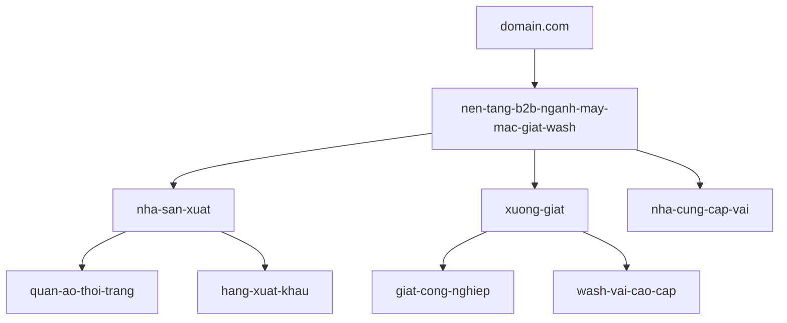
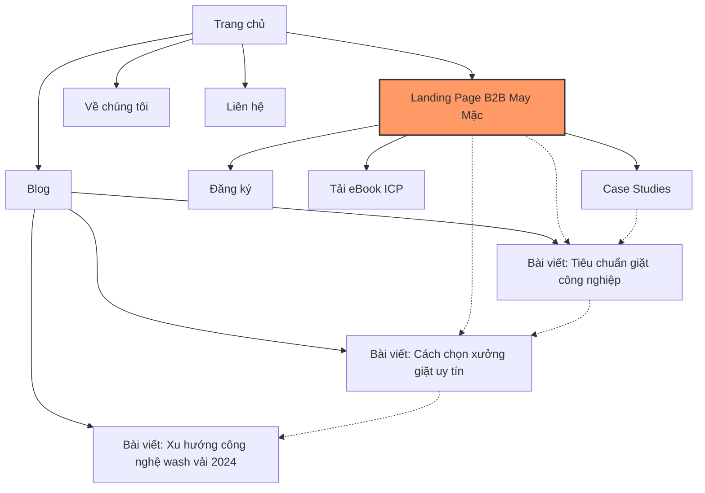

# Chiến Lược On-Page SEO Toàn Diện Cho Landing Page B2B Ngành May Mặc, Giặt, Wash:

## Table of Contents  
1. Giới thiệu về On-Page SEO cho B2B  
2. Cấu trúc URL tối ưu  
3. Meta Tags tối ưu  
4. Schema Markup  
5. Chiến lược Heading Tags  
6. Cấu trúc nội dung  
7. Chiến lược Internal Linking  
8. Tối ưu hóa hình ảnh và đa phương tiện  
9. Tối ưu hóa Mobile và Page Speed  
10. Triển khai trên NextJS  
11. Đo lường và phân tích hiệu quả  
12. Kết luận và tổng hợp  

## 1. Giới thiệu về On-Page SEO cho B2B  

On-page SEO là quá trình tối ưu hóa các yếu tố trên trang web để cải thiện thứ hạng trên công cụ tìm kiếm và thu hút lưu lượng truy cập hữu cơ. Đối với các doanh nghiệp B2B trong ngành may mặc, giặt và wash, on-page SEO đóng vai trò đặc biệt quan trọng vì chu kỳ mua hàng B2B thường phức tạp hơn và liên quan đến nhiều bên ra quyết định.  

Theo nghiên cứu, "Không có khía cạnh nào khác của SEO có tác động lớn hơn đến khả năng tiếp cận và hiển thị của bạn so với từ khóa". Đặc biệt trong lĩnh vực B2B, nơi khách hàng "kén chọn hơn và khó chuyển đổi hơn", việc tối ưu hóa on-page SEO trở nên cực kỳ quan trọng.  

Ngành may mặc Việt Nam đang phát triển mạnh mẽ với hơn 6.000 nhà sản xuất quần áo và 2,4 triệu công nhân, chiếm 12-30% thị phần trong ngành dệt may toàn cầu. Điều này tạo ra một thị trường tiềm năng lớn cho các nền tảng B2B kết nối các đơn vị trong chuỗi cung ứng ngành may mặc.  

Chiến lược on-page SEO toàn diện sẽ giúp landing page của bạn:  
- Tăng khả năng hiển thị trên công cụ tìm kiếm  
- Thu hút đúng đối tượng khách hàng mục tiêu  
- Cải thiện trải nghiệm người dùng  
- Tăng tỷ lệ chuyển đổi  
- Xây dựng uy tín và niềm tin với khách hàng B2B  

## 2. Cấu trúc URL tối ưu  

Cấu trúc URL đóng vai trò quan trọng trong SEO vì nó giúp cả người dùng và công cụ tìm kiếm hiểu nội dung của trang. Theo nghiên cứu, "URLs là một yếu tố xếp hạng trong Google" và "cấu trúc URL đơn giản, logic, dễ nhớ VÀ truyền tải ý nghĩa với các từ được sử dụng được coi là tốt nhất".  

### Đề xuất cấu trúc URL tối ưu:  

```  
https://domain.com/nen-tang-b2b-nganh-may-mac-giat-wash  
```  

### Các nguyên tắc tối ưu hóa URL:  

| Nguyên tắc | Áp dụng | Lợi ích |  
|------------|---------|---------|  
| Ngắn gọn và mô tả | Dưới 60 ký tự, bao gồm từ khóa chính | Dễ đọc, dễ nhớ, tăng CTR |  
| Sử dụng từ khóa chính | "nen-tang-b2b-nganh-may-mac" | Tăng tính liên quan cho SEO |  
| Dùng dấu gạch ngang | Phân tách các từ bằng "-" | Giúp Google hiểu ranh giới giữa các từ |  
| Loại bỏ từ dừng | Không dùng "và", "cho", "của", v.v. | Làm URL ngắn gọn hơn |  
| Chỉ dùng chữ thường | Tránh chữ hoa và ký tự đặc biệt | Tránh trùng lặp URL |  
| Tránh tham số động | Không dùng "?", "&", "=" | Dễ đọc và dễ chia sẻ hơn |  

### Cấu trúc URL phân cấp cho các trang con:  

```  
/nen-tang-b2b-nganh-may-mac-giat-wash/nha-san-xuat  
/nen-tang-b2b-nganh-may-mac-giat-wash/xuong-giat  
/nen-tang-b2b-nganh-may-mac-giat-wash/nha-cung-cap-vai  
```  

Cấu trúc phân cấp này giúp tạo ra một hệ thống phân loại rõ ràng, giúp người dùng và công cụ tìm kiếm dễ dàng điều hướng và hiểu cấu trúc của trang web.  



## 3. Meta Tags tối ưu  

Meta tags là các thẻ HTML cung cấp thông tin về trang web cho công cụ tìm kiếm và người dùng. Chúng không hiển thị trên trang web nhưng đóng vai trò quan trọng trong việc cải thiện SEO và tỷ lệ nhấp chuột (CTR).  

### 3.1 Title Tag (3 phương án)  

Title tag là yếu tố quan trọng nhất trong meta tags, ảnh hưởng trực tiếp đến xếp hạng SEO và CTR. Theo nghiên cứu, "Title tag là tiêu đề có thể nhấp được xuất hiện trong kết quả tìm kiếm" và "Google xem xét title tag để hiểu chủ đề của nội dung".  

**Phương án 1:**  
```html  
<title>Nền Tảng B2B Ngành May Mặc & Giặt Wash | Kết Nối Doanh Nghiệp</title>  
```  
(57 ký tự - Tập trung vào từ khóa chính và giá trị cốt lõi)  

**Phương án 2:**  
```html  
<title>Kết Nối Xưởng Giặt Công Nghiệp & Nhà Cung Cấp Vải | B2B Dệt May</title>  
```  
(58 ký tự - Nhấn mạnh vào đối tượng khách hàng cụ thể)  

**Phương án 3:**  
```html  
<title>Nền Tảng B2B Dệt May Việt Nam | Tối Ưu Chuỗi Cung Ứng May Mặc</title>  
```  
(59 ký tự - Tập trung vào lợi ích và địa phương hóa)  

### 3.2 Meta Description (2 phương án)  

Meta description là đoạn mô tả ngắn xuất hiện dưới tiêu đề trong kết quả tìm kiếm. Mặc dù không trực tiếp ảnh hưởng đến xếp hạng, nhưng meta description tốt có thể cải thiện CTR đáng kể.  

**Phương án 1:**  
```html  
<meta name="description" content="Kết nối với 6.000+ đối tác trong ngành may mặc, giặt công nghiệp và wash vải cao cấp. Tải eBook hướng dẫn xây dựng ICP miễn phí ngay hôm nay!">  
```  
(158 ký tự - Nhấn mạnh quy mô mạng lưới và CTA rõ ràng)  

**Phương án 2:**  
```html  
<meta name="description" content="Nền tảng B2B hàng đầu kết nối nhà sản xuất, xưởng giặt và đối tác nguyên liệu. Tối ưu chuỗi cung ứng và chuẩn hóa hồ sơ khách hàng mục tiêu ngay!">  
```  
(156 ký tự - Tập trung vào lợi ích và giải pháp)  

### 3.3 Open Graph Tags  

Open Graph tags giúp kiểm soát cách nội dung hiển thị khi được chia sẻ trên các nền tảng mạng xã hội như Facebook, LinkedIn.  

```html  
<meta property="og:title" content="Nền Tảng Kết Nối B2B Ngành Dệt May & Giặt Công Nghiệp">  
<meta property="og:description" content="Giải pháp toàn diện cho chuỗi cung ứng ngành may mặc Việt Nam. Kết nối với 6.000+ đối tác chất lượng cao.">  
<meta property="og:image" content="https://domain.com/images/og-b2b-may-mac.jpg">  
<meta property="og:url" content="https://domain.com/nen-tang-b2b-nganh-may-mac-giat-wash">  
<meta property="og:type" content="website">  
<meta property="og:site_name" content="Tên Công Ty">  
```  

### 3.4 Twitter Card Tags  

Twitter Card tags tương tự như Open Graph tags nhưng được tối ưu hóa cho Twitter.  

```html  
<meta name="twitter:card" content="summary_large_image">  
<meta name="twitter:site" content="@tencongty">  
<meta name="twitter:title" content="Nền Tảng B2B Ngành May Mặc & Giặt Wash | Kết Nối Doanh Nghiệp">  
<meta name="twitter:description" content="Kết nối với 6.000+ đối tác trong ngành may mặc, giặt công nghiệp và wash vải cao cấp.">  
<meta name="twitter:image" content="https://domain.com/images/twitter-b2b-may-mac.jpg">  
```  

### 3.5 Canonical Tag  

Canonical tag giúp tránh vấn đề nội dung trùng lặp bằng cách chỉ định URL chính thức cho một trang.  

```html  
<link rel="canonical" href="https://domain.com/nen-tang-b2b-nganh-may-mac-giat-wash">  
```  

### 3.6 Triển khai trong NextJS  

Trong NextJS, bạn có thể sử dụng component `Head` từ `next/head` để quản lý meta tags:  

```jsx  
import Head from 'next/head';  

export default function LandingPage() {  
  return (  
    <>  
      <Head>  
        <title>Nền Tảng B2B Ngành May Mặc & Giặt Wash | Kết Nối Doanh Nghiệp</title>  
        <meta name="description" content="Kết nối với 6.000+ đối tác trong ngành may mặc, giặt công nghiệp và wash vải cao cấp. Tải eBook hướng dẫn xây dựng ICP miễn phí ngay hôm nay!" />  
        <meta property="og:title" content="Nền Tảng Kết Nối B2B Ngành Dệt May & Giặt Công Nghiệp" />  
        {/* Các meta tags khác */}  
        <link rel="canonical" href="https://domain.com/nen-tang-b2b-nganh-may-mac-giat-wash" />  
      </Head>  
      {/* Nội dung trang */}  
    </>  
  );  
}  
```  

Hoặc sử dụng thư viện `next-seo` để quản lý SEO dễ dàng hơn:  

```jsx  
import { NextSeo } from 'next-seo';  

export default function LandingPage() {  
  return (  
    <>  
      <NextSeo  
        title="Nền Tảng B2B Ngành May Mặc & Giặt Wash | Kết Nối Doanh Nghiệp"  
        description="Kết nối với 6.000+ đối tác trong ngành may mặc, giặt công nghiệp và wash vải cao cấp. Tải eBook hướng dẫn xây dựng ICP miễn phí ngay hôm nay!"  
        canonical="https://domain.com/nen-tang-b2b-nganh-may-mac-giat-wash"  
        openGraph={{  
          url: 'https://domain.com/nen-tang-b2b-nganh-may-mac-giat-wash',  
          title: 'Nền Tảng Kết Nối B2B Ngành Dệt May & Giặt Công Nghiệp',  
          description: 'Giải pháp toàn diện cho chuỗi cung ứng ngành may mặc Việt Nam',  
          images: [  
            {  
              url: 'https://domain.com/images/og-b2b-may-mac.jpg',  
              width: 1200,  
              height: 630,  
              alt: 'Nền tảng B2B ngành may mặc',  
            },  
          ],  
          site_name: 'Tên Công Ty',  
        }}  
        twitter={{  
          handle: '@tencongty',  
          site: '@tencongty',  
          cardType: 'summary_large_image',  
        }}  
      />  
      {/* Nội dung trang */}  
    </>  
  );  
}  
```  

## 4. Schema Markup  

Schema markup (hay structured data) là một dạng mã được thêm vào trang web để giúp công cụ tìm kiếm hiểu nội dung tốt hơn. Theo nghiên cứu, "Schema markup (còn gọi là structured data) là một loại mã bạn thêm vào trang web để giúp công cụ tìm kiếm hiểu nội dung của bạn tốt hơn" và "Nó làm cho nội dung của bạn đủ điều kiện để công cụ tìm kiếm như Google hiển thị thêm chi tiết trong kết quả tìm kiếm".  

### 4.1 Loại Schema Markup phù hợp nhất  

Dựa trên phân tích, các loại schema markup phù hợp nhất cho landing page B2B ngành may mặc, giặt, wash bao gồm:  

1. **Service Schema**: Mô tả dịch vụ nền tảng B2B  
2. **Organization Schema**: Cung cấp thông tin về công ty  
3. **WebPage Schema**: Mô tả landing page cụ thể  
4. **BreadcrumbList Schema**: Hiển thị cấu trúc điều hướng  

Trong đó, **Service Schema** kết hợp với **Organization Schema** là phù hợp nhất vì nó mô tả chính xác bản chất của nền tảng B2B và cung cấp thông tin về công ty.  

### 4.2 Code mẫu JSON-LD cho Schema đề xuất  

```jsx  
<script type="application/ld+json">  
{  
  "@context": "https://schema.org",  
  "@type": "Service",  
  "serviceType": "B2B Platform",  
  "name": "Nền Tảng Kết Nối Ngành May Mặc B2B",  
  "description": "Giải pháp kết nối doanh nghiệp trong chuỗi cung ứng dệt may, giặt công nghiệp và wash vải chuyên nghiệp",  
  "provider": {  
    "@type": "Organization",  
    "name": "[Tên Công Ty]",  
    "logo": "https://domain.com/images/logo.png",  
    "url": "https://domain.com",  
    "sameAs": [  
      "https://facebook.com/tencongty",  
      "https://linkedin.com/company/tencongty",  
      "https://twitter.com/tencongty"  
    ],  
    "contactPoint": {  
      "@type": "ContactPoint",  
      "telephone": "+84-xxx-xxx-xxx",  
      "contactType": "customer service",  
      "availableLanguage": ["Vietnamese", "English"]  
    }  
  },  
  "areaServed": {  
    "@type": "Country",  
    "name": "Vietnam"  
  },  
  "audience": {  
    "@type": "BusinessAudience",  
    "audienceType": "Textile and Garment Industry"  
  },  
  "hasOfferCatalog": {  
    "@type": "OfferCatalog",  
    "name": "Dịch Vụ Kết Nối B2B",  
    "itemListElement": [  
      {  
        "@type": "Offer",  
        "itemOffered": {  
          "@type": "Service",  
          "name": "Kết nối nhà sản xuất quần áo"  
        }  
      },  
      {  
        "@type": "Offer",  
        "itemOffered": {  
          "@type": "Service",  
          "name": "Kết nối xưởng giặt công nghiệp"  
        }  
      },  
      {  
        "@type": "Offer",  
        "itemOffered": {  
          "@type": "Service",  
          "name": "Kết nối nhà cung cấp vải"  
        }  
      }  
    ]  
  }  
}  
</script>  
```  

### 4.3 Schema BreadcrumbList  

```jsx  
<script type="application/ld+json">  
{  
  "@context": "https://schema.org",  
  "@type": "BreadcrumbList",  
  "itemListElement": [  
    {  
      "@type": "ListItem",  
      "position": 1,  
      "name": "Trang chủ",  
      "item": "https://domain.com"  
    },  
    {  
      "@type": "ListItem",  
      "position": 2,  
      "name": "Nền tảng B2B",  
      "item": "https://domain.com/nen-tang-b2b"  
    },  
    {  
      "@type": "ListItem",  
      "position": 3,  
      "name": "Ngành may mặc, giặt, wash",  
      "item": "https://domain.com/nen-tang-b2b-nganh-may-mac-giat-wash"  
    }  
  ]  
}  
</script>  
```  

### 4.4 Triển khai Schema trong NextJS  

Trong NextJS, bạn có thể triển khai schema markup bằng cách sử dụng component `Script`:  

```jsx  
import Script from 'next/script';  

export default function LandingPage() {  
  const serviceSchema = {  
    "@context": "https://schema.org",  
    "@type": "Service",  
    // ... (nội dung schema như trên)  
  };  

  const breadcrumbSchema = {  
    "@context": "https://schema.org",  
    "@type": "BreadcrumbList",  
    // ... (nội dung schema như trên)  
  };  

  return (  
    <>  
      <Script  
        id="service-schema"  
        type="application/ld+json"  
        dangerouslySetInnerHTML={{ __html: JSON.stringify(serviceSchema) }}  
      />  
      <Script  
        id="breadcrumb-schema"  
        type="application/ld+json"  
        dangerouslySetInnerHTML={{ __html: JSON.stringify(breadcrumbSchema) }}  
      />  
      {/* Nội dung trang */}  
    </>  
  );  
}  
```  

Hoặc sử dụng thư viện `next-seo`:  

```jsx  
import { NextSeo, BreadcrumbJsonLd } from 'next-seo';  

export default function LandingPage() {  
  return (  
    <>  
      <NextSeo  
        // ... (cấu hình SEO như đã đề cập ở trên)  
      />  
      <BreadcrumbJsonLd  
        itemListElements={[  
          {  
            position: 1,  
            name: 'Trang chủ',  
            item: 'https://domain.com',  
          },  
          {  
            position: 2,  
            name: 'Nền tảng B2B',  
            item: 'https://domain.com/nen-tang-b2b',  
          },  
          {  
            position: 3,  
            name: 'Ngành may mặc, giặt, wash',  
            item: 'https://domain.com/nen-tang-b2b-nganh-may-mac-giat-wash',  
          },  
        ]}  
      />  
      {/* Nội dung trang */}  
    </>  
  );  
}  
```  

## 5. Chiến lược Heading Tags  

Heading tags (H1, H2, H3, v.v.) đóng vai trò quan trọng trong việc cấu trúc nội dung và giúp công cụ tìm kiếm hiểu chủ đề của trang. Theo nghiên cứu, "Nội dung có cấu trúc tốt với các tiêu đề và tiêu đề phụ rõ ràng (từ H1 đến H6) giúp người dùng dễ dàng đọc lướt qua nội dung và tìm thông tin họ cần".  

### 5.1 Cấu trúc H1, H2, H3 tối ưu  

**H1 (Tiêu đề chính - chỉ sử dụng 1 lần):**  
```html  
<h1>Nền Tảng Kết Nối B2B Cho Ngành May Mặc, Giặt & Wash Chuyên Nghiệp</h1>  
```  

**H2 (Tiêu đề phần - 4-6 tiêu đề):**  
```html  
<h2>Lợi Ích Vượt Trội Cho Doanh Nghiệp Dệt May</h2>  
<h2>Đối Tượng Khách Hàng Mục Tiêu</h2>  
<h2>Tính Năng Nổi Bật Của Nền Tảng B2B</h2>  
<h2>Quy Trình Kết Nối Đối Tác Trên Nền Tảng</h2>  
<h2>Khách Hàng Nói Gì Về Chúng Tôi</h2>  
<h2>Câu Hỏi Thường Gặp</h2>  
```  

**H3 (Tiêu đề mục - 2-4 tiêu đề cho mỗi H2):**  
```html  
<!-- Dưới H2 "Lợi Ích Vượt Trội Cho Doanh Nghiệp Dệt May" -->  
<h3>Kết Nối Trực Tiếp Với 6.000+ Xưởng Sản Xuất</h3>  
<h3>Tối Ưu Chi Phí Vận Hành Chuỗi Cung Ứng</h3>  
<h3>Đảm Bảo Chất Lượng Với Hệ Thống Đánh Giá Đối Tác</h3>  

<!-- Dưới H2 "Đối Tượng Khách Hàng Mục Tiêu" -->  
<h3>Nhà Sản Xuất Quần Áo Xuất Khẩu</h3>  
<h3>Xưởng Giặt Công Nghiệp Quy Mô Lớn</h3>  
<h3>Nhà Cung Cấp Vải Và Nguyên Liệu</h3>  
```  

### 5.2 Cách phân bổ từ khóa trong heading tags  

| Heading | Từ khóa chính | Từ khóa phụ | Từ khóa đuôi dài |  
|---------|---------------|-------------|------------------|  
| H1 | Nền tảng B2B, ngành may mặc | giặt, wash | - |  
| H2 | B2B dệt may, kết nối đối tác | xưởng sản xuất, chuỗi cung ứng | - |  
| H3 | - | nhà sản xuất, xưởng giặt | kết nối xưởng giặt công nghiệp, nhà cung cấp vải cao cấp |  

### 5.3 Số lượng heading tag nên sử dụng  

- **H1**: 1 tag (tiêu đề chính của trang)  
- **H2**: 4-6 tags (các phần chính của trang)  
- **H3**: 2-4 tags cho mỗi H2 (các mục con của mỗi phần)  
- **H4**: Sử dụng khi cần phân chia H3 thành các mục nhỏ hơn  

### 5.4 Mẫu cấu trúc heading tags hoàn chỉnh  

```mermaid  
flowchart TD  
    H1["H1: Nền Tảng Kết Nối B2B Cho Ngành May Mặc, Giặt & Wash Chuyên Nghiệp"]  
    
    H1 --> H2_1["H2: Lợi Ích Vượt Trội Cho Doanh Nghiệp Dệt May"]  
    H1 --> H2_2["H2: Đối Tượng Khách Hàng Mục Tiêu"]  
    H1 --> H2_3["H2: Tính Năng Nổi Bật Của Nền Tảng B2B"]  
    H1 --> H2_4["H2: Quy Trình Kết Nối Đối Tác Trên Nền Tảng"]  
    H1 --> H2_5["H2: Khách Hàng Nói Gì Về Chúng Tôi"]  
    H1 --> H2_6["H2: Câu Hỏi Thường Gặp"]  
    
    H2_1 --> H3_1_1["H3: Kết Nối Trực Tiếp Với 6.000+ Xưởng Sản Xuất"]  
    H2_1 --> H3_1_2["H3: Tối Ưu Chi Phí Vận Hành Chuỗi Cung Ứng"]  
    H2_1 --> H3_1_3["H3: Đảm Bảo Chất Lượng Với Hệ Thống Đánh Giá Đối Tác"]  
    
    H2_2 --> H3_2_1["H3: Nhà Sản Xuất Quần Áo Xuất Khẩu"]  
    H2_2 --> H3_2_2["H3: Xưởng Giặt Công Nghiệp Quy Mô Lớn"]  
    H2_2 --> H3_2_3["H3: Nhà Cung Cấp Vải Và Nguyên Liệu"]  
    
    H2_3 --> H3_3_1["H3: Hệ Thống Tìm Kiếm Đối Tác Thông Minh"]  
    H2_3 --> H3_3_2["H3: Quản Lý Đơn Hàng Và Hợp Đồng Trực Tuyến"]  
    H2_3 --> H3_3_3["H3: Báo Cáo Phân Tích Thị Trường Ngành May Mặc"]  
    
    H2_4 --> H3_4_1["H3: Đăng Ký Và Xác Thực Doanh Nghiệp"]  
    H2_4 --> H3_4_2["H3: Tìm Kiếm Và Kết Nối Đối Tác"]  
    H2_4 --> H3_4_3["H3: Đàm Phán Và Ký Kết Hợp Đồng"]  
    
    H3_2_1 --> H4_2_1_1["H4: Tiêu Chuẩn Chất Lượng Xuất Khẩu"]  
    H3_2_1 --> H4_2_1_2["H4: Quy Trình Đặt Hàng Sản Xuất"]  
    
    H3_2_2 --> H4_2_2_1["H4: Công Nghệ Giặt Tiên Tiến"]  
    H3_2_2 --> H4_2_2_2["H4: Tiêu Chuẩn Wash Vải Jean Cao Cấp"]  
```  



### 5.5 Triển khai trong NextJS  

Trong NextJS, bạn có thể triển khai heading tags như sau:  

```jsx  
export default function LandingPage() {  
  return (  
    <div className="landing-page">  
      <h1>Nền Tảng Kết Nối B2B Cho Ngành May Mặc, Giặt & Wash Chuyên Nghiệp</h1>  
      
      <section id="benefits">  
        <h2>Lợi Ích Vượt Trội Cho Doanh Nghiệp Dệt May</h2>  
        <div className="benefits-container">  
          <div className="benefit-item">  
            <h3>Kết Nối Trực Tiếp Với 6.000+ Xưởng Sản Xuất</h3>  
            <p>Tiếp cận ngay với mạng lưới đối tác rộng lớn trong ngành may mặc Việt Nam...</p>  
          </div>  
          {/* Các mục lợi ích khác */}  
        </div>  
      </section>  
      
      {/* Các phần khác */}  
    </div>  
  );  
}  
```  

## 6. Cấu trúc nội dung  

Cấu trúc nội dung tốt không chỉ giúp cải thiện SEO mà còn nâng cao trải nghiệm người dùng. Theo nghiên cứu, "Nội dung chuyên gia, toàn diện và có giá trị hiện đang đóng vai trò quan trọng. Để làm hài lòng công cụ tìm kiếm và thu hút người dùng, hãy xem xét các yếu tố EEAT, tạo nội dung toàn diện phù hợp với mục đích tìm kiếm của đối tượng mục tiêu và định dạng nó với khả năng sử dụng trong tâm trí".  

### 6.1 Mật độ từ khóa phù hợp  

Mật độ từ khóa là tỷ lệ phần trăm số lần từ khóa xuất hiện trong tổng số từ của nội dung. Mật độ từ khóa tối ưu nên như sau:  

| Loại từ khóa | Mật độ tối ưu | Ví dụ |  
|--------------|--------------|-------|  
| Từ khóa chính | 1.2-1.8% | "nền tảng B2B ngành may mặc", "kết nối B2B dệt may" |  
| Từ khóa phụ | 0.5-1% | "xưởng giặt công nghiệp", "nhà cung cấp vải" |  
| Từ khóa đuôi dài | 0.3-0.7% | "tìm xưởng giặt công nghiệp uy tín", "kết nối nhà cung cấp vải cao cấp" |  
| Từ khóa LSI | 0.5-1% | "quy trình giặt công nghiệp", "tiêu chuẩn Global Organic Textile" |  

Lưu ý: Tránh nhồi nhét từ khóa (keyword stuffing) vì điều này có thể dẫn đến hình phạt từ Google. Theo nghiên cứu, "Tránh quá tải liên kết, vì Google giảm giá trị liên kết quá mức tương tự như nhồi nhét từ khóa".  

### 6.2 Cấu trúc nội dung tối ưu  

#### 6.2.1 Đoạn giới thiệu (150-200 từ)  

Đoạn giới thiệu nên bao gồm từ khóa chính trong 100 từ đầu tiên và cung cấp tổng quan về nền tảng B2B. Sử dụng phương pháp APP (Agree, Promise, Preview) hoặc PPB (Preview, Proof, Bridge) để tạo đoạn giới thiệu hấp dẫn.  

```html  
<div class="introduction">  
  <p>  
    <strong>Nền tảng B2B ngành may mặc, giặt và wash</strong> của chúng tôi là giải pháp toàn diện kết nối các doanh nghiệp trong chuỗi cung ứng dệt may Việt Nam. Với hơn 6.000 nhà sản xuất quần áo và 2,4 triệu công nhân trong ngành, việc tìm kiếm đối tác phù hợp là thách thức lớn mà mọi doanh nghiệp đều phải đối mặt.  
  </p>  
  <p>  
    Chúng tôi giúp bạn vượt qua thách thức này bằng cách cung cấp một nền tảng kết nối B2B hiện đại, nơi các nhà sản xuất, xưởng giặt công nghiệp và nhà cung cấp vải có thể tìm thấy nhau, đàm phán và hợp tác một cách hiệu quả.  
  </p>  
</div>  
```  

#### 6.2.2 Bullet points và danh sách  

Sử dụng bullet points và danh sách để làm nổi bật các tính năng và lợi ích chính:  

```html  
<div class="key-benefits">  
  <h3>Lợi ích chính của nền tảng B2B:</h3>  
  <ul>  
    <li>✅ <strong>Kết nối trực tiếp</strong> với 6.000+ nhà sản xuất và đối tác</li>  
    <li>✅ <strong>Tiết kiệm 30% chi phí</strong> so với phương pháp truyền thống</li>  
    <li>✅ <strong>Hệ thống đánh giá đối tác</strong> minh bạch và đáng tin cậy</li>  
    <li>✅ <strong>Báo cáo thị trường</strong> cập nhật hàng tuần</li>  
    <li>✅ <strong>Hỗ trợ đàm phán và ký kết hợp đồng</strong> trực tuyến</li>  
  </ul>  
</div>  
```  

#### 6.2.3 Bảng so sánh  

Sử dụng bảng để so sánh nền tảng B2B với các phương pháp truyền thống:  

```html  
<div class="comparison-table">  
  <h3>So sánh nền tảng B2B với phương pháp truyền thống:</h3>  
  <table>  
    <thead>  
      <tr>  
        <th>Tính năng</th>  
        <th>Nền tảng B2B</th>  
        <th>Phương pháp truyền thống</th>  
      </tr>  
    </thead>  
    <tbody>  
      <tr>  
        <td>Thời gian tìm kiếm đối tác</td>  
        <td>24-48 giờ</td>  
        <td>5-7 ngày</td>  
      </tr>  
      <tr>  
        <td>Chi phí môi giới</td>  
        <td>0đ (miễn phí đăng ký)</td>  
        <td>15-20% hoa hồng</td>  
      </tr>  
      <tr>  
        <td>Số lượng đối tác tiếp cận</td>  
        <td>6.000+</td>  
        <td>10-20</td>  
      </tr>  
      <tr>  
        <td>Đánh giá chất lượng đối tác</td>  
        <td>Hệ thống đánh giá tự động</td>  
        <td>Không có</td>  
      </tr>  
      <tr>  
        <td>Hỗ trợ đàm phán</td>  
        <td>24/7</td>  
        <td>Giờ hành chính</td>  
      </tr>  
    </tbody>  
  </table>  
</div>  
```  

#### 6.2.4 Hình ảnh và đa phương tiện  

Sử dụng hình ảnh, video và infographic để minh họa các tính năng và lợi ích:  

```html  
<div class="multimedia-content">  
  <h3>Xem cách nền tảng B2B hoạt động:</h3>  
  <div class="video-container">  
    <iframe width="560" height="315" src="https://www.youtube.com/embed/VIDEO_ID" title="Cách nền tảng B2B kết nối các doanh nghiệp ngành may mặc" frameborder="0" allow="accelerometer; autoplay; clipboard-write; encrypted-media; gyroscope; picture-in-picture" allowfullscreen></iframe>  
  </div>  
</div>  
```  

#### 6.2.5 Testimonials và case studies  

Sử dụng testimonials và case studies để xây dựng niềm tin:  

```html  
<div class="testimonials">  
  <h2>Khách hàng nói gì về chúng tôi</h2>  
  <div class="testimonial-grid">  
    <div class="testimonial-item">  
      <div class="testimonial-content">  
        <p>"Nền tảng B2B đã giúp chúng tôi tìm được đối tác xưởng giặt công nghiệp uy tín chỉ trong 24 giờ, tiết kiệm hơn 20% chi phí so với trước đây."</p>  
      </div>  
      <div class="testimonial-author">  
          
        <div>  
          <h4>Nguyễn Văn A</h4>  
          <p>Giám đốc sản xuất, Công ty May Mặc XYZ</p>  
        </div>  
      </div>  
    </div>  
    <!-- Thêm testimonial khác -->  
  </div>  
</div>  
```  

#### 6.2.6 FAQ (Câu hỏi thường gặp)  

Sử dụng FAQ để giải đáp các câu hỏi phổ biến và tối ưu hóa cho featured snippets:  

```html  
<div class="faq-section">  
  <h2>Câu hỏi thường gặp</h2>  
  <div class="faq-item">  
    <h3>Làm thế nào để đăng ký sử dụng nền tảng B2B?</h3>  
    <div>  
      <p>Để đăng ký sử dụng nền tảng B2B, bạn chỉ cần:</p>  
      <ol>  
        <li>Truy cập trang đăng ký tại <a href="/dang-ky">domain.com/dang-ky</a></li>  
        <li>Điền thông tin doanh nghiệp của bạn</li>  
        <li>Xác thực email và số điện thoại</li>  
        <li>Tải lên giấy phép kinh doanh để xác minh</li>  
        <li>Bắt đầu sử dụng nền tảng sau khi được phê duyệt (thường trong vòng 24 giờ)</li>  
      </ol>  
    </div>  
  </div>  
  <!-- Thêm FAQ khác -->  
</div>  
```  

#### 6.2.7 Call-to-Action (CTA)  

Sử dụng CTA rõ ràng và hấp dẫn để khuyến khích người dùng thực hiện hành động:  

```html  
<div class="cta-section">  
  <h2>Bắt đầu kết nối với đối tác ngay hôm nay</h2>  
  <p>Tham gia cùng hơn 10.000 doanh nghiệp đang sử dụng nền tảng B2B của chúng tôi</p>  
  <div class="cta-buttons">  
    <a href="/dang-ky" class="primary-button">Đăng ký miễn phí</a>  
    <a href="/lien-he" class="secondary-button">Liên hệ tư vấn</a>  
  </div>  
  <p class="cta-note">Hoặc tải xuống eBook "Phân tích & Chuẩn hóa Hồ sơ khách hàng mục tiêu (ICP)" miễn phí</p>  
  <a href="/download-ebook" class="download-button">Tải eBook miễn phí</a>  
</div>  
```  

### 6.3 Triển khai trong NextJS  

Trong NextJS, bạn có thể triển khai cấu trúc nội dung như sau:  

```jsx  
import Image from 'next/image';  
import Link from 'next/link';  

export default function LandingPage() {  
  return (  
    <div className="landing-page">  
      {/* Phần giới thiệu */}  
      <section className="introduction">  
        <h1>Nền Tảng Kết Nối B2B Cho Ngành May Mặc, Giặt & Wash Chuyên Nghiệp</h1>  
        <p>  
          <strong>Nền tảng B2B ngành may mặc, giặt và wash</strong> của chúng tôi là giải pháp toàn diện kết nối các doanh nghiệp trong chuỗi cung ứng dệt may Việt Nam...  
        </p>  
        {/* Nội dung giới thiệu khác */}  
      </section>  
      
      {/* Phần lợi ích */}  
      <section className="benefits" id="benefits">  
        <h2>Lợi Ích Vượt Trội Cho Doanh Nghiệp Dệt May</h2>  
        <div className="benefits-list">  
          <ul>  
            <li>✅ <strong>Kết nối trực tiếp</strong> với 6.000+ nhà sản xuất và đối tác</li>  
            {/* Các lợi ích khác */}  
          </ul>  
        </div>  
      </section>  
      
      {/* Bảng so sánh */}  
      <section className="comparison" id="comparison">  
        <h2>So Sánh Với Phương Pháp Truyền Thống</h2>  
        <div className="table-responsive">  
          <table className="comparison-table">  
            <thead>  
              <tr>  
                <th>Tính năng</th>  
                <th>Nền tảng B2B</th>  
                <th>Phương pháp truyền thống</th>  
              </tr>  
            </thead>  
            <tbody>  
              {/* Nội dung bảng */}  
            </tbody>  
          </table>  
        </div>  
      </section>  
      
      {/* Các phần khác */}  
      
      {/* CTA */}  
      <section className="cta" id="cta">  
        <h2>Bắt Đầu Kết Nối Với Đối Tác Ngay Hôm Nay</h2>  
        <p>Tham gia cùng hơn 10.000 doanh nghiệp đang sử dụng nền tảng B2B của chúng tôi</p>  
        <div className="cta-buttons">  
          <Link href="/dang-ky">  
            <a className="primary-button">Đăng ký miễn phí</a>  
          </Link>  
          <Link href="/lien-he">  
            <a className="secondary-button">Liên hệ tư vấn</a>  
          </Link>  
        </div>  
      </section>  
    </div>  
  );  
}  
```  

## 7. Chiến lược Internal Linking  

Internal linking (liên kết nội bộ) là việc tạo các liên kết từ một trang đến trang khác trong cùng một trang web. Theo nghiên cứu, "Internal links là một yếu tố xếp hạng mạnh mẽ" và "Giống như backlinks, internal links có thể truyền link juice và cho Google biết trang nào quan trọng hơn".  

### 7.1 Tầm quan trọng của internal linking  

Internal linking mang lại nhiều lợi ích:  

1. **Phân phối link equity**: Truyền "link juice" từ các trang có thẩm quyền cao đến các trang khác trong trang web  
2. **Cải thiện khả năng crawl**: Giúp Google khám phá và lập chỉ mục các trang mới  
3. **Tăng thời gian trên trang**: Khuyến khích người dùng khám phá nhiều trang hơn  
4. **Xây dựng cấu trúc trang web**: Tạo ra một hệ thống phân cấp logic cho trang web  
5. **Tăng tính liên quan của từ khóa**: Sử dụng anchor text có từ khóa để tăng tính liên quan  

### 7.2 Số lượng internal links tối ưu  

Theo nghiên cứu, "Số lượng internal links tối ưu trên mỗi trang cho SEO phụ thuộc vào độ dài nội dung, mục đích và tính liên quan của liên kết. Nói chung, hãy nhắm đến 5-10 internal links cho mỗi 2.000 từ, hoặc khoảng một liên kết cho mỗi 200-300 từ".  

| Độ dài nội dung | Số lượng internal links đề xuất |  
|-----------------|--------------------------------|  
| 500-1.000 từ | 2-5 links |  
| 1.000-2.000 từ | 5-10 links |  
| 2.000-3.000 từ | 10-15 links |  
| 3.000+ từ | 15-20 links |  

### 7.3 Các loại internal links  

1. **Navigational links (Liên kết điều hướng)**: Xuất hiện trong menu chính, footer, sidebar  
2. **Contextual links (Liên kết ngữ cảnh)**: Xuất hiện trong nội dung chính  
3. **Related content links (Liên kết nội dung liên quan)**: Liên kết đến các bài viết hoặc trang liên quan  
4. **Breadcrumb links (Liên kết breadcrumb)**: Hiển thị đường dẫn điều hướng  
5. **Call-to-action links (Liên kết kêu gọi hành động)**: Khuyến khích người dùng thực hiện hành động  

### 7.4 Cấu trúc internal linking đề xuất  



### 7.5 Anchor text tối ưu  

Anchor text (văn bản liên kết) là văn bản có thể nhấp được trong một liên kết. Theo nghiên cứu, "Anchor text là yếu tố thiết yếu đối với SEO vì nó cho các trình thu thập thông tin của công cụ tìm kiếm biết nội dung đích là gì".  

| Loại anchor text | Ví dụ | Ghi chú |  
|------------------|-------|---------|  
| Exact match | "nền tảng B2B ngành may mặc" | Sử dụng có chọn lọc, tránh lạm dụng |  
| Partial match | "kết nối đối tác trong ngành may mặc" | Tự nhiên và đa dạng |  
| Branded | "Nền tảng [Tên Công Ty]" | Tăng cường nhận diện thương hiệu |  
| Generic | "nhấp vào đây", "tìm hiểu thêm" | Hạn chế sử dụng |  
| Naked URL | "domain.com/url" | Tránh sử dụng |  
| Long-tail | "tìm xưởng giặt công nghiệp uy tín tại Hà Nội" | Tốt cho từ khóa đuôi dài |  

### 7.6 Chiến lược internal linking cho landing page B2B  

1. **Liên kết từ menu chính**:  
   - Đảm bảo landing page được liên kết từ menu chính  
   - Sử dụng anchor text chính xác: "Nền tảng B2B ngành may mặc"  

2. **Liên kết từ trang chủ**:  
   - Tạo banner hoặc section trên trang chủ liên kết đến landing page  
   - Sử dụng CTA hấp dẫn: "Khám phá nền tảng B2B ngành may mặc"  

3. **Liên kết từ blog**:  
   - Tạo các bài viết blog liên quan đến ngành may mặc, giặt, wash  
   - Liên kết từ các bài viết đến landing page  
   - Sử dụng anchor text đa dạng và tự nhiên  

4. **Liên kết từ landing page đến các trang khác**:  
   - Liên kết đến trang đăng ký, trang tải eBook ICP  
   - Liên kết đến các bài viết blog liên quan  
   - Liên kết đến case studies và testimonials  

5. **Breadcrumb navigation**:  
   - Triển khai breadcrumb navigation để hiển thị vị trí của trang trong cấu trúc trang web  
   - Ví dụ: Trang chủ > Nền tảng B2B > Ngành may mặc, giặt, wash  

### 7.7 Triển khai trong NextJS  

Trong NextJS, bạn có thể triển khai internal linking như sau:  

```jsx  
import Link from 'next/link';  

export default function LandingPage() {  
  return (  
    <div className="landing-page">  
      {/* Breadcrumb navigation */}  
      <nav className="breadcrumb">  
        <Link href="/">  
          <a>Trang chủ</a>  
        </Link>  
        <span className="separator">&gt;</span>  
        <Link href="/nen-tang-b2b">  
          <a>Nền tảng B2B</a>  
        </Link>  
        <span className="separator">&gt;</span>  
        <span className="current">Ngành may mặc, giặt, wash</span>  
      </nav>  
      
      {/* Nội dung chính với internal links */}  
      <section className="introduction">  
        <h1>Nền Tảng Kết Nối B2B Cho Ngành May Mặc, Giặt & Wash Chuyên Nghiệp</h1>  
        <p>  
          <strong>Nền tảng B2B ngành may mặc, giặt và wash</strong> của chúng tôi là giải pháp toàn diện kết nối các doanh nghiệp trong chuỗi cung ứng dệt may Việt Nam. Với hơn 6.000 nhà sản xuất quần áo và 2,4 triệu công nhân trong ngành, việc tìm kiếm <Link href="/doi-tac-phu-hop"><a>đối tác phù hợp</a></Link> là thách thức lớn mà mọi doanh nghiệp đều phải đối mặt.  
        </p>  
        <p>  
          Chúng tôi giúp bạn vượt qua thách thức này bằng cách cung cấp một <Link href="/nen-tang-b2b"><a>nền tảng kết nối B2B hiện đại</a></Link>, nơi các <Link href="/nha-san-xuat"><a>nhà sản xuất</a></Link>, <Link href="/xuong-giat-cong-nghiep"><a>xưởng giặt công nghiệp</a></Link> và <Link href="/nha-cung-cap-vai"><a>nhà cung cấp vải</a></Link> có thể tìm thấy nhau, đàm phán và hợp tác một cách hiệu quả.  
        </p>  
      </section>  
      
      {/* Các phần khác với internal links */}  
      
      {/* Related content section */}  
      <section className="related-content">  
        <h2>Bài Viết Liên Quan</h2>  
        <div className="related-posts">  
          <div className="related-post-item">  
            <h3>  
              <Link href="/blog/tieu-chuan-giat-cong-nghiep">  
                <a>Tiêu Chuẩn Giặt Công Nghiệp Cho Vải Cao Cấp</a>  
              </Link>  
            </h3>  
            <p>Tìm hiểu về các tiêu chuẩn giặt công nghiệp hiện đại và cách áp dụng...</p>  
            <Link href="/blog/tieu-chuan-giat-cong-nghiep">  
              <a className="read-more">Đọc tiếp &rarr;</a>  
            </Link>  
          </div>  
          {/* Các bài viết liên quan khác */}  
        </div>  
      </section>  
    </div>  
  );  
}  
```  

## 8. Tối ưu hóa hình ảnh và đa phương tiện  

Hình ảnh và đa phương tiện đóng vai trò quan trọng trong việc cải thiện trải nghiệm người dùng và SEO. Theo nghiên cứu, "Tối ưu hóa hình ảnh đúng cách có thể tăng tốc độ tải trang, ảnh hưởng đến các yếu tố hành vi mà Google xem xét để xếp hạng" và "Tạo hình ảnh gốc, chất lượng cao và cung cấp thông tin cho nội dung của bạn sẽ tăng cơ hội hình ảnh của bạn xuất hiện trong kết quả".  

### 8.1 Tối ưu hóa hình ảnh  

#### 8.1.1 Định dạng hình ảnh  

| Định dạng | Ưu điểm | Nhược điểm | Khuyến nghị sử dụng |  
|-----------|---------|------------|---------------------|  
| JPEG | Kích thước nhỏ, màu sắc phong phú | Nén mất dữ liệu, không hỗ trợ trong suốt | Hình ảnh phức tạp, ảnh chụp |  
| PNG | Hỗ trợ trong suốt, nén không mất dữ liệu | Kích thước lớn hơn JPEG | Logo, biểu tượng, hình ảnh cần trong suốt |  
| WebP | Kích thước nhỏ hơn JPEG và PNG, hỗ trợ trong suốt | Không được hỗ trợ bởi một số trình duyệt cũ | Sử dụng chính với fallback là JPEG/PNG |  
| SVG | Vector, có thể mở rộng không giới hạn, kích thước nhỏ | Không phù hợp với hình ảnh phức tạp | Logo, biểu tượng, đồ họa đơn giản |  

#### 8.1.2 Kích thước và nén hình ảnh  

- **Kích thước hình ảnh**: Sử dụng kích thước phù hợp với vị trí hiển thị  
- **Nén hình ảnh**: Sử dụng công cụ nén như TinyPNG, ImageOptim  
- **Lazy loading**: Tải hình ảnh khi người dùng cuộn đến  

#### 8.1.3 Alt text và file name  

- **Alt text**: Mô tả ngắn gọn nội dung hình ảnh, bao gồm từ khóa liên quan  
- **File name**: Sử dụng tên file mô tả với từ khóa, phân cách bằng dấu gạch ngang  

Ví dụ:  
```html  
  
```  

### 8.2 Tối ưu hóa video  

#### 8.2.1 Hosting video  

- **Self-hosted**: Kiểm soát hoàn toàn, nhưng tốn tài nguyên server  
- **YouTube/Vimeo**: Giảm tải cho server, tăng khả năng hiển thị, hỗ trợ SEO video  

#### 8.2.2 Schema markup cho video  

```jsx  
<script type="application/ld+json">  
{  
  "@context": "https://schema.org",  
  "@type": "VideoObject",  
  "name": "Cách nền tảng B2B kết nối các doanh nghiệp ngành may mặc",  
  "description": "Video giới thiệu cách nền tảng B2B kết nối nhà sản xuất, xưởng giặt và nhà cung cấp vải trong ngành may mặc",  
  "thumbnailUrl": "https://domain.com/images/video-thumbnail.jpg",  
  "uploadDate": "2023-10-15T08:00:00+08:00",  
  "duration": "PT2M15S",  
  "contentUrl": "https://domain.com/videos/nen-tang-b2b.mp4",  
  "embedUrl": "https://www.youtube.com/embed/VIDEO_ID"  
}  
</script>  
```  

#### 8.2.3 Transcript và caption  

- Cung cấp transcript (bản ghi) cho video để tăng tính tiếp cận và SEO  
- Sử dụng caption (phụ đề) để cải thiện trải nghiệm người dùng  

### 8.3 Triển khai trong NextJS  

Trong NextJS, bạn có thể tối ưu hóa hình ảnh bằng component `Image` từ `next/image`:  

```jsx  
import Image from 'next/image';  

export default function LandingPage() {  
  return (  
    <div className="landing-page">  
      <section className="hero">  
        <div className="hero-content">  
          <h1>Nền Tảng Kết Nối B2B Cho Ngành May Mặc, Giặt & Wash Chuyên Nghiệp</h1>  
          <p>Kết nối với 6.000+ đối tác trong ngành may mặc Việt Nam</p>  
          <div className="cta-buttons">  
            <a href="/dang-ky" className="primary-button">Đăng ký miễn phí</a>  
            <a href="/lien-he" className="secondary-button">Liên hệ tư vấn</a>  
          </div>  
        </div>  
        <div className="hero-image">  
          <Image  
            src="/images/nen-tang-b2b-nganh-may-mac.jpg"  
            alt="Nền tảng B2B kết nối nhà sản xuất và xưởng giặt công nghiệp"  
            width={800}  
            height={600}  
            priority  
            quality={85}  
          />  
        </div>  
      </section>  
      
      {/* Video section */}  
      <section className="video-section">  
        <h2>Xem cách nền tảng B2B hoạt động</h2>  
        <div className="video-container">  
          <iframe  
            width="560"  
            height="315"  
            src="https://www.youtube.com/embed/VIDEO_ID"  
            title="Cách nền tảng B2B kết nối các doanh nghiệp ngành may mặc"  
            frameBorder="0"  
            allow="accelerometer; autoplay; clipboard-write; encrypted-media; gyroscope; picture-in-picture"  
            allowFullScreen  
          ></iframe>  
        </div>  
        <div className="video-transcript">  
          <h3>Bản ghi video</h3>  
          <p>Nền tảng B2B của chúng tôi kết nối các doanh nghiệp trong ngành may mặc thông qua quy trình đơn giản gồm 3 bước...</p>  
        </div>  
      </section>  
    </div>  
  );  
}  
```  

## 9. Tối ưu hóa Mobile và Page Speed  

Tối ưu hóa cho thiết bị di động và tốc độ trang là yếu tố quan trọng trong SEO hiện đại. Theo nghiên cứu, "62% khách hàng B2B sử dụng thiết bị di động để nghiên cứu mua hàng" và "Tốc độ trang là một yếu tố xếp hạng trực tiếp".  

### 9.1 Mobile-first indexing  

Google sử dụng mobile-first indexing, có nghĩa là họ chủ yếu sử dụng phiên bản di động của trang web để lập chỉ mục và xếp hạng. Vì vậy, việc tối ưu hóa cho thiết bị di động là rất quan trọng.  

#### 9.1.1 Responsive design  

- Sử dụng CSS media queries để điều chỉnh layout theo kích thước màn hình  
- Đảm bảo text dễ đọc mà không cần zoom  
- Đảm bảo các nút và liên kết đủ lớn để dễ dàng nhấp trên thiết bị di động  

#### 9.1.2 Mobile-friendly testing  

- Sử dụng công cụ Mobile-Friendly Test của Google để kiểm tra trang web  
- Kiểm tra trên nhiều thiết bị và trình duyệt khác nhau  

### 9.2 Core Web Vitals  

Core Web Vitals là một tập hợp các chỉ số đo lường trải nghiệm người dùng, bao gồm:  

1. **Largest Contentful Paint (LCP)**: Đo thời gian tải nội dung lớn nhất trên trang  
   - Mục tiêu: ≤ 2.5 giây  

2. **First Input Delay (FID)**: Đo thời gian phản hồi khi người dùng tương tác  
   - Mục tiêu: ≤ 100 mili giây  

3. **Cumulative Layout Shift (CLS)**: Đo sự ổn định trực quan của trang  
   - Mục tiêu: ≤ 0.1  

### 9.3 Các kỹ thuật tối ưu hóa tốc độ trang  

| Kỹ thuật | Mô tả | Triển khai trong NextJS |  
|----------|-------|-------------------------|  
| Nén hình ảnh | Giảm kích thước hình ảnh mà không làm giảm chất lượng | Sử dụng `next/image` với `quality` |  
| Lazy loading | Tải nội dung khi người dùng cuộn đến | Sử dụng `loading="lazy"` hoặc `next/image` |  
| Code splitting | Chia nhỏ JavaScript bundle | Sử dụng dynamic import của NextJS |  
| Minification | Loại bỏ khoảng trắng và ký tự không cần thiết | Được tích hợp sẵn trong NextJS |  
| Caching | Lưu trữ tạm thời nội dung | Sử dụng caching headers và CDN |  
| CDN | Phân phối nội dung từ server gần người dùng | Sử dụng Vercel hoặc các CDN khác |  
| Preloading | Tải trước các tài nguyên quan trọng | Sử dụng `<link rel="preload">` |  
| Server-side rendering | Render HTML từ server | Sử dụng `getServerSideProps` |  
| Static generation | Tạo HTML tại thời điểm build | Sử dụng `getStaticProps` và `getStaticPaths` |  

### 9.4 Triển khai trong NextJS  

NextJS cung cấp nhiều tính năng tích hợp để tối ưu hóa mobile và page speed:  

```jsx  
// next.config.js  
module.exports = {  
  images: {  
    domains: ['domain.com'],  
    formats: ['image/webp'],  
  },  
  i18n: {  
    locales: ['vi'],  
    defaultLocale: 'vi',  
  },  
  compress: true,  
  poweredByHeader: false,  
  async headers() {  
    return [  
      {  
        source: '/(.*)',  
        headers: [  
          {  
            key: 'Cache-Control',  
            value: 'public, max-age=31536000, immutable',  
          },  
        ],  
      },  
    ];  
  },  
};  
```  

```jsx  
// pages/_document.js  
import Document, { Html, Head, Main, NextScript } from 'next/document';  

class MyDocument extends Document {  
  render() {  
    return (  
      <Html lang="vi">  
        <Head>  
          <link  
            rel="preload"  
            href="/fonts/custom-font.woff2"  
            as="font"  
            type="font/woff2"  
            crossOrigin="anonymous"  
          />  
          {/* Preload critical CSS */}  
          <link  
            rel="preload"  
            href="/styles/critical.css"  
            as="style"  
          />  
          <link  
            rel="stylesheet"  
            href="/styles/critical.css"  
          />  
        </Head>  
        <body>  
          <Main />  
          <NextScript />  
        </body>  
      </Html>  
    );  
  }  
}  

export default MyDocument;  
```  

```jsx  
// pages/nen-tang-b2b-nganh-may-mac-giat-wash.js  
import { useState } from 'react';  
import dynamic from 'next/dynamic';  
import Image from 'next/image';  

// Lazy load non-critical components  
const VideoSection = dynamic(() => import('../components/VideoSection'), {  
  loading: () => <p>Loading video...</p>,  
  ssr: false,  
});  

export default function LandingPage() {  
  return (  
    <div className="landing-page">  
      {/* Critical content */}  
      <section className="hero">  
        <h1>Nền Tảng Kết Nối B2B Cho Ngành May Mặc, Giặt & Wash Chuyên Nghiệp</h1>  
        <Image  
          src="/images/hero-image.jpg"  
          alt="Nền tảng B2B ngành may mặc"  
          width={1200}  
          height={600}  
          priority  
          quality={85}  
        />  
      </section>  
      
      {/* Non-critical content loaded lazily */}  
      <VideoSection />  
    </div>  
  );  
}  

// Pre-render at build time  
export async function getStaticProps() {  
  return {  
    props: {  
      // Props for the page  
    },  
    // Re-generate at most once per day  
    revalidate: 86400,  
  };  
}  
```  

## 10. Triển khai trên NextJS  

NextJS là một framework React phổ biến cho phát triển web hiện đại, cung cấp nhiều tính năng tích hợp để tối ưu hóa SEO. Dưới đây là hướng dẫn triển khai chiến lược on-page SEO trên NextJS.  

### 10.1 Cấu trúc dự án NextJS  

```  
my-b2b-platform/  
├── components/  
│   ├── Layout.js  
│   ├── Header.js  
│   ├── Footer.js  
│   ├── SEO.js  
│   └── ...  
├── pages/  
│   ├── index.js  
│   ├── nen-tang-b2b-nganh-may-mac-giat-wash.js  
│   ├── _app.js  
│   ├── _document.js  
│   └── ...  
├── public/  
│   ├── images/  
│   ├── fonts/  
│   └── ...  
├── styles/  
│   ├── globals.css  
│   └── ...  
├── next.config.js  
└── package.json  
```  

### 10.2 Quản lý SEO với next-seo  

Thư viện `next-seo` giúp quản lý SEO trong NextJS một cách dễ dàng:  

```jsx  
// components/SEO.js  
import { NextSeo, ArticleJsonLd } from 'next-seo';  

export default function SEO({ title, description, canonical, openGraph, article }) {  
  return (  
    <>  
      <NextSeo  
        title={title}  
        description={description}  
        canonical={canonical}  
        openGraph={openGraph}  
        twitter={{  
          handle: '@tencongty',  
          site: '@tencongty',  
          cardType: 'summary_large_image',  
        }}  
      />  
      {article && (  
        <ArticleJsonLd  
          url={canonical}  
          title={title}  
          images={openGraph.images.map(img => img.url)}  
          datePublished={article.datePublished}  
          dateModified={article.dateModified}  
          authorName={article.authorName}  
          publisherName="Tên Công Ty"  
          publisherLogo="https://domain.com/logo.png"  
          description={description}  
        />  
      )}  
    </>  
  );  
}  
```  

### 10.3 Triển khai Schema Markup  

```jsx  
// components/SchemaMarkup.js  
import Script from 'next/script';  

export default function SchemaMarkup({ schema }) {  
  return (  
    <Script  
      id="schema-markup"  
      type="application/ld+json"  
      dangerouslySetInnerHTML={{ __html: JSON.stringify(schema) }}  
    />  
  );  
}  
```  

### 10.4 Tạo Dynamic Routes  

NextJS hỗ trợ dynamic routes, cho phép tạo URL tối ưu SEO:  

```jsx  
// pages/nen-tang-b2b/[slug].js  
export default function CategoryPage({ slug, data }) {  
  return (  
    <div>  
      <h1>Nền Tảng B2B: {data.title}</h1>  
      {/* Nội dung trang */}  
    </div>  
  );  
}  

export async function getStaticPaths() {  
  return {  
    paths: [  
      { params: { slug: 'nganh-may-mac-giat-wash' } },  
      { params: { slug: 'nha-san-xuat' } },  
      { params: { slug: 'xuong-giat' } },  
    ],  
    fallback: false,  
  };  
}  

export async function getStaticProps({ params }) {  
  // Fetch data based on slug  
  const data = {  
    'nganh-may-mac-giat-wash': {  
      title: 'Ngành May Mặc, Giặt & Wash',  
      // Other data  
    },  
    'nha-san-xuat': {  
      title: 'Nhà Sản Xuất Quần Áo',  
      // Other data  
    },  
    'xuong-giat': {  
      title: 'Xưởng Giặt Công Nghiệp',  
      // Other data  
    },  
  }[params.slug];  

  return {  
    props: {  
      slug: params.slug,  
      data,  
    },  
  };  
}  
```  

### 10.5 Tối ưu hóa hình ảnh với next/image  

```jsx  
// components/OptimizedImage.js  
import Image from 'next/image';  

export default function OptimizedImage({ src, alt, width, height, priority = false }) {  
  return (  
    <div className="image-container">  
      <Image  
        src={src}  
        alt={alt}  
        width={width}  
        height={height}  
        priority={priority}  
        quality={85}  
        placeholder="blur"  
        blurDataURL="data:image/png;base64,iVBORw0KGgoAAAANSUhEUgAAAAEAAAABCAYAAAAfFcSJAAAADUlEQVR42mNk+P+/HgAEtAI8V7yQCgAAAABJRU5ErkJggg=="  
      />  
    </div>  
  );  
}  
```  

### 10.6 Internal Linking với next/link  

```jsx  
// components/InternalLink.js  
import Link from 'next/link';  

export default function InternalLink({ href, children, className }) {  
  return (  
    <Link href={href}>  
      <a className={className}>{children}</a>  
    </Link>  
  );  
}  
```  

### 10.7 Trang landing page hoàn chỉnh  

```jsx  
// pages/nen-tang-b2b-nganh-may-mac-giat-wash.js  
import { useState } from 'react';  
import dynamic from 'next/dynamic';  
import Link from 'next/link';  
import Image from 'next/image';  
import SEO from '../components/SEO';  
import SchemaMarkup from '../components/SchemaMarkup';  
import Layout from '../components/Layout';  

// Lazy load components  
const VideoSection = dynamic(() => import('../components/VideoSection'), {  
  loading: () => <p>Loading video...</p>,  
});  

const TestimonialSection = dynamic(() => import('../components/TestimonialSection'), {  
  loading: () => <p>Loading testimonials...</p>,  
});  

export default function LandingPage() {  
  // SEO configuration  
  const seoConfig = {  
    title: 'Nền Tảng B2B Ngành May Mặc & Giặt Wash | Kết Nối Doanh Nghiệp',  
    description: 'Kết nối với 6.000+ đối tác trong ngành may mặc, giặt công nghiệp và wash vải cao cấp. Tải eBook hướng dẫn xây dựng ICP miễn phí ngay hôm nay!',  
    canonical: 'https://domain.com/nen-tang-b2b-nganh-may-mac-giat-wash',  
    openGraph: {  
      url: 'https://domain.com/nen-tang-b2b-nganh-may-mac-giat-wash',  
      title: 'Nền Tảng Kết Nối B2B Ngành Dệt May & Giặt Công Nghiệp',  
      description: 'Giải pháp toàn diện cho chuỗi cung ứng ngành may mặc Việt Nam',  
      images: [  
        {  
          url: 'https://domain.com/images/og-b2b-may-mac.jpg',  
          width: 1200,  
          height: 630,  
          alt: 'Nền tảng B2B ngành may mặc',  
        },  
      ],  
      site_name: 'Tên Công Ty',  
    },  
  };  

  // Schema markup  
  const serviceSchema = {  
    "@context": "https://schema.org",  
    "@type": "Service",  
    "serviceType": "B2B Platform",  
    "name": "Nền Tảng Kết Nối Ngành May Mặc B2B",  
    "description": "Giải pháp kết nối doanh nghiệp trong chuỗi cung ứng dệt may, giặt công nghiệp và wash vải chuyên nghiệp",  
    "provider": {  
      "@type": "Organization",  
      "name": "Tên Công Ty",  
      "logo": "https://domain.com/images/logo.png",  
      "url": "https://domain.com",  
      "sameAs": [  
        "https://facebook.com/tencongty",  
        "https://linkedin.com/company/tencongty",  
        "https://twitter.com/tencongty"  
      ]  
    },  
    // Other schema properties  
  };  

  const breadcrumbSchema = {  
    "@context": "https://schema.org",  
    "@type": "BreadcrumbList",  
    "itemListElement": [  
      {  
        "@type": "ListItem",  
        "position": 1,  
        "name": "Trang chủ",  
        "item": "https://domain.com"  
      },  
      {  
        "@type": "ListItem",  
        "position": 2,  
        "name": "Nền tảng B2B",  
        "item": "https://domain.com/nen-tang-b2b"  
      },  
      {  
        "@type": "ListItem",  
        "position": 3,  
        "name": "Ngành may mặc, giặt, wash",  
        "item": "https://domain.com/nen-tang-b2b-nganh-may-mac-giat-wash"  
      }  
    ]  
  };  

  return (  
    <Layout>  
      <SEO {...seoConfig} />  
      <SchemaMarkup schema={serviceSchema} />  
      <SchemaMarkup schema={breadcrumbSchema} />  
      
      {/* Breadcrumb navigation */}  
      <nav className="breadcrumb">  
        <Link href="/">  
          <a>Trang chủ</a>  
        </Link>  
        <span className="separator">&gt;</span>  
        <Link href="/nen-tang-b2b">  
          <a>Nền tảng B2B</a>  
        </Link>  
        <span className="separator">&gt;</span>  
        <span className="current">Ngành may mặc, giặt, wash</span>  
      </nav>  
      
      {/* Hero section */}  
      <section className="hero">  
        <div className="hero-content">  
          <h1>Nền Tảng Kết Nối B2B Cho Ngành May Mặc, Giặt & Wash Chuyên Nghiệp</h1>  
          <p>  
            Kết nối với 6.000+ đối tác trong ngành may mặc Việt Nam. Tối ưu chuỗi cung ứng và tăng lợi nhuận.  
          </p>  
          <div className="cta-buttons">  
            <Link href="/dang-ky">  
              <a className="primary-button">Đăng ký miễn phí</a>  
            </Link>  
            <Link href="/lien-he">  
              <a className="secondary-button">Liên hệ tư vấn</a>  
            </Link>  
          </div>  
        </div>  
        <div className="hero-image">  
          <Image  
            src="/images/hero-b2b-may-mac.jpg"  
            alt="Nền tảng B2B kết nối nhà sản xuất và xưởng giặt công nghiệp"  
            width={800}  
            height={600}  
            priority  
            quality={85}  
          />  
        </div>  
      </section>  
      
      {/* Benefits section */}  
      <section className="benefits" id="benefits">  
        <h2>Lợi Ích Vượt Trội Cho Doanh Nghiệp Dệt May</h2>  
        <div className="benefits-container">  
          <div className="benefit-item">  
            <h3>Kết Nối Trực Tiếp Với 6.000+ Xưởng Sản Xuất</h3>  
            <p>Tiếp cận ngay với mạng lưới đối tác rộng lớn trong ngành may mặc Việt Nam...</p>  
            <Link href="/doi-tac">  
              <a className="learn-more">Xem danh sách đối tác &rarr;</a>  
            </Link>  
          </div>  
          {/* Other benefit items */}  
        </div>  
      </section>  
      
      {/* Other sections */}  
      
      {/* Lazy loaded components */}  
      <VideoSection />  
      <TestimonialSection />  
      
      {/* CTA section */}  
      <section className="cta" id="cta">  
        <h2>Bắt Đầu Kết Nối Với Đối Tác Ngay Hôm Nay</h2>  
        <p>Tham gia cùng hơn 10.000 doanh nghiệp đang sử dụng nền tảng B2B của chúng tôi</p>  
        <div className="cta-buttons">  
          <Link href="/dang-ky">  
            <a className="primary-button">Đăng ký miễn phí</a>  
          </Link>  
          <Link href="/lien-he">  
            <a className="secondary-button">Liên hệ tư vấn</a>  
          </Link>  
        </div>  
        <p className="cta-note">Hoặc tải xuống eBook "Phân tích & Chuẩn hóa Hồ sơ khách hàng mục tiêu (ICP)" miễn phí</p>  
        <Link href="/download-ebook">  
          <a className="download-button">Tải eBook miễn phí</a>  
        </Link>  
      </section>  
    </Layout>  
  );  
}  

// Pre-render at build time  
export async function getStaticProps() {  
  return {  
    props: {  
      // Props for the page  
    },  
    // Re-generate at most once per day  
    revalidate: 86400,  
  };  
}  
```  

## 11. Đo lường và phân tích hiệu quả  

Đo lường và phân tích hiệu quả là bước quan trọng để đánh giá và cải thiện chiến lược SEO. Theo nghiên cứu, "Theo dõi các chỉ số hiệu suất chính (KPI) là điều cần thiết để đo lường thành công của chiến lược SEO và đưa ra quyết định dựa trên dữ liệu".  

### 11.1 Các chỉ số KPI cần theo dõi  

| Chỉ số | Mô tả | Công cụ đo lường |  
|--------|-------|------------------|  
| Xếp hạng từ khóa | Vị trí của trang web trên SERP cho các từ khóa mục tiêu | Google Search Console, Ahrefs, SEMrush |  
| Lưu lượng truy cập hữu cơ | Số lượng người truy cập từ kết quả tìm kiếm tự nhiên | Google Analytics |  
| Tỷ lệ chuyển đổi | Tỷ lệ người dùng thực hiện hành động mong muốn | Google Analytics, Tag Manager |  
| Tỷ lệ thoát | Tỷ lệ người dùng rời khỏi trang ngay lập tức | Google Analytics |  
| Thời gian trên trang | Thời gian trung bình người dùng dành cho trang | Google Analytics |  
| CTR (Click-Through Rate) | Tỷ lệ nhấp chuột trên số lần hiển thị | Google Search Console |  
| Backlinks | Số lượng và chất lượng liên kết đến trang | Ahrefs, SEMrush, Moz |  
| Core Web Vitals | Các chỉ số về trải nghiệm người dùng | Google PageSpeed Insights, Search Console |  

### 11.2 Thiết lập theo dõi trong Google Analytics và Search Console  

#### 11.2.1 Google Analytics  

```jsx  
// pages/_app.js  
import { useEffect } from 'react';  
import { useRouter } from 'next/router';  
import Script from 'next/script';  

export default function MyApp({ Component, pageProps }) {  
  const router = useRouter();  

  useEffect(() => {  
    const handleRouteChange = (url) => {  
      window.gtag('config', 'GA_MEASUREMENT_ID', {  
        page_path: url,  
      });  
    };  
    router.events.on('routeChangeComplete', handleRouteChange);  
    return () => {  
      router.events.off('routeChangeComplete', handleRouteChange);  
    };  
  }, [router.events]);  

  return (  
    <>  
      {/* Global Site Tag (gtag.js) - Google Analytics */}  
      <Script  
        strategy="afterInteractive"  
        src={`https://www.googletagmanager.com/gtag/js?id=GA_MEASUREMENT_ID`}  
      />  
      <Script  
        id="gtag-init"  
        strategy="afterInteractive"  
        dangerouslySetInnerHTML={{  
          __html: `  
            window.dataLayer = window.dataLayer || [];  
            function gtag(){dataLayer.push(arguments);}  
            gtag('js', new Date());  
            gtag('config', 'GA_MEASUREMENT_ID', {  
              page_path: window.location.pathname,  
            });  
          `,  
        }}  
      />  
      <Component {...pageProps} />  
    </>  
  );  
}  
```  

#### 11.2.2 Google Search Console  

Để xác minh trang web trong Google Search Console, bạn có thể sử dụng thẻ meta:  

```jsx  
// pages/_document.js  
import Document, { Html, Head, Main, NextScript } from 'next/document';  

class MyDocument extends Document {  
  render() {  
    return (  
      <Html lang="vi">  
        <Head>  
          <meta  
            name="google-site-verification"  
            content="YOUR_VERIFICATION_CODE"  
          />  
          {/* Other head elements */}  
        </Head>  
        <body>  
          <Main />  
          <NextScript />  
        </body>  
      </Html>  
    );  
  }  
}  

export default MyDocument;  
```  

### 11.3 Theo dõi chuyển đổi  

```jsx  
// components/ConversionTracking.js  
export function trackConversion(conversionType, value = 0) {  
  if (typeof window !== 'undefined' && window.gtag) {  
    window.gtag('event', 'conversion', {  
      'send_to': 'AW-CONVERSION_ID/CONVERSION_LABEL',  
      'value': value,  
      'currency': 'VND',  
      'transaction_id': generateTransactionId(),  
    });  
  }  
}  

function generateTransactionId() {  
  return 'T-' + Math.floor(Math.random() * 1000000);  
}  

// Usage in a component  
import { trackConversion } from '../components/ConversionTracking';  

export default function RegistrationForm() {  
  const handleSubmit = async (e) => {  
    e.preventDefault();  
    // Process form submission  
    // ...  
    
    // Track conversion  
    trackConversion('registration', 0);  
  };  

  return (  
    <form onSubmit={handleSubmit}>  
      {/* Form fields */}  
      <button type="submit">Đăng ký</button>  
    </form>  
  );  
}  
```  

### 11.4 Báo cáo và phân tích  

Tạo báo cáo định kỳ để theo dõi hiệu quả SEO:  

1. **Báo cáo hàng tuần**:  
   - Xếp hạng từ khóa chính  
   - Lưu lượng truy cập hữu cơ  
   - Tỷ lệ chuyển đổi  

2. **Báo cáo hàng tháng**:  
   - Phân tích chi tiết từ khóa  
   - So sánh với tháng trước  
   - Backlinks mới  
   - Core Web Vitals  

3. **Báo cáo hàng quý**:  
   - Phân tích đối thủ cạnh tranh  
   - Đánh giá nội dung  
   - Kế hoạch cải thiện  

### 11.5 Cải thiện liên tục  

Dựa trên dữ liệu phân tích, thực hiện các cải tiến liên tục:  

1. **A/B testing**:  
   - Thử nghiệm các phiên bản khác nhau của tiêu đề, meta description  
   - Thử nghiệm các vị trí CTA khác nhau  

2. **Cập nhật nội dung**:  
   - Cập nhật nội dung cũ với thông tin mới  
   - Thêm từ khóa mới dựa trên phân tích  

3. **Tối ưu hóa kỹ thuật**:  
   - Cải thiện tốc độ trang  
   - Khắc phục lỗi kỹ thuật  

## 12. Kết luận và tổng hợp  

Chiến lược on-page SEO toàn diện cho landing page về nền tảng B2B ngành may mặc, giặt, wash là một quá trình đa chiều, đòi hỏi sự tối ưu hóa nhiều yếu tố khác nhau. Từ cấu trúc URL, meta tags, schema markup đến heading tags, nội dung và internal linking, mỗi yếu tố đều đóng vai trò quan trọng trong việc cải thiện xếp hạng SEO và tăng tỷ lệ chuyển đổi.  

### 12.1 Tổng hợp các yếu tố on-page SEO chính  

| Yếu tố | Đề xuất tối ưu | Tầm quan trọng |  
|--------|---------------|----------------|  
| URL | `domain.com/nen-tang-b2b-nganh-may-mac-giat-wash` | Cao |  
| Title tag | "Nền Tảng B2B Ngành May Mặc & Giặt Wash \| Kết Nối Doanh Nghiệp" | Rất cao |  
| Meta description | "Kết nối với 6.000+ đối tác trong ngành may mặc, giặt công nghiệp và wash vải cao cấp. Tải eBook hướng dẫn xây dựng ICP miễn phí ngay hôm nay!" | Cao |  
| Schema markup | Service + Organization schema | Cao |  
| H1 | "Nền Tảng Kết Nối B2B Cho Ngành May Mặc, Giặt & Wash Chuyên Nghiệp" | Rất cao |  
| H2-H3 | Cấu trúc phân cấp rõ ràng với từ khóa liên quan | Cao |  
| Nội dung | Mật độ từ khóa 1.2-1.8%, cấu trúc đa dạng | Rất cao |  
| Internal linking | 5-10 liên kết cho mỗi 2.000 từ | Cao |  
| Hình ảnh | Tối ưu hóa với alt text, lazy loading | Trung bình |  
| Mobile | Responsive design, tối ưu Core Web Vitals | Rất cao |  
| Page speed | LCP ≤ 2.5s, FID ≤ 100ms, CLS ≤ 0.1 | Rất cao |  

### 12.2 Lộ trình triển khai  

1. **Giai đoạn 1: Nghiên cứu và lập kế hoạch**  
   - Phân tích từ khóa và đối thủ cạnh tranh  
   - Xác định cấu trúc trang và URL  

2. **Giai đoạn 2: Phát triển nội dung**  
   - Viết nội dung tối ưu SEO  
   - Tạo hình ảnh và đa phương tiện  

3. **Giai đoạn 3: Triển khai kỹ thuật**  
   - Thiết lập meta tags và schema markup  
   - Tối ưu hóa tốc độ trang và mobile  

4. **Giai đoạn 4: Đo lường và cải tiến**  
   - Thiết lập theo dõi và phân tích  
   - Cải tiến liên tục dựa trên dữ liệu  

### 12.3 Các best practices cần tuân thủ  

1. **Tập trung vào trải nghiệm người dùng**  
   - Nội dung chất lượng cao, dễ đọc  
   - Tốc độ trang nhanh, mobile-friendly  

2. **Tối ưu hóa cho E-E-A-T**  
   - Experience (Kinh nghiệm)  
   - Expertise (Chuyên môn)  
   - Authoritativeness (Uy tín)  
   - Trustworthiness (Đáng tin cậy)  

3. **Cân bằng giữa SEO và chuyển đổi**  
   - Tối ưu hóa SEO nhưng không làm giảm tỷ lệ chuyển đổi  
   - CTA rõ ràng và hấp dẫn  

4. **Cập nhật liên tục**  
   - Theo dõi các thay đổi thuật toán của Google  
   - Cập nhật nội dung và kỹ thuật SEO  

### 12.4 Kết luận  

Chiến lược on-page SEO toàn diện cho landing page về nền tảng B2B ngành may mặc, giặt, wash đòi hỏi sự kết hợp giữa nghiên cứu từ khóa, tối ưu hóa kỹ thuật và nội dung chất lượng cao. Bằng cách tuân thủ các best practices và liên tục cải tiến dựa trên dữ liệu phân tích, landing page của bạn sẽ có cơ hội xếp hạng cao trên công cụ tìm kiếm, thu hút lưu lượng truy cập hữu cơ và tăng tỷ lệ chuyển đổi.  

Với sự phát triển mạnh mẽ của ngành may mặc Việt Nam và xu hướng chuyển đổi số ngày càng tăng, nền tảng B2B kết nối ngành may mặc, giặt, wash có tiềm năng lớn. Chiến lược SEO hiệu quả sẽ là yếu tố quan trọng giúp nền tảng tiếp cận đúng đối tượng khách hàng mục tiêu và đạt được thành công.