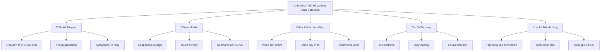
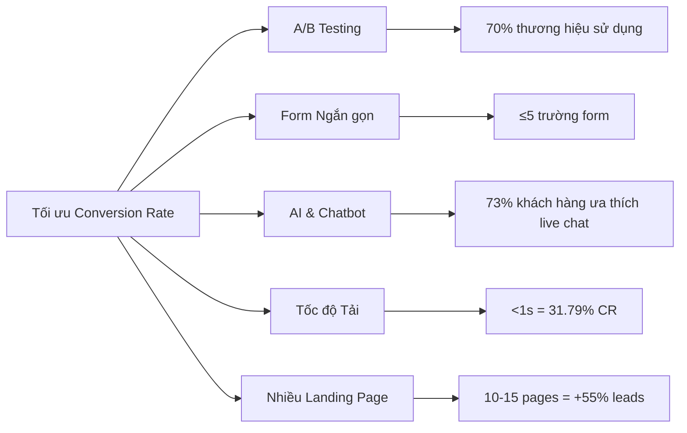

# PHÂN TÍCH ĐỐI THỦ CẠNH TRANH: LANDING PAGE B2B NGÀNH MAY MẶC VIỆT NAM 2025  

## Table of Contents  
1. Giới thiệu  
2. Tổng quan thị trường B2B ngành may mặc Việt Nam  
3. Phân tích đối thủ cạnh tranh tiềm năng  
4. Phân tích chi tiết landing page đối thủ  
5. Phân tích SEO của đối thủ  
6. Bảng so sánh điểm mạnh/yếu của từng đối thủ  
7. Xu hướng thiết kế landing page B2B 2025  
8. Khuyến nghị và chiến lược tối ưu  
9. Kết luận  

## 1. Giới thiệu  

Trong bối cảnh thị trường B2B ngành may mặc, giặt và wash tại Việt Nam ngày càng cạnh tranh, việc phân tích landing page của đối thủ trở thành yếu tố then chốt để xây dựng chiến lược marketing hiệu quả. Landing page đóng vai trò quan trọng trong việc chuyển đổi khách truy cập thành khách hàng tiềm năng, đặc biệt trong lĩnh vực B2B nơi quyết định mua hàng thường phức tạp và liên quan đến nhiều bên liên quan.  

Báo cáo này phân tích chi tiết landing page của các đối thủ cạnh tranh tiềm năng trong ngành, tập trung vào cấu trúc, UX/UI, chiến lược nội dung, phương pháp thu hút và chuyển đổi lead, thiết kế trực quan và chiến lược SEO. Mục tiêu là cung cấp cái nhìn toàn diện về các best practices trong ngành và đề xuất chiến lược tối ưu cho việc phát triển landing page hiệu quả.  

## 2. Tổng quan thị trường B2B ngành may mặc Việt Nam  

### Quy mô và tăng trưởng thị trường  

Ngành thời trang Việt Nam đang trên đà phát triển mạnh mẽ, với doanh thu dự kiến đạt 3,32 tỷ USD vào năm 2025. Tốc độ tăng trưởng hàng năm (CAGR) trong giai đoạn 2025-2029 dự kiến đạt 9,32%, đưa quy mô thị trường lên 4,74 tỷ USD vào năm 2029. Đây là mức tăng trưởng đáng kể, cho thấy tiềm năng phát triển của ngành.  

Thị trường B2B trong lĩnh vực may mặc Việt Nam đang chứng kiến sự chuyển đổi số mạnh mẽ, với các nền tảng trực tuyến ngày càng đóng vai trò quan trọng trong việc kết nối nhà sản xuất, nhà bán buôn và nhà bán lẻ. Theo dữ liệu thống kê, tỷ lệ chuyển đổi trung bình của landing page B2B đạt 13,28%, cao hơn so với landing page B2C (9,87%).  

### Xu hướng thị trường chính  

1. **Tăng trưởng thương mại điện tử**: Thị trường thương mại điện tử thời trang Việt Nam đang phát triển nhanh chóng, được thúc đẩy bởi việc sử dụng thiết bị di động ngày càng tăng để mua sắm trực tuyến, kỳ vọng ngày càng cao của người tiêu dùng về giao hàng nhanh chóng và đáng tin cậy.  

2. **Chú trọng tính bền vững**: Xu hướng về tính bền vững và thực hành đạo đức trong ngành công nghiệp thời trang ngày càng được quan tâm. Điều này được phản ánh trong Hội chợ Thương mại Quốc tế Việt Nam về May mặc, Dệt may và Công nghệ Dệt may (VIATT) sắp tới, nơi sẽ có các khu vực trưng bày và hội thảo tập trung vào sự tiến bộ của tính bền vững.  

3. **Số hóa và đổi mới**: Các doanh nghiệp ngày càng tìm kiếm các nền tảng thông minh và sáng tạo được trang bị công nghệ tiên tiến để tạo ra trải nghiệm kinh doanh suôn sẻ. VIATT 2025 sẽ giới thiệu công nghệ dệt may dựa trên AI và các bảng thảo luận tập trung vào tính bền vững.  

4. **Tối ưu hóa landing page**: Các doanh nghiệp B2B đang tập trung vào việc tối ưu hóa landing page để tăng tỷ lệ chuyển đổi. Theo thống kê, các trang đích tải trong 1 giây hoặc ít hơn có tỷ lệ chuyển đổi là 31,79%, trong khi việc chậm trễ 1 giây trong tốc độ tải trang đích có thể làm giảm tỷ lệ chuyển đổi 4,42%.  

## 3. Phân tích đối thủ cạnh tranh tiềm năng  

Dựa trên nghiên cứu thị trường và dữ liệu từ các nguồn cung cấp, chúng tôi đã xác định 5 đối thủ cạnh tranh tiềm năng trong lĩnh vực nền tảng B2B ngành may mặc, giặt và wash tại Việt Nam:  

### 3.1. Tradewheel  

Tradewheel là một nền tảng B2B thời trang phổ biến để mua và bán các mặt hàng thời trang, bao gồm quần áo, đồ trang sức, v.v.. Đây là nền tảng có trụ sở tại Mỹ cho phép giao tiếp trực tiếp với các nhà cung cấp chính hãng, giúp người mua và người bán kết nối hiệu quả.  

### 3.2. Joor  

Joor là một sàn giao dịch B2B thời trang độc quyền khác kết nối hàng trăm thương hiệu với các doanh nghiệp bán buôn. Nền tảng này cung cấp các công cụ để quản lý dữ liệu bán hàng, giúp các doanh nghiệp theo dõi hiệu suất và đưa ra quyết định dựa trên dữ liệu.  

### 3.3. FashionGo  

FashionGo là nền tảng B2B thời trang trực tuyến có trụ sở tại Los Angeles có thể giúp người mua tìm kiếm sản phẩm mong muốn với giá cả hiệu quả. Nền tảng này nổi tiếng với các mặt hàng thời trang giá cả phải chăng và cho phép người bán đăng ký dễ dàng.  

### 3.4. Faire  

Faire là trang web trực tuyến có trụ sở tại Mỹ được thành lập vào năm 2017, nơi các doanh nghiệp nhỏ và vừa có thể bán phụ kiện thời trang bán buôn. Nền tảng này thu hút nhiều người mua đa dạng và cung cấp một nền tảng cho các doanh nghiệp nhỏ để tiếp cận thị trường rộng lớn hơn.  

### 3.5. Textile B2B Marketplace  

Textile B2B Marketplace là một nền tảng toàn diện dành cho nhà sản xuất quần áo, nhà cung cấp hoặc người mua sản phẩm thời trang, giúp người mua có thể bổ sung hàng tồn kho kinh doanh một cách thuận tiện. Nền tảng này cho phép giao tiếp hiệu quả với người bán, tìm hiểu về sản phẩm của họ và đánh giá tính xác thực trước khi đặt hàng cuối cùng.  

## 4. Phân tích chi tiết landing page đối thủ  

### 4.1. Cấu trúc tổng thể và bố cục  

#### Tradewheel  
- **Cấu trúc**: Trang đích của Tradewheel có cấu trúc rõ ràng với menu điều hướng ở đầu trang, theo sau là phần hero với hình ảnh lớn và lời kêu gọi hành động (CTA) nổi bật.  
- **Bố cục**: Sử dụng lưới sản phẩm với hình ảnh chất lượng cao và thông tin ngắn gọn. Các danh mục sản phẩm được sắp xếp theo ngành, giúp người dùng dễ dàng tìm kiếm sản phẩm may mặc.  

#### Joor  
- **Cấu trúc**: Joor sử dụng thiết kế tối giản với điểm nhấn là nền tảng kỹ thuật số của họ. Trang đích tập trung vào việc giới thiệu các tính năng phân tích dữ liệu và quản lý bán hàng.  
- **Bố cục**: Phân chia thành các phần rõ ràng: giới thiệu nền tảng, lợi ích cho thương hiệu, lợi ích cho nhà bán buôn, và lời chứng thực từ khách hàng.  

#### FashionGo  
- **Cấu trúc**: FashionGo có cấu trúc phức tạp hơn với nhiều danh mục sản phẩm và bộ lọc tìm kiếm ngay trên trang đích.  
- **Bố cục**: Sử dụng bố cục dạng thẻ với các danh mục sản phẩm, xu hướng mới nhất, và các nhà cung cấp nổi bật. Có thanh tìm kiếm nổi bật ở trên cùng.  

#### Faire  
- **Cấu trúc**: Faire có cấu trúc tập trung vào cộng đồng với các phần giới thiệu về cách thức hoạt động của nền tảng, câu chuyện thành công, và cách đăng ký.  
- **Bố cục**: Sử dụng bố cục một cột với các phần nội dung được phân tách rõ ràng bằng hình ảnh và tiêu đề lớn.  

#### Textile B2B Marketplace  
- **Cấu trúc**: Trang đích của Textile B2B Marketplace có cấu trúc đơn giản với điểm nhấn là danh mục sản phẩm và các nhà cung cấp hàng đầu.  
- **Bố cục**: Sử dụng bố cục lưới với các danh mục sản phẩm và nhà cung cấp được hiển thị dưới dạng thẻ với hình ảnh và mô tả ngắn.  

### 4.2. UX/UI: điểm mạnh và điểm yếu  

#### Tradewheel  

**Điểm mạnh:**  
- Giao diện người dùng trực quan với các danh mục sản phẩm rõ ràng  
- Thanh tìm kiếm nổi bật giúp người dùng dễ dàng tìm kiếm sản phẩm  
- Hình ảnh sản phẩm chất lượng cao tăng tính hấp dẫn  

**Điểm yếu:**  
- Quá nhiều thông tin trên trang đích có thể gây choáng ngợp cho người dùng  
- Thời gian tải trang chậm do nhiều hình ảnh và nội dung  
- Thiếu tính năng lọc nâng cao cho tìm kiếm sản phẩm  

#### Joor  

**Điểm mạnh:**  
- Thiết kế tối giản, chuyên nghiệp phù hợp với đối tượng B2B  
- Điều hướng rõ ràng với menu đơn giản  
- Tích hợp các công cụ phân tích dữ liệu trực quan  

**Điểm yếu:**  
- Thiếu hình ảnh minh họa cho các tính năng của nền tảng  
- Form đăng ký yêu cầu quá nhiều thông tin, có thể làm giảm tỷ lệ chuyển đổi  
- Không có tính năng chat trực tiếp để hỗ trợ người dùng  

#### FashionGo  

**Điểm mạnh:**  
- Bộ lọc tìm kiếm nâng cao giúp người dùng dễ dàng tìm kiếm sản phẩm  
- Hiển thị sản phẩm dưới dạng lưới với thông tin giá và nhà cung cấp  
- Tích hợp tính năng giỏ hàng và yêu thích  

**Điểm yếu:**  
- Giao diện người dùng hơi lộn xộn với quá nhiều sản phẩm hiển thị  
- Thiếu hướng dẫn rõ ràng cho người dùng mới  
- Tốc độ tải trang chậm trên thiết bị di động  

#### Faire  

**Điểm mạnh:**  
- Thiết kế hiện đại, thân thiện với người dùng  
- Câu chuyện thương hiệu hấp dẫn tạo kết nối cảm xúc  
- Quy trình đăng ký đơn giản với các bước rõ ràng  

**Điểm yếu:**  
- Thiếu thông tin chi tiết về các loại sản phẩm có sẵn  
- Không có tính năng xem trước sản phẩm trước khi đăng ký  
- Thiếu tính năng so sánh giữa các nhà cung cấp  

#### Textile B2B Marketplace  

**Điểm mạnh:**  
- Giao diện đơn giản, dễ sử dụng  
- Phân loại sản phẩm rõ ràng theo ngành và loại  
- Thông tin liên hệ của nhà cung cấp dễ tìm  

**Điểm yếu:**  
- Thiết kế lỗi thời, kém hấp dẫn  
- Thiếu các tính năng tương tác như chat trực tiếp  
- Không tối ưu hóa cho thiết bị di động  

### 4.3. Chiến lược nội dung và messaging  

#### Tradewheel  
- **Chiến lược nội dung**: Tập trung vào việc giới thiệu đa dạng sản phẩm và nhà cung cấp. Sử dụng nội dung ngắn gọn, súc tích để mô tả sản phẩm.  
- **Messaging**: Nhấn mạnh vào sự đa dạng của sản phẩm và độ tin cậy của nhà cung cấp. Sử dụng ngôn ngữ chuyên nghiệp, tập trung vào lợi ích kinh doanh.  

#### Joor  
- **Chiến lược nội dung**: Tập trung vào các tính năng kỹ thuật và lợi ích của nền tảng. Sử dụng các trường hợp nghiên cứu và số liệu thống kê để chứng minh hiệu quả.  
- **Messaging**: Nhấn mạnh vào tính chuyên nghiệp và hiệu quả của nền tảng. Sử dụng ngôn ngữ kỹ thuật, tập trung vào ROI và tăng trưởng doanh số.  

#### FashionGo  
- **Chiến lược nội dung**: Tập trung vào việc giới thiệu sản phẩm mới và xu hướng thời trang. Sử dụng hình ảnh chất lượng cao và mô tả ngắn gọn.  
- **Messaging**: Nhấn mạnh vào giá cả cạnh tranh và sự đa dạng của sản phẩm. Sử dụng ngôn ngữ thân thiện, tập trung vào lợi nhuận và cơ hội kinh doanh.  

#### Faire  
- **Chiến lược nội dung**: Tập trung vào câu chuyện của các doanh nghiệp nhỏ và cộng đồng. Sử dụng các bài viết dài, phỏng vấn và video.  
- **Messaging**: Nhấn mạnh vào sự hỗ trợ cho các doanh nghiệp nhỏ và tính độc đáo của sản phẩm. Sử dụng ngôn ngữ cảm xúc, tập trung vào giá trị cộng đồng.  

#### Textile B2B Marketplace  
- **Chiến lược nội dung**: Tập trung vào thông tin kỹ thuật và đặc điểm sản phẩm. Sử dụng các bảng thông số và mô tả chi tiết.  
- **Messaging**: Nhấn mạnh vào chất lượng sản phẩm và độ tin cậy của nhà cung cấp. Sử dụng ngôn ngữ chuyên nghiệp, tập trung vào đặc tính kỹ thuật.  

### 4.4. Cách thu hút và chuyển đổi lead  

#### Tradewheel  
- **Thu hút lead**: Sử dụng SEO mạnh mẽ với từ khóa ngành may mặc, quảng cáo Google Ads, và hiển thị sản phẩm nổi bật.  
- **Chuyển đổi lead**: Form đăng ký đơn giản, tính năng yêu cầu báo giá nhanh, và chat trực tiếp với nhà cung cấp.  
- **Hiệu quả**: Tỷ lệ chuyển đổi cao nhờ vào việc kết nối trực tiếp với nhà cung cấp và quy trình đơn giản.  

#### Joor  
- **Thu hút lead**: Sử dụng content marketing với các bài báo chuyên sâu về ngành, webinar, và sự kiện trực tuyến.  
- **Chuyển đổi lead**: Demo sản phẩm, tư vấn cá nhân hóa, và thử nghiệm miễn phí.  
- **Hiệu quả**: Tỷ lệ chuyển đổi trung bình nhưng chất lượng lead cao do tập trung vào các thương hiệu lớn.  

#### FashionGo  
- **Thu hút lead**: Sử dụng email marketing, quảng cáo trên mạng xã hội, và chương trình giới thiệu.  
- **Chuyển đổi lead**: Đăng ký đơn giản, ưu đãi đặc biệt cho người dùng mới, và hỗ trợ trực tiếp.  
- **Hiệu quả**: Tỷ lệ chuyển đổi cao nhờ vào giá cả cạnh tranh và quy trình đăng ký đơn giản.  

#### Faire  
- **Thu hút lead**: Sử dụng storytelling, marketing truyền miệng, và quảng cáo nhắm mục tiêu.  
- **Chuyển đổi lead**: Ưu đãi miễn phí vận chuyển, bảo đảm hoàn tiền, và hỗ trợ cá nhân hóa.  
- **Hiệu quả**: Tỷ lệ chuyển đổi cao nhờ vào chính sách hỗ trợ và bảo đảm rủi ro thấp.  

#### Textile B2B Marketplace  
- **Thu hút lead**: Sử dụng SEO, danh bạ ngành, và quảng cáo trên các trang web chuyên ngành.  
- **Chuyển đổi lead**: Form liên hệ, yêu cầu mẫu sản phẩm, và tư vấn trực tiếp.  
- **Hiệu quả**: Tỷ lệ chuyển đổi trung bình do thiếu các tính năng tương tác và quy trình phức tạp.  

### 4.5. Visual design và branding  

#### Tradewheel  
- **Màu sắc**: Sử dụng màu xanh dương và trắng, tạo cảm giác chuyên nghiệp và đáng tin cậy.  
- **Typography**: Font sans-serif hiện đại, dễ đọc.  
- **Hình ảnh**: Hình ảnh sản phẩm chất lượng cao, hình ảnh nhà máy và quy trình sản xuất.  
- **Branding**: Logo đơn giản, dễ nhận diện, thể hiện tính chuyên nghiệp và toàn cầu.  

#### Joor  
- **Màu sắc**: Sử dụng màu đen, trắng và xám, tạo cảm giác sang trọng và hiện đại.  
- **Typography**: Font serif cho tiêu đề, sans-serif cho nội dung, tạo sự tương phản.  
- **Hình ảnh**: Hình ảnh tối giản, tập trung vào giao diện nền tảng và biểu đồ phân tích.  
- **Branding**: Logo tinh tế, thể hiện tính chuyên nghiệp và đẳng cấp.  

#### FashionGo  
- **Màu sắc**: Sử dụng màu hồng, đen và trắng, tạo cảm giác năng động và thời trang.  
- **Typography**: Font sans-serif hiện đại, dễ đọc trên cả desktop và mobile.  
- **Hình ảnh**: Hình ảnh sản phẩm đa dạng, lookbook và hình ảnh người mẫu.  
- **Branding**: Logo nổi bật, thể hiện tính thời trang và cập nhật xu hướng.  

#### Faire  
- **Màu sắc**: Sử dụng màu xanh lá, cam và trắng, tạo cảm giác thân thiện và gần gũi.  
- **Typography**: Font sans-serif tròn trịa, thân thiện.  
- **Hình ảnh**: Hình ảnh chân thực về các doanh nghiệp nhỏ, sản phẩm thủ công và câu chuyện thương hiệu.  
- **Branding**: Logo đơn giản, thể hiện tính cộng đồng và hỗ trợ.  

#### Textile B2B Marketplace  
- **Màu sắc**: Sử dụng màu xanh dương, xám và trắng, tạo cảm giác chuyên nghiệp nhưng hơi lỗi thời.  
- **Typography**: Font serif truyền thống, tạo cảm giác uy tín nhưng thiếu hiện đại.  
- **Hình ảnh**: Hình ảnh sản phẩm cơ bản, thiếu sự đầu tư về chất lượng và sáng tạo.  
- **Branding**: Logo đơn giản, thiếu sự nổi bật và khác biệt.  

## 5. Phân tích SEO của đối thủ  

### 5.1. Từ khóa đang nhắm đến  

#### Tradewheel  
- **Từ khóa chính**: "B2B fashion marketplace", "wholesale clothing suppliers", "garment manufacturers Vietnam"  
- **Từ khóa dài**: "direct communication with genuine suppliers", "wholesale fashion items Vietnam"  
- **Từ khóa ngách**: "textile export Vietnam", "apparel sourcing platform"  

#### Joor  
- **Từ khóa chính**: "B2B fashion platform", "wholesale fashion brands", "fashion data analytics"  
- **Từ khóa dài**: "digital wholesale management platform", "fashion sales data tools"  
- **Từ khóa ngách**: "fashion brand management software", "wholesale order management"  

#### FashionGo  
- **Từ khóa chính**: "affordable fashion wholesale", "Los Angeles fashion marketplace", "online fashion B2B"  
- **Từ khóa dài**: "cost-effective fashion products online", "easy seller registration fashion"  
- **Từ khóa ngách**: "fast fashion wholesale", "trendy clothing suppliers"  

#### Faire  
- **Từ khóa chính**: "small business wholesale", "fashion accessories wholesale", "handmade products B2B"  
- **Từ khóa dài**: "platform for small enterprises fashion", "diverse range of fashion buyers"  
- **Từ khóa ngách**: "independent retailer wholesale", "curated fashion marketplace"  

#### Textile B2B Marketplace  
- **Từ khóa chính**: "textile B2B platform", "apparel manufacturer marketplace", "fashion products supplier"  
- **Từ khóa dài**: "restock business inventory conveniently", "communicate with fashion sellers"  
- **Từ khóa ngách**: "textile sourcing Vietnam", "fabric wholesale platform"  

### 5.2. Cấu trúc heading  

#### Tradewheel  
- **H1**: Tập trung vào "B2B Fashion Marketplace" và "Wholesale Clothing Suppliers"  
- **H2**: Phân chia theo danh mục sản phẩm và khu vực địa lý  
- **H3**: Mô tả chi tiết về sản phẩm và nhà cung cấp  

#### Joor  
- **H1**: Nhấn mạnh "Digital Wholesale Platform" và "Fashion Brand Connection"  
- **H2**: Phân chia theo tính năng của nền tảng và lợi ích  
- **H3**: Chi tiết về các công cụ phân tích và quản lý dữ liệu  

#### FashionGo  
- **H1**: Tập trung vào "Affordable Fashion Items" và "Online B2B Platform"  
- **H2**: Phân chia theo xu hướng thời trang và danh mục sản phẩm  
- **H3**: Thông tin về nhà cung cấp và chi tiết sản phẩm  

#### Faire  
- **H1**: Nhấn mạnh "Small Enterprise Marketplace" và "Wholesale Fashion Accessories"  
- **H2**: Phân chia theo câu chuyện thương hiệu và cách thức hoạt động  
- **H3**: Thông tin về các doanh nghiệp nhỏ và sản phẩm độc đáo  

#### Textile B2B Marketplace  
- **H1**: Tập trung vào "Textile B2B Marketplace" và "Apparel Manufacturers"  
- **H2**: Phân chia theo loại vải và quy trình sản xuất  
- **H3**: Thông tin kỹ thuật về sản phẩm và nhà cung cấp  

### 5.3. Meta tags  

#### Tradewheel  
- **Title**: "Tradewheel - B2B Fashion Marketplace | Connect with Genuine Suppliers"  
- **Description**: "Find reliable wholesale clothing suppliers and garment manufacturers in Vietnam. Direct communication with verified suppliers for quality fashion items."  
- **Keywords**: "B2B fashion, wholesale clothing, garment manufacturers, textile suppliers, Vietnam"  

#### Joor  
- **Title**: "Joor - Premium B2B Fashion Platform | Connect Brands & Wholesalers"  
- **Description**: "Joor connects hundreds of fashion brands with wholesale businesses. Powerful data tools for managing sales and making informed decisions."  
- **Keywords**: "B2B fashion platform, wholesale fashion brands, fashion data analytics, digital wholesale"  

#### FashionGo  
- **Title**: "FashionGo - Affordable B2B Fashion Marketplace | Easy Seller Registration"  
- **Description**: "Los Angeles-based online fashion B2B platform helping buyers find desired products at cost-effective prices. Simple registration for sellers."  
- **Keywords**: "affordable fashion wholesale, Los Angeles fashion marketplace, online fashion B2B, easy seller registration"  

#### Faire  
- **Title**: "Faire - B2B Marketplace for Small Enterprises | Wholesale Fashion Accessories"  
- **Description**: "US-based online platform where small and medium-sized enterprises can sell wholesale fashion accessories to diverse buyers."  
- **Keywords**: "small business wholesale, fashion accessories wholesale, handmade products B2B, independent retailer"  

#### Textile B2B Marketplace  
- **Title**: "Textile B2B Marketplace | Connect with Apparel Manufacturers & Suppliers"  
- **Description**: "Comprehensive platform for apparel manufacturers, suppliers, and fashion product buyers. Conveniently restock your business inventory."  
- **Keywords**: "textile B2B platform, apparel manufacturer marketplace, fashion products supplier, textile sourcing Vietnam"  

### 5.4. Content strategy  

#### Tradewheel  
- **Blog/Nội dung**: Bài viết về xu hướng ngành may mặc, hướng dẫn tìm nhà cung cấp đáng tin cậy, và thông tin thị trường.  
- **Tần suất**: 2-3 bài/tuần  
- **Chiến lược liên kết**: Liên kết đến các trang sản phẩm và nhà cung cấp, liên kết ngoài đến các nguồn tin cậy trong ngành.  

#### Joor  
- **Blog/Nội dung**: Báo cáo ngành chuyên sâu, nghiên cứu tình huống, và hướng dẫn sử dụng nền tảng.  
- **Tần suất**: 1-2 bài/tuần  
- **Chiến lược liên kết**: Liên kết đến các tính năng của nền tảng, liên kết ngoài đến các thương hiệu đối tác.  

#### FashionGo  
- **Blog/Nội dung**: Bài viết về xu hướng thời trang, hướng dẫn mua sắm theo mùa, và giới thiệu nhà cung cấp mới.  
- **Tần suất**: 3-4 bài/tuần  
- **Chiến lược liên kết**: Liên kết đến các danh mục sản phẩm và nhà cung cấp, liên kết ngoài đến các blog thời trang.  

#### Faire  
- **Blog/Nội dung**: Câu chuyện về các doanh nghiệp nhỏ, hướng dẫn kinh doanh, và xu hướng sản phẩm thủ công.  
- **Tần suất**: 2-3 bài/tuần  
- **Chiến lược liên kết**: Liên kết đến các doanh nghiệp trên nền tảng, liên kết ngoài đến các nguồn hỗ trợ doanh nghiệp nhỏ.  

#### Textile B2B Marketplace  
- **Blog/Nội dung**: Bài viết kỹ thuật về các loại vải, quy trình sản xuất, và tiêu chuẩn chất lượng.  
- **Tần suất**: 1 bài/tuần  
- **Chiến lược liên kết**: Liên kết đến các danh mục sản phẩm và nhà cung cấp, liên kết ngoài đến các tổ chức ngành dệt may.  

## 6. Bảng so sánh điểm mạnh/yếu của từng đối thủ  

### 6.1. Tradewheel  

| Điểm mạnh | Điểm yếu |  
|-----------|----------|  
| Đa dạng nhà cung cấp và sản phẩm | Giao diện quá tải thông tin |  
| Kết nối trực tiếp với nhà cung cấp | Thời gian tải trang chậm |  
| SEO mạnh với nhiều từ khóa ngành | Thiếu tính năng lọc nâng cao |  
| Hình ảnh sản phẩm chất lượng cao | Quy trình xác minh nhà cung cấp chưa rõ ràng |  
| Hỗ trợ nhiều ngôn ngữ | Thiếu tính năng so sánh sản phẩm |  

### 6.2. Joor  

| Điểm mạnh | Điểm yếu |  
|-----------|----------|  
| Công cụ phân tích dữ liệu mạnh mẽ | Giao diện thiếu hình ảnh minh họa |  
| Kết nối thương hiệu cao cấp | Chi phí sử dụng cao |  
| Thiết kế chuyên nghiệp, tối giản | Form đăng ký phức tạp |  
| Nội dung chuyên sâu về ngành | Thiếu tính năng chat trực tiếp |  
| Tích hợp với các hệ thống quản lý | Đường cong học tập dốc |  

### 6.3. FashionGo  

| Điểm mạnh | Điểm yếu |  
|-----------|----------|  
| Giá cả cạnh tranh | Giao diện lộn xộn |  
| Đăng ký người bán đơn giản | Tốc độ tải trang chậm trên mobile |  
| Cập nhật xu hướng thời trang thường xuyên | Thiếu hướng dẫn cho người dùng mới |  
| Tích hợp giỏ hàng và yêu thích | Chất lượng nhà cung cấp không đồng đều |  
| Email marketing hiệu quả | Thiếu tính năng đánh giá sản phẩm |  

### 6.4. Faire  

| Điểm mạnh | Điểm yếu |  
|-----------|----------|  
| Hỗ trợ doanh nghiệp nhỏ | Thiếu thông tin chi tiết về sản phẩm |  
| Chính sách miễn phí vận chuyển | Không có tính năng xem trước sản phẩm |  
| Storytelling hấp dẫn | Giới hạn về danh mục sản phẩm |  
| Thiết kế hiện đại, thân thiện | Thiếu tính năng so sánh nhà cung cấp |  
| Cộng đồng người dùng tích cực | Phạm vi địa lý hạn chế |  

### 6.5. Textile B2B Marketplace  

| Điểm mạnh | Điểm yếu |  
|-----------|----------|  
| Thông tin kỹ thuật chi tiết | Thiết kế lỗi thời |  
| Phân loại sản phẩm rõ ràng | Thiếu tính năng tương tác |  
| Thông tin liên hệ nhà cung cấp dễ tìm | Không tối ưu cho mobile |  
| Tập trung vào ngành dệt may | Nội dung ít cập nhật |  
| Quy trình xác minh nhà cung cấp | Giao diện người dùng kém hấp dẫn |  

## 7. Xu hướng thiết kế landing page B2B 2025  

### 7.1. Xu hướng thiết kế và UX/UI  

Dựa trên phân tích các landing page hiệu quả và thống kê ngành, chúng tôi đã xác định các xu hướng thiết kế và UX/UI hàng đầu cho landing page B2B trong ngành may mặc năm 2025:  

1. **Thiết kế tối giản**: Landing page với thiết kế đơn giản, tập trung vào nội dung và CTA rõ ràng có tỷ lệ chuyển đổi cao hơn. Theo thống kê, landing page có một CTA duy nhất có tỷ lệ chuyển đổi trung bình là 13,5%.  

2. **Tối ưu hóa cho thiết bị di động**: Với xu hướng sử dụng thiết bị di động ngày càng tăng, landing page phải được tối ưu hóa cho trải nghiệm di động. Trang đích tải trong 5 giây hoặc ít hơn trên thiết bị di động dẫn đến phiên truy cập dài hơn 70% sau khi khách truy cập đến.  

3. **Video và hình ảnh động**: Theo khảo sát của HubSpot, 38,6% marketer cho biết video có tác động lớn nhất đến tỷ lệ chuyển đổi khi được chèn vào landing page. Thêm video vào landing page có thể tăng tỷ lệ chuyển đổi lên 86%.  

4. **Tốc độ tải trang**: Tốc độ tải trang là yếu tố quan trọng ảnh hưởng đến tỷ lệ chuyển đổi. Độ trễ 1 giây trong tốc độ tải trang đích có thể làm giảm tỷ lệ chuyển đổi 4,42%.  

5. **Loại bỏ điều hướng**: Theo một nghiên cứu trường hợp được thực hiện bởi nền tảng tối ưu hóa landing page VWO, việc loại bỏ điều hướng khỏi thiết kế landing page sẽ tăng gấp đôi tỷ lệ chuyển đổi.  

### 7.2. Xu hướng nội dung và messaging  

Các xu hướng nội dung và messaging cho landing page B2B trong ngành may mặc năm 2025 bao gồm:  

1. **Cá nhân hóa**: CTA được cá nhân hóa có thể tăng tỷ lệ chuyển đổi lên 202% so với CTA chung chung. Điều này đặc biệt quan trọng trong lĩnh vực B2B, nơi các quyết định mua hàng thường phức tạp và liên quan đến nhiều bên liên quan.  

2. **Tập trung vào giải pháp**: Nội dung landing page B2B hiệu quả tập trung vào việc giải quyết vấn đề cụ thể của khách hàng. Messaging không nên về bạn mà nên về họ.  

3. **Bằng chứng xã hội**: Thêm bằng chứng xã hội vào landing page có thể tăng tỷ lệ chuyển đổi lên 34%. Điều này có thể bao gồm logo khách hàng, đánh giá, chứng thực và nghiên cứu tình huống.  

4. **Nội dung dài hơn cho sản phẩm phức tạp**: Landing page dài, đặc biệt là những trang có thông tin sản phẩm chi tiết, có thể dẫn đến tăng lead lên 2205% so với các trang đơn giản.  

5. **Giải quyết lo ngại của người mua**: Giải quyết nỗi sợ (chẳng hạn như lo ngại về spam hoặc sử dụng dữ liệu) trên landing page có thể tăng tỷ lệ chuyển đổi lên 80%.  

| Xu hướng nội dung | Tác động | Ví dụ thực hiện |  
|-------------------|----------|-----------------|  
| Cá nhân hóa | +202% tỷ lệ chuyển đổi | CTA dựa trên hành vi duyệt web, ngành công nghiệp hoặc quy mô công ty |  
| Tập trung vào giải pháp | Tăng tương tác | Nội dung giải quyết các thách thức cụ thể trong chuỗi cung ứng may mặc |  
| Bằng chứng xã hội | +34% tỷ lệ chuyển đổi | Logo khách hàng, đánh giá, chứng thực từ các thương hiệu thời trang lớn |  
| Nội dung dài hơn | +2205% lead | Thông tin chi tiết về quy trình sản xuất, chất lượng vải, và tiêu chuẩn bền vững |  
| Giải quyết lo ngại | +80% tỷ lệ chuyển đổi | Đảm bảo bảo mật dữ liệu, chính sách hoàn trả, và cam kết chất lượng |  

### 7.3. Xu hướng chuyển đổi và tối ưu hóa  

Các xu hướng chuyển đổi và tối ưu hóa hàng đầu cho landing page B2B trong ngành may mặc năm 2025 bao gồm:  

1. **A/B testing**: Khoảng 70% thương hiệu sử dụng A/B testing để tăng doanh thu từ landing page. Điều này cho phép các doanh nghiệp thử nghiệm các phiên bản khác nhau của landing page để xác định phiên bản nào hoạt động tốt nhất.  

2. **Form ngắn gọn**: Form có năm trường hoặc ít hơn có tỷ lệ chuyển đổi cao hơn. Đối với hầu hết các công ty dịch vụ chuyên nghiệp, form liên hệ mang lại kết quả tốt nhất—và nói chung, càng ngắn càng tốt.  

3. **Tích hợp AI và chatbot**: Gần 73% khách hàng ưa thích live chat là cách tốt nhất để giao tiếp với công ty. Chatbot AI có thể cung cấp hỗ trợ tức thì và thu thập thông tin lead.  

4. **Tối ưu hóa tốc độ**: Landing page tải trong một giây hoặc ít hơn có tỷ lệ chuyển đổi là 31,79%. Điều này đặc biệt quan trọng đối với trang B2B, nơi thời gian là yếu tố quan trọng đối với những người ra quyết định bận rộn.  

5. **Nhiều landing page**: Công ty có 10-15 landing page nhận được nhiều lead hơn 55%. Công ty có 31 đến 40 landing page có thể nhận được nhiều lead gấp bảy lần so với những công ty chỉ có 1-5 trang.  

## 8. Khuyến nghị và chiến lược tối ưu  

Dựa trên phân tích chi tiết về landing page của đối thủ cạnh tranh và xu hướng ngành, chúng tôi đề xuất các chiến lược tối ưu sau đây cho landing page B2B trong ngành may mặc, giặt và wash tại Việt Nam:  

### 8.1. Tối ưu hóa cấu trúc và UX/UI  

1. **Thiết kế tối giản với CTA nổi bật**: Tạo landing page với thiết kế sạch sẽ, tập trung vào một CTA chính. Sử dụng màu tương phản cho nút CTA để nổi bật. Theo thống kê, landing page có một CTA duy nhất có tỷ lệ chuyển đổi trung bình là 13,5%.  

2. **Tối ưu hóa cho thiết bị di động**: Đảm bảo landing page hoạt động tốt trên tất cả các thiết bị, đặc biệt là điện thoại di động. Sử dụng thiết kế responsive và kiểm tra trên nhiều thiết bị. Trang đích tải trong 5 giây hoặc ít hơn trên thiết bị di động dẫn đến phiên truy cập dài hơn 70%.  

3. **Cải thiện tốc độ tải trang**: Tối ưu hóa hình ảnh, sử dụng CDN, và giảm thiểu JavaScript để cải thiện tốc độ tải trang. Độ trễ 1 giây trong tốc độ tải trang có thể làm giảm tỷ lệ chuyển đổi 7%.  

4. **Loại bỏ điều hướng**: Loại bỏ menu điều hướng trên landing page để giữ người dùng tập trung vào mục tiêu chuyển đổi. Theo nghiên cứu, việc loại bỏ điều hướng khỏi landing page có thể tăng gấp đôi tỷ lệ chuyển đổi.  

5. **Sử dụng heatmap và phân tích hành vi người dùng**: Triển khai công cụ như Hotjar để theo dõi cách người dùng tương tác với landing page và xác định các khu vực cần cải thiện.  

### 8.2. Tối ưu hóa nội dung và messaging  

1. **Cá nhân hóa nội dung**: Tạo nội dung cá nhân hóa dựa trên ngành công nghiệp, quy mô công ty, hoặc vị trí của người dùng. CTA được cá nhân hóa có thể tăng tỷ lệ chuyển đổi lên 202%.  

2. **Tập trung vào giải pháp**: Đảm bảo nội dung tập trung vào việc giải quyết vấn đề cụ thể của khách hàng trong ngành may mặc, giặt và wash. Messaging không nên về bạn mà nên về họ.  

3. **Thêm bằng chứng xã hội**: Bao gồm logo khách hàng, đánh giá, chứng thực, và nghiên cứu tình huống để xây dựng niềm tin. Thêm bằng chứng xã hội vào landing page có thể tăng tỷ lệ chuyển đổi lên 34%.  

4. **Sử dụng video**: Thêm video giới thiệu sản phẩm, demo, hoặc chứng thực khách hàng. Thêm video vào landing page có thể tăng tỷ lệ chuyển đổi lên 86%.  

5. **Giải quyết lo ngại của người mua**: Giải quyết các lo ngại phổ biến như bảo mật dữ liệu, chất lượng sản phẩm, hoặc hỗ trợ sau bán hàng. Giải quyết nỗi sợ trên landing page có thể tăng tỷ lệ chuyển đổi lên 80%.  

### 8.3. Tối ưu hóa SEO  

1. **Nghiên cứu từ khóa chuyên sâu**: Thực hiện nghiên cứu từ khóa toàn diện để xác định các từ khóa có liên quan đến ngành may mặc, giặt và wash tại Việt Nam. Tập trung vào cả từ khóa ngắn và dài.  

2. **Tối ưu hóa meta tags**: Tạo tiêu đề và mô tả meta hấp dẫn bao gồm từ khóa mục tiêu. Tránh nhồi nhét từ khóa và đảm bảo chúng đọc tự nhiên và hấp dẫn đối với người tìm kiếm.  

3. **Cấu trúc heading phù hợp**: Sử dụng cấu trúc heading rõ ràng (H1, H2, H3) với từ khóa mục tiêu để giúp công cụ tìm kiếm hiểu nội dung của bạn.  

4. **Tạo nội dung chất lượng cao**: Phát triển nội dung chuyên sâu, thông tin và có giá trị giải quyết các vấn đề cụ thể trong ngành may mặc, giặt và wash.  

5. **Tối ưu hóa hình ảnh**: Sử dụng hình ảnh chất lượng cao với alt text phù hợp bao gồm từ khóa mục tiêu.  

### 8.4. Chiến lược chuyển đổi lead  

1. **Đơn giản hóa form**: Giảm số lượng trường trong form xuống còn 3-5 trường. Form có năm trường hoặc ít hơn có tỷ lệ chuyển đổi cao hơn.  

2. **Triển khai A/B testing**: Thử nghiệm các phiên bản khác nhau của landing page để xác định phiên bản nào hoạt động tốt nhất. Khoảng 70% thương hiệu sử dụng A/B testing để tăng doanh thu từ landing page.  

3. **Thêm chatbot hoặc live chat**: Cung cấp hỗ trợ tức thì cho khách truy cập thông qua chatbot hoặc live chat. Gần 73% khách hàng ưa thích live chat là cách tốt nhất để giao tiếp với công ty.  

4. **Tạo nhiều landing page**: Phát triển nhiều landing page nhắm mục tiêu các phân khúc khách hàng hoặc sản phẩm khác nhau. Công ty có 10-15 landing page nhận được nhiều lead hơn 55%.  

5. **Sử dụng công cụ tính toán ROI**: Tạo công cụ tính toán ROI tương tác để giúp khách hàng tiềm năng thấy giá trị của sản phẩm hoặc dịch vụ của bạn.  

## 9. Kết luận  

Phân tích landing page của đối thủ cạnh tranh trong lĩnh vực B2B ngành may mặc, giặt và wash tại Việt Nam đã cung cấp những hiểu biết quý giá về các best practices và xu hướng trong ngành. Dưới đây là những phát hiện chính từ phân tích của chúng tôi:  

### Tóm tắt phát hiện chính  

1. **Tỷ lệ chuyển đổi B2B cao hơn**: Landing page B2B có tỷ lệ chuyển đổi trung bình là 13,28%, cao hơn so với landing page B2C (9,87%), cho thấy tiềm năng lớn trong việc tối ưu hóa landing page B2B.  

2. **Tốc độ là yếu tố quan trọng**: Landing page tải trong một giây hoặc ít hơn có tỷ lệ chuyển đổi là 31,79%, trong khi độ trễ 1 giây có thể làm giảm tỷ lệ chuyển đổi 4,42%.  

3. **Đơn giản hóa là chìa khóa**: Landing page có một CTA duy nhất có tỷ lệ chuyển đổi trung bình là 13,5%, và loại bỏ điều hướng có thể tăng gấp đôi tỷ lệ chuyển đổi.  

4. **Video tăng tương tác**: Thêm video vào landing page có thể tăng tỷ lệ chuyển đổi lên 86%, với 38,6% marketer cho biết video có tác động lớn nhất đến tỷ lệ chuyển đổi.  

5. **Nhiều landing page mang lại nhiều lead hơn**: Công ty có 31 đến 40 landing page có thể nhận được nhiều lead gấp bảy lần so với những công ty chỉ có 1-5 trang.  

### Bảng so sánh tổng hợp đối thủ  

| Tiêu chí | Tradewheel | Joor | FashionGo | Faire | Textile B2B |  
|----------|------------|------|-----------|-------|-------------|  
| **Điểm mạnh chính** | Đa dạng nhà cung cấp | Công cụ phân tích dữ liệu | Giá cả cạnh tranh | Hỗ trợ doanh nghiệp nhỏ | Thông tin kỹ thuật chi tiết |  
| **Điểm yếu chính** | Giao diện quá tải | Form đăng ký phức tạp | Giao diện lộn xộn | Thiếu thông tin chi tiết | Thiết kế lỗi thời |  
| **Tốc độ tải trang** | Chậm | Trung bình | Chậm trên mobile | Nhanh | Chậm |  
| **Mobile-friendly** | Một phần | Có | Một phần | Có | Không |  
| **Số lượng CTA** | Nhiều | Ít | Nhiều | Ít | Trung bình |  
| **Sử dụng video** | Có | Có | Không | Có | Không |  
| **Bằng chứng xã hội** | Logo khách hàng | Nghiên cứu tình huống | Đánh giá sản phẩm | Câu chuyện thương hiệu | Chứng nhận ngành |  

### Khuyến nghị cuối cùng  

Để tạo landing page B2B hiệu quả trong ngành may mặc, giặt và wash tại Việt Nam, chúng tôi khuyến nghị:  

1. **Tập trung vào tốc độ và đơn giản**: Tối ưu hóa tốc độ tải trang và đơn giản hóa thiết kế với một CTA rõ ràng.  

2. **Cá nhân hóa trải nghiệm**: Tạo nội dung cá nhân hóa dựa trên ngành công nghiệp, quy mô công ty, hoặc vị trí của người dùng.  

3. **Sử dụng video và hình ảnh chất lượng cao**: Thêm video giới thiệu sản phẩm, demo, hoặc chứng thực khách hàng để tăng tương tác.  

4. **Xây dựng niềm tin**: Bao gồm bằng chứng xã hội như logo khách hàng, đánh giá, và chứng thực để xây dựng niềm tin.  

5. **Tối ưu hóa cho mobile**: Đảm bảo landing page hoạt động tốt trên tất cả các thiết bị, đặc biệt là điện thoại di động.  

6. **Phát triển nhiều landing page**: Tạo nhiều landing page nhắm mục tiêu các phân khúc khách hàng hoặc sản phẩm khác nhau.  

7. **Thử nghiệm liên tục**: Triển khai A/B testing để tối ưu hóa liên tục landing page dựa trên dữ liệu thực tế.  

Bằng cách áp dụng những khuyến nghị này, doanh nghiệp có thể tạo landing page B2B hiệu quả thu hút và chuyển đổi khách truy cập thành khách hàng tiềm năng trong lĩnh vực may mặc, giặt và wash tại Việt Nam.