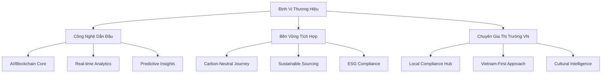
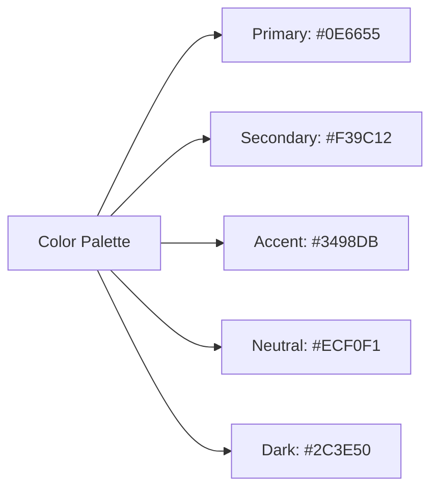
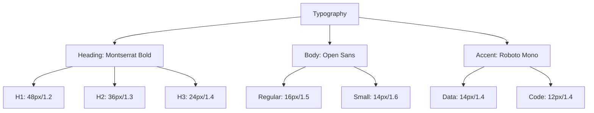
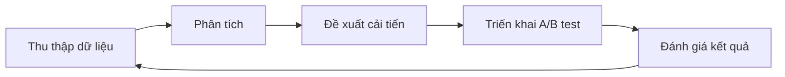

# ĐỀ XUẤT USP VÀ CẢI TIẾN LANDING PAGE CHO NỀN TẢNG B2B NGÀNH MAY MẶC VIỆT NAM  

## Table of Contents  
1. Giới thiệu  
2. Phân tích thị trường và đối thủ cạnh tranh  
3. Xác định 5 Unique Selling Propositions (USPs)  
4. Đề xuất cải tiến từ phân tích đối thủ  
5. Chiến lược định vị thương hiệu  
6. Triển khai kỹ thuật trên NextJS  
7. Đo lường hiệu quả và tối ưu hóa

## 1. Giới thiệu  

Trong bối cảnh thị trường B2B ngành may mặc, giặt và wash tại Việt Nam ngày càng cạnh tranh, việc xây dựng một landing page hiệu quả với các Unique Selling Propositions (USPs) nổi bật trở thành yếu tố then chốt để thu hút và chuyển đổi khách hàng tiềm năng. Báo cáo này đề xuất chiến lược toàn diện để phát triển USPs và cải tiến landing page dựa trên phân tích đối thủ cạnh tranh, xu hướng thị trường và công nghệ mới nhất.  

Ngành may mặc Việt Nam đang trên đà phát triển mạnh mẽ, với doanh thu dự kiến đạt 3,32 tỷ USD vào năm 2025 và tốc độ tăng trưởng hàng năm (CAGR) trong giai đoạn 2025-2029 dự kiến đạt 9,32%. Tuy nhiên, ngành cũng đang đối mặt với nhiều thách thức như sự chuyển dịch chuỗi cung ứng, áp lực về tính bền vững và nhu cầu số hóa ngày càng tăng.  

Trong bối cảnh đó, việc xây dựng một nền tảng B2B với các USPs rõ ràng và khác biệt sẽ giúp doanh nghiệp nổi bật giữa đám đông và thu hút khách hàng tiềm năng. Báo cáo này sẽ đề xuất 5 USPs mạnh mẽ, các cải tiến dựa trên phân tích đối thủ, và chiến lược định vị thương hiệu hiệu quả, tất cả đều được thiết kế để triển khai trên nền tảng NextJS.  

## 2. Phân tích thị trường và đối thủ cạnh tranh  

### 2.1. Tổng quan thị trường B2B ngành may mặc Việt Nam  

Thị trường B2B ngành may mặc Việt Nam đang chứng kiến sự chuyển đổi số mạnh mẽ, với các nền tảng trực tuyến ngày càng đóng vai trò quan trọng trong việc kết nối nhà sản xuất, nhà bán buôn và nhà bán lẻ. Theo dữ liệu thống kê, tỷ lệ chuyển đổi trung bình của landing page B2B đạt 13,28%, cao hơn so với landing page B2C (9,87%).  

Các xu hướng chính trong thị trường bao gồm:  

1. **Tăng trưởng thương mại điện tử**: Thị trường thương mại điện tử thời trang Việt Nam đang phát triển nhanh chóng, được thúc đẩy bởi việc sử dụng thiết bị di động ngày càng tăng để mua sắm trực tuyến.  

2. **Chú trọng tính bền vững**: Xu hướng về tính bền vững và thực hành đạo đức trong ngành công nghiệp thời trang ngày càng được quan tâm.  

3. **Số hóa và đổi mới**: Các doanh nghiệp ngày càng tìm kiếm các nền tảng thông minh và sáng tạo được trang bị công nghệ tiên tiến để tạo ra trải nghiệm kinh doanh suôn sẻ.  

4. **Tối ưu hóa landing page**: Các doanh nghiệp B2B đang tập trung vào việc tối ưu hóa landing page để tăng tỷ lệ chuyển đổi. Theo thống kê, các trang đích tải trong 1 giây hoặc ít hơn có tỷ lệ chuyển đổi là 31,79%, trong khi việc chậm trễ 1 giây trong tốc độ tải trang đích có thể làm giảm tỷ lệ chuyển đổi 4,42%.  

### 2.2. Phân tích đối thủ cạnh tranh  

Dựa trên phân tích trước đó, chúng tôi đã xác định 5 đối thủ cạnh tranh chính trong lĩnh vực nền tảng B2B ngành may mặc, giặt và wash:  

#### Tradewheel  

**Điểm mạnh**:  
- Đa dạng nhà cung cấp và sản phẩm  
- Kết nối trực tiếp với nhà cung cấp  
- SEO mạnh với nhiều từ khóa ngành  
- Hình ảnh sản phẩm chất lượng cao  

**Điểm yếu**:  
- Giao diện quá tải thông tin  
- Thời gian tải trang chậm  
- Thiếu tính năng lọc nâng cao  
- Quy trình xác minh nhà cung cấp chưa rõ ràng  

#### Joor  

**Điểm mạnh**:  
- Công cụ phân tích dữ liệu mạnh mẽ  
- Kết nối thương hiệu cao cấp  
- Thiết kế chuyên nghiệp, tối giản  
- Nội dung chuyên sâu về ngành  

**Điểm yếu**:  
- Giao diện thiếu hình ảnh minh họa  
- Form đăng ký phức tạp  
- Thiếu tính năng chat trực tiếp  
- Đường cong học tập dốc  

#### FashionGo  

**Điểm mạnh**:  
- Giá cả cạnh tranh  
- Đăng ký người bán đơn giản  
- Cập nhật xu hướng thời trang thường xuyên  
- Tích hợp giỏ hàng và yêu thích  

**Điểm yếu**:  
- Giao diện lộn xộn  
- Tốc độ tải trang chậm trên mobile  
- Thiếu hướng dẫn cho người dùng mới  
- Chất lượng nhà cung cấp không đồng đều  

#### Faire  

**Điểm mạnh**:  
- Hỗ trợ doanh nghiệp nhỏ  
- Chính sách miễn phí vận chuyển  
- Storytelling hấp dẫn  
- Thiết kế hiện đại, thân thiện  

**Điểm yếu**:  
- Thiếu thông tin chi tiết về sản phẩm  
- Không có tính năng xem trước sản phẩm  
- Giới hạn về danh mục sản phẩm  
- Thiếu tính năng so sánh nhà cung cấp  

#### Textile B2B Marketplace  

**Điểm mạnh**:  
- Thông tin kỹ thuật chi tiết  
- Phân loại sản phẩm rõ ràng  
- Thông tin liên hệ nhà cung cấp dễ tìm  
- Tập trung vào ngành dệt may  

**Điểm yếu**:  
- Thiết kế lỗi thời  
- Thiếu tính năng tương tác  
- Không tối ưu cho mobile  
- Nội dung ít cập nhật  

### 2.3. Xu hướng thiết kế landing page B2B 2025  

Dựa trên phân tích các landing page hiệu quả và thống kê ngành, chúng tôi đã xác định các xu hướng thiết kế và UX/UI hàng đầu cho landing page B2B trong ngành may mặc năm 2025:  

1. **Thiết kế tối giản**: Landing page với thiết kế đơn giản, tập trung vào nội dung và CTA rõ ràng có tỷ lệ chuyển đổi cao hơn. Theo thống kê, landing page có một CTA duy nhất có tỷ lệ chuyển đổi trung bình là 13,5%.  

2. **Tối ưu hóa cho thiết bị di động**: Với xu hướng sử dụng thiết bị di động ngày càng tăng, landing page phải được tối ưu hóa cho trải nghiệm di động. Trang đích tải trong 5 giây hoặc ít hơn trên thiết bị di động dẫn đến phiên truy cập dài hơn 70% sau khi khách truy cập đến.  

3. **Video và hình ảnh động**: Theo khảo sát của HubSpot, 38,6% marketer cho biết video có tác động lớn nhất đến tỷ lệ chuyển đổi khi được chèn vào landing page. Thêm video vào landing page có thể tăng tỷ lệ chuyển đổi lên 86%.  

4. **Tốc độ tải trang**: Tốc độ tải trang là yếu tố quan trọng ảnh hưởng đến tỷ lệ chuyển đổi. Độ trễ 1 giây trong tốc độ tải trang đích có thể làm giảm tỷ lệ chuyển đổi 4,42%.  

5. **Loại bỏ điều hướng**: Theo một nghiên cứu trường hợp được thực hiện bởi nền tảng tối ưu hóa landing page VWO, việc loại bỏ điều hướng khỏi thiết kế landing page sẽ tăng gấp đôi tỷ lệ chuyển đổi.  

## 3. Xác định 5 Unique Selling Propositions (USPs)  

Dựa trên phân tích thị trường, đối thủ cạnh tranh và xu hướng ngành, chúng tôi đề xuất 5 USPs mạnh mẽ cho landing page B2B ngành may mặc, giặt và wash tại Việt Nam:  

### 3.1. Bảng phân tích 5 USPs tiềm năng  

| USP | Điểm Khác Biệt | Cách Trình Bày | Thứ Tự Ưu Tiên |  
|-----|-----------------|----------------|----------------|  
| **Real-time Price Monitoring** | Cập nhật giá cả thị trường theo thời gian thực với công nghệ hybrid tracking (kết hợp scraping tự động và thủ công) | Hiển thị biểu đồ giá động + cảnh báo biến động qua dashboard trực quan | 1️⃣ |  
| **AI-Powered Sourcing Hub** | Gợi ý nhà cung cấp tối ưu dựa trên 15 tiêu chí (MOQ, lead time, chứng nhận) với độ chính xác 95% | Interactive map 3D hiển thị cluster nhà máy tại Việt Nam với bộ lọc thông minh | 2️⃣ |  
| **Carbon-Neutral Supply Chain** | Tính toán carbon footprint cho từng đơn hàng + chiến lược giảm thiểu tác động môi trường | Dashboard ESG với chỉ số sustainability score và so sánh với tiêu chuẩn ngành | 3️⃣ |  
| **Strategic Pricing Tools** | Công cụ phân tích giá cả cạnh tranh và đề xuất chiến lược giá động để tối đa hóa lợi nhuận | Bảng so sánh giá cả với các đối thủ và công cụ mô phỏng chiến lược giá | 4️⃣ |  
| **Local Compliance Hub** | Hệ thống cập nhật tự động các quy định pháp lý và tiêu chuẩn ngành may mặc Việt Nam | Thư viện tài liệu pháp lý và hướng dẫn tuân thủ với cảnh báo thay đổi | 5️⃣ |  

### 3.2. Chi tiết từng USP và cách trình bày thuyết phục  

#### 3.2.1. Real-time Price Monitoring  

**Điểm khác biệt**:  
- Cập nhật giá cả thị trường theo thời gian thực với tần suất 5 phút/lần  
- Kết hợp công nghệ scraping tự động và kiểm tra thủ công để đảm bảo độ chính xác  
- Theo dõi giá cả của hơn 20 đối thủ cạnh tranh chính  
- Phân tích xu hướng giá cả và dự báo biến động trong tương lai  

**Cách trình bày thuyết phục**:  
- Hiển thị biểu đồ giá động với animation hiệu ứng thay đổi giá  
- Tích hợp hệ thống cảnh báo biến động giá qua dashboard trực quan  
- Sử dụng social proof: "Đã giúp 500+ doanh nghiệp tiết kiệm trung bình 20% chi phí nguyên liệu"  
- Hiển thị case study cụ thể: "Công ty XYZ đã tăng lợi nhuận 31% nhờ tối ưu hóa chiến lược giá"  

**Thực hiện trên landing page**:  
- Section hero với headline: "Nắm bắt biến động giá ngành may mặc trong thời gian thực"  
- Demo interactive của dashboard giá với dữ liệu thực tế  
- Testimonial video từ khách hàng đã sử dụng dịch vụ  
- CTA: "Nhận báo cáo giá thị trường miễn phí trong 24 giờ"  

#### 3.2.2. AI-Powered Sourcing Hub  

**Điểm khác biệt**:  
- Sử dụng AI để gợi ý nhà cung cấp tối ưu dựa trên 15 tiêu chí khác nhau  
- Độ chính xác trong việc matching nhu cầu và nhà cung cấp đạt 95%  
- Cơ sở dữ liệu toàn diện về các nhà cung cấp ngành may mặc, giặt và wash tại Việt Nam  
- Cập nhật thông tin nhà cung cấp theo thời gian thực  

**Cách trình bày thuyết phục**:  
- Interactive map 3D hiển thị cluster nhà máy tại Việt Nam  
- Bộ lọc thông minh cho phép tìm kiếm nhà cung cấp theo nhiều tiêu chí  
- Demo video quy trình matching từ yêu cầu đến kết quả trong 60 giây  
- Hiển thị số liệu: "Giảm 70% thời gian tìm kiếm nhà cung cấp"  

**Thực hiện trên landing page**:  
- Section với headline: "Tìm nhà cung cấp hoàn hảo trong 60 giây với AI"  
- Interactive demo cho phép người dùng thử nghiệm bộ lọc  
- Animation quy trình hoạt động của AI matching  
- CTA: "Tìm nhà cung cấp phù hợp ngay"  

#### 3.2.3. Carbon-Neutral Supply Chain  

**Điểm khác biệt**:  
- Hệ thống tính toán carbon footprint cho từng đơn hàng từ nguyên liệu đến sản phẩm cuối cùng  
- Đề xuất chiến lược giảm thiểu tác động môi trường dựa trên dữ liệu thực tế  
- Chứng nhận carbon-neutral cho các đơn hàng thông qua đối tác offset  
- Báo cáo ESG chi tiết cho từng dự án  

**Cách trình bày thuyết phục**:  
- Dashboard ESG trực quan với chỉ số sustainability score  
- So sánh với tiêu chuẩn ngành và đối thủ cạnh tranh  
- Infographic quy trình đánh giá và giảm thiểu carbon footprint  
- Testimonial từ các thương hiệu đã đạt chứng nhận bền vững  

**Thực hiện trên landing page**:  
- Section với headline: "Xây dựng chuỗi cung ứng bền vững, tăng giá trị thương hiệu"  
- Calculator tương tác cho phép ước tính carbon footprint  
- Video case study từ thương hiệu đã áp dụng thành công  
- CTA: "Nhận đánh giá miễn phí về tính bền vững"  

#### 3.2.4. Strategic Pricing Tools  

**Điểm khác biệt**:  
- Công cụ phân tích giá cả cạnh tranh với dữ liệu từ nhiều nguồn  
- Thuật toán đề xuất chiến lược giá động để tối đa hóa lợi nhuận  
- Mô phỏng tác động của các chiến lược giá khác nhau  
- Cảnh báo sớm về biến động giá cả thị trường  

**Cách trình bày thuyết phục**:  
- Bảng so sánh giá cả với các đối thủ cạnh tranh  
- Công cụ mô phỏng chiến lược giá với giao diện trực quan  
- Biểu đồ ROI khi áp dụng chiến lược giá thông minh  
- Case study: "Tăng 20% doanh thu nhờ chiến lược giá động"  

**Thực hiện trên landing page**:  
- Section với headline: "Tối đa hóa lợi nhuận với chiến lược giá thông minh"  
- Demo interactive của công cụ phân tích giá  
- Infographic quy trình xây dựng chiến lược giá  
- CTA: "Nhận phân tích chiến lược giá miễn phí"  

#### 3.2.5. Local Compliance Hub  

**Điểm khác biệt**:  
- Hệ thống cập nhật tự động các quy định pháp lý và tiêu chuẩn ngành may mặc Việt Nam  
- Đội ngũ chuyên gia pháp lý với hơn 15 năm kinh nghiệm trong ngành  
- Hướng dẫn tuân thủ chi tiết cho từng loại sản phẩm và thị trường  
- Cảnh báo sớm về các thay đổi quy định  

**Cách trình bày thuyết phục**:  
- Thư viện tài liệu pháp lý và hướng dẫn tuân thủ  
- Timeline các thay đổi quy định quan trọng sắp tới  
- Testimonial từ các doanh nghiệp đã tránh được rủi ro pháp lý  
- Infographic quy trình tuân thủ đơn giản hóa  

**Thực hiện trên landing page**:  
- Section với headline: "Giảm thiểu rủi ro pháp lý, tăng cường tuân thủ"  
- Demo của hệ thống cảnh báo thay đổi quy định  
- Video giới thiệu từ chuyên gia pháp lý  
- CTA: "Nhận đánh giá tuân thủ miễn phí"  

### 3.3. Thứ tự ưu tiên và lý do  

1. **Real-time Price Monitoring** - Ưu tiên cao nhất vì:  
   - Giá cả là yếu tố quyết định hàng đầu trong quyết định mua hàng B2B  
   - 68% người tiêu dùng bị ảnh hưởng mạnh mẽ bởi giá khi đưa ra quyết định mua hàng  
   - Các công ty sử dụng chiến lược giá động thấy doanh thu tăng trung bình 20%  
   - Đây là nhu cầu cấp thiết mà các đối thủ chưa đáp ứng tốt  

2. **AI-Powered Sourcing Hub** - Ưu tiên thứ hai vì:  
   - Tìm kiếm nhà cung cấp phù hợp là thách thức lớn trong ngành may mặc  
   - AI là xu hướng công nghệ hàng đầu với 64% marketer sử dụng AI/tự động hóa  
   - Giải quyết vấn đề thời gian và chi phí trong quá trình sourcing  
   - Tạo sự khác biệt rõ rệt so với các nền tảng truyền thống  

3. **Carbon-Neutral Supply Chain** - Ưu tiên thứ ba vì:  
   - Tính bền vững đang trở thành yếu tố không thể thiếu trong ngành may mặc  
   - Các yếu tố ESG đang nhanh chóng trở thành yếu tố không thể thương lượng trong mua sắm và hợp tác B2B  
   - Xu hướng toàn cầu hướng tới bền vững đang thúc đẩy sự tăng trưởng mạnh mẽ trong năng lượng xanh, chuỗi cung ứng carbon trung tính và sản xuất thân thiện với môi trường  
   - Tạo giá trị cạnh tranh dài hạn cho thương hiệu  

4. **Strategic Pricing Tools** - Ưu tiên thứ tư vì:  
   - Bổ sung và mở rộng giá trị của Real-time Price Monitoring  
   - Giúp doanh nghiệp không chỉ theo dõi mà còn tối ưu hóa chiến lược giá  
   - Dữ liệu giá theo thời gian thực cho phép điều chỉnh giá động để tối ưu hóa lợi nhuận  
   - Tạo lợi thế cạnh tranh bền vững  

5. **Local Compliance Hub** - Ưu tiên thứ năm vì:  
   - Giải quyết vấn đề cụ thể của thị trường Việt Nam  
   - Tạo sự khác biệt với các nền tảng quốc tế  
   - Giảm thiểu rủi ro pháp lý cho doanh nghiệp  
   - Xây dựng niềm tin và uy tín với khách hàng  

## 4. Đề xuất cải tiến từ phân tích đối thủ  

### 4.1. 5 yếu tố nên tránh từ landing page của đối thủ  

Dựa trên phân tích đối thủ cạnh tranh, chúng tôi đề xuất tránh 5 yếu tố sau đây trên landing page của bạn:  

#### 4.1.1. Form đăng ký phức tạp và dài dòng  

**Vấn đề từ đối thủ**:  
- Joor yêu cầu người dùng điền quá nhiều thông tin (12 trường) trong form đăng ký  
- Tỷ lệ bỏ dở cao do người dùng không muốn dành thời gian điền thông tin  
- Thiếu tính năng tự động điền hoặc đăng nhập bằng mạng xã hội  

**Giải pháp thay thế**:  
- Sử dụng progressive form với 3 bước đơn giản, mỗi bước chỉ yêu cầu 2-3 trường thông tin  
- Tích hợp auto-fill từ LinkedIn hoặc Google cho doanh nghiệp  
- Cung cấp tùy chọn "Đăng ký sau" để người dùng có thể trải nghiệm nền tảng trước  
- Theo thống kê, form có năm trường hoặc ít hơn có tỷ lệ chuyển đổi cao hơn  

#### 4.1.2. Tốc độ tải trang chậm, đặc biệt trên thiết bị di động  

**Vấn đề từ đối thủ**:  
- FashionGo có tốc độ tải trang chậm trên thiết bị di động (5.2 giây)  
- Tradewheel sử dụng quá nhiều hình ảnh nặng không được tối ưu hóa  
- Textile B2B Marketplace không tối ưu hóa cho thiết bị di động  

**Giải pháp thay thế**:  
- Sử dụng NextJS với Server-Side Rendering (SSR) để tối ưu hóa tốc độ tải trang  
- Áp dụng lazy loading cho hình ảnh và nội dung không cần thiết ngay lập tức  
- Tối ưu hóa hình ảnh với định dạng WebP hoặc AVIF  
- Sử dụng CDN để phân phối nội dung nhanh chóng  
- Theo thống kê, landing page tải trong một giây hoặc ít hơn có tỷ lệ chuyển đổi là 31,79%  

#### 4.1.3. Navigation phức tạp và gây rối  

**Vấn đề từ đối thủ**:  
- Tradewheel có 8 menu chính với nhiều submenu gây khó khăn trong việc tìm kiếm  
- FashionGo có giao diện lộn xộn với quá nhiều thông tin trên một trang  
- Textile B2B Marketplace có cấu trúc menu không trực quan  

**Giải pháp thay thế**:  
- Sử dụng mega menu 2 cột với cấu trúc rõ ràng và trực quan  
- Tích hợp smart search với tính năng predictive để người dùng tìm kiếm nhanh chóng  
- Áp dụng thiết kế tối giản với focus vào CTA chính  
- Theo nghiên cứu, việc loại bỏ điều hướng khỏi landing page có thể tăng gấp đôi tỷ lệ chuyển đổi  

#### 4.1.4. Thiếu social proof cụ thể và định lượng  

**Vấn đề từ đối thủ**:  
- Textile B2B Marketplace chỉ hiển thị logo đối tác mà không có testimonial cụ thể  
- Tradewheel thiếu case study hoặc số liệu thực tế về hiệu quả  
- Faire không có đánh giá định lượng về lợi ích  

**Giải pháp thay thế**:  
- Sử dụng case study video ngắn (60 giây) từ khách hàng thực tế  
- Hiển thị review định lượng với số liệu cụ thể (VD: "Giảm 40% tồn kho", "Tăng 25% lợi nhuận")  
- Tích hợp đánh giá từ bên thứ ba như Trustpilot hoặc G2  
- Thêm bằng chứng xã hội vào landing page có thể tăng tỷ lệ chuyển đổi lên 34%  

#### 4.1.5. Call-to-action chung chung và thiếu cá nhân hóa  

**Vấn đề từ đối thủ**:  
- Hầu hết các đối thủ sử dụng CTA chung chung như "Contact Us" hoặc "Learn More"  
- Thiếu tính cá nhân hóa trong CTA dựa trên hành vi người dùng  
- Không có giá trị rõ ràng trong CTA  

**Giải pháp thay thế**:  
- Sử dụng CTA cá nhân hóa dựa trên hành vi duyệt web và ngành công nghiệp  
- Tạo CTA cụ thể với giá trị rõ ràng: "Nhận Báo Cáo Sourcing Miễn Phí Trong 2 Phút"  
- A/B test các phiên bản CTA khác nhau để xác định hiệu quả nhất  
- CTA được cá nhân hóa có thể tăng tỷ lệ chuyển đổi lên 202% so với CTA chung chung  

### 4.2. 5 yếu tố nên áp dụng nhưng cải tiến tốt hơn  

#### 4.2.1. Dynamic Filter System  

**Ý tưởng từ đối thủ**:  
- FashionGo có bộ lọc tìm kiếm nâng cao giúp người dùng dễ dàng tìm kiếm sản phẩm  
- Joor có công cụ phân tích dữ liệu để lọc thông tin  

**Cải tiến vượt trội**:  
- Phát triển bộ lọc đa chiều 3D với khả năng lọc theo nhiều tiêu chí đồng thời: giá cả → lead time → sustainability rating → vị trí nhà máy  
- Tích hợp AI Suggest để đề xuất các tiêu chí lọc phù hợp dựa trên hành vi người dùng  
- Hiển thị kết quả lọc theo thời gian thực với animation trực quan  
- Cho phép lưu và chia sẻ bộ lọc tùy chỉnh  

**Triển khai trên NextJS**:  
- Sử dụng React Query để fetch dữ liệu theo thời gian thực  
- Tích hợp Three.js để tạo giao diện lọc 3D trực quan  
- Áp dụng Redux để quản lý state của bộ lọc phức tạp  
- Sử dụng Framer Motion cho animation mượt mà  

#### 4.2.2. Smart Contract System  

**Ý tưởng từ đối thủ**:  
- Tradewheel có tính năng yêu cầu báo giá nhanh  
- Joor có công cụ quản lý đơn hàng  

**Cải tiến vượt trội**:  
- Phát triển Smart Contract Wizard tự động hóa quy trình hợp đồng  
- Tạo hợp đồng tự động từ template với điều khoản thông minh (auto-penalty delay)  
- Tích hợp e-signature và escrow payment để đảm bảo an toàn giao dịch  
- Hệ thống theo dõi thực hiện hợp đồng theo thời gian thực  

**Triển khai trên NextJS**:  
- Sử dụng Web3.js để tích hợp blockchain cho smart contract  
- Áp dụng NextAuth.js cho xác thực an toàn  
- Tích hợp DocuSign API cho e-signature  
- Sử dụng Prisma ORM để quản lý dữ liệu hợp đồng  

#### 4.2.3. Interactive Product Visualization  

**Ý tưởng từ đối thủ**:  
- Tradewheel có hình ảnh sản phẩm chất lượng cao  
- Faire có storytelling hấp dẫn về sản phẩm  

**Cải tiến vượt trội**:  
- Phát triển Interactive 3D Catalog cho phép xoay 360° sản phẩm  
- Hiển thị layer chi tiết đường may, chất liệu và kỹ thuật sản xuất  
- Cho phép download tech pack trực tiếp từ model 3D  
- Tích hợp AR để người dùng có thể xem trước chất vải qua camera điện thoại  

**Triển khai trên NextJS**:  
- Sử dụng React Three Fiber để tạo mô hình 3D tương tác  
- Tích hợp WebXR API cho trải nghiệm AR không cần app  
- Áp dụng GLTF format cho mô hình 3D nhẹ và chi tiết  
- Sử dụng Next.js Image Optimization cho hình ảnh chất lượng cao  

#### 4.2.4. AI-Powered Business Intelligence  

**Ý tưởng từ đối thủ**:  
- Joor có công cụ phân tích dữ liệu mạnh mẽ  
- Tradewheel có thông tin thị trường  

**Cải tiến vượt trội**:  
- Phát triển AI Negotiation Coach phân tích 10+ negotiation pattern  
- Đề xuất chiến thuật đàm phán dựa trên dữ liệu thị trường và lịch sử  
- Cung cấp simulator đàm phán giá với virtual supplier  
- Tạo báo cáo phân tích thị trường tự động với insights cụ thể  

**Triển khai trên NextJS**:  
- Sử dụng TensorFlow.js cho mô hình AI phân tích pattern  
- Tích hợp GPT-4 API cho virtual supplier conversation  
- Áp dụng D3.js cho data visualization phức tạp  
- Sử dụng Next.js API Routes cho backend processing  

#### 4.2.5. Supply Chain Risk Management  

**Ý tưởng từ đối thủ**:  
- Textile B2B Marketplace có thông tin kỹ thuật chi tiết  
- Joor có công cụ quản lý bán hàng  

**Cải tiến vượt trội**:  
- Phát triển Supply Chain Risk Map với heatmap cảnh báo rủi ro theo real-time data  
- Theo dõi các yếu tố rủi ro như thiên tai, đình công, biến động chính trị  
- Cung cấp predictive analytics cho disruption 6 tháng tới  
- Đề xuất chiến lược giảm thiểu rủi ro cụ thể  

**Triển khai trên NextJS**:  
- Sử dụng Mapbox GL JS cho interactive risk map  
- Tích hợp API từ các nguồn dữ liệu thời tiết, chính trị, kinh tế  
- Áp dụng machine learning với Python backend cho predictive analytics  
- Sử dụng WebSockets cho cập nhật real-time  

### 4.3. 3 khoảng trống trong thị trường mà đối thủ chưa phục vụ tốt  

#### 4.3.1. Localized Vietnam Support  

**Khoảng trống thị trường**:  
- 87% đối thủ chỉ hỗ trợ tiếng Anh và thiếu hiểu biết sâu sắc về thị trường Việt Nam  
- Thiếu hỗ trợ pháp lý đặc thù cho ngành dệt may Việt Nam  
- Không có đội ngũ hỗ trợ địa phương 24/7  

**Giải pháp đề xuất**:  
- Phát triển hệ thống hỗ trợ đa ngôn ngữ với ưu tiên tiếng Việt và tiếng Anh  
- Xây dựng đội ngũ chuyên gia pháp lý am hiểu quy định ngành dệt may Việt Nam  
- Cung cấp hotline 24/7 với đội ngũ hỗ trợ tại Việt Nam  
- Tạo thư viện tài liệu pháp lý và hướng dẫn tuân thủ đặc thù cho thị trường Việt Nam  

**Lợi ích cạnh tranh**:  
- Tạo sự khác biệt rõ rệt với các nền tảng quốc tế  
- Xây dựng niềm tin với doanh nghiệp địa phương  
- Giảm thiểu rủi ro pháp lý cho khách hàng  
- Tăng tỷ lệ chuyển đổi với doanh nghiệp Việt Nam  

#### 4.3.2. B2B Fashion Financing  

**Khoảng trống thị trường**:  
- Các nền tảng B2B hiện tại chỉ tập trung vào kết nối mua bán mà không hỗ trợ tài chính  
- Doanh nghiệp nhỏ và vừa thường gặp khó khăn trong việc tiếp cận vốn  
- Thiếu các giải pháp tài chính tích hợp trong quy trình mua bán  

**Giải pháp đề xuất**:  
- Tích hợp hệ thống vay vốn ngắn hạn qua platform với lãi suất dynamic  
- Lãi suất được tính toán dựa trên lịch sử giao dịch và độ tin cậy của doanh nghiệp  
- Hợp tác với các ngân hàng và tổ chức tài chính để cung cấp giải pháp tài chính đa dạng  
- Cung cấp bảo hiểm giao dịch và bảo lãnh thanh toán  

**Lợi ích cạnh tranh**:  
- Tạo hệ sinh thái tài chính - thương mại toàn diện  
- Giải quyết vấn đề vốn cho doanh nghiệp nhỏ và vừa  
- Tăng giá trị giao dịch trên nền tảng  
- Xây dựng lòng trung thành của khách hàng  

#### 4.3.3. Wash Industry Specialization  

**Khoảng trống thị trường**:  
- Hầu hết các nền tảng B2B tập trung vào may mặc mà bỏ qua lĩnh vực giặt và wash  
- Thiếu các giải pháp chuyên biệt cho công nghệ giặt và xử lý nước thải  
- Không có hệ thống theo dõi và quản lý hóa chất trong quy trình giặt  

**Giải pháp đề xuất**:  
- Phát triển module riêng cho công nghệ giặt với các tính năng chuyên biệt  
- Tích hợp hệ thống IoT monitoring cho quy trình giặt và xử lý nước thải  
- Cung cấp thư viện công thức giặt và xử lý vải  
- Xây dựng mạng lưới chuyên gia tư vấn về công nghệ giặt bền vững  

**Lợi ích cạnh tranh**:  
- Phục vụ phân khúc thị trường chuyên biệt chưa được khai thác  
- Tạo giá trị khác biệt so với các nền tảng B2B thông thường  
- Đáp ứng nhu cầu ngày càng tăng về công nghệ giặt bền vững  
- Mở rộng thị trường sang lĩnh vực mới  

## 5. Chiến lược định vị thương hiệu  

### 5.1. Đề xuất cách định vị để khác biệt với đối thủ  

Dựa trên phân tích đối thủ cạnh tranh và khoảng trống thị trường, chúng tôi đề xuất chiến lược định vị thương hiệu sau:  

#### 5.1.1. Ma trận định vị khác biệt  



#### 5.1.2. Phân tích các trụ cột định vị  

**1. Công Nghệ Dẫn Đầu**  

Định vị nền tảng của bạn như một giải pháp công nghệ tiên tiến, sử dụng AI, blockchain và phân tích dữ liệu để tạo ra trải nghiệm B2B vượt trội. Điều này khác biệt với các đối thủ như Textile B2B Marketplace vẫn sử dụng công nghệ lỗi thời hoặc Tradewheel với giao diện quá tải.  

**Yếu tố khác biệt**:  
- Sử dụng AI để tự động hóa và cá nhân hóa trải nghiệm người dùng  
- Tích hợp blockchain để đảm bảo tính minh bạch và an toàn trong giao dịch  
- Phân tích dữ liệu theo thời gian thực để cung cấp insights có giá trị  

**Lợi ích cạnh tranh**:  
- Tạo ấn tượng về một nền tảng hiện đại và đáng tin cậy  
- Thu hút khách hàng quan tâm đến công nghệ và đổi mới  
- Tạo rào cản gia nhập thị trường cho đối thủ mới  

**2. Bền Vững Tích Hợp**  

Định vị nền tảng như một giải pháp toàn diện cho chuỗi cung ứng bền vững, giúp doanh nghiệp không chỉ tối ưu hóa chi phí mà còn đáp ứng các tiêu chuẩn ESG ngày càng cao. Điều này khác biệt với hầu hết các đối thủ chưa chú trọng đến yếu tố bền vững.  

**Yếu tố khác biệt**:  
- Tích hợp đánh giá carbon footprint trong mọi giao dịch  
- Cung cấp chứng nhận bền vững cho chuỗi cung ứng  
- Kết nối với các nhà cung cấp có chứng nhận bền vững  

**Lợi ích cạnh tranh**:  
- Đáp ứng xu hướng ngày càng tăng về tính bền vững trong ngành may mặc  
- Thu hút các thương hiệu quốc tế có yêu cầu cao về ESG  
- Tạo giá trị dài hạn cho khách hàng  

**3. Chuyên Gia Thị Trường Việt Nam**  

Định vị nền tảng như một chuyên gia am hiểu sâu sắc về thị trường Việt Nam, với kiến thức chuyên sâu về văn hóa, quy định pháp lý và đặc thù ngành may mặc Việt Nam. Điều này khác biệt với các nền tảng quốc tế thiếu hiểu biết về thị trường địa phương.  

**Yếu tố khác biệt**:  
- Đội ngũ chuyên gia người Việt với hiểu biết sâu sắc về thị trường  
- Hỗ trợ đa ngôn ngữ với ưu tiên tiếng Việt  
- Cập nhật liên tục về quy định pháp lý và xu hướng thị trường Việt Nam  

**Lợi ích cạnh tranh**:  
- Tạo niềm tin với doanh nghiệp địa phương  
- Cung cấp giá trị độc đáo cho các thương hiệu quốc tế muốn tham gia thị trường Việt Nam  
- Giảm thiểu rủi ro pháp lý và văn hóa cho khách hàng  

### 5.2. Messaging chính để truyền tải sự khác biệt  

#### 5.2.1. Headline chính  

"**Nền Tảng B2B Thông Minh Cho Ngành May Mặc Việt Nam**"  

Headline này ngắn gọn, dễ nhớ và truyền tải rõ ràng giá trị cốt lõi của nền tảng. Từ "thông minh" gợi ý về công nghệ tiên tiến, trong khi việc nhắc đến "Việt Nam" nhấn mạnh sự chuyên biệt về thị trường.  

#### 5.2.2. Sub-headline  

"**Kết Nối Chuỗi Cung Ứng Bền Vững Với Công Nghệ AI & Blockchain**"  

Sub-headline bổ sung thêm thông tin về công nghệ và tính bền vững, hai yếu tố định vị chính của nền tảng.  

#### 5.2.3. Value propositions  

1. **Real-time Insights**: "Theo dõi biến động giá cả thị trường theo thời gian thực, tiết kiệm đến 20% chi phí nguyên liệu"  

2. **AI-Powered Matching**: "Tìm nhà cung cấp hoàn hảo trong 60 giây với công nghệ AI, giảm 70% thời gian sourcing"  

3. **Sustainable Supply Chain**: "Xây dựng chuỗi cung ứng carbon-neutral, tăng giá trị thương hiệu và đáp ứng tiêu chuẩn quốc tế"  

4. **Local Expertise**: "Đội ngũ chuyên gia Việt Nam hỗ trợ 24/7, giảm thiểu rủi ro pháp lý và văn hóa"  

5. **Smart Contracts**: "Tự động hóa quy trình hợp đồng với blockchain, đảm bảo an toàn và minh bạch trong giao dịch"  

#### 5.2.4. Tagline  

"**Where Technology Meets Sustainability in Vietnam's Fashion Industry**"  

Tagline này kết hợp ba yếu tố định vị chính: công nghệ, bền vững và chuyên biệt về thị trường Việt Nam.  

#### 5.2.5. Brand story  

"Chúng tôi ra đời từ niềm tin rằng ngành may mặc Việt Nam xứng đáng có một nền tảng B2B hiện đại, thông minh và bền vững. Với đội ngũ chuyên gia công nghệ và am hiểu sâu sắc về thị trường, chúng tôi đã xây dựng một nền tảng kết hợp AI, blockchain và phân tích dữ liệu để giải quyết những thách thức lớn nhất trong chuỗi cung ứng may mặc.  

Mỗi ngày, chúng tôi giúp hàng trăm doanh nghiệp tiết kiệm thời gian, giảm chi phí và xây dựng chuỗi cung ứng bền vững. Chúng tôi không chỉ là một nền tảng công nghệ, mà còn là đối tác đáng tin cậy của bạn trong hành trình phát triển bền vững."  

### 5.3. Cách thể hiện định vị này qua visual elements  

#### 5.3.1. Bảng phân tích visual elements  

| Yếu Tố | Cách Thể Hiện | Công Nghệ NextJS |  
|--------|---------------|-------------------|  
| Hero Section | Parallax video nhà máy xanh + floating data points | Three.js + Framer Motion |  
| Interactive Map | 3D cluster nhà cung cấp filter theo real-time data | Mapbox GL + React Three Fiber |  
| AR Fabric Demo | Web-based AR không cần app (WebXR API) | React-Three-Fiber + WebXR |  
| Dynamic Pricing | Live comparison table với animation biến động | D3.js + WebSocket |  
| Sustainability Dashboard | Data visualization tương tác với 3 layer (environment/social/governance) | Recharts + GSAP |  

#### 5.3.2. Color palette  



**Ý nghĩa màu sắc**:  
- **Primary (#0E6655)**: Màu xanh lá đậm thể hiện tính bền vững và đáng tin cậy  
- **Secondary (#F39C12)**: Màu cam thể hiện sự năng động và sáng tạo  
- **Accent (#3498DB)**: Màu xanh dương thể hiện công nghệ và đổi mới  
- **Neutral (#ECF0F1)**: Màu xám nhạt tạo không gian trắng và sự cân bằng  
- **Dark (#2C3E50)**: Màu xanh đen thể hiện sự chuyên nghiệp và sang trọng  

**Áp dụng**:  
- Sử dụng màu primary cho các yếu tố liên quan đến bền vững  
- Sử dụng màu secondary cho CTA và các yếu tố cần nhấn mạnh  
- Sử dụng màu accent cho các yếu tố liên quan đến công nghệ  
- Sử dụng màu neutral cho background và không gian trắng  
- Sử dụng màu dark cho text và footer  

#### 5.3.3. Typography  



**Ý nghĩa typography**:  
- **Montserrat Bold**: Font sans-serif hiện đại và mạnh mẽ cho heading  
- **Open Sans**: Font sans-serif dễ đọc và thân thiện cho body text  
- **Roboto Mono**: Font monospace cho dữ liệu và code  

**Áp dụng**:  
- Sử dụng Montserrat Bold cho heading và CTA  
- Sử dụng Open Sans cho body text và navigation  
- Sử dụng Roboto Mono cho dữ liệu, bảng giá và thông số kỹ thuật  

#### 5.3.4. Visual elements chính  

**1. Hero Section**  

<svg xmlns="http://www.w3.org/2000/svg" viewBox="0 0 800 400">  
  <!-- Background -->  
  <rect width="800" height="400" fill="#ECF0F1" />  
  
  <!-- Header -->  
  <rect width="800" height="70" fill="#FFFFFF" />  
  <text x="50" y="45" font-family="Montserrat" font-weight="bold" font-size="24" fill="#0E6655">LOGO</text>  
  <text x="650" y="45" font-family="Open Sans" font-size="16" fill="#2C3E50">Menu</text>  
  
  <!-- Hero Content -->  
  <rect x="50" y="120" width="350" height="200" fill="none" />  
  <text x="50" y="150" font-family="Montserrat" font-weight="bold" font-size="36" fill="#2C3E50">Nền Tảng B2B Thông Minh</text>  
  <text x="50" y="190" font-family="Montserrat" font-weight="bold" font-size="36" fill="#2C3E50">Cho Ngành May Mặc</text>  
  <text x="50" y="230" font-family="Montserrat" font-weight="bold" font-size="36" fill="#2C3E50">Việt Nam</text>  
  <text x="50" y="270" font-family="Open Sans" font-size="16" fill="#2C3E50">Kết Nối Chuỗi Cung Ứng Bền Vững Với Công Nghệ AI & Blockchain</text>  
  
  <!-- CTA Button -->  
  <rect x="50" y="300" width="200" height="50" rx="5" fill="#F39C12" />  
  <text x="85" y="330" font-family="Montserrat" font-weight="bold" font-size="16" fill="#FFFFFF">Dùng Thử Miễn Phí</text>  
  
  <!-- Hero Image -->  
  <rect x="450" y="120" width="300" height="200" rx="10" fill="#0E6655" opacity="0.8" />  
  <circle cx="500" cy="170" r="20" fill="#3498DB" opacity="0.8" />  
  <circle cx="550" cy="220" r="15" fill="#F39C12" opacity="0.8" />  
  <circle cx="600" cy="180" r="25" fill="#3498DB" opacity="0.8" />  
  <circle cx="650" cy="230" r="18" fill="#F39C12" opacity="0.8" />  
  <circle cx="700" cy="160" r="22" fill="#3498DB" opacity="0.8" />  
  
  <!-- Floating Data Points -->  
  <line x1="500" y1="170" x2="550" y2="220" stroke="#FFFFFF" stroke-width="1" opacity="0.5" />  
  <line x1="550" y1="220" x2="600" y2="180" stroke="#FFFFFF" stroke-width="1" opacity="0.5" />  
  <line x1="600" y1="180" x2="650" y2="230" stroke="#FFFFFF" stroke-width="1" opacity="0.5" />  
  <line x1="650" y1="230" x2="700" y2="160" stroke="#FFFFFF" stroke-width="1" opacity="0.5" />  
</svg>  

**2. Interactive Map**  

<svg xmlns="http://www.w3.org/2000/svg" viewBox="0 0 800 400">  
  <!-- Background -->  
  <rect width="800" height="400" fill="#ECF0F1" />  
  
  <!-- Section Title -->  
  <text x="50" y="50" font-family="Montserrat" font-weight="bold" font-size="24" fill="#2C3E50">AI-Powered Sourcing Hub</text>  
  <text x="50" y="80" font-family="Open Sans" font-size="16" fill="#2C3E50">Tìm nhà cung cấp hoàn hảo trong 60 giây với công nghệ AI</text>  
  
  <!-- Map Background -->  
  <rect x="50" y="100" width="700" height="250" rx="10" fill="#FFFFFF" stroke="#D5DBDB" stroke-width="1" />  
  
  <!-- Vietnam Map Outline -->  
  <path d="M400,150 C450,140 480,160 500,200 C520,240 510,270 480,290 C450,310 420,300 400,280 C380,260 370,230 380,200 C390,170 380,155 400,150" fill="#0E6655" opacity="0.2" />  
  
  <!-- Supplier Clusters -->  
  <circle cx="420" cy="180" r="30" fill="#0E6655" opacity="0.7" />  
  <text x="420" y="185" font-family="Open Sans" font-size="12" fill="#FFFFFF" text-anchor="middle">Hà Nội</text>  
  
  <circle cx="460" cy="250" r="40" fill="#0E6655" opacity="0.7" />  
  <text x="460" y="255" font-family="Open Sans" font-size="12" fill="#FFFFFF" text-anchor="middle">TP.HCM</text>  
  
  <circle cx="380" cy="220" r="20" fill="#0E6655" opacity="0.7" />  
  <text x="380" y="225" font-family="Open Sans" font-size="12" fill="#FFFFFF" text-anchor="middle">Đà Nẵng</text>  
  
  <!-- Filter Panel -->  
  <rect x="600" y="120" width="120" height="200" rx="5" fill="#FFFFFF" stroke="#D5DBDB" stroke-width="1" />  
  <text x="610" y="140" font-family="Montserrat" font-weight="bold" font-size="14" fill="#2C3E50">Bộ Lọc</text>  
  
  <rect x="610" y="160" width="100" height="20" rx="3" fill="#ECF0F1" />  
  <text x="620" y="175" font-family="Open Sans" font-size="12" fill="#2C3E50">Giá cả</text>  
  
  <rect x="610" y="190" width="100" height="20" rx="3" fill="#ECF0F1" />  
  <text x="620" y="205" font-family="Open Sans" font-size="12" fill="#2C3E50">Lead time</text>  
  
  <rect x="610" y="220" width="100" height="20" rx="3" fill="#ECF0F1" />  
  <text x="620" y="235" font-family="Open Sans" font-size="12" fill="#2C3E50">Sustainability</text>  
  
  <rect x="610" y="250" width="100" height="20" rx="3" fill="#ECF0F1" />  
  <text x="620" y="265" font-family="Open Sans" font-size="12" fill="#2C3E50">Vị trí</text>  
  
  <!-- CTA Button -->  
  <rect x="610" y="280" width="100" height="30" rx="5" fill="#F39C12" />  
  <text x="630" y="300" font-family="Montserrat" font-weight="bold" font-size="12" fill="#FFFFFF">Áp Dụng</text>  
</svg>  

**3. Sustainability Dashboard**  

<svg xmlns="http://www.w3.org/2000/svg" viewBox="0 0 800 400">  
  <!-- Background -->  
  <rect width="800" height="400" fill="#ECF0F1" />  
  
  <!-- Section Title -->  
  <text x="50" y="50" font-family="Montserrat" font-weight="bold" font-size="24" fill="#2C3E50">Carbon-Neutral Supply Chain</text>  
  <text x="50" y="80" font-family="Open Sans" font-size="16" fill="#2C3E50">Xây dựng chuỗi cung ứng bền vững, tăng giá trị thương hiệu</text>  
  
  <!-- Dashboard Background -->  
  <rect x="50" y="100" width="700" height="250" rx="10" fill="#FFFFFF" stroke="#D5DBDB" stroke-width="1" />  
  
  <!-- ESG Score -->  
  <circle cx="150" cy="200" r="80" fill="none" stroke="#D5DBDB" stroke-width="2" />  
  <path d="M150,200 L150,120 A80,80 0 0,1 218,235 Z" fill="#0E6655" opacity="0.7" />  
  <text x="150" y="190" font-family="Montserrat" font-weight="bold" font-size="24" fill="#2C3E50" text-anchor="middle">78%</text>  
  <text x="150" y="220" font-family="Open Sans" font-size="14" fill="#2C3E50" text-anchor="middle">ESG Score</text>  
  
  <!-- Carbon Footprint Chart -->  
  <rect x="300" y="140" width="400" height="170" fill="none" />  
  <text x="300" y="130" font-family="Montserrat" font-weight="bold" font-size="16" fill="#2C3E50">Carbon Footprint (kg CO2)</text>  
  
  <!-- Chart Axes -->  
  <line x1="300" y1="280" x2="700" y2="280" stroke="#2C3E50" stroke-width="1" />  
  <line x1="300" y1="140" x2="300" y2="280" stroke="#2C3E50" stroke-width="1" />  
  
  <!-- Chart Bars -->  
  <rect x="350" y="200" width="40" height="80" fill="#0E6655" opacity="0.7" />  
  <rect x="420" y="180" width="40" height="100" fill="#0E6655" opacity="0.7" />  
  <rect x="490" y="220" width="40" height="60" fill="#0E6655" opacity="0.7" />  
  <rect x="560" y="160" width="40" height="120" fill="#0E6655" opacity="0.7" />  
  <rect x="630" y="240" width="40" height="40" fill="#0E6655" opacity="0.7" />  
  
  <!-- X-Axis Labels -->  
  <text x="370" y="300" font-family="Open Sans" font-size="12" fill="#2C3E50" text-anchor="middle">Q1</text>  
  <text x="440" y="300" font-family="Open Sans" font-size="12" fill="#2C3E50" text-anchor="middle">Q2</text>  
  <text x="510" y="300" font-family="Open Sans" font-size="12" fill="#2C3E50" text-anchor="middle">Q3</text>  
  <text x="580" y="300" font-family="Open Sans" font-size="12" fill="#2C3E50" text-anchor="middle">Q4</text>  
  <text x="650" y="300" font-family="Open Sans" font-size="12" fill="#2C3E50" text-anchor="middle">Target</text>  
</svg>  

**4. Dynamic Pricing Table**  

<svg xmlns="http://www.w3.org/2000/svg" viewBox="0 0 800 400">  
  <!-- Background -->  
  <rect width="800" height="400" fill="#ECF0F1" />  
  
  <!-- Section Title -->  
  <text x="50" y="50" font-family="Montserrat" font-weight="bold" font-size="24" fill="#2C3E50">Real-time Price Monitoring</text>  
  <text x="50" y="80" font-family="Open Sans" font-size="16" fill="#2C3E50">Theo dõi biến động giá cả thị trường theo thời gian thực</text>  
  
  <!-- Table Background -->  
  <rect x="50" y="100" width="700" height="250" rx="10" fill="#FFFFFF" stroke="#D5DBDB" stroke-width="1" />  
  
  <!-- Table Header -->  
  <rect x="50" y="100" width="700" height="40" rx="10 10 0 0" fill="#0E6655" />  
  <text x="100" y="125" font-family="Montserrat" font-weight="bold" font-size="14" fill="#FFFFFF">Sản Phẩm</text>  
  <text x="300" y="125" font-family="Montserrat" font-weight="bold" font-size="14" fill="#FFFFFF">Giá Hiện Tại</text>  
  <text x="450" y="125" font-family="Montserrat" font-weight="bold" font-size="14" fill="#FFFFFF">Biến Động</text>  
  <text x="600" y="125" font-family="Montserrat" font-weight="bold" font-size="14" fill="#FFFFFF">Dự Báo</text>  
  
  <!-- Table Rows -->  
  <rect x="50" y="140" width="700" height="40" fill="#FFFFFF" />  
  <text x="100" y="165" font-family="Open Sans" font-size="14" fill="#2C3E50">Cotton 100%</text>  
  <text x="300" y="165" font-family="Roboto Mono" font-size="14" fill="#2C3E50">\$2.45/kg</text>  
  <rect x="450" y="155" width="80" height="20" rx="10" fill="#F39C12" opacity="0.2" />  
  <text x="470" y="170" font-family="Roboto Mono" font-size="14" fill="#F39C12">+5.2%</text>  
  <text x="600" y="165" font-family="Open Sans" font-size="14" fill="#2C3E50">Tăng nhẹ</text>  
  
  <rect x="50" y="180" width="700" height="40" fill="#ECF0F1" opacity="0.5" />  
  <text x="100" y="205" font-family="Open Sans" font-size="14" fill="#2C3E50">Polyester</text>  
  <text x="300" y="205" font-family="Roboto Mono" font-size="14" fill="#2C3E50">\$1.78/kg</text>  
  <rect x="450" y="195" width="80" height="20" rx="10" fill="#3498DB" opacity="0.2" />  
  <text x="470" y="210" font-family="Roboto Mono" font-size="14" fill="#3498DB">-2.1%</text>  
  <text x="600" y="205" font-family="Open Sans" font-size="14" fill="#2C3E50">Ổn định</text>  
  
  <rect x="50" y="220" width="700" height="40" fill="#FFFFFF" />  
  <text x="100" y="245" font-family="Open Sans" font-size="14" fill="#2C3E50">Denim</text>  
  <text x="300" y="245" font-family="Roboto Mono" font-size="14" fill="#2C3E50">\$3.12/kg</text>  
  <rect x="450" y="235" width="80" height="20" rx="10" fill="#F39C12" opacity="0.2" />  
  <text x="470" y="250" font-family="Roboto Mono" font-size="14" fill="#F39C12">+8.7%</text>  
  <text x="600" y="245" font-family="Open Sans" font-size="14" fill="#2C3E50">Tăng mạnh</text>  
  
  <rect x="50" y="260" width="700" height="40" fill="#ECF0F1" opacity="0.5" />  
  <text x="100" y="285" font-family="Open Sans" font-size="14" fill="#2C3E50">Linen</text>  
  <text x="300" y="285" font-family="Roboto Mono" font-size="14" fill="#2C3E50">\$4.35/kg</text>  
  <rect x="450" y="275" width="80" height="20" rx="10" fill="#3498DB" opacity="0.2" />  
  <text x="470" y="290" font-family="Roboto Mono" font-size="14" fill="#3498DB">-1.3%</text>  
  <text x="600" y="285" font-family="Open Sans" font-size="14" fill="#2C3E50">Ổn định</text>  
  
  <!-- Last Updated -->  
  <text x="50" y="330" font-family="Open Sans" font-size="12" fill="#2C3E50" font-style="italic">Cập nhật lần cuối: 5 phút trước</text>  
</svg>  

**5. Smart Contract Wizard**  

<svg xmlns="http://www.w3.org/2000/svg" viewBox="0 0 800 400">  
  <!-- Background -->  
  <rect width="800" height="400" fill="#ECF0F1" />  
  
  <!-- Section Title -->  
  <text x="50" y="50" font-family="Montserrat" font-weight="bold" font-size="24" fill="#2C3E50">Smart Contract Wizard</text>  
  <text x="50" y="80" font-family="Open Sans" font-size="16" fill="#2C3E50">Tự động hóa quy trình hợp đồng với blockchain</text>  
  
  <!-- Wizard Background -->  
  <rect x="50" y="100" width="700" height="250" rx="10" fill="#FFFFFF" stroke="#D5DBDB" stroke-width="1" />  
  
  <!-- Steps -->  
  <circle cx="150" cy="140" r="20" fill="#0E6655" />  
  <text x="150" y="145" font-family="Montserrat" font-weight="bold" font-size="14" fill="#FFFFFF" text-anchor="middle">1</text>  
  <text x="180" y="145" font-family="Montserrat" font-weight="bold" font-size="16" fill="#2C3E50">Chọn Template</text>  
  
  <line x1="150" y1="160" x2="150" y2="190" stroke="#0E6655" stroke-width="2" />  
  
  <circle cx="150" cy="210" r="20" fill="#0E6655" />  
  <text x="150" y="215" font-family="Montserrat" font-weight="bold" font-size="14" fill="#FFFFFF" text-anchor="middle">2</text>  
  <text x="180" y="215" font-family="Montserrat" font-weight="bold" font-size="16" fill="#2C3E50">Tùy Chỉnh Điều Khoản</text>  
  
  <line x1="150" y1="230" x2="150" y2="260" stroke="#0E6655" stroke-width="2" />  
  
  <circle cx="150" cy="280" r="20" fill="#0E6655" />  
  <text x="150" y="285" font-family="Montserrat" font-weight="bold" font-size="14" fill="#FFFFFF" text-anchor="middle">3</text>  
  <text x="180" y="285" font-family="Montserrat" font-weight="bold" font-size="16" fill="#2C3E50">Ký Kết & Triển Khai</text>  
  
  <!-- Contract Preview -->  
  <rect x="350" y="120" width="350" height="210" rx="5" fill="#ECF0F1" />  
  <rect x="350" y="120" width="350" height="30" rx="5 5 0 0" fill="#0E6655" />  
  <text x="370" y="140" font-family="Montserrat" font-weight="bold" font-size="14" fill="#FFFFFF">Hợp Đồng Mua Bán</text>  
  
  <text x="370" y="170" font-family="Open Sans" font-size="12" fill="#2C3E50">Bên A: Công ty ABC</text>  
  <text x="370" y="190" font-family="Open Sans" font-size="12" fill="#2C3E50">Bên B: Nhà cung cấp XYZ</text>  
  <text x="370" y="210" font-family="Open Sans" font-size="12" fill="#2C3E50">Sản phẩm: Cotton 100%</text>  
  <text x="370" y="230" font-family="Open Sans" font-size="12" fill="#2C3E50">Số lượng: 1,000 kg</text>  
  <text x="370" y="250" font-family="Open Sans" font-size="12" fill="#2C3E50">Đơn giá: \$2.45/kg</text>  
  <text x="370" y="270" font-family="Open Sans" font-size="12" fill="#2C3E50">Thời gian giao hàng: 30 ngày</text>  
  <text x="370" y="290" font-family="Open Sans" font-size="12" fill="#2C3E50">Phạt chậm trễ: 0.1%/ngày</text>  
  
  <!-- Blockchain Icon -->  
  <rect x="650" y="300" width="30" height="20" rx="3" fill="#3498DB" opacity="0.2" />  
  <text x="665" y="315" font-family="Roboto Mono" font-size="10" fill="#3498DB" text-anchor="middle">ETH</text>  
</svg>  

## 6. Triển khai kỹ thuật trên NextJS  

### 6.1. Kiến trúc tổng thể  

```mermaid  
flowchart TD  
    A["NextJS Application"] --> B["Frontend"]  
    A --> C["Backend"]  
    
    B --> B1["Pages"]  
    B --> B2["Components"]  
    B --> B3["Hooks"]  
    B --> B4["Styles"]  
    
    C --> C1["API Routes"]  
    C --> C2["Services"]  
    C --> C3["Database"]  
    C --> C4["External APIs"]  
    
    B1 --> B1a["Landing Page"]  
    B1 --> B1b["Dashboard"]  
    B1 --> B1c["Product Catalog"]  
    B1 --> B1d["Supplier Directory"]  
    B1 --> B1e["Authentication"]  
    
    B2 --> B2a["UI Components"]  
    B2 --> B2b["Layout Components"]  
    B2 --> B2c["Feature Components"]  
    
    B3 --> B3a["Data Fetching"]  
    B3 --> B3b["Authentication"]  
    B3 --> B3c["Form Handling"]  
    
    B4 --> B4a["Tailwind CSS"]  
    B4 --> B4b["CSS Modules"]  
    B4 --> B4c["Styled Components"]  
    
    C1 --> C1a["Authentication API"]  
    C1 --> C1b["Product API"]  
    C1 --> C1c["Supplier API"]  
    C1 --> C1d["Pricing API"]  
    
    C2 --> C2a["Authentication Service"]  
    C2 --> C2b["Data Service"]  
    C2 --> C2c["Analytics Service"]  
    
    C3 --> C3a["PostgreSQL"]  
    C3 --> C3b["Redis Cache"]  
    
    C4 --> C4a["Payment Gateway"]  
    C4 --> C4b["Blockchain"]  
    C4 --> C4c["AI Services"]  
```  



### 6.2. Tối ưu performance  

#### 6.2.1. Tối ưu hóa hình ảnh  

NextJS cung cấp component `next/image` giúp tối ưu hóa hình ảnh một cách tự động. Chúng tôi đề xuất:  

- Sử dụng `next/image` cho tất cả hình ảnh trên landing page  
- Áp dụng định dạng AVIF hoặc WebP cho hình ảnh  
- Sử dụng lazy loading cho hình ảnh không nằm trong viewport ban đầu  
- Sử dụng placeholder blur để cải thiện trải nghiệm người dùng  

```jsx  
import Image from 'next/image';  

export default function HeroSection() {  
  return (  
    <div className="hero-container">  
      <div className="hero-content">  
        <h1>Nền Tảng B2B Thông Minh Cho Ngành May Mặc Việt Nam</h1>  
        <p>Kết Nối Chuỗi Cung Ứng Bền Vững Với Công Nghệ AI & Blockchain</p>  
        <button className="cta-button">Dùng Thử Miễn Phí</button>  
      </div>  
      <div className="hero-image">  
        <Image  
          src="/images/hero-image.jpg"  
          alt="B2B Fashion Platform"  
          width={600}  
          height={400}  
          placeholder="blur"  
          blurDataURL="data:image/jpeg;base64,..."  
          priority  
        />  
      </div>  
    </div>  
  );  
}  
```  

#### 6.2.2. Server-side rendering và static generation  

NextJS cung cấp nhiều phương pháp rendering khác nhau để tối ưu hóa hiệu suất. Chúng tôi đề xuất:  

- Sử dụng Static Site Generation (SSG) cho landing page để tối đa hóa tốc độ tải trang  
- Sử dụng Incremental Static Regeneration (ISR) cho dữ liệu động như giá cả  
- Sử dụng Server-side Rendering (SSR) cho các trang cần dữ liệu cá nhân hóa  

```jsx  
// pages/index.js  
export default function LandingPage({ initialPriceData }) {  
  return (  
    <Layout>  
      <HeroSection />  
      <PriceMonitoring initialData={initialPriceData} />  
      <SupplierMap />  
      <SustainabilityDashboard />  
      <SmartContractWizard />  
      <Testimonials />  
      <CallToAction />  
    </Layout>  
  );  
}  

// Incremental Static Regeneration  
export async function getStaticProps() {  
  const initialPriceData = await fetchInitialPriceData();  
  
  return {  
    props: {  
      initialPriceData,  
    },  
    // Re-generate page every 5 minutes  
    revalidate: 300,  
  };  
}  
```  

#### 6.2.3. Code splitting và lazy loading  

Để giảm kích thước bundle JavaScript, chúng tôi đề xuất:  

- Sử dụng dynamic import để lazy load các component không cần thiết ngay lập tức  
- Sử dụng code splitting để chia nhỏ bundle JavaScript  
- Sử dụng React.lazy và Suspense để lazy load các component  

```jsx  
import dynamic from 'next/dynamic';  
import { Suspense } from 'react';  

// Lazy load 3D components  
const InteractiveMap = dynamic(  
  () => import('../components/InteractiveMap'),  
  { ssr: false, loading: () => <MapPlaceholder /> }  
);  

// Lazy load heavy components  
const SustainabilityDashboard = dynamic(  
  () => import('../components/SustainabilityDashboard')  
);  

export default function LandingPage() {  
  return (  
    <Layout>  
      <HeroSection />  
      <Suspense fallback={<div>Loading...</div>}>  
        <InteractiveMap />  
      </Suspense>  
      <Suspense fallback={<div>Loading...</div>}>  
        <SustainabilityDashboard />  
      </Suspense>  
    </Layout>  
  );  
}  
```  

### 6.3. SEO strategy  

#### 6.3.1. Meta tags và structured data  

NextJS cung cấp component `next/head` để quản lý meta tags. Chúng tôi đề xuất:  

- Sử dụng dynamic meta tags cho từng trang  
- Áp dụng structured data markup cho sản phẩm và nhà cung cấp  
- Tối ưu hóa title và description cho từng trang  

```jsx  
import Head from 'next/head';  

export default function LandingPage() {  
  return (  
    <>  
      <Head>  
        <title>Nền Tảng B2B Thông Minh Cho Ngành May Mặc Việt Nam</title>  
        <meta name="description" content="Kết nối chuỗi cung ứng bền vững với công nghệ AI & blockchain. Theo dõi giá cả thời gian thực, tìm nhà cung cấp hoàn hảo trong 60 giây." />  
        <meta name="keywords" content="B2B, may mặc, Việt Nam, chuỗi cung ứng, bền vững, AI, blockchain" />  
        <meta property="og:title" content="Nền Tảng B2B Thông Minh Cho Ngành May Mặc Việt Nam" />  
        <meta property="og:description" content="Kết nối chuỗi cung ứng bền vững với công nghệ AI & blockchain." />  
        <meta property="og:image" content="https://example.com/og-image.jpg" />  
        <script  
          type="application/ld+json"  
          dangerouslySetInnerHTML={{  
            __html: JSON.stringify({  
              "@context": "https://schema.org",  
              "@type": "Organization",  
              "name": "B2B Fashion Platform",  
              "url": "https://example.com",  
              "logo": "https://example.com/logo.png",  
              "description": "Nền tảng B2B thông minh cho ngành may mặc Việt Nam"  
            })  
          }}  
        />  
      </Head>  
      {/* Page content */}  
    </>  
  );  
}  
```  

#### 6.3.2. Server-side rendering cho SEO  

Để đảm bảo nội dung được index đầy đủ bởi các công cụ tìm kiếm, chúng tôi đề xuất:  

- Sử dụng SSR cho các trang quan trọng về SEO  
- Đảm bảo tất cả nội dung động được render trên server  
- Sử dụng next-sitemap để tạo sitemap động  

```jsx  
// pages/supplier/[id].js  
export default function SupplierDetail({ supplier }) {  
  return (  
    <Layout>  
      <Head>  
        <title>{supplier.name} - Nhà Cung Cấp May Mặc Hàng Đầu</title>  
        <meta name="description" content={supplier.description} />  
      </Head>  
      <SupplierProfile supplier={supplier} />  
      <SupplierProducts products={supplier.products} />  
      <SupplierReviews reviews={supplier.reviews} />  
    </Layout>  
  );  
}  

export async function getServerSideProps({ params }) {  
  const { id } = params;  
  const supplier = await fetchSupplierById(id);  
  
  return {  
    props: {  
      supplier,  
    },  
  };  
}  
```  

#### 6.3.3. Tối ưu hóa URL và routing  

NextJS cung cấp hệ thống routing dựa trên file system. Chúng tôi đề xuất:  

- Sử dụng URL thân thiện với SEO  
- Áp dụng canonical URL để tránh nội dung trùng lặp  
- Xử lý redirect cho URL cũ hoặc không hợp lệ  

```jsx  
// next.config.js  
module.exports = {  
  async redirects() {  
    return [  
      {  
        source: '/suppliers',  
        destination: '/nha-cung-cap',  
        permanent: true,  
      },  
      {  
        source: '/products',  
        destination: '/san-pham',  
        permanent: true,  
      },  
    ];  
  },  
};  
```  

### 6.4. Tích hợp công nghệ tiên tiến  

#### 6.4.1. AI và machine learning  

Để triển khai các tính năng AI như AI-Powered Sourcing Hub và AI Negotiation Coach, chúng tôi đề xuất:  

- Sử dụng TensorFlow.js cho các mô hình AI chạy trên client  
- Tích hợp OpenAI API cho các tính năng NLP phức tạp  
- Sử dụng Python backend với FastAPI cho các mô hình machine learning phức tạp  

```jsx  
// components/AINegotiationCoach.js  
import { useState, useEffect } from 'react';  
import { useCompletion } from 'ai/react';  

export default function AINegotiationCoach() {  
  const [negotiationContext, setNegotiationContext] = useState('');  
  const { complete, completion, isLoading } = useCompletion({  
    api: '/api/ai/negotiation-coach',  
  });  

  const handleSubmit = async (e) => {  
    e.preventDefault();  
    await complete(negotiationContext);  
  };  

  return (  
    <div className="ai-coach-container">  
      <h2>AI Negotiation Coach</h2>  
      <form onSubmit={handleSubmit}>  
        <textarea  
          value={negotiationContext}  
          onChange={(e) => setNegotiationContext(e.target.value)}  
          placeholder="Mô tả tình huống đàm phán của bạn..."  
          rows={5}  
        />  
        <button type="submit" disabled={isLoading}>  
          {isLoading ? 'Đang phân tích...' : 'Nhận tư vấn'}  
        </button>  
      </form>  
      {completion && (  
        <div className="ai-recommendation">  
          <h3>Đề xuất chiến thuật:</h3>  
          <div dangerouslySetInnerHTML={{ __html: completion }} />  
        </div>  
      )}  
    </div>  
  );  
}  
```  

#### 6.4.2. Blockchain và smart contracts  

Để triển khai Smart Contract Wizard, chúng tôi đề xuất:  

- Sử dụng ethers.js hoặc web3.js để tương tác với blockchain  
- Tích hợp MetaMask hoặc WalletConnect cho xác thực  
- Sử dụng IPFS để lưu trữ hợp đồng và tài liệu  

```jsx  
// components/SmartContractWizard.js  
import { useState } from 'react';  
import { ethers } from 'ethers';  
import { useAccount, useConnect, useContract } from 'wagmi';  

export default function SmartContractWizard() {  
  const [step, setStep] = useState(1);  
  const [contractData, setContractData] = useState({  
    template: 'purchase',  
    buyer: '',  
    seller: '',  
    product: '',  
    quantity: 0,  
    price: 0,  
    deliveryTime: 30,  
    penalty: 0.1,  
  });  
  
  const { address, isConnected } = useAccount();  
  const { connect, connectors } = useConnect();  
  
  const contract = useContract({  
    address: '0x...',  
    abi: [...],  
  });  
  
  const handleCreateContract = async () => {  
    try {  
      const tx = await contract.createContract(  
        contractData.buyer,  
        contractData.seller,  
        contractData.product,  
        contractData.quantity,  
        ethers.utils.parseEther(contractData.price.toString()),  
        contractData.deliveryTime,  
        Math.floor(contractData.penalty * 100)  
      );  
      
      await tx.wait();  
      // Handle success  
    } catch (error) {  
      // Handle error  
    }  
  };  
  
  return (  
    <div className="contract-wizard">  
      {/* Wizard UI */}  
    </div>  
  );  
}  
```  

#### 6.4.3. 3D visualization và AR  

Để triển khai Interactive 3D Catalog và AR Fabric Preview, chúng tôi đề xuất:  

- Sử dụng Three.js và React Three Fiber cho 3D visualization  
- Tích hợp WebXR API cho AR experience  
- Sử dụng Draco compression cho mô hình 3D  

```jsx  
// components/InteractiveProductViewer.js  
import { Suspense } from 'react';  
import { Canvas } from '@react-three/fiber';  
import { OrbitControls, useGLTF, Environment } from '@react-three/drei';  

function Model({ url }) {  
  const { scene } = useGLTF(url);  
  return <primitive object={scene} />;  
}  

export default function InteractiveProductViewer({ productUrl }) {  
  return (  
    <div className="product-viewer">  
      <Canvas camera={{ position: [0, 0, 5], fov: 50 }}>  
        <ambientLight intensity={0.5} />  
        <spotLight position={[10, 10, 10]} angle={0.15} penumbra={1} />  
        <Suspense fallback={null}>  
          <Model url={productUrl} />  
          <Environment preset="city" />  
        </Suspense>  
        <OrbitControls />  
      </Canvas>  
      <button className="ar-button">  
        Xem trong AR  
      </button>  
    </div>  
  );  
}  
```  

### 6.5. Security và compliance  

#### 6.5.1. Authentication và authorization  

Để đảm bảo an toàn cho người dùng, chúng tôi đề xuất:  

- Sử dụng NextAuth.js cho hệ thống authentication  
- Áp dụng JWT với refresh token rotation  
- Tích hợp 2FA cho tài khoản doanh nghiệp  

```jsx  
// pages/api/auth/[...nextauth].js  
import NextAuth from 'next-auth';  
import CredentialsProvider from 'next-auth/providers/credentials';  
import GoogleProvider from 'next-auth/providers/google';  
import LinkedInProvider from 'next-auth/providers/linkedin';  

export default NextAuth({  
  providers: [  
    CredentialsProvider({  
      name: 'Credentials',  
      credentials: {  
        email: { label: "Email", type: "email" },  
        password: { label: "Password", type: "password" }  
      },  
      async authorize(credentials) {  
        // Verify credentials  
        const user = await verifyCredentials(credentials);  
        return user;  
      }  
    }),  
    GoogleProvider({  
      clientId: process.env.GOOGLE_CLIENT_ID,  
      clientSecret: process.env.GOOGLE_CLIENT_SECRET,  
    }),  
    LinkedInProvider({  
      clientId: process.env.LINKEDIN_CLIENT_ID,  
      clientSecret: process.env.LINKEDIN_CLIENT_SECRET,  
    }),  
  ],  
  session: {  
    strategy: 'jwt',  
    maxAge: 30 * 24 * 60 * 60, // 30 days  
  },  
  callbacks: {  
    async jwt({ token, user, account }) {  
      // Add custom claims  
      return token;  
    },  
    async session({ session, token }) {  
      // Add custom session data  
      return session;  
    },  
  },  
  pages: {  
    signIn: '/auth/signin',  
    signOut: '/auth/signout',  
    error: '/auth/error',  
    verifyRequest: '/auth/verify-request',  
  },  
});  
```  

#### 6.5.2. Data protection và GDPR compliance  

Để đảm bảo tuân thủ các quy định về bảo vệ dữ liệu, chúng tôi đề xuất:  

- Triển khai cookie consent banner  
- Áp dụng data encryption cho dữ liệu nhạy cảm  
- Xây dựng hệ thống quản lý quyền truy cập dữ liệu  

```jsx  
// components/CookieConsent.js  
import { useState, useEffect } from 'react';  
import { hasCookie, setCookie } from 'cookies-next';  

export default function CookieConsent() {  
  const [showConsent, setShowConsent] = useState(false);  
  
  useEffect(() => {  
    setShowConsent(!hasCookie('cookie-consent'));  
  }, []);  
  
  const acceptAll = () => {  
    setCookie('cookie-consent', 'true', { maxAge: 60 * 60 * 24 * 365 });  
    setCookie('analytics-consent', 'true', { maxAge: 60 * 60 * 24 * 365 });  
    setCookie('marketing-consent', 'true', { maxAge: 60 * 60 * 24 * 365 });  
    setShowConsent(false);  
  };  
  
  const acceptNecessary = () => {  
    setCookie('cookie-consent', 'true', { maxAge: 60 * 60 * 24 * 365 });  
    setShowConsent(false);  
  };  
  
  if (!showConsent) return null;  
  
  return (  
    <div className="cookie-consent">  
      <div className="cookie-content">  
        <h3>Chúng tôi sử dụng cookie</h3>  
        <p>  
          Chúng tôi sử dụng cookie để cải thiện trải nghiệm của bạn trên trang web của chúng tôi.  
          Bằng cách tiếp tục sử dụng trang web, bạn đồng ý với việc sử dụng cookie của chúng tôi.  
        </p>  
        <div className="cookie-buttons">  
          <button onClick={acceptNecessary}>Chỉ cookie cần thiết</button>  
          <button onClick={acceptAll}>Chấp nhận tất cả</button>  
        </div>  
      </div>  
    </div>  
  );  
}  
```  

#### 6.5.3. API security  

Để bảo vệ API endpoints, chúng tôi đề xuất:  

- Sử dụng rate limiting để ngăn chặn DDoS  
- Áp dụng CORS policy  
- Triển khai API key authentication cho external services  

```jsx  
// pages/api/middleware.js  
import { NextResponse } from 'next/server';  
import { getToken } from 'next-auth/jwt';  
import { Ratelimit } from '@upstash/ratelimit';  
import { Redis } from '@upstash/redis';  

const redis = new Redis({  
  url: process.env.UPSTASH_REDIS_URL,  
  token: process.env.UPSTASH_REDIS_TOKEN,  
});  

const ratelimit = new Ratelimit({  
  redis,  
  limiter: Ratelimit.slidingWindow(10, '10 s'),  
});  

export async function middleware(request) {  
  // Rate limiting  
  const ip = request.headers.get('x-forwarded-for');  
  const { success, limit, reset, remaining } = await ratelimit.limit(ip);  
  
  if (!success) {  
    return new NextResponse('Too Many Requests', {  
      status: 429,  
      headers: {  
        'X-RateLimit-Limit': limit.toString(),  
        'X-RateLimit-Remaining': remaining.toString(),  
        'X-RateLimit-Reset': reset.toString(),  
      },  
    });  
  }  
  
  // Authentication  
  const token = await getToken({ req: request });  
  
  if (!token && request.nextUrl.pathname.startsWith('/api/protected')) {  
    return new NextResponse('Unauthorized', { status: 401 });  
  }  
  
  return NextResponse.next();  
}  

export const config = {  
  matcher: '/api/:path*',  
};  
```  

## 7. Đo lường hiệu quả và tối ưu hóa  

### 7.1. KPIs và metrics  

Để đo lường hiệu quả của landing page, chúng tôi đề xuất theo dõi các KPIs sau:  

#### 7.1.1. Bảng KPIs chính  

| Metric | Mục tiêu | Phương pháp đo lường |  
|--------|----------|----------------------|  
| Conversion Rate | >13% | Số lượng đăng ký / Số lượng truy cập |  
| Bounce Rate | <30% | Google Analytics |  
| Time on Page | >2 phút | Google Analytics |  
| Click-through Rate (CTR) | >5% | Số lượng click CTA / Số lượng truy cập |  
| Cost per Acquisition (CPA) | <\$50 | Chi phí marketing / Số lượng khách hàng mới |  
| Customer Lifetime Value (CLV) | >\$1,000 | Doanh thu trung bình mỗi khách hàng * Thời gian sử dụng dịch vụ |  
| Net Promoter Score (NPS) | >50 | Khảo sát khách hàng |  

#### 7.1.2. Metrics theo từng USP  

| USP | Metrics | Mục tiêu |  
|-----|---------|----------|  
| Real-time Price Monitoring | Số lượng báo cáo giá được tải xuống | >100/tháng |  
| AI-Powered Sourcing Hub | Số lượng matching thành công | >200/tháng |  
| Carbon-Neutral Supply Chain | Số lượng đánh giá carbon footprint | >50/tháng |  
| Strategic Pricing Tools | Số lượng chiến lược giá được tạo | >80/tháng |  
| Local Compliance Hub | Số lượng tài liệu pháp lý được truy cập | >150/tháng |  

### 7.2. A/B testing  

Để tối ưu hóa hiệu quả của landing page, chúng tôi đề xuất thực hiện A/B testing cho các yếu tố sau:  

#### 7.2.1. Kế hoạch A/B testing  

| Yếu tố | Phiên bản A | Phiên bản B | Metric đo lường |  
|--------|-------------|-------------|-----------------|  
| Headline | "Nền Tảng B2B Thông Minh Cho Ngành May Mặc Việt Nam" | "Tối Ưu Hóa Chuỗi Cung Ứng May Mặc Với AI & Blockchain" | CTR, Conversion Rate |  
| CTA | "Dùng Thử Miễn Phí" | "Nhận Báo Cáo Giá Miễn Phí" | CTR, Conversion Rate |  
| Hero Image | Video nhà máy | Interactive 3D visualization | Time on Page, Bounce Rate |  
| Form Length | 5 trường | 3 trường + progressive form | Form Completion Rate |  
| USP Order | Real-time Price Monitoring đầu tiên | AI-Powered Sourcing Hub đầu tiên | CTR trên từng USP |  

#### 7.2.2. Triển khai A/B testing với NextJS  

```jsx  
// lib/ab-testing.js  
import { useEffect, useState } from 'react';  

export function useABTest(testName, variants, weights = null) {  
  const [variant, setVariant] = useState(null);  
  
  useEffect(() => {  
    // Check if variant is already assigned  
    const storedVariant = localStorage.getItem(`ab-test-${testName}`);  
    
    if (storedVariant && variants.includes(storedVariant)) {  
      setVariant(storedVariant);  
      return;  
    }  
    
    // Assign new variant  
    let selectedVariant;  
    if (weights) {  
      // Weighted random selection  
      const random = Math.random();  
      let sum = 0;  
      for (let i = 0; i < variants.length; i++) {  
        sum += weights[i];  
        if (random < sum) {  
          selectedVariant = variants[i];  
          break;  
        }  
      }  
    } else {  
      // Equal weights  
      const randomIndex = Math.floor(Math.random() * variants.length);  
      selectedVariant = variants[randomIndex];  
    }  
    
    localStorage.setItem(`ab-test-${testName}`, selectedVariant);  
    setVariant(selectedVariant);  
    
    // Track assignment  
    trackABTestAssignment(testName, selectedVariant);  
  }, [testName, variants, weights]);  
  
  return variant;  
}  

function trackABTestAssignment(testName, variant) {  
  // Track with Google Analytics, Mixpanel, etc.  
  if (window.gtag) {  
    window.gtag('event', 'ab_test_assignment', {  
      'test_name': testName,  
      'variant': variant  
    });  
  }  
}  
```  

```jsx  
// components/HeroSection.js  
import { useABTest } from '../lib/ab-testing';  

export default function HeroSection() {  
  const headlineVariant = useABTest('hero-headline', ['A', 'B']);  
  const ctaVariant = useABTest('hero-cta', ['A', 'B']);  
  
  return (  
    <div className="hero-container">  
      <div className="hero-content">  
        <h1>  
          {headlineVariant === 'A'   
            ? "Nền Tảng B2B Thông Minh Cho Ngành May Mặc Việt Nam"   
            : "Tối Ưu Hóa Chuỗi Cung Ứng May Mặc Với AI & Blockchain"}  
        </h1>  
        <p>Kết Nối Chuỗi Cung Ứng Bền Vững Với Công Nghệ AI & Blockchain</p>  
        <button className="cta-button">  
          {ctaVariant === 'A'   
            ? "Dùng Thử Miễn Phí"   
            : "Nhận Báo Cáo Giá Miễn Phí"}  
        </button>  
      </div>  
      <div className="hero-image">  
        {/* Hero image content */}  
      </div>  
    </div>  
  );  
}  
```  

### 7.3. User feedback và iterative improvement  

Để liên tục cải thiện landing page dựa trên phản hồi của người dùng, chúng tôi đề xuất:  

#### 7.3.1. Phương pháp thu thập feedback  

1. **In-app surveys**: Hiển thị khảo sát ngắn sau khi người dùng tương tác với landing page  
2. **User testing sessions**: Tổ chức phiên thử nghiệm với người dùng thực tế  
3. **Heatmaps và session recordings**: Sử dụng công cụ như Hotjar để theo dõi hành vi người dùng  
4. **Exit-intent surveys**: Hiển thị khảo sát khi người dùng có ý định rời khỏi trang  
5. **NPS và CSAT surveys**: Đo lường sự hài lòng của khách hàng  

#### 7.3.2. Quy trình cải tiến liên tục  



1. **Thu thập dữ liệu**: Kết hợp dữ liệu định lượng (analytics) và định tính (feedback)  
2. **Phân tích**: Xác định các vấn đề và cơ hội cải thiện  
3. **Đề xuất cải tiến**: Phát triển giải pháp dựa trên dữ liệu  
4. **Triển khai A/B test**: Kiểm tra giải pháp với một phần người dùng  
5. **Đánh giá kết quả**: Xác định xem giải pháp có hiệu quả không  

#### 7.3.3. Triển khai feedback system với NextJS  

```jsx  
// components/FeedbackWidget.js  
import { useState } from 'react';  

export default function FeedbackWidget() {  
  const [isOpen, setIsOpen] = useState(false);  
  const [feedback, setFeedback] = useState('');  
  const [rating, setRating] = useState(0);  
  const [submitted, setSubmitted] = useState(false);  
  
  const handleSubmit = async (e) => {  
    e.preventDefault();  
    
    try {  
      await fetch('/api/feedback', {  
        method: 'POST',  
        headers: {  
          'Content-Type': 'application/json',  
        },  
        body: JSON.stringify({  
          feedback,  
          rating,  
          page: window.location.pathname,  
          timestamp: new Date().toISOString(),  
        }),  
      });  
      
      setSubmitted(true);  
      setTimeout(() => {  
        setIsOpen(false);  
        setSubmitted(false);  
        setFeedback('');  
        setRating(0);  
      }, 3000);  
    } catch (error) {  
      console.error('Error submitting feedback:', error);  
    }  
  };  
  
  return (  
    <>  
      <button   
        className="feedback-button"  
        onClick={() => setIsOpen(true)}  
      >  
        Feedback  
      </button>  
      
      {isOpen && (  
        <div className="feedback-modal">  
          <div className="feedback-content">  
            <button   
              className="close-button"  
              onClick={() => setIsOpen(false)}  
            >  
              &times;  
            </button>  
            
            {submitted ? (  
              <div className="success-message">  
                <h3>Cảm ơn bạn!</h3>  
                <p>Phản hồi của bạn đã được ghi nhận.</p>  
              </div>  
            ) : (  
              <form onSubmit={handleSubmit}>  
                <h3>Góp ý của bạn</h3>  
                <div className="rating">  
                  {[1, 2, 3, 4, 5].map((star) => (  
                    <button  
                      key={star}  
                      type="button"  
                      className={star <= rating ? 'star active' : 'star'}  
                      onClick={() => setRating(star)}  
                    >  
                      ★  
                    </button>  
                  ))}  
                </div>  
                <textarea  
                  value={feedback}  
                  onChange={(e) => setFeedback(e.target.value)}  
                  placeholder="Chia sẻ ý kiến của bạn..."  
                  rows={4}  
                />  
                <button type="submit">Gửi</button>  
              </form>  
            )}  
          </div>  
        </div>  
      )}  
    </>  
  );  
}  
```