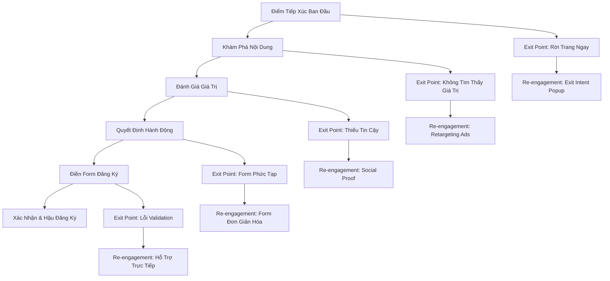
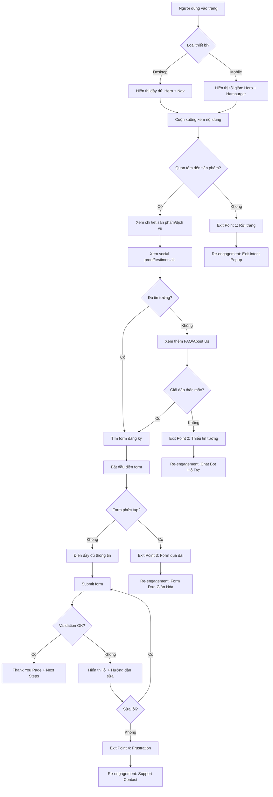
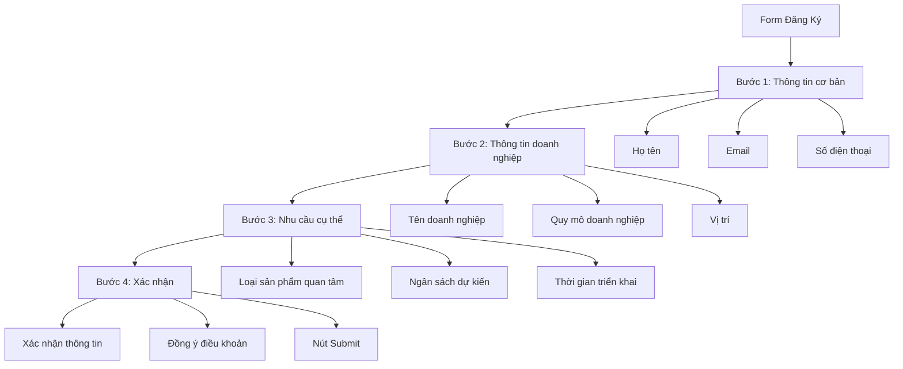
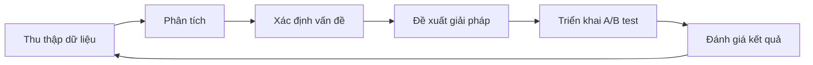

# Thiết Kế User Flow Chi Tiết cho Landing Page B2B Ngành May Mặc  

## Mục lục  
1. Giới thiệu  
2. Phân tích hành trình người dùng  
3. Cấu trúc và thiết kế landing page  
4. Các điểm tiếp xúc chính trong user flow  
5. Tương tác người dùng và quyết định  
6. Điểm ma sát và giải pháp tối ưu  
7. Chiến lược xử lý exit points và re-engagement  
8. Tối ưu hóa form đăng ký  
9. Sự khác biệt giữa trải nghiệm desktop và mobile  
10. Đo lường hiệu quả và phân tích dữ liệu  
11. Kết luận  

## 1. Giới thiệu  

Trong bối cảnh kinh doanh B2B ngành may mặc, landing page đóng vai trò quan trọng như cửa ngõ đầu tiên kết nối doanh nghiệp với khách hàng tiềm năng. Một landing page hiệu quả không chỉ giới thiệu sản phẩm, dịch vụ mà còn phải tạo ra trải nghiệm người dùng mượt mà, giảm thiểu các điểm ma sát và tối ưu hóa tỷ lệ chuyển đổi thông qua form đăng ký.  

Theo nghiên cứu từ Deloitte Digital, hơn 75% công ty B2B cho biết khách hàng của họ mong đợi một quy trình bán hàng được số hóa. Tuy nhiên, gần 71% các công ty này mô tả quy trình của họ là "khá đến cực kỳ thủ công". Sự chênh lệch này giữa kỳ vọng và thực tế sẽ tiếp tục thúc đẩy các doanh nghiệp đầu tư vào thương mại B2B và các công nghệ liên quan.  

Bài viết này sẽ phác thảo chi tiết user flow cho landing page nền tảng B2B ngành may mặc, tập trung vào mục tiêu thu thập lead qua form đăng ký, đồng thời phân tích các điểm ma sát tiềm ẩn và đề xuất giải pháp tối ưu hóa trải nghiệm người dùng trên cả desktop và mobile.  

## 2. Phân tích hành trình người dùng  

Hành trình người dùng trên landing page B2B ngành may mặc có thể được chia thành các giai đoạn chính sau:  

Trong hành trình này, mỗi giai đoạn đều có những đặc điểm và yêu cầu riêng:  

1. **Điểm Tiếp Xúc Ban Đầu**: Người dùng đến từ nhiều nguồn khác nhau (quảng cáo, tìm kiếm, email marketing)  
2. **Khám Phá Nội Dung**: Người dùng tìm hiểu về giá trị cốt lõi của dịch vụ  
3. **Đánh Giá Giá Trị**: Người dùng cân nhắc lợi ích và chi phí  
4. **Quyết Định Hành Động**: Người dùng quyết định có tiếp tục hay không  
5. **Điền Form Đăng Ký**: Người dùng cung cấp thông tin  
6. **Xác Nhận & Hậu Đăng Ký**: Người dùng nhận được phản hồi và bước tiếp theo  

Mỗi giai đoạn đều có các điểm exit tiềm ẩn, nơi người dùng có thể rời khỏi hành trình. Việc hiểu rõ các điểm này sẽ giúp thiết kế các chiến lược re-engagement hiệu quả.  

## 3. Cấu trúc và thiết kế landing page  

Một landing page hiệu quả cho B2B ngành may mặc cần được thiết kế với cấu trúc rõ ràng, tập trung vào mục tiêu chính là thu thập lead. Dưới đây là cấu trúc đề xuất:  

### 3.1 Cấu trúc tổng thể  

| Phần | Mục đích | Yếu tố chính |  
|------|----------|--------------|  
| Hero Section | Tạo ấn tượng đầu tiên | Headline mạnh mẽ, subheadline, CTA chính |  
| Giá trị cốt lõi | Truyền đạt lợi ích | 3-4 điểm giá trị với icon và mô tả ngắn |  
| Showcase sản phẩm | Minh họa dịch vụ | Hình ảnh chất lượng cao, mô tả ngắn gọn |  
| Xã hội chứng thực | Xây dựng niềm tin | Logo khách hàng, testimonial, case study |  
| Form đăng ký | Thu thập lead | Form đơn giản, rõ ràng với CTA nổi bật |  
| FAQ | Giải quyết thắc mắc | Câu hỏi thường gặp và câu trả lời ngắn gọn |  
| Footer | Thông tin bổ sung | Liên hệ, chính sách, social media |  

Theo nghiên cứu, một landing page thực sự là một trang độc lập dành riêng cho một ưu đãi cụ thể. Nó phải dễ dàng điều hướng và giúp người dùng tiếp cận ưu đãi một cách nhanh chóng. Từ góc độ thực tế, các yếu tố gây mất tập trung là một yếu tố chính làm giảm tỷ lệ chuyển đổi, và trong số các yếu tố gây mất tập trung này có thanh điều hướng.  

### 3.2 Nguyên tắc thiết kế  

Để tạo ra một landing page hiệu quả, cần tuân thủ các nguyên tắc UX sau:  

1. **Tập trung vào một mục tiêu duy nhất**: Landing page nên phục vụ một mục đích duy nhất, đó là mục đích đã định của chiến dịch. Người dùng sẽ có trải nghiệm tích cực nếu landing page có liên quan và tập trung với một thông điệp duy nhất.  

2. **Giảm thiểu yếu tố gây mất tập trung**: Càng ít yếu tố gây mất tập trung, kết quả càng tốt. Một landing page thực sự nên có tỷ lệ chú ý 1:1.  

3. **Rõ ràng và dễ hiểu**: Ưu đãi của bạn phải dễ hiểu. Tiêu đề nên truyền đạt chính xác điểm chính của chiến dịch và thực hiện lời hứa của quảng cáo mà họ đã nhấp vào để đến landing page.  

4. **Tối ưu hóa tốc độ**: Tốc độ tải trang chậm ảnh hưởng tiêu cực đến trải nghiệm người dùng vì người dùng cảm thấy không thoải mái khi ở lại các trang web nơi mọi thứ tải chậm. Dữ liệu từ Google cho thấy 53% người dùng sẽ rời bỏ trang nếu nó mất hơn ba giây để tải.  

5. **Thiết kế responsive**: Trang của bạn nên được thiết kế responsive, nghĩa là nó sẽ điều chỉnh theo màn hình của bất kỳ thiết bị nào. Và tất cả các yếu tố của nó nên dễ sử dụng.  

## 4. Các điểm tiếp xúc chính trong user flow  

Hành trình người dùng bắt đầu từ khi họ tiếp xúc với landing page và kết thúc khi họ hoàn thành form đăng ký. Dưới đây là chi tiết các điểm tiếp xúc chính:  

### 4.1 Điểm tiếp xúc từ khi người dùng vào trang  

| Giai đoạn | Điểm tiếp xúc | Mô tả |  
|-----------|---------------|-------|  
| Ban đầu | Hero Section | Người dùng nhìn thấy headline, subheadline và CTA chính |  
| | Navigation (Desktop) | Thanh điều hướng đơn giản với logo và CTA |  
| | Hamburger Menu (Mobile) | Menu thu gọn để tối ưu không gian |  
| Khám phá | Value Proposition | Người dùng cuộn xuống để xem các giá trị cốt lõi |  
| | Product Showcase | Người dùng xem các hình ảnh và mô tả sản phẩm |  
| | Testimonials | Người dùng đọc đánh giá từ khách hàng hiện tại |  
| Quyết định | CTA Buttons | Người dùng thấy các nút kêu gọi hành động |  
| | Trust Badges | Người dùng xem các chứng nhận và đảm bảo |  
| | FAQ Section | Người dùng tìm câu trả lời cho các câu hỏi phổ biến |  
| Hành động | Registration Form | Người dùng điền thông tin vào form |  
| | Form Validation | Người dùng nhận phản hồi về thông tin đã nhập |  
| | Submit Button | Người dùng hoàn tất quá trình đăng ký |  
| Sau đăng ký | Thank You Page | Người dùng nhận xác nhận đăng ký thành công |  
| | Next Steps | Người dùng được hướng dẫn các bước tiếp theo |  
| | Download/Resources | Người dùng có thể tải tài liệu hoặc tài nguyên |  

Trên các màn hình lớn hơn, việc có các tùy chọn điều hướng hiển thị dọc theo chiều dài của thanh điều hướng làm cho nó dễ khám phá hơn. Tuy nhiên, khi màn hình nhỏ hơn và không gian hiển thị trở nên quý giá hơn, bạn có thể muốn thu gọn điều hướng thành một thứ như menu hamburger.  

### 4.2 Sơ đồ user flow chi tiết  

## 5. Tương tác người dùng và quyết định  

Trong hành trình trên landing page, người dùng thực hiện nhiều tương tác và quyết định quan trọng. Hiểu rõ các tương tác này sẽ giúp tối ưu hóa trải nghiệm người dùng.  

### 5.1 Các tương tác chính người dùng thực hiện  

1. **Cuộn trang (Scrolling)**: Người dùng cuộn để khám phá nội dung  
   - Desktop: Cuộn dọc, có thể sử dụng thanh bên  
   - Mobile: Cuộn dọc, thường dùng ngón tay  

2. **Nhấp chuột/Chạm (Click/Tap)**:  
   - Nhấp vào CTA buttons  
   - Mở rộng/thu gọn các phần nội dung (đặc biệt trên mobile)  
   - Chọn các tùy chọn trong form  

3. **Điền form**:  
   - Nhập thông tin cá nhân và doanh nghiệp  
   - Chọn các tùy chọn từ dropdown menus  
   - Tích vào checkboxes  

4. **Tương tác với media**:  
   - Xem video demo (play/pause)  
   - Phóng to hình ảnh sản phẩm  
   - Trượt qua các slides trong carousel  

5. **Điều hướng**:  
   - Sử dụng menu (desktop) hoặc hamburger menu (mobile)  
   - Nhấp vào các liên kết nội bộ  
   - Sử dụng breadcrumbs (nếu có)  

### 5.2 Các quyết định/nút bấm người dùng cần thực hiện  

| Quyết định | Nút bấm/Tương tác | Mục đích |  
|------------|-------------------|----------|  
| Tìm hiểu thêm | "Tìm hiểu thêm" CTA | Khám phá chi tiết về sản phẩm/dịch vụ |  
| Xem demo | "Xem demo" button | Trải nghiệm demo sản phẩm |  
| Liên hệ ngay | "Liên hệ ngay" CTA | Chuyển đến form liên hệ nhanh |  
| Đăng ký | "Đăng ký ngay" primary CTA | Bắt đầu quá trình đăng ký |  
| Tải tài liệu | "Tải xuống catalog" button | Nhận tài liệu sản phẩm |  
| Xem bảng giá | "Xem bảng giá" link | Truy cập thông tin về giá |  
| Đặt lịch demo | "Đặt lịch" button | Lên lịch demo với đại diện |  
| Gửi form | "Gửi" submit button | Hoàn tất quá trình đăng ký |  

Theo nghiên cứu, sử dụng các CTA đơn giản nổi bật hơn các nội dung khác trên trang là rất quan trọng để có tỷ lệ chuyển đổi cao. Một CTA chất lượng tự tin truyền đạt lợi ích rõ ràng, sử dụng các động từ dựa trên giá trị mạnh mẽ như nhận, khám phá, bắt đầu, tham gia hoặc nhận và xử lý mọi phản đối phút cuối.  

## 6. Điểm ma sát và giải pháp tối ưu  

Các điểm ma sát (friction points) là những yếu tố cản trở người dùng hoàn thành hành trình chuyển đổi. Việc xác định và giảm thiểu các điểm này là chìa khóa để tăng tỷ lệ chuyển đổi.  

### 6.1 Các điểm ma sát tiềm ẩn  

| Điểm ma sát | Mô tả | Tác động |  
|-------------|-------|----------|  
| Tốc độ tải trang | Trang tải chậm, đặc biệt trên mobile | 53% người dùng rời bỏ nếu trang tải >3s |  
| Form phức tạp | Quá nhiều trường thông tin cần điền | Giảm tỷ lệ hoàn thành form |  
| Thiếu tin cậy | Không đủ social proof hoặc chứng nhận | Người dùng nghi ngờ, không đăng ký |  
| UX không nhất quán | Trải nghiệm khác nhau giữa desktop và mobile | Gây nhầm lẫn cho người dùng |  
| Nội dung quá dài | Quá nhiều thông tin, khó tìm điểm chính | Người dùng bỏ cuộc giữa chừng |  
| Thiếu hướng dẫn rõ ràng | Không rõ bước tiếp theo là gì | Người dùng không biết phải làm gì |  
| Lỗi validation | Thông báo lỗi không rõ ràng | Người dùng bỏ form giữa chừng |  
| Thiếu tối ưu cho mobile | Các yếu tố không hiển thị tốt trên mobile | Trải nghiệm kém trên thiết bị di động |  

Mọi người đều thích trải nghiệm liền mạch hoặc hành trình trơn tru từ đầu đến cuối. Bạn biết trang web của mình cần hướng dẫn khách truy cập một cách hiệu quả và không có trở ngại. Giảm các điểm ma sát - những trục trặc nhỏ khó chịu khiến người dùng thoát - là chìa khóa cho một trang web thành công.  

### 6.2 Giải pháp để giảm thiểu từng điểm ma sát  

1. **Tối ưu tốc độ tải trang**:  
   - Nén hình ảnh và tối ưu hóa media  
   - Sử dụng lazy loading cho nội dung dưới fold  
   - Triển khai AMP (Accelerated Mobile Pages) cho mobile  
   - Sử dụng CDN để phân phối nội dung nhanh hơn  

2. **Đơn giản hóa form đăng ký**:  
   - Giảm số lượng trường thông tin xuống mức tối thiểu  
   - Sử dụng form nhiều bước (multi-step form)  
   - Tự động điền thông tin khi có thể  
   - Hiển thị rõ ràng các trường bắt buộc  

3. **Tăng cường yếu tố tin cậy**:  
   - Hiển thị logo khách hàng nổi bật  
   - Thêm testimonials với hình ảnh và tên thật  
   - Hiển thị các chứng nhận và giải thưởng  
   - Cung cấp case studies và kết quả cụ thể  

4. **Đảm bảo UX nhất quán**:  
   - Thiết kế responsive từ đầu  
   - Kiểm tra trải nghiệm trên nhiều thiết bị  
   - Đảm bảo các yếu tố tương tác hoạt động tốt trên mọi nền tảng  

5. **Tối ưu hóa nội dung**:  
   - Sử dụng tiêu đề và đoạn văn ngắn gọn  
   - Áp dụng nguyên tắc "inverted pyramid" trong viết nội dung  
   - Sử dụng bullet points và danh sách  
   - Tạo visual hierarchy rõ ràng  

6. **Cải thiện hướng dẫn người dùng**:  
   - Sử dụng microcopy để hướng dẫn  
   - Thêm tooltips và hints  
   - Hiển thị tiến trình trong form nhiều bước  
   - Sử dụng visual cues để hướng dẫn người dùng  

7. **Tối ưu validation form**:  
   - Validation real-time khi người dùng nhập liệu  
   - Thông báo lỗi rõ ràng và hướng dẫn cách sửa  
   - Lưu dữ liệu đã nhập khi có lỗi  
   - Cho phép submit lại dễ dàng  

8. **Tối ưu cho mobile**:  
   - Thiết kế mobile-first  
   - Sử dụng các yếu tố touch-friendly  
   - Tối ưu kích thước nút và khoảng cách  
   - Đảm bảo text dễ đọc trên màn hình nhỏ  

Với việc sử dụng di động vượt qua desktop trong thập kỷ qua, bất kỳ chiến lược tạo lead nào cũng phải ưu tiên người dùng đang duyệt web khi di chuyển. Thiết kế responsive không chỉ là một tùy chọn - đó là một sự cần thiết.  

## 7. Chiến lược xử lý exit points và re-engagement  

Việc hiểu và xử lý các điểm thoát (exit points) là rất quan trọng để tối đa hóa tỷ lệ chuyển đổi. Đồng thời, các chiến lược tái thu hút (re-engagement) giúp mang người dùng quay lại hành trình chuyển đổi.  

### 7.1 Các điểm người dùng có thể rời trang  

| Exit point | Thời điểm | Nguyên nhân phổ biến |  
|------------|-----------|----------------------|  
| Ngay lập tức | 0-5 giây sau khi vào trang | Trang tải chậm, không liên quan đến nhu cầu |  
| Sau khi xem hero section | 5-15 giây | Value proposition không hấp dẫn |  
| Trong quá trình cuộn | 15-60 giây | Không tìm thấy thông tin cần thiết |  
| Khi thấy form | 1-2 phút | Form quá dài hoặc yêu cầu quá nhiều thông tin |  
| Trong quá trình điền form | 2-5 phút | Gặp khó khăn với validation hoặc câu hỏi phức tạp |  
| Sau khi submit form | >5 phút | Lỗi kỹ thuật hoặc không có xác nhận rõ ràng |  

Theo nghiên cứu, nếu một trang web khó sử dụng, mọi người sẽ rời đi. Nếu trang chủ không nêu rõ những gì một công ty cung cấp và người dùng có thể làm gì trên trang web, mọi người sẽ rời đi. Nếu người dùng bị lạc trên trang web, họ sẽ rời đi. Nếu thông tin trên trang web khó đọc hoặc không trả lời các câu hỏi chính của người dùng, họ sẽ rời đi.  

### 7.2 Chiến lược để giữ chân hoặc tái thu hút người dùng  

1. **Exit-intent popups**:  
   - Hiển thị khi người dùng có ý định rời trang  
   - Cung cấp ưu đãi đặc biệt hoặc nội dung giá trị  
   - Thiết kế đơn giản với CTA rõ ràng  
   - Ví dụ: "Trước khi bạn rời đi, hãy tải xuống catalog miễn phí của chúng tôi"  

2. **Chatbots và live chat**:  
   - Cung cấp hỗ trợ real-time  
   - Xuất hiện khi người dùng dừng lại quá lâu tại một điểm  
   - Chủ động đề nghị giúp đỡ  
   - Ví dụ: "Bạn cần giúp đỡ tìm thông tin về sản phẩm của chúng tôi không?"  

3. **Form đơn giản hóa**:  
   - Hiển thị phiên bản rút gọn của form khi người dùng có ý định rời đi  
   - Chỉ yêu cầu thông tin tối thiểu (email, tên)  
   - Ví dụ: "Chỉ cần để lại email, chúng tôi sẽ liên hệ với bạn"  

4. **Retargeting ads**:  
   - Sử dụng cookie để hiển thị quảng cáo cho người dùng đã rời trang  
   - Cung cấp nội dung hoặc ưu đãi mới  
   - Nhắc nhở về giá trị của dịch vụ  
   - Ví dụ: Quảng cáo Facebook với nội dung "Hoàn thành đăng ký để nhận ưu đãi đặc biệt"  

5. **Email nurturing**:  
   - Gửi email theo dõi cho người dùng đã điền một phần form  
   - Cung cấp thêm thông tin giá trị  
   - Nhắc nhở hoàn thành quá trình đăng ký  
   - Ví dụ: "Chúng tôi nhận thấy bạn chưa hoàn thành đăng ký. Hãy quay lại để nhận ưu đãi X"  

6. **Social proof notifications**:  
   - Hiển thị thông báo về người dùng khác đang sử dụng dịch vụ  
   - Tạo cảm giác FOMO (Fear Of Missing Out)  
   - Ví dụ: "15 doanh nghiệp may mặc đã đăng ký trong 24 giờ qua"  

7. **Simplified re-entry points**:  
   - Cung cấp liên kết trực tiếp đến điểm người dùng rời đi  
   - Lưu trữ thông tin đã nhập  
   - Ví dụ: "Quay lại nơi bạn đã dừng lại"  

Email tái kích hoạt hoặc tái thu hút qua email là một chiến lược để kết nối lại với người đăng ký hoặc khách hàng đã dần trở nên không tương tác. Thay vì để các liên hệ không hoạt động dần biến mất, tái thu hút qua email tìm cách thiết lập lại kết nối và khơi dậy mối quan hệ.  

## 8. Tối ưu hóa form đăng ký  

Form đăng ký là điểm chuyển đổi quan trọng nhất trên landing page. Việc tối ưu hóa form sẽ trực tiếp ảnh hưởng đến tỷ lệ chuyển đổi.  

### 8.1 Cấu trúc form hiệu quả  

### 8.2 Các nguyên tắc tối ưu form  

1. **Giảm thiểu số lượng trường thông tin**:  
   - Chỉ yêu cầu thông tin thực sự cần thiết  
   - Sử dụng progressive profiling (thu thập thông tin dần dần)  
   - Nghiên cứu cho thấy form tốt nhất là form thu thập thông tin tối thiểu cần thiết để đủ điều kiện cho một khách hàng tiềm năng  

2. **Sử dụng multi-step form**:  
   - Chia form thành nhiều bước nhỏ  
   - Hiển thị tiến trình rõ ràng  
   - Bắt đầu với các câu hỏi đơn giản, dễ trả lời  

3. **Tối ưu hóa labels và placeholders**:  
   - Sử dụng labels rõ ràng, đặt phía trên trường nhập liệu  
   - Placeholders cung cấp ví dụ, không thay thế labels  
   - Tránh sử dụng placeholders làm labels (biến mất khi người dùng nhập liệu)  

4. **Validation thông minh**:  
   - Validation real-time khi người dùng nhập liệu  
   - Thông báo lỗi cụ thể và hướng dẫn cách sửa  
   - Sử dụng visual cues (màu sắc, icons) để chỉ ra trạng thái validation  

5. **Tối ưu hóa cho mobile**:  
   - Sử dụng input types phù hợp (email, tel, number)  
   - Đảm bảo kích thước nút đủ lớn cho touch  
   - Tự động hiển thị bàn phím phù hợp  

6. **Tăng cường trust elements**:  
   - Hiển thị badges bảo mật gần form  
   - Thêm testimonials liên quan đến quá trình đăng ký  
   - Cung cấp thông tin về cách dữ liệu sẽ được sử dụng  

7. **Sử dụng conditional logic**:  
   - Hiển thị các trường liên quan dựa trên câu trả lời trước đó  
   - Tránh hiển thị các trường không cần thiết  
   - Cá nhân hóa trải nghiệm form  

Một form tốt trước hết loại bỏ ma sát bằng cách giảm tải nhận thức. Nó không khiến mọi người phải suy nghĩ.  

### 8.3 Ví dụ form đăng ký tối ưu  

**Bước 1: Thông tin cơ bản**  
- Tiêu đề: "Bắt đầu hợp tác với chúng tôi"  
- Trường thông tin:  
  - Họ tên (bắt buộc)  
  - Email doanh nghiệp (bắt buộc)  
  - Số điện thoại (tùy chọn)  
- CTA: "Tiếp tục"  
- Trust element: "Thông tin của bạn được bảo mật theo chính sách riêng tư của chúng tôi"  

**Bước 2: Thông tin doanh nghiệp**  
- Tiêu đề: "Giúp chúng tôi hiểu về doanh nghiệp của bạn"  
- Trường thông tin:  
  - Tên doanh nghiệp (bắt buộc)  
  - Quy mô doanh nghiệp (dropdown: <50, 50-200, 201-500, >500)  
  - Vị trí (dropdown hoặc autocomplete)  
- CTA: "Tiếp tục"  
- Back link: "Quay lại"  

**Bước 3: Nhu cầu cụ thể**  
- Tiêu đề: "Chúng tôi có thể giúp gì cho bạn?"  
- Trường thông tin:  
  - Loại sản phẩm quan tâm (checkboxes: vải, phụ kiện, dịch vụ may mặc, khác)  
  - Ngân sách dự kiến (radio buttons: <10K, 10K-50K, 50K-100K, >100K)  
  - Thời gian triển khai (dropdown: Ngay lập tức, 1-3 tháng, 3-6 tháng, >6 tháng)  
- CTA: "Hoàn tất đăng ký"  
- Back link: "Quay lại"  

**Bước 4: Xác nhận**  
- Tiêu đề: "Xác nhận thông tin của bạn"  
- Hiển thị tóm tắt thông tin đã nhập  
- Checkbox: "Tôi đồng ý với điều khoản và điều kiện"  
- Checkbox: "Tôi muốn nhận thông tin cập nhật và ưu đãi qua email"  
- CTA: "Gửi thông tin"  
- Back link: "Chỉnh sửa thông tin"  

## 9. Sự khác biệt giữa trải nghiệm desktop và mobile  

Trải nghiệm người dùng cần được tối ưu hóa cho cả desktop và mobile, với sự khác biệt phù hợp để tận dụng tối đa từng nền tảng.  

### 9.1 So sánh trải nghiệm desktop và mobile  

| Yếu tố | Desktop | Mobile |  
|--------|---------|--------|  
| Layout | Multi-column, horizontal | Single-column, vertical |  
| Navigation | Full menu bar | Hamburger menu |  
| Content display | Side-by-side sections | Stacked sections |  
| CTA placement | Top-right, inline | Sticky bottom, full-width |  
| Form display | Multi-column, side-by-side | Single-column, stacked |  
| Media | Larger images, auto-play video | Optimized images, tap-to-play video |  
| Interactions | Hover states, tooltips | Tap states, swipe gestures |  
| Font size | Standard (16px body) | Larger (18px body) |  
| Button size | Standard | Larger touch targets (min 44px) |  

Trang của bạn nên được chuẩn bị để điều chỉnh theo nhiều kích thước và kích thước màn hình - desktop, laptop, tablet, mobile (rất nhiều kích thước mobile khác nhau). Cuối cùng, luồng nội dung nên được xác định bởi thiết bị, không phải ngược lại.  

### 9.2 Tối ưu hóa cho desktop  

1. **Tận dụng không gian rộng**:  
   - Sử dụng layout nhiều cột  
   - Hiển thị nhiều thông tin cùng lúc  
   - Sử dụng side-by-side comparisons  

2. **Tương tác phong phú**:  
   - Sử dụng hover states  
   - Cung cấp tooltips và popovers  
   - Animations và transitions tinh tế  

3. **Navigation mở rộng**:  
   - Menu đầy đủ với các tùy chọn hiển thị  
   - Mega menus cho nhiều tùy chọn  
   - Sticky navigation khi cuộn  

4. **Form layout tối ưu**:  
   - Multi-column forms khi phù hợp  
   - Inline validation  
   - Larger input fields  

### 9.3 Tối ưu hóa cho mobile  

1. **Thiết kế tối giản**:  
   - Single-column layout  
   - Nội dung ngắn gọn, súc tích  
   - Ưu tiên thông tin quan trọng nhất  

2. **Touch-friendly interactions**:  
   - Nút lớn (ít nhất 44x44px)  
   - Khoảng cách đủ giữa các yếu tố có thể nhấn  
   - Swipe gestures cho carousels  

3. **Simplified navigation**:  
   - Hamburger menu  
   - Bottom navigation bar  
   - Sticky CTA button  

4. **Form tối ưu cho mobile**:  
   - Single-column forms  
   - Input types phù hợp (tel, email, etc.)  
   - Autocomplete và suggestions  

5. **Performance focus**:  
   - Tối ưu hóa hình ảnh  
   - Lazy loading  
   - Giảm thiểu JavaScript không cần thiết  

Với việc sử dụng di động vượt qua desktop trong thập kỷ qua, bất kỳ chiến lược tạo lead nào cũng phải ưu tiên người dùng đang duyệt web khi di chuyển. Thiết kế responsive không chỉ là một tùy chọn - đó là một sự cần thiết.  

## 10. Đo lường hiệu quả và phân tích dữ liệu  

Để liên tục cải thiện trải nghiệm người dùng và tăng tỷ lệ chuyển đổi, việc đo lường và phân tích dữ liệu là rất quan trọng.  

### 10.1 Các chỉ số KPI chính cần theo dõi  

| KPI | Mô tả | Benchmark |  
|-----|-------|-----------|  
| Conversion Rate | Tỷ lệ người dùng hoàn thành form | 2-5% cho B2B |  
| Bounce Rate | Tỷ lệ người dùng rời trang ngay lập tức | <40% là tốt |  
| Time on Page | Thời gian trung bình người dùng ở trên trang | >2 phút là tốt |  
| Form Abandonment Rate | Tỷ lệ người dùng bắt đầu nhưng không hoàn thành form | <70% là tốt |  
| Click-through Rate (CTR) | Tỷ lệ người dùng nhấp vào CTA | >2% là tốt |  
| Cost per Lead (CPL) | Chi phí để có được một lead | Tùy thuộc vào ngành |  
| Lead Quality Score | Đánh giá chất lượng của leads | Tùy thuộc vào tiêu chí |  

### 10.2 Công cụ phân tích và theo dõi  

1. **Google Analytics**:  
   - Theo dõi traffic, bounce rate, time on page  
   - Thiết lập goals để đo lường conversions  
   - Phân tích user flow và behavior  

2. **Heatmaps và Session Recordings**:  
   - Sử dụng công cụ như Hotjar, Crazy Egg  
   - Xem heatmaps để hiểu click patterns  
   - Xem recordings để phát hiện friction points  

3. **Form Analytics**:  
   - Theo dõi form completion rates  
   - Phân tích form abandonment  
   - Xác định các trường gây khó khăn  

4. **A/B Testing**:  
   - Thử nghiệm các phiên bản khác nhau của landing page  
   - So sánh hiệu suất của các elements khác nhau  
   - Tối ưu hóa dựa trên dữ liệu  

5. **User Feedback**:  
   - Surveys sau khi submit form  
   - Feedback widgets  
   - User testing  

Một khi thiết kế của bạn đã hoạt động, đã đến lúc xem trải nghiệm người dùng landing page UI của bạn thực sự thân thiện như thế nào. Điều đó có nghĩa là tạo hai phiên bản của trang của bạn, chạy thử nghiệm với người dùng và xem phiên bản nào cho thấy chuyển đổi, đăng ký hoặc bất kỳ mục tiêu nào bạn có tốt hơn.  

Như một phần của việc kiểm tra của bạn, hãy sử dụng heatmaps và công cụ ghi lại phiên. Những công cụ này cung cấp cho bạn những hiểu biết tuyệt vời về cách người dùng đang xem và sử dụng landing page của bạn.  

### 10.3 Quy trình tối ưu hóa liên tục  

1. **Thu thập dữ liệu**:  
   - Sử dụng các công cụ phân tích  
   - Thu thập feedback từ người dùng  
   - Theo dõi KPIs  

2. **Phân tích**:  
   - Tìm patterns và trends  
   - So sánh với benchmarks  
   - Xác định các điểm yếu  

3. **Xác định vấn đề**:  
   - Prioritize issues dựa trên impact  
   - Tìm root causes  
   - Xác định cơ hội cải thiện  

4. **Đề xuất giải pháp**:  
   - Brainstorm solutions  
   - Tham khảo best practices  
   - Xác định các thay đổi cần thử nghiệm  

5. **Triển khai A/B test**:  
   - Tạo variants  
   - Thiết lập test parameters  
   - Chạy test với đủ traffic  

6. **Đánh giá kết quả**:  
   - Phân tích data  
   - Xác định winner  
   - Document learnings  

7. **Lặp lại quy trình**:  
   - Triển khai thay đổi thành công  
   - Bắt đầu test mới  
   - Liên tục cải thiện  

Split testing (hoặc A/B testing) là một thử nghiệm có kiểm soát gửi 50% traffic đến một phiên bản của landing page của bạn (A) và 50% còn lại đến một phiên bản khác của landing page của bạn (B) để khám phá phiên bản nào chuyển đổi cao hơn. Split testing là cách bạn thu thập insights về hành vi để bạn có thể đưa ra quyết định UX dựa trên dữ liệu làm tăng giá trị cho bạn và khách hàng của bạn.  

## 11. Kết luận  

Thiết kế user flow cho landing page B2B ngành may mặc đòi hỏi sự hiểu biết sâu sắc về hành vi người dùng, các nguyên tắc UX hiệu quả và chiến lược tối ưu hóa chuyển đổi. Dưới đây là tóm tắt các điểm chính:  

### Tóm tắt các điểm chính:  

1. **Hiểu rõ hành trình người dùng**:  
   - Xác định các giai đoạn từ entry đến conversion  
   - Hiểu các điểm tiếp xúc và tương tác chính  
   - Dự đoán và giải quyết các quyết định của người dùng  

2. **Tối ưu hóa cấu trúc landing page**:  
   - Tập trung vào một mục tiêu duy nhất  
   - Thiết kế rõ ràng, dễ hiểu  
   - Sử dụng visual hierarchy hiệu quả  

3. **Giảm thiểu điểm ma sát**:  
   - Tối ưu tốc độ tải trang  
   - Đơn giản hóa form đăng ký  
   - Tăng cường yếu tố tin cậy  

4. **Tối ưu hóa cho cả desktop và mobile**:  
   - Thiết kế responsive từ đầu  
   - Điều chỉnh layout phù hợp với từng nền tảng  
   - Đảm bảo trải nghiệm nhất quán  

5. **Xử lý exit points và re-engagement**:  
   - Xác định các điểm người dùng có thể rời trang  
   - Triển khai các chiến lược giữ chân người dùng  
   - Sử dụng exit-intent popups và retargeting  

6. **Liên tục đo lường và cải thiện**:  
   - Theo dõi các KPI chính  
   - Sử dụng A/B testing  
   - Phân tích heatmaps và session recordings  

### Bảng tóm tắt các best practices:  

| Khía cạnh | Best Practices |  
|-----------|----------------|  
| Cấu trúc | Tập trung vào một mục tiêu, giảm thiểu phân tâm |  
| UX Design | Rõ ràng, nhất quán, dễ sử dụng |  
| Form | Đơn giản, nhiều bước, validation thông minh |  
| Mobile | Touch-friendly, tối giản, hiệu suất cao |  
| Trust | Social proof, testimonials, badges bảo mật |  
| Re-engagement | Exit-intent popups, retargeting, email nurturing |  
| Analytics | A/B testing, heatmaps, form analytics |  

Bằng cách áp dụng các nguyên tắc và chiến lược được nêu trong bài viết này, bạn có thể tạo ra một landing page B2B ngành may mặc hiệu quả, tối ưu hóa trải nghiệm người dùng và tăng tỷ lệ chuyển đổi thông qua form đăng ký. Hãy nhớ rằng việc tối ưu hóa là một quá trình liên tục, đòi hỏi sự theo dõi, phân tích và cải tiến không ngừng.  

Cuối cùng, một landing page thành công là landing page giúp người dùng dễ dàng tìm thấy thông tin họ cần và thực hiện hành động mong muốn mà không gặp trở ngại. Bằng cách tập trung vào việc giảm thiểu ma sát và tối ưu hóa trải nghiệm người dùng, bạn sẽ tạo ra một landing page không chỉ thu hút leads mà còn xây dựng niềm tin và mối quan hệ lâu dài với khách hàng tiềm năng.