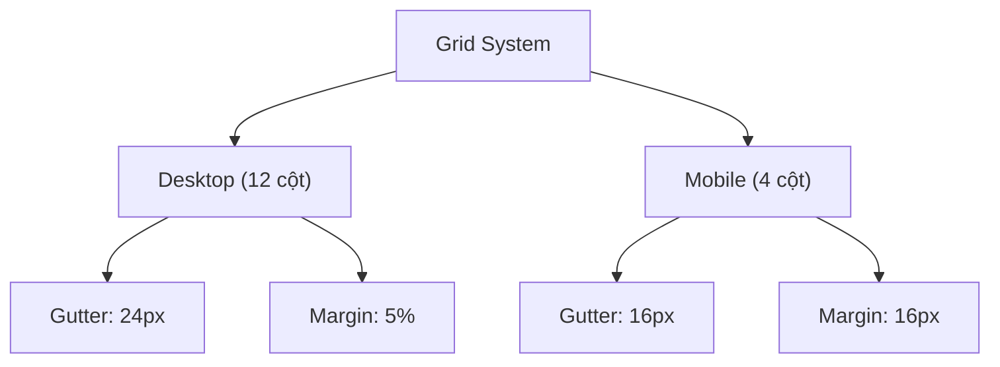
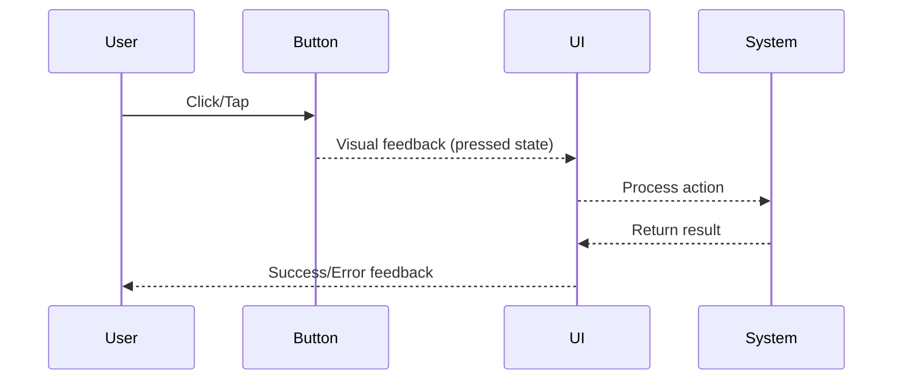
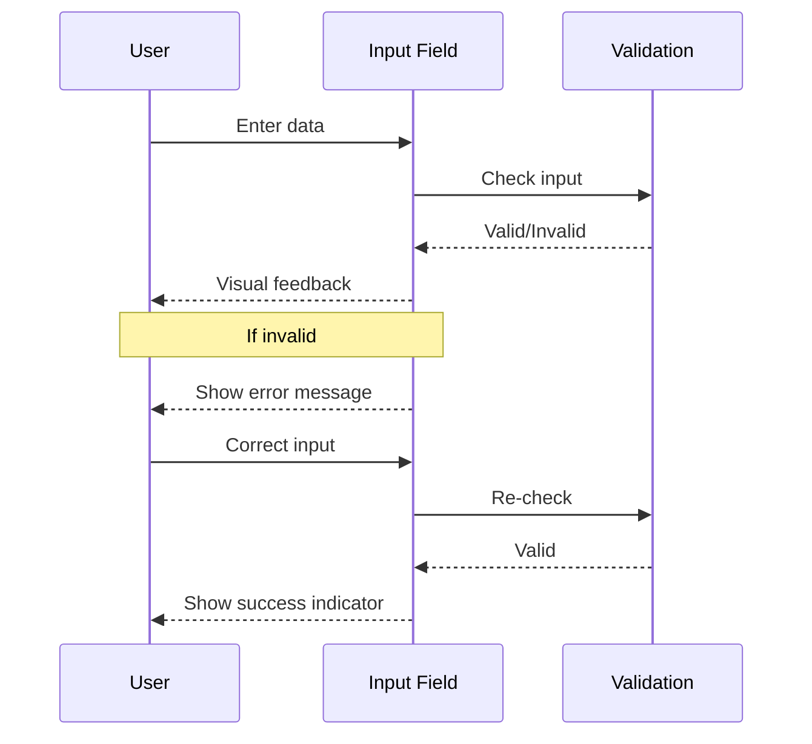
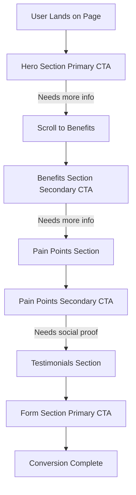
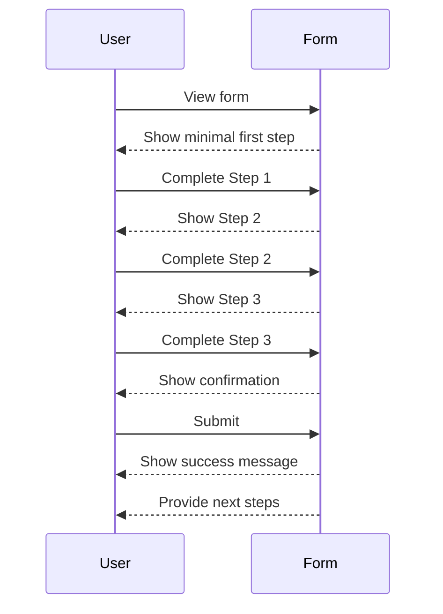

# Wireframe Chi Tiết cho Landing Page B2B Ngành May Mặc  

## Table of Contents  
1. Giới thiệu  
2. Nguyên tắc thiết kế và grid system  
3. Desktop Version - Header & Hero Section  
4. Desktop Version - Benefits & Pain Points Section  
5. Desktop Version - Social Proof & Testimonials  
6. Desktop Version - Lead Capture Form  
7. Desktop Version - FAQ & Footer  
8. Mobile Version - Responsive Adaptations  
9. Micro-interactions và Trải nghiệm tương tác  
10. Visual Hierarchy và Typography  
11. Conversion Optimization Elements  
12. Kết luận  

## 1. Giới thiệu  

Wireframe là bước quan trọng trong quá trình thiết kế UX/UI, đặc biệt đối với landing page B2B ngành may mặc - nơi cần cân bằng giữa tính chuyên nghiệp và khả năng chuyển đổi cao. Dựa trên user flow đã phác thảo trước đó, bài viết này sẽ trình bày chi tiết wireframe cho cả phiên bản desktop và mobile, tập trung vào bố cục, cấu trúc và các yếu tố tương tác nhằm tối ưu hóa trải nghiệm người dùng và tỷ lệ chuyển đổi.  

Landing page B2B ngành may mặc cần đáp ứng nhu cầu của các đối tượng khách hàng doanh nghiệp khác nhau, từ các xưởng may nhỏ đến các nhà máy lớn. Mục tiêu chính là thu thập lead thông qua form đăng ký, đồng thời truyền tải giá trị cốt lõi của nền tảng một cách hiệu quả.  

Theo nghiên cứu, một landing page thực sự là một trang độc lập dành riêng cho một ưu đãi cụ thể. Nó phải dễ dàng điều hướng và giúp người dùng tiếp cận ưu đãi một cách nhanh chóng. Từ góc độ thực tế, các yếu tố gây mất tập trung là một yếu tố chính làm giảm tỷ lệ chuyển đổi, và trong số các yếu tố gây mất tập trung này có thanh điều hướng.  

## 2. Nguyên tắc thiết kế và grid system  

### 2.1 Nguyên tắc thiết kế cơ bản  

Trước khi đi vào chi tiết từng phần của wireframe, cần xác định các nguyên tắc thiết kế cơ bản sẽ được áp dụng xuyên suốt:  

1. **Tập trung vào một mục tiêu duy nhất**: Landing page nên phục vụ một mục đích duy nhất, đó là thu thập lead thông qua form đăng ký.  

2. **Giảm thiểu yếu tố gây mất tập trung**: Càng ít yếu tố gây mất tập trung, kết quả càng tốt. Một landing page thực sự nên có tỷ lệ chú ý 1:1.  

3. **Rõ ràng và dễ hiểu**: Ưu đãi của bạn phải dễ hiểu. Tiêu đề nên truyền đạt chính xác điểm chính của chiến dịch.  

4. **Tối ưu hóa tốc độ**: Tốc độ tải trang chậm ảnh hưởng tiêu cực đến trải nghiệm người dùng. Dữ liệu từ Google cho thấy 53% người dùng sẽ rời bỏ trang nếu nó mất hơn ba giây để tải.  

5. **Thiết kế responsive**: Trang phải được thiết kế responsive, nghĩa là nó sẽ điều chỉnh theo màn hình của bất kỳ thiết bị nào.  

### 2.2 Grid System  

Grid system là một công cụ mạnh mẽ cho phép các nhà thiết kế xây dựng các thiết kế web nhất quán, linh hoạt và responsive hơn. Đối với landing page B2B ngành may mặc, chúng ta sẽ sử dụng:  

**Desktop Grid System:**  
- 12 cột (column grid)  
- Gutter: 24px (khoảng cách giữa các cột)  
- Margin: 5% (lề trái/phải)  
- Max-width: 1440px  

**Mobile Grid System:**  
- 4 cột  
- Gutter: 16px  
- Margin: 16px (lề trái/phải)  
- Breakpoint chính: 768px  



Grid systems là một khái niệm cơ bản trong thiết kế web. Chúng là một cấu trúc vô hình của các cột và hàng giúp các nhà thiết kế tổ chức và căn chỉnh nội dung trên trang web. Grid systems cũng có thể giúp tạo ra trải nghiệm trực quan cho người dùng trên tất cả các trang web.  

Việc sử dụng grid systems sẽ giúp bạn tạo ra một hệ thống phân cấp trực quan trên các trang của mình, điều này có thể giúp hướng mắt người dùng đến thông tin quan trọng nhất.  

## 3. Desktop Version - Header & Hero Section  

### 3.1 Header Section  

Header section là điểm tiếp xúc đầu tiên của người dùng với landing page, vì vậy cần được thiết kế để tạo ấn tượng mạnh mẽ và cung cấp điều hướng rõ ràng.  

**Grid Layout:**  
- Logo: 2 cột (trái)  
- Navigation: 6 cột (giữa)  
- CTA chính: 2 cột (phải)  
- Margin: 1 cột mỗi bên  

**Content:**  
- **Logo**: Logo công ty kèm slogan ngắn gọn  
- **Navigation**: Trang chủ | Giải pháp | Bảng giá | Khách hàng | Liên hệ  
- **CTA chính**: "Dùng thử miễn phí" (Primary button)  

**Visual Hierarchy:**  
- Logo: Kích thước vừa phải, rõ ràng  
- Navigation: Typography rõ ràng, khoảng cách đều nhau  
- CTA: Nổi bật với màu tương phản, padding đủ lớn  

**Micro-interactions:**  
- Hover effect trên navigation items: Underline animation  
- CTA button: Scale 1.05 và thay đổi màu nhẹ khi hover  
- Sticky header khi scroll xuống (thu nhỏ lại)  

```  
+------------------------------------------------------------------+  
|                                                                  |  
| [LOGO]     [Home] [Solutions] [Pricing] [Clients] [Contact]  [CTA]|  
|                                                                  |  
+------------------------------------------------------------------+  
```  

### 3.2 Hero Section  

Hero section cần truyền tải giá trị cốt lõi của nền tảng một cách nhanh chóng và thuyết phục, đồng thời hướng người dùng đến hành động chính.  

**Grid Layout:**  
- Full-width background  
- Content container: 8 cột (căn giữa)  
- Headline, subheadline và CTA: Căn giữa trong container  

**Content:**  
- **Headline**: "Nền tảng quản lý sản xuất dệt may thông minh"  
- **Subheadline**: "Tối ưu 30% chi phí vận hành với AI-Powered Platform"  
- **CTA chính**: "Đăng ký tư vấn ngay" (Large primary button)  
- **CTA phụ**: "Xem demo" (Text link với icon play)  
- **Visual element**: Background image hoặc illustration liên quan đến ngành may mặc  

**Visual Hierarchy:**  
- Headline: 48px, font weight bold  
- Subheadline: 24px, font weight regular  
- Khoảng cách giữa các elements: 24px  
- CTA button: Kích thước lớn, màu tương phản cao  

**Micro-interactions:**  
- Subtle parallax effect khi scroll  
- CTA button: Pulse animation nhẹ (3s interval)  
- Background: Gradient overlay animation nhẹ  

```  
+------------------------------------------------------------------+  
|                                                                  |  
|                                                                  |  
|                  [Headline - 48px Bold]                          |  
|                                                                  |  
|                  [Subheadline - 24px]                            |  
|                                                                  |  
|                  [CTA Button]  [Watch Demo]                      |  
|                                                                  |  
|                                                                  |  
+------------------------------------------------------------------+  
```  

Theo nghiên cứu, một landing page phải tạo ấn tượng ngay lập tức phía trên fold. Điều này đề cập đến những gì người dùng thấy trong trình duyệt của họ khi ban đầu truy cập trang. Thuật ngữ này bắt nguồn từ trang đầu tiên của báo, nơi các tiêu đề hấp dẫn nhất phải xuất hiện khi nhìn thoáng qua tờ báo, phía trên nơi nó được gấp lại.  

Người dùng phải ngay lập tức thấy lý do tại sao họ nên ở lại mà không cần phải cuộn xuống và chờ đợi phần còn lại của trang tải.  

## 4. Desktop Version - Benefits & Pain Points Section  

### 4.1 Benefits Section  

Section này nhằm mục đích trình bày các lợi ích chính của nền tảng, giúp người dùng hiểu rõ giá trị mà họ sẽ nhận được.  

**Grid Layout:**  
- Container: 10 cột (căn giữa)  
- 3 benefit cards: Mỗi card chiếm 3 cột, với gutter 24px  
- Section heading: Full-width trong container  

**Content:**  
- **Section heading**: "Tối ưu hóa quy trình sản xuất may mặc"  
- **Benefit cards** (mỗi card gồm):  
  1. Icon: 64x64px  
  2. Headline: "Theo dõi đơn hàng real-time"  
  3. Description: 2-3 dòng mô tả lợi ích  
  4. Micro CTA: "Tìm hiểu thêm" (text link)  

**Visual Hierarchy:**  
- Section heading: 36px, căn giữa  
- Card headline: 24px, font weight semibold  
- Card description: 16px, font weight regular  
- Khoảng cách giữa các elements trong card: 16px  

**Micro-interactions:**  
- Cards: Hover effect với elevation (shadow) và scale nhẹ  
- Icons: Subtle animation khi hover  
- Micro CTA: Underline animation khi hover  

```  
+------------------------------------------------------------------+  
|                                                                  |  
|              [Section Heading - 36px Bold]                       |  
|                                                                  |  
| +-------------+  +-------------+  +-------------+                |  
| |    [Icon]   |  |    [Icon]   |  |    [Icon]   |                |  
| |             |  |             |  |             |                |  
| | [Headline]  |  | [Headline]  |  | [Headline]  |                |  
| |             |  |             |  |             |                |  
| | [Description]  | [Description]  | [Description]                |  
| |             |  |             |  |             |                |  
| | [Learn More]|  | [Learn More]|  | [Learn More]|                |  
| +-------------+  +-------------+  +-------------+                |  
|                                                                  |  
+------------------------------------------------------------------+  
```  

### 4.2 Pain Points & Solutions Section  

Section này nhằm mục đích giải quyết các vấn đề cụ thể mà các nhóm khách hàng khác nhau đang gặp phải, và cung cấp giải pháp tương ứng.  

**Grid Layout:**  
- Container: 10 cột (căn giữa)  
- Tab navigation: Full-width trong container  
- Content area: 8 cột (căn giữa trong container)  

**Content:**  
- **Section heading**: "Giải pháp cho thách thức của bạn"  
- **Tab navigation** (3 tabs):  
  1. "Nhà máy <50 công nhân"  
  2. "Nhà máy 50-200 công nhân"  
  3. "Nhà máy >200 công nhân"  
- **Tab content** (cho mỗi tab):  
  1. Pain point: Mô tả vấn đề cụ thể  
  2. Solution: Mô tả giải pháp  
  3. Visual: Infographic hoặc illustration  
  4. CTA: "Đăng ký tư vấn" (Secondary button)  

**Visual Hierarchy:**  
- Section heading: 36px, căn giữa  
- Tab labels: 18px, font weight medium  
- Pain point heading: 24px, font weight semibold  
- Solution text: 16px, font weight regular  
- Visual element: Chiếm 40% diện tích content area  

**Micro-interactions:**  
- Tab switching: Smooth transition với fade effect  
- Active tab indicator: Border bottom animation  
- Visual element: Interactive hover states  
- CTA button: Hover effect với color change  

```  
+------------------------------------------------------------------+  
|                                                                  |  
|              [Section Heading - 36px Bold]                       |  
|                                                                  |  
|    [Tab 1]        [Tab 2]        [Tab 3]                        |  
|  ____________________________________________                    |  
|                                                                  |  
|  [Pain Point Heading]                                            |  
|                                                                  |  
|  [Solution Text]                       [Visual/                  |  
|                                         Infographic]             |  
|                                                                  |  
|  [CTA Button]                                                    |  
|                                                                  |  
+------------------------------------------------------------------+  
```  

Sử dụng grid systems sẽ giúp bạn tạo ra một hệ thống phân cấp trực quan trên các trang của mình, điều này có thể giúp hướng mắt người dùng đến thông tin quan trọng nhất. Cách bạn cấu trúc landing page của mình là rất quan trọng đối với cách người dùng tiêu hóa nội dung của bạn.  

## 5. Desktop Version - Social Proof & Testimonials  

### 5.1 Client Logos Section  

Section này nhằm mục đích xây dựng niềm tin thông qua việc hiển thị các thương hiệu đã sử dụng nền tảng.  

**Grid Layout:**  
- Container: 10 cột (căn giữa)  
- Logo grid: 6 logos, mỗi logo chiếm 2 cột (3 logos/row)  

**Content:**  
- **Section heading**: "Được tin dùng bởi các thương hiệu hàng đầu"  
- **Client logos**: 6 logo khách hàng (Uniqlo, Adidas, Vinatex, v.v.)  
- **Optional subtext**: "Cùng +200 doanh nghiệp dệt may khác"  

**Visual Hierarchy:**  
- Section heading: 28px, căn giữa  
- Logos: Grayscale, kích thước đồng nhất  
- Subtext: 16px, căn giữa, font weight light  

**Micro-interactions:**  
- Logos: Hover effect với chuyển từ grayscale sang color  
- Optional: Subtle rotation animation khi load trang  

```  
+------------------------------------------------------------------+  
|                                                                  |  
|        [Section Heading - Trusted by Leading Brands]             |  
|                                                                  |  
|    [Logo 1]    [Logo 2]    [Logo 3]                             |  
|                                                                  |  
|    [Logo 4]    [Logo 5]    [Logo 6]                             |  
|                                                                  |  
|        [Subtext - Along with +200 other companies]               |  
|                                                                  |  
+------------------------------------------------------------------+  
```  

### 5.2 Testimonials Section  

Section này nhằm mục đích cung cấp bằng chứng xã hội thông qua các đánh giá và câu chuyện thành công từ khách hàng hiện tại.  

**Grid Layout:**  
- Container: 10 cột (căn giữa)  
- Testimonial carousel: Full-width trong container  
- Mỗi testimonial card: 6 cột (căn giữa khi active)  

**Content:**  
- **Section heading**: "Khách hàng nói gì về chúng tôi"  
- **Testimonial cards** (mỗi card gồm):  
  1. Quote: Đánh giá của khách hàng  
  2. Avatar: Hình ảnh người đánh giá  
  3. Name: Tên người đánh giá  
  4. Position: Chức vụ  
  5. Company: Tên công ty  
- **Navigation**: Prev/Next arrows và dots indicator  

**Visual Hierarchy:**  
- Section heading: 36px, căn giữa  
- Quote: 20px, font style italic  
- Name: 18px, font weight semibold  
- Position & Company: 14px, font weight regular  
- Avatar: 64x64px, border radius 50%  

**Micro-interactions:**  
- Carousel: Auto-rotate (10s interval)  
- Navigation arrows: Hover effect và animation  
- Dots indicator: Active state animation  
- Cards: Subtle scale effect khi active  

```  
+------------------------------------------------------------------+  
|                                                                  |  
|              [Section Heading - 36px Bold]                       |  
|                                                                  |  
|  [<]                                                      [>]    |  
|                                                                  |  
|            +--------------------------------+                    |  
|            |                                |                    |  
|            |        [Quote Text]            |                    |  
|            |                                |                    |  
|            |  [Avatar]  [Name]              |                    |  
|            |            [Position, Company] |                    |  
|            |                                |                    |  
|            +--------------------------------+                    |  
|                                                                  |  
|                      [• • • •]                                   |  
|                                                                  |  
+------------------------------------------------------------------+  
```  

Social proof là một yếu tố quan trọng trong landing page. Nó cho thấy với người dùng rằng có những người khác - những khách hàng đáng tin cậy - đã thử và yêu thích sản phẩm của bạn. Việc trưng bày bất kỳ bằng cấp hoặc giải thưởng đặc biệt nào cũng có thể giúp xây dựng uy tín của bạn.  

## 6. Desktop Version - Lead Capture Form  

### 6.1 Form Section  

Form section là phần quan trọng nhất của landing page, nơi chuyển đổi xảy ra. Cần được thiết kế để tối đa hóa tỷ lệ hoàn thành.  

**Grid Layout:**  
- Container: 10 cột (căn giữa)  
- Form container: 8 cột (căn giữa trong container)  
- Form fields: 2 columns layout (mỗi field 4 cột)  

**Content:**  
- **Section heading**: "Bắt đầu tối ưu hóa quy trình sản xuất ngay hôm nay"  
- **Subheading**: "Đăng ký tư vấn miễn phí và nhận báo giá"  
- **Multi-step form**:  
  1. **Step 1**: Thông tin cơ bản  
     - Họ tên (required)  
     - Email công ty (required)  
     - Số điện thoại (optional)  
  2. **Step 2**: Thông tin doanh nghiệp  
     - Tên doanh nghiệp (required)  
     - Quy mô doanh nghiệp (dropdown: <50, 50-200, >200)  
     - Vị trí (dropdown hoặc autocomplete)  
  3. **Step 3**: Nhu cầu cụ thể  
     - Loại sản phẩm quan tâm (checkboxes)  
     - Ngân sách dự kiến (radio buttons)  
     - Thời gian triển khai (dropdown)  
  4. **Step 4**: Xác nhận  
     - Tóm tắt thông tin  
     - Checkbox đồng ý điều khoản  
     - Checkbox nhận thông tin marketing  

- **CTA**: "Gửi thông tin" (Large primary button)  
- **Trust elements**: Security badges, privacy policy link  

**Visual Hierarchy:**  
- Section heading: 36px, căn giữa  
- Subheading: 20px, căn giữa  
- Form container: Card với shadow và border radius  
- Field labels: 16px, font weight medium  
- Input fields: Kích thước đủ lớn, padding 12px  
- CTA button: Kích thước lớn, màu tương phản cao  
- Progress indicator: Rõ ràng, hiển thị vị trí hiện tại  

**Micro-interactions:**  
- Step transition: Smooth slide animation  
- Input fields: Focus state với border highlight  
- Validation: Real-time validation với error/success indicators  
- Submit button: Loading state khi processing  
- Success animation: Confetti effect khi hoàn thành  

```  
+------------------------------------------------------------------+  
|                                                                  |  
|              [Section Heading - 36px Bold]                       |  
|              [Subheading - 20px]                                 |  
|                                                                  |  
|  +--------------------------------------------------------------+|  
|  |  [Progress Indicator: Step 1 > Step 2 > Step 3 > Step 4]     ||  
|  |                                                              ||  
|  |  [Field Label]             [Field Label]                     ||  
|  |  [Input Field]             [Input Field]                     ||  
|  |                                                              ||  
|  |  [Field Label]             [Field Label]                     ||  
|  |  [Input Field]             [Input Field]                     ||  
|  |                                                              ||  
|  |  [Back Button]             [Next Button]                     ||  
|  |                                                              ||  
|  |  [Security Badges]         [Privacy Policy Link]             ||  
|  +--------------------------------------------------------------+|  
|                                                                  |  
+------------------------------------------------------------------+  
```  

### 6.2 Form Optimization Elements  

**Field Grouping:**  
- Nhóm các trường liên quan với nhau  
- Sử dụng visual cues để phân tách các nhóm  

**Conditional Logic:**  
- Hiển thị/ẩn các trường dựa trên lựa chọn trước đó  
- Ví dụ: Hiển thị thêm trường chi tiết khi chọn "Khác" trong dropdown  

**Error Handling:**  
- Inline validation với thông báo lỗi cụ thể  
- Highlight trường lỗi với màu đỏ và icon  
- Giữ lại dữ liệu đã nhập khi có lỗi  

**Mobile Considerations:**  
- Input types phù hợp (email, tel, number)  
- Autofocus vào trường đầu tiên  
- Keyboard optimization  

Một form tốt trước hết loại bỏ ma sát bằng cách giảm tải nhận thức. Nó không khiến mọi người phải suy nghĩ. Việc giảm thiểu số lượng trường thông tin là rất quan trọng - chỉ yêu cầu thông tin thực sự cần thiết và sử dụng progressive profiling (thu thập thông tin dần dần).  

## 7. Desktop Version - FAQ & Footer  

### 7.1 FAQ Section  

FAQ section giúp giải đáp các thắc mắc phổ biến, giảm rào cản chuyển đổi và xây dựng niềm tin.  

**Grid Layout:**  
- Container: 10 cột (căn giữa)  
- FAQ container: 8 cột (căn giữa trong container)  
- Mỗi FAQ item: Full-width trong FAQ container  

**Content:**  
- **Section heading**: "Câu hỏi thường gặp"  
- **FAQ items** (6-8 items):  
  1. Question: Câu hỏi  
  2. Answer: Câu trả lời  
- **CTA**: "Không tìm thấy câu trả lời? Liên hệ chúng tôi" (Text link)  

**Visual Hierarchy:**  
- Section heading: 36px, căn giữa  
- Questions: 20px, font weight medium  
- Answers: 16px, font weight regular  
- Dividers: Subtle line giữa các FAQ items  

**Micro-interactions:**  
- Accordion behavior: Expand/collapse khi click  
- Expand/collapse icon: Rotation animation  
- Hover effect: Subtle background color change  

```  
+------------------------------------------------------------------+  
|                                                                  |  
|              [Section Heading - 36px Bold]                       |  
|                                                                  |  
|  +--------------------------------------------------------------+|  
|  |  [Question 1]                                        [+]     ||  
|  +--------------------------------------------------------------+|  
|                                                                  |  
|  +--------------------------------------------------------------+|  
|  |  [Question 2]                                        [+]     ||  
|  |                                                              ||  
|  |  [Answer 2 - Expanded]                                       ||  
|  |                                                              ||  
|  +--------------------------------------------------------------+|  
|                                                                  |  
|  +--------------------------------------------------------------+|  
|  |  [Question 3]                                        [+]     ||  
|  +--------------------------------------------------------------+|  
|                                                                  |  
|              [CTA - Contact Us Link]                             |  
|                                                                  |  
+------------------------------------------------------------------+  
```  

### 7.2 Footer Section  

Footer section cung cấp thông tin bổ sung và các liên kết hữu ích, đồng thời đóng vai trò là điểm kết thúc của trang.  

**Grid Layout:**  
- Full-width background  
- Container: 12 cột  
- 4 columns layout: Mỗi column 3 cột  

**Content:**  
- **Column 1**: Company info  
  1. Logo  
  2. Tagline  
  3. Contact info (email, phone)  
  4. Social media icons  
- **Column 2**: Quick links  
  1. Trang chủ  
  2. Giải pháp  
  3. Bảng giá  
  4. Blog  
  5. Về chúng tôi  
- **Column 3**: Resources  
  1. Case studies  
  2. Whitepaper  
  3. Webinars  
  4. Documentation  
- **Column 4**: Legal  
  1. Terms of Service  
  2. Privacy Policy  
  3. Cookie Policy  
  4. GDPR Compliance  
- **Bottom bar**: Copyright info và language selector  

**Visual Hierarchy:**  
- Column headings: 18px, font weight semibold  
- Links: 14px, font weight regular  
- Social icons: 24x24px  
- Bottom bar: 12px, font weight light  

**Micro-interactions:**  
- Links: Hover effect với color change  
- Social icons: Hover effect với scale và color change  
- Language selector: Dropdown với smooth animation  

```  
+------------------------------------------------------------------+  
|                                                                  |  
| [Column 1]        [Column 2]      [Column 3]      [Column 4]     |  
| [Logo]            [Heading]       [Heading]       [Heading]      |  
| [Tagline]         [Link]          [Link]          [Link]         |  
| [Contact Info]    [Link]          [Link]          [Link]         |  
| [Social Icons]    [Link]          [Link]          [Link]         |  
|                   [Link]          [Link]          [Link]         |  
|                                                                  |  
+------------------------------------------------------------------+  
|  [Copyright © 2023 Company Name]        [Language Selector]      |  
+------------------------------------------------------------------+  
```  

Một phần FAQ là một phần chính của nhiều landing page. Nó giúp giải đáp các thắc mắc phổ biến và giảm rào cản chuyển đổi. Footer section cung cấp thông tin bổ sung và các liên kết hữu ích, đồng thời đóng vai trò là điểm kết thúc của trang.  

## 8. Mobile Version - Responsive Adaptations  

### 8.1 Mobile Navigation & Header  

**Responsive Adaptations:**  
- Logo: Căn trái, kích thước nhỏ hơn  
- Navigation: Chuyển thành hamburger menu  
- CTA: Giữ nguyên nhưng kích thước nhỏ hơn  

**Hamburger Menu:**  
- Icon: 24x24px, căn phải  
- Menu overlay: Full-screen khi mở  
- Close button: X icon ở góc trên phải  
- Menu items: Stacked vertically, font size lớn hơn  
- CTA: Full-width button ở cuối menu  

**Micro-interactions:**  
- Hamburger icon: Animation khi click (transform to X)  
- Menu overlay: Slide-in animation từ phải sang  
- Menu items: Staggered fade-in animation  

```  
+------------------+  
| [Logo]      [≡]  |  
+------------------+  

When menu opened:  
+------------------+  
| [Logo]      [X]  |  
|                  |  
| [Home]           |  
|                  |  
| [Solutions]      |  
|                  |  
| [Pricing]        |  
|                  |  
| [Clients]        |  
|                  |  
| [Contact]        |  
|                  |  
| [CTA Button]     |  
+------------------+  
```  

### 8.2 Mobile Hero Section  

**Responsive Adaptations:**  
- Content: Left-aligned thay vì center  
- Typography: Font sizes nhỏ hơn (H1: 32px, Subheading: 18px)  
- Background: Simplified, focus vào text  
- CTA: Full-width button  

**Visual Hierarchy:**  
- Tăng contrast để đảm bảo readability  
- Giảm padding để tối ưu không gian  
- Giữ CTA luôn visible above the fold  

```  
+------------------+  
|                  |  
| [Headline]       |  
|                  |  
| [Subheadline]    |  
|                  |  
| [CTA Button]     |  
|                  |  
| [Watch Demo]     |  
|                  |  
+------------------+  
```  

### 8.3 Mobile Content Sections  

**Responsive Adaptations cho Benefits Section:**  
- Layout: Single column thay vì 3 columns  
- Cards: Full-width, stacked vertically  
- Icons: Căn trái cùng với text  

**Responsive Adaptations cho Pain Points Section:**  
- Tabs: Scrollable horizontally  
- Content: Simplified layout, text trước visual  
- Visual elements: Smaller, optimized for mobile  

**Responsive Adaptations cho Social Proof:**  
- Logos: Grid 2x3 thay vì 3x2  
- Testimonials: Single card visible, swipeable  

```  
+------------------+  
| [Section Heading]|  
|                  |  
| +---------------+|  
| | [Icon]        ||  
| | [Heading]     ||  
| | [Description] ||  
| | [Learn More]  ||  
| +---------------+|  
|                  |  
| +---------------+|  
| | [Icon]        ||  
| | [Heading]     ||  
| | [Description] ||  
| | [Learn More]  ||  
| +---------------+|  
|                  |  
| +---------------+|  
| | [Icon]        ||  
| | [Heading]     ||  
| | [Description] ||  
| | [Learn More]  ||  
| +---------------+|  
+------------------+  
```  

### 8.4 Mobile Form Adaptations  

**Responsive Adaptations:**  
- Layout: Single column cho tất cả fields  
- Input size: Larger touch targets (min 48x48px)  
- Keyboard: Optimized input types  
- Progress: Simplified indicator  

**Mobile-specific Optimizations:**  
- Autofill support  
- Simplified validation messages  
- Sticky CTA button  
- Reduced form fields when possible  

```  
+------------------+  
| [Section Heading]|  
|                  |  
| [Progress Bar]   |  
|                  |  
| [Field Label]    |  
| [Input Field]    |  
|                  |  
| [Field Label]    |  
| [Input Field]    |  
|                  |  
| [Field Label]    |  
| [Input Field]    |  
|                  |  
| [Next Button]    |  
+------------------+  
```  

### 8.5 Mobile Footer  

**Responsive Adaptations:**  
- Layout: Single column, accordion style  
- Column headings: Clickable to expand/collapse  
- Social icons: Centered, larger touch targets  
- Bottom bar: Stacked (copyright above language)  

```  
+------------------+  
| [Logo]           |  
| [Tagline]        |  
| [Contact Info]   |  
| [Social Icons]   |  
|                  |  
| [Column 1 ▼]     |  
| [Links hidden]   |  
|                  |  
| [Column 2 ▼]     |  
| [Links hidden]   |  
|                  |  
| [Column 3 ▼]     |  
| [Links hidden]   |  
|                  |  
| [Column 4 ▼]     |  
| [Links hidden]   |  
|                  |  
| [Copyright]      |  
| [Language]       |  
+------------------+  
```  

Với việc sử dụng di động vượt qua desktop trong thập kỷ qua, bất kỳ chiến lược tạo lead nào cũng phải ưu tiên người dùng đang duyệt web khi di chuyển. Thiết kế responsive không chỉ là một tùy chọn - đó là một sự cần thiết.  

Đảm bảo rằng tất cả các yếu tố chính của trang web, bao gồm liên kết và nút, có thể được truy cập chỉ bằng ngón tay cái. Vì người dùng di động trải nghiệm trang đích của bạn thông qua màn hình nhỏ hơn, bạn nên cố gắng sử dụng kích thước phông chữ lớn hơn, cũng như hộp đầu vào và nút lớn hơn.  

## 9. Micro-interactions và Trải nghiệm tương tác  

Micro-interactions là các tương tác nhỏ, tinh tế có thể có tác động lớn đến trải nghiệm người dùng. Chúng giúp cung cấp phản hồi tức thì, hướng dẫn người dùng qua các hoạt động và tạo ra những khoảnh khắc thú vị trên giao diện.  

### 9.1 Hover States  

**Desktop-specific interactions:**  

| Element | Hover State | Purpose |  
|---------|-------------|---------|  
| Navigation links | Underline animation | Indicate interactivity |  
| CTA buttons | Scale (1.05) + color shift | Emphasize importance |  
| Benefit cards | Elevation (shadow) + scale | Encourage exploration |  
| Form fields | Border highlight | Guide form completion |  
| Social icons | Color change + scale | Encourage social sharing |  

**Implementation Notes:**  
- Transition duration: 0.2-0.3s for most hover effects  
- Easing: ease-out for natural feeling  
- Subtlety: Avoid excessive animations that distract  

```css  
/* Example CSS for hover states */  
.nav-link {  
  position: relative;  
  transition: all 0.2s ease-out;  
}  

.nav-link:after {  
  content: '';  
  position: absolute;  
  width: 0;  
  height: 2px;  
  bottom: -2px;  
  left: 0;  
  background-color: #primary-color;  
  transition: width 0.3s ease-out;  
}  

.nav-link:hover:after {  
  width: 100%;  
}  
```  

### 9.2 Click/Tap Feedback  

**Universal interactions:**  

| Element | Click/Tap Feedback | Purpose |  
|---------|-------------------|---------|  
| Buttons | Pressed state (scale 0.98) | Confirm interaction |  
| Accordion items | Smooth expand/collapse | Show content change |  
| Tab navigation | Active state + content transition | Indicate selection |  
| Form submission | Loading spinner + success animation | Show progress |  
| Hamburger menu | Transform to X | Indicate state change |  

**Implementation Notes:**  
- Provide immediate visual feedback (within 100ms)  
- Use consistent animation patterns throughout  
- Ensure accessibility (animations can be disabled)  



### 9.3 Form Interactions  

Form interactions are critical for guiding users through the conversion process and reducing friction.  

| Interaction | Description | Implementation |  
|-------------|-------------|----------------|  
| Field focus | Highlight border, subtle background change | CSS :focus state |  
| Real-time validation | Green check for valid, red X for invalid | JS validation on input/blur |  
| Error messages | Appear below field with fade-in | Positioned absolutely with animation |  
| Multi-step progress | Progress bar/indicator updates | CSS transitions between steps |  
| Submit button | Loading state during processing | Replace text with spinner |  
| Success feedback | Confetti animation, checkmark | Canvas animation or CSS particles |  

**Form Validation Sequence:**  



### 9.4 Scroll-based Animations/Effects  

Scroll-based animations help create a dynamic, engaging experience as users explore the page.  

| Element | Scroll Effect | Trigger Point |  
|---------|--------------|---------------|  
| Header | Sticky + compact mode | After hero section |  
| Benefit cards | Fade-in + slide up | When 25% visible |  
| Statistics | Count-up animation | When fully visible |  
| Testimonials | Parallax background | During scroll |  
| CTA button | Sticky bottom (mobile) | After form section |  

**Implementation Notes:**  
- Use Intersection Observer API for performance  
- Keep animations subtle and purposeful  
- Ensure they don't interfere with content consumption  
- Provide reduced-motion alternatives  

```javascript  
// Example Intersection Observer implementation  
const observer = new IntersectionObserver((entries) => {  
  entries.forEach(entry => {  
    if (entry.isIntersecting) {  
      entry.target.classList.add('animate');  
      observer.unobserve(entry.target);  
    }  
  });  
}, {  
  threshold: 0.25  
});  

document.querySelectorAll('.benefit-card').forEach(card => {  
  observer.observe(card);  
});  
```  

Micro-interactions là những tương tác đơn giản hoạt động được hoạt hình. Chúng có sức mạnh giải thích rất nhiều thông tin mà không cần dùng một từ nào. Thường bị bỏ qua, những tương tác này đóng vai trò quan trọng trong việc nâng cao trải nghiệm người dùng tổng thể. Những tương tác này gắn liền với UX.  

Chúng cung cấp cho người dùng phản hồi tức thì, hướng dẫn họ qua các hoạt động và rải rác những khoảnh khắc thú vị trên giao diện. Các nhà thiết kế có thể tạo ra các giao diện không chỉ đáp ứng và đơn giản, mà còn thực sự thú vị để sử dụng bằng cách chú ý đến những khía cạnh tưởng chừng như tầm thường này.  

## 10. Visual Hierarchy và Typography  

### 10.1 Visual Hierarchy  

Visual hierarchy là cách sắp xếp và trình bày các yếu tố thiết kế để chỉ ra tầm quan trọng tương đối của chúng, hướng dẫn người dùng qua nội dung theo thứ tự mong muốn.  

**Principles of Visual Hierarchy:**  

1. **Size and Scale**  
   - Larger elements draw more attention  
   - Primary headlines: 36-48px  
   - Secondary headlines: 24-36px  
   - Body text: 16-18px  
   - Small text/captions: 12-14px  

2. **Color and Contrast**  
   - Primary CTA: High contrast color  
   - Secondary elements: Medium contrast  
   - Tertiary elements: Low contrast  
   - Use color to highlight important information  

3. **Spacing and Proximity**  
   - Related elements grouped together  
   - Section spacing: 80-120px  
   - Element spacing: 16-32px  
   - White space to separate sections  

4. **Alignment and Grid**  
   - Consistent alignment throughout  
   - Strong grid adherence  
   - Clear visual patterns  

**Z-Pattern Reading Flow:**  

```  
+------------------------------------------------------------------+  
| 1 Primary Focus (Logo, Nav) -----------------------> 2 CTA       |  
|                                                                  |  
|                                                                  |  
|                                                                  |  
| 3 <------------------------------------------------ 4            |  
+------------------------------------------------------------------+  
```  

### 10.2 Typography System  

A consistent typography system helps create a cohesive, professional look while ensuring readability across devices.  

**Font Families:**  
- Headings: Sans-serif (e.g., Montserrat, Poppins)  
- Body: Sans-serif (e.g., Open Sans, Roboto)  
- Optional accent: Serif for specific elements  

**Type Scale:**  

| Element | Desktop | Mobile | Weight | Line Height |  
|---------|---------|--------|--------|------------|  
| H1 (Hero) | 48px | 32px | Bold (700) | 1.2 |  
| H2 (Section) | 36px | 28px | Bold (700) | 1.25 |  
| H3 (Subsection) | 24px | 20px | SemiBold (600) | 1.3 |  
| H4 (Card title) | 20px | 18px | SemiBold (600) | 1.4 |  
| Body | 16px | 16px | Regular (400) | 1.5 |  
| Small | 14px | 14px | Regular (400) | 1.5 |  
| CTA Button | 18px | 16px | Medium (500) | 1.2 |  

**Typography Best Practices:**  
- Maximum line length: 60-75 characters  
- Left-aligned text for better readability  
- Adequate contrast (WCAG AA minimum)  
- Consistent spacing between text elements  
- Responsive adjustments for different devices  

```css  
/* Example Typography CSS */  
:root {  
  --heading-font: 'Montserrat', sans-serif;  
  --body-font: 'Open Sans', sans-serif;  
  
  --h1-size-desktop: 3rem;      /* 48px */  
  --h1-size-mobile: 2rem;       /* 32px */  
  --h2-size-desktop: 2.25rem;   /* 36px */  
  --h2-size-mobile: 1.75rem;    /* 28px */  
  --body-size: 1rem;            /* 16px */  
}  

h1 {  
  font-family: var(--heading-font);  
  font-weight: 700;  
  line-height: 1.2;  
  font-size: var(--h1-size-desktop);  
}  

@media (max-width: 768px) {  
  h1 {  
    font-size: var(--h1-size-mobile);  
  }  
}  
```  

Sử dụng grid systems sẽ giúp bạn tạo ra một hệ thống phân cấp trực quan trên các trang của mình, điều này có thể giúp hướng mắt người dùng đến thông tin quan trọng nhất. Grids có thể tạo ra cảm giác cân bằng và hài hòa trong thiết kế bố cục đồng thời tránh không gian tiêu cực.  

## 11. Conversion Optimization Elements  

### 11.1 CTA Optimization  

Call-to-Action (CTA) buttons are critical conversion elements that guide users toward the desired action.  

**CTA Hierarchy:**  

| CTA Type | Purpose | Design | Placement |  
|----------|---------|--------|-----------|  
| Primary CTA | Main conversion action | High contrast, large | Hero, Form section |  
| Secondary CTA | Alternative action | Medium contrast, outlined | Benefits, Pain points |  
| Tertiary CTA | Supplementary action | Text link with icon | Throughout content |  

**CTA Button Design:**  
- Size: Large enough to be noticeable (min 44px height)  
- Shape: Slightly rounded corners (4-8px radius)  
- Color: High contrast with background  
- Text: Action-oriented, clear value proposition  
- Icon: Optional, to reinforce action  

**CTA Placement Strategy:**  
- Above the fold: Primary CTA in hero section  
- After each major value proposition  
- At natural decision points  
- At the end of sections  
- Sticky CTA on mobile  



### 11.2 Form Conversion Optimization  

The lead capture form is the ultimate conversion point and requires careful optimization.  

**Form Design Best Practices:**  

1. **Progressive Disclosure**  
   - Multi-step form to reduce perceived complexity  
   - Show only relevant fields based on previous answers  
   - Clear progress indicator  

2. **Field Optimization**  
   - Minimize required fields (5-7 max)  
   - Logical field grouping  
   - Clear labels above fields  
   - Helpful placeholder text  

3. **Error Prevention**  
   - Real-time validation  
   - Clear error messages  
   - Suggest corrections when possible  
   - Preserve entered data on error  

4. **Trust Elements**  
   - Security badges near submit button  
   - Privacy policy link  
   - "No spam" reassurance  
   - GDPR compliance statement  

**Form Conversion Sequence:**  



### 11.3 Trust and Credibility Elements  

Building trust is essential for converting B2B visitors, especially in the apparel industry.  

**Trust Elements Placement:**  

| Trust Element | Purpose | Placement |  
|---------------|---------|-----------|  
| Client logos | Show established relationships | After hero section |  
| Testimonials | Provide social proof | Mid-page |  
| Case studies | Demonstrate results | Near pain points section |  
| Security badges | Ensure data safety | Near form |  
| Industry certifications | Establish credibility | Footer |  

**Credibility Enhancers:**  
- Specific statistics and metrics  
- Named testimonials with photos  
- Third-party validations  
- Media mentions  
- Awards and recognitions  

**Visual Trust Indicators:**  
- Professional design quality  
- Consistent branding  
- High-quality imagery  
- Error-free content  
- Fast loading speed  

Theo nghiên cứu, sử dụng các CTA đơn giản nổi bật hơn các nội dung khác trên trang là rất quan trọng để có tỷ lệ chuyển đổi cao. Một CTA chất lượng tự tin truyền đạt lợi ích rõ ràng, sử dụng các động từ dựa trên giá trị mạnh mẽ như nhận, khám phá, bắt đầu, tham gia hoặc nhận và xử lý mọi phản đối phút cuối.  

## 12. Kết luận  

Wireframe chi tiết cho landing page B2B ngành may mặc đã được phác thảo với đầy đủ các yếu tố cần thiết để tạo ra một trang web hiệu quả, chuyên nghiệp và có khả năng chuyển đổi cao. Dưới đây là tóm tắt các điểm chính:  

### Tóm tắt các yếu tố chính  

| Phần | Desktop | Mobile | Mục đích |  
|------|---------|--------|----------|  
| Header | Logo, Navigation, CTA | Logo, Hamburger menu, CTA | Điểm tiếp xúc đầu tiên, điều hướng |  
| Hero | Headline, Subheadline, CTA | Simplified, full-width CTA | Tạo ấn tượng đầu tiên, truyền tải giá trị cốt lõi |  
| Benefits | 3-column layout | Single column, stacked | Trình bày lợi ích chính |  
| Pain Points | Tab system, content area | Scrollable tabs, simplified content | Giải quyết vấn đề cụ thể của từng nhóm KH |  
| Social Proof | Logo grid, testimonial carousel | 2-column grid, swipeable testimonials | Xây dựng niềm tin |  
| Form | Multi-step, 2-column layout | Single column, larger touch targets | Thu thập lead |  
| FAQ | Accordion style | Same, optimized for touch | Giải đáp thắc mắc |  
| Footer | 4-column layout | Single column, accordion | Thông tin bổ sung |  

### Các nguyên tắc thiết kế chính  

1. **Grid System**: Sử dụng 12-column grid cho desktop và 4-column grid cho mobile để đảm bảo layout nhất quán và responsive.  

2. **Visual Hierarchy**: Sử dụng kích thước, màu sắc, khoảng cách và alignment để tạo ra thứ tự đọc rõ ràng và hướng người dùng đến các yếu tố quan trọng.  

3. **Typography**: Hệ thống typography nhất quán với font sizes, weights và line heights phù hợp cho từng loại nội dung và thiết bị.  

4. **Micro-interactions**: Các tương tác nhỏ như hover states, click/tap feedback, form interactions và scroll-based animations để tạo trải nghiệm động và hấp dẫn.  

5. **Conversion Optimization**: Tối ưu hóa CTA, form design và trust elements để tăng tỷ lệ chuyển đổi.  

### Bước tiếp theo  

Sau khi wireframe được phê duyệt, các bước tiếp theo trong quy trình thiết kế có thể bao gồm:  

1. **High-fidelity mockups**: Phát triển wireframe thành thiết kế visual đầy đủ với màu sắc, typography và imagery cụ thể.  

2. **Interactive prototype**: Tạo prototype có thể click/tap để test user flow và micro-interactions.  

3. **Usability testing**: Tiến hành testing với người dùng thực để xác định và giải quyết các vấn đề UX.  

4. **Development handoff**: Chuẩn bị assets và specifications cho team development.  

5. **A/B testing plan**: Xác định các elements cần test để tối ưu hóa conversion rates sau khi launch.  

Wireframe chi tiết này cung cấp một blueprint toàn diện cho landing page B2B ngành may mặc, với focus vào user experience tốt nhất trên cả desktop và mobile, đồng thời tối ưu hóa cho mục tiêu chính là thu thập lead thông qua form đăng ký.