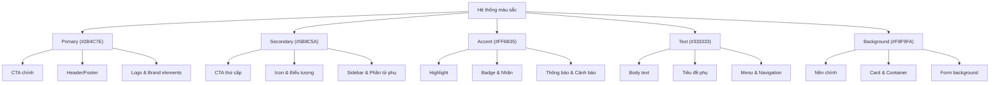
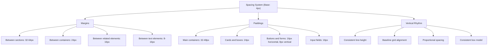
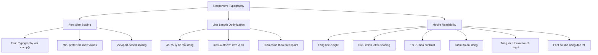

# Thiết Kế Visual & Brand Identity cho Landing Page B2B Ngành May Mặc, Giặt, Wash  

## Table of Contents  
1. Giới thiệu  
2. Bảng màu tối ưu  
3. Typography system  
4. Spacing system  
5. Typography responsive rules  
6. Triển khai với Tailwind CSS  
7. Tối ưu hóa hiệu suất  
8. Kết luận  

## 1. Giới thiệu  

Thiết kế visual identity đóng vai trò quan trọng trong việc xây dựng thương hiệu và tạo ấn tượng với khách hàng, đặc biệt trong lĩnh vực B2B như ngành may mặc, giặt và wash. Một hệ thống thiết kế tốt không chỉ tạo ra sự nhất quán về mặt thị giác mà còn truyền tải được giá trị cốt lõi của thương hiệu, đồng thời đảm bảo trải nghiệm người dùng tối ưu trên mọi thiết bị.  

Typography là nghệ thuật và kỹ thuật sắp xếp kiểu chữ để tạo ra tác động thị giác. Trong thiết kế web, typography đóng vai trò quan trọng trong việc truyền đạt thông tin một cách hiệu quả và nâng cao trải nghiệm người dùng tổng thể. Kết hợp với hệ thống màu sắc phù hợp, spacing hợp lý, chúng tạo nên nền tảng vững chắc cho visual identity của thương hiệu.  

Báo cáo này sẽ đề xuất một hệ thống thiết kế toàn diện cho landing page B2B ngành may mặc, giặt, wash, bao gồm bảng màu, typography, spacing và các quy tắc responsive, tất cả đều được tối ưu hóa để triển khai dễ dàng với Tailwind CSS.  

## 2. Bảng màu tối ưu  

Màu sắc có tác động mạnh mẽ đến cảm xúc và quyết định của người dùng. Theo nghiên cứu, 98% quyết định mua hàng chịu ảnh hưởng bởi màu sắc, và 62% đến 90% người tiêu dùng hình thành đánh giá về không gian bán lẻ dựa trên bảng màu trong 90 giây đầu tiên khi tiếp xúc. Trong ngành may mặc và giặt là B2B, việc lựa chọn màu sắc cần phản ánh sự chuyên nghiệp, đáng tin cậy và hiện đại.  

### 2.1. Năm màu chính và mã màu  

| Vai trò | Mã HEX | RGB | Mẫu |  
|---------|--------|-----|-----|  
| Primary | #2B4C7E | rgb(43, 76, 126) |  |  
| Secondary | #5B8C5A | rgb(91, 140, 90) |  |  
| Accent | #FF6B35 | rgb(255, 107, 53) |  |  
| Text | #333333 | rgb(51, 51, 51) |  |  
| Background | #F8F9FA | rgb(248, 249, 250) |  |  

### 2.2. Ý nghĩa và tâm lý của từng màu  

#### Primary Color (#2B4C7E - Navy Blue)  
Màu xanh navy được chọn làm màu chính vì nó gợi lên cảm giác tin cậy, ổn định và chuyên nghiệp. Trong ngành B2B, đặc biệt là lĩnh vực may mặc và giặt là công nghiệp, sự tin cậy là yếu tố then chốt để xây dựng mối quan hệ lâu dài với khách hàng. Màu xanh thường được liên kết với sự bình tĩnh và đáng tin cậy, làm cho nó trở thành lựa chọn phổ biến cho trang phục công sở.  

#### Secondary Color (#5B8C5A - Forest Green)  
Màu xanh lá cây đậm truyền tải thông điệp về sự bền vững, cân bằng và thân thiện với môi trường. Trong bối cảnh ngày càng nhiều doanh nghiệp quan tâm đến các giải pháp bền vững, màu này giúp thương hiệu thể hiện cam kết về trách nhiệm môi trường trong quy trình sản xuất và giặt là.  

#### Accent Color (#FF6B35 - Vibrant Orange)  
Màu cam rực rỡ được chọn làm màu nhấn vì nó tạo ra sự tương phản mạnh mẽ với màu chính và phụ, đồng thời truyền tải năng lượng, sự nhiệt tình và tương tác. Màu cam kích thích sự phấn khích và thu hút sự chú ý, làm cho nó trở thành lựa chọn lý tưởng cho các nút CTA (Call-to-Action) và các yếu tố cần nhấn mạnh.  

#### Text Color (#333333 - Dark Gray)  
Màu xám đậm được chọn cho văn bản vì nó cung cấp độ tương phản tốt với nền sáng, đảm bảo khả năng đọc tối ưu. Màu này nhẹ nhàng hơn so với màu đen thuần túy, tạo cảm giác thân thiện và dễ tiếp cận hơn, đồng thời vẫn duy trì vẻ chuyên nghiệp cần thiết cho một trang B2B.  

#### Background Color (#F8F9FA - Light Gray)  
Màu nền xám nhạt tạo ra một không gian sạch sẽ, tối giản và chuyên nghiệp. Nó cung cấp độ tương phản tốt với văn bản và các yếu tố khác, đồng thời giảm mỏi mắt khi người dùng duyệt trang trong thời gian dài.  

### 2.3. Cách sử dụng mỗi màu  

#### Primary Color (#2B4C7E)  
- Nút CTA chính (Primary buttons)  
- Header và footer  
- Các yếu tố thương hiệu chính như logo  
- Tiêu đề chính (H1, H2)  
- Biểu đồ và đồ thị chính  

#### Secondary Color (#5B8C5A)  
- Nút CTA thứ cấp (Secondary buttons)  
- Icon và biểu tượng  
- Các yếu tố phụ trợ như sidebar  
- Highlight cho các tính năng liên quan đến bền vững  
- Các phần tử tương tác thứ cấp  

#### Accent Color (#FF6B35)  
- Highlight cho thông tin quan trọng  
- Badge và nhãn  
- Thông báo và cảnh báo  
- Các yếu tố cần thu hút sự chú ý ngay lập tức  
- Các chỉ số và số liệu thống kê nổi bật  

#### Text Color (#333333)  
- Văn bản chính (body text)  
- Tiêu đề phụ  
- Nội dung form  
- Menu và navigation  
- Footer text  

#### Background Color (#F8F9FA)  
- Nền chính của trang  
- Card và container  
- Nền cho các phần form  
- Nền cho các phần testimonial  
- Nền cho các phần thông tin sản phẩm  

Việc sử dụng màu sắc một cách nhất quán giúp tạo ra một trải nghiệm thị giác hài hòa và gắn kết trên toàn bộ trang web. Tương phản là yếu tố quan trọng trong việc hướng dẫn sự chú ý của người dùng và làm nổi bật nội dung.  



## 3. Typography system  

Typography đóng vai trò quan trọng trong việc thiết lập một hệ thống thị giác rõ ràng, giúp người dùng dễ dàng tiếp cận và hiểu thông tin. Trong thiết kế web, typography không chỉ liên quan đến việc chọn font chữ mà còn bao gồm kích thước, khoảng cách, độ dày và các thuộc tính khác để tạo ra trải nghiệm đọc tối ưu.  

### 3.1. Font heading đề xuất  

#### Option 1: Inter  
Inter là một font sans-serif hiện đại, được thiết kế đặc biệt cho màn hình với khả năng đọc cao ở nhiều kích thước khác nhau. Font này có độ rõ ràng tuyệt vời và cung cấp nhiều trọng lượng khác nhau, làm cho nó trở thành lựa chọn lý tưng cho tiêu đề trong một trang B2B chuyên nghiệp.  

#### Option 2: Montserrat  
Montserrat là một font sans-serif mạnh mẽ và hiện đại với các đường nét hình học rõ ràng. Font này truyền tải sự chuyên nghiệp và hiện đại, phù hợp với ngành công nghiệp may mặc và giặt là B2B. Montserrat có nhiều trọng lượng khác nhau, cho phép linh hoạt trong việc thiết lập hệ thống phân cấp thị giác.  

#### Option 3: Roboto Condensed  
Roboto Condensed là một phiên bản thu gọn của font Roboto phổ biến, giúp tiết kiệm không gian mà vẫn duy trì khả năng đọc tuyệt vời. Font này đặc biệt hữu ích cho các tiêu đề dài hoặc khi không gian hiển thị bị giới hạn, như trên các thiết bị di động.  

### 3.2. Font body text đề xuất  

#### Option 1: Open Sans  
Open Sans là một font sans-serif đa năng với khả năng đọc tuyệt vời ở các kích thước nhỏ. Font này có vẻ ngoài trung tính và chuyên nghiệp, làm cho nó trở thành lựa chọn lý tưởng cho nội dung chính trong một trang B2B. Open Sans hoạt động tốt trên nhiều thiết bị và trình duyệt khác nhau.  

#### Option 2: Lato  
Lato là một font sans-serif cân bằng với các đường cong tinh tế, tạo ra cảm giác thân thiện nhưng vẫn chuyên nghiệp. Font này có khả năng đọc tốt ở các kích thước nhỏ và hoạt động hiệu quả cho các đoạn văn bản dài. Lato cũng có nhiều trọng lượng khác nhau, cho phép linh hoạt trong thiết kế.  

#### Option 3: Source Sans Pro  
Source Sans Pro là một font sans-serif được thiết kế bởi Adobe, với khả năng đọc tuyệt vời trên màn hình. Font này có vẻ ngoài chuyên nghiệp và hiện đại, phù hợp với một trang B2B trong ngành công nghiệp. Source Sans Pro cũng hoạt động tốt ở các kích thước nhỏ và có nhiều trọng lượng khác nhau.  

### 3.3. Size hierarchy (px/rem)  

Thiết lập một hệ thống phân cấp kích thước rõ ràng là rất quan trọng để tạo ra một cấu trúc thị giác nhất quán và dễ hiểu. Dưới đây là hệ thống kích thước được đề xuất cho các phần tử typography khác nhau:  

| Element | Mobile (px/rem) | Tablet (px/rem) | Desktop (px/rem) | Line-height | Letter-spacing | Font-weight |  
|---------|-----------------|-----------------|------------------|-------------|----------------|-------------|  
| H1 | 32px/2rem | 40px/2.5rem | 48px/3rem | 1.1 | -0.5px | 700 |  
| H2 | 28px/1.75rem | 32px/2rem | 36px/2.25rem | 1.2 | -0.25px | 600 |  
| H3 | 24px/1.5rem | 26px/1.625rem | 28px/1.75rem | 1.3 | -0.15px | 600 |  
| H4 | 20px/1.25rem | 22px/1.375rem | 24px/1.5rem | 1.4 | 0 | 500 |  
| Paragraph | 16px/1rem | 16px/1rem | 18px/1.125rem | 1.6 | 0.15px | 400 |  
| Small text | 14px/0.875rem | 14px/0.875rem | 14px/0.875rem | 1.5 | 0.25px | 400 |  

### 3.4. Line-height, letter-spacing, và font-weight recommendations  

#### Line-height (Leading)  
Line-height ảnh hưởng đáng kể đến khả năng đọc và tổng thể thẩm mỹ của văn bản. Các giá trị line-height được đề xuất trong bảng trên được tối ưu hóa cho từng loại phần tử:  

- **Tiêu đề (H1-H4)**: Line-height thấp hơn (1.1-1.4) để giữ các dòng gần nhau hơn, tạo ra một khối thị giác gắn kết.  
- **Văn bản chính (Paragraph)**: Line-height cao hơn (1.6) để cải thiện khả năng đọc cho các đoạn văn bản dài.  
- **Văn bản nhỏ (Small text)**: Line-height trung bình (1.5) để cân bằng giữa khả năng đọc và không gian.  

#### Letter-spacing (Tracking)  
Letter-spacing ảnh hưởng đến mật độ của văn bản và có thể cải thiện khả năng đọc ở các kích thước khác nhau:  

- **Tiêu đề lớn (H1-H2)**: Letter-spacing âm (-0.5px đến -0.25px) để mang các ký tự lại gần nhau hơn, tạo ra một khối thị giác chặt chẽ hơn.  
- **Tiêu đề trung bình (H3-H4)**: Letter-spacing nhỏ hơn (-0.15px đến 0px) để cân bằng giữa sự gắn kết và khả năng đọc.  
- **Văn bản chính và nhỏ**: Letter-spacing dương nhẹ (0.15px đến 0.25px) để cải thiện khả năng đọc ở các kích thước nhỏ hơn.  

#### Font-weight  
Font-weight giúp thiết lập phân cấp thị giác và nhấn mạnh các phần tử quan trọng:  

- **Tiêu đề chính (H1-H2)**: Font-weight cao (600-700) để tạo ra sự nổi bật và thu hút sự chú ý.  
- **Tiêu đề phụ (H3-H4)**: Font-weight trung bình đến cao (500-600) để duy trì phân cấp thị giác.  
- **Văn bản chính và nhỏ**: Font-weight thông thường (400) để tối ưu hóa khả năng đọc cho các đoạn văn bản dài.  

### 3.5. Fallback fonts và performance considerations  

Việc chỉ định các font dự phòng là rất quan trọng để đảm bảo trải nghiệm nhất quán trên các thiết bị và trình duyệt khác nhau, đặc biệt là khi font chính không thể tải được. Dưới đây là chuỗi font-family được đề xuất:  

```css  
/* Cho heading */  
font-family: 'Inter', 'Montserrat', 'Roboto', -apple-system, BlinkMacSystemFont, 'Segoe UI', Roboto, Oxygen, Ubuntu, Cantarell, 'Open Sans', 'Helvetica Neue', sans-serif;  

/* Cho body text */  
font-family: 'Open Sans', 'Lato', 'Source Sans Pro', -apple-system, BlinkMacSystemFont, 'Segoe UI', Roboto, Oxygen, Ubuntu, Cantarell, 'Helvetica Neue', sans-serif;  
```  

Để tối ưu hóa hiệu suất, hãy xem xét các chiến lược sau:  

1. **Sử dụng Google Fonts với subset phù hợp**: Chỉ tải các ký tự cần thiết cho ngôn ngữ của bạn để giảm kích thước tệp.  
2. **Preload các font quan trọng**: Sử dụng thẻ `<link rel="preload">` để ưu tiên tải các font quan trọng.  
3. **Sử dụng font-display: swap**: Điều này cho phép văn bản hiển thị với font dự phòng trong khi font tùy chỉnh đang tải.  
4. **Cân nhắc self-hosting**: Đối với các trang web có yêu cầu hiệu suất cao, việc tự lưu trữ font có thể cải thiện thời gian tải.  
5. **Giới hạn số lượng font và trọng lượng**: Sử dụng không quá 2-3 font và chỉ tải các trọng lượng cần thiết.  

## 4. Spacing system  

Spacing là về việc tạo ra khoảng trống một cách chiến lược giữa các phần tử trong thiết kế. Một hệ thống spacing tốt giúp tạo ra sự cân bằng thị giác, cải thiện khả năng đọc và hướng dẫn người dùng qua giao diện một cách trực quan.  

### 4.1. Base spacing unit  

Hệ thống spacing của chúng ta sẽ dựa trên đơn vị cơ sở 4px, phù hợp với hệ thống 4-point grid được đề xuất trong thiết kế UI hiện đại. Đơn vị này cung cấp sự linh hoạt và chính xác, đồng thời tương thích tốt với Tailwind CSS, vốn cũng sử dụng hệ thống spacing dựa trên bội số của 4px.  

```  
1 unit = 4px = 0.25rem  
```  

### 4.2. Spacing scale  

Dựa trên đơn vị cơ sở 4px, chúng ta sẽ xây dựng một hệ thống spacing với các giá trị là bội số của đơn vị cơ sở. Điều này tạo ra một hệ thống nhất quán và dễ dàng áp dụng trên toàn bộ thiết kế.  

| Tên | Giá trị (px) | Giá trị (rem) | Mô tả |  
|-----|-------------|--------------|-------|  
| 2xs | 4px | 0.25rem | Khoảng cách tối thiểu, sử dụng cho các phần tử nhỏ |  
| xs | 8px | 0.5rem | Khoảng cách nhỏ, sử dụng cho padding nội bộ, khoảng cách giữa các icon |  
| sm | 16px | 1rem | Khoảng cách nhỏ vừa, sử dụng cho padding button, khoảng cách giữa các phần tử liên quan |  
| md | 24px | 1.5rem | Khoảng cách trung bình, sử dụng cho padding section, khoảng cách giữa các nhóm phần tử |  
| lg | 32px | 2rem | Khoảng cách lớn, sử dụng cho margin section, khoảng cách giữa các khối nội dung |  
| xl | 48px | 3rem | Khoảng cách rất lớn, sử dụng cho padding section đầy đủ, khoảng cách giữa các section lớn |  
| 2xl | 64px | 4rem | Khoảng cách cực lớn, sử dụng cho khoảng cách giữa các section chính |  
| 3xl | 96px | 6rem | Khoảng cách đặc biệt lớn, sử dụng cho khoảng cách giữa các phần chính của trang |  

### 4.3. Margins và paddings recommendations  

Việc áp dụng margins và paddings một cách nhất quán là rất quan trọng để tạo ra một giao diện cân bằng và dễ đọc. Dưới đây là một số khuyến nghị cho việc sử dụng margins và paddings:  

#### Margins  
- **Giữa các section**: lg (32px) đến 2xl (64px)  
- **Giữa các card hoặc container**: md (24px)  
- **Giữa các phần tử liên quan**: sm (16px)  
- **Giữa các phần tử text (paragraph, heading)**: xs (8px) đến sm (16px)  

#### Paddings  
- **Container chính**: lg (32px) đến xl (48px)  
- **Card và box**: md (24px)  
- **Button và form element**: sm (16px) theo chiều ngang, xs (8px) theo chiều dọc  
- **Input field**: sm (16px)  

### 4.4. Vertical rhythm guidelines  

Vertical rhythm là sự nhất quán trong khoảng cách dọc giữa các phần tử, tạo ra một cảm giác cân bằng và dễ đọc. Để duy trì vertical rhythm tốt, hãy tuân theo các nguyên tắc sau:  

1. **Sử dụng line-height nhất quán**: Như đã đề cập trong phần typography, sử dụng line-height 1.6 cho body text để tạo ra khoảng cách dọc tốt.  

2. **Áp dụng margins dựa trên baseline grid**: Sử dụng margins là bội số của đơn vị cơ sở (4px) để duy trì nhịp điệu dọc nhất quán.  

3. **Nhất quán trong khoảng cách giữa các phần tử**: Sử dụng cùng một khoảng cách cho các phần tử tương tự trên toàn bộ trang.  

4. **Tỷ lệ khoảng cách**: Khoảng cách giữa các phần tử liên quan nên nhỏ hơn khoảng cách giữa các nhóm phần tử không liên quan.  

5. **Sử dụng box model nhất quán**: Hiểu rõ box model trong CSS để quản lý khoảng cách một cách hiệu quả:  
   - Content: Nơi phần tử sống (ví dụ: hình ảnh, nút, đoạn văn bản)  
   - Padding: Khu vực xung quanh nội dung trước border  
   - Border: Đường viền bao quanh nội dung  
   - Margin: Khoảng trống bên ngoài border  



## 5. Typography responsive rules  

Responsive typography là việc điều chỉnh các thuộc tính typography để đảm bảo khả năng đọc và thẩm mỹ tối ưu trên các thiết bị và kích thước màn hình khác nhau. Trong thời đại kỹ thuật số hiện nay, nơi người dùng truy cập trang web trên nhiều thiết bị khác nhau, responsive typography là yếu tố quan trọng để đảm bảo trải nghiệm người dùng nhất quán.  

### 5.1. Font size scaling từ mobile đến desktop  

Có nhiều phương pháp để thực hiện font size scaling, nhưng một trong những phương pháp hiệu quả nhất là sử dụng hàm `clamp()` của CSS để tạo ra typography linh hoạt. Hàm này cho phép bạn xác định giá trị tối thiểu, giá trị ưu tiên và giá trị tối đa, giúp font size tự động điều chỉnh dựa trên kích thước viewport.  

```css  
/* Ví dụ về fluid typography với clamp() */  
h1 {  
  font-size: clamp(2rem, 5vw + 1rem, 3rem);  
}  
h2 {  
  font-size: clamp(1.75rem, 4vw + 0.75rem, 2.25rem);  
}  
h3 {  
  font-size: clamp(1.5rem, 3vw + 0.5rem, 1.75rem);  
}  
h4 {  
  font-size: clamp(1.25rem, 2vw + 0.5rem, 1.5rem);  
}  
p {  
  font-size: clamp(1rem, 1vw + 0.5rem, 1.125rem);  
}  
small {  
  font-size: clamp(0.875rem, 0.5vw + 0.5rem, 0.875rem);  
}  
```  

Trong các ví dụ trên:  
- Giá trị đầu tiên là kích thước tối thiểu (thường áp dụng cho mobile)  
- Giá trị thứ hai là giá trị ưu tiên, sử dụng đơn vị viewport (vw) để tạo ra scaling linh hoạt  
- Giá trị thứ ba là kích thước tối đa (thường áp dụng cho desktop)  

### 5.2. Line-length optimization  

Độ dài dòng tối ưu là rất quan trọng để đảm bảo khả năng đọc tốt. Theo các nghiên cứu, độ dài dòng lý tưởng nằm trong khoảng 45-75 ký tự hoặc 10-15 từ mỗi dòng. Để đạt được điều này trên các thiết bị khác nhau, chúng ta có thể sử dụng các chiến lược sau:  

#### Sử dụng max-width  
```css  
/* Sử dụng đơn vị ch để giới hạn độ dài dòng */  
p, ul, ol {  
  max-width: 70ch; /* khoảng 70 ký tự */  
  margin-left: auto;  
  margin-right: auto;  
}  
```  

#### Điều chỉnh max-width theo breakpoint  
```css  
/* Mobile first approach */  
.content {  
  max-width: 100%;  
  padding: 0 1rem;  
}  

/* Tablet */  
@media (min-width: 640px) {  
  .content {  
    max-width: 90%;  
    padding: 0 2rem;  
  }  
}  

/* Desktop */  
@media (min-width: 1024px) {  
  .content {  
    max-width: 70ch;  
    padding: 0;  
  }  
}  
```  

### 5.3. Readability considerations cho mobile  

Khả năng đọc trên thiết bị di động đặt ra những thách thức riêng do kích thước màn hình nhỏ hơn và điều kiện xem khác nhau. Dưới đây là một số cân nhắc để cải thiện khả năng đọc trên mobile:  

1. **Tăng line-height**: Sử dụng line-height lớn hơn một chút trên mobile để cải thiện khả năng đọc.  
   ```css  
   @media (max-width: 640px) {  
     p, ul, ol {  
       line-height: 1.7; /* Tăng từ 1.6 trên desktop */  
     }  
   }  
   ```  

2. **Điều chỉnh letter-spacing**: Tăng nhẹ letter-spacing trên mobile để cải thiện khả năng đọc với font size nhỏ hơn.  
   ```css  
   @media (max-width: 640px) {  
     p, ul, ol {  
       letter-spacing: 0.01em;  
     }  
   }  
   ```  

3. **Tối ưu hóa contrast**: Đảm bảo độ tương phản đủ giữa text và background, đặc biệt quan trọng trên mobile khi người dùng có thể xem trong điều kiện ánh sáng khác nhau.  

4. **Giảm độ dài dòng**: Giới hạn độ dài dòng xuống khoảng 45-60 ký tự trên mobile để cải thiện khả năng đọc.  

5. **Tăng kích thước touch target**: Đảm bảo các phần tử có thể nhấp (như button, link) có kích thước tối thiểu 44x44px để dễ dàng tương tác trên thiết bị cảm ứng.  

6. **Sử dụng font có khả năng đọc tốt ở kích thước nhỏ**: Chọn các font có x-height cao và hình dạng ký tự rõ ràng để cải thiện khả năng đọc ở kích thước nhỏ.  



## 6. Triển khai với Tailwind CSS  

Tailwind CSS là một framework CSS utility-first, cho phép bạn xây dựng thiết kế phức tạp bằng cách sử dụng các lớp tiện ích được xác định trước. Nó cung cấp một cách tiếp cận linh hoạt và hiệu quả để triển khai hệ thống thiết kế của bạn.  

### 6.1. Cấu hình tailwind.config.js  

Để triển khai hệ thống thiết kế của chúng ta với Tailwind CSS, chúng ta cần tùy chỉnh file `tailwind.config.js` để bao gồm các màu sắc, typography và spacing đã định nghĩa:  

```javascript  
// tailwind.config.js  
module.exports = {  
  theme: {  
    extend: {  
      colors: {  
        primary: {  
          DEFAULT: '#2B4C7E',  
          light: '#3A65A4',  
          dark: '#1F3859',  
        },  
        secondary: {  
          DEFAULT: '#5B8C5A',  
          light: '#7AAD79',  
          dark: '#426642',  
        },  
        accent: {  
          DEFAULT: '#FF6B35',  
          light: '#FF8F66',  
          dark: '#E54E18',  
        },  
        text: {  
          DEFAULT: '#333333',  
          light: '#666666',  
          lighter: '#999999',  
        },  
        background: {  
          DEFAULT: '#F8F9FA',  
          dark: '#E9ECEF',  
          light: '#FFFFFF',  
        },  
      },  
      fontFamily: {  
        heading: ['Inter', 'Montserrat', 'Roboto', 'sans-serif'],  
        body: ['Open Sans', 'Lato', 'Source Sans Pro', 'sans-serif'],  
      },  
      fontSize: {  
        // Fluid typography với clamp()  
        'fluid-h1': 'clamp(2rem, 5vw + 1rem, 3rem)',  
        'fluid-h2': 'clamp(1.75rem, 4vw + 0.75rem, 2.25rem)',  
        'fluid-h3': 'clamp(1.5rem, 3vw + 0.5rem, 1.75rem)',  
        'fluid-h4': 'clamp(1.25rem, 2vw + 0.5rem, 1.5rem)',  
        'fluid-p': 'clamp(1rem, 1vw + 0.5rem, 1.125rem)',  
        'fluid-small': 'clamp(0.875rem, 0.5vw + 0.5rem, 0.875rem)',  
      },  
      spacing: {  
        '2xs': '0.25rem', // 4px  
        'xs': '0.5rem',   // 8px  
        'sm': '1rem',     // 16px  
        'md': '1.5rem',   // 24px  
        'lg': '2rem',     // 32px  
        'xl': '3rem',     // 48px  
        '2xl': '4rem',    // 64px  
        '3xl': '6rem',    // 96px  
      },  
      lineHeight: {  
        'tight': '1.1',  
        'snug': '1.2',  
        'normal': '1.3',  
        'relaxed': '1.4',  
        'loose': '1.6',  
      },  
      letterSpacing: {  
        'tighter': '-0.5px',  
        'tight': '-0.25px',  
        'normal': '0',  
        'wide': '0.15px',  
        'wider': '0.25px',  
      },  
      maxWidth: {  
        'prose': '70ch',  
      },  
    },  
  },  
  variants: {  
    extend: {},  
  },  
  plugins: [],  
}  
```  

### 6.2. Ví dụ triển khai với Tailwind CSS  

Dưới đây là một số ví dụ về cách triển khai hệ thống thiết kế của chúng ta bằng Tailwind CSS:  

#### Header với Navigation  
```html  
<header class="bg-primary text-background-light py-md px-lg md:px-xl">  
  <div class="max-w-7xl mx-auto flex justify-between items-center">  
    <div class="font-heading font-bold text-fluid-h3">Brand Logo</div>  
    <nav class="hidden md:flex space-x-md">  
      <a href="#" class="hover:text-accent transition-colors">Trang chủ</a>  
      <a href="#" class="hover:text-accent transition-colors">Dịch vụ</a>  
      <a href="#" class="hover:text-accent transition-colors">Về chúng tôi</a>  
      <a href="#" class="hover:text-accent transition-colors">Liên hệ</a>  
    </nav>  
    <button class="md:hidden text-2xl">☰</button>  
  </div>  
</header>  
```  

#### Hero Section  
```html  
<section class="bg-background py-xl md:py-2xl">  
  <div class="max-w-7xl mx-auto px-lg">  
    <div class="text-center mb-lg">  
      <h1 class="font-heading font-bold text-fluid-h1 text-primary mb-sm leading-tight">  
        Giải pháp May mặc & Giặt là Công nghiệp Hàng đầu  
      </h1>  
      <p class="font-body text-fluid-p text-text-light max-w-prose mx-auto leading-loose">  
        Chúng tôi cung cấp các giải pháp toàn diện cho ngành may mặc và giặt là công nghiệp, giúp doanh nghiệp của bạn tối ưu hóa quy trình sản xuất và nâng cao chất lượng sản phẩm.  
      </p>  
    </div>  
    <div class="flex flex-col md:flex-row justify-center items-center gap-md">  
      <a href="#" class="bg-primary hover:bg-primary-dark text-background-light font-medium py-xs px-md rounded-md transition-colors">  
        Tìm hiểu thêm  
      </a>  
      <a href="#" class="bg-background-light hover:bg-background-dark text-primary border border-primary font-medium py-xs px-md rounded-md transition-colors">  
        Liên hệ ngay  
      </a>  
    </div>  
  </div>  
</section>  
```  

#### Feature Cards  
```html  
<section class="py-xl bg-background-light">  
  <div class="max-w-7xl mx-auto px-lg">  
    <h2 class="font-heading font-semibold text-fluid-h2 text-primary text-center mb-lg leading-snug">  
      Dịch vụ của chúng tôi  
    </h2>  
    <div class="grid grid-cols-1 md:grid-cols-2 lg:grid-cols-3 gap-lg">  
      <!-- Card 1 -->  
      <div class="bg-background rounded-lg shadow-md p-md hover:shadow-lg transition-shadow">  
        <div class="text-accent text-3xl mb-sm">  
          <svg xmlns="http://www.w3.org/2000/svg" class="h-12 w-12" fill="none" viewBox="0 0 24 24" stroke="currentColor">  
            <path stroke-linecap="round" stroke-linejoin="round" stroke-width="2" d="M13 10V3L4 14h7v7l9-11h-7z" />  
          </svg>  
        </div>  
        <h3 class="font-heading font-semibold text-fluid-h3 text-primary mb-xs leading-normal">  
          Giặt là Công nghiệp  
        </h3>  
        <p class="font-body text-fluid-p text-text leading-loose">  
          Dịch vụ giặt là công nghiệp với công nghệ tiên tiến, đảm bảo chất lượng và tiết kiệm chi phí.  
        </p>  
      </div>  
      
      <!-- Card 2 -->  
      <div class="bg-background rounded-lg shadow-md p-md hover:shadow-lg transition-shadow">  
        <div class="text-secondary text-3xl mb-sm">  
          <svg xmlns="http://www.w3.org/2000/svg" class="h-12 w-12" fill="none" viewBox="0 0 24 24" stroke="currentColor">  
            <path stroke-linecap="round" stroke-linejoin="round" stroke-width="2" d="M9 5H7a2 2 0 00-2 2v12a2 2 0 002 2h10a2 2 0 002-2V7a2 2 0 00-2-2h-2M9 5a2 2 0 002 2h2a2 2 0 002-2M9 5a2 2 0 012-2h2a2 2 0 012 2" />  
          </svg>  
        </div>  
        <h3 class="font-heading font-semibold text-fluid-h3 text-primary mb-xs leading-normal">  
          Sản xuất May mặc  
        </h3>  
        <p class="font-body text-fluid-p text-text leading-loose">  
          Dịch vụ sản xuất may mặc chuyên nghiệp với quy trình chuẩn quốc tế và đội ngũ nhân viên lành nghề.  
        </p>  
      </div>  
      
      <!-- Card 3 -->  
      <div class="bg-background rounded-lg shadow-md p-md hover:shadow-lg transition-shadow">  
        <div class="text-primary text-3xl mb-sm">  
          <svg xmlns="http://www.w3.org/2000/svg" class="h-12 w-12" fill="none" viewBox="0 0 24 24" stroke="currentColor">  
            <path stroke-linecap="round" stroke-linejoin="round" stroke-width="2" d="M9 12l2 2 4-4m5.618-4.016A11.955 11.955 0 0112 2.944a11.955 11.955 0 01-8.618 3.04A12.02 12.02 0 003 9c0 5.591 3.824 10.29 9 11.622 5.176-1.332 9-6.03 9-11.622 0-1.042-.133-2.052-.382-3.016z" />  
          </svg>  
        </div>  
        <h3 class="font-heading font-semibold text-fluid-h3 text-primary mb-xs leading-normal">  
          Tư vấn & Đào tạo  
        </h3>  
        <p class="font-body text-fluid-p text-text leading-loose">  
          Dịch vụ tư vấn và đào tạo chuyên sâu về quy trình sản xuất may mặc và giặt là công nghiệp.  
        </p>  
      </div>  
    </div>  
  </div>  
</section>  
```  

#### Contact Form  
```html  
<section class="py-xl bg-background">  
  <div class="max-w-3xl mx-auto px-lg">  
    <h2 class="font-heading font-semibold text-fluid-h2 text-primary text-center mb-lg leading-snug">  
      Liên hệ với chúng tôi  
    </h2>  
    <form class="bg-background-light rounded-lg shadow-md p-lg">  
      <div class="grid grid-cols-1 md:grid-cols-2 gap-md mb-md">  
        <div>  
          <label for="name" class="block font-body text-text font-medium mb-xs">Họ và tên</label>  
          <input type="text" id="name" class="w-full px-sm py-xs border border-text-lighter rounded-md focus:outline-none focus:ring-2 focus:ring-primary">  
        </div>  
        <div>  
          <label for="email" class="block font-body text-text font-medium mb-xs">Email</label>  
          <input type="email" id="email" class="w-full px-sm py-xs border border-text-lighter rounded-md focus:outline-none focus:ring-2 focus:ring-primary">  
        </div>  
      </div>  
      <div class="mb-md">  
        <label for="subject" class="block font-body text-text font-medium mb-xs">Tiêu đề</label>  
        <input type="text" id="subject" class="w-full px-sm py-xs border border-text-lighter rounded-md focus:outline-none focus:ring-2 focus:ring-primary">  
      </div>  
      <div class="mb-lg">  
        <label for="message" class="block font-body text-text font-medium mb-xs">Nội dung</label>  
        <textarea id="message" rows="5" class="w-full px-sm py-xs border border-text-lighter rounded-md focus:outline-none focus:ring-2 focus:ring-primary"></textarea>  
      </div>  
      <button type="submit" class="bg-primary hover:bg-primary-dark text-background-light font-medium py-xs px-md rounded-md transition-colors">  
        Gửi tin nhắn  
      </button>  
    </form>  
  </div>  
</section>  
```  

#### Footer  
```html  
<footer class="bg-primary text-background-light py-lg">  
  <div class="max-w-7xl mx-auto px-lg">  
    <div class="grid grid-cols-1 md:grid-cols-3 gap-lg">  
      <div>  
        <h3 class="font-heading font-semibold text-xl mb-md">Brand Name</h3>  
        <p class="font-body leading-loose">  
          Chúng tôi cung cấp các giải pháp toàn diện cho ngành may mặc và giặt là công nghiệp.  
        </p>  
      </div>  
      <div>  
        <h3 class="font-heading font-semibold text-xl mb-md">Liên kết nhanh</h3>  
        <ul class="font-body space-y-xs">  
          <li><a href="#" class="hover:text-accent transition-colors">Trang chủ</a></li>  
          <li><a href="#" class="hover:text-accent transition-colors">Dịch vụ</a></li>  
          <li><a href="#" class="hover:text-accent transition-colors">Về chúng tôi</a></li>  
          <li><a href="#" class="hover:text-accent transition-colors">Liên hệ</a></li>  
        </ul>  
      </div>  
      <div>  
        <h3 class="font-heading font-semibold text-xl mb-md">Thông tin liên hệ</h3>  
        <ul class="font-body space-y-xs">  
          <li>123 Đường ABC, Quận XYZ, TP. HCM</li>  
          <li>info@example.com</li>  
          <li>+84 123 456 789</li>  
        </ul>  
      </div>  
    </div>  
    <div class="border-t border-background-light/20 mt-lg pt-md text-center font-body text-sm">  
      &copy; 2023 Brand Name. Tất cả quyền được bảo lưu.  
    </div>  
  </div>  
</footer>  
```  

### 6.3. Sử dụng @apply cho các component phức tạp  

Mặc dù Tailwind CSS khuyến khích sử dụng các utility class trực tiếp trong HTML, nhưng đôi khi việc sử dụng directive `@apply` có thể hữu ích cho các component phức tạp hoặc được sử dụng lặp lại nhiều lần. Tuy nhiên, cần lưu ý rằng việc sử dụng `@apply` quá nhiều có thể làm mất đi lợi ích của phương pháp utility-first.  

```css  
/* Ví dụ sử dụng @apply cho button styles */  
@layer components {  
  .btn-primary {  
    @apply bg-primary text-background-light font-medium py-xs px-md rounded-md transition-colors;  
  }  
  
  .btn-primary:hover {  
    @apply bg-primary-dark;  
  }  
  
  .btn-secondary {  
    @apply bg-background-light text-primary border border-primary font-medium py-xs px-md rounded-md transition-colors;  
  }  
  
  .btn-secondary:hover {  
    @apply bg-background-dark;  
  }  
}  
```  

## 7. Tối ưu hóa hiệu suất  

Hiệu suất là một khía cạnh quan trọng của thiết kế web hiện đại. Dưới đây là một số chiến lược để tối ưu hóa hiệu suất của hệ thống thiết kế của chúng ta:  

### 7.1. Tối ưu hóa font  

1. **Sử dụng font-display: swap**: Điều này cho phép văn bản hiển thị với font dự phòng trong khi font tùy chỉnh đang tải, cải thiện trải nghiệm người dùng.  
   ```css  
   @font-face {  
     font-family: 'Inter';  
     src: url('/fonts/Inter.woff2') format('woff2');  
     font-weight: 400;  
     font-style: normal;  
     font-display: swap;  
   }  
   ```  

2. **Preload các font quan trọng**: Sử dụng thẻ `<link rel="preload">` để ưu tiên tải các font quan trọng.  
   ```html  
   <link rel="preload" href="/fonts/Inter.woff2" as="font" type="font/woff2" crossorigin>  
   ```  

3. **Sử dụng subset font**: Chỉ tải các ký tự cần thiết cho ngôn ngữ của bạn để giảm kích thước tệp.  
   ```html  
   <link href="https://fonts.googleapis.com/css2?family=Inter:wght@400;600;700&display=swap&subset=vietnamese" rel="stylesheet">  
   ```  

### 7.2. Tối ưu hóa Tailwind CSS  

1. **Sử dụng Just-In-Time (JIT) mode**: JIT mode của Tailwind CSS chỉ tạo ra các style cần thiết, tránh bloat không cần thiết.  
   ```javascript  
   // tailwind.config.js  
   module.exports = {  
     mode: 'jit',  
     // ...  
   }  
   ```  

2. **Purge unused CSS**: Đảm bảo cấu hình purge đúng để loại bỏ các class không sử dụng trong production build.  
   ```javascript  
   // tailwind.config.js  
   module.exports = {  
     purge: [  
       './pages/**/*.{js,ts,jsx,tsx}',  
       './components/**/*.{js,ts,jsx,tsx}'  
     ],  
     // ...  
   }  
   ```  

3. **Tối ưu hóa responsive design**: Sử dụng các breakpoint một cách chiến lược và tránh quá nhiều variant không cần thiết.  

### 7.3. Tối ưu hóa responsive images  

1. **Sử dụng thuộc tính srcset và sizes**: Điều này cho phép trình duyệt chọn hình ảnh phù hợp nhất dựa trên kích thước màn hình và độ phân giải.  
   ```html  
     
   ```  

2. **Lazy loading**: Sử dụng thuộc tính `loading="lazy"` để chỉ tải hình ảnh khi chúng gần đến viewport.  
   ```html  
     
   ```  

3. **Sử dụng định dạng hình ảnh hiện đại**: Định dạng như WebP cung cấp nén tốt hơn mà không làm giảm chất lượng hình ảnh.  

## 8. Kết luận  

Trong báo cáo này, chúng tôi đã đề xuất một hệ thống thiết kế visual identity toàn diện cho landing page B2B ngành may mặc, giặt, wash. Hệ thống này bao gồm:  

1. **Bảng màu tối ưu**: Một bộ 5 màu chính (primary, secondary, accent, text, background) được chọn lựa cẩn thận để truyền tải sự chuyên nghiệp, đáng tin cậy và hiện đại, phù hợp với ngành công nghiệp B2B.  

2. **Typography system**: Các font heading và body text được đề xuất với hệ thống phân cấp kích thước rõ ràng, line-height, letter-spacing và font-weight được tối ưu hóa cho khả năng đọc và thẩm mỹ.  

3. **Spacing system**: Một hệ thống spacing nhất quán dựa trên đơn vị cơ sở 4px, với các khuyến nghị cụ thể cho margins, paddings và vertical rhythm.  

4. **Typography responsive rules**: Các quy tắc để đảm bảo typography hiển thị tốt trên mọi thiết bị, bao gồm font size scaling, line-length optimization và các cân nhắc về khả năng đọc trên mobile.  

5. **Triển khai với Tailwind CSS**: Hướng dẫn cụ thể về cách cấu hình và triển khai hệ thống thiết kế bằng Tailwind CSS, bao gồm các ví dụ code cho các component phổ biến.  

6. **Tối ưu hóa hiệu suất**: Các chiến lược để đảm bảo hiệu suất tốt, bao gồm tối ưu hóa font, Tailwind CSS và responsive images.  

Hệ thống thiết kế này được xây dựng dựa trên các nguyên tắc thiết kế hiện đại và các thực tiễn tốt nhất trong ngành, đồng thời được tối ưu hóa để triển khai dễ dàng với Tailwind CSS. Nó cung cấp một nền tảng vững chắc để xây dựng một landing page B2B chuyên nghiệp, nhất quán và hiệu quả cho ngành may mặc, giặt, wash.  

Bằng cách tuân theo các hướng dẫn và khuyến nghị trong báo cáo này, bạn có thể tạo ra một trải nghiệm người dùng hấp dẫn và hiệu quả, đồng thời truyền tải giá trị thương hiệu của bạn một cách rõ ràng và nhất quán.