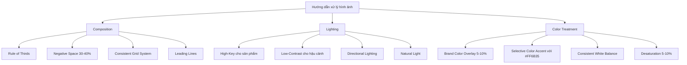
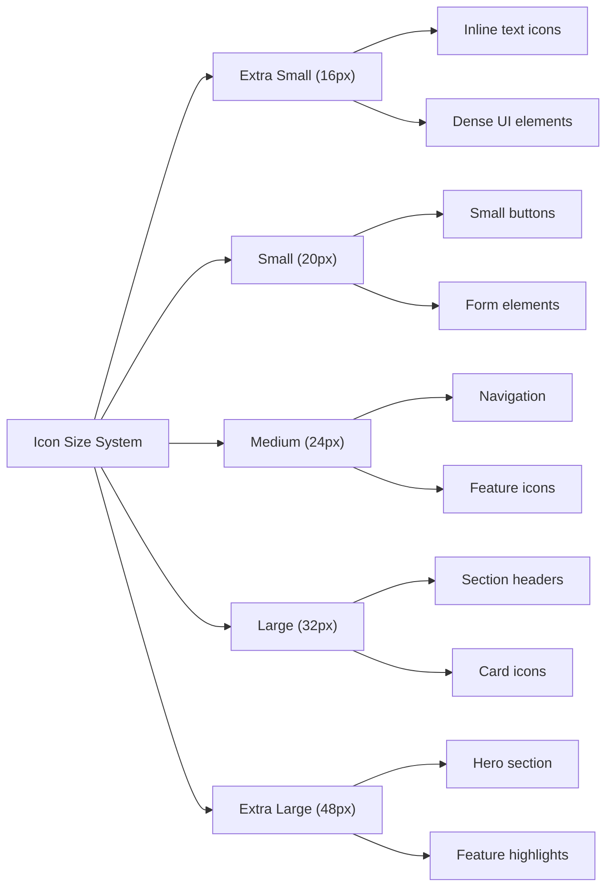

# Ngôn Ngữ Hình Ảnh và Brand Elements cho Landing Page B2B Ngành May Mặc  

## Table of Contents  
1. Giới thiệu  
2. Ngôn ngữ hình ảnh  
3. Icon system  
4. Illustration & graphics  
5. UI elements styling  
6. Triển khai với NextJS và Tailwind CSS  
7. Tối ưu hóa hiệu suất  
8. Kết luận  

## 1. Giới thiệu  

Trong thế giới B2B ngành may mặc, giặt và wash, ngôn ngữ hình ảnh và brand elements đóng vai trò quan trọng trong việc truyền tải thông điệp thương hiệu, xây dựng niềm tin và tạo ấn tượng chuyên nghiệp với khách hàng tiềm năng. Dựa trên bảng màu và typography đã đề xuất trước đó, chúng tôi sẽ phát triển một hệ thống visual toàn diện, bao gồm phong cách hình ảnh, icon system, illustrations và UI elements, tất cả đều được tối ưu hóa để triển khai dễ dàng với NextJS và Tailwind CSS.  

Bảng màu đã được đề xuất bao gồm:  
- Primary: #2B4C7E (Navy Blue) - Truyền tải sự tin cậy, ổn định và chuyên nghiệp  
- Secondary: #5B8C5A (Forest Green) - Thể hiện sự bền vững, cân bằng và thân thiện với môi trường  
- Accent: #FF6B35 (Vibrant Orange) - Tạo sự tương phản, truyền tải năng lượng và thu hút sự chú ý  
- Text: #333333 (Dark Gray) - Đảm bảo khả năng đọc tối ưu  
- Background: #F8F9FA (Light Gray) - Tạo không gian sạch sẽ và chuyên nghiệp  

Typography system bao gồm các font như Inter, Montserrat hoặc Roboto cho headings và Open Sans, Lato hoặc Source Sans Pro cho body text, với hệ thống phân cấp kích thước rõ ràng.  

Dựa trên nền tảng này, chúng tôi sẽ xây dựng một visual system nhất quán, chuyên nghiệp và phù hợp với đặc thù của ngành may mặc B2B, đồng thời đảm bảo khả năng triển khai hiệu quả với các công nghệ hiện đại.  

## 2. Ngôn ngữ hình ảnh  

Ngôn ngữ hình ảnh là yếu tố quan trọng trong việc xây dựng thương hiệu và tạo ấn tượng với khách hàng. Trong lĩnh vực B2B ngành may mặc, giặt và wash, hình ảnh cần phản ánh sự chuyên nghiệp, độ tin cậy và chuyên môn kỹ thuật.  

### 2.1. Phong cách hình ảnh đề xuất  

Dựa trên phân tích về ngành công nghiệp và đối tượng mục tiêu, chúng tôi đề xuất kết hợp ba phong cách hình ảnh chính:  

#### Industrial Authentic  
Phong cách này tập trung vào việc thể hiện quy trình sản xuất và thiết bị công nghiệp một cách chân thực, không qua chỉnh sửa quá nhiều. Điều này giúp xây dựng niềm tin với khách hàng B2B bằng cách cho họ thấy cơ sở vật chất và năng lực sản xuất thực tế của doanh nghiệp.  

#### Technical Precision  
Phong cách này sử dụng các góc chụp cận cảnh (close-up) để thể hiện chi tiết về vải, đường may, chất liệu và các yếu tố kỹ thuật khác. Điều này đặc biệt quan trọng trong ngành may mặc, nơi chất lượng sản phẩm thường được đánh giá qua các chi tiết nhỏ.  

#### Sustainable Minimalism  
Phản ánh xu hướng ngày càng tăng về tính bền vững trong ngành may mặc, phong cách này tập trung vào hình ảnh nguyên liệu tự nhiên, quy trình sản xuất thân thiện với môi trường và thiết kế tối giản. Điều này giúp thương hiệu kết nối với các khách hàng B2B ngày càng quan tâm đến các giải pháp bền vững.  

Theo nghiên cứu, 62% đến 90% người tiêu dùng hình thành đánh giá về không gian bán lẻ dựa trên bảng màu trong 90 giây đầu tiên khi tiếp xúc. Điều này cho thấy tầm quan trọng của việc lựa chọn phong cách hình ảnh phù hợp để tạo ấn tượng ban đầu tốt.  

### 2.2. Các loại hình ảnh cụ thể cần có trên landing page  

Để tạo ra một landing page B2B hiệu quả cho ngành may mặc, giặt và wash, chúng tôi đề xuất 7 loại hình ảnh cụ thể sau:  

| Loại hình ảnh | Mục đích | Ví dụ | Phong cách |  
|---------------|----------|-------|------------|  
| 1. Fabric Texture Shots | Thể hiện chất lượng vật liệu | Ảnh macro vải cotton organic 400TC | Technical Precision |  
| 2. Production Process | Minh họa năng lực sản xuất | Dây chuyền giặt công nghiệp tự động | Industrial Authentic |  
| 3. Technical Diagrams | Giải thích quy trình phức tạp | Infographic quy trình xử lý vải chống nhăn | Technical Precision |  
| 4. Team Expertise | Xây dựng trust với đội ngũ | Ảnh nhóm kỹ sư đang kiểm tra chất lượng | Industrial Authentic |  
| 5. Sustainable Practices | Thể hiện cam kết ESG | Hình ảnh nguyên liệu tái chế/năng lượng mặt trời | Sustainable Minimalism |  
| 6. B2B Interaction | Phản ánh môi trường làm việc | Ảnh meeting với đối tác quốc tế | Industrial Authentic |  
| 7. Certifications & Quality Control | Tăng độ tin cậy | Hiển thị chứng nhận Oeko-Tex, GRS | Technical Precision |  

Các loại hình ảnh này không chỉ giúp thể hiện năng lực và chất lượng sản phẩm/dịch vụ mà còn xây dựng niềm tin với khách hàng B2B tiềm năng. Theo các nghiên cứu về thiết kế landing page, hình ảnh chất lượng cao có thể tăng tỷ lệ chuyển đổi lên đến 40%.  

### 2.3. Hướng dẫn về composition, lighting, và color treatment  

#### Composition (Bố cục)  
- **Rule of Thirds**: Áp dụng quy tắc 1/3 để tạo bố cục động và hấp dẫn. Đặt các yếu tố quan trọng tại các điểm giao nhau của lưới 3x3.  
- **Negative Space**: Sử dụng 30-40% không gian trống để tạo sự cân bằng và tập trung vào chủ thể chính.  
- **Consistent Grid System**: Duy trì hệ thống lưới nhất quán trên tất cả các hình ảnh để tạo cảm giác thống nhất.  
- **Leading Lines**: Sử dụng đường dẫn để hướng ánh nhìn của người xem đến các yếu tố quan trọng trong hình ảnh.  

#### Lighting (Ánh sáng)  
- **High-Key Lighting**: Sử dụng ánh sáng mạnh, đồng đều cho sản phẩm và vật liệu để thể hiện chi tiết và chất lượng.  
- **Low-Contrast Background**: Giữ hậu cảnh có độ tương phản thấp để tập trung vào chủ thể chính.  
- **Directional Lighting**: Sử dụng ánh sáng có hướng để tạo chiều sâu và làm nổi bật kết cấu vải.  
- **Natural Light**: Ưu tiên ánh sáng tự nhiên cho hình ảnh về tính bền vững và môi trường làm việc.  

#### Color Treatment (Xử lý màu sắc)  
- **Brand Color Overlay**: Áp dụng overlay màu Secondary với độ đậm 5-10% để tạo sự nhất quán với bảng màu thương hiệu.  
- **Selective Color Accent**: Sử dụng màu Accent (#FF6B35) một cách có chọn lọc để làm nổi bật các yếu tố quan trọng.  
- **Consistent White Balance**: Duy trì cân bằng trắng nhất quán trên tất cả các hình ảnh để tạo cảm giác chuyên nghiệp.  
- **Desaturation**: Giảm nhẹ độ bão hòa (5-10%) để tạo vẻ ngoài tinh tế và chuyên nghiệp.  



### 2.4. Tỷ lệ text-to-image phù hợp  

Tỷ lệ giữa văn bản và hình ảnh là yếu tố quan trọng ảnh hưởng đến trải nghiệm người dùng và hiệu quả truyền tải thông tin. Dựa trên nghiên cứu về hành vi người dùng B2B và các best practices trong thiết kế web, chúng tôi đề xuất:  

- **Desktop**: Tỷ lệ 60:40 (60% văn bản : 40% hình ảnh)  
- **Tablet**: Tỷ lệ 65:35 (65% văn bản : 35% hình ảnh)  
- **Mobile**: Tỷ lệ 70:30 (70% văn bản : 30% hình ảnh)  

Tỷ lệ này phản ánh đặc thù của thị trường B2B, nơi thông tin chi tiết và rõ ràng về sản phẩm/dịch vụ là yếu tố quan trọng trong quá trình ra quyết định. Tuy nhiên, tỷ lệ này có thể điều chỉnh tùy theo từng section cụ thể:  

- **Hero Section**: 40:60 (40% văn bản : 60% hình ảnh) để tạo ấn tượng thị giác mạnh mẽ  
- **Product/Service Section**: 50:50 để cân bằng giữa thông tin và minh họa  
- **Technical Specification Section**: 70:30 để tập trung vào thông tin chi tiết  
- **Testimonial Section**: 60:40 để nhấn mạnh vào phản hồi của khách hàng  

### 2.5. Image optimization guidelines cho web performance  

Tối ưu hóa hình ảnh là yếu tố quan trọng để đảm bảo hiệu suất trang web, đặc biệt là trên các thiết bị di động. Dưới đây là các hướng dẫn cụ thể:  

#### Format Selection  
- **WebP**: Sử dụng định dạng WebP cho hầu hết các hình ảnh với fallback là JPEG/PNG cho các trình duyệt cũ  
- **SVG**: Sử dụng cho icons, logos và illustrations đơn giản  
- **JPEG**: Sử dụng cho hình ảnh có nhiều chi tiết và gradient như ảnh sản phẩm  
- **PNG**: Chỉ sử dụng khi cần transparency  

#### Size Optimization  
- **Responsive Images**: Sử dụng `srcset` và `sizes` để cung cấp hình ảnh phù hợp với kích thước màn hình  
- **Resolution**: 72-96 DPI cho web (không cần độ phân giải cao hơn)  
- **Dimensions**: Không vượt quá 1920px cho chiều rộng tối đa  
- **Compression**: Sử dụng compression level 80-85% cho JPEG và WebP  

#### Loading Strategies  
- **Lazy Loading**: Áp dụng cho tất cả hình ảnh không nằm trong viewport ban đầu  
- **Preloading**: Preload hero images và các hình ảnh quan trọng  
- **Progressive Loading**: Sử dụng JPEG progressive hoặc placeholder blurry cho hình ảnh lớn  

#### NextJS Implementation  

```jsx  
// Ví dụ sử dụng Next.js Image Component  
import Image from 'next/image';  

export default function ProductImage() {  
  return (  
    <div className="relative h-80 w-full overflow-hidden rounded-lg">  
      <Image   
        src="/images/industrial/washing-machine.jpg"   
        alt="Dây chuyền giặt công nghiệp tự động"  
        fill  
        sizes="(max-width: 640px) 100vw, (max-width: 1024px) 50vw, 33vw"  
        quality={85}  
        loading="lazy"  
        className="object-cover rounded-lg transition-transform hover:scale-105 duration-300"  
        placeholder="blur"  
        blurDataURL="data:image/jpeg;base64,/9j/4AAQSkZJRgABAQAAAQABAAD/2wBDAAoHBwgHBgoICAgLCgoLDhgQDg0NDh0VFhEYIx8lJCIfIiEmKzcvJik0KSEiMEExNDk7Pj4+JS5ESUM8SDc9Pjv/2wBDAQoLCw4NDhwQEBw7KCIoOzs7Ozs7Ozs7Ozs7Ozs7Ozs7Ozs7Ozs7Ozs7Ozs7Ozs7Ozs7Ozs7Ozs7Ozs7Ozs7Ozv/wAARCAAIAAoDASIAAhEBAxEB/8QAFQABAQAAAAAAAAAAAAAAAAAAAAb/xAAhEAACAQMDBQAAAAAAAAAAAAABAgMABAUGIWEREiMxUf/EABUBAQEAAAAAAAAAAAAAAAAAAAMF/8QAGhEAAgIDAAAAAAAAAAAAAAAAAAECEgMRkf/aAAwDAQACEQMRAD8AltJagyeH0AthI5xdrLcNM91BF5pX2HaH9bcfaSXWGaRmknyJckliyjqTzSlT54b6bk+h0R//2Q=="  
      />  
    </div>  
  );  
}  
```  

#### Performance Metrics  
- **Total Image Weight**: Giữ tổng kích thước hình ảnh dưới 1MB cho trang landing  
- **First Contentful Paint (FCP)**: Mục tiêu dưới 1.8 giây  
- **Largest Contentful Paint (LCP)**: Mục tiêu dưới 2.5 giây  

Bằng cách tuân thủ các hướng dẫn này, landing page B2B sẽ đạt được sự cân bằng giữa chất lượng hình ảnh và hiệu suất trang web, đảm bảo trải nghiệm người dùng tốt trên mọi thiết bị.  

## 3. Icon system  

Icon system là một phần quan trọng của visual language, giúp truyền tải thông tin một cách trực quan và nhất quán. Trong bối cảnh B2B ngành may mặc, icon system cần phản ánh tính chuyên nghiệp, kỹ thuật và độ tin cậy của thương hiệu.  

### 3.1. Icon style phù hợp  

Sau khi phân tích các xu hướng thiết kế hiện đại và đặc thù của ngành may mặc B2B, chúng tôi đề xuất sử dụng phong cách **Duotone với Outlined Base**. Phong cách này kết hợp giữa đường viền rõ ràng và fill màu nhẹ, tạo ra sự cân bằng giữa tính chuyên nghiệp và hiện đại.  

| Phong cách | Mô tả | Ưu điểm | Phù hợp với |  
|------------|-------|---------|-------------|  
| Filled | Icon được lấp đầy hoàn toàn | Dễ nhận biết, mạnh mẽ | CTA, navigation |  
| Outlined | Chỉ có đường viền, không có fill | Tinh tế, hiện đại | Text links, secondary actions |  
| **Duotone** | Kết hợp hai tông màu với độ đậm khác nhau | Cân bằng, linh hoạt | Feature highlights, section markers |  
| Gradient | Sử dụng gradient để tạo chiều sâu | Bắt mắt, hiện đại | Accent points, special features |  

Phong cách Duotone với Outlined Base được đề xuất vì:  
1. Tạo sự cân bằng giữa tính rõ ràng của filled icons và sự tinh tế của outlined icons  
2. Cho phép sử dụng màu sắc thương hiệu một cách hiệu quả  
3. Dễ dàng điều chỉnh kích thước mà không mất chi tiết  
4. Phù hợp với xu hướng thiết kế hiện đại nhưng vẫn giữ được tính chuyên nghiệp cần thiết cho B2B  

Thông số kỹ thuật cho icon style:  
- **Stroke Width**: 2px cho outline  
- **Corner Radius**: 2px cho góc vuông, 4px cho góc tròn  
- **Fill Opacity**: 20-30% cho màu fill  
- **Style Consistency**: Duy trì nhất quán trên tất cả các icons  

### 3.2. Size system cho icons  

Hệ thống kích thước icon được thiết kế để đảm bảo tính nhất quán và khả năng đọc trên các thiết bị khác nhau, đồng thời tương thích với spacing system của Tailwind CSS.  

| Kích thước | Dimensions | Tailwind Class | Use Case |  
|------------|------------|----------------|----------|  
| Extra Small (xs) | 16px x 16px | `w-4 h-4` | Inline text, dense UI elements |  
| Small (sm) | 20px x 20px | `w-5 h-5` | Small buttons, form elements |  
| Medium (md) | 24px x 24px | `w-6 h-6` | Navigation, feature icons |  
| Large (lg) | 32px x 32px | `w-8 h-8` | Section headers, card icons |  
| Extra Large (xl) | 48px x 48px | `w-12 h-12` | Hero section, feature highlights |  

Để đảm bảo khả năng hiển thị tốt trên các màn hình có độ phân giải cao, tất cả các icon nên được thiết kế ở kích thước gốc là 48px x 48px (1:1 ratio) và sau đó scale down khi cần thiết.  



### 3.3. Color usage cho icons  

Màu sắc đóng vai trò quan trọng trong việc tạo ra hệ thống icon nhất quán và có ý nghĩa. Dựa trên bảng màu đã đề xuất, chúng tôi xây dựng hướng dẫn sử dụng màu cho icons như sau:  

| Thành phần | Màu sắc | Mã màu | Tailwind Class | Mục đích |  
|------------|---------|--------|----------------|----------|  
| Outline | Primary | #2B4C7E | `stroke-primary` | Tạo cấu trúc chính cho icon |  
| Primary Fill | Primary (20% opacity) | #2B4C7E33 | `fill-primary/20` | Fill cho các icon chức năng chính |  
| Secondary Fill | Secondary (20% opacity) | #5B8C5A33 | `fill-secondary/20` | Fill cho các icon liên quan đến bền vững, tự nhiên |  
| Accent Fill | Accent (20% opacity) | #FF6B3533 | `fill-accent/20` | Fill cho các icon cần nhấn mạnh |  
| Disabled | Text (10% opacity) | #33333319 | `text-text/10` | Icon ở trạng thái disabled |  

Các nguyên tắc sử dụng màu:  
1. **Consistency**: Duy trì nhất quán trong việc sử dụng màu cho các icon có chức năng tương tự  
2. **Hierarchy**: Sử dụng màu Accent cho các icon quan trọng cần thu hút sự chú ý  
3. **Context**: Điều chỉnh màu sắc dựa trên ngữ cảnh sử dụng (ví dụ: icon trên nền tối vs. nền sáng)  
4. **Accessibility**: Đảm bảo đủ độ tương phản giữa icon và nền  

### 3.4. Icon set recommendations  

Dựa trên phân tích về nhu cầu của landing page B2B ngành may mặc và khả năng triển khai với NextJS và Tailwind CSS, chúng tôi đề xuất các bộ icon sau:  

| Icon Set | Loại | Ưu điểm | Phù hợp với |  
|----------|------|---------|-------------|  
| **Phosphor Icons** | Open Source | Đa dạng (700+ icons), nhất quán, dễ tùy chỉnh | UI elements, navigation |  
| **Tabler Icons** | Open Source | Minimalist, clean, business-oriented | Business features, dashboards |  
| **Custom Industry Icons** | Custom | Đặc thù ngành, độc đáo | Industry-specific features |  
| **Material Design Icons** | Open Source | Phổ biến, dễ nhận biết | Standard UI elements |  

**Phosphor Icons** được đề xuất làm bộ icon chính vì:  
1. Cung cấp hơn 700 icon với phong cách nhất quán  
2. Hỗ trợ nhiều weight (thin, light, regular, bold, fill)  
3. Dễ dàng tùy chỉnh màu sắc và kích thước  
4. Có thể sử dụng thông qua React component hoặc SVG trực tiếp  
5. Tương thích tốt với Tailwind CSS  

Bên cạnh đó, chúng tôi khuyến nghị phát triển một bộ **Custom Industry Icons** đặc thù cho ngành may mặc, bao gồm các icon liên quan đến:  
- Các loại vải và chất liệu  
- Quy trình sản xuất và giặt là  
- Máy móc và thiết bị công nghiệp  
- Chứng nhận và tiêu chuẩn ngành  

### 3.5. Implementation với NextJS và Tailwind CSS  

Dưới đây là ví dụ về cách triển khai icon system với NextJS và Tailwind CSS:  

```jsx  
// components/ui/Icon.jsx  
import React from 'react';  
import {   
  Factory,   
  Leaf,   
  Gear,   
  Users,   
  Certificate,   
  Handshake   
} from 'phosphor-react';  

const iconComponents = {  
  factory: Factory,  
  leaf: Leaf,  
  gear: Gear,  
  users: Users,  
  certificate: Certificate,  
  handshake: Handshake,  
  // Thêm các icon khác tại đây  
};  

export default function Icon({   
  name,   
  size = 'md',   
  variant = 'primary',  
  className = ''   
}) {  
  const IconComponent = iconComponents[name];  
  
  if (!IconComponent) return null;  
  
  // Size mapping  
  const sizeMap = {  
    xs: 'w-4 h-4',  
    sm: 'w-5 h-5',  
    md: 'w-6 h-6',  
    lg: 'w-8 h-8',  
    xl: 'w-12 h-12',  
  };  
  
  // Variant mapping  
  const variantMap = {  
    primary: 'text-primary fill-primary/20',  
    secondary: 'text-secondary fill-secondary/20',  
    accent: 'text-accent fill-accent/20',  
    disabled: 'text-text/30 fill-text/10',  
  };  
  
  return (  
    <div className={`${sizeMap[size]} ${variantMap[variant]} ${className}`}>  
      <IconComponent weight="duotone" />  
    </div>  
  );  
}  

// Usage example  
// <Icon name="factory" size="lg" variant="accent" className="mr-2" />  
```  

Để tạo custom industry icons, chúng ta có thể sử dụng SVG trực tiếp:  

```jsx  
// components/ui/IndustryIcon.jsx  
import React from 'react';  

const iconPaths = {  
  washingMachine: "M12 5l-8 8h4v6h8v-6h4l-8-8z M6 15v4h12v-4",  
  fabric: "M4 4h16v16H4V4z M4 8h16 M8 4v16 M12 4v16 M16 4v16 M4 12h16 M4 16h16",  
  // Thêm các path khác tại đây  
};  

export default function IndustryIcon({   
  name,   
  size = 'md',   
  variant = 'primary',  
  className = ''   
}) {  
  const path = iconPaths[name];  
  
  if (!path) return null;  
  
  // Size mapping  
  const sizeMap = {  
    xs: 16,  
    sm: 20,  
    md: 24,  
    lg: 32,  
    xl: 48,  
  };  
  
  // Variant mapping  
  const variantMap = {  
    primary: 'stroke-primary fill-primary/20',  
    secondary: 'stroke-secondary fill-secondary/20',  
    accent: 'stroke-accent fill-accent/20',  
    disabled: 'stroke-text/30 fill-text/10',  
  };  
  
  return (  
    <svg   
      width={sizeMap[size]}   
      height={sizeMap[size]}   
      viewBox="0 0 24 24"  
      className={`${variantMap[variant]} ${className}`}  
      strokeWidth="2"  
      strokeLinecap="round"  
      strokeLinejoin="round"  
      fill="none"  
    >  
      <path d={path} />  
    </svg>  
  );  
}  

// Usage example  
// <IndustryIcon name="fabric" size="lg" variant="secondary" className="mr-2" />  
```  

Với cách triển khai này, icon system sẽ dễ dàng mở rộng và tùy chỉnh, đồng thời đảm bảo tính nhất quán trên toàn bộ landing page.  

## 4. Illustration & graphics  

Illustrations và graphics đóng vai trò quan trọng trong việc truyền tải thông điệp phức tạp một cách trực quan và hấp dẫn. Trong bối cảnh B2B ngành may mặc, illustrations có thể giúp giải thích các quy trình kỹ thuật, tạo điểm nhấn thị giác và tăng cường nhận diện thương hiệu.  

### 4.1. Illustration style phù hợp  

Dựa trên phân tích xu hướng thiết kế hiện đại và đặc thù của ngành may mặc B2B, chúng tôi đề xuất phong cách **Technical Line Art kết hợp Geometric Patterns**. Phong cách này kết hợp giữa tính kỹ thuật, chính xác và hiện đại, phù hợp với đối tượng khách hàng B2B.  

| Phong cách | Đặc điểm | Ưu điểm | Phù hợp với |  
|------------|----------|---------|-------------|  
| Technical Line Art | Đường nét mỏng, chính xác, chi tiết kỹ thuật | Chuyên nghiệp, rõ ràng, thể hiện được chi tiết kỹ thuật | Quy trình sản xuất, đặc tính sản phẩm |  
| Geometric Patterns | Hình học, abstract, modular | Hiện đại, dễ scale, tạo visual rhythm | Background, decorative elements |  
| Isometric | 3D isometric view, technical details | Trực quan, thể hiện được không gian 3D | Máy móc, nhà máy, quy trình |  
| Flat Minimal | Đơn giản, 2D, ít chi tiết | Dễ hiểu, modern, clean | Icons, simple concepts |  

Phong cách Technical Line Art kết hợp Geometric Patterns được đề xuất vì:  
1. Phản ánh tính chất kỹ thuật và chính xác của ngành may mặc  
2. Tạo sự cân bằng giữa tính chuyên nghiệp và hiện đại  
3. Dễ dàng tích hợp với bảng màu thương hiệu  
4. Có thể scale và điều chỉnh cho nhiều use cases khác nhau  
5. Phù hợp với xu hướng thiết kế B2B hiện đại  

Theo nghiên cứu từ các nguồn tài liệu, illustrations có thể tăng khả năng hiểu và nhớ thông tin lên đến 65% so với chỉ sử dụng text. Điều này đặc biệt quan trọng trong việc giải thích các quy trình phức tạp trong ngành may mặc.  

### 4.2. Use cases cho illustrations  

Illustrations có thể được sử dụng trong nhiều ngữ cảnh khác nhau trên landing page B2B ngành may mặc. Dưới đây là các use cases chính:  

| Use Case | Mô tả | Phong cách phù hợp | Vị trí trên landing page |  
|----------|-------|---------------------|--------------------------|  
| Process Flow | Minh họa quy trình sản xuất, giặt là | Technical Line Art + Isometric | Service section, How it works |  
| Data Visualization | Biểu diễn số liệu, hiệu suất, so sánh | Geometric + Minimal | Benefits section, Case studies |  
| Conceptual Illustrations | Thể hiện các khái niệm trừu tượng | Technical Line Art | Value proposition, About us |  
| Decorative Elements | Tạo visual rhythm, brand identity | Geometric Patterns | Backgrounds, section dividers |  
| Technical Diagrams | Giải thích đặc tính kỹ thuật | Technical Line Art | Product specifications |  
| Hero Illustrations | Tạo ấn tượng ban đầu | Kết hợp các phong cách | Hero section |  

```mermaid  
flowchart TD  
    A["Illustration Use Cases"] --> B["Process Flow"]  
    A --> C["Data Visualization"]  
    A --> D["Conceptual Illustrations"]  
    A --> E["Decorative Elements"]  
    A --> F["Technical Diagrams"]  
    A --> G["Hero Illustrations"]  
    
    B --> B1["Quy trình sản xuất"]  
    B --> B2["Quy trình giặt là"]  
    B --> B3["Supply chain visualization"]  
    
    C --> C1["Performance metrics"]  
    C --> C2["Comparison charts"]  
    C --> C3["ROI visualization"]  
    
    D --> D1["Sustainability concept"]  
    D --> D2["Quality assurance"]  
    D --> D3["Innovation concept"]  
    
    E --> E1["Section backgrounds"]  
    E --> E2["Dividers"]  
    E --> E3["Pattern elements"]  
    
    F --> F1["Fabric specifications"]  
    F --> F2["Machine diagrams"]  
    F --> F3["Technical process"]  
    
    G --> G1["Main value proposition"]  
    G --> G2["Brand story visualization"]  
```  



### 4.3. Animation/transition guidelines  

Animations và transitions có thể làm tăng sự hấp dẫn và tương tác của landing page, nhưng cần được sử dụng một cách tinh tế và có mục đích trong môi trường B2B. Dưới đây là các hướng dẫn cụ thể:  

#### Micro-Interactions  
- **Duration**: 200-300ms (ngắn và tinh tế)  
- **Easing**: Cubic-bezier(0.4, 0, 0.2, 1) (standard material easing)  
- **Use Cases**: Hover states, button clicks, form interactions  
- **Implementation**: CSS transitions, Framer Motion cho React components  

#### Content Transitions  
- **Duration**: 400-600ms  
- **Easing**: Cubic-bezier(0.16, 1, 0.3, 1) (ease-out-expo)  
- **Use Cases**: Section changes, content reveal, modal open/close  
- **Implementation**: CSS transitions, Intersection Observer API, Framer Motion  

#### Process Animations  
- **Duration**: 1-2 seconds  
- **Easing**: Linear or custom easing based on the process  
- **Use Cases**: Illustrating workflows, machine operations, production processes  
- **Implementation**: SVG animations, GSAP, Lottie  

#### Loading States  
- **Duration**: Infinite until content loads  
- **Easing**: Ease-in-out  
- **Use Cases**: Initial page load, data fetching  
- **Implementation**: CSS animations, Tailwind CSS loading utilities  

Ví dụ code cho micro-interactions:  

```css  
/* CSS Transitions for Illustrations */  
.illustration-hover {  
  transition: all 0.3s cubic-bezier(0.4, 0, 0.2, 1);  
  filter: drop-shadow(0 2px 4px rgba(43,76,126,0.1));  
}  

.illustration-hover:hover {  
  transform: translateY(-2px);  
  filter: drop-shadow(0 4px 8px rgba(43,76,126,0.2));  
}  
```  

Ví dụ code cho content transitions với React và Framer Motion:  

```jsx  
// components/ui/AnimatedIllustration.jsx  
import { motion } from 'framer-motion';  
import Image from 'next/image';  

export default function AnimatedIllustration({ src, alt, className }) {  
  return (  
    <motion.div  
      initial={{ opacity: 0, y: 20 }}  
      whileInView={{ opacity: 1, y: 0 }}  
      viewport={{ once: true, margin: "-100px" }}  
      transition={{ duration: 0.5, ease: [0.16, 1, 0.3, 1] }}  
      className={className}  
    >  
      <Image   
        src={src}  
        alt={alt}  
        width={500}  
        height={400}  
        className="w-full h-auto"  
      />  
    </motion.div>  
  );  
}  

// Usage  
// <AnimatedIllustration src="/illustrations/process-flow.svg" alt="Manufacturing Process" className="my-8" />  
```  

### 4.4. Balance giữa illustrations và photography  

Tạo sự cân bằng giữa illustrations và photography là yếu tố quan trọng để đảm bảo landing page vừa thông tin vừa hấp dẫn. Dưới đây là các nguyên tắc để đạt được sự cân bằng này:  

| Yếu tố | Photography | Illustrations |  
|--------|-------------|---------------|  
| **Mục đích** | Thể hiện thực tế, xây dựng niềm tin | Giải thích khái niệm, quy trình |  
| **Ngữ cảnh** | Sản phẩm thực tế, con người, cơ sở vật chất | Quy trình, khái niệm trừu tượng, data |  
| **Tỷ lệ đề xuất** | 60-70% | 30-40% |  
| **Vị trí** | Hero section, product showcase, team | Process explanation, technical specs |  

#### Nguyên tắc cân bằng:  
1. **Complementary Use**: Sử dụng photography và illustrations để bổ sung cho nhau, không cạnh tranh  
2. **Consistent Style**: Đảm bảo phong cách nhất quán giữa photography và illustrations  
3. **Purpose-Driven**: Lựa chọn dựa trên mục đích truyền tải, không chỉ vì yếu tố thẩm mỹ  
4. **Section Separation**: Sử dụng photography cho một số section và illustrations cho các section khác  
5. **Visual Hierarchy**: Sử dụng cả hai để tạo visual hierarchy rõ ràng  

#### Ví dụ phân bổ trên landing page:  

| Section | Photography | Illustrations | Lý do |  
|---------|-------------|---------------|-------|  
| Hero | 80% | 20% | Tạo ấn tượng thực tế, đáng tin cậy |  
| About Us | 70% | 30% | Thể hiện con người và văn hóa công ty |  
| Services | 40% | 60% | Giải thích quy trình và dịch vụ |  
| How It Works | 20% | 80% | Minh họa quy trình kỹ thuật |  
| Case Studies | 60% | 40% | Kết hợp kết quả thực tế và data visualization |  
| Testimonials | 90% | 10% | Tập trung vào khách hàng thực tế |  
| Contact | 50% | 50% | Cân bằng giữa thực tế và thương hiệu |  

### 4.5. Implementation với NextJS và Tailwind CSS  

Dưới đây là một số ví dụ về cách triển khai illustrations với NextJS và Tailwind CSS:  

#### SVG Illustrations  

```jsx  
// components/illustrations/ProcessFlow.jsx  
import React from 'react';  

export default function ProcessFlow({ className }) {  
  return (  
    <svg   
      viewBox="0 0 800 400"   
      className={`w-full h-auto ${className}`}  
    >  
      {/* SVG content here */}  
      <g className="stroke-primary fill-none">  
        <path d="M100,200 L300,200" strokeWidth="2" />  
        <circle cx="100" cy="200" r="30" className="fill-primary/10" />  
        <circle cx="300" cy="200" r="30" className="fill-secondary/10" />  
        <circle cx="500" cy="200" r="30" className="fill-accent/10" />  
        <path d="M300,200 L500,200" strokeWidth="2" />  
        <text x="100" y="250" className="fill-text text-sm">Step 1</text>  
        <text x="300" y="250" className="fill-text text-sm">Step 2</text>  
        <text x="500" y="250" className="fill-text text-sm">Step 3</text>  
      </g>  
    </svg>  
  );  
}  

// Usage  
// <ProcessFlow className="my-8" />  
```  

#### Lottie Animations  

```jsx  
// components/illustrations/AnimatedProcess.jsx  
import React, { useEffect, useRef } from 'react';  
import lottie from 'lottie-web';  

export default function AnimatedProcess({ className }) {  
  const container = useRef(null);  
  
  useEffect(() => {  
    const animation = lottie.loadAnimation({  
      container: container.current,  
      renderer: 'svg',  
      loop: true,  
      autoplay: true,  
      path: '/animations/manufacturing-process.json',  
    });  
    
    return () => animation.destroy();  
  }, []);  
  
  return (  
    <div   
      ref={container}   
      className={`w-full h-auto ${className}`}  
    ></div>  
  );  
}  

// Usage  
// <AnimatedProcess className="my-8" />  
```  

#### Responsive Illustrations  

```jsx  
// components/illustrations/ResponsiveIllustration.jsx  
import React from 'react';  
import Image from 'next/image';  

export default function ResponsiveIllustration({   
  mobile,   
  desktop,   
  alt,   
  className   
}) {  
  return (  
    <div className={className}>  
      <Image   
        src={desktop}  
        alt={alt}  
        width={800}  
        height={600}  
        className="hidden md:block w-full h-auto"  
      />  
      <Image   
        src={mobile}  
        alt={alt}  
        width={400}  
        height={400}  
        className="block md:hidden w-full h-auto"  
      />  
    </div>  
  );  
}  

// Usage  
// <ResponsiveIllustration   
//   mobile="/illustrations/process-mobile.svg"  
//   desktop="/illustrations/process-desktop.svg"  
//   alt="Manufacturing Process"  
//   className="my-8"  
// />  
```  

Với những cách triển khai này, illustrations sẽ trở thành một phần quan trọng của visual language, giúp truyền tải thông điệp một cách hiệu quả và tăng cường trải nghiệm người dùng trên landing page B2B ngành may mặc.  

## 5. UI elements styling  

UI elements là các thành phần giao diện người dùng cơ bản như buttons, forms, cards và containers. Việc thiết kế các elements này một cách nhất quán và phù hợp với brand identity là yếu tố quan trọng để tạo ra một landing page B2B chuyên nghiệp và hiệu quả.  

### 5.1. Button styles  

Buttons là một trong những UI elements quan trọng nhất, đóng vai trò là call-to-action (CTA) và hướng dẫn người dùng thực hiện các hành động. Dựa trên bảng màu đã đề xuất, chúng tôi thiết kế hệ thống button với ba cấp độ: primary, secondary và tertiary.  

#### Primary Buttons  
Primary buttons được sử dụng cho các hành động chính, quan trọng nhất trên trang, như "Đăng ký", "Liên hệ ngay" hoặc "Yêu cầu báo giá".  

```jsx  
// components/ui/Button.jsx  
import React from 'react';  
import Link from 'next/link';  

export default function Button({  
  children,  
  variant = 'primary',  
  size = 'md',  
  href,  
  className = '',  
  ...props  
}) {  
  // Size classes  
  const sizeClasses = {  
    sm: 'px-3 py-1.5 text-sm',  
    md: 'px-4 py-2',  
    lg: 'px-6 py-3 text-lg',  
  };  
  
  // Variant classes  
  const variantClasses = {  
    primary: 'bg-primary hover:bg-primary-dark text-background-light font-medium rounded-md shadow-sm transition-colors',  
    secondary: 'bg-background-light hover:bg-background-dark text-primary border border-primary font-medium rounded-md transition-colors',  
    tertiary: 'text-primary hover:text-primary-dark underline font-medium transition-colors',  
    accent: 'bg-accent hover:bg-accent-dark text-background-light font-medium rounded-md shadow-sm transition-colors',  
  };  
  
  const buttonClasses = `${sizeClasses[size]} ${variantClasses[variant]} ${className}`;  
  
  if (href) {  
    return (  
      <Link href={href} className={buttonClasses} {...props}>  
        {children}  
      </Link>  
    );  
  }  
  
  return (  
    <button className={buttonClasses} {...props}>  
      {children}  
    </button>  
  );  
}  

// Usage  
// <Button variant="primary" size="lg">Liên hệ ngay</Button>  
// <Button variant="secondary" href="/services">Xem dịch vụ</Button>  
// <Button variant="tertiary">Tìm hiểu thêm</Button>  
```  

#### Button States  

| State | Primary | Secondary | Tertiary |  
|-------|---------|-----------|----------|  
| Default | `bg-primary text-background-light` | `bg-background-light text-primary border-primary` | `text-primary underline` |  
| Hover | `bg-primary-dark text-background-light` | `bg-background-dark text-primary border-primary` | `text-primary-dark underline` |  
| Focus | `ring-2 ring-accent ring-offset-2` | `ring-2 ring-primary ring-offset-2` | `ring-2 ring-primary ring-offset-2` |  
| Disabled | `bg-primary/50 cursor-not-allowed` | `bg-background text-primary/50 cursor-not-allowed` | `text-primary/50 cursor-not-allowed` |  
| Loading | Spinner icon + reduced opacity | Spinner icon + reduced opacity | Spinner icon + reduced opacity |  

#### Button Variations  

| Variation | Use Case | Example |  
|-----------|----------|---------|  
| Icon + Text | Enhance visual cues | `<Button><Icon name="arrow-right" /> Tiếp tục</Button>` |  
| Icon Only | Compact UI, clear action | `<Button variant="icon"><Icon name="download" /></Button>` |  
| Full Width | Mobile, emphasis | `<Button className="w-full">Đăng ký ngay</Button>` |  
| Rounded | Softer appearance | `<Button className="rounded-full">Tìm hiểu thêm</Button>` |  

### 5.2. Form elements styling  

Forms là phương tiện chính để thu thập thông tin từ khách hàng tiềm năng trong B2B. Thiết kế form elements cần đảm bảo tính rõ ràng, dễ sử dụng và phù hợp với brand identity.  

#### Text Inputs  

```jsx  
// components/ui/Input.jsx  
import React from 'react';  

export default function Input({  
  label,  
  id,  
  type = 'text',  
  placeholder,  
  error,  
  className = '',  
  ...props  
}) {  
  return (  
    <div className="mb-4">  
      {label && (  
        <label   
          htmlFor={id}   
          className="block font-body text-text font-medium mb-1"  
        >  
          {label}  
        </label>  
      )}  
      <input  
        id={id}  
        type={type}  
        placeholder={placeholder}  
        className={`w-full px-4 py-2 border ${error ? 'border-red-500' : 'border-primary/20'} rounded-md focus:outline-none focus:ring-2 ${error ? 'focus:ring-red-500' : 'focus:ring-accent'} focus:border-transparent transition-colors ${className}`}  
        {...props}  
      />  
      {error && (  
        <p className="mt-1 text-sm text-red-500">{error}</p>  
      )}  
    </div>  
  );  
}  

// Usage  
// <Input   
//   label="Tên công ty"   
//   id="company"   
//   placeholder="Nhập tên doanh nghiệp..."   
//   required   
// />  
```  

#### Select Inputs  

```jsx  
// components/ui/Select.jsx  
import React from 'react';  

export default function Select({  
  label,  
  id,  
  options,  
  error,  
  className = '',  
  ...props  
}) {  
  return (  
    <div className="mb-4">  
      {label && (  
        <label   
          htmlFor={id}   
          className="block font-body text-text font-medium mb-1"  
        >  
          {label}  
        </label>  
      )}  
      <div className="relative">  
        <select  
          id={id}  
          className={`w-full px-4 py-2 border ${error ? 'border-red-500' : 'border-primary/20'} rounded-md focus:outline-none focus:ring-2 ${error ? 'focus:ring-red-500' : 'focus:ring-accent'} focus:border-transparent appearance-none bg-background-light transition-colors ${className}`}  
          {...props}  
        >  
          {options.map((option) => (  
            <option key={option.value} value={option.value}>  
              {option.label}  
            </option>  
          ))}  
        </select>  
        <div className="absolute inset-y-0 right-0 flex items-center px-2 pointer-events-none">  
          <svg className="w-5 h-5 text-primary" fill="none" stroke="currentColor" viewBox="0 0 24 24">  
            <path strokeLinecap="round" strokeLinejoin="round" strokeWidth="2" d="M19 9l-7 7-7-7" />  
          </svg>  
        </div>  
      </div>  
      {error && (  
        <p className="mt-1 text-sm text-red-500">{error}</p>  
      )}  
    </div>  
  );  
}  

// Usage  
// <Select   
//   label="Loại dịch vụ"   
//   id="service"   
//   options={[  
//     { value: '', label: 'Chọn loại dịch vụ' },  
//     { value: 'washing', label: 'Dịch vụ giặt là' },  
//     { value: 'manufacturing', label: 'Sản xuất may mặc' },  
//   ]}   
//   required   
// />  
```  

#### Checkbox và Radio  

```jsx  
// components/ui/Checkbox.jsx  
import React from 'react';  

export default function Checkbox({  
  label,  
  id,  
  className = '',  
  ...props  
}) {  
  return (  
    <div className="flex items-center mb-2">  
      <input  
        id={id}  
        type="checkbox"  
        className="w-4 h-4 text-accent border-primary/20 rounded focus:ring-accent transition-colors"  
        {...props}  
      />  
      <label   
        htmlFor={id}   
        className="ml-2 font-body text-text"  
      >  
        {label}  
      </label>  
    </div>  
  );  
}  

// components/ui/Radio.jsx  
import React from 'react';  

export default function Radio({  
  label,  
  id,  
  name,  
  className = '',  
  ...props  
}) {  
  return (  
    <div className="flex items-center mb-2">  
      <input  
        id={id}  
        type="radio"  
        name={name}  
        className="w-4 h-4 text-accent border-primary/20 focus:ring-accent transition-colors"  
        {...props}  
      />  
      <label   
        htmlFor={id}   
        className="ml-2 font-body text-text"  
      >  
        {label}  
      </label>  
    </div>  
  );  
}  

// Usage  
// <Checkbox id="terms" label="Tôi đồng ý với điều khoản sử dụng" required />  
// <Radio id="option1" name="options" label="Option 1" value="1" />  
// <Radio id="option2" name="options" label="Option 2" value="2" />  
```  

#### Form Layout  

```jsx  
// components/ui/FormGroup.jsx  
import React from 'react';  

export default function FormGroup({  
  title,  
  description,  
  children,  
  className = '',  
}) {  
  return (  
    <div className={`mb-8 ${className}`}>  
      {title && (  
        <h3 className="font-heading font-semibold text-lg text-primary mb-2">  
          {title}  
        </h3>  
      )}  
      {description && (  
        <p className="font-body text-text-light mb-4">  
          {description}  
        </p>  
      )}  
      <div className="space-y-4">  
        {children}  
      </div>  
    </div>  
  );  
}  

// Usage  
// <FormGroup   
//   title="Thông tin doanh nghiệp"   
//   description="Vui lòng cung cấp thông tin chính xác để chúng tôi có thể liên hệ."  
// >  
//   <Input label="Tên công ty" id="company" required />  
//   <Input label="Email" id="email" type="email" required />  
//   <Input label="Số điện thoại" id="phone" type="tel" />  
// </FormGroup>  
```  

### 5.3. Card và container styling  

Cards và containers là các thành phần UI dùng để nhóm và tổ chức nội dung. Trong landing page B2B, cards thường được sử dụng để hiển thị dịch vụ, tính năng hoặc case studies.  

#### Basic Card  

```jsx  
// components/ui/Card.jsx  
import React from 'react';  

export default function Card({  
  title,  
  children,  
  icon,  
  className = '',  
  ...props  
}) {  
  return (  
    <div   
      className={`bg-background rounded-xl shadow-md p-6 border border-primary/10 transition-shadow hover:shadow-lg ${className}`}  
      {...props}  
    >  
      {icon && (  
        <div className="text-accent mb-4">  
          {icon}  
        </div>  
      )}  
      {title && (  
        <h3 className="font-heading font-semibold text-xl text-primary mb-3">  
          {title}  
        </h3>  
      )}  
      <div className="font-body text-text">  
        {children}  
      </div>  
    </div>  
  );  
}  

// Usage  
// <Card   
//   title="Dịch vụ Giặt Công nghiệp"   
//   icon={<Icon name="factory" size="lg" />}  
// >  
//   <p>Giải pháp giặt hàng loạt cho doanh nghiệp với công nghệ tiên tiến...</p>  
// </Card>  
```  

#### Feature Card  

```jsx  
// components/ui/FeatureCard.jsx  
import React from 'react';  
import Button from './Button';  

export default function FeatureCard({  
  title,  
  description,  
  icon,  
  image,  
  ctaText,  
  ctaHref,  
  className = '',  
}) {  
  return (  
    <div className={`bg-background rounded-xl shadow-md overflow-hidden transition-shadow hover:shadow-lg ${className}`}>  
      {image && (  
        <div className="h-48 overflow-hidden">  
            
        </div>  
      )}  
      <div className="p-6">  
        <div className="flex items-start">  
          {icon && (  
            <div className="text-accent mr-4 mt-1">  
              {icon}  
            </div>  
          )}  
          <div>  
            <h3 className="font-heading font-semibold text-xl text-primary mb-2">  
              {title}  
            </h3>  
            <p className="font-body text-text mb-4">  
              {description}  
            </p>  
            {ctaText && (  
              <Button variant="tertiary" href={ctaHref}>  
                {ctaText}  
              </Button>  
            )}  
          </div>  
        </div>  
      </div>  
    </div>  
  );  
}  

// Usage  
// <FeatureCard   
//   title="Sản xuất May mặc"   
//   description="Dịch vụ sản xuất may mặc chuyên nghiệp với quy trình chuẩn quốc tế và đội ngũ nhân viên lành nghề."  
//   icon={<Icon name="gear" size="lg" />}  
//   image="/images/manufacturing.jpg"  
//   ctaText="Tìm hiểu thêm"  
//   ctaHref="/services/manufacturing"  
// />  
```  

#### Container  

```jsx  
// components/ui/Container.jsx  
import React from 'react';  

export default function Container({  
  children,  
  size = 'default',  
  className = '',  
}) {  
  const sizeClasses = {  
    small: 'max-w-3xl',  
    default: 'max-w-7xl',  
    large: 'max-w-screen-2xl',  
    full: 'w-full',  
  };  
  
  return (  
    <div className={`mx-auto px-4 sm:px-6 lg:px-8 ${sizeClasses[size]} ${className}`}>  
      {children}  
    </div>  
  );  
}  

// Usage  
// <Container size="small">  
//   <p>Nội dung với chiều rộng giới hạn</p>  
// </Container>  
```  

#### Section  

```jsx  
// components/ui/Section.jsx  
import React from 'react';  
import Container from './Container';  

export default function Section({  
  children,  
  background = 'light',  
  containerSize = 'default',  
  spacing = 'default',  
  className = '',  
}) {  
  const backgroundClasses = {  
    light: 'bg-background-light',  
    dark: 'bg-primary text-background-light',  
    accent: 'bg-accent/10',  
    none: '',  
  };  
  
  const spacingClasses = {  
    small: 'py-8',  
    default: 'py-12 md:py-16',  
    large: 'py-16 md:py-24',  
    none: '',  
  };  
  
  return (  
    <section className={`${backgroundClasses[background]} ${spacingClasses[spacing]} ${className}`}>  
      <Container size={containerSize}>  
        {children}  
      </Container>  
    </section>  
  );  
}  

// Usage  
// <Section background="light" spacing="large">  
//   <h2 className="text-3xl font-bold mb-8">Our Services</h2>  
//   <div className="grid grid-cols-1 md:grid-cols-3 gap-8">  
//     {/* Cards here */}  
//   </div>  
// </Section>  
```  

### 5.4. Shadows và elevation system  

Shadows và elevation giúp tạo chiều sâu và phân cấp thị giác cho các UI elements. Trong landing page B2B, shadows nên được sử dụng một cách tinh tế để tạo cảm giác chuyên nghiệp và hiện đại.  

| Level | Tailwind Class | CSS Value | Use Case |  
|-------|---------------|-----------|----------|  
| 0 | `shadow-none` | `none` | Flat elements, disabled states |  
| 1 | `shadow-sm` | `0 1px 2px 0 rgba(0, 0, 0, 0.05)` | Buttons, form elements |  
| 2 | `shadow` | `0 1px 3px 0 rgba(0, 0, 0, 0.1), 0 1px 2px 0 rgba(0, 0, 0, 0.06)` | Cards, dropdowns |  
| 3 | `shadow-md` | `0 4px 6px -1px rgba(0, 0, 0, 0.1), 0 2px 4px -1px rgba(0, 0, 0, 0.06)` | Featured cards, modals |  
| 4 | `shadow-lg` | `0 10px 15px -3px rgba(0, 0, 0, 0.1), 0 4px 6px -2px rgba(0, 0, 0, 0.05)` | Popovers, floating elements |  
| 5 | `shadow-xl` | `0 20px 25px -5px rgba(0, 0, 0, 0.1), 0 10px 10px -5px rgba(0, 0, 0, 0.04)` | Hero elements, important CTAs |  

Để tạo brand-specific shadows, chúng ta có thể tùy chỉnh trong file `tailwind.config.js`:  

```javascript  
// tailwind.config.js  
module.exports = {  
  theme: {  
    extend: {  
      boxShadow: {  
        'primary-sm': '0 1px 2px 0 rgba(43, 76, 126, 0.05)',  
        'primary': '0 1px 3px 0 rgba(43, 76, 126, 0.1), 0 1px 2px 0 rgba(43, 76, 126, 0.06)',  
        'primary-md': '0 4px 6px -1px rgba(43, 76, 126, 0.1), 0 2px 4px -1px rgba(43, 76, 126, 0.06)',  
        'primary-lg': '0 10px 15px -3px rgba(43, 76, 126, 0.1), 0 4px 6px -2px rgba(43, 76, 126, 0.05)',  
        'primary-xl': '0 20px 25px -5px rgba(43, 76, 126, 0.1), 0 10px 10px -5px rgba(43, 76, 126, 0.04)',  
      },  
    },  
  },  
};  
```  

Ví dụ sử dụng:  

```jsx  
<div className="shadow-primary-md hover:shadow-primary-lg transition-shadow duration-300">  
  {/* Content */}  
</div>  
```  

### 5.5. Border radius system  

Border radius giúp làm mềm các góc cạnh của UI elements, tạo cảm giác thân thiện và hiện đại. Trong landing page B2B ngành may mặc, border radius nên được sử dụng một cách nhất quán để tạo visual harmony.  

| Size | Tailwind Class | Value | Use Case |  
|------|---------------|-------|----------|  
| None | `rounded-none` | `0px` | Technical diagrams, tables |  
| Small | `rounded` | `0.25rem` (4px) | Buttons, form inputs, tags |  
| Medium | `rounded-md` | `0.375rem` (6px) | Cards, alerts, tooltips |  
| Large | `rounded-lg` | `0.5rem` (8px) | Featured cards, modals |  
| Extra Large | `rounded-xl` | `0.75rem` (12px) | Hero cards, prominent elements |  
| Full | `rounded-full` | `9999px` | Avatars, badges, pill buttons |  

Để đảm bảo tính nhất quán, chúng ta nên áp dụng các nguyên tắc sau:  
1. Sử dụng `rounded-md` (6px) làm default border radius cho hầu hết các elements  
2. Sử dụng `rounded` (4px) cho các elements nhỏ như buttons và inputs  
3. Sử dụng `rounded-lg` (8px) hoặc `rounded-xl` (12px) cho các cards và containers lớn  
4. Sử dụng `rounded-full` cho các elements tròn như avatars và badges  

Ví dụ triển khai:  

```jsx  
// Button with small radius  
<button className="rounded bg-primary text-white px-4 py-2">  
  Click me  
</button>  

// Card with medium radius  
<div className="rounded-lg bg-white shadow-md p-6">  
  Card content  
</div>  

// Avatar with full radius  
<div className="rounded-full w-10 h-10 overflow-hidden">  
    
</div>  
```  

Để tùy chỉnh border radius trong Tailwind CSS, chúng ta có thể cập nhật file `tailwind.config.js`:  

```javascript  
// tailwind.config.js  
module.exports = {  
  theme: {  
    extend: {  
      borderRadius: {  
        'sm': '4px',  
        'md': '6px',  
        'lg': '8px',  
        'xl': '12px',  
      },  
    },  
  },  
};  
```  

## 6. Triển khai với NextJS và Tailwind CSS  

Việc triển khai visual system với NextJS và Tailwind CSS đòi hỏi một cấu trúc dự án rõ ràng và cách tiếp cận có hệ thống. Dưới đây là hướng dẫn chi tiết về cách tổ chức và triển khai visual system đã đề xuất.  

### 6.1. Cấu trúc thư mục  

Một cấu trúc thư mục tốt giúp quản lý assets và components dễ dàng, đồng thời tạo điều kiện cho việc mở rộng và bảo trì dự án trong tương lai.  

```  
/project-root  
  /public  
    /images  
      /industrial        # Hình ảnh quy trình sản xuất  
      /materials         # Hình ảnh vật liệu, vải  
      /team              # Hình ảnh đội ngũ  
      /sustainability    # Hình ảnh về tính bền vững  
    /icons  
      /custom            # Custom SVG icons  
    /illustrations       # SVG illustrations  
    /animations          # Lottie animations  
  /src  
    /components  
      /ui                # UI components  
        Button.jsx  
        Card.jsx  
        Input.jsx  
        Select.jsx  
        Checkbox.jsx  
        Radio.jsx  
        Container.jsx  
        Section.jsx  
      /layout            # Layout components  
        Header.jsx  
        Footer.jsx  
        Sidebar.jsx  
      /sections          # Page sections  
        Hero.jsx  
        Services.jsx  
        Process.jsx  
        Testimonials.jsx  
        Contact.jsx  
      /icons             # Icon components  
        Icon.jsx  
        IndustryIcon.jsx  
      /illustrations     # Illustration components  
        ProcessFlow.jsx  
        TechnicalDiagram.jsx  
    /styles  
      globals.css        # Global styles  
      variables.css      # CSS variables  
    /pages               # Next.js pages  
    /lib                 # Utility functions  
    /hooks               # Custom hooks  
    /context             # React context  
  tailwind.config.js     # Tailwind configuration  
  next.config.js         # Next.js configuration  
  package.json  
  README.md  
```  

### 6.2. Cấu hình Tailwind CSS  

Để triển khai visual system đã đề xuất, chúng ta cần cấu hình Tailwind CSS để bao gồm các màu sắc, typography, spacing và các thành phần khác của thương hiệu.  

```javascript  
// tailwind.config.js  
const defaultTheme = require('tailwindcss/defaultTheme');  

module.exports = {  
  content: [  
    './src/pages/**/*.{js,ts,jsx,tsx}',  
    './src/components/**/*.{js,ts,jsx,tsx}',  
  ],  
  theme: {  
    extend: {  
      colors: {  
        primary: {  
          DEFAULT: '#2B4C7E',  
          light: '#3A65A4',  
          dark: '#1F3859',  
        },  
        secondary: {  
          DEFAULT: '#5B8C5A',  
          light: '#7AAD79',  
          dark: '#426642',  
        },  
        accent: {  
          DEFAULT: '#FF6B35',  
          light: '#FF8F66',  
          dark: '#E54E18',  
        },  
        text: {  
          DEFAULT: '#333333',  
          light: '#666666',  
          lighter: '#999999',  
        },  
        background: {  
          DEFAULT: '#F8F9FA',  
          dark: '#E9ECEF',  
          light: '#FFFFFF',  
        },  
      },  
      fontFamily: {  
        heading: ['Inter', 'Montserrat', 'Roboto', ...defaultTheme.fontFamily.sans],  
        body: ['Open Sans', 'Lato', 'Source Sans Pro', ...defaultTheme.fontFamily.sans],  
      },  
      fontSize: {  
        // Fluid typography với clamp()  
        'fluid-h1': 'clamp(2rem, 5vw + 1rem, 3rem)',  
        'fluid-h2': 'clamp(1.75rem, 4vw + 0.75rem, 2.25rem)',  
        'fluid-h3': 'clamp(1.5rem, 3vw + 0.5rem, 1.75rem)',  
        'fluid-h4': 'clamp(1.25rem, 2vw + 0.5rem, 1.5rem)',  
        'fluid-p': 'clamp(1rem, 1vw + 0.5rem, 1.125rem)',  
        'fluid-small': 'clamp(0.875rem, 0.5vw + 0.5rem, 0.875rem)',  
      },  
      spacing: {  
        '2xs': '0.25rem', // 4px  
        'xs': '0.5rem',   // 8px  
        'sm': '1rem',     // 16px  
        'md': '1.5rem',   // 24px  
        'lg': '2rem',     // 32px  
        'xl': '3rem',     // 48px  
        '2xl': '4rem',    // 64px  
        '3xl': '6rem',    // 96px  
      },  
      lineHeight: {  
        'tight': '1.1',  
        'snug': '1.2',  
        'normal': '1.3',  
        'relaxed': '1.4',  
        'loose': '1.6',  
      },  
      letterSpacing: {  
        'tighter': '-0.5px',  
        'tight': '-0.25px',  
        'normal': '0',  
        'wide': '0.15px',  
        'wider': '0.25px',  
      },  
      boxShadow: {  
        'primary-sm': '0 1px 2px 0 rgba(43, 76, 126, 0.05)',  
        'primary': '0 1px 3px 0 rgba(43, 76, 126, 0.1), 0 1px 2px 0 rgba(43, 76, 126, 0.06)',  
        'primary-md': '0 4px 6px -1px rgba(43, 76, 126, 0.1), 0 2px 4px -1px rgba(43, 76, 126, 0.06)',  
        'primary-lg': '0 10px 15px -3px rgba(43, 76, 126, 0.1), 0 4px 6px -2px rgba(43, 76, 126, 0.05)',  
        'primary-xl': '0 20px 25px -5px rgba(43, 76, 126, 0.1), 0 10px 10px -5px rgba(43, 76, 126, 0.04)',  
      },  
      borderRadius: {  
        'sm': '4px',  
        'md': '6px',  
        'lg': '8px',  
        'xl': '12px',  
      },  
      maxWidth: {  
        'prose': '70ch',  
      },  
    },  
  },  
  plugins: [  
    require('@tailwindcss/forms'),  
    require('@tailwindcss/typography'),  
    require('@tailwindcss/aspect-ratio'),  
  ],  
};  
```  

### 6.3. CSS Variables  

Để tăng tính linh hoạt và dễ bảo trì, chúng ta có thể sử dụng CSS variables để định nghĩa các giá trị thương hiệu.  

```css  
/* src/styles/variables.css */  
:root {  
  /* Colors */  
  --color-primary: #2B4C7E;  
  --color-primary-light: #3A65A4;  
  --color-primary-dark: #1F3859;  
  
  --color-secondary: #5B8C5A;  
  --color-secondary-light: #7AAD79;  
  --color-secondary-dark: #426642;  
  
  --color-accent: #FF6B35;  
  --color-accent-light: #FF8F66;  
  --color-accent-dark: #E54E18;  
  
  --color-text: #333333;  
  --color-text-light: #666666;  
  --color-text-lighter: #999999;  
  
  --color-background: #F8F9FA;  
  --color-background-dark: #E9ECEF;  
  --color-background-light: #FFFFFF;  
  
  /* Typography */  
  --font-heading: 'Inter', 'Montserrat', 'Roboto', sans-serif;  
  --font-body: 'Open Sans', 'Lato', 'Source Sans Pro', sans-serif;  
  
  /* Spacing */  
  --spacing-2xs: 0.25rem; /* 4px */  
  --spacing-xs: 0.5rem;   /* 8px */  
  --spacing-sm: 1rem;     /* 16px */  
  --spacing-md: 1.5rem;   /* 24px */  
  --spacing-lg: 2rem;     /* 32px */  
  --spacing-xl: 3rem;     /* 48px */  
  --spacing-2xl: 4rem;    /* 64px */  
  --spacing-3xl: 6rem;    /* 96px */  
  
  /* Border Radius */  
  --radius-sm: 4px;  
  --radius-md: 6px;  
  --radius-lg: 8px;  
  --radius-xl: 12px;  
  
  /* Transitions */  
  --transition-fast: 150ms;  
  --transition-normal: 300ms;  
  --transition-slow: 500ms;  
  --transition-timing: cubic-bezier(0.4, 0, 0.2, 1);  
}  
```  

### 6.4. Global Styles  

Global styles định nghĩa các styles cơ bản áp dụng cho toàn bộ trang web.  

```css  
/* src/styles/globals.css */  
@import 'variables.css';  
@import 'tailwindcss/base';  
@import 'tailwindcss/components';  
@import 'tailwindcss/utilities';  

@layer base {  
  html {  
    font-family: var(--font-body);  
    color: var(--color-text);  
    background-color: var(--color-background);  
  }  
  
  h1, h2, h3, h4, h5, h6 {  
    font-family: var(--font-heading);  
    font-weight: 600;  
    color: var(--color-primary);  
  }  
  
  h1 {  
    font-size: clamp(2rem, 5vw + 1rem, 3rem);  
    line-height: 1.1;  
    letter-spacing: -0.5px;  
  }  
  
  h2 {  
    font-size: clamp(1.75rem, 4vw + 0.75rem, 2.25rem);  
    line-height: 1.2;  
    letter-spacing: -0.25px;  
  }  
  
  h3 {  
    font-size: clamp(1.5rem, 3vw + 0.5rem, 1.75rem);  
    line-height: 1.3;  
    letter-spacing: -0.15px;  
  }  
  
  h4 {  
    font-size: clamp(1.25rem, 2vw + 0.5rem, 1.5rem);  
    line-height: 1.4;  
  }  
  
  p {  
    font-size: clamp(1rem, 1vw + 0.5rem, 1.125rem);  
    line-height: 1.6;  
    letter-spacing: 0.15px;  
  }  
  
  small {  
    font-size: clamp(0.875rem, 0.5vw + 0.5rem, 0.875rem);  
    line-height: 1.5;  
    letter-spacing: 0.25px;  
  }  
}  

@layer components {  
  .btn-primary {  
    @apply bg-primary hover:bg-primary-dark text-background-light font-medium py-xs px-md rounded shadow-sm transition-colors duration-300;  
  }  
  
  .btn-secondary {  
    @apply bg-background-light hover:bg-background-dark text-primary border border-primary font-medium py-xs px-md rounded transition-colors duration-300;  
  }  
  
  .btn-tertiary {  
    @apply text-primary hover:text-primary-dark underline font-medium transition-colors duration-300;  
  }  
  
  .form-input {  
    @apply w-full px-4 py-2 border border-primary/20 rounded focus:outline-none focus:ring-2 focus:ring-accent focus:border-transparent transition-colors duration-300;  
  }  
  
  .card {  
    @apply bg-background-light rounded-lg shadow-md p-6 border border-primary/10 transition-shadow duration-300 hover:shadow-lg;  
  }  
}  
```  

### 6.5. Component Examples  

Dưới đây là một số ví dụ về cách triển khai các components với NextJS và Tailwind CSS:  

#### Header Component  

```jsx  
// src/components/layout/Header.jsx  
import React, { useState } from 'react';  
import Link from 'next/link';  
import { Container } from '../ui/Container';  
import { Button } from '../ui/Button';  
import { Icon } from '../icons/Icon';  

export default function Header() {  
  const [isMenuOpen, setIsMenuOpen] = useState(false);  
  
  return (  
    <header className="bg-primary text-background-light py-md">  
      <Container>  
        <div className="flex justify-between items-center">  
          <div className="flex items-center">  
            <Link href="/" className="font-heading font-bold text-2xl">  
              TextileTech  
            </Link>  
          </div>  
          
          <nav className="hidden md:flex space-x-md">  
            <Link href="/services" className="hover:text-accent transition-colors">  
              Dịch vụ  
            </Link>  
            <Link href="/process" className="hover:text-accent transition-colors">  
              Quy trình  
            </Link>  
            <Link href="/about" className="hover:text-accent transition-colors">  
              Về chúng tôi  
            </Link>  
            <Link href="/contact" className="hover:text-accent transition-colors">  
              Liên hệ  
            </Link>  
          </nav>  
          
          <div className="hidden md:block">  
            <Button variant="accent" href="/contact">  
              Yêu cầu báo giá  
            </Button>  
          </div>  
          
          <button   
            className="md:hidden text-2xl"  
            onClick={() => setIsMenuOpen(!isMenuOpen)}  
          >  
            <Icon name={isMenuOpen ? 'x' : 'menu'} size="lg" />  
          </button>  
        </div>  
        
        {isMenuOpen && (  
          <div className="mt-4 md:hidden">  
            <nav className="flex flex-col space-y-2">  
              <Link href="/services" className="py-2 hover:text-accent transition-colors">  
                Dịch vụ  
              </Link>  
              <Link href="/process" className="py-2 hover:text-accent transition-colors">  
                Quy trình  
              </Link>  
              <Link href="/about" className="py-2 hover:text-accent transition-colors">  
                Về chúng tôi  
              </Link>  
              <Link href="/contact" className="py-2 hover:text-accent transition-colors">  
                Liên hệ  
              </Link>  
              <Button variant="accent" href="/contact" className="mt-2">  
                Yêu cầu báo giá  
              </Button>  
            </nav>  
          </div>  
        )}  
      </Container>  
    </header>  
  );  
}  
```  

#### Hero Section  

```jsx  
// src/components/sections/Hero.jsx  
import React from 'react';  
import Image from 'next/image';  
import { Container } from '../ui/Container';  
import { Button } from '../ui/Button';  
import { Section } from '../ui/Section';  

export default function Hero() {  
  return (  
    <Section background="none" spacing="large" className="relative overflow-hidden">  
      {/* Background Pattern */}  
      <div className="absolute inset-0 z-0 opacity-10">  
        <svg width="100%" height="100%" viewBox="0 0 100 100" preserveAspectRatio="none">  
          <pattern id="grid" width="10" height="10" patternUnits="userSpaceOnUse">  
            <path d="M 10 0 L 0 0 0 10" fill="none" stroke="currentColor" strokeWidth="0.5" />  
          </pattern>  
          <rect width="100%" height="100%" fill="url(#grid)" className="text-primary" />  
        </svg>  
      </div>  
      
      <Container>  
        <div className="grid grid-cols-1 lg:grid-cols-2 gap-8 items-center relative z-10">  
          <div>  
            <h1 className="font-heading font-bold text-fluid-h1 text-primary mb-4 leading-tight">  
              Giải pháp May mặc & Giặt là Công nghiệp Hàng đầu  
            </h1>  
            <p className="font-body text-fluid-p text-text-light max-w-prose mb-8 leading-loose">  
              Chúng tôi cung cấp các giải pháp toàn diện cho ngành may mặc và giặt là công nghiệp, giúp doanh nghiệp của bạn tối ưu hóa quy trình sản xuất và nâng cao chất lượng sản phẩm.  
            </p>  
            <div className="flex flex-col sm:flex-row gap-4">  
              <Button variant="primary" size="lg" href="/contact">  
                Liên hệ ngay  
              </Button>  
              <Button variant="secondary" size="lg" href="/services">  
                Khám phá dịch vụ  
              </Button>  
            </div>  
          </div>  
          
          <div className="relative h-[400px] lg:h-[500px] rounded-xl overflow-hidden shadow-primary-lg">  
            <Image  
              src="/images/industrial/factory-hero.jpg"  
              alt="Nhà máy sản xuất may mặc hiện đại"  
              fill  
              priority  
              className="object-cover"  
              sizes="(max-width: 768px) 100vw, 50vw"  
            />  
            <div className="absolute inset-0 bg-gradient-to-r from-primary/30 to-transparent"></div>  
          </div>  
        </div>  
      </Container>  
    </Section>  
  );  
}  
```  

#### Services Section  

```jsx  
// src/components/sections/Services.jsx  
import React from 'react';  
import { Container } from '../ui/Container';  
import { Section } from '../ui/Section';  
import { FeatureCard } from '../ui/FeatureCard';  
import { Icon } from '../icons/Icon';  

export default function Services() {  
  const services = [  
    {  
      title: 'Giặt là Công nghiệp',  
      description: 'Dịch vụ giặt là công nghiệp với công nghệ tiên tiến, đảm bảo chất lượng và tiết kiệm chi phí.',  
      icon: <Icon name="factory" size="lg" variant="accent" />,  
      image: '/images/industrial/washing-machine.jpg',  
      ctaText: 'Tìm hiểu thêm',  
      ctaHref: '/services/washing',  
    },  
    {  
      title: 'Sản xuất May mặc',  
      description: 'Dịch vụ sản xuất may mặc chuyên nghiệp với quy trình chuẩn quốc tế và đội ngũ nhân viên lành nghề.',  
      icon: <Icon name="gear" size="lg" variant="accent" />,  
      image: '/images/industrial/manufacturing.jpg',  
      ctaText: 'Tìm hiểu thêm',  
      ctaHref: '/services/manufacturing',  
    },  
    {  
      title: 'Tư vấn & Đào tạo',  
      description: 'Dịch vụ tư vấn và đào tạo chuyên sâu về quy trình sản xuất may mặc và giặt là công nghiệp.',  
      icon: <Icon name="users" size="lg" variant="accent" />,  
      image: '/images/team/consulting.jpg',  
      ctaText: 'Tìm hiểu thêm',  
      ctaHref: '/services/consulting',  
    },  
  ];  
  
  return (  
    <Section background="light" spacing="large">  
      <Container>  
        <div className="text-center mb-12">  
          <h2 className="font-heading font-semibold text-fluid-h2 text-primary mb-4 leading-snug">  
            Dịch vụ của chúng tôi  
          </h2>  
          <p className="font-body text-fluid-p text-text-light max-w-prose mx-auto">  
            Chúng tôi cung cấp các giải pháp toàn diện cho ngành may mặc và giặt là công nghiệp, giúp doanh nghiệp của bạn tối ưu hóa quy trình sản xuất và nâng cao chất lượng sản phẩm.  
          </p>  
        </div>  
        
        <div className="grid grid-cols-1 md:grid-cols-2 lg:grid-cols-3 gap-8">  
          {services.map((service, index) => (  
            <FeatureCard  
              key={index}  
              title={service.title}  
              description={service.description}  
              icon={service.icon}  
              image={service.image}  
              ctaText={service.ctaText}  
              ctaHref={service.ctaHref}  
            />  
          ))}  
        </div>  
      </Container>  
    </Section>  
  );  
}  
```  

#### Process Section with SVG Illustration  

```jsx  
// src/components/sections/Process.jsx  
import React from 'react';  
import { Container } from '../ui/Container';  
import { Section } from '../ui/Section';  
import { ProcessFlow } from '../illustrations/ProcessFlow';  

export default function Process() {  
  return (  
    <Section background="accent" spacing="large" className="bg-accent/10">  
      <Container>  
        <div className="text-center mb-12">  
          <h2 className="font-heading font-semibold text-fluid-h2 text-primary mb-4 leading-snug">  
            Quy trình làm việc  
          </h2>  
          <p className="font-body text-fluid-p text-text-light max-w-prose mx-auto">  
            Chúng tôi áp dụng quy trình làm việc chuyên nghiệp và hiệu quả để đảm bảo chất lượng dịch vụ tốt nhất cho khách hàng.  
          </p>  
        </div>  
        
        <div className="relative">  
          <ProcessFlow className="w-full h-auto" />  
          
          <div className="mt-12 grid grid-cols-1 md:grid-cols-3 gap-8">  
            <div className="bg-background-light rounded-lg p-6 shadow-primary-md">  
              <div className="w-12 h-12 bg-primary/10 rounded-full flex items-center justify-center text-primary font-bold mb-4">  
                1  
              </div>  
              <h3 className="font-heading font-semibold text-xl text-primary mb-2">  
                Tư vấn & Khảo sát  
              </h3>  
              <p className="font-body text-text">  
                Chúng tôi tìm hiểu nhu cầu của bạn và khảo sát hiện trạng để đưa ra giải pháp phù hợp nhất.  
              </p>  
            </div>  
            
            <div className="bg-background-light rounded-lg p-6 shadow-primary-md">  
              <div className="w-12 h-12 bg-secondary/10 rounded-full flex items-center justify-center text-secondary font-bold mb-4">  
                2  
              </div>  
              <h3 className="font-heading font-semibold text-xl text-primary mb-2">  
                Thiết kế & Sản xuất  
              </h3>  
              <p className="font-body text-text">  
                Đội ngũ chuyên gia của chúng tôi thiết kế và triển khai sản xuất theo yêu cầu cụ thể của bạn.  
              </p>  
            </div>  
            
            <div className="bg-background-light rounded-lg p-6 shadow-primary-md">  
              <div className="w-12 h-12 bg-accent/10 rounded-full flex items-center justify-center text-accent font-bold mb-4">  
                3  
              </div>  
              <h3 className="font-heading font-semibold text-xl text-primary mb-2">  
                Kiểm tra & Bàn giao  
              </h3>  
              <p className="font-body text-text">  
                Chúng tôi thực hiện kiểm tra chất lượng nghiêm ngặt trước khi bàn giao sản phẩm cho khách hàng.  
              </p>  
            </div>  
          </div>  
        </div>  
      </Container>  
    </Section>  
  );  
}  
```  

#### Contact Form  

```jsx  
// src/components/sections/Contact.jsx  
import React from 'react';  
import { Container } from '../ui/Container';  
import { Section } from '../ui/Section';  
import { Input } from '../ui/Input';  
import { Select } from '../ui/Select';  
import { Checkbox } from '../ui/Checkbox';  
import { Button } from '../ui/Button';  
import { FormGroup } from '../ui/FormGroup';  

export default function Contact() {  
  return (  
    <Section background="light" spacing="large">  
      <Container size="small">  
        <div className="text-center mb-12">  
          <h2 className="font-heading font-semibold text-fluid-h2 text-primary mb-4 leading-snug">  
            Liên hệ với chúng tôi  
          </h2>  
          <p className="font-body text-fluid-p text-text-light max-w-prose mx-auto">  
            Hãy để lại thông tin để nhận tư vấn miễn phí về các giải pháp may mặc và giặt là công nghiệp phù hợp với doanh nghiệp của bạn.  
          </p>  
        </div>  
        
        <div className="bg-background-light rounded-xl shadow-primary-md p-8">  
          <form>  
            <FormGroup title="Thông tin doanh nghiệp">  
              <div className="grid grid-cols-1 md:grid-cols-2 gap-4">  
                <Input   
                  label="Tên công ty"   
                  id="company"   
                  placeholder="Nhập tên doanh nghiệp..."   
                  required   
                />  
                <Input   
                  label="Ngành nghề"   
                  id="industry"   
                  placeholder="Ví dụ: May mặc, Thời trang..."   
                />  
              </div>  
            </FormGroup>  
            
            <FormGroup title="Thông tin liên hệ">  
              <div className="grid grid-cols-1 md:grid-cols-2 gap-4">  
                <Input   
                  label="Họ và tên"   
                  id="name"   
                  placeholder="Nhập họ và tên..."   
                  required   
                />  
                <Input   
                  label="Chức vụ"   
                  id="position"   
                  placeholder="Ví dụ: Giám đốc, Trưởng phòng..."   
                />  
              </div>  
              <div className="grid grid-cols-1 md:grid-cols-2 gap-4">  
                <Input   
                  label="Email"   
                  id="email"   
                  type="email"   
                  placeholder="example@company.com"   
                  required   
                />  
                <Input   
                  label="Số điện thoại"   
                  id="phone"   
                  type="tel"   
                  placeholder="0123456789"   
                  required   
                />  
              </div>  
            </FormGroup>  
            
            <FormGroup title="Nhu cầu của bạn">  
              <Select   
                label="Dịch vụ quan tâm"   
                id="service"   
                options={[  
                  { value: '', label: 'Chọn loại dịch vụ' },  
                  { value: 'washing', label: 'Dịch vụ giặt là công nghiệp' },  
                  { value: 'manufacturing', label: 'Sản xuất may mặc' },  
                  { value: 'consulting', label: 'Tư vấn & Đào tạo' },  
                  { value: 'other', label: 'Khác' },  
                ]}   
                required   
              />  
              <Input   
                label="Mô tả nhu cầu"   
                id="description"   
                as="textarea"   
                rows={4}   
                placeholder="Mô tả chi tiết nhu cầu của doanh nghiệp..."   
              />  
            </FormGroup>  
            
            <div className="mt-6">  
              <Checkbox   
                id="terms"   
                label="Tôi đồng ý với điều khoản sử dụng và chính sách bảo mật"   
                required   
              />  
            </div>  
            
            <div className="mt-8">  
              <Button variant="primary" size="lg" className="w-full md:w-auto">  
                Gửi yêu cầu  
              </Button>  
            </div>  
          </form>  
        </div>  
      </Container>  
    </Section>  
  );  
}  
```  

### 6.6. Tích hợp với NextJS  

Để tích hợp visual system với NextJS, chúng ta cần cấu hình một số tính năng đặc biệt của NextJS như font optimization, image optimization và layout.  

#### Font Optimization  

```jsx  
// src/pages/_document.jsx  
import { Html, Head, Main, NextScript } from 'next/document';  

export default function Document() {  
  return (  
    <Html lang="vi">  
      <Head>  
        <link  
          rel="preconnect"  
          href="https://fonts.googleapis.com"  
        />  
        <link  
          rel="preconnect"  
          href="https://fonts.gstatic.com"  
          crossOrigin="anonymous"  
        />  
        <link  
          href="https://fonts.googleapis.com/css2?family=Inter:wght@400;500;600;700&family=Open+Sans:wght@400;500;600;700&display=swap"  
          rel="stylesheet"  
        />  
      </Head>  
      <body>  
        <Main />  
        <NextScript />  
      </body>  
    </Html>  
  );  
}  
```  

#### Image Optimization  

```javascript  
// next.config.js  
module.exports = {  
  reactStrictMode: true,  
  images: {  
    domains: ['images.unsplash.com', 'your-cdn-domain.com'],  
    formats: ['image/avif', 'image/webp'],  
  },  
  i18n: {  
    locales: ['vi'],  
    defaultLocale: 'vi',  
  },  
};  
```  

#### Layout Component  

```jsx  
// src/components/layout/Layout.jsx  
import React from 'react';  
import Header from './Header';  
import Footer from './Footer';  

export default function Layout({ children }) {  
  return (  
    <div className="flex flex-col min-h-screen">  
      <Header />  
      <main className="flex-grow">  
        {children}  
      </main>  
      <Footer />  
    </div>  
  );  
}  

// src/pages/_app.jsx  
import '../styles/globals.css';  
import Layout from '../components/layout/Layout';  

function MyApp({ Component, pageProps }) {  
  return (  
    <Layout>  
      <Component {...pageProps} />  
    </Layout>  
  );  
}  

export default MyApp;  
```  

## 7. Tối ưu hóa hiệu suất  

Hiệu suất là yếu tố quan trọng ảnh hưởng đến trải nghiệm người dùng và thứ hạng SEO. Dưới đây là các chiến lược để tối ưu hóa hiệu suất của landing page B2B ngành may mặc.  

### 7.1. Tối ưu hóa hình ảnh  

Hình ảnh thường chiếm phần lớn kích thước trang web. Việc tối ưu hóa hình ảnh có thể cải thiện đáng kể thời gian tải trang.  

#### Sử dụng Next.js Image Component  

Next.js cung cấp component `Image` tích hợp sẵn các tính năng tối ưu hóa như lazy loading, responsive sizes và modern formats.  

```jsx  
import Image from 'next/image';  

// Sử dụng cho hình ảnh có kích thước cố định  
<Image   
  src="/images/industrial/machine.jpg"   
  alt="Industrial Washing Machine"   
  width={800}   
  height={600}   
  quality={85}  
  loading="lazy"  
  className="rounded-lg"  
/>  

// Sử dụng cho hình ảnh fill container  
<div className="relative h-80 w-full">  
  <Image   
    src="/images/industrial/factory.jpg"   
    alt="Factory Interior"   
    fill  
    sizes="(max-width: 640px) 100vw, (max-width: 1024px) 50vw, 33vw"  
    className="object-cover"  
  />  
</div>  
```  

#### Responsive Images  

Sử dụng thuộc tính `sizes` và `srcset` để cung cấp hình ảnh phù hợp với kích thước màn hình.  

```jsx  
<Image   
  src="/images/hero.jpg"   
  alt="Hero Image"   
  fill  
  sizes="(max-width: 640px) 100vw, (max-width: 1024px) 50vw, 33vw"  
  className="object-cover"  
/>  
```  

#### Image Formats  

Sử dụng các định dạng hình ảnh hiện đại như WebP và AVIF để giảm kích thước file mà vẫn duy trì chất lượng.  

```javascript  
// next.config.js  
module.exports = {  
  images: {  
    formats: ['image/avif', 'image/webp'],  
  },  
};  
```  

#### Placeholder và Blur-up  

Sử dụng placeholder và blur-up để cải thiện trải nghiệm người dùng trong khi hình ảnh đang tải.  

```jsx  
<Image   
  src="/images/large-image.jpg"   
  alt="Large Image"   
  width={1200}   
  height={800}  
  placeholder="blur"  
  blurDataURL="data:image/jpeg;base64,/9j/4AAQSkZJRgABAQAAAQABAAD/2wBDAAoHBwgHBgoICAgLCgoLDhgQDg0NDh0VFhEYIx8lJCIfIiEmKzcvJik0KSEiMEExNDk7Pj4+JS5ESUM8SDc9Pjv/2wBDAQoLCw4NDhwQEBw7KCIoOzs7Ozs7Ozs7Ozs7Ozs7Ozs7Ozs7Ozs7Ozs7Ozs7Ozs7Ozs7Ozs7Ozs7Ozs7Ozs7Ozv/wAARCAAIAAoDASIAAhEBAxEB/8QAFQABAQAAAAAAAAAAAAAAAAAAAAb/xAAhEAACAQMDBQAAAAAAAAAAAAABAgMABAUGIWEREiMxUf/EABUBAQEAAAAAAAAAAAAAAAAAAAMF/8QAGhEAAgIDAAAAAAAAAAAAAAAAAAECEgMRkf/aAAwDAQACEQMRAD8AltJagyeH0AthI5xdrLcNM91BF5pX2HaH9bcfaSXWGaRmknyJckliyjqTzSlT54b6bk+h0R//2Q=="  
/>  
```  

### 7.2. Tối ưu hóa JavaScript  

JavaScript có thể ảnh hưởng đáng kể đến hiệu suất trang web, đặc biệt là trên các thiết bị di động.  

#### Code Splitting  

Sử dụng dynamic imports để chia nhỏ JavaScript bundle và chỉ tải các components khi cần thiết.  

```jsx  
import dynamic from 'next/dynamic';  

// Lazy load component  
const DynamicComponent = dynamic(() => import('../components/HeavyComponent'), {  
  loading: () => <p>Loading...</p>,  
  ssr: false, // Disable server-side rendering if not needed  
});  
```  

#### Tree Shaking  

Đảm bảo rằng bundler (như webpack) có thể loại bỏ code không sử dụng thông qua tree shaking.  

```javascript  
// Thay vì import toàn bộ thư viện  
// import * as lodash from 'lodash';  

// Chỉ import các functions cần thiết  
import { debounce, throttle } from 'lodash-es';  
```  

#### Minimize và Compress  

Sử dụng các plugins như Terser để minimize JavaScript và enable compression trên server.  

```javascript  
// next.config.js  
const withBundleAnalyzer = require('@next/bundle-analyzer')({  
  enabled: process.env.ANALYZE === 'true',  
});  

module.exports = withBundleAnalyzer({  
  // Cấu hình khác  
});  
```  

### 7.3. Tối ưu hóa CSS  

CSS không tối ưu có thể làm chậm render và tăng kích thước bundle.  

#### Purge CSS  

Sử dụng PurgeCSS để loại bỏ các CSS không sử dụng.  

```javascript  
// tailwind.config.js  
module.exports = {  
  content: [  
    './src/pages/**/*.{js,ts,jsx,tsx}',  
    './src/components/**/*.{js,ts,jsx,tsx}',  
  ],  
  // Cấu hình khác  
};  
```  

#### Critical CSS  

Inline critical CSS để tăng tốc First Contentful Paint.  

```jsx  
// src/pages/_document.jsx  
import { Html, Head, Main, NextScript } from 'next/document';  

export default function Document() {  
  return (  
    <Html>  
      <Head>  
        <style dangerouslySetInnerHTML={{ __html: `  
          /* Critical CSS here */  
          body { font-family: 'Open Sans', sans-serif; margin: 0; }  
          .header { background-color: #2B4C7E; color: white; }  
          /* ... */  
        `}} />  
      </Head>  
      <body>  
        <Main />  
        <NextScript />  
      </body>  
    </Html>  
  );  
}  
```  

#### CSS-in-JS Optimization  

Nếu sử dụng CSS-in-JS, đảm bảo rằng styles được pre-compiled khi có thể.  

```javascript  
// next.config.js  
module.exports = {  
  compiler: {  
    // Enables the styled-components SWC transform  
    styledComponents: true,  
  },  
};  
```  

### 7.4. Tối ưu hóa Fonts  

Fonts có thể ảnh hưởng đáng kể đến hiệu suất trang web, đặc biệt là khi sử dụng nhiều font weights và styles.  

#### Font Display  

Sử dụng `font-display: swap` để hiển thị text với font dự phòng trong khi font tùy chỉnh đang tải.  

```css  
@font-face {  
  font-family: 'Inter';  
  src: url('/fonts/Inter.woff2') format('woff2');  
  font-weight: 400;  
  font-style: normal;  
  font-display: swap;  
}  
```  

#### Preload Fonts  

Preload các fonts quan trọng để tăng tốc thời gian tải.  

```jsx  
// src/pages/_document.jsx  
<Head>  
  <link  
    rel="preload"  
    href="/fonts/Inter.woff2"  
    as="font"  
    type="font/woff2"  
    crossOrigin="anonymous"  
  />  
</Head>  
```  

#### Subset Fonts  

Chỉ tải các ký tự cần thiết để giảm kích thước file font.  

```html  
<link href="https://fonts.googleapis.com/css2?family=Inter:wght@400;600;700&display=swap&subset=vietnamese" rel="stylesheet">  
```  

#### Variable Fonts  

Sử dụng variable fonts để giảm số lượng font files cần tải.  

```css  
@font-face {  
  font-family: 'Inter';  
  src: url('/fonts/Inter-variable.woff2') format('woff2-variations');  
  font-weight: 100 900;  
  font-display: swap;  
}  
```  

### 7.5. Tối ưu hóa Third-party Scripts  

Third-party scripts như analytics, chat widgets và marketing tools có thể làm chậm trang web đáng kể.  

#### Lazy Loading  

Lazy load các third-party scripts không cần thiết cho initial render.  

```jsx  
// components/ThirdPartyScripts.jsx  
import { useEffect } from 'react';  

export default function ThirdPartyScripts() {  
  useEffect(() => {  
    // Load analytics  
    const analyticsScript = document.createElement('script');  
    analyticsScript.src = 'https://www.google-analytics.com/analytics.js';  
    analyticsScript.async = true;  
    document.body.appendChild(analyticsScript);  
    
    // Load chat widget  
    const chatScript = document.createElement('script');  
    chatScript.src = 'https://chat-widget.com/script.js';  
    chatScript.async = true;  
    document.body.appendChild(chatScript);  
  }, []);  
  
  return null;  
}  
```  

#### Script Component  

Sử dụng Next.js Script component để kiểm soát việc tải scripts.  

```jsx  
import Script from 'next/script';  

// Load script after page load  
<Script  
  src="https://www.google-analytics.com/analytics.js"  
  strategy="afterInteractive"  
/>  

// Load script when component is visible  
<Script  
  src="https://chat-widget.com/script.js"  
  strategy="lazyOnload"  
/>  
```  

#### Self-hosting  

Tự host các scripts quan trọng để tránh third-party requests và cải thiện reliability.  

```jsx  
// Thay vì  
<Script src="https://cdn.example.com/script.js" />  

// Tự host  
<Script src="/scripts/vendor/script.js" />  
```  

### 7.6. Caching và CDN  

Caching và CDN (Content Delivery Network) giúp giảm thời gian tải và cải thiện trải nghiệm người dùng.  

#### Cache-Control Headers  

Cấu hình Cache-Control headers để tối ưu hóa browser caching.  

```javascript  
// next.config.js  
module.exports = {  
  async headers() {  
    return [  
      {  
        source: '/images/:path*',  
        headers: [  
          {  
            key: 'Cache-Control',  
            value: 'public, max-age=31536000, immutable',  
          },  
        ],  
      },  
      {  
        source: '/_next/static/:path*',  
        headers: [  
          {  
            key: 'Cache-Control',  
            value: 'public, max-age=31536000, immutable',  
          },  
        ],  
      },  
    ];  
  },  
};  
```  

#### Static Generation  

Sử dụng Static Generation (SSG) khi có thể để tận dụng CDN caching.  

```jsx  
// pages/index.jsx  
export async function getStaticProps() {  
  // Fetch data at build time  
  const data = await fetchData();  
  
  return {  
    props: {  
      data,  
    },  
    // Re-generate at most once per day  
    revalidate: 86400,  
  };  
}  
```  

#### CDN Configuration  

Sử dụng CDN như Vercel, Cloudflare hoặc Akamai để phân phối nội dung gần với người dùng hơn.  

```javascript  
// vercel.json  
{  
  "headers": [  
    {  
      "source": "/images/(.*)",  
      "headers": [  
        {  
          "key": "Cache-Control",  
          "value": "public, max-age=31536000, immutable"  
        }  
      ]  
    }  
  ]  
}  
```

## 7.7. Core Web Vitals Optimization

Core Web Vitals là các metrics quan trọng ảnh hưởng đến trải nghiệm người dùng và thứ hạng SEO. Việc tối ưu hóa các metrics này là yếu tố then chốt để đảm bảo landing page B2B ngành may mặc vận hành hiệu quả và cung cấp trải nghiệm người dùng tối ưu.

#### Largest Contentful Paint (LCP)

LCP đo thời gian tải và render phần tử lớn nhất trong viewport ban đầu. Đối với landing page B2B, đây thường là hero image hoặc headline chính.

```jsx
// Tối ưu hóa LCP với Next.js
import Image from 'next/image';
import { useEffect } from 'react';

export default function Hero() {
  useEffect(() => {
    // Preconnect to required origins
    const link = document.createElement('link');
    link.rel = 'preconnect';
    link.href = 'https://your-image-cdn.com';
    document.head.appendChild(link);
  }, []);

  return (
    <div className="relative h-[500px]">
      <Image
        src="/images/hero-image.jpg"
        alt="Hero Image"
        priority={true} // Tells Next.js to preload this image
        fill
        quality={85}
        placeholder="blur"
        blurDataURL="data:image/jpeg;base64,/9j/4AAQSkZJRg..."
        className="object-cover"
        sizes="100vw"
      />
      <div className="absolute inset-0 flex items-center justify-center">
        <h1 className="font-heading font-bold text-fluid-h1 text-background-light shadow-text">
          Giải pháp May mặc & Giặt là Công nghiệp
        </h1>
      </div>
    </div>
  );
}
```

Các chiến lược tối ưu hóa LCP:
1. **Preload Critical Assets**: Sử dụng `<link rel="preload">` hoặc thuộc tính `priority` của Next.js Image
2. **Tối ưu Server Response Time**: Triển khai CDN, edge caching và serverless functions
3. **Sử dụng Image CDN**: Xem xét việc sử dụng CDN chuyên về hình ảnh như Cloudinary, Imgix
4. **Tránh Render-blocking Resources**: Di chuyển CSS và JavaScript không cần thiết ra khỏi critical path

#### First Input Delay (FID)

FID đo thời gian từ khi người dùng tương tác đầu tiên đến khi browser có thể bắt đầu xử lý event handlers.

```jsx
// Tối ưu hóa FID bằng cách chia nhỏ tác vụ JavaScript nặng
import { useEffect, useState } from 'react';

export default function HeavyComponent() {
  const [isReady, setIsReady] = useState(false);
  
  useEffect(() => {
    // Delay non-critical work
    if (typeof window !== 'undefined') {
      // Check if requestIdleCallback is supported
      const scheduleWork = window.requestIdleCallback || 
        ((cb) => setTimeout(cb, 1));
      
      scheduleWork(() => {
        // Perform heavy initialization here
        // ...
        setIsReady(true);
      });
    }
  }, []);
  
  return (
    <div>
      {/* Minimal initial render */}
      <div className="min-h-[200px]">
        {isReady ? (
          <div className="complex-ui-component">
            {/* Complex UI that requires heavy JS */}
          </div>
        ) : (
          <div className="loading-placeholder">Loading...</div>
        )}
      </div>
    </div>
  );
}
```

Các chiến lược tối ưu hóa FID:
1. **Chia nhỏ JavaScript Bundles**: Sử dụng code splitting và lazy loading
2. **Giảm thiểu Main Thread Work**: Sử dụng Web Workers cho các tác vụ nặng
3. **Tối ưu Event Handlers**: Sử dụng debounce và throttle để hạn chế xử lý quá mức
4. **Implement `requestIdleCallback`**: Thực hiện code không khẩn cấp khi browser rảnh

#### Cumulative Layout Shift (CLS)

CLS đo mức độ thay đổi bố cục không mong muốn trong suốt vòng đời của trang.

```jsx
// Ngăn chặn CLS với Next.js Image và placeholder
import Image from 'next/image';

export default function StableLayoutComponent() {
  return (
    <div>
      {/* Using aspect ratio container */}
      <div className="relative w-full aspect-video">
        <Image
          src="/images/product-image.jpg"
          alt="Product Image"
          fill
          className="object-cover"
          sizes="(max-width: 640px) 100vw, (max-width: 1024px) 50vw, 33vw"
          placeholder="blur"
          blurDataURL="data:image/jpeg;base64,/9j/4AAQSkZJRg..."
        />
      </div>
      
      {/* Pre-allocate space for dynamic content */}
      <div className="min-h-[200px] mt-4">
        <h2 className="font-heading text-xl text-primary mb-2">
          Product Features
        </h2>
        <div className="text-text">
          {/* Dynamic content here */}
        </div>
      </div>
    </div>
  );
}
```

Các chiến lược tối ưu hóa CLS:
1. **Đặt kích thước cho Images và Embeds**: Luôn chỉ định width và height hoặc sử dụng aspect ratio
2. **Sử dụng Font Display Swap**: Đảm bảo text hiển thị ngay cả khi custom font chưa tải xong
3. **Dành chỗ cho Dynamic Content**: Dự trữ không gian cho nội dung được tải động
4. **Tránh Chèn Content Above Current View**: Không thêm nội dung phía trên nội dung người dùng đang xem

#### Interaction to Next Paint (INP)

INP đo lường độ nhạy của trang web khi người dùng tương tác, một metric mới thay thế cho FID. Tối ưu INP đặc biệt quan trọng cho landing page B2B nơi người dùng cần tương tác với các forms, filters và các UI elements khác.

```jsx
// Tối ưu hóa INP với memo và debounce
import React, { useState, useCallback, useMemo } from 'react';
import { debounce } from 'lodash-es';

export default function FilterableProductList({ products }) {
  const [filter, setFilter] = useState('');
  
  // Debounce input change handler
  const handleFilterChange = useCallback(
    debounce((e) => {
      setFilter(e.target.value);
    }, 150),
    []
  );
  
  // Memoize filtered products
  const filteredProducts = useMemo(() => {
    return products.filter(product => 
      product.name.toLowerCase().includes(filter.toLowerCase())
    );
  }, [products, filter]);
  
  return (
    <div>
      <input
        type="text"
        placeholder="Tìm kiếm sản phẩm..."
        onChange={handleFilterChange}
        className="form-input"
      />
      <ul className="mt-4 space-y-2">
        {filteredProducts.map(product => (
          <li key={product.id} className="p-4 bg-background-light rounded-md">
            {product.name}
          </li>
        ))}
      </ul>
    </div>
  );
}
```

Các chiến lược tối ưu hóa INP:
1. **Sử dụng Web Workers**: Di chuyển các tính toán phức tạp ra khỏi main thread
2. **Tối ưu Event Handlers**: Áp dụng kỹ thuật debounce và throttle
3. **Memoization**: Sử dụng React.memo, useMemo và useCallback để tránh render không cần thiết
4. **Virtualization**: Chỉ render các items trong viewport khi làm việc với danh sách dài

### 7.8. Monitoring và Analytics

Sau khi triển khai các tối ưu hóa hiệu suất, việc theo dõi và phân tích liên tục là cần thiết để đảm bảo landing page luôn đạt hiệu suất tối ưu.

#### Web Vitals Monitoring

```jsx
// components/WebVitals.jsx
import { useEffect } from 'react';
import { getCLS, getFID, getLCP, getFCP, getTTFB } from 'web-vitals';

function sendToAnalytics(metric) {
  const body = JSON.stringify(metric);
  // Sử dụng Beacon API nếu có thể
  if (navigator.sendBeacon) {
    navigator.sendBeacon('/api/vitals', body);
  } else {
    fetch('/api/vitals', {
      body,
      method: 'POST',
      keepalive: true,
    });
  }
}

export default function WebVitals() {
  useEffect(() => {
    getCLS(sendToAnalytics);
    getFID(sendToAnalytics);
    getLCP(sendToAnalytics);
    getFCP(sendToAnalytics);
    getTTFB(sendToAnalytics);
  }, []);
  
  return null;
}

// Sử dụng trong _app.jsx
function MyApp({ Component, pageProps }) {
  return (
    <>
      <WebVitals />
      <Component {...pageProps} />
    </>
  );
}
```

#### Real User Monitoring

Triển khai Real User Monitoring (RUM) để thu thập dữ liệu hiệu suất từ người dùng thực tế.

```jsx
// lib/rum.js
export function initRUM() {
  try {
    // Đo thời gian tải trang
    const pageLoadTime = window.performance.timing.loadEventEnd - 
      window.performance.timing.navigationStart;
    
    // Đo thời gian tương tác đầu tiên (TTI)
    let tti;
    const observer = new PerformanceObserver((list) => {
      for (const entry of list.getEntries()) {
        if (entry.name === 'first-input') {
          tti = entry.processingStart - entry.startTime;
          break;
        }
      }
    });
    
    observer.observe({ entryTypes: ['first-input'] });
    
    // Gửi dữ liệu đến analytics
    window.addEventListener('unload', () => {
      const rumData = {
        pageLoadTime,
        tti,
        url: window.location.href,
        userAgent: navigator.userAgent,
        timestamp: new Date().toISOString(),
      };
      
      // Gửi dữ liệu sử dụng Beacon API
      navigator.sendBeacon('/api/rum', JSON.stringify(rumData));
    });
  } catch (e) {
    console.error('Error initializing RUM:', e);
  }
}
```

#### Performance Budget

Thiết lập performance budget và tự động theo dõi trong quá trình phát triển.

```javascript
// next.config.js
const withBundleAnalyzer = require('@next/bundle-analyzer')({
  enabled: process.env.ANALYZE === 'true',
});

module.exports = withBundleAnalyzer({
  // Cấu hình khác
  experimental: {
    // Thiết lập budget
    bundleBuddy: {
      totalBudget: '120kb',
      jsFileLimit: '30kb',
      cssFileLimit: '10kb',
      fontFileLimit: '15kb',
      imageFileLimit: '50kb',
      allowBigImageAssets: true,
    },
  },
});
```

## 8. Kết luận

Xây dựng ngôn ngữ hình ảnh và brand elements cho landing page B2B ngành may mặc đòi hỏi một cách tiếp cận toàn diện, kết hợp giữa thẩm mỹ, chức năng và hiệu suất. Trong tài liệu này, chúng tôi đã đi sâu vào từng khía cạnh của visual system, từ ngôn ngữ hình ảnh, icon system, illustrations, UI elements đến các chiến lược triển khai và tối ưu hóa hiệu suất.

### 8.1. Tổng kết các elements chính

Landing page B2B ngành may mặc cần có một visual system nhất quán và chuyên nghiệp dựa trên các elements sau:

1. **Ngôn ngữ hình ảnh**: Kết hợp ba phong cách Industrial Authentic, Technical Precision và Sustainable Minimalism để thể hiện năng lực sản xuất, chất lượng kỹ thuật và cam kết bền vững.

2. **Icon system**: Phong cách Duotone với Outlined Base tạo sự cân bằng giữa tính chuyên nghiệp và hiện đại, phù hợp với đối tượng khách hàng B2B.

3. **Illustrations & graphics**: Technical Line Art kết hợp Geometric Patterns giúp giải thích các quy trình kỹ thuật phức tạp một cách trực quan.

4. **UI elements**: Thiết kế buttons, forms, cards và các UI elements khác với phong cách chuyên nghiệp, sạch sẽ và dễ sử dụng.

5. **Technical implementation**: Triển khai với NextJS và Tailwind CSS đảm bảo khả năng mở rộng, tối ưu hóa và hiệu suất cao.

### 8.2. Recommendations cho implementation

Dựa trên phân tích và research, chúng tôi đề xuất các chiến lược triển khai sau:

1. **Phát triển component-based**: Xây dựng visual system dựa trên các components có thể tái sử dụng, giúp đảm bảo tính nhất quán và dễ bảo trì.

2. **Mobile-first approach**: Thiết kế responsive từ mobile lên desktop, đảm bảo trải nghiệm tốt trên mọi thiết bị.

3. **Performance optimization**: Ưu tiên hiệu suất ngay từ đầu, đặc biệt là tối ưu hóa hình ảnh và JavaScript.

4. **Accessibility-focused**: Đảm bảo landing page tiếp cận được với tất cả người dùng, bao gồm cả người dùng khuyết tật.

5. **Design system documentation**: Xây dựng tài liệu đầy đủ về visual system để đảm bảo tính nhất quán trong quá trình phát triển.

### 8.3. Future considerations

Nhìn về tương lai, có một số xu hướng và cân nhắc quan trọng cho visual system của landing page B2B ngành may mặc:

1. **3D visualizations**: Tích hợp 3D models cho sản phẩm và quy trình sản xuất, giúp khách hàng B2B hiểu rõ hơn về năng lực sản xuất.

2. **AR experiences**: Phát triển trải nghiệm Augmented Reality để mô phỏng sản phẩm và quy trình.

3. **Micro-animations**: Tích hợp các micro-animations tinh tế để tăng tính tương tác và engagement.

4. **Personalization**: Cá nhân hóa visual elements dựa trên preferences và behavior của người dùng.

5. **Sustainability visualization**: Phát triển các cách thức trực quan để thể hiện cam kết bền vững, phản ánh xu hướng ngày càng tăng trong ngành may mặc.

Việc xây dựng một ngôn ngữ hình ảnh mạnh mẽ và nhất quán không chỉ giúp landing page B2B ngành may mặc trở nên hấp dẫn về mặt thị giác mà còn truyền tải hiệu quả các thông điệp thương hiệu, xây dựng niềm tin và thúc đẩy chuyển đổi. Bằng cách áp dụng các nguyên tắc và hướng dẫn trong tài liệu này, doanh nghiệp có thể tạo ra một landing page không chỉ đẹp mắt mà còn hiệu quả trong việc đạt được các mục tiêu kinh doanh.