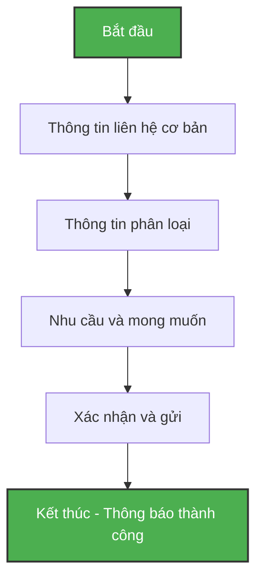

# Thiết Kế Form Đăng Ký & Lead Capture Tối Ưu Cho Ngành May Mặc B2B  

## Table of Contents  
1. Giới thiệu  
2. Hiểu về Lead Generation trong B2B May Mặc  
3. Phân tích yêu cầu và mục tiêu form  
4. Cấu trúc form tối ưu  
5. Thiết kế layout và UX  
6. Các trường thông tin cần thiết  
7. Phân loại và đánh giá lead  
8. Validation và xử lý lỗi  
9. Thiết kế trạng thái thành công  
10. Tối ưu hóa cho thiết bị di động  
11. Triển khai với NextJS và Tailwind CSS  
12. Kiểm thử và đánh giá hiệu suất  
13. Bảo mật và tuân thủ quy định  
14. Kết luận  

## 1. Giới thiệu  

Form đăng ký và lead capture đóng vai trò quan trọng trong chiến lược marketing B2B, đặc biệt trong ngành may mặc. Một form được thiết kế tốt không chỉ thu thập thông tin mà còn tạo ấn tượng chuyên nghiệp, xây dựng niềm tin với khách hàng tiềm năng và tối ưu hóa tỷ lệ chuyển đổi.  

Theo nghiên cứu, 81% người dùng từ bỏ việc điền form sau khi đã bắt đầu. Điều này cho thấy tầm quan trọng của việc thiết kế form đơn giản, dễ sử dụng và tối ưu trải nghiệm người dùng. Form không chỉ là công cụ thu thập thông tin mà còn là cầu nối đầu tiên giữa doanh nghiệp và khách hàng tiềm năng.  

Bài viết này sẽ hướng dẫn chi tiết cách thiết kế form đăng ký lead capture tối ưu cho landing page ngành may mặc B2B, sử dụng NextJS và Tailwind CSS. Chúng ta sẽ tập trung vào các yếu tố quan trọng như cấu trúc form, trường thông tin cần thiết, UX/UI, và tối ưu hóa cho cả desktop và mobile.  

## 2. Hiểu về Lead Generation trong B2B May Mặc  

Lead generation trong ngành may mặc B2B có những đặc thù riêng. Khách hàng thường là các doanh nghiệp tìm kiếm nhà cung cấp, đối tác sản xuất hoặc nguồn hàng ổn định. Họ quan tâm đến chất lượng, giá cả, khả năng đáp ứng số lượng lớn và thời gian giao hàng.  

Form lead generation trong lĩnh vực này cần thu thập đủ thông tin để:  

1. Phân loại khách hàng tiềm năng theo quy mô và nhu cầu  
2. Đánh giá mức độ nghiêm túc của khách hàng  
3. Cung cấp thông tin phù hợp trong quá trình theo đuổi khách hàng  
4. Tạo cơ sở cho việc phân loại lead scoring  

Một form lead generation hiệu quả là cầu nối giữa marketing và sales, giúp đội ngũ bán hàng tiếp cận đúng đối tượng với thông tin phù hợp.  

## 3. Phân tích yêu cầu và mục tiêu form  

Trước khi bắt đầu thiết kế, cần xác định rõ mục tiêu và yêu cầu của form:  

### Mục tiêu chính:  
- Thu thập thông tin liên hệ của khách hàng tiềm năng  
- Phân loại khách hàng theo hệ thống lead scoring  
- Hiểu rõ nhu cầu của khách hàng để cung cấp thông tin phù hợp  
- Tạo trải nghiệm người dùng tốt, tối ưu tỷ lệ chuyển đổi  

### Yêu cầu kỹ thuật:  
- Triển khai trên NextJS và Tailwind CSS  
- Tối ưu cho cả desktop và mobile  
- Đảm bảo tính bảo mật và tuân thủ quy định về dữ liệu  
- Tích hợp với hệ thống CRM hoặc email marketing  

### Cân bằng giữa thông tin và tỷ lệ chuyển đổi:  
Theo nghiên cứu, mỗi trường thông tin bổ sung trong form có thể làm giảm tỷ lệ chuyển đổi. Tuy nhiên, trong B2B, việc thu thập đủ thông tin để đánh giá chất lượng lead lại rất quan trọng. Vì vậy, cần cân nhắc kỹ lưỡng giữa số lượng trường thông tin và tỷ lệ chuyển đổi mong muốn.  

## 4. Cấu trúc form tối ưu  

Cấu trúc form tối ưu cần đảm bảo tính logic, dễ sử dụng và hiệu quả. Dưới đây là cấu trúc đề xuất cho form lead capture ngành may mặc B2B:  

### Phân chia thành các phần logic:  

1. **Thông tin liên hệ cơ bản** (Bắt buộc)  
   - Tên công ty  
   - Tên người liên hệ  
   - Email doanh nghiệp  
   - Số điện thoại  

2. **Thông tin phân loại** (Tùy chọn nhưng khuyến khích)  
   - Quy mô công ty (số nhân viên)  
   - Vai trò/Chức vụ  
   - Ngành nghề chính  

3. **Nhu cầu và mong muốn** (Tùy chọn)  
   - Loại sản phẩm quan tâm  
   - Số lượng dự kiến  
   - Thời gian hợp tác  

### Cân nhắc giữa single-step và multi-step form:  

Đối với form có nhiều trường thông tin (7+ fields), việc chia thành nhiều bước (multi-step) có thể giúp giảm cảm giác phức tạp và tăng tỷ lệ hoàn thành. Tuy nhiên, với form có ít hơn 7 trường, single-step form thường hiệu quả hơn.  

| Loại form | Ưu điểm | Nhược điểm | Phù hợp khi |  
|-----------|---------|------------|-------------|  
| Single-step | - Người dùng thấy toàn bộ form<br>- Dễ điền nhanh<br>- Ít phức tạp về mặt kỹ thuật | - Có thể gây choáng ngợp nếu quá nhiều trường<br>- Tỷ lệ từ bỏ cao hơn với form dài | - Form ngắn (≤ 6 trường)<br>- Thông tin đơn giản |  
| Multi-step | - Giảm cảm giác phức tạp<br>- Tăng tỷ lệ hoàn thành<br>- Có thể thu thập nhiều thông tin hơn | - Phức tạp về mặt kỹ thuật<br>- Người dùng không thấy toàn bộ form | - Form dài (≥ 7 trường)<br>- Cần thu thập nhiều thông tin chi tiết |  

Với form lead capture B2B ngành may mặc, nếu cần thu thập nhiều thông tin chi tiết, multi-step form là lựa chọn tốt hơn. Tuy nhiên, cần đảm bảo hiển thị thanh tiến trình để người dùng biết họ đang ở đâu trong quá trình điền form.  



## 5. Thiết kế layout và UX  

Thiết kế layout và UX của form đóng vai trò quan trọng trong việc tối ưu tỷ lệ chuyển đổi. Dưới đây là các nguyên tắc thiết kế layout và UX tối ưu:  

### Single-column vs multi-column layout:  

Nghiên cứu từ Baymard Institute cho thấy form single-column hiệu quả hơn multi-column. Single-column layout giúp người dùng di chuyển theo một hướng duy nhất từ trên xuống dưới, giảm thiểu sự nhầm lẫn và tăng tỷ lệ hoàn thành.  

| Layout | Ưu điểm | Nhược điểm |  
|--------|---------|------------|  
| Single-column | - Dễ theo dõi và điền<br>- Tối ưu cho mobile<br>- Tỷ lệ hoàn thành cao hơn | - Chiếm nhiều không gian dọc<br>- Form có thể trông dài hơn |  
| Multi-column | - Tiết kiệm không gian<br>- Form trông ngắn hơn | - Khó theo dõi trên mobile<br>- Có thể gây nhầm lẫn<br>- Tỷ lệ lỗi cao hơn |  

Đối với form lead capture B2B ngành may mặc, single-column layout là lựa chọn tốt nhất, đặc biệt khi cần tối ưu cho cả desktop và mobile.  

### Label positioning:  

Vị trí của label có ảnh hưởng lớn đến UX của form. Có hai lựa chọn chính:  

1. **Top-aligned labels**: Label đặt phía trên trường nhập liệu  
2. **Left-aligned labels**: Label đặt bên trái trường nhập liệu  

Nghiên cứu cho thấy top-aligned labels hiệu quả hơn, đặc biệt trên thiết bị di động. Top-aligned labels giúp người dùng dễ dàng quét form từ trên xuống dưới và tối ưu không gian trên màn hình nhỏ.  

```  
// Top-aligned labels (Khuyến nghị)  
+------------------------+  
| Tên công ty            |  
+------------------------+  
| ABC Company            |  
+------------------------+  

// Left-aligned labels  
+-------------+----------+  
| Tên công ty | ABC Co.  |  
+-------------+----------+  
```  

### Field order optimization:  

Thứ tự các trường trong form cũng ảnh hưởng đến tỷ lệ hoàn thành. Nên sắp xếp các trường theo nguyên tắc:  

1. Bắt đầu với các trường đơn giản, dễ điền (như tên, email)  
2. Đặt các trường bắt buộc lên trước  
3. Nhóm các trường liên quan với nhau  
4. Để các trường phức tạp hoặc nhạy cảm ở cuối  

Thứ tự đề xuất cho form lead capture B2B ngành may mặc:  

1. Tên công ty (Bắt buộc)  
2. Tên người liên hệ (Bắt buộc)  
3. Email doanh nghiệp (Bắt buộc)  
4. Số điện thoại (Bắt buộc)  
5. Vai trò/Chức vụ (Tùy chọn)  
6. Quy mô công ty (Tùy chọn)  
7. Ngành nghề chính (Tùy chọn)  
8. Nhu cầu chính (Tùy chọn)  

## 6. Các trường thông tin cần thiết  

Việc lựa chọn các trường thông tin cần thiết là bước quan trọng trong thiết kế form. Cần cân bằng giữa việc thu thập đủ thông tin và không làm người dùng cảm thấy quá tải.  

### Đề xuất 5-7 fields cụ thể với labels:  

| Field | Label | Type | Required | Mục đích |  
|-------|-------|------|----------|----------|  
| Tên công ty | Tên công ty | Text | Yes | Xác định doanh nghiệp |  
| Tên người liên hệ | Họ và tên | Text | Yes | Cá nhân hóa liên hệ |  
| Email | Email doanh nghiệp | Email | Yes | Kênh liên lạc chính |  
| Số điện thoại | Số điện thoại | Tel | Yes | Liên hệ trực tiếp |  
| Vai trò/Chức vụ | Vai trò của bạn | Select | No | Đánh giá quyền quyết định |  
| Quy mô công ty | Số nhân viên | Select | No | Phân loại quy mô |  
| Nhu cầu chính | Bạn quan tâm đến | Checkbox | No | Hiểu nhu cầu khách hàng |  

### Phân tích required vs optional:  

Các trường bắt buộc (required) nên được giới hạn ở mức tối thiểu để tăng tỷ lệ hoàn thành form. Theo nghiên cứu, mỗi khi cắt giảm một trường trong form, tỷ lệ chuyển đổi sẽ tăng lên.  

Đối với form lead capture B2B ngành may mặc, các trường bắt buộc nên bao gồm:  
- Tên công ty  
- Tên người liên hệ  
- Email doanh nghiệp  
- Số điện thoại  

Các trường còn lại nên để là tùy chọn (optional) nhưng được khuyến khích điền để nhận được thông tin phù hợp hơn.  

### Cách đánh dấu trường bắt buộc vs tùy chọn:  

Thay vì đánh dấu các trường bắt buộc bằng dấu sao (*), nên đánh dấu các trường tùy chọn bằng từ "(tùy chọn)" sau label. Điều này giúp giảm sự phức tạp và tăng tỷ lệ hoàn thành form.  

```  
// Cách đề xuất  
Tên công ty  
[                    ]  

Vai trò của bạn (tùy chọn)  
[                    ]  

// Thay vì  
Tên công ty *  
[                    ]  

Vai trò của bạn  
[                    ]  
```  

## 7. Phân loại và đánh giá lead  

Việc phân loại và đánh giá lead là một trong những mục tiêu chính của form lead capture. Các trường thông tin phân loại giúp đội ngũ sales hiểu rõ hơn về khách hàng tiềm năng và có chiến lược tiếp cận phù hợp.  

### Dropdown options cho "Quy mô công ty":  

Quy mô công ty là một trong những tiêu chí quan trọng để đánh giá tiềm năng của lead. Dưới đây là các lựa chọn đề xuất:  

| Giá trị | Label |  
|---------|-------|  
| small | 1-10 nhân viên |  
| medium | 11-50 nhân viên |  
| large | 51-200 nhân viên |  
| enterprise | 201-1000 nhân viên |  
| corporate | Trên 1000 nhân viên |  

### Dropdown options cho "Vai trò/Chức vụ":  

Vai trò/Chức vụ giúp đánh giá mức độ quyền quyết định của người liên hệ. Dưới đây là các lựa chọn đề xuất:  

| Giá trị | Label |  
|---------|-------|  
| ceo | CEO/Giám đốc |  
| manager | Quản lý mua hàng |  
| designer | Nhà thiết kế |  
| production | Quản lý sản xuất |  
| marketing | Marketing/PR |  
| other | Khác |  

### Dropdown options cho "Ngành nghề chính":  

Ngành nghề chính giúp hiểu rõ hơn về lĩnh vực hoạt động của doanh nghiệp. Dưới đây là các lựa chọn đề xuất cho ngành may mặc B2B:  

| Giá trị | Label |  
|---------|-------|  
| manufacturing | Sản xuất may mặc |  
| retail | Bán lẻ thời trang |  
| wholesale | Phân phối sỉ |  
| design | Thiết kế thời trang |  
| ecommerce | Thương mại điện tử |  
| other | Khác |  

### Checkbox/radio options cho "Nhu cầu chính":  

Nhu cầu chính giúp hiểu rõ mong muốn của khách hàng và chuẩn bị thông tin phù hợp. Dưới đây là các lựa chọn đề xuất:  

| Giá trị | Label | Type |  
|---------|-------|------|  
| bulk | Đặt hàng số lượng lớn | Checkbox |  
| custom | Thiết kế tùy chỉnh | Checkbox |  
| private_label | Private Label | Checkbox |  
| sustainable | Sản phẩm bền vững | Checkbox |  
| sample | Đặt mẫu thử | Checkbox |  
| other | Khác | Checkbox |  

Sử dụng checkbox thay vì radio button cho phép người dùng chọn nhiều nhu cầu cùng lúc, phản ánh đúng hơn nhu cầu thực tế của doanh nghiệp.  

### Hệ thống lead scoring:  

Các trường thông tin trên giúp xây dựng hệ thống lead scoring đơn giản như sau:  

| Tiêu chí | Điểm |  
|----------|------|  
| Quy mô công ty > 50 nhân viên | +2 |  
| Vai trò: CEO/Giám đốc | +3 |  
| Vai trò: Quản lý mua hàng | +2 |  
| Ngành nghề: Sản xuất may mặc | +2 |  
| Ngành nghề: Bán lẻ thời trang | +1 |  
| Nhu cầu: Đặt hàng số lượng lớn | +3 |  
| Nhu cầu: Private Label | +2 |  
| Điền đầy đủ thông tin tùy chọn | +1 |  

Tổng điểm sẽ giúp phân loại lead thành các nhóm: Hot (8-10 điểm), Warm (5-7 điểm), Cold (0-4 điểm).  

## 8. Validation và xử lý lỗi  

Validation và xử lý lỗi là yếu tố quan trọng trong UX của form. Một hệ thống validation tốt giúp người dùng hiểu và sửa lỗi nhanh chóng, tăng tỷ lệ hoàn thành form.  

### Inline validation rules cho mỗi field:  

Inline validation là phương pháp kiểm tra tính hợp lệ của dữ liệu ngay khi người dùng nhập hoặc rời khỏi trường đó. Dưới đây là các quy tắc validation cho từng trường:  

| Field | Validation Rules |  
|-------|-----------------|  
| Tên công ty | - Không được để trống<br>- Tối thiểu 2 ký tự |  
| Tên người liên hệ | - Không được để trống<br>- Tối thiểu 2 ký tự |  
| Email | - Không được để trống<br>- Đúng định dạng email (có @ và domain)<br>- Ưu tiên email doanh nghiệp |  
| Số điện thoại | - Không được để trống<br>- Chỉ chứa số và dấu +<br>- Tối thiểu 10 ký tự |  
| Vai trò/Chức vụ | - Phải chọn một giá trị |  
| Quy mô công ty | - Phải chọn một giá trị |  
| Nhu cầu chính | - Nên chọn ít nhất một lựa chọn |  

### Error message templates:  

Error message nên rõ ràng, cụ thể và hướng dẫn người dùng cách sửa lỗi. Dưới đây là các mẫu error message đề xuất:  

| Lỗi | Error Message |  
|-----|---------------|  
| Trường bắt buộc trống | "Vui lòng nhập [tên trường]" |  
| Email không hợp lệ | "Vui lòng nhập địa chỉ email hợp lệ (ví dụ: ten@congty.com)" |  
| Số điện thoại không hợp lệ | "Vui lòng nhập số điện thoại hợp lệ (ít nhất 10 số)" |  
| Chưa chọn giá trị | "Vui lòng chọn một [vai trò/quy mô công ty]" |  

Error message nên được hiển thị ngay dưới trường có lỗi, với màu sắc nổi bật (thường là đỏ) và kèm theo biểu tượng cảnh báo để dễ nhận biết.  

### Cách hiển thị lỗi:  

Lỗi nên được hiển thị theo các nguyên tắc sau:  

1. Sử dụng nhiều dấu hiệu khác nhau (không chỉ màu sắc): viền đỏ, biểu tượng cảnh báo, và text màu đỏ  
2. Hiển thị lỗi ngay khi người dùng rời khỏi trường đó (blur event)  
3. Giữ lại dữ liệu đã nhập, không làm mất thông tin người dùng đã điền  
4. Cung cấp hướng dẫn cụ thể để sửa lỗi  

```html  
<!-- Ví dụ hiển thị lỗi -->  
<div class="mb-4">  
  <label for="email" class="block text-sm font-medium text-gray-700">Email doanh nghiệp</label>  
  <input type="email" id="email" name="email" class="mt-1 block w-full border border-red-500 rounded-md shadow-sm focus:ring-red-500 focus:border-red-500">  
  <p class="mt-1 text-sm text-red-600 flex items-center">  
    <svg class="h-4 w-4 mr-1" fill="currentColor" viewBox="0 0 20 20">  
      <path fill-rule="evenodd" d="M18 10a8 8 0 11-16 0 8 8 0 0116 0zm-7 4a1 1 0 11-2 0 1 1 0 012 0zm-1-9a1 1 0 00-1 1v4a1 1 0 102 0V6a1 1 0 00-1-1z" clip-rule="evenodd"></path>  
    </svg>  
    Vui lòng nhập địa chỉ email hợp lệ (ví dụ: ten@congty.com)  
  </p>  
</div>  
```  

## 9. Thiết kế trạng thái thành công  

Trạng thái thành công (success state) là phần quan trọng nhưng thường bị bỏ qua trong thiết kế form. Một trạng thái thành công tốt không chỉ xác nhận việc gửi form thành công mà còn hướng dẫn người dùng bước tiếp theo.  

### Thiết kế thông báo thành công:  

Thông báo thành công nên bao gồm các yếu tố sau:  

1. **Xác nhận rõ ràng**: Thông báo rõ ràng rằng form đã được gửi thành công  
2. **Lời cảm ơn**: Cảm ơn người dùng đã dành thời gian điền form  
3. **Bước tiếp theo**: Cho người dùng biết điều gì sẽ xảy ra tiếp theo  
4. **Thời gian phản hồi**: Cho người dùng biết khi nào họ sẽ nhận được phản hồi  
5. **Hành động tiếp theo**: Gợi ý hành động tiếp theo người dùng có thể thực hiện  

```html  
<!-- Ví dụ thông báo thành công -->  
<div class="bg-green-50 border border-green-200 rounded-md p-6 text-center">  
  <svg class="h-12 w-12 text-green-500 mx-auto mb-4" fill="none" stroke="currentColor" viewBox="0 0 24 24">  
    <path stroke-linecap="round" stroke-linejoin="round" stroke-width="2" d="M5 13l4 4L19 7"></path>  
  </svg>  
  <h2 class="text-2xl font-bold text-green-800 mb-2">Cảm ơn bạn đã liên hệ!</h2>  
  <p class="text-green-700 mb-4">Chúng tôi đã nhận được thông tin của bạn và sẽ liên hệ trong vòng 24 giờ tới.</p>  
  <div class="mt-6">  
    <a href="/catalog.pdf" class="inline-flex items-center px-4 py-2 border border-transparent rounded-md shadow-sm text-sm font-medium text-white bg-green-600 hover:bg-green-700">  
      Tải xuống catalog  
    </a>  
    <a href="/blog" class="ml-4 inline-flex items-center px-4 py-2 border border-green-300 rounded-md shadow-sm text-sm font-medium text-green-700 bg-white hover:bg-green-50">  
      Xem bài viết của chúng tôi  
    </a>  
  </div>  
</div>  
```  

### Tích hợp với hệ thống follow-up:  

Trạng thái thành công nên được tích hợp với hệ thống follow-up để tối đa hóa giá trị của lead:  

1. **Email xác nhận tự động**: Gửi email xác nhận ngay sau khi form được gửi  
2. **Cung cấp tài liệu**: Đính kèm catalog, bảng giá hoặc tài liệu liên quan  
3. **Lịch hẹn**: Cung cấp liên kết để đặt lịch hẹn với đội ngũ sales  
4. **Theo dõi trên CRM**: Tự động tạo lead mới trong hệ thống CRM  

Việc follow-up nhanh chóng và hiệu quả sẽ tăng đáng kể tỷ lệ chuyển đổi từ lead thành khách hàng.  

## 10. Tối ưu hóa cho thiết bị di động  

Với hơn 53% lưu lượng web toàn cầu đến từ thiết bị di động, việc tối ưu hóa form cho mobile là yếu tố quan trọng. Form không tương thích với mobile có thể làm giảm đáng kể tỷ lệ chuyển đổi.  

### Mobile-friendly form considerations:  

Dưới đây là các yếu tố cần cân nhắc khi tối ưu hóa form cho thiết bị di động:  

1. **Responsive design**: Form phải tự động điều chỉnh kích thước và bố cục theo màn hình  
2. **Touch-friendly inputs**: Các phần tử tương tác phải đủ lớn để dễ dàng chạm vào (ít nhất 48px)  
3. **Simplified layout**: Sử dụng single-column layout để tránh cuộn ngang  
4. **Optimized keyboard**: Hiển thị bàn phím phù hợp với loại dữ liệu (số, email, text)  
5. **Reduced fields**: Giảm số lượng trường thông tin không cần thiết trên mobile  
6. **Larger font size**: Sử dụng font size đủ lớn để dễ đọc trên màn hình nhỏ  

### Responsive design với Tailwind CSS:  

Tailwind CSS cung cấp các utility class để dễ dàng tạo responsive design. Dưới đây là một số class hữu ích:  

```html  
<!-- Ví dụ responsive form với Tailwind CSS -->  
<form class="w-full max-w-lg mx-auto px-4 py-6 md:px-6 md:py-8">  
  <div class="mb-6">  
    <label class="block text-gray-700 text-sm font-bold mb-2" for="company">  
      Tên công ty  
    </label>  
    <input class="shadow appearance-none border rounded w-full py-3 px-4 text-gray-700 leading-tight focus:outline-none focus:shadow-outline" id="company" type="text">  
  </div>  
  
  <!-- Responsive button -->  
  <button class="w-full md:w-auto bg-blue-500 hover:bg-blue-700 text-white font-bold py-3 px-6 rounded focus:outline-none focus:shadow-outline" type="submit">  
    Gửi thông tin  
  </button>  
</form>  
```  

### Mobile-specific optimizations:  

Ngoài responsive design, còn có một số tối ưu hóa đặc biệt cho mobile:  

1. **Sticky submit button**: Giữ nút submit luôn hiển thị khi cuộn trang  
2. **Progress indicator**: Hiển thị tiến trình rõ ràng cho multi-step form  
3. **Autofill support**: Hỗ trợ autofill để giảm thời gian nhập liệu  
4. **Reduced animations**: Giảm hiệu ứng động để tối ưu hiệu suất  
5. **Offline support**: Lưu dữ liệu tạm thời nếu mất kết nối  

```html  
<!-- Ví dụ sticky submit button -->  
<div class="fixed bottom-0 left-0 right-0 bg-white border-t border-gray-200 p-4 md:static md:bg-transparent md:border-0 md:p-0">  
  <button class="w-full bg-blue-500 hover:bg-blue-700 text-white font-bold py-3 px-6 rounded focus:outline-none focus:shadow-outline" type="submit">  
    Gửi thông tin  
  </button>  
</div>  
```  

## 11. Triển khai với NextJS và Tailwind CSS  

NextJS và Tailwind CSS là sự kết hợp mạnh mẽ để xây dựng form lead capture hiệu quả. NextJS cung cấp các tính năng như Server Actions và Form Components, trong khi Tailwind CSS giúp tạo giao diện đẹp và responsive một cách nhanh chóng.  

### Cài đặt và thiết lập dự án:  

```bash  
# Tạo dự án NextJS mới  
npx create-next-app@latest lead-capture-form  
cd lead-capture-form  

# Tailwind CSS đã được tích hợp sẵn trong NextJS mới  
```  

### Tạo form component với NextJS:  

NextJS 15 và React 19 cung cấp nhiều tính năng mới để xây dựng form hiệu quả. Dưới đây là cấu trúc cơ bản của form component:  

```jsx  
// app/components/LeadCaptureForm.jsx  
'use client';  

import { useState } from 'react';  
import { submitLeadForm } from '../actions';  

export default function LeadCaptureForm() {  
  const [formData, setFormData] = useState({  
    companyName: '',  
    contactName: '',  
    email: '',  
    phone: '',  
    role: '',  
    companySize: '',  
    industry: '',  
    needs: []  
  });  
  
  const [errors, setErrors] = useState({});  
  const [isSubmitting, setIsSubmitting] = useState(false);  
  
  const handleChange = (e) => {  
    const { name, value, type, checked } = e.target;  
    
    if (type === 'checkbox') {  
      const updatedNeeds = checked  
        ? [...formData.needs, value]  
        : formData.needs.filter(need => need !== value);  
      
      setFormData({ ...formData, needs: updatedNeeds });  
    } else {  
      setFormData({ ...formData, [name]: value });  
    }  
    
    // Clear error when user starts typing  
    if (errors[name]) {  
      setErrors({ ...errors, [name]: '' });  
    }  
  };  
  
  const validateForm = () => {  
    const newErrors = {};  
    
    if (!formData.companyName.trim()) {  
      newErrors.companyName = 'Vui lòng nhập tên công ty';  
    }  
    
    if (!formData.contactName.trim()) {  
      newErrors.contactName = 'Vui lòng nhập tên người liên hệ';  
    }  
    
    if (!formData.email.trim()) {  
      newErrors.email = 'Vui lòng nhập email';  
    } else if (!/\S+@\S+\.\S+/.test(formData.email)) {  
      newErrors.email = 'Vui lòng nhập email hợp lệ';  
    }  
    
    if (!formData.phone.trim()) {  
      newErrors.phone = 'Vui lòng nhập số điện thoại';  
    } else if (!/^\+?[0-9]{10,15}$/.test(formData.phone.replace(/\s/g, ''))) {  
      newErrors.phone = 'Vui lòng nhập số điện thoại hợp lệ';  
    }  
    
    setErrors(newErrors);  
    return Object.keys(newErrors).length === 0;  
  };  
  
  const handleSubmit = async (e) => {  
    e.preventDefault();  
    
    if (!validateForm()) {  
      return;  
    }  
    
    setIsSubmitting(true);  
    
    try {  
      const result = await submitLeadForm(formData);  
      
      if (result.success) {  
        // Show success message or redirect  
        window.location.href = '/thank-you';  
      } else {  
        setErrors({ form: result.message || 'Có lỗi xảy ra. Vui lòng thử lại.' });  
      }  
    } catch (error) {  
      setErrors({ form: 'Có lỗi xảy ra. Vui lòng thử lại.' });  
    } finally {  
      setIsSubmitting(false);  
    }  
  };  
  
  return (  
    <form onSubmit={handleSubmit} className="max-w-lg mx-auto p-6 bg-white rounded-lg shadow-md">  
      <h2 className="text-2xl font-bold text-gray-800 mb-6">Liên hệ với chúng tôi</h2>  
      
      {/* Form fields will go here */}  
      
      <button  
        type="submit"  
        disabled={isSubmitting}  
        className="w-full bg-blue-600 hover:bg-blue-700 text-white font-bold py-3 px-4 rounded focus:outline-none focus:shadow-outline transition duration-150 ease-in-out"  
      >  
        {isSubmitting ? 'Đang gửi...' : 'Gửi thông tin'}  
      </button>  
      
      {errors.form && (  
        <p className="mt-4 text-sm text-red-600">{errors.form}</p>  
      )}  
    </form>  
  );  
}  
```  

### Sử dụng Server Actions trong NextJS:  

Server Actions là tính năng mới trong NextJS 15, cho phép xử lý form submission trực tiếp trên server. Dưới đây là cách triển khai:  

```jsx  
// app/actions.js  
'use server';  

import { z } from 'zod';  
import { revalidateTag } from 'next/cache';  

// Định nghĩa schema validation với Zod  
const LeadFormSchema = z.object({  
  companyName: z.string().min(2, 'Tên công ty phải có ít nhất 2 ký tự'),  
  contactName: z.string().min(2, 'Tên người liên hệ phải có ít nhất 2 ký tự'),  
  email: z.string().email('Email không hợp lệ'),  
  phone: z.string().regex(/^\+?[0-9]{10,15}$/, 'Số điện thoại không hợp lệ'),  
  role: z.string().optional(),  
  companySize: z.string().optional(),  
  industry: z.string().optional(),  
  needs: z.array(z.string()).optional()  
});  

export async function submitLeadForm(formData) {  
  try {  
    // Validate form data  
    const validatedData = LeadFormSchema.parse(formData);  
    
    // Process the lead (e.g., save to database, send email)  
    // This is where you would integrate with your CRM or email service  
    
    // For example, save to database  
    // await prisma.lead.create({ data: validatedData });  
    
    // Revalidate cache if needed  
    revalidateTag('leads');  
    
    return { success: true };  
  } catch (error) {  
    if (error instanceof z.ZodError) {  
      // Return validation errors  
      return {   
        success: false,   
        message: 'Vui lòng kiểm tra lại thông tin',  
        errors: error.errors   
      };  
    }  
    
    // Log server errors but don't expose details to client  
    console.error('Lead form submission error:', error);  
    return { success: false, message: 'Có lỗi xảy ra. Vui lòng thử lại.' };  
  }  
}  
```  

### Styling với Tailwind CSS:  

Tailwind CSS giúp tạo giao diện đẹp và responsive một cách nhanh chóng. Dưới đây là một số class hữu ích cho form:  

```jsx  
// Ví dụ input field với Tailwind CSS  
<div className="mb-4">  
  <label htmlFor="companyName" className="block text-sm font-medium text-gray-700 mb-1">  
    Tên công ty  
  </label>  
  <input  
    type="text"  
    id="companyName"  
    name="companyName"  
    value={formData.companyName}  
    onChange={handleChange}  
    className={`w-full px-3 py-2 border ${  
      errors.companyName ? 'border-red-500' : 'border-gray-300'  
    } rounded-md shadow-sm focus:outline-none focus:ring-2 focus:ring-blue-500 focus:border-blue-500`}  
  />  
  {errors.companyName && (  
    <p className="mt-1 text-sm text-red-600">{errors.companyName}</p>  
  )}  
</div>  

// Ví dụ select field với Tailwind CSS  
<div className="mb-4">  
  <label htmlFor="companySize" className="block text-sm font-medium text-gray-700 mb-1">  
    Quy mô công ty (tùy chọn)  
  </label>  
  <select  
    id="companySize"  
    name="companySize"  
    value={formData.companySize}  
    onChange={handleChange}  
    className="w-full px-3 py-2 border border-gray-300 rounded-md shadow-sm focus:outline-none focus:ring-2 focus:ring-blue-500 focus:border-blue-500"  
  >  
    <option value="">-- Chọn quy mô --</option>  
    <option value="small">1-10 nhân viên</option>  
    <option value="medium">11-50 nhân viên</option>  
    <option value="large">51-200 nhân viên</option>  
    <option value="enterprise">201-1000 nhân viên</option>  
    <option value="corporate">Trên 1000 nhân viên</option>  
  </select>  
</div>  

// Ví dụ checkbox group với Tailwind CSS  
<div className="mb-4">  
  <span className="block text-sm font-medium text-gray-700 mb-2">  
    Bạn quan tâm đến (tùy chọn)  
  </span>  
  <div className="space-y-2">  
    {['bulk', 'custom', 'private_label', 'sustainable', 'sample'].map((need) => (  
      <label key={need} className="flex items-center">  
        <input  
          type="checkbox"  
          name="needs"  
          value={need}  
          checked={formData.needs.includes(need)}  
          onChange={handleChange}  
          className="h-4 w-4 text-blue-600 focus:ring-blue-500 border-gray-300 rounded"  
        />  
        <span className="ml-2 text-sm text-gray-700">  
          {need === 'bulk' && 'Đặt hàng số lượng lớn'}  
          {need === 'custom' && 'Thiết kế tùy chỉnh'}  
          {need === 'private_label' && 'Private Label'}  
          {need === 'sustainable' && 'Sản phẩm bền vững'}  
          {need === 'sample' && 'Đặt mẫu thử'}  
        </span>  
      </label>  
    ))}  
  </div>  
</div>  
```  

## 12. Kiểm thử và đánh giá hiệu suất  

Kiểm thử và đánh giá hiệu suất là bước quan trọng để đảm bảo form hoạt động tốt và mang lại kết quả mong muốn. Dưới đây là các phương pháp kiểm thử và đánh giá hiệu suất form:  

### Kiểm thử đa nền tảng:  

Form cần được kiểm thử trên nhiều nền tảng và trình duyệt khác nhau để đảm bảo tính nhất quán:  

1. **Desktop browsers**: Chrome, Firefox, Safari, Edge  
2. **Mobile browsers**: Chrome (Android), Safari (iOS)  
3. **Tablet devices**: iPad, Android tablets  
4. **Screen sizes**: Small (320px), Medium (768px), Large (1024px+)  

### Kiểm thử accessibility:  

Accessibility là yếu tố quan trọng để đảm bảo form có thể sử dụng được bởi tất cả người dùng:  

1. **Screen reader compatibility**: Kiểm tra form với các screen reader như NVDA, VoiceOver  
2. **Keyboard navigation**: Đảm bảo có thể điều hướng và điền form chỉ bằng bàn phím  
3. **Color contrast**: Kiểm tra tỷ lệ tương phản màu sắc đạt chuẩn WCAG AA (tối thiểu 4.5:1)  
4. **Focus indicators**: Đảm bảo các phần tử có focus state rõ ràng  

### Đánh giá hiệu suất:  

Hiệu suất của form có thể được đánh giá thông qua các chỉ số sau:  

1. **Conversion rate**: Tỷ lệ người dùng hoàn thành form so với số người truy cập  
2. **Abandonment rate**: Tỷ lệ người dùng bỏ dở form giữa chừng  
3. **Time to complete**: Thời gian trung bình để hoàn thành form  
4. **Error rate**: Tỷ lệ lỗi xảy ra khi điền form  
5. **Field completion rate**: Tỷ lệ hoàn thành của từng trường thông tin  

### A/B Testing:  

A/B Testing là phương pháp hiệu quả để tối ưu hóa form. Các yếu tố có thể test bao gồm:  

1. **Form length**: So sánh form ngắn và form dài  
2. **Field order**: Thử nghiệm các thứ tự trường khác nhau  
3. **Button text**: So sánh các văn bản CTA khác nhau  
4. **Layout**: So sánh single-column và multi-column  
5. **Visual design**: So sánh các phong cách thiết kế khác nhau  

### Công cụ kiểm thử:  

Một số công cụ hữu ích để kiểm thử form:  

1. **Lighthouse**: Đánh giá performance, accessibility, SEO  
2. **WAVE**: Kiểm tra accessibility  
3. **BrowserStack**: Kiểm thử đa nền tảng  
4. **Hotjar**: Theo dõi hành vi người dùng và tạo heatmap  
5. **Google Analytics**: Theo dõi conversion và abandonment rate  

## 13. Bảo mật và tuân thủ quy định  

Bảo mật và tuân thủ quy định là yếu tố quan trọng trong thiết kế form, đặc biệt khi thu thập thông tin cá nhân và doanh nghiệp.  

### Bảo mật form:  

Dưới đây là các biện pháp bảo mật cần áp dụng:  

1. **HTTPS**: Đảm bảo form được truyền qua kết nối an toàn (HTTPS)  
2. **CSRF Protection**: Bảo vệ form khỏi tấn công Cross-Site Request Forgery  
3. **Rate Limiting**: Giới hạn số lần submit form từ cùng một IP  
4. **Honeypot Fields**: Thêm trường ẩn để phát hiện bot  
5. **Captcha**: Sử dụng reCAPTCHA hoặc hCaptcha để ngăn chặn spam  

```jsx  
// Ví dụ honeypot field  
<div className="hidden">  
  <label htmlFor="website">Website</label>  
  <input  
    type="text"  
    id="website"  
    name="website"  
    tabIndex="-1"  
    autoComplete="off"  
  />  
</div>  
```  

### Tuân thủ quy định:  

Form cần tuân thủ các quy định về bảo vệ dữ liệu:  

1. **GDPR**: Tuân thủ Quy định Bảo vệ Dữ liệu Chung của EU  
2. **CCPA**: Tuân thủ Đạo luật Bảo vệ Quyền riêng tư Người tiêu dùng California  
3. **LGPD**: Tuân thủ Luật Bảo vệ Dữ liệu Chung của Brazil  

### Thông báo quyền riêng tư:  

Form cần có thông báo quyền riêng tư rõ ràng:  

1. **Privacy Policy**: Liên kết đến chính sách quyền riêng tư đầy đủ  
2. **Data Usage**: Giải thích cách sử dụng dữ liệu thu thập  
3. **Consent Checkbox**: Yêu cầu người dùng đồng ý với điều khoản và chính sách  

```jsx  
// Ví dụ consent checkbox  
<div className="mt-6">  
  <label className="flex items-start">  
    <input  
      type="checkbox"  
      name="consent"  
      checked={formData.consent}  
      onChange={handleChange}  
      className="h-4 w-4 mt-1 text-blue-600 focus:ring-blue-500 border-gray-300 rounded"  
      required  
    />  
    <span className="ml-2 text-sm text-gray-700">  
      Tôi đồng ý với <a href="/privacy-policy" className="text-blue-600 hover:underline" target="_blank">Chính sách quyền riêng tư</a> và cho phép liên hệ qua email hoặc điện thoại.  
    </span>  
  </label>  
  {errors.consent && (  
    <p className="mt-1 text-sm text-red-600">{errors.consent}</p>  
  )}  
</div>  
```  

### Bảo mật dữ liệu:  

Dữ liệu thu thập từ form cần được bảo vệ:  

1. **Encryption**: Mã hóa dữ liệu nhạy cảm  
2. **Data Minimization**: Chỉ thu thập dữ liệu cần thiết  
3. **Secure Storage**: Lưu trữ dữ liệu an toàn  
4. **Access Control**: Kiểm soát quyền truy cập dữ liệu  
5. **Retention Policy**: Chính sách lưu trữ và xóa dữ liệu  

## 14. Kết luận  

Thiết kế form đăng ký lead capture tối ưu cho ngành may mặc B2B là một quá trình đòi hỏi sự cân nhắc kỹ lưỡng về nhiều yếu tố. Từ cấu trúc form, trường thông tin, UX/UI đến bảo mật và tuân thủ quy định, mỗi yếu tố đều đóng vai trò quan trọng trong việc tạo ra một form hiệu quả.  

### Tóm tắt các điểm chính:  

| Yếu tố | Khuyến nghị |  
|--------|-------------|  
| Cấu trúc form | - Single-column layout<br>- Multi-step cho form dài<br>- Nhóm các trường liên quan |  
| Trường thông tin | - 5-7 trường thông tin<br>- 4 trường bắt buộc (tên công ty, người liên hệ, email, điện thoại)<br>- Các trường phân loại tùy chọn |  
| Layout | - Single-column layout<br>- Top-aligned labels<br>- Thứ tự từ đơn giản đến phức tạp |  
| Validation | - Inline validation<br>- Error message cụ thể<br>- Giữ dữ liệu đã nhập |  
| Mobile optimization | - Responsive design<br>- Touch-friendly inputs<br>- Simplified layout |  
| Bảo mật | - HTTPS<br>- CSRF Protection<br>- Consent checkbox |  

### Các bước triển khai:  

1. **Phân tích yêu cầu**: Xác định mục tiêu và yêu cầu của form  
2. **Thiết kế cấu trúc**: Xác định các trường thông tin và cấu trúc form  
3. **Xây dựng UI**: Thiết kế giao diện với NextJS và Tailwind CSS  
4. **Triển khai validation**: Xây dựng hệ thống validation và xử lý lỗi  
5. **Tối ưu hóa mobile**: Đảm bảo form hoạt động tốt trên thiết bị di động  
6. **Kiểm thử**: Kiểm tra form trên nhiều nền tảng và trình duyệt  
7. **Đánh giá và cải tiến**: Thu thập dữ liệu và cải tiến form  

Bằng cách tuân thủ các nguyên tắc và khuyến nghị trong bài viết này, bạn có thể tạo ra một form đăng ký lead capture hiệu quả, tối ưu tỷ lệ chuyển đổi và thu thập thông tin chất lượng cho chiến lược marketing B2B trong ngành may mặc.  

Hãy nhớ rằng, form không chỉ là công cụ thu thập thông tin mà còn là điểm tiếp xúc quan trọng với khách hàng tiềm năng. Một form được thiết kế tốt sẽ tạo ấn tượng chuyên nghiệp, xây dựng niềm tin và đặt nền móng cho mối quan hệ kinh doanh lâu dài.