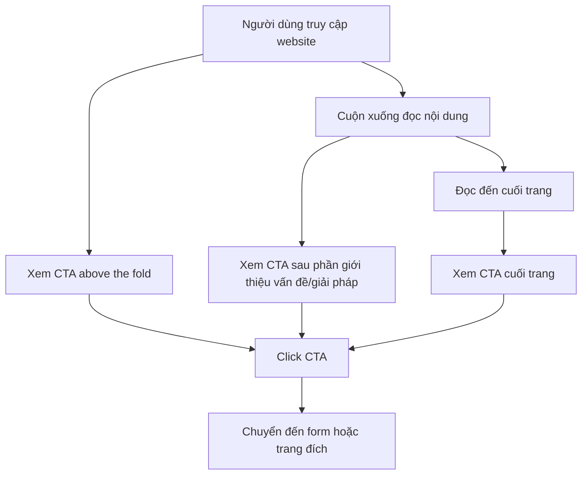
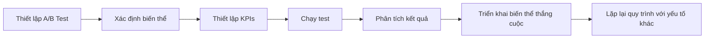

# Tối Ưu Hóa Call-to-Action và Post-Submission Experience Cho Ngành May Mặc B2B  

## Table of Contents  
1. Giới thiệu  
2. Tầm quan trọng của CTA trong môi trường B2B  
3. Tối ưu hóa Call-to-Action (CTA)  
4. Yếu tố tâm lý trong thiết kế CTA  
5. Thiết kế Post-Submission Experience  
6. Mobile Optimization cho CTA và Form  
7. Triển khai kỹ thuật với NextJS & Tailwind CSS

## 1. Giới thiệu  

Trong thế giới kinh doanh B2B ngành may mặc, nơi cạnh tranh ngày càng khốc liệt và sự chú ý của khách hàng ngày càng khan hiếm, việc tối ưu hóa tỷ lệ chuyển đổi trở nên quan trọng hơn bao giờ hết. Một trong những yếu tố then chốt để đạt được điều này là thiết kế Call-to-Action (CTA) hiệu quả và trải nghiệm sau khi người dùng thực hiện hành động (post-submission experience).  

Theo nghiên cứu của Gartner, khách hàng B2B có khả năng hoàn tất giao dịch cao hơn khoảng 4,5 lần nếu chất lượng nội dung liên tục ở mức cao. Điều này đặc biệt đúng trong ngành may mặc B2B, nơi các quyết định mua hàng thường dựa trên nhiều yếu tố như chất lượng, giá cả, khả năng cung ứng và độ tin cậy của nhà cung cấp.  

Báo cáo này sẽ cung cấp một phân tích toàn diện về cách tối ưu hóa CTA và trải nghiệm post-submission cho doanh nghiệp may mặc B2B, dựa trên các nghiên cứu, dữ liệu và best practices trong ngành. Mục tiêu là giúp doanh nghiệp tăng tỷ lệ chuyển đổi, cải thiện trải nghiệm người dùng và cuối cùng là thúc đẩy doanh số bán hàng.  

## 2. Tầm quan trọng của CTA trong môi trường B2B  

Trong môi trường B2B, website của bạn đóng vai trò như một cửa hàng trực tuyến, nơi khách hàng tiềm năng "window shopping" các giải pháp trước khi liên hệ với đội ngũ bán hàng. Khác với website B2C tập trung vào bán hàng trực tiếp, website B2B chủ yếu tập trung vào việc giáo dục khách truy cập.  

Khi ai đó truy cập trang chủ của bạn, họ chỉ có một câu hỏi: "Điều này có lợi gì cho tôi?" Nói cách khác, họ muốn biết liệu bạn có thể giải quyết vấn đề của họ hay không. Đây chính là lý do tại sao CTA đóng vai trò quan trọng - nó là cầu nối giữa nhu cầu của khách hàng và giải pháp của bạn.  

Một CTA hiệu quả trong ngành may mặc B2B cần phải:  
- Rõ ràng về hành động mà người dùng cần thực hiện  
- Nổi bật trong thiết kế trang web  
- Dễ tiếp cận với tất cả người dùng  
- Phù hợp với nhu cầu ngay lập tức của người dùng[^52-55]  

## 3. Tối ưu hóa Call-to-Action (CTA)  

### 3.1. 7 Phương án copy cho nút CTA chính  

Thay vì sử dụng "Tải ngay" - một CTA khá chung chung, dưới đây là 7 phương án thay thế hiệu quả hơn cho ngành may mặc B2B:  

| STT | Copy CTA Tiếng Việt | Lý do hiệu quả | Ứng dụng |  
|-----|---------------------|----------------|----------|  
| 1 | **Nhận Báo Giá Ngay** | Tạo cảm giác cấp bách và cung cấp giá trị rõ ràng | Trang sản phẩm, landing page |  
| 2 | **Đặt Lịch Tư Vấn Miễn Phí** | Giảm rào cản với từ "miễn phí", tạo cơ hội tương tác trực tiếp | Trang dịch vụ may mẫu |  
| 3 | **Yêu Cầu Xem Mẫu Vải** | Cụ thể hóa hành động, phù hợp với nhu cầu xem và chạm vào sản phẩm | Trang bộ sưu tập vải |  
| 4 | **Trở Thành Đối Tác Sản Xuất** | Tạo cảm giác quan hệ lâu dài, phù hợp với B2B | Trang "Về chúng tôi" |  
| 5 | **Nhận Ưu Đãi Đặt Hàng Sớm** | Kết hợp urgency và lợi ích cụ thể | Trang ra mắt bộ sưu tập mới |  
| 6 | **Khám Phá Giải Pháp May Đo** | Gợi tò mò và phù hợp với nhu cầu tìm kiếm giải pháp | Trang dịch vụ may đo |  
| 7 | **Bảo Đảm Chỗ Của Bạn** | Tạo cảm giác khan hiếm và độc quyền | Trang đăng ký sự kiện, triển lãm |  

Nghiên cứu cho thấy, một CTA như "Claim Your Discount Before It's Gone Forever" (Nhận ưu đãi trước khi hết hạn) chuyển đổi tốt hơn so với "Get 10% Off Your First Order Today" (Giảm 10% cho đơn hàng đầu tiên). Cả hai đều cung cấp cùng một ưu đãi, nhưng cái đầu tiên nhấn mạnh vào việc mất đi một phần thưởng khan hiếm thay vì chỉ đơn giản là nhận được một ưu đãi mới. Vì vậy, nó tạo cảm giác cấp bách hơn.  

### 3.2. Size, color, và styling tối ưu cho CTA button  

Thiết kế visual của CTA đóng vai trò quan trọng trong việc thu hút sự chú ý của người dùng và khuyến khích họ thực hiện hành động. Dưới đây là các thông số tối ưu:  

#### 3.2.1. Kích thước (Size)  

| Thiết bị | Kích thước tối thiểu | Lý do |  
|----------|----------------------|-------|  
| Desktop | 180px x 45px | Đủ lớn để nổi bật nhưng không chiếm quá nhiều không gian |  
| Tablet | 160px x 45px | Cân đối với kích thước màn hình |  
| Mobile | 44px x 44px (chiều cao) | Đạt chuẩn WCAG 2.1 về khả năng tiếp cận, dễ nhấn trên thiết bị cảm ứng |  

#### 3.2.2. Màu sắc (Color)  

Màu sắc có thể kích hoạt phản ứng tâm lý liên quan đến đèn giao thông, thiên nhiên, cảnh báo và nhiều yếu tố khác. Các màu cụ thể như đỏ và cam kích thích cảm giác cấp bách.  

| Màu sắc | Mã màu | Tác động tâm lý | Ứng dụng |  
|---------|--------|-----------------|----------|  
| Đỏ | #D32F2F | Tạo cảm giác cấp bách, thu hút sự chú ý | CTA chính, khuyến mãi giới hạn |  
| Xanh dương | #1976D2 | Xây dựng lòng tin và độ tin cậy | Đăng ký, tạo tài khoản |  
| Xanh lá | #388E3C | Liên kết với hành động tích cực, "Go" | Hoàn tất đơn hàng, xác nhận |  
| Cam | #F57C00 | Thu hút sự chú ý, tạo hứng khởi | Ưu đãi đặc biệt, ra mắt sản phẩm mới |  

Lưu ý: Màu sắc nên tương phản với nền để nút CTA nổi bật. Tỷ lệ tương phản tối thiểu nên là 4.5:1 theo tiêu chuẩn WCAG để đảm bảo khả năng đọc.  

#### 3.2.3. Styling  

```html  
<!-- Ví dụ CTA button với Tailwind CSS -->  
<button class="bg-red-600 hover:bg-red-700 text-white font-bold px-6 py-3 rounded-lg shadow-lg transition-all duration-300 transform hover:scale-105 focus:outline-none focus:ring-2 focus:ring-red-500 focus:ring-opacity-50">  
  Nhận Báo Giá Ngay  
  <span class="text-xs block mt-1">Phản hồi trong vòng 24h</span>  
</button>  
```  

| Yếu tố styling | Thông số | Lý do |  
|----------------|----------|-------|  
| Border-radius | 8px (rounded-lg) | Nút có góc bo tròn cảm giác thân thiện hơn |  
| Shadow | Medium (shadow-lg) | Tạo hiệu ứng nổi, thu hút sự chú ý |  
| Hover effect | Scale 105% + màu đậm hơn | Phản hồi trực quan khi người dùng tương tác |  
| Focus state | Ring outline | Đảm bảo khả năng tiếp cận cho người dùng bàn phím |  
| Font | Bold, dễ đọc | Tăng khả năng đọc và nhấn mạnh hành động |  
| Padding | 24px ngang, 12px dọc | Tạo không gian trắng đủ để nút dễ nhấn |  

### 3.3. Vị trí lý tưởng của CTA  

Vị trí đặt CTA có ảnh hưởng lớn đến tỷ lệ chuyển đổi. Dưới đây là các vị trí lý tưởng cho CTA trong website B2B ngành may mặc:  

1. **Above the fold**: Đặt CTA ở vị trí người dùng có thể thấy ngay mà không cần cuộn trang. Điều này đặc biệt quan trọng trên trang đích và trang sản phẩm.  

2. **Sau khi trình bày vấn đề và giải pháp**: Đặt CTA sau khi đã giải thích rõ vấn đề mà khách hàng đang gặp phải và cách bạn có thể giải quyết nó.  

3. **Cuối bài viết blog hoặc nội dung**: Khi người đọc đã tiêu thụ nội dung và đã được giáo dục về chủ đề, họ sẽ sẵn sàng thực hiện hành động hơn.  

4. **Trong menu điều hướng**: CTA thứ cấp có thể được đặt trong menu điều hướng để luôn hiển thị, bất kể người dùng đang ở đâu trên trang web.  

5. **Sticky bar**: Thanh CTA cố định hiển thị khi người dùng cuộn trang, đảm bảo CTA luôn trong tầm nhìn.  



### 3.4. Micro-copy hỗ trợ (text nhỏ dưới CTA)  

Micro-copy là những đoạn text ngắn đặt dưới hoặc bên cạnh CTA để cung cấp thêm thông tin, xóa bỏ lo ngại hoặc tạo thêm động lực cho người dùng. Đây là yếu tố quan trọng nhưng thường bị bỏ qua trong thiết kế CTA.  

| Loại micro-copy | Ví dụ | Mục đích |  
|-----------------|-------|----------|  
| Xóa bỏ rủi ro | "Không cần thẻ tín dụng" hoặc "Hủy bất cứ lúc nào" | Giảm lo ngại về cam kết tài chính |  
| Tạo cảm giác cấp bách | "Chỉ còn 5 suất cuối cùng" | Thúc đẩy hành động ngay lập tức |  
| Cam kết dịch vụ | "Phản hồi trong vòng 24h làm việc" | Thiết lập kỳ vọng rõ ràng |  
| Tính độc quyền | "Chỉ dành cho đối tác B2B" | Tạo cảm giác đặc biệt |  
| Xác nhận bảo mật | "Thông tin của bạn được bảo mật 100%" | Xây dựng lòng tin |  

Ví dụ micro-copy hiệu quả cho ngành may mặc B2B:  

```html  
<button class="bg-blue-600 text-white px-6 py-3 rounded-lg">  
  Đặt Lịch Tư Vấn  
  <span class="block text-xs mt-1">15 phút với chuyên gia thiết kế • Không ràng buộc</span>  
</button>  
```  

### 3.5. A/B testing suggestions cho CTA  

A/B testing là phương pháp hiệu quả để tối ưu hóa CTA. Ngay cả khi bạn áp dụng tất cả các nguyên tắc thiết kế CTA, bạn không nên tự mãn. Các CTA chuyển đổi cao nhất đến từ việc liên tục thử nghiệm và tối ưu hóa các biến thể khác nhau.  

| Yếu tố cần test | Biến thể A | Biến thể B | Metric theo dõi |  
|-----------------|------------|------------|----------------|  
| Copy CTA | "Nhận Báo Giá Ngay" | "Yêu Cầu Báo Giá Miễn Phí" | Click-through rate (CTR) |  
| Màu sắc | Đỏ (#D32F2F) | Xanh dương (#1976D2) | CTR, thời gian hover |  
| Vị trí | Above the fold | Sau phần giới thiệu sản phẩm | Scroll depth, CTR |  
| Kích thước | Medium (px-4 py-2) | Large (px-6 py-3) | CTR, mobile vs desktop |  
| Micro-copy | "Phản hồi trong 24h" | "Đã có 500+ doanh nghiệp tin dùng" | Conversion rate |  
| Hình dạng | Góc bo tròn (rounded-lg) | Góc vuông (rounded-none) | CTR, thời gian quyết định |  
| CTA đơn vs. kép | Một CTA chính | CTA chính + CTA phụ ("Tìm hiểu thêm") | Tỷ lệ chuyển đổi tổng thể |  

Một ví dụ thực tế: Một khách hàng Fortune 500 đã chạy A/B test với 7 biến thể CTA "Request Demo" khác nhau một chút. Họ chỉ kỳ vọng những cải thiện nhỏ từ việc điều chỉnh màu sắc, kích thước và copy của nút. Nhưng một biến thể với bảo đảm thuyết phục đã tăng tỷ lệ chuyển đổi lên 76% gần như ngay lập tức.  



## 4. Yếu tố tâm lý trong thiết kế CTA  

### 4.1. Elements tạo urgency (tính cấp bách)  

Tạo cảm giác cấp bách là một trong những chiến lược hiệu quả nhất để thúc đẩy hành động. Khi người mua cảm thấy một cơ hội có giới hạn, họ có xu hướng mua hàng nhiều hơn. Điều này tạo ra cảm giác cấp bách, mà các bài kiểm tra cho thấy có thể tăng tỷ lệ chuyển đổi.  

| Element tạo urgency | Ví dụ triển khai | Tác động tâm lý |  
|---------------------|------------------|-----------------|  
| Countdown timer | "Ưu đãi kết thúc sau: 02:14:35" | Tạo áp lực thời gian trực quan |  
| Limited-time offer | "Chỉ còn hiệu lực đến ngày 30/09" | Đặt thời hạn cụ thể |  
| Flash sale | "Flash Sale: Giảm 15% cho đơn hàng trong 24h tới" | Tạo cơ hội ngắn hạn |  
| Early-bird pricing | "Giá ưu đãi đặc biệt cho 50 đơn đặt hàng đầu tiên" | Khuyến khích hành động sớm |  
| Seasonal urgency | "Đặt hàng ngay để kịp mùa Tết 2025" | Liên kết với thời điểm quan trọng |  

Ví dụ triển khai với Tailwind CSS:  

```html  
<div class="bg-red-50 border border-red-200 rounded-lg p-4 mb-4 flex items-center">  
  <svg class="w-5 h-5 text-red-500 mr-2" fill="currentColor" viewBox="0 0 20 20">  
    <path d="M10 18a8 8 0 100-16 8 8 0 000 16zm1-12a1 1 0 10-2 0v4a1 1 0 00.293.707l2.828 2.829a1 1 0 101.415-1.415L11 9.586V6z"></path>  
  </svg>  
  <span class="text-red-700 font-medium">Ưu đãi đặc biệt kết thúc sau: <span id="countdown" class="font-bold">23:59:59</span></span>  
</div>  
```  

### 4.2. Elements tạo scarcity (tính khan hiếm)  

Tính khan hiếm là một yếu tố tâm lý mạnh mẽ khác thúc đẩy hành động. Khi mọi người cảm thấy một sản phẩm hoặc dịch vụ có số lượng giới hạn, họ có xu hướng đánh giá cao nó hơn và muốn sở hữu nó ngay lập tức.  

| Element tạo scarcity | Ví dụ triển khai | Tác động tâm lý |  
|----------------------|------------------|-----------------|  
| Limited quantity | "Chỉ còn 10 suất sản xuất trong tháng 9" | Tạo lo sợ bỏ lỡ (FOMO) |  
| Exclusive access | "Bộ sưu tập độc quyền chỉ dành cho đối tác B2B" | Tạo cảm giác đặc quyền |  
| Limited production capacity | "Nhà máy chỉ nhận thêm 5 đơn hàng trong quý này" | Nhấn mạnh giới hạn năng lực sản xuất |  
| Seasonal materials | "Vải limited edition - chỉ sản xuất một lần duy nhất" | Tạo giá trị độc đáo |  
| High demand indicator | "20 doanh nghiệp khác đang xem sản phẩm này" | Tạo cảm giác cạnh tranh |  

Ví dụ triển khai với Tailwind CSS:  

```html  
<div class="bg-amber-50 border border-amber-200 rounded-lg p-4 mb-4">  
  <div class="flex items-center">  
    <svg class="w-5 h-5 text-amber-500 mr-2" fill="currentColor" viewBox="0 0 20 20">  
      <path fill-rule="evenodd" d="M5 9V7a5 5 0 0110 0v2a2 2 0 012 2v5a2 2 0 01-2 2H5a2 2 0 01-2-2v-5a2 2 0 012-2zm8-2v2H7V7a3 3 0 016 0z" clip-rule="evenodd"></path>  
    </svg>  
    <span class="text-amber-700 font-medium">Chỉ còn <span class="font-bold">3 suất</span> sản xuất trong tháng 10</span>  
  </div>  
  <div class="mt-2 bg-gray-200 rounded-full h-2">  
    <div class="bg-amber-500 h-2 rounded-full" style="width: 85%"></div>  
  </div>  
</div>  
```  

### 4.3. Social proof elements gần CTA  

Social proof (bằng chứng xã hội) là một yếu tố tâm lý mạnh mẽ có thể tăng đáng kể tỷ lệ chuyển đổi. Đặt các yếu tố social proof gần CTA có thể giúp xây dựng lòng tin và giảm lo ngại của người dùng.  

| Social proof element | Ví dụ triển khai | Tác động |  
|----------------------|------------------|----------|  
| Số lượng khách hàng | "Đã có 500+ doanh nghiệp tin dùng" | Xây dựng uy tín qua số lượng |  
| Logo khách hàng nổi tiếng | Hiển thị logo các thương hiệu lớn | Tận dụng uy tín của thương hiệu khác |  
| Đánh giá và xếp hạng | "4.8/5 sao từ 120+ đối tác" | Cung cấp bằng chứng về chất lượng |  
| Testimonial ngắn | "Chất lượng vải tuyệt vời, giao hàng đúng hẹn" - CEO Công ty X | Chia sẻ trải nghiệm thực tế |  
| Chứng nhận ngành | Logo chứng nhận OEKO-TEX, ISO, v.v. | Xác thực chất lượng và tiêu chuẩn |  

Ví dụ triển khai với Tailwind CSS:  

```html  
<div class="mt-6 mb-8">  
  <button class="w-full bg-blue-600 text-white font-bold py-3 px-6 rounded-lg">  
    Yêu Cầu Báo Giá  
  </button>  
  
  <div class="mt-4 text-center">  
    <p class="text-sm text-gray-600">Đã được tin dùng bởi hơn 500 doanh nghiệp</p>  
    <div class="flex justify-center mt-2 space-x-4">  
        
        
        
        
    </div>  
  </div>  
</div>  
```  

### 4.4. Trust signals (privacy policy, security badges)  

Trust signals là những yếu tố giúp xây dựng lòng tin với người dùng, đặc biệt quan trọng trong môi trường B2B nơi các giao dịch thường có giá trị lớn và đòi hỏi mối quan hệ lâu dài.  

| Trust signal | Ví dụ triển khai | Tác động |  
|--------------|------------------|----------|  
| Chính sách bảo mật | "Thông tin của bạn được bảo mật theo chính sách" + link | Đảm bảo bảo vệ dữ liệu |  
| Security badges | Logo SSL, Norton Secured, McAfee Secure | Xác nhận bảo mật website |  
| Chứng nhận thanh toán | Logo Visa, Mastercard, PayPal | Đảm bảo phương thức thanh toán an toàn |  
| Chứng nhận ngành | OEKO-TEX, ISO 9001, BSCI | Xác thực chất lượng và quy trình |  
| Bảo đảm | "Cam kết hoàn tiền 100% nếu không hài lòng" | Giảm rủi ro cho người mua |  

Việc xây dựng lòng tin nên mở rộng đến cả trang cảm ơn của bạn. Điều này có thể dưới dạng lời chứng thực, huy hiệu tin cậy hoặc liên kết với các thương hiệu và ấn phẩm nổi tiếng.  

Ví dụ triển khai với Tailwind CSS:  

```html  
<div class="mt-3 flex items-center justify-center space-x-3 text-xs text-gray-500">  
  <svg class="w-4 h-4" fill="currentColor" viewBox="0 0 20 20">  
    <path fill-rule="evenodd" d="M5 9V7a5 5 0 0110 0v2a2 2 0 012 2v5a2 2 0 01-2 2H5a2 2 0 01-2-2v-5a2 2 0 012-2zm8-2v2H7V7a3 3 0 016 0z" clip-rule="evenodd"></path>  
  </svg>  
  <span>Bảo mật SSL 256-bit</span>  
  <span>•</span>  
  <a href="/privacy" class="underline hover:text-gray-700">Chính sách bảo mật</a>  
</div>  
```  

### 4.5. Overcoming objections (giải quyết các nghi ngại)  

Giải quyết các nghi ngại tiềm ẩn của khách hàng ngay gần CTA có thể giúp tăng tỷ lệ chuyển đổi đáng kể. Nghiên cứu cho thấy việc giải quyết nghi ngờ bên cạnh CTA có thể tăng tỷ lệ chuyển đổi lên 124%.  

| Nghi ngại phổ biến | Cách giải quyết | Ví dụ triển khai |  
|--------------------|-----------------|------------------|  
| Chi phí cao | Nhấn mạnh ROI, tiết kiệm dài hạn | "Tiết kiệm 30% chi phí sản xuất so với đối tác hiện tại" |  
| Thời gian sản xuất | Cam kết thời gian cụ thể | "Đảm bảo giao hàng trong 15-20 ngày làm việc" |  
| Chất lượng sản phẩm | Cung cấp mẫu, chứng nhận | "Nhận mẫu vải miễn phí trước khi đặt hàng" |  
| Số lượng đặt hàng tối thiểu | Linh hoạt trong điều khoản | "Linh hoạt MOQ từ 100 sản phẩm/mẫu" |  
| Lo ngại về bảo mật | Cam kết bảo mật | "Ký NDA trước khi chia sẻ thiết kế" |  

Ví dụ triển khai với Tailwind CSS:  

```html  
<div class="mt-4 bg-gray-50 rounded-lg p-4 text-sm">  
  <h4 class="font-medium text-gray-900">Câu hỏi thường gặp:</h4>  
  <ul class="mt-2 space-y-2">  
    <li class="flex">  
      <svg class="w-5 h-5 text-green-500 mr-2 flex-shrink-0" fill="currentColor" viewBox="0 0 20 20">  
        <path fill-rule="evenodd" d="M16.707 5.293a1 1 0 010 1.414l-8 8a1 1 0 01-1.414 0l-4-4a1 1 0 011.414-1.414L8 12.586l7.293-7.293a1 1 0 011.414 0z" clip-rule="evenodd"></path>  
      </svg>  
      <span>Không yêu cầu đặt cọc trước khi xem mẫu</span>  
    </li>  
    <li class="flex">  
      <svg class="w-5 h-5 text-green-500 mr-2 flex-shrink-0" fill="currentColor" viewBox="0 0 20 20">  
        <path fill-rule="evenodd" d="M16.707 5.293a1 1 0 010 1.414l-8 8a1 1 0 01-1.414 0l-4-4a1 1 0 011.414-1.414L8 12.586l7.293-7.293a1 1 0 011.414 0z" clip-rule="evenodd"></path>  
      </svg>  
      <span>Cam kết hoàn tiền 100% nếu chất lượng không đạt yêu cầu</span>  
    </li>  
  </ul>  
</div>  
```  

## 5. Thiết kế Post-Submission Experience  

### 5.1. Thank you page/message design  

Trang cảm ơn (thank you page) không chỉ đơn thuần là một trang xác nhận hành động đã hoàn tất. Đây là cơ hội cuối cùng để tạo ấn tượng lâu dài với khách hàng và đóng vai trò quan trọng trong việc nuôi dưỡng khách hàng tiềm năng.  

Một trang cảm ơn được thiết kế tốt sẽ:  
- Xác nhận hành động của người dùng đã thành công  
- Thiết lập kỳ vọng về các bước tiếp theo  
- Cung cấp giá trị ngay lập tức  
- Hướng dẫn người dùng đến các hành động tiếp theo  
- Tạo cơ hội cho các chuyển đổi thứ cấp  

| Thành phần | Mô tả | Ví dụ triển khai |  
|------------|-------|------------------|  
| Tiêu đề rõ ràng | Xác nhận hành động đã hoàn tất | "Cảm ơn bạn đã đăng ký tư vấn!" |  
| Thông tin đơn hàng | Tóm tắt thông tin đã gửi | Mã đơn hàng, thông tin liên hệ, v.v. |  
| Hướng dẫn tiếp theo | Các bước người dùng cần thực hiện | "Kiểm tra email để xác nhận đăng ký" |  
| Giá trị ngay lập tức | Cung cấp nội dung có giá trị | Link tải catalog, video giới thiệu, v.v. |  
| CTA thứ cấp | Hướng dẫn người dùng đến hành động tiếp theo | "Khám phá bộ sưu tập mới nhất" |  
| Thông tin liên hệ | Cách liên hệ nếu có thắc mắc | Số điện thoại, email, chat trực tuyến |  

Ví dụ thiết kế thank you page với Tailwind CSS:  

```html  
<div class="max-w-2xl mx-auto py-12 px-4">  
  <div class="text-center">  
    <svg class="w-16 h-16 text-green-500 mx-auto" fill="currentColor" viewBox="0 0 20 20">  
      <path fill-rule="evenodd" d="M10 18a8 8 0 100-16 8 8 0 000 16zm3.707-9.293a1 1 0 00-1.414-1.414L9 10.586 7.707 9.293a1 1 0 00-1.414 1.414l2 2a1 1 0 001.414 0l4-4z" clip-rule="evenodd"></path>  
    </svg>  
    
    <h1 class="mt-4 text-3xl font-bold text-gray-900">Cảm ơn bạn đã liên hệ!</h1>  
    <p class="mt-2 text-lg text-gray-600">Yêu cầu của bạn đã được ghi nhận. Chúng tôi sẽ liên hệ trong vòng 24 giờ làm việc.</p>  
    
    <div class="mt-8 bg-gray-50 rounded-lg p-6 text-left">  
      <h2 class="text-lg font-medium text-gray-900">Thông tin đơn hàng:</h2>  
      <div class="mt-4 grid grid-cols-1 gap-4 sm:grid-cols-2">  
        <div>  
          <p class="text-sm font-medium text-gray-500">Mã đơn hàng</p>  
          <p class="mt-1 text-sm text-gray-900">#VN-2024-001</p>  
        </div>  
        <div>  
          <p class="text-sm font-medium text-gray-500">Người phụ trách</p>  
          <p class="mt-1 text-sm text-gray-900">Ms. Hương - Sales Manager</p>  
        </div>  
      </div>  
    </div>  
    
    <div class="mt-8">  
      <h2 class="text-lg font-medium text-gray-900">Trong khi chờ đợi, bạn có thể:</h2>  
      <div class="mt-4 grid grid-cols-1 gap-4 sm:grid-cols-2">  
        <a href="/catalog" class="bg-white border border-gray-300 rounded-lg p-6 hover:bg-gray-50">  
          <h3 class="text-base font-medium text-gray-900">Tải Catalog 2024</h3>  
          <p class="mt-1 text-sm text-gray-500">Xem trước bộ sưu tập mới nhất của chúng tôi</p>  
        </a>  
        <a href="/factory-tour" class="bg-white border border-gray-300 rounded-lg p-6 hover:bg-gray-50">  
          <h3 class="text-base font-medium text-gray-900">Tham Quan Nhà Máy</h3>  
          <p class="mt-1 text-sm text-gray-500">Xem video giới thiệu quy trình sản xuất</p>  
        </a>  
      </div>  
    </div>  
    
    <div class="mt-8">  
      <a href="/" class="text-blue-600 hover:text-blue-800 font-medium">← Quay lại trang chủ</a>  
    </div>  
  </div>  
</div>  
```  

### 5.2. Confirmation email content  

Email xác nhận là một phần quan trọng của trải nghiệm post-submission. Đây không chỉ là xác nhận kỹ thuật mà còn là cơ hội để tiếp tục xây dựng mối quan hệ với khách hàng tiềm năng.  

| Thành phần | Mô tả | Ví dụ |  
|------------|-------|-------|  
| Tiêu đề email | Rõ ràng và cụ thể | "Xác nhận yêu cầu báo giá #VN-2024-001" |  
| Lời chào cá nhân hóa | Sử dụng tên người nhận | "Chào anh/chị [Tên]," |  
| Xác nhận hành động | Tóm tắt hành động đã thực hiện | "Cảm ơn anh/chị đã gửi yêu cầu báo giá cho dòng sản phẩm áo thun cotton." |  
| Chi tiết đơn hàng | Thông tin chi tiết về yêu cầu | Sản phẩm, số lượng, yêu cầu đặc biệt, v.v. |  
| Các bước tiếp theo | Hướng dẫn rõ ràng | "Chúng tôi sẽ liên hệ trong vòng 24h làm việc để tư vấn chi tiết." |  
| Giá trị ngay lập tức | Cung cấp nội dung có giá trị | Link tải catalog, hướng dẫn đo size, v.v. |  
| Thông tin liên hệ | Cách liên hệ nếu có thắc mắc | Số điện thoại, email của người phụ trách |  
| CTA thứ cấp | Hướng dẫn đến hành động tiếp theo | "Xem thêm mẫu vải mới nhất" |  

Ví dụ nội dung email xác nhận:  

```html  
<div style="max-width: 600px; margin: 0 auto; padding: 20px; font-family: Arial, sans-serif;">  
    
  
  <h1 style="color: #333; margin-bottom: 20px;">Cảm ơn đã liên hệ với chúng tôi!</h1>  
  
  <p style="color: #666; line-height: 1.5;">Chào anh/chị [Tên],</p>  
  
  <p style="color: #666; line-height: 1.5;">Cảm ơn anh/chị đã gửi yêu cầu báo giá cho dòng sản phẩm áo thun cotton. Chúng tôi đã nhận được thông tin và sẽ liên hệ trong vòng 24h làm việc để tư vấn chi tiết.</p>  
  
  <div style="background-color: #f5f5f5; padding: 15px; border-radius: 5px; margin: 20px 0;">  
    <h2 style="color: #333; font-size: 16px; margin-top: 0;">Thông tin yêu cầu:</h2>  
    <ul style="color: #666; padding-left: 20px; margin-bottom: 0;">  
      <li>Mã đơn hàng: #VN-2024-001</li>  
      <li>Sản phẩm: Áo thun cotton 100%</li>  
      <li>Số lượng dự kiến: 500 chiếc</li>  
      <li>Yêu cầu đặc biệt: In logo 2 màu</li>  
    </ul>  
  </div>  
  
  <p style="color: #666; line-height: 1.5;">Trong khi chờ đợi, anh/chị có thể tham khảo thêm:</p>  
  
  <div style="margin: 20px 0;">  
    <a href="#" style="display: inline-block; background-color: #1976D2; color: white; padding: 10px 20px; text-decoration: none; border-radius: 5px; margin-right: 10px;">Tải Catalog 2024</a>  
    <a href="#" style="display: inline-block; background-color: white; color: #1976D2; padding: 10px 20px; text-decoration: none; border-radius: 5px; border: 1px solid #1976D2;">Xem Video Nhà Máy</a>  
  </div>  
  
  <p style="color: #666; line-height: 1.5;">Nếu anh/chị có bất kỳ câu hỏi nào, vui lòng liên hệ:</p>  
  
  <div style="margin: 20px 0; color: #666;">  
    <p style="margin: 5px 0;"><strong>Ms. Hương - Sales Manager</strong></p>  
    <p style="margin: 5px 0;">Email: huong@company.com</p>  
    <p style="margin: 5px 0;">Điện thoại: (84) 123 456 789</p>  
  </div>  
  
  <hr style="border: none; border-top: 1px solid #eee; margin: 30px 0;">  
  
  <div style="color: #999; font-size: 12px;">  
    <p>© 2024 Company Name. Tất cả quyền được bảo lưu.</p>  
    <p>Địa chỉ: 123 Đường ABC, Quận XYZ, TP. Hồ Chí Minh, Việt Nam</p>  
  </div>  
</div>  
```  

### 5.3. Immediate value delivery mechanism  

Cung cấp giá trị ngay lập tức sau khi người dùng thực hiện hành động là một cách hiệu quả để tăng sự hài lòng và xây dựng lòng tin. Đối với ngành may mặc B2B, có nhiều cách để cung cấp giá trị ngay lập tức:  

| Cơ chế | Mô tả | Ví dụ triển khai |  
|--------|-------|------------------|  
| Tài liệu tải xuống | Cung cấp tài liệu có giá trị | Catalog sản phẩm, bảng màu vải, hướng dẫn đo size |  
| Video hướng dẫn | Cung cấp nội dung video | Video tour nhà máy, quy trình sản xuất |  
| Công cụ tính toán | Cung cấp công cụ hữu ích | Tính toán chi phí sản xuất ước tính |  
| Mẫu vật lý | Gửi mẫu vật lý | Sách mẫu vải, mẫu sản phẩm mini |  
| Tư vấn miễn phí | Cung cấp tư vấn ban đầu | 15 phút tư vấn với chuyên gia thiết kế |  

Ví dụ triển khai với Tailwind CSS:  

```html  
<div class="bg-white shadow-lg rounded-lg overflow-hidden">  
  <div class="p-6">  
    <h2 class="text-xl font-bold text-gray-900 mb-4">Tài liệu của bạn đã sẵn sàng!</h2>  
    
    <div class="grid grid-cols-1 md:grid-cols-3 gap-4">  
      <a href="/catalog.pdf" class="block bg-gray-50 p-4 rounded-lg hover:bg-gray-100">  
        <svg class="w-10 h-10 text-red-500 mx-auto mb-2" fill="currentColor" viewBox="0 0 20 20">  
          <path fill-rule="evenodd" d="M4 4a2 2 0 012-2h4.586A2 2 0 0112 2.586L15.414 6A2 2 0 0116 7.414V16a2 2 0 01-2 2H6a2 2 0 01-2-2V4zm2 6a1 1 0 011-1h6a1 1 0 110 2H7a1 1 0 01-1-1zm1 3a1 1 0 100 2h6a1 1 0 100-2H7z" clip-rule="evenodd"></path>  
        </svg>  
        <h3 class="text-sm font-medium text-gray-900 text-center">Catalog 2024</h3>  
        <p class="text-xs text-gray-500 text-center mt-1">PDF, 5.2 MB</p>  
      </a>  
      
      <a href="/color-chart.pdf" class="block bg-gray-50 p-4 rounded-lg hover:bg-gray-100">  
        <svg class="w-10 h-10 text-blue-500 mx-auto mb-2" fill="currentColor" viewBox="0 0 20 20">  
          <path fill-rule="evenodd" d="M4 2a2 2 0 00-2 2v11a3 3 0 106 0V4a2 2 0 00-2-2H4zm1 14a1 1 0 100-2 1 1 0 000 2zm5-1.757l4.9-4.9a2 2 0 000-2.828L13.485 5.1a2 2 0 00-2.828 0L10 5.757v8.486zM16 18H9.071l6-6H16a2 2 0 012 2v2a2 2 0 01-2 2z" clip-rule="evenodd"></path>  
        </svg>  
        <h3 class="text-sm font-medium text-gray-900 text-center">Bảng Màu Vải</h3>  
        <p class="text-xs text-gray-500 text-center mt-1">PDF, 3.8 MB</p>  
      </a>  
      
      <a href="/video" class="block bg-gray-50 p-4 rounded-lg hover:bg-gray-100">  
        <svg class="w-10 h-10 text-green-500 mx-auto mb-2" fill="currentColor" viewBox="0 0 20 20">  
          <path d="M2 6a2 2 0 012-2h6a2 2 0 012 2v8a2 2 0 01-2 2H4a2 2 0 01-2-2V6zM14.553 7.106A1 1 0 0014 8v4a1 1 0 00.553.894l2 1A1 1 0 0018 13V7a1 1 0 00-1.447-.894l-2 1z"></path>  
        </svg>  
        <h3 class="text-sm font-medium text-gray-900 text-center">Video Nhà Máy</h3>  
        <p class="text-xs text-gray-500 text-center mt-1">MP4, 2:45</p>  
      </a>  
    </div>  
  </div>  
</div>  
```  

### 5.4. Clear next steps và expectations setting  

Thiết lập kỳ vọng rõ ràng và cung cấp các bước tiếp theo cụ thể giúp người dùng hiểu quy trình và giảm lo lắng. Điều này đặc biệt quan trọng trong môi trường B2B, nơi quy trình mua hàng thường phức tạp và kéo dài.  

| Yếu tố | Mô tả | Ví dụ triển khai |  
|--------|-------|------------------|  
| Timeline | Cung cấp timeline rõ ràng | "Chúng tôi sẽ liên hệ trong vòng 24h làm việc" |  
| Quy trình | Mô tả các bước trong quy trình | Infographic về quy trình từ báo giá đến sản xuất |  
| Người liên hệ | Cung cấp thông tin người phụ trách | "Ms. Hương sẽ là người liên hệ trực tiếp với bạn" |  
| Thời gian phản hồi | Cam kết thời gian phản hồi | "Cam kết phản hồi email trong vòng 4h làm việc" |  
| FAQ | Trả lời các câu hỏi thường gặp | "Các câu hỏi thường gặp về quy trình đặt hàng" |  

Ví dụ triển khai với Tailwind CSS:  

```html  
<div class="mt-8">  
  <h3 class="text-lg font-medium text-gray-900">Các bước tiếp theo:</h3>  
  
  <div class="mt-4 relative">  
    <div class="absolute inset-0 flex items-center" aria-hidden="true">  
      <div class="w-full border-t border-gray-300"></div>  
    </div>  
    
    <div class="relative flex justify-between">  
      <div class="bg-white px-4">  
        <div class="h-10 w-10 rounded-full bg-blue-600 flex items-center justify-center">  
          <span class="text-white font-medium">1</span>  
        </div>  
      </div>  
      <div class="bg-white px-4">  
        <div class="h-10 w-10 rounded-full bg-gray-200 flex items-center justify-center">  
          <span class="text-gray-600 font-medium">2</span>  
        </div>  
      </div>  
      <div class="bg-white px-4">  
        <div class="h-10 w-10 rounded-full bg-gray-200 flex items-center justify-center">  
          <span class="text-gray-600 font-medium">3</span>  
        </div>  
      </div>  
      <div class="bg-white px-4">  
        <div class="h-10 w-10 rounded-full bg-gray-200 flex items-center justify-center">  
          <span class="text-gray-600 font-medium">4</span>  
        </div>  
      </div>  
    </div>  
    
    <div class="mt-4 grid grid-cols-4 gap-4 text-center text-sm">  
      <div>  
        <h4 class="font-medium text-blue-600">Gửi yêu cầu</h4>  
        <p class="text-gray-500 mt-1">Hoàn tất</p>  
      </div>  
      <div>  
        <h4 class="font-medium text-gray-900">Tư vấn & Báo giá</h4>  
        <p class="text-gray-500 mt-1">Trong vòng 24h</p>  
      </div>  
      <div>  
        <h4 class="font-medium text-gray-900">Xác nhận đơn hàng</h4>  
        <p class="text-gray-500 mt-1">Tùy thuộc vào bạn</p>  
      </div>  
      <div>  
        <h4 class="font-medium text-gray-900">Sản xuất & Giao hàng</h4>  
        <p class="text-gray-500 mt-1">15-20 ngày làm việc</p>  
      </div>  
    </div>  
  </div>  
</div>  
```  

### 5.5. Secondary conversion opportunities  

Trang cảm ơn là cơ hội tuyệt vời để tạo ra các chuyển đổi thứ cấp. Đây là thời điểm người dùng đã thể hiện sự quan tâm và tin tưởng vào doanh nghiệp của bạn, vì vậy họ có khả năng thực hiện các hành động bổ sung.  

| Cơ hội chuyển đổi thứ cấp | Mô tả | Ví dụ triển khai |  
|---------------------------|-------|------------------|  
| Đăng ký nhận bản tin | Mời người dùng đăng ký nhận bản tin | Form đăng ký email đơn giản |  
| Theo dõi mạng xã hội | Khuyến khích theo dõi trên mạng xã hội | Nút theo dõi Facebook, LinkedIn, v.v. |  
| Chia sẻ nội dung | Khuyến khích chia sẻ với đồng nghiệp | Nút chia sẻ qua email, mạng xã hội |  
| Đăng ký sự kiện | Mời tham gia sự kiện sắp tới | Banner đăng ký tham gia triển lãm |  
| Khám phá sản phẩm khác | Gợi ý các sản phẩm liên quan | Carousel sản phẩm liên quan |  

Ví dụ triển khai với Tailwind CSS:  

```html  
<div class="mt-12 border-t border-gray-200 pt-8">  
  <h3 class="text-lg font-medium text-gray-900">Bạn có thể quan tâm:</h3>  
  
  <div class="mt-6 grid grid-cols-1 gap-6 md:grid-cols-2">  
    <div class="bg-gray-50 rounded-lg p-6">  
      <h4 class="text-base font-medium text-gray-900">Đăng ký nhận bản tin</h4>  
      <p class="mt-1 text-sm text-gray-500">Cập nhật xu hướng ngành may mặc và ưu đãi đặc biệt hàng tháng.</p>  
      
      <form class="mt-4 flex">  
        <input type="email" placeholder="Email của bạn" class="flex-1 min-w-0 px-3 py-2 rounded-l-md border border-gray-300 focus:outline-none focus:ring-2 focus:ring-blue-500">  
        <button type="submit" class="bg-blue-600 text-white px-4 py-2 rounded-r-md hover:bg-blue-700">Đăng ký</button>  
      </form>  
    </div>  
    
    <div class="bg-gray-50 rounded-lg p-6">  
      <h4 class="text-base font-medium text-gray-900">Tham gia triển lãm ngành may</h4>  
      <p class="mt-1 text-sm text-gray-500">Gặp gỡ chúng tôi tại Triển lãm Quốc tế Ngành May Việt Nam 2024.</p>  
      
      <div class="mt-4 flex items-center">  
        <span class="text-sm text-gray-500 mr-4">15-18/11/2024</span>  
        <a href="/exhibition" class="bg-blue-600 text-white px-4 py-2 rounded-md hover:bg-blue-700">Đăng ký tham dự</a>  
      </div>  
    </div>  
  </div>  
  
  <div class="mt-8">  
    <h4 class="text-base font-medium text-gray-900">Theo dõi chúng tôi:</h4>  
    <div class="mt-4 flex space-x-4">  
      <a href="#" class="text-gray-400 hover:text-gray-500">  
        <span class="sr-only">Facebook</span>  
        <svg class="h-6 w-6" fill="currentColor" viewBox="0 0 24 24">  
          <path fill-rule="evenodd" d="M22 12c0-5.523-4.477-10-10-10S2 6.477 2 12c0 4.991 3.657 9.128 8.438 9.878v-6.987h-2.54V12h2.54V9.797c0-2.506 1.492-3.89 3.777-3.89 1.094 0 2.238.195 2.238.195v2.46h-1.26c-1.243 0-1.63.771-1.63 1.562V12h2.773l-.443 2.89h-2.33v6.988C18.343 21.128 22 16.991 22 12z" clip-rule="evenodd"></path>  
        </svg>  
      </a>  
      <a href="#" class="text-gray-400 hover:text-gray-500">  
        <span class="sr-only">LinkedIn</span>  
        <svg class="h-6 w-6" fill="currentColor" viewBox="0 0 24 24">  
          <path d="M19 0h-14c-2.761 0-5 2.239-5 5v14c0 2.761 2.239 5 5 5h14c2.762 0 5-2.239 5-5v-14c0-2.761-2.238-5-5-5zm-11 19h-3v-11h3v11zm-1.5-12.268c-.966 0-1.75-.79-1.75-1.764s.784-1.764 1.75-1.764 1.75.79 1.75 1.764-.783 1.764-1.75 1.764zm13.5 12.268h-3v-5.604c0-3.368-4-3.113-4 0v5.604h-3v-11h3v1.765c1.396-2.586 7-2.777 7 2.476v6.759z"></path>  
        </svg>  
      </a>  
      <a href="#" class="text-gray-400 hover:text-gray-500">  
        <span class="sr-only">YouTube</span>  
        <svg class="h-6 w-6" fill="currentColor" viewBox="0 0 24 24">  
          <path fill-rule="evenodd" d="M19.812 5.418c.861.23 1.538.907 1.768 1.768C21.998 8.746 22 12 22 12s0 3.255-.418 4.814a2.504 2.504 0 0 1-1.768 1.768c-1.56.419-7.814.419-7.814.419s-6.255 0-7.814-.419a2.505 2.505 0 0 1-1.768-1.768C2 15.255 2 12 2 12s0-3.255.417-4.814a2.507 2.507 0 0 1 1.768-1.768C5.744 5 11.998 5 11.998 5s6.255 0 7.814.418ZM15.194 12 10 15V9l5.194 3Z" clip-rule="evenodd"></path>  
        </svg>  
      </a>  
    </div>  
  </div>  
</div>  
```  

## 6. Mobile Optimization cho CTA và Form  

### 6.1. Touch-friendly CTA size và positioning  

Với phần lớn lưu lượng truy cập web đến từ thiết bị di động, việc tối ưu hóa CTA cho mobile là rất quan trọng. Một CTA được tối ưu hóa kém - quá nhỏ, khó nhấn, hoặc bị chôn trong nội dung - có thể làm người dùng thất vọng và dẫn đến mất cơ hội chuyển đổi.  

| Yếu tố | Thông số tối ưu | Lý do |  
|--------|----------------|-------|  
| Kích thước nút | Tối thiểu 44x44px | Đảm bảo dễ nhấn bằng ngón tay |  
| Khoảng cách giữa các nút | Tối thiểu 8px | Tránh nhấn nhầm |  
| Vị trí | Dễ tiếp cận bằng ngón tay cái | Phần dưới màn hình thường dễ tiếp cận hơn |  
| Màu sắc | Tương phản cao với nền | Tăng khả năng nhìn thấy trên màn hình nhỏ |  
| Văn bản | Ngắn gọn, rõ ràng | Dễ đọc trên màn hình nhỏ |  

Ví dụ triển khai với Tailwind CSS:  

```html  
<!-- Mobile-optimized CTA -->  
<div class="fixed bottom-0 left-0 right-0 bg-white p-4 border-t border-gray-200 z-50">  
  <button class="w-full bg-blue-600 text-white font-bold py-4 px-6 rounded-lg text-lg">  
    Yêu Cầu Báo Giá  
  </button>  
  <p class="text-center text-xs text-gray-500 mt-2">Phản hồi trong vòng 24h làm việc</p>  
</div>  

<!-- Responsive CTA for both mobile and desktop -->  
<button class="w-full md:w-auto bg-blue-600 text-white font-bold py-4 md:py-3 px-6 rounded-lg text-lg md:text-base">  
  Yêu Cầu Báo Giá  
</button>  
```  

### 6.2. Keyboard optimization cho mobile forms  

Tối ưu hóa bàn phím cho form trên mobile giúp cải thiện trải nghiệm người dùng và tăng tỷ lệ hoàn thành form. Việc cung cấp loại bàn phím phù hợp cho từng trường nhập liệu giúp người dùng nhập thông tin nhanh chóng và chính xác hơn.  

| Trường nhập liệu | Loại bàn phím | Thuộc tính HTML |  
|------------------|---------------|----------------|  
| Email | Email | `type="email"` |  
| Số điện thoại | Số | `type="tel"` |  
| Số lượng | Số | `type="number"` |  
| URL | URL | `type="url"` |  
| Tìm kiếm | Tìm kiếm | `type="search"` |  
| Ngày tháng | Ngày | `type="date"` |  

Ngoài ra, các thuộc tính bổ sung giúp tối ưu hóa trải nghiệm nhập liệu:  

| Thuộc tính | Mô tả | Ví dụ |  
|------------|-------|-------|  
| `autocomplete` | Gợi ý tự động điền | `autocomplete="email"` |  
| `inputmode` | Chỉ định loại bàn phím | `inputmode="numeric"` |  
| `pattern` | Xác thực định dạng | `pattern="[0-9]{10}"` |  
| `maxlength` | Giới hạn độ dài | `maxlength="10"` |  
| `autofocus` | Tự động focus | `autofocus` |  

Ví dụ triển khai form tối ưu cho mobile:  

```html  
<form class="space-y-4">  
  <div>  
    <label for="company" class="block text-sm font-medium text-gray-700">Tên công ty</label>  
    <input type="text" id="company" name="company" autocomplete="organization" class="mt-1 block w-full rounded-md border-gray-300 shadow-sm focus:border-blue-500 focus:ring-blue-500">  
  </div>  
  
  <div>  
    <label for="name" class="block text-sm font-medium text-gray-700">Người liên hệ</label>  
    <input type="text" id="name" name="name" autocomplete="name" class="mt-1 block w-full rounded-md border-gray-300 shadow-sm focus:border-blue-500 focus:ring-blue-500">  
  </div>  
  
  <div>  
    <label for="email" class="block text-sm font-medium text-gray-700">Email</label>  
    <input type="email" id="email" name="email" autocomplete="email" class="mt-1 block w-full rounded-md border-gray-300 shadow-sm focus:border-blue-500 focus:ring-blue-500">  
  </div>  
  
  <div>  
    <label for="phone" class="block text-sm font-medium text-gray-700">Số điện thoại</label>  
    <input type="tel" id="phone" name="phone" autocomplete="tel" pattern="[0-9]{10}" inputmode="numeric" class="mt-1 block w-full rounded-md border-gray-300 shadow-sm focus:border-blue-500 focus:ring-blue-500">  
    <p class="mt-1 text-xs text-gray-500">Định dạng: 0912345678</p>  
  </div>  
  
  <div>  
    <label for="quantity" class="block text-sm font-medium text-gray-700">Số lượng dự kiến</label>  
    <input type="number" id="quantity" name="quantity" min="100" step="100" inputmode="numeric" class="mt-1 block w-full rounded-md border-gray-300 shadow-sm focus:border-blue-500 focus:ring-blue-500">  
  </div>  
  
  <button type="submit" class="w-full bg-blue-600 text-white font-bold py-3 px-6 rounded-lg">  
    Gửi Yêu Cầu  
  </button>  
</form>  
```  

### 6.3. Progressive disclosure trên mobile  

Progressive disclosure (tiết lộ tiến trình) là một kỹ thuật thiết kế giúp giảm sự phức tạp của giao diện bằng cách chỉ hiển thị thông tin cần thiết tại mỗi bước. Điều này đặc biệt hữu ích trên mobile, nơi không gian màn hình hạn chế.  

| Kỹ thuật | Mô tả | Ứng dụng |  
|----------|-------|----------|  
| Multi-step form | Chia form thành nhiều bước | Form đăng ký dài |  
| Accordion | Hiển thị/ẩn nội dung khi nhấn | FAQ, thông tin sản phẩm |  
| Tabs | Chuyển đổi giữa các tab nội dung | Thông tin sản phẩm, đặc tính kỹ thuật |  
| Tooltips | Hiển thị thông tin bổ sung khi hover/tap | Giải thích thuật ngữ chuyên ngành |  
| "Xem thêm" | Hiển thị thêm nội dung khi nhấn | Mô tả sản phẩm dài |  

Ví dụ triển khai multi-step form với Tailwind CSS:  

```html  
<div class="max-w-md mx-auto">  
  <!-- Progress indicator -->  
  <div class="mb-8">  
    <div class="flex items-center justify-between">  
      <div class="flex items-center">  
        <div class="bg-blue-600 rounded-full h-8 w-8 flex items-center justify-center">  
          <span class="text-white text-sm font-medium">1</span>  
        </div>  
        <div class="ml-2">  
          <p class="text-sm font-medium text-blue-600">Thông tin</p>  
        </div>  
      </div>  
      <div class="flex-1 mx-4">  
        <div class="h-1 w-full bg-blue-600"></div>  
      </div>  
      <div class="flex items-center">  
        <div class="bg-gray-200 rounded-full h-8 w-8 flex items-center justify-center">  
          <span class="text-gray-600 text-sm font-medium">2</span>  
        </div>  
        <div class="ml-2">  
          <p class="text-sm font-medium text-gray-500">Yêu cầu</p>  
        </div>  
      </div>  
      <div class="flex-1 mx-4">  
        <div class="h-1 w-full bg-gray-200"></div>  
      </div>  
      <div class="flex items-center">  
        <div class="bg-gray-200 rounded-full h-8 w-8 flex items-center justify-center">  
          <span class="text-gray-600 text-sm font-medium">3</span>  
        </div>  
        <div class="ml-2">  
          <p class="text-sm font-medium text-gray-500">Xác nhận</p>  
        </div>  
      </div>  
    </div>  
  </div>  
  
  <!-- Step 1: Basic Information -->  
  <div id="step-1" class="bg-white rounded-lg shadow-md p-6">  
    <h2 class="text-lg font-medium text-gray-900 mb-4">Thông tin cơ bản</h2>  
    
    <form class="space-y-4">  
      <div>  
        <label for="company" class="block text-sm font-medium text-gray-700">Tên công ty</label>  
        <input type="text" id="company" name="company" class="mt-1 block w-full rounded-md border-gray-300 shadow-sm focus:border-blue-500 focus:ring-blue-500">  
      </div>  
      
      <div>  
        <label for="email" class="block text-sm font-medium text-gray-700">Email liên hệ</label>  
        <input type="email" id="email" name="email" class="mt-1 block w-full rounded-md border-gray-300 shadow-sm focus:border-blue-500 focus:ring-blue-500">  
      </div>  
      
      <div>  
        <label for="phone" class="block text-sm font-medium text-gray-700">Số điện thoại</label>  
        <input type="tel" id="phone" name="phone" class="mt-1 block w-full rounded-md border-gray-300 shadow-sm focus:border-blue-500 focus:ring-blue-500">  
      </div>  
      
      <div class="pt-4">  
        <button type="button" class="w-full bg-blue-600 text-white font-bold py-3 px-6 rounded-lg" onclick="showStep(2)">  
          Tiếp tục  
        </button>  
      </div>  
    </form>  
  </div>  
  
  <!-- Step 2 and 3 would be similar, but hidden initially -->  
</div>  

<script>  
  function showStep(step) {  
    // Hide all steps  
    document.getElementById('step-1').style.display = 'none';  
    document.getElementById('step-2').style.display = 'none';  
    document.getElementById('step-3').style.display = 'none';  
    
    // Show the requested step  
    document.getElementById('step-' + step).style.display = 'block';  
    
    // Update progress indicator  
    // ...  
  }  
</script>  
```  

### 6.4. Bottom sheet form alternatives  

Bottom sheet (trang tính dưới cùng) là một pattern thiết kế phổ biến trên mobile, cho phép hiển thị nội dung hoặc form từ phía dưới màn hình. Đây là một giải pháp tốt cho form trên mobile vì nó không chiếm toàn bộ màn hình và dễ dàng đóng lại.  

| Ưu điểm | Mô tả |  
|---------|-------|  
| Dễ tiếp cận | Vị trí gần ngón tay cái, dễ tương tác |  
| Không gián đoạn | Người dùng vẫn thấy nội dung phía sau |  
| Dễ đóng | Có thể đóng bằng cách vuốt xuống |  
| Tiết kiệm không gian | Hiển thị form mà không cần chuyển trang |  
| Quen thuộc | Pattern thiết kế phổ biến trên mobile |  

Ví dụ triển khai bottom sheet form với Tailwind CSS:  

```html  
<!-- Trigger button -->  
<button id="open-form" class="fixed bottom-4 right-4 bg-blue-600 text-white rounded-full p-4 shadow-lg">  
  <svg class="w-6 h-6" fill="none" stroke="currentColor" viewBox="0 0 24 24">  
    <path stroke-linecap="round" stroke-linejoin="round" stroke-width="2" d="M12 6v6m0 0v6m0-6h6m-6 0H6"></path>  
  </svg>  
</button>  

<!-- Bottom sheet overlay -->  
<div id="bottom-sheet-overlay" class="fixed inset-0 bg-black bg-opacity-50 z-40 hidden"></div>  

<!-- Bottom sheet form -->  
<div id="bottom-sheet" class="fixed bottom-0 left-0 right-0 bg-white rounded-t-xl shadow-xl z-50 transform translate-y-full transition-transform duration-300">  
  <div class="p-4">  
    <!-- Handle for dragging -->  
    <div class="w-12 h-1 bg-gray-300 rounded-full mx-auto mb-4"></div>  
    
    <h3 class="text-lg font-medium text-gray-900 mb-4">Yêu cầu báo giá</h3>  
    
    <form class="space-y-4">  
      <div>  
        <label for="bs-name" class="block text-sm font-medium text-gray-700">Họ tên</label>  
        <input type="text" id="bs-name" name="name" class="mt-1 block w-full rounded-md border-gray-300 shadow-sm focus:border-blue-500 focus:ring-blue-500">  
      </div>  
      
      <div>  
        <label for="bs-email" class="block text-sm font-medium text-gray-700">Email</label>  
        <input type="email" id="bs-email" name="email" class="mt-1 block w-full rounded-md border-gray-300 shadow-sm focus:border-blue-500 focus:ring-blue-500">  
      </div>  
      
      <div>  
        <label for="bs-product" class="block text-sm font-medium text-gray-700">Sản phẩm quan tâm</label>  
        <select id="bs-product" name="product" class="mt-1 block w-full rounded-md border-gray-300 shadow-sm focus:border-blue-500 focus:ring-blue-500">  
          <option>Áo thun cotton</option>  
          <option>Áo sơ mi linen</option>  
          <option>Quần jeans</option>  
          <option>Khác</option>  
        </select>  
      </div>  
      
      <div>  
        <label for="bs-message" class="block text-sm font-medium text-gray-700">Yêu cầu cụ thể</label>  
        <textarea id="bs-message" name="message" rows="3" class="mt-1 block w-full rounded-md border-gray-300 shadow-sm focus:border-blue-500 focus:ring-blue-500"></textarea>  
      </div>  
      
      <div class="pt-4">  
        <button type="submit" class="w-full bg-blue-600 text-white font-bold py-3 px-6 rounded-lg">  
          Gửi Yêu Cầu  
        </button>  
      </div>  
    </form>  
  </div>  
</div>  

<script>  
  // Show bottom sheet  
  document.getElementById('open-form').addEventListener('click', function() {  
    document.getElementById('bottom-sheet-overlay').classList.remove('hidden');  
    document.getElementById('bottom-sheet').classList.remove('translate-y-full');  
  });  
  
  // Hide bottom sheet  
  document.getElementById('bottom-sheet-overlay').addEventListener('click', function() {  
    document.getElementById('bottom-sheet-overlay').classList.add('hidden');  
    document.getElementById('bottom-sheet').classList.add('translate-y-full');  
  });  
  
  // Allow dragging to close  
  // This would require additional JavaScript for touch events  
</script>  
```  

## 7. Triển khai kỹ thuật với NextJS & Tailwind CSS  

### 7.1. CTA Component Structure  

Với NextJS và Tailwind CSS, bạn có thể tạo các component CTA tái sử dụng để đảm bảo tính nhất quán trong toàn bộ website. Dưới đây là cấu trúc component CTA cơ bản:  

```jsx  
// components/CTA/PrimaryButton.js  
import React from 'react';  
import Link from 'next/link';  

const PrimaryButton = ({   
  href,   
  onClick,   
  children,   
  className = '',   
  microCopy,  
  isSubmitting = false   
}) => {  
  const baseClasses = "bg-blue-600 hover:bg-blue-700 text-white font-bold px-6 py-3 rounded-lg shadow-lg transition-all duration-300 transform hover:scale-105 focus:outline-none focus:ring-2 focus:ring-blue-500 focus:ring-opacity-50";  
  
  const content = (  
    <>  
      {isSubmitting ? (  
        <span className="flex items-center justify-center">  
          <svg className="animate-spin -ml-1 mr-3 h-5 w-5 text-white" xmlns="http://www.w3.org/2000/svg" fill="none" viewBox="0 0 24 24">  
            <circle className="opacity-25" cx="12" cy="12" r="10" stroke="currentColor" strokeWidth="4"></circle>  
            <path className="opacity-75" fill="currentColor" d="M4 12a8 8 0 018-8V0C5.373 0 0 5.373 0 12h4zm2 5.291A7.962 7.962 0 014 12H0c0 3.042 1.135 5.824 3 7.938l3-2.647z"></path>  
          </svg>  
          Đang xử lý...  
        </span>  
      ) : (  
        <>  
          {children}  
          {microCopy && <span className="block text-xs mt-1">{microCopy}</span>}  
        </>  
      )}  
    </>  
  );  
  
  if (href) {  
    return (  
      <Link href={href}>  
        <a className={`${baseClasses} ${className} inline-block text-center`}>  
          {content}  
        </a>  
      </Link>  
    );  
  }  
  
  return (  
    <button   
      onClick={onClick}   
      className={`${baseClasses} ${className}`}  
      disabled={isSubmitting}  
    >  
      {content}  
    </button>  
  );  
};  

export default PrimaryButton;  
```  

### 7.2. Form Handling với React Hook Form  

React Hook Form là một thư viện phổ biến để xử lý form trong React, cung cấp validation, error handling và performance tốt. Dưới đây là ví dụ về cách triển khai form với React Hook Form và NextJS:  

```jsx  
// components/ContactForm.js  
import React, { useState } from 'react';  
import { useForm } from 'react-hook-form';  
import { yupResolver } from '@hookform/resolvers/yup';  
import * as yup from 'yup';  
import PrimaryButton from './CTA/PrimaryButton';  

// Validation schema  
const schema = yup.object().shape({  
  company: yup.string().required('Vui lòng nhập tên công ty'),  
  name: yup.string().required('Vui lòng nhập họ tên'),  
  email: yup.string().email('Email không hợp lệ').required('Vui lòng nhập email'),  
  phone: yup.string().matches(/^[0-9]{10}$/, 'Số điện thoại không hợp lệ').required('Vui lòng nhập số điện thoại'),  
  product: yup.string().required('Vui lòng chọn sản phẩm'),  
  quantity: yup.number().min(100, 'Số lượng tối thiểu là 100').required('Vui lòng nhập số lượng'),  
  message: yup.string(),  
});  

const ContactForm = () => {  
  const [isSubmitting, setIsSubmitting] = useState(false);  
  const [isSubmitted, setIsSubmitted] = useState(false);  
  
  const { register, handleSubmit, formState: { errors } } = useForm({  
    resolver: yupResolver(schema)  
  });  
  
  const onSubmit = async (data) => {  
    setIsSubmitting(true);  
    
    try {  
      // Send data to API  
      const response = await fetch('/api/contact', {  
        method: 'POST',  
        headers: {  
          'Content-Type': 'application/json',  
        },  
        body: JSON.stringify(data),  
      });  
      
      if (response.ok) {  
        setIsSubmitted(true);  
      } else {  
        // Handle error  
        console.error('Form submission failed');  
 }  
    } catch (error) {  
      console.error('Error submitting form:', error);  
    } finally {  
      setIsSubmitting(false);  
    }  
  };  
  
  if (isSubmitted) {  
    return (  
      <div className="bg-green-50 border border-green-200 rounded-lg p-6 text-center">  
        <svg className="w-16 h-16 text-green-500 mx-auto" fill="currentColor" viewBox="0 0 20 20">  
          <path fillRule="evenodd" d="M10 18a8 8 0 100-16 8 8 0 000 16zm3.707-9.293a1 1 0 00-1.414-1.414L9 10.586 7.707 9.293a1 1 0 00-1.414 1.414l2 2a1 1 0 001.414 0l4-4z" clipRule="evenodd"></path>  
        </svg>  
        
        <h2 className="mt-4 text-2xl font-bold text-gray-900">Cảm ơn bạn đã liên hệ!</h2>  
        <p className="mt-2 text-gray-600">Chúng tôi sẽ liên hệ với bạn trong vòng 24 giờ làm việc.</p>  
        
        <div className="mt-6">  
          <PrimaryButton href="/">Quay lại trang chủ</PrimaryButton>  
        </div>  
      </div>  
    );  
  }  
  
  return (  
    <form onSubmit={handleSubmit(onSubmit)} className="space-y-4">  
      <div>  
        <label htmlFor="company" className="block text-sm font-medium text-gray-700">Tên công ty</label>  
        <input  
          type="text"  
          id="company"  
          {...register('company')}  
          className={`mt-1 block w-full rounded-md shadow-sm focus:ring-blue-500 focus:border-blue-500 sm:text-sm ${errors.company ? 'border-red-300' : 'border-gray-300'}`}  
        />  
        {errors.company && <p className="mt-1 text-sm text-red-600">{errors.company.message}</p>}  
      </div>  
      
      <div>  
        <label htmlFor="name" className="block text-sm font-medium text-gray-700">Họ tên</label>  
        <input  
          type="text"  
          id="name"  
          {...register('name')}  
          className={`mt-1 block w-full rounded-md shadow-sm focus:ring-blue-500 focus:border-blue-500 sm:text-sm ${errors.name ? 'border-red-300' : 'border-gray-300'}`}  
        />  
        {errors.name && <p className="mt-1 text-sm text-red-600">{errors.name.message}</p>}  
      </div>  
      
      <div className="grid grid-cols-1 gap-4 sm:grid-cols-2">  
        <div>  
          <label htmlFor="email" className="block text-sm font-medium text-gray-700">Email</label>  
          <input  
            type="email"  
            id="email"  
            {...register('email')}  
            className={`mt-1 block w-full rounded-md shadow-sm focus:ring-blue-500 focus:border-blue-500 sm:text-sm ${errors.email ? 'border-red-300' : 'border-gray-300'}`}  
          />  
          {errors.email && <p className="mt-1 text-sm text-red-600">{errors.email.message}</p>}  
        </div>  
        
        <div>  
          <label htmlFor="phone" className="block text-sm font-medium text-gray-700">Số điện thoại</label>  
          <input  
            type="tel"  
            id="phone"  
            {...register('phone')}  
            className={`mt-1 block w-full rounded-md shadow-sm focus:ring-blue-500 focus:border-blue-500 sm:text-sm ${errors.phone ? 'border-red-300' : 'border-gray-300'}`}  
          />  
          {errors.phone && <p className="mt-1 text-sm text-red-600">{errors.phone.message}</p>}  
        </div>  
      </div>  
      
      <div className="grid grid-cols-1 gap-4 sm:grid-cols-2">  
        <div>  
          <label htmlFor="product" className="block text-sm font-medium text-gray-700">Sản phẩm quan tâm</label>  
          <select  
            id="product"  
            {...register('product')}  
            className={`mt-1 block w-full rounded-md shadow-sm focus:ring-blue-500 focus:border-blue-500 sm:text-sm ${errors.product ? 'border-red-300' : 'border-gray-300'}`}  
          >  
            <option value="">-- Chọn sản phẩm --</option>  
            <option value="cotton">Áo thun cotton</option>  
            <option value="linen">Áo sơ mi linen</option>  
            <option value="jeans">Quần jeans</option>  
            <option value="other">Khác</option>  
          </select>  
          {errors.product && <p className="mt-1 text-sm text-red-600">{errors.product.message}</p>}  
        </div>  
        
        <div>  
          <label htmlFor="quantity" className="block text-sm font-medium text-gray-700">Số lượng dự kiến</label>  
          <input  
            type="number"  
            id="quantity"  
            min="100"  
            step="100"  
            {...register('quantity')}  
            className={`mt-1 block w-full rounded-md shadow-sm focus:ring-blue-500 focus:border-blue-500 sm:text-sm ${errors.quantity ? 'border-red-300' : 'border-gray-300'}`}  
          />  
          {errors.quantity && <p className="mt-1 text-sm text-red-600">{errors.quantity.message}</p>}  
        </div>  
      </div>  
      
      <div>  
        <label htmlFor="message" className="block text-sm font-medium text-gray-700">Yêu cầu cụ thể</label>  
        <textarea  
          id="message"  
          rows="4"  
          {...register('message')}  
          className={`mt-1 block w-full rounded-md shadow-sm focus:ring-blue-500 focus:border-blue-500 sm:text-sm ${errors.message ? 'border-red-300' : 'border-gray-300'}`}  
        ></textarea>  
        {errors.message && <p className="mt-1 text-sm text-red-600">{errors.message.message}</p>}  
      </div>  
      
      <div className="pt-4">  
        <PrimaryButton   
          type="submit"   
          className="w-full"  
          isSubmitting={isSubmitting}  
          microCopy="Cam kết phản hồi trong vòng 24h làm việc"  
        >  
          Gửi Yêu Cầu Báo Giá  
        </PrimaryButton>  
      </div>  
      
      <div className="mt-3 flex items-center justify-center space-x-3 text-xs text-gray-500">  
        <svg className="w-4 h-4" fill="currentColor" viewBox="0 0 20 20">  
          <path fillRule="evenodd" d="M5 9V7a5 5 0 0110 0v2a2 2 0 012 2v5a2 2 0 01-2 2H5a2 2 0 01-2-2v-5a2 2 0 012-2zm8-2v2H7V7a3 3 0 016 0z" clipRule="evenodd"></path>  
        </svg>  
        <span>Bảo mật SSL 256-bit</span>  
        <span>•</span>  
        <a href="/privacy" className="underline hover:text-gray-700">Chính sách bảo mật</a>  
      </div>  
    </form>  
  );  
};  

export default ContactForm;  
```  

### 7.3. Thank You Page Implementation  

Trang cảm ơn (Thank You Page) có thể được triển khai như một trang riêng biệt trong NextJS:  

```jsx  
// pages/thank-you.js  
import React from 'react';  
import Link from 'next/link';  
import { useRouter } from 'next/router';  
import Head from 'next/head';  
import PrimaryButton from '../components/CTA/PrimaryButton';  

const ThankYouPage = () => {  
  const router = useRouter();  
  const { orderId, product } = router.query;  
  
  return (  
    <>  
      <Head>  
        <title>Cảm ơn bạn đã liên hệ | Company Name</title>  
        <meta name="robots" content="noindex" />  
      </Head>  
      
      <div className="max-w-3xl mx-auto py-12 px-4 sm:px-6 lg:px-8">  
        <div className="text-center">  
          <svg className="w-16 h-16 text-green-500 mx-auto" fill="currentColor" viewBox="0 0 20 20">  
            <path fillRule="evenodd" d="M10 18a8 8 0 100-16 8 8 0 000 16zm3.707-9.293a1 1 0 00-1.414-1.414L9 10.586 7.707 9.293a1 1 0 00-1.414 1.414l2 2a1 1 0 001.414 0l4-4z" clipRule="evenodd"></path>  
          </svg>  
          
          <h1 className="mt-4 text-3xl font-bold text-gray-900">Cảm ơn bạn đã liên hệ!</h1>  
          <p className="mt-2 text-lg text-gray-600">Yêu cầu của bạn đã được ghi nhận. Chúng tôi sẽ liên hệ trong vòng 24 giờ làm việc.</p>  
          
          {orderId && (  
            <div className="mt-8 bg-gray-50 rounded-lg p-6 text-left">  
              <h2 className="text-lg font-medium text-gray-900">Thông tin đơn hàng:</h2>  
              <div className="mt-4 grid grid-cols-1 gap-4 sm:grid-cols-2">  
                <div>  
                  <p className="text-sm font-medium text-gray-500">Mã đơn hàng</p>  
                  <p className="mt-1 text-sm text-gray-900">#{orderId}</p>  
                </div>  
                <div>  
                  <p className="text-sm font-medium text-gray-500">Người phụ trách</p>  
                  <p className="mt-1 text-sm text-gray-900">Ms. Hương - Sales Manager</p>  
                </div>  
                {product && (  
                  <div className="sm:col-span-2">  
                    <p className="text-sm font-medium text-gray-500">Sản phẩm</p>  
                    <p className="mt-1 text-sm text-gray-900">{product}</p>  
                  </div>  
                )}  
              </div>  
            </div>  
          )}  
          
          <div className="mt-8">  
            <h2 className="text-lg font-medium text-gray-900">Trong khi chờ đợi, bạn có thể:</h2>  
            <div className="mt-4 grid grid-cols-1 gap-4 sm:grid-cols-2">  
              <Link href="/catalog">  
                <a className="bg-white border border-gray-300 rounded-lg p-6 hover:bg-gray-50">  
                  <h3 className="text-base font-medium text-gray-900">Tải Catalog 2024</h3>  
                  <p className="mt-1 text-sm text-gray-500">Xem trước bộ sưu tập mới nhất của chúng tôi</p>  
                </a>  
              </Link>  
              <Link href="/factory-tour">  
                <a className="bg-white border border-gray-300 rounded-lg p-6 hover:bg-gray-50">  
                  <h3 className="text-base font-medium text-gray-900">Tham Quan Nhà Máy</h3>  
                  <p className="mt-1 text-sm text-gray-500">Xem video giới thiệu quy trình sản xuất</p>  
                </a>  
              </Link>  
            </div>  
          </div>  
          
          <div className="mt-8">  
            <PrimaryButton href="/">← Quay lại trang chủ</PrimaryButton>  
          </div>  
        </div>  
      </div>  
    </>  
  );  
};  

export default ThankYouPage;  
```  

### 7.4. API Route for Form Submission  

NextJS cho phép tạo API routes để xử lý form submission:  

```jsx  
// pages/api/contact.js  
import nodemailer from 'nodemailer';  

export default async function handler(req, res) {  
  if (req.method !== 'POST') {  
    return res.status(405).json({ message: 'Method not allowed' });  
  }  
  
  const { company, name, email, phone, product, quantity, message } = req.body;  
  
  // Generate order ID  
  const orderId = `VN-${new Date().getFullYear()}-${Math.floor(1000 + Math.random() * 9000)}`;  
  
  try {  
    // Create transporter  
    const transporter = nodemailer.createTransport({  
      host: process.env.EMAIL_HOST,  
      port: process.env.EMAIL_PORT,  
      secure: true,  
      auth: {  
        user: process.env.EMAIL_USER,  
        pass: process.env.EMAIL_PASS,  
      },  
    });  
    
    // Send email to admin  
    await transporter.sendMail({  
      from: `"Website Contact" <${process.env.EMAIL_FROM}>`,  
      to: process.env.EMAIL_TO,  
      subject: `New Contact Request: ${orderId}`,  
      html: `  
        <h1>New Contact Request</h1>  
        <p><strong>Order ID:</strong> ${orderId}</p>  
        <p><strong>Company:</strong> ${company}</p>  
        <p><strong>Name:</strong> ${name}</p>  
        <p><strong>Email:</strong> ${email}</p>  
        <p><strong>Phone:</strong> ${phone}</p>  
        <p><strong>Product:</strong> ${product}</p>  
        <p><strong>Quantity:</strong> ${quantity}</p>  
        <p><strong>Message:</strong> ${message || 'N/A'}</p>  
      `,  
    });  
    
    // Send confirmation email to customer  
    await transporter.sendMail({  
      from: `"Company Name" <${process.env.EMAIL_FROM}>`,  
      to: email,  
      subject: `Xác nhận yêu cầu báo giá #${orderId}`,  
      html: `  
        <div style="max-width: 600px; margin: 0 auto; padding: 20px; font-family: Arial, sans-serif;">  
            
          
          <h1 style="color: #333; margin-bottom: 20px;">Cảm ơn đã liên hệ với chúng tôi!</h1>  
          
          <p style="color: #666; line-height: 1.5;">Chào ${name},</p>  
          
          <p style="color: #666; line-height: 1.5;">Cảm ơn bạn đã gửi yêu cầu báo giá. Chúng tôi đã nhận được thông tin và sẽ liên hệ trong vòng 24h làm việc để tư vấn chi tiết.</p>  
          
          <div style="background-color: #f5f5f5; padding: 15px; border-radius: 5px; margin: 20px 0;">  
            <h2 style="color: #333; font-size: 16px; margin-top: 0;">Thông tin yêu cầu:</h2>  
            <ul style="color: #666; padding-left: 20px; margin-bottom: 0;">  
              <li>Mã đơn hàng: #${orderId}</li>  
              <li>Công ty: ${company}</li>  
              <li>Sản phẩm: ${product}</li>  
              <li>Số lượng dự kiến: ${quantity}</li>  
            </ul>  
          </div>  
          
          <p style="color: #666; line-height: 1.5;">Trong khi chờ đợi, bạn có thể tham khảo thêm:</p>  
          
          <div style="margin: 20px 0;">  
            <a href="${process.env.NEXT_PUBLIC_DOMAIN}/catalog" style="display: inline-block; background-color: #1976D2; color: white; padding: 10px 20px; text-decoration: none; border-radius: 5px; margin-right: 10px;">Tải Catalog 2024</a>  
            <a href="${process.env.NEXT_PUBLIC_DOMAIN}/factory-tour" style="display: inline-block; background-color: white; color: #1976D2; padding: 10px 20px; text-decoration: none; border-radius: 5px; border: 1px solid #1976D2;">Xem Video Nhà Máy</a>  
          </div>  
          
          <p style="color: #666; line-height: 1.5;">Nếu bạn có bất kỳ câu hỏi nào, vui lòng liên hệ:</p>  
          
          <div style="margin: 20px 0; color: #666;">  
            <p style="margin: 5px 0;"><strong>Ms. Hương - Sales Manager</strong></p>  
            <p style="margin: 5px 0;">Email: huong@company.com</p>  
            <p style="margin: 5px 0;">Điện thoại: (84) 123 456 789</p>  
          </div>  
          
          <hr style="border: none; border-top: 1px solid #eee; margin: 30px 0;">  
          
          <div style="color: #999; font-size: 12px;">  
            <p>© 2024 Company Name. Tất cả quyền được bảo lưu.</p>  
            <p>Địa chỉ: 123 Đường ABC, Quận XYZ, TP. Hồ Chí Minh, Việt Nam</p>  
          </div>  
        </div>  
      `,  
    });  
    
    // Store in database (if needed)  
    // ...  
    
    // Return success with order ID  
    return res.status(200).json({   
      success: true,   
      orderId,  
      redirectUrl: `/thank-you?orderId=${orderId}&product=${encodeURIComponent(product)}`  
    });  
    
  } catch (error) {  
    console.error('Error sending email:', error);  
    return res.status(500).json({ success: false, message: 'Error sending email' });  
  }  
}  
```