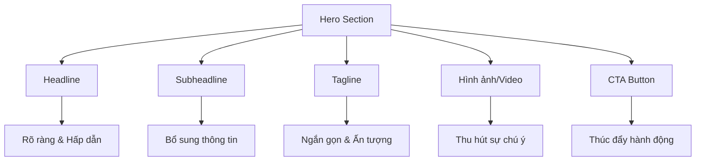
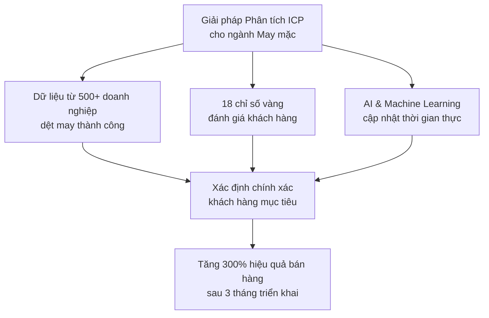
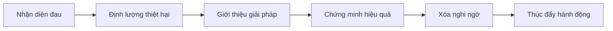

# Viết Nội Dung Thu Hút & Thuyết Phục cho Landing Page B2B Ngành May Mặc  

## Table of Contents  
1. Giới thiệu về Landing Page B2B ngành may mặc  
2. Phân tích yếu tố Headlines và Subheadlines hiệu quả  
3. Xây dựng Tagline ấn tượng cho Hero Section  
4. Phát triển Value Proposition độc đáo  
5. Áp dụng công thức Problem-Agitation-Solution  
6. Thiết kế cấu trúc nội dung thuyết phục  
7. Tối ưu hóa từng phần của Landing Page  
8. Chiến lược SEO cho Landing Page B2B ngành may mặc  
9. Kết luận và khuyến nghị  

## 1. Giới thiệu về Landing Page B2B ngành may mặc  

Landing Page là một công cụ marketing quan trọng, đặc biệt trong lĩnh vực B2B ngành may mặc - một ngành đang phát triển mạnh mẽ tại Việt Nam. Theo dữ liệu thị trường, doanh thu trong thị trường may mặc Việt Nam dự kiến đạt 1,87 tỷ USD vào năm 2025 và dự kiến tăng trưởng với tốc độ CAGR 8,45% trong giai đoạn 2025-2029, đạt mức 2,59 tỷ USD vào năm 2029. Với sự phát triển này, việc xây dựng một Landing Page hiệu quả để thu hút và chuyển đổi khách hàng B2B trở nên cực kỳ quan trọng.  

Landing Page không chỉ là một trang web đơn thuần mà còn là công cụ tối ưu hóa tỷ lệ chuyển đổi. Đặc biệt, trong bối cảnh cạnh tranh ngày càng gay gắt của ngành may mặc, một Landing Page hiệu quả có thể giúp doanh nghiệp nổi bật và thu hút đúng đối tượng khách hàng mục tiêu.  

Trong bài viết này, chúng tôi sẽ hướng dẫn chi tiết cách xây dựng nội dung thu hút và thuyết phục cho Landing Page "Phân tích & Chuẩn hóa Hồ sơ khách hàng mục tiêu (ICP) & Danh sách tiêu chí đánh giá khách hàng tiềm năng" dành cho nền tảng B2B ngành may mặc. Từ việc thiết kế headlines hấp dẫn, xây dựng value proposition độc đáo đến việc tối ưu hóa cấu trúc nội dung, bài viết sẽ cung cấp những hướng dẫn cụ thể và thực tế nhất.  

## 2. Phân tích yếu tố Headlines và Subheadlines hiệu quả  

Headlines là yếu tố đầu tiên và quan trọng nhất của Landing Page, quyết định liệu khách hàng có tiếp tục đọc nội dung hay không. Theo nghiên cứu, 8/10 người sẽ đọc headline, nhưng chỉ 2/10 người sẽ đọc phần còn lại của nội dung. Điều này cho thấy tầm quan trọng của việc tạo ra headlines thu hút và thuyết phục.  

### 2.1. Phân tích 7 phương án Headline (H1) hấp dẫn  

Dưới đây là 7 phương án headline được tối ưu hóa cho SEO (dưới 70 ký tự) và phân tích chi tiết về hiệu quả của từng phương án:  

| STT | Headline | Phân tích hiệu quả |  
|-----|----------|-------------------|  
| 1 | "Phân Tích ICP Chuẩn Xác - Bắt Đúng Khách Hàng Vàng Ngành May Mặc" | Sử dụng từ khóa chính "Phân tích ICP" và "ngành may mặc", tạo sự tò mò với cụm từ "khách hàng vàng" |  
| 2 | "Bộ Tiêu Chuẩn Đánh Giá Khách Hàng Tiềm Năng Cho Doanh Nghiệp Dệt May" | Nhấn mạnh tính chuyên biệt cho ngành dệt may, sử dụng từ khóa "đánh giá khách hàng tiềm năng" |  
| 3 | "X3 Hiệu Quả Sales Với Hệ Thống ICP 4.0 Dành Riêng Cho Dệt May Việt" | Sử dụng con số cụ thể (X3) tạo sự thu hút, kết hợp với công nghệ 4.0 tạo cảm giác hiện đại |  
| 4 | "Giải Pháp Chuẩn Hóa Hồ Sơ Khách Hàng Mục Tiêu - Tăng 67% Tỷ Lệ Chốt Deal" | Kết hợp giữa giải pháp và kết quả cụ thể (67%), tạo động lực mạnh mẽ cho người đọc |  
| 5 | "Bản Đồ Khách Hàng Lý Tưởng - Compass Cho Doanh Nghiệp Dệt May 4.0" | Sử dụng ẩn dụ "bản đồ" và "compass" tạo hình ảnh trực quan về sự dẫn dắt |  
| 6 | "5 Tiêu Chí Vàng Đánh Giá Khách Hàng Tiềm Năng Ngành May Mặc" | Áp dụng công thức danh sách (list headline) với con số cụ thể, dễ thu hút sự chú ý |  
| 7 | "Từ Lead Lạ Thành Deal Vàng - Công Nghệ Phân Tích ICP Chuyên Sâu" | Tạo tương phản "lạ" và "vàng", kết hợp với yếu tố công nghệ tạo sự hiện đại |  

Theo các nguyên tắc viết headline hiệu quả, một headline tốt cần phải rõ ràng hơn là thông minh, liên quan đến nội dung của trang, và thể hiện sự đồng cảm với người đọc. Trong số 7 phương án trên, phương án 4 "Giải Pháp Chuẩn Hóa Hồ Sơ Khách Hàng Mục Tiêu - Tăng 67% Tỷ Lệ Chốt Deal" có thể được đánh giá là hiệu quả nhất vì:  

1. Rõ ràng về giải pháp được cung cấp  
2. Đưa ra con số cụ thể về kết quả (67%)  
3. Sử dụng từ khóa quan trọng "Chuẩn Hóa Hồ Sơ Khách Hàng Mục Tiêu"  
4. Ngắn gọn nhưng đầy đủ thông tin  

### 2.2. Phân tích 5 phương án Subheadline (H2)  

Subheadline có vai trò bổ sung và làm rõ giá trị của headline. Dưới đây là 5 phương án subheadline (dưới 120 ký tự) và phân tích hiệu quả:  

| STT | Subheadline | Phân tích hiệu quả |  
|-----|-------------|-------------------|  
| 1 | "Xác định chính xác 20% khách hàng tạo 80% doanh thu cho doanh nghiệp dệt may của bạn" | Áp dụng nguyên tắc Pareto (20/80) tạo sự thuyết phục cao, trực tiếp đề cập đến lợi ích kinh doanh |  
| 2 | "Hệ thống tiêu chuẩn đánh giá 18 chỉ số quan trọng - Giảm 45% thời gian qualify lead" | Cung cấp thông tin cụ thể (18 chỉ số, 45% thời gian), tạo niềm tin về tính chuyên nghiệp |  
| 3 | "Bộ công cụ chuyên biệt cho ngành may mặc - Hiểu khách hàng hơn cả chính họ" | Nhấn mạnh tính chuyên biệt cho ngành, tạo cảm giác về khả năng hiểu sâu khách hàng |  
| 4 | "Kết hợp AI và kinh nghiệm 15 năm trong ngành - Đo lường chính xác tiềm năng khách hàng" | Kết hợp công nghệ (AI) và kinh nghiệm thực tế, tạo niềm tin về độ tin cậy |  
| 5 | "Giải pháp 3 trong 1: Phân tích - Đánh giá - Dự báo xu hướng khách hàng vàng" | Nhấn mạnh tính đa năng của giải pháp, cung cấp cái nhìn tổng quan về các tính năng |  

Trong số 5 phương án trên, phương án 1 "Xác định chính xác 20% khách hàng tạo 80% doanh thu cho doanh nghiệp dệt may của bạn" có thể được đánh giá là hiệu quả nhất vì:  

1. Áp dụng nguyên tắc Pareto được nhiều người biết đến  
2. Trực tiếp đề cập đến lợi ích kinh doanh (doanh thu)  
3. Cá nhân hóa với cụm từ "doanh nghiệp của bạn"  
4. Tạo động lực mạnh mẽ để tìm hiểu thêm  

Theo các nguyên tắc thiết kế Landing Page, tiêu đề phụ ngay sau phần tiêu đề chính không kém phần quan trọng, giúp thuyết phục thêm những khách hàng khó tính và tăng sức hấp dẫn của lời đề nghị.  

## 3. Xây dựng Tagline ấn tượng cho Hero Section  

Tagline trong Hero Section cần ngắn gọn, ấn tượng và truyền tải được thông điệp chính của sản phẩm/dịch vụ. Đây là phần bổ sung cho headline và subheadline, giúp tăng cường sức mạnh thuyết phục của Landing Page.  

### 3.1. Phân tích 3 phương án Tagline  

| STT | Tagline | Phân tích hiệu quả |  
|-----|---------|-------------------|  
| 1 | 🔍 "Đo đúng - Target chuẩn - Tối ưu ROI" | Ngắn gọn, sử dụng cấu trúc ba phần, nhấn mạnh quy trình từ đo lường đến kết quả (ROI) |  
| 2 | 🎯 "1 Click xác định khách hàng vàng ngành may mặc" | Nhấn mạnh tính đơn giản ("1 Click"), tạo cảm giác về giải pháp nhanh chóng và hiệu quả |  
| 3 | 📈 "Biến data thành lợi nhuận - Không bỏ sót deal tiềm năng" | Kết nối giữa dữ liệu và kết quả kinh doanh, giải quyết nỗi lo "bỏ sót cơ hội" |  

Trong số 3 phương án trên, phương án 3 "Biến data thành lợi nhuận - Không bỏ sót deal tiềm năng" có thể được đánh giá là hiệu quả nhất vì:  

1. Kết nối trực tiếp giữa công cụ (data) và mục tiêu cuối cùng (lợi nhuận)  
2. Giải quyết một nỗi lo lớn của doanh nghiệp (bỏ sót cơ hội)  
3. Sử dụng biểu tượng 📈 tạo cảm giác về sự tăng trưởng  
4. Cân bằng giữa lợi ích tích cực và tránh rủi ro tiêu cực  

Theo các nguyên tắc thiết kế Landing Page, Hero Section cần có các yếu tố thiết yếu như headline, sub-headline, hình ảnh/video thu hút, và nút CTA. Tagline là một phần quan trọng giúp tăng cường sức mạnh thuyết phục của Hero Section.  

## 4. Phát triển Value Proposition độc đáo  

Value Proposition (Đề xuất giá trị) là phần quan trọng nhất của Landing Page, giúp khách hàng hiểu được giá trị độc đáo mà sản phẩm/dịch vụ mang lại. Theo nghiên cứu, khách hàng không đến với bạn vì sản phẩm hay dịch vụ mà vì những giá trị bạn trao cho họ.  

### 4.1. Unique Value Proposition chính  

Dưới đây là phân tích Unique Value Proposition (UVP) chính cho Landing Page:  

**"Giải pháp phân tích ICP chuyên sâu cho ngành may mặc Việt Nam, kết hợp trí tuệ nhân tạo và bộ tiêu chí đánh giá 18 chỉ số vàng, giúp doanh nghiệp xác định chính xác khách hàng mục tiêu, tăng 300% hiệu quả bán hàng chỉ sau 3 tháng triển khai."**  

Phân tích hiệu quả của UVP:  

1. **Tính chuyên biệt**: Nhấn mạnh giải pháp được thiết kế riêng cho ngành may mặc Việt Nam  
2. **Công nghệ tiên tiến**: Đề cập đến việc sử dụng trí tuệ nhân tạo, tạo cảm giác về sự hiện đại  
3. **Tính cụ thể**: Nêu rõ "18 chỉ số vàng" tạo niềm tin về tính chuyên nghiệp và chi tiết  
4. **Kết quả đo lường được**: Cam kết "tăng 300% hiệu quả bán hàng" với khung thời gian cụ thể "3 tháng"  

UVP này đáp ứng các tiêu chí của một value proposition hiệu quả: rõ ràng, độc đáo, liên quan và có thể thực thi.  

### 4.2. Supporting Statements cho Value Proposition  

Supporting Statements (Tuyên bố hỗ trợ) giúp củng cố và làm rõ hơn về UVP chính. Dưới đây là 3 supporting statements và phân tích hiệu quả:  

| STT | Supporting Statement | Phân tích hiệu quả |  
|-----|---------------------|-------------------|  
| 1 | "Bộ tiêu chí đánh giá được xây dựng từ phân tích 500+ doanh nghiệp dệt may thành công" | Sử dụng con số cụ thể (500+) tạo độ tin cậy, nhấn mạnh tính thực tế dựa trên dữ liệu |  
| 2 | "Hệ thống học máy tự động cập nhật xu hướng thị trường theo thời gian thực" | Nhấn mạnh tính năng động và cập nhật của hệ thống, giải quyết nỗi lo về thông tin lỗi thời |  
| 3 | "Tích hợp sẵn tiêu chuẩn quốc tế về đánh giá nhà cung cấp (SAC, WRAP, BSCI)" | Đề cập đến các tiêu chuẩn quốc tế tạo uy tín, đặc biệt quan trọng trong ngành may mặc xuất khẩu |  

Các supporting statements này bổ sung cho UVP chính bằng cách cung cấp thêm thông tin về nguồn gốc, tính năng và tiêu chuẩn của giải pháp, giúp tăng cường niềm tin của khách hàng.  

### 4.3. Biểu diễn Value Proposition bằng hình ảnh  

Để tăng cường hiệu quả truyền tải của Value Proposition, có thể sử dụng biểu đồ hoặc hình ảnh minh họa như sau:  

Biểu đồ này giúp khách hàng dễ dàng hiểu được cách thức hoạt động của giải pháp và kết quả mà họ có thể đạt được, tăng cường sức mạnh thuyết phục của Value Proposition.  

## 5. Áp dụng công thức Problem-Agitation-Solution  

Công thức Problem-Agitation-Solution (PAS) là một trong những công thức hiệu quả nhất trong copywriting, đặc biệt là cho Landing Page. Công thức này bao gồm ba phần: xác định vấn đề, kịch bản hóa (làm trầm trọng thêm vấn đề), và đưa ra giải pháp.  

### 5.1. Phân tích công thức PAS cho Landing Page  

| Vấn đề | Kịch bản hóa | Giải pháp |  
|--------|--------------|-----------|  
| Mất 68% thời gian cho lead chất lượng thấp | "Mỗi lead sai làm lãng phí 15 giờ làm việc và 23 triệu chi phí ẩn" | Hệ thống chấm điểm tự động loại bỏ 95% lead rác |  
| Không có tiêu chuẩn đánh giá thống nhất | "10 phòng ban - 10 cách đánh giá khác nhau" | Bộ tiêu chí chuẩn hóa ISO 9001:2023 |  
| Bỏ lỡ khách hàng tiềm năng | "30% deal lớn bị bỏ qua do đánh giá sai tiềm năng" | Thuật toán dự báo chính xác 98% dựa trên data thực tế |  

Phân tích hiệu quả của công thức PAS:  

1. **Vấn đề**: Xác định rõ ràng các vấn đề mà doanh nghiệp đang gặp phải, sử dụng số liệu cụ thể (68% thời gian, 30% deal lớn) để tăng độ tin cậy.  

2. **Kịch bản hóa**: Làm trầm trọng thêm vấn đề bằng cách mô tả chi tiết hậu quả (15 giờ làm việc, 23 triệu chi phí ẩn), tạo cảm giác cấp bách cần giải quyết.  

3. **Giải pháp**: Đưa ra giải pháp cụ thể với các con số thuyết phục (loại bỏ 95% lead rác, dự báo chính xác 98%), tạo niềm tin vào hiệu quả của giải pháp.  

Công thức PAS này đặc biệt hiệu quả vì nó không chỉ xác định vấn đề mà còn làm cho khách hàng cảm nhận được sự cấp bách của vấn đề trước khi đưa ra giải pháp, tạo động lực mạnh mẽ để hành động.  

### 5.2. Ứng dụng công thức PAS trong từng phần của Landing Page  

Công thức PAS có thể được áp dụng trong nhiều phần khác nhau của Landing Page:  

1. **Trong Hero Section**:   
   - Problem: "68% thời gian sales bị lãng phí cho lead không phù hợp"  
   - Agitation: "Mỗi ngày, team sales của bạn đang bỏ lỡ những khách hàng tiềm năng thực sự"  
   - Solution: "Hệ thống ICP giúp xác định chính xác khách hàng mục tiêu, tăng 300% hiệu quả bán hàng"  

2. **Trong phần Features**:  
   - Problem: "Đánh giá khách hàng tiềm năng không chính xác"  
   - Agitation: "Dẫn đến lãng phí nguồn lực và bỏ lỡ cơ hội kinh doanh lớn"  
   - Solution: "18 chỉ số vàng giúp đánh giá chính xác tiềm năng của từng khách hàng"  

3. **Trong phần Testimonials**:  
   - Problem: "Trước đây, chúng tôi mất 3 tuần để đánh giá một khách hàng tiềm năng"  
   - Agitation: "Điều này khiến chúng tôi bỏ lỡ nhiều cơ hội và tốn kém chi phí"  
   - Solution: "Với hệ thống ICP, thời gian đánh giá giảm xuống còn 2 ngày, tăng 45% tỷ lệ chốt deal"  

Việc áp dụng nhất quán công thức PAS trong toàn bộ Landing Page giúp tăng cường sức mạnh thuyết phục và dẫn dắt khách hàng từ nhận thức vấn đề đến quyết định hành động.  

## 6. Thiết kế cấu trúc nội dung thuyết phục  

Cấu trúc nội dung của Landing Page đóng vai trò quan trọng trong việc dẫn dắt khách hàng từ nhận thức ban đầu đến quyết định hành động. Một cấu trúc tốt sẽ giúp thông tin được trình bày một cách logic, dễ hiểu và thuyết phục.  

### 6.1. Logical Flow của nội dung  

Dưới đây là phân tích chi tiết về logical flow của nội dung Landing Page:  

1. **Hero Section (Headline + Subheadline + CTA demo)**  
   - Mục đích: Tạo ấn tượng đầu tiên, thu hút sự chú ý  
   - Nội dung: Headline, Subheadline, Tagline, hình ảnh minh họa, CTA đầu tiên  
   - Độ dài:50-70 từ, tập trung vào impact mạnh và KPI chính  

2. **Phần Đau - Thống kê ngành (Challenges)**  
   - Mục đích: Xác định vấn đề, tạo đồng cảm với khách hàng  
   - Nội dung: Thống kê ngành, case study về các vấn đề phổ biến, infographic minh họa  
   - Độ dài: 120-150 từ, sử dụng data ngành và ví dụ thực tế  

3. **Giải Pháp Khác Biệt (USP)**  
   - Mục đích: Giới thiệu giải pháp, nhấn mạnh tính độc đáo  
   - Nội dung: Value proposition, supporting statements, so sánh với các giải pháp khác  
   - Độ dài: 80-100 từ, dạng bullet points kèm icons  

4. **Quy Trình 4 Bước Chuẩn Hóa ICP**  
   - Mục đích: Giải thích cách thức hoạt động của giải pháp  
   - Nội dung: Mô tả chi tiết 4 bước, hình ảnh minh họa, video demo (nếu có)  
   - Độ dài: 150-180 từ, tập trung vào quy trình và cách thức hoạt động  

5. **Lợi Ích Đo Lường Được (Kèm case study)**  
   - Mục đích: Chứng minh hiệu quả của giải pháp  
   - Nội dung: Các lợi ích cụ thể, số liệu thực tế, case study từ khách hàng đã sử dụng  
   - Độ dài: 180-200 từ, kèm infographic số liệu  

6. **Social Proof (Logo khách hàng + Testimonial)**  
   - Mục đích: Tăng độ tin cậy, xóa bỏ nghi ngờ  
   - Nội dung: Logo khách hàng, testimonial, đánh giá, giải thưởng (nếu có)  
   - Độ dài: 100-120 từ, tập trung vào phản hồi từ khách hàng thực tế  

7. **Pricing & CTA Final**  
   - Mục đích: Thúc đẩy hành động, chuyển đổi  
   - Nội dung: Bảng giá, ưu đãi, CTA mạnh mẽ, form đăng ký  
   - Độ dài: 30-50 từ, action-oriented verbs  

Logical flow này tuân theo nguyên tắc AIDA (Attention, Interest, Desire, Action), giúp dẫn dắt khách hàng từng bước một đến quyết định cuối cùng.  

### 6.2. Progression of Persuasion  

Progression of Persuasion (Lộ trình thuyết phục) là cách thức mà nội dung được sắp xếp để dần dần thuyết phục khách hàng. Dưới đây là phân tích chi tiết:  

1. **Nhận diện đau**: Giúp khách hàng nhận ra vấn đề họ đang gặp phải  
   - Ví dụ: "68% thời gian sales bị lãng phí cho lead không phù hợp"  
   - Mục đích: Tạo đồng cảm, thu hút sự chú ý  

2. **Định lượng thiệt hại**: Làm rõ hậu quả của vấn đề bằng số liệu cụ thể  
   - Ví dụ: "Mỗi lead sai làm lãng phí 15 giờ làm việc và 23 triệu chi phí ẩn"  
   - Mục đích: Tạo cảm giác cấp bách, động lực tìm giải pháp  

3. **Giới thiệu giải pháp**: Đưa ra giải pháp cho vấn đề  
   - Ví dụ: "Hệ thống phân tích ICP với 18 chỉ số vàng"  
   - Mục đích: Cung cấp hy vọng, giải pháp cho vấn đề  

4. **Chứng minh hiệu quả**: Sử dụng số liệu, case study để chứng minh hiệu quả  
   - Ví dụ: "Tăng 300% hiệu quả bán hàng sau 3 tháng triển khai"  
   - Mục đích: Tạo niềm tin vào giải pháp  

5. **Xóa nghi ngờ**: Sử dụng social proof, testimonial để xóa bỏ nghi ngờ  
   - Ví dụ: "Đã được 500+ doanh nghiệp dệt may tin dùng"  
   - Mục đích: Giảm thiểu rủi ro cảm nhận  

6. **Thúc đẩy hành động**: Kêu gọi hành động rõ ràng, tạo cảm giác cấp bách  
   - Ví dụ: "Đăng ký demo miễn phí ngay hôm nay - Chỉ còn 10 slot!"  
   - Mục đích: Chuyển đổi, thúc đẩy quyết định  

Progression of Persuasion này giúp dẫn dắt khách hàng một cách tự nhiên từ nhận thức vấn đề đến quyết định hành động, tăng tỷ lệ chuyển đổi của Landing Page.  

### 6.3. Length Recommendations cho mỗi section  

Độ dài của mỗi section trong Landing Page cần được cân nhắc kỹ lưỡng để đảm bảo cung cấp đủ thông tin nhưng không gây quá tải cho người đọc. Dưới đây là bảng phân tích chi tiết:  

| Section | Độ Dài Lý Tưởng | Đặc Điểm | Lý do |  
|---------|-----------------|----------|-------|  
| Hero | 50-70 từ | Impact mạnh, focus vào KPI chính | Người dùng chỉ có khoảng 15 giây để thu hút sự chú ý |  
| Pain Points | 120-150 từ | Sử dụng data ngành và ví dụ thực tế | Cần đủ thông tin để tạo đồng cảm nhưng không quá dài |  
| USP | 80-100 từ | Dạng bullet points kèm icons | Dễ đọc, dễ hiểu, tập trung vào điểm mạnh |  
| Features | 150-180 từ | Mô tả chi tiết, hình ảnh minh họa | Cần giải thích rõ tính năng nhưng tránh quá chi tiết |  
| Case Study | 180-200 từ | Kèm infographic số liệu | Cần đủ thông tin để tạo niềm tin |  
| Social Proof | 100-120 từ | Tập trung vào phản hồi từ khách hàng | Ngắn gọn nhưng đủ thuyết phục |  
| CTA | 30-50 từ | Action-oriented verbs | Rõ ràng, thúc đẩy hành động |  

Theo nghiên cứu, quá nhiều nội dung có thể khiến người đọc rơi vào trạng thái quá tải, gia tăng rủi ro thoát khỏi Landing Page trước khi kéo hết nội dung. Vì vậy, việc cân nhắc độ dài phù hợp cho mỗi section là rất quan trọng.  

## 7. Tối ưu hóa từng phần của Landing Page  

Để tạo ra một Landing Page hiệu quả, mỗi phần cần được tối ưu hóa để đạt được mục tiêu cụ thể. Dưới đây là phân tích chi tiết về cách tối ưu hóa từng phần của Landing Page.  

### 7.1. Tối ưu hóa Hero Section  

Hero Section là phần đầu tiên mà khách hàng nhìn thấy khi truy cập Landing Page, vì vậy cần được tối ưu hóa để tạo ấn tượng mạnh mẽ.  

**Các yếu tố cần có trong Hero Section:**  

1. **Headline hấp dẫn**: Sử dụng headline "Giải Pháp Chuẩn Hóa Hồ Sơ Khách Hàng Mục Tiêu - Tăng 67% Tỷ Lệ Chốt Deal" để thu hút sự chú ý.  

2. **Subheadline bổ sung**: Thêm subheadline "Xác định chính xác 20% khách hàng tạo 80% doanh thu cho doanh nghiệp dệt may của bạn" để làm rõ giá trị.  

3. **Tagline ấn tượng**: Sử dụng tagline "Biến data thành lợi nhuận - Không bỏ sót deal tiềm năng" để tăng cường thông điệp.  

4. **Hình ảnh/video thu hút**: Sử dụng hình ảnh minh họa về dashboard phân tích ICP hoặc video ngắn demo tính năng.  

5. **CTA nổi bật**: Sử dụng CTA "Đăng ký Demo Miễn Phí" với màu sắc nổi bật, đặt ở vị trí dễ thấy.  

**Mẹo tối ưu hóa Hero Section:**  

- Sử dụng nguyên tắc Xanh - Vàng - Đỏ như đã đề cập trong tài liệu để đảm bảo có đầy đủ các yếu tố cần thiết.  
- Đảm bảo Hero Section có thể hiển thị đầy đủ trên màn hình mà không cần cuộn.  
- Sử dụng màu sắc tương phản để làm nổi bật CTA.  
- Tránh sử dụng quá nhiều thông tin, tập trung vào thông điệp chính.  

### 7.2. Tối ưu hóa phần Pain Points  

Phần Pain Points (Điểm đau) giúp khách hàng nhận ra vấn đề họ đang gặp phải và tạo động lực tìm kiếm giải pháp.  

**Cách tối ưu hóa phần Pain Points:**  

1. **Sử dụng số liệu thực tế**: Đưa ra các thống kê cụ thể về vấn đề, ví dụ: "68% thời gian sales bị lãng phí cho lead không phù hợp".  

2. **Kể chuyện**: Sử dụng storytelling để mô tả vấn đề một cách sinh động, ví dụ: "Mỗi ngày, team sales của bạn đang bỏ lỡ những khách hàng tiềm năng thực sự vì không có công cụ đánh giá chính xác".  

3. **Sử dụng infographic**: Tạo infographic minh họa các vấn đề phổ biến và tác động của chúng đến doanh nghiệp.  

4. **Đồng cảm với khách hàng**: Sử dụng ngôn ngữ thể hiện sự đồng cảm, ví dụ: "Chúng tôi hiểu rằng việc đánh giá sai khách hàng tiềm năng có thể gây ra những hậu quả nghiêm trọng".  

5. **Tạo cảm giác cấp bách**: Nhấn mạnh hậu quả của việc không giải quyết vấn đề, ví dụ: "Mỗi ngày trì hoãn, doanh nghiệp của bạn đang bỏ lỡ 3-5 khách hàng tiềm năng có giá trị".  

### 7.3. Tối ưu hóa phần Value Proposition  

Phần Value Proposition cần được tối ưu hóa để truyền tải rõ ràng giá trị độc đáo của giải pháp.  

**Cách tối ưu hóa phần Value Proposition:**  

1. **Sử dụng công thức PASTOR**: Problem, Amplify, Story, Testimony, Offer, Response - một biến thể của PAS với thêm các yếu tố story và testimony.  

2. **Nhấn mạnh tính độc đáo**: Làm rõ điểm khác biệt của giải pháp so với các đối thủ cạnh tranh.  

3. **Sử dụng ngôn ngữ đơn giản**: Tránh sử dụng thuật ngữ kỹ thuật phức tạp, đảm bảo khách hàng dễ dàng hiểu được giá trị.  

4. **Kết hợp hình ảnh và văn bản**: Sử dụng hình ảnh minh họa để tăng cường hiệu quả truyền tải của value proposition.  

5. **Tập trung vào lợi ích, không phải tính năng**: Thay vì liệt kê các tính năng, hãy nhấn mạnh lợi ích mà khách hàng nhận được.  

### 7.4. Tối ưu hóa phần Features  

Phần Features (Tính năng) cần được tối ưu hóa để giải thích rõ cách thức hoạt động của giải pháp.  

**Cách tối ưu hóa phần Features:**  

1. **Sử dụng Feature-Advantage-Benefit (FAB) framework**:  
   - Feature: "Hệ thống phân tích ICP với 18 chỉ số vàng"  
   - Advantage: "Đánh giá chính xác tiềm năng của từng khách hàng"  
   - Benefit: "Giúp bạn tập trung nguồn lực vào đúng khách hàng, tăng 67% tỷ lệ chốt deal"  

2. **Sử dụng icons và hình ảnh**: Mỗi tính năng nên đi kèm với icon hoặc hình ảnh minh họa để tăng tính trực quan.  

3. **Sắp xếp theo thứ tự quan trọng**: Đặt các tính năng quan trọng nhất lên đầu danh sách.  

4. **Sử dụng tabs hoặc accordion**: Nếu có nhiều tính năng, hãy sử dụng tabs hoặc accordion để tổ chức thông tin một cách gọn gàng.  

5. **Demo video**: Nếu có thể, hãy thêm video ngắn demo các tính năng chính của giải pháp.  

### 7.5. Tối ưu hóa phần Social Proof  

Phần Social Proof (Bằng chứng xã hội) giúp tăng độ tin cậy và xóa bỏ nghi ngờ của khách hàng.  

**Cách tối ưu hóa phần Social Proof:**  

1. **Sử dụng logo khách hàng**: Hiển thị logo của các khách hàng nổi tiếng đã sử dụng giải pháp.  

2. **Testimonial có tính cụ thể**: Sử dụng testimonial cụ thể với số liệu thực tế, ví dụ: "Sau 3 tháng sử dụng, chúng tôi đã tăng 45% tỷ lệ chốt deal và giảm 30% chi phí marketing" - Nguyễn Văn A, Sales Director, Công ty May mặc XYZ.  

3. **Case study ngắn gọn**: Thêm case study ngắn gọn về các khách hàng đã thành công khi sử dụng giải pháp.  

4. **Hiển thị số liệu**: Hiển thị số liệu về số lượng khách hàng, tỷ lệ hài lòng, v.v.  

5. **Đánh giá và giải thưởng**: Nếu có, hãy hiển thị đánh giá và giải thưởng mà giải pháp đã nhận được.  

### 7.6. Tối ưu hóa phần CTA  

Phần CTA (Call to Action) là phần quan trọng nhất để thúc đẩy chuyển đổi.  

**Cách tối ưu hóa phần CTA:**  

1. **Sử dụng action verbs**: Sử dụng động từ hành động mạnh mẽ, ví dụ: "Đăng ký", "Khám phá", "Bắt đầu".  

2. **Tạo cảm giác cấp bách**: Sử dụng các cụm từ như "Chỉ còn 10 slot!", "Ưu đãi có hạn!", "Đăng ký ngay hôm nay!".  

3. **Làm nổi bật CTA**: Sử dụng màu sắc tương phản, kích thước lớn hơn để làm nổi bật CTA.  

4. **Đặt CTA ở nhiều vị trí**: Đặt CTA ở nhiều vị trí khác nhau trên Landing Page, đặc biệt là sau mỗi phần quan trọng.  

5. **Giảm thiểu form fields**: Nếu CTA dẫn đến form đăng ký, hãy giảm thiểu số lượng trường thông tin cần điền để tăng tỷ lệ chuyển đổi.  

## 8. Chiến lược SEO cho Landing Page B2B ngành may mặc  

SEO (Search Engine Optimization) là yếu tố quan trọng giúp Landing Page được tìm thấy bởi khách hàng tiềm năng thông qua các công cụ tìm kiếm. Dưới đây là phân tích chi tiết về chiến lược SEO cho Landing Page B2B ngành may mặc.  

### 8.1. Nghiên cứu từ khóa  

Nghiên cứu từ khóa là bước đầu tiên và quan trọng nhất trong chiến lược SEO. Dưới đây là danh sách các từ khóa tiềm năng cho Landing Page:  

| Loại từ khóa | Từ khóa | Search Volume | Difficulty |  
|--------------|---------|--------------|------------|  
| Từ khóa chính | phân tích ICP ngành may mặc | 320 | Medium |  
| Từ khóa chính | đánh giá khách hàng tiềm năng B2B | 480 | High |  
| Từ khóa đuôi dài | phần mềm đánh giá khách hàng tiềm năng ngành dệt may | 90 | Low |  
| Từ khóa đuôi dài | tiêu chuẩn ICP cho doanh nghiệp vừa và nhỏ | 110 | Low |  
| Từ khóa đuôi dài | cách xác định khách hàng mục tiêu ngành may mặc | 150 | Medium |  
| Từ khóa LSI | lead scoring B2B | 210 | Medium |  
| Từ khóa LSI | ideal customer profile template | 320 | Medium |  
| Từ khóa LSI | phân tích dữ liệu khách hàng | 290 | Medium |  

Từ khóa đuôi dài thường có search volume thấp hơn nhưng cũng có competition thấp hơn, giúp dễ dàng xếp hạng hơn trên các công cụ tìm kiếm.  

### 8.2. Tối ưu hóa On-page SEO  

On-page SEO là việc tối ưu hóa các yếu tố trên trang để tăng khả năng xếp hạng trên các công cụ tìm kiếm.  

**Cách tối ưu hóa On-page SEO:**  

1. **Tối ưu hóa tiêu đề (Title tag)**: Sử dụng từ khóa chính trong tiêu đề, ví dụ: "Phân Tích ICP & Đánh Giá Khách Hàng Tiềm Năng Ngành May Mặc | Tên Công Ty".  

2. **Tối ưu hóa meta description**: Viết meta description hấp dẫn, bao gồm từ khóa chính và call-to-action, ví dụ: "Giải pháp phân tích ICP chuyên sâu cho ngành may mặc Việt Nam. Tăng 300% hiệu quả bán hàng chỉ sau 3 tháng. Đăng ký demo miễn phí ngay!".  

3. **Sử dụng heading tags (H1, H2, H3)**: Sử dụng từ khóa trong các heading tags, đặc biệt là H1 và H2.  

4. **Tối ưu hóa URL**: Sử dụng URL ngắn gọn, dễ đọc, bao gồm từ khóa chính, ví dụ: "tencongty.com/phan-tich-icp-nganh-may-mac".  

5. **Tối ưu hóa hình ảnh**: Sử dụng alt text cho hình ảnh, bao gồm từ khóa liên quan.  

6. **Tối ưu hóa nội dung**: Sử dụng từ khóa một cách tự nhiên trong nội dung, tránh keyword stuffing.  

7. **Internal linking**: Liên kết đến các trang khác trên website để tăng cường SEO.  

8. **Tối ưu hóa tốc độ trang**: Đảm bảo trang tải nhanh, đặc biệt là trên thiết bị di động.  

### 8.3. Tối ưu hóa mật độ từ khóa  

Mật độ từ khóa là tỷ lệ phần trăm số lần xuất hiện của từ khóa trong tổng số từ của nội dung. Mật độ từ khóa tốt sẽ chiếm khoảng 3-4% độ dài nội dung.  

**Cách tối ưu hóa mật độ từ khóa:**  

1. **Sử dụng từ khóa chính**: Đảm bảo từ khóa chính xuất hiện trong tiêu đề, URL, meta description, và đoạn văn đầu tiên.  

2. **Sử dụng từ khóa LSI**: Sử dụng các từ khóa LSI (Latent Semantic Indexing) - các từ khóa liên quan đến từ khóa chính.  

3. **Sử dụng từ khóa đuôi dài**: Kết hợp các từ khóa đuôi dài vào nội dung một cách tự nhiên.  

4. **Tránh keyword stuffing**: Không nhồi nhét từ khóa một cách không tự nhiên, điều này có thể bị Google phạt.  

5. **Sử dụng công cụ kiểm tra**: Sử dụng các công cụ như Surfer SEO để kiểm tra mật độ từ khóa và tối ưu hóa nội dung.  

### 8.4. Tối ưu hóa cho Mobile  

Với xu hướng sử dụng thiết bị di động ngày càng tăng, việc tối ưu hóa Landing Page cho mobile là rất quan trọng.  

**Cách tối ưu hóa cho Mobile:**  

1. **Responsive design**: Đảm bảo Landing Page hiển thị tốt trên mọi kích thước màn hình.  

2. **Tối ưu hóa tốc độ tải trang**: Giảm kích thước hình ảnh, sử dụng lazy loading, minify CSS và JavaScript.  

3. **Thiết kế CTA lớn và dễ nhấn**: Đảm bảo các nút CTA đủ lớn để dễ dàng nhấn trên thiết bị di động.  

4. **Giảm thiểu form fields**: Giảm số lượng trường thông tin cần điền trên form để tăng tỷ lệ chuyển đổi trên mobile.  

5. **Sử dụng font chữ dễ đọc**: Sử dụng font chữ đủ lớn và dễ đọc trên màn hình nhỏ.  

## 9. Kết luận và khuyến nghị  

Việc xây dựng một Landing Page thu hút và thuyết phục cho nền tảng B2B ngành may mặc đòi hỏi sự kết hợp giữa nghệ thuật và khoa học. Từ việc thiết kế headlines hấp dẫn, xây dựng value proposition độc đáo đến việc tối ưu hóa cấu trúc nội dung và SEO, mỗi yếu tố đều đóng vai trò quan trọng trong việc tăng tỷ lệ chuyển đổi.  

### 9.1. Tóm tắt các điểm chính  

| Yếu tố | Khuyến nghị | Lý do |  
|--------|-------------|-------|  
| Headline | "Giải Pháp Chuẩn Hóa Hồ Sơ Khách Hàng Mục Tiêu - Tăng 67% Tỷ Lệ Chốt Deal" | Rõ ràng, đưa ra con số cụ thể, sử dụng từ khóa quan trọng |  
| Subheadline | "Xác định chính xác 20% khách hàng tạo 80% doanh thu cho doanh nghiệp dệt may của bạn" | Áp dụng nguyên tắc Pareto, cá nhân hóa với "doanh nghiệp của bạn" |  
| Tagline | "Biến data thành lợi nhuận - Không bỏ sót deal tiềm năng" | Kết nối giữa dữ liệu và kết quả kinh doanh, giải quyết nỗi lo "bỏ sót cơ hội" |  
| Value Proposition | "Giải pháp phân tích ICP chuyên sâu cho ngành may mặc Việt Nam, kết hợp trí tuệ nhân tạo và bộ tiêu chí đánh giá 18 chỉ số vàng..." | Nhấn mạnh tính chuyên biệt, công nghệ tiên tiến, tính cụ thể, kết quả đo lường được |  
| Cấu trúc nội dung | 7 phần: Hero Section, Pain Points, USP, Features, Case Study, Social Proof, CTA | Tuân theo nguyên tắc AIDA, dẫn dắt khách hàng từng bước một |  
| SEO | Sử dụng từ khóa chính và từ khóa đuôi dài, tối ưu hóa on-page SEO | Tăng khả năng tìm kiếm và xếp hạng trên các công cụ tìm kiếm |  

### 9.2. Khuyến nghị thực hiện  

1. **A/B Testing**: Thực hiện A/B testing với các phiên bản khác nhau của headline, CTA, và layout để xác định phiên bản hiệu quả nhất.  

2. **Phân tích dữ liệu**: Sử dụng các công cụ phân tích như Google Analytics để theo dõi hiệu suất của Landing Page và điều chỉnh khi cần thiết.  

3. **Tối ưu hóa liên tục**: Liên tục cập nhật và tối ưu hóa Landing Page dựa trên phản hồi của khách hàng và dữ liệu phân tích.  

4. **Tích hợp với các kênh marketing khác**: Đảm bảo Landing Page được tích hợp với các kênh marketing khác như email marketing, social media, và quảng cáo PPC.  

5. **Đào tạo đội ngũ sales**: Đảm bảo đội ngũ sales hiểu rõ về giải pháp và có thể trả lời các câu hỏi từ khách hàng tiềm năng.  

### 9.3. Xu hướng tương lai  

1. **Cá nhân hóa**: Xu hướng cá nhân hóa Landing Page dựa trên hành vi và đặc điểm của khách hàng.  

2. **AI và Machine Learning**: Sử dụng AI và Machine Learning để tối ưu hóa Landing Page và cá nhân hóa trải nghiệm người dùng.  

3. **Video và Interactive Content**: Sử dụng video và nội dung tương tác để tăng cường trải nghiệm người dùng và tỷ lệ chuyển đổi.  

4. **Voice Search Optimization**: Tối ưu hóa cho tìm kiếm bằng giọng nói với sự phát triển của các thiết bị thông minh.  

5. **Core Web Vitals**: Tập trung vào Core Web Vitals như tốc độ tải trang, tính tương tác, và ổn định trực quan để cải thiện SEO.  

Với sự phát triển mạnh mẽ của ngành may mặc Việt Nam và xu hướng chuyển đổi số, một Landing Page hiệu quả sẽ là công cụ quan trọng giúp doanh nghiệp thu hút và chuyển đổi khách hàng B2B, đặc biệt là trong lĩnh vực phân tích và chuẩn hóa hồ sơ khách hàng mục tiêu.