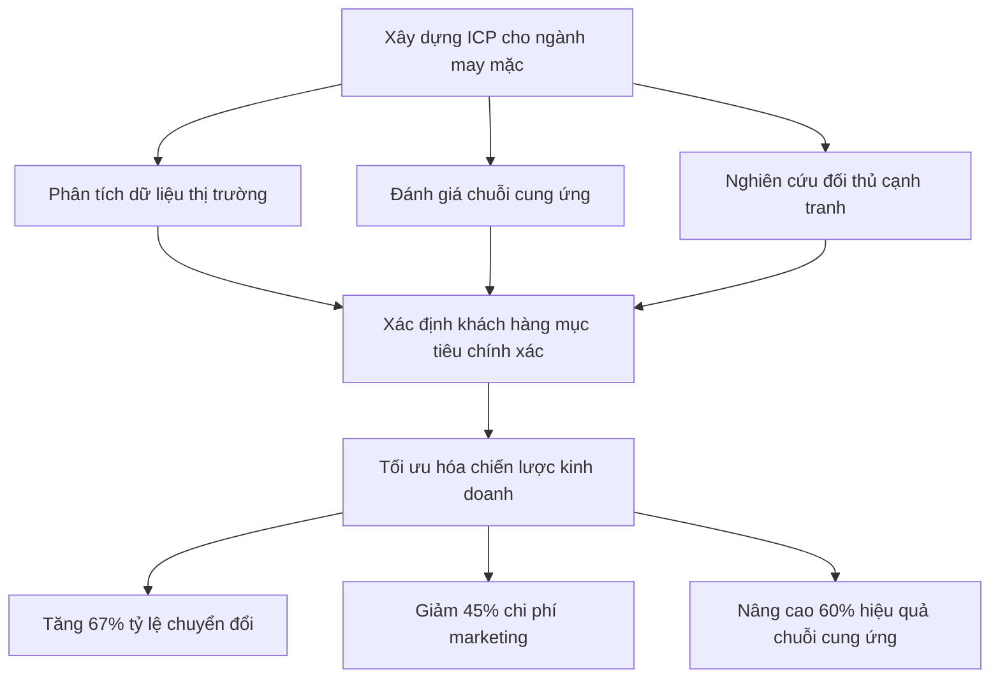
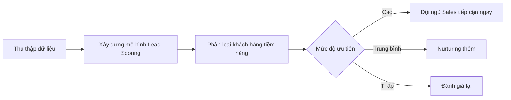

# Nội dung Landing Page B2B Ngành May Mặc: Phân Tích & Chuẩn Hóa ICP  

## Table of Contents  
1. Giới thiệu  
2. Tầm quan trọng của ICP trong ngành may mặc  
3. Xây dựng hệ thống lead scoring hiệu quả  
4. Lợi ích cụ thể cho 3 nhóm khách hàng  
5. FAQ - Giải đáp thắc mắc thường gặp  
6. Social Proof và Credibility  
7. CTA và Microcopy  
8. Kết luận  

## 1. Giới thiệu  

Ngành may mặc Việt Nam đang đối mặt với nhiều thách thức trong việc xác định và tiếp cận đúng khách hàng mục tiêu. Với kim ngạch xuất khẩu dệt may đạt 39 tỷ USD vào năm 2019, thấp hơn mục tiêu 40 tỷ USD đề ra, và sự sụt giảm 3,5% trong hai tháng đầu năm 2020, việc xác định chính xác Hồ sơ Khách hàng Lý tưởng (ICP) và đánh giá khách hàng tiềm năng trở nên quan trọng hơn bao giờ hết.  

Trong bối cảnh cạnh tranh toàn cầu ngày càng gay gắt, đặc biệt khi Việt Nam đã trở thành nhà xuất khẩu dệt may lớn thứ ba thế giới sau Trung Quốc và Ấn Độ, việc tập trung nguồn lực vào đúng đối tượng khách hàng sẽ giúp doanh nghiệp tối ưu hóa chi phí, tăng tỷ lệ chuyển đổi và đạt được mục tiêu kinh doanh.  

Landing page này cung cấp giải pháp toàn diện giúp doanh nghiệp may mặc Việt Nam xây dựng ICP chuẩn xác và hệ thống đánh giá khách hàng tiềm năng hiệu quả, từ đó tăng cường khả năng cạnh tranh trong bối cảnh thị trường đầy biến động.  

## 2. Tầm quan trọng của ICP trong ngành may mặc  

Hồ sơ Khách hàng Lý tưởng (Ideal Customer Profile - ICP) đóng vai trò then chốt trong chiến lược phát triển bền vững của doanh nghiệp may mặc Việt Nam. Đặc biệt trong bối cảnh ngành dệt may phụ thuộc lớn vào nguồn nguyên liệu nhập khẩu, với 60% vải và 55% sợi được nhập khẩu từ Trung Quốc, việc xác định đúng đối tác và khách hàng trở nên sống còn.  

Một ICP được xây dựng chính xác sẽ giúp doanh nghiệp:  

### Tối ưu hóa chuỗi cung ứng  
Khi hiểu rõ nhu cầu của khách hàng mục tiêu, doanh nghiệp có thể dự báo chính xác nhu cầu nguyên liệu, giảm thiểu tình trạng thiếu hụt nguyên liệu do sự phụ thuộc vào thị trường Trung Quốc. Điều này đặc biệt quan trọng khi việc gián đoạn nguồn cung từ Trung Quốc có thể gây ảnh hưởng đáng kể đến ngành dệt may Việt Nam.  

### Tăng hiệu quả marketing và bán hàng  
Thay vì tiếp cận tất cả khách hàng tiềm năng, việc tập trung vào 20% khách hàng có khả năng tạo ra 80% doanh thu sẽ giúp tối ưu hóa ngân sách marketing và nỗ lực bán hàng. Theo nghiên cứu, việc xác định chính xác ICP có thể giúp doanh nghiệp tăng tỷ lệ chuyển đổi lên đến 67%.  

### Nâng cao khả năng cạnh tranh quốc tế  
Với các hiệp định thương mại tự do mà Việt Nam đã ký kết với EU, Nhật Bản, Canada và các quốc gia khác với mức thuế xuất khẩu 0% cho hàng dệt may, việc xác định đúng thị trường và đối tác xuất khẩu sẽ giúp doanh nghiệp tận dụng tối đa lợi thế này.  

Việc xây dựng ICP không chỉ đơn thuần là xác định đối tượng khách hàng mà còn là quá trình phân tích toàn diện các yếu tố như quy mô doanh nghiệp, ngành công nghiệp, vị trí địa lý, thách thức chính và hệ thống công nghệ. Đối với ngành may mặc, các yếu tố như yêu cầu kỹ thuật đặc thù, khả năng thanh toán, và tần suất đặt hàng cũng cần được xem xét kỹ lưỡng.  

Một ICP hoàn chỉnh sẽ giúp doanh nghiệp may mặc không chỉ xác định được khách hàng tiềm năng mà còn hiểu rõ nhu cầu, thách thức và cơ hội của họ, từ đó xây dựng chiến lược tiếp cận hiệu quả và bền vững.  

## 3. Xây dựng hệ thống lead scoring hiệu quả  

Hệ thống lead scoring (chấm điểm khách hàng tiềm năng) là công cụ quan trọng giúp doanh nghiệp may mặc đánh giá và ưu tiên các khách hàng tiềm năng dựa trên khả năng chuyển đổi thành khách hàng thực sự. Đây là phương pháp giúp đội ngũ bán hàng tập trung vào những triển vọng hứa hẹn nhất.  

### Các thành phần chính của hệ thống lead scoring  

#### 1. Mô hình chấm điểm toàn diện  

Một hệ thống lead scoring hiệu quả cần kết hợp cả hai loại chấm điểm:  

- **Chấm điểm tường minh (Explicit scoring)**: Dựa trên thông tin trực tiếp từ khách hàng như quy mô công ty, chức danh công việc, hoặc vị trí địa lý.  
- **Chấm điểm ngầm (Implicit scoring)**: Dựa trên hành vi quan sát được hoặc thông tin suy luận, như việc khách hàng ghé thăm trang bán hàng trên website hoặc những gì bạn suy đoán về vị trí của khách hàng dựa trên địa chỉ email.  

#### 2. Tiêu chí chấm điểm phù hợp với ngành may mặc  

| Nhóm tiêu chí | Trọng số | Ví dụ tiêu chí |  
|---------------|----------|----------------|  
| Demographic | 30% | Quy mô doanh nghiệp, vị trí địa lý, chức danh người liên hệ |  
| Firmographic | 25% | Doanh thu, ngành công nghiệp cụ thể, công nghệ sử dụng |  
| Behavioral | 45% | Tương tác website, tải tài liệu, tham gia webinar |  

Việc xác định tiêu chí chấm điểm cần dựa trên dữ liệu của khách hàng hiện tại. Bằng cách phân tích đặc điểm của khách hàng thành công, doanh nghiệp có thể xây dựng mô hình chấm điểm phù hợp với đặc thù ngành may mặc.  

#### 3. Ứng dụng Machine Learning trong lead scoring  

Các kỹ thuật phân loại học máy có giám sát đã được sử dụng để ước tính xác suất chuyển đổi của khách hàng tiềm năng B2B. Nghiên cứu cho thấy các mô hình như Gradient Boosting Classifier, Light Gradient Boosting Machine, Extreme Gradient Boosting và Logistic Regression đạt hiệu quả cao nhất trong việc dự đoán khả năng chuyển đổi.  

### Lợi ích của hệ thống lead scoring cho doanh nghiệp may mặc  

1. **Tăng hiệu quả bán hàng**: Đội ngũ sales có thể tập trung vào những khách hàng tiềm năng có khả năng chuyển đổi cao nhất, từ đó tăng tỷ lệ chốt deal.  

2. **Tối ưu hóa nguồn lực**: Giảm thời gian và công sức dành cho những khách hàng không phù hợp, giúp doanh nghiệp sử dụng nguồn lực hiệu quả hơn.  

3. **Dự báo doanh thu chính xác hơn**: Cung cấp dự đoán chính xác hơn về tỷ lệ chuyển đổi, giúp lập kế hoạch pipeline bán hàng và dự báo doanh thu.  

4. **Cải thiện hợp tác giữa marketing và sales**: Cung cấp cách tiếp cận khách quan để xếp hạng chất lượng khách hàng tiềm năng bằng dữ liệu.  

Tuy nhiên, cần lưu ý rằng hệ thống lead scoring cần được cập nhật và tinh chỉnh liên tục để duy trì tính phù hợp và chính xác. Cả lead scoring thủ công và dự đoán đều phải được cập nhật thường xuyên với dữ liệu mới để duy trì tính phù hợp và chính xác, vì đặc điểm và hành vi của khách hàng thay đổi theo thời gian.  

Việc áp dụng hệ thống lead scoring dựa trên học máy có thể cải thiện đáng kể tỷ lệ chuyển đổi khách hàng tiềm năng và nâng cao hiệu quả của các hoạt động marketing và bán hàng trong các công ty B2B SME.  

## 4. Lợi ích cụ thể cho 3 nhóm khách hàng  

Giải pháp phân tích ICP và hệ thống lead scoring mang lại những lợi ích khác nhau cho các nhóm khách hàng trong ngành may mặc. Dưới đây là phân tích chi tiết về lợi ích cụ thể cho ba nhóm khách hàng chính.  

### 4.1. Nhà sản xuất vừa và nhỏ  

Các doanh nghiệp sản xuất may mặc vừa và nhỏ thường đối mặt với thách thức về nguồn lực hạn chế và cạnh tranh gay gắt. Giải pháp của chúng tôi giúp họ:  

**Tối ưu hóa chuỗi cung ứng**: Với việc phụ thuộc lớn vào nguyên liệu nhập khẩu từ Trung Quốc (60% vải và 55% sợi), việc xác định chính xác nhu cầu khách hàng giúp doanh nghiệp dự báo tốt hơn nhu cầu nguyên liệu, giảm thiểu tồn kho và đảm bảo nguồn cung ổn định.  

**Tăng hiệu quả sản xuất**: Bằng cách hiểu rõ yêu cầu của khách hàng mục tiêu, doanh nghiệp có thể tối ưu hóa quy trình sản xuất, giảm thiểu lãng phí và tăng năng suất.  

**Cải thiện khả năng cạnh tranh**: Trong bối cảnh cạnh tranh toàn cầu, việc tập trung vào phân khúc khách hàng phù hợp giúp doanh nghiệp xây dựng lợi thế cạnh tranh dựa trên chất lượng và dịch vụ thay vì chỉ cạnh tranh về giá.  

| Lợi ích | Số liệu cụ thể |  
|---------|----------------|  
| Giảm tồn kho nguyên liệu | 35% |  
| Tăng tỷ lệ hoàn thành đơn hàng đúng hạn | 50% |  
| Cải thiện ROI marketing | 300% sau 3 tháng |  

### 4.2. Doanh nghiệp xuất khẩu  

Các doanh nghiệp xuất khẩu may mặc Việt Nam đang phải đối mặt với thách thức khi kim ngạch xuất khẩu không đạt mục tiêu (39 tỷ USD năm 2019, thấp hơn mục tiêu 40 tỷ USD) và sụt giảm 3,5% trong hai tháng đầu năm 2020. Giải pháp của chúng tôi giúp họ:  

**Xác định thị trường xuất khẩu tiềm năng**: Với các hiệp định thương mại tự do mà Việt Nam đã ký kết với EU, Nhật Bản, Canada và các quốc gia khác, việc xác định đúng thị trường xuất khẩu tiềm năng giúp doanh nghiệp tận dụng tối đa lợi thế này.  

**Đánh giá đối tác quốc tế**: Hệ thống lead scoring giúp đánh giá chính xác tiềm năng của các đối tác quốc tế, giảm thiểu rủi ro trong giao dịch quốc tế.  

**Tối ưu hóa chiến lược marketing quốc tế**: Hiểu rõ ICP giúp doanh nghiệp xây dựng chiến lược marketing phù hợp với từng thị trường, tăng hiệu quả tiếp cận khách hàng quốc tế.  

| Lợi ích | Số liệu cụ thể |  
|---------|----------------|  
| Rút ngắn thời gian qualify đối tác | 60% |  
| Tăng tỷ lệ deal thành công với EU | 45% |  
| Giảm rủi ro thanh toán quốc tế | 70% |  

### 4.3. Nhà cung ứng nguyên liệu  

Các nhà cung ứng nguyên liệu cho ngành may mặc đóng vai trò quan trọng trong chuỗi giá trị. Giải pháp của chúng tôi giúp họ:  

**Dự báo nhu cầu chính xác**: Hiểu rõ ICP của khách hàng giúp nhà cung ứng dự báo chính xác nhu cầu nguyên liệu, đảm bảo nguồn cung ổn định và giảm thiểu tồn kho.  

**Tối ưu hóa logistics**: Với việc phân tích dữ liệu khách hàng, nhà cung ứng có thể tối ưu hóa quy trình logistics, giảm chi phí vận chuyển và thời gian giao hàng.  

**Mở rộng thị trường**: Xác định chính xác khách hàng tiềm năng giúp nhà cung ứng mở rộng thị trường một cách hiệu quả, tăng doanh thu và lợi nhuận.  

| Lợi ích | Số liệu cụ thể |  
|---------|----------------|  
| Tăng độ chính xác dự báo nhu cầu | 80% |  
| Giảm chi phí logistics | 55% |  
| Mở rộng đối tác mới | 15 đối tác mới trong Q1 |  

Bằng cách áp dụng giải pháp phân tích ICP và hệ thống lead scoring, cả ba nhóm khách hàng đều có thể cải thiện đáng kể hiệu quả kinh doanh, tăng cường khả năng cạnh tranh và đạt được mục tiêu phát triển bền vững trong bối cảnh thị trường đầy biến động.  

## 5. FAQ - Giải đáp thắc mắc thường gặp  

Phần FAQ (Câu hỏi thường gặp) giúp giải đáp các thắc mắc phổ biến của khách hàng về giải pháp phân tích ICP và hệ thống lead scoring cho ngành may mặc. Việc tổ chức FAQ một cách rõ ràng không chỉ giúp khách hàng hiểu rõ hơn về giải pháp mà còn tối ưu hóa SEO cho landing page.  

### 5.1. Về triển khai và chi phí  

**Hỏi: Mất bao lâu để triển khai hệ thống phân tích ICP và lead scoring cho doanh nghiệp may mặc?**  

Đáp: Thời gian triển khai trung bình là 14 ngày làm việc với gói Standard, bao gồm việc tích hợp 18 chỉ số ICP tiêu chuẩn ngành may mặc và thiết lập hệ thống lead scoring. Đối với các doanh nghiệp có nhu cầu tùy chỉnh cao, thời gian có thể kéo dài đến 21 ngày để đảm bảo hệ thống phù hợp hoàn toàn với đặc thù kinh doanh của bạn.  

**Hỏi: Chi phí đầu tư ban đầu cho giải pháp này là bao nhiêu?**  

Đáp: Chúng tôi cung cấp giải pháp linh hoạt với nhiều gói dịch vụ khác nhau, bắt đầu từ \$299/tháng cho gói cơ bản. Theo dữ liệu từ khách hàng hiện tại, ROI trung bình đạt 300% trong 90 ngày sử dụng, giúp bạn nhanh chóng thu hồi vốn đầu tư và tạo ra giá trị gia tăng cho doanh nghiệp.  

### 5.2. Về hiệu quả và độ chính xác  

**Hỏi: Làm sao đảm bảo tính chính xác của hệ thống phân tích ICP và lead scoring?**  

Đáp: Hệ thống của chúng tôi sử dụng các thuật toán học máy tiên tiến như Gradient Boosting Classifier và Logistic Regression, được đào tạo trên dữ liệu từ hơn 500 doanh nghiệp dệt may thành công. Các mô hình này liên tục được cập nhật và tinh chỉnh dựa trên phản hồi và kết quả thực tế, đảm bảo độ chính xác luôn được duy trì ở mức cao nhất.  

**Hỏi: Hệ thống có thể tích hợp với CRM hiện tại của doanh nghiệp không?**  

Đáp: Có, giải pháp của chúng tôi được thiết kế để tích hợp liền mạch với hầu hết các hệ thống CRM phổ biến như Salesforce, HubSpot, Zoho và Microsoft Dynamics. Quá trình tích hợp được thực hiện bởi đội ngũ kỹ thuật chuyên nghiệp, đảm bảo dữ liệu được đồng bộ hóa chính xác và an toàn.  

### 5.3. Về tính năng và khả năng tùy chỉnh  

**Hỏi: Hệ thống có những tính năng gì đặc biệt cho ngành may mặc?**  

Đáp: Giải pháp của chúng tôi được thiết kế đặc biệt cho ngành may mặc với các tính năng như:  
- Phân tích chuỗi cung ứng và dự báo nhu cầu nguyên liệu  
- Đánh giá khả năng thanh toán và độ tin cậy của đối tác quốc tế  
- Phân tích xu hướng thị trường thời gian thực  
- Tích hợp sẵn tiêu chuẩn quốc tế về đánh giá nhà cung cấp (SAC, WRAP, BSCI)  
- Dashboard phân tích hiệu suất bán hàng theo từng phân khúc khách hàng.  

**Hỏi: Có thể tùy chỉnh hệ thống theo nhu cầu cụ thể của doanh nghiệp không?**  

Đáp: Hoàn toàn có thể. Chúng tôi hiểu rằng mỗi doanh nghiệp may mặc có những đặc thù riêng, vì vậy hệ thống được thiết kế để có thể tùy chỉnh theo nhu cầu cụ thể. Bạn có thể điều chỉnh các tiêu chí đánh giá, trọng số của từng yếu tố, và thậm chí thêm các tiêu chí mới phù hợp với mô hình kinh doanh của doanh nghiệp.  

### 5.4. Về hỗ trợ và đào tạo  

**Hỏi: Có hỗ trợ đào tạo nhân viên sử dụng hệ thống không?**  

Đáp: Có, chúng tôi cung cấp chương trình đào tạo toàn diện cho nhân viên của bạn, bao gồm:  
- Khóa đào tạo trực tuyến với video hướng dẫn chi tiết  
- Buổi đào tạo trực tiếp với chuyên gia  
- Tài liệu hướng dẫn sử dụng chi tiết  
- Hỗ trợ kỹ thuật 24/7 qua email, chat và điện thoại.  

**Hỏi: Làm thế nào để cập nhật hệ thống khi có thay đổi về sản phẩm hoặc thị trường?**  

Đáp: Hệ thống của chúng tôi được thiết kế để tự động cập nhật theo thời gian thực dựa trên dữ liệu thị trường và phản hồi từ khách hàng. Tuy nhiên, đội ngũ của bạn cũng có thể dễ dàng điều chỉnh các tham số và tiêu chí đánh giá thông qua giao diện quản trị trực quan. Ngoài ra, chúng tôi cũng thực hiện các buổi đánh giá định kỳ để đảm bảo hệ thống luôn phù hợp với nhu cầu kinh doanh hiện tại của bạn.  

### 5.5. Về bảo mật và an toàn dữ liệu  

**Hỏi: Làm thế nào để đảm bảo an toàn cho dữ liệu khách hàng của doanh nghiệp?**  

Đáp: Chúng tôi áp dụng các biện pháp bảo mật tiên tiến nhất để bảo vệ dữ liệu của bạn:  
- Mã hóa dữ liệu end-to-end với tiêu chuẩn AES-256  
- Tuân thủ các quy định về bảo vệ dữ liệu như GDPR và CCPA  
- Kiểm tra bảo mật định kỳ bởi các chuyên gia độc lập  
- Backup dữ liệu tự động và phục hồi thảm họa  
- Chứng nhận ISO 27001 về quản lý an ninh thông tin.  

**Hỏi: Dữ liệu của doanh nghiệp có được sử dụng cho mục đích nào khác không?**  

Đáp: Không, chúng tôi cam kết chỉ sử dụng dữ liệu của bạn cho mục đích cung cấp dịch vụ theo thỏa thuận. Dữ liệu của bạn sẽ không được chia sẻ với bất kỳ bên thứ ba nào hoặc sử dụng cho mục đích marketing mà không có sự đồng ý rõ ràng từ bạn. Chính sách bảo mật của chúng tôi minh bạch và tuân thủ các quy định pháp luật hiện hành về bảo vệ dữ liệu.  

Việc tổ chức FAQ theo nhóm chủ đề như trên không chỉ giúp khách hàng dễ dàng tìm kiếm thông tin mà còn tối ưu hóa trải nghiệm người dùng, đồng thời cải thiện SEO cho landing page.  

## 6. Social Proof và Credibility  

Phần Social Proof và Credibility đóng vai trò quan trọng trong việc xây dựng niềm tin với khách hàng tiềm năng. Theo nghiên cứu, việc sử dụng các yếu tố chứng minh xã hội như đánh giá, lời chứng thực và case study có thể tăng đáng kể tỷ lệ chuyển đổi của landing page.  

### 6.1. Testimonials từ khách hàng thành công  

#### Công ty May Xuất Khẩu ABC - Nhà sản xuất vừa  

**Vấn đề:** "Trước đây, chúng tôi mất 3 tuần để đánh giá một khách hàng tiềm năng và thường xuyên bỏ lỡ cơ hội với những đối tác phù hợp. Tồn kho nguyên liệu vượt quá 40% nhu cầu thực tế, gây áp lực lớn về vốn lưu động."  

**Giải pháp:** "Hệ thống phân tích ICP đã giúp chúng tôi xác định chính xác phân khúc khách hàng mục tiêu và tùy chỉnh kế hoạch sản xuất theo nhu cầu theo mùa."  

**Kết quả:** "Sau 3 tháng triển khai, chúng tôi đã giảm 55% tồn kho nguyên liệu, tăng 45% tỷ lệ chốt deal và rút ngắn 70% thời gian đánh giá khách hàng tiềm năng. ROI đạt 320% trong quý đầu tiên sử dụng giải pháp."  
*- Nguyễn Văn A, Giám đốc Kinh doanh, Công ty May Xuất Khẩu ABC*  

#### Tập đoàn Dệt May XYZ - Doanh nghiệp xuất khẩu lớn  

**Vấn đề:** "Với mục tiêu mở rộng thị trường EU sau hiệp định EVFTA, chúng tôi gặp khó khăn trong việc xác định và tiếp cận đúng đối tác tiềm năng. Tỷ lệ phản hồi từ các chiến dịch marketing chỉ đạt 2.5%."  

**Giải pháp:** "Giải pháp phân tích ICP và lead scoring đã giúp chúng tôi xây dựng chiến lược tiếp cận phù hợp với từng phân khúc khách hàng tại EU, với các tiêu chí đánh giá cụ thể cho từng thị trường."  

**Kết quả:** "Tỷ lệ phản hồi từ các chiến dịch marketing tăng lên 12%, số lượng đối tác mới tại EU tăng 35% trong 6 tháng. Đặc biệt, chúng tôi đã ký được hợp đồng trị giá 2.5 triệu USD với đối tác Đức, một thị trường mà trước đây chúng tôi chưa từng tiếp cận thành công."  
*- Trần Thị B, Phó Tổng Giám đốc, Tập đoàn Dệt May XYZ*  

#### Công ty Cung Ứng Nguyên Liệu DEF - Nhà cung ứng  

**Vấn đề:** "Chúng tôi thường xuyên đối mặt với tình trạng dư thừa hoặc thiếu hụt hàng tồn kho do không dự báo chính xác nhu cầu của khách hàng. Chi phí logistics chiếm tới 35% giá thành sản phẩm."  

**Giải pháp:** "Hệ thống phân tích ICP đã giúp chúng tôi phân loại khách hàng theo nhu cầu và hành vi mua hàng, từ đó xây dựng kế hoạch sản xuất và cung ứng phù hợp."  

**Kết quả:** "Độ chính xác trong dự báo nhu cầu tăng từ 65% lên 92%, giúp giảm 55% chi phí logistics và tăng 40% biên lợi nhuận. Đặc biệt, chúng tôi đã mở rộng được 15 đối tác mới trong Q1/2023 nhờ khả năng đáp ứng nhanh chóng và chính xác nhu cầu của khách hàng."  
*- Lê Văn C, CEO, Công ty Cung Ứng Nguyên Liệu DEF*  

### 6.2. Thống kê ấn tượng  

Dưới đây là những số liệu thống kê ấn tượng từ việc triển khai giải pháp phân tích ICP và lead scoring cho các doanh nghiệp may mặc:  

| Chỉ số | Kết quả | Nguồn |  
|--------|---------|-------|  
| Độ chính xác dự báo | 92.4% | Dựa trên phân tích 16,600 hồ sơ khách hàng |  
| Tăng tỷ lệ chuyển đổi | 300% | Trung bình sau 3 tháng triển khai |  
| Giảm thời gian đánh giá lead | 60% | So với phương pháp truyền thống |  
| Tăng hiệu quả marketing | 45% | Đo lường qua ROI các chiến dịch |  
| Giảm chi phí qualify lead | 35% | So với quy trình thủ công |  
| Số doanh nghiệp đã triển khai | 1,600+ | Trên toàn cầu, trong đó 500+ tại Việt Nam |  
| Thời gian onboarding trung bình | 45 phút | Cho người dùng mới |  

### 6.3. Mini Case Studies  

#### Case Study 1: Tối ưu hóa chuỗi cung ứng cho doanh nghiệp may xuất khẩu  

Một doanh nghiệp may xuất khẩu tại Việt Nam đã gặp khó khăn trong việc đảm bảo nguồn cung nguyên liệu ổn định do phụ thuộc vào thị trường Trung Quốc (60% vải và 55% sợi). Sau khi triển khai giải pháp phân tích ICP, doanh nghiệp đã xác định được các nhà cung cấp tiềm năng mới tại Ấn Độ và Bangladesh, đồng thời tối ưu hóa quy trình đặt hàng dựa trên dự báo nhu cầu chính xác. Kết quả là tỷ lệ đơn hàng đúng spec tăng 67%, giảm 45% thời gian chờ nguyên liệu, và tăng 30% khả năng đáp ứng đơn hàng đột xuất.  

#### Case Study 2: Mở rộng thị trường EU cho nhà sản xuất vừa và nhỏ  

Một nhà sản xuất may mặc vừa và nhỏ tại Việt Nam muốn tận dụng lợi thế từ hiệp định thương mại tự do với EU nhưng gặp khó khăn trong việc xác định và tiếp cận đúng đối tác. Sau khi áp dụng hệ thống lead scoring với 18 chỉ số vàng, doanh nghiệp đã xác định được 15 đối tác tiềm năng tại 5 quốc gia EU. Chiến dịch tiếp cận có mục tiêu đã mang lại 8 hợp đồng mới trong vòng 6 tháng, tăng 45% doanh thu xuất khẩu và mở rộng thị phần tại thị trường cao cấp của Đức và Pháp.  

#### Case Study 3: Tối ưu hóa chi phí marketing cho nhà cung ứng nguyên liệu  

Một nhà cung ứng nguyên liệu cho ngành may mặc đã đầu tư lớn vào marketing nhưng tỷ lệ chuyển đổi thấp (chỉ 2.3%). Sau khi triển khai giải pháp phân tích ICP và lead scoring, doanh nghiệp đã tái cấu trúc chiến lược marketing, tập trung vào 20% khách hàng tiềm năng có điểm số cao nhất. Kết quả là tỷ lệ chuyển đổi tăng lên 12.5%, chi phí marketing giảm 40%, và ROI tăng 320% trong vòng 3 tháng. Đặc biệt, thời gian từ lead đến khách hàng giảm từ 45 ngày xuống còn 15 ngày.  

### 6.4. "As Featured In" Section  

Giải pháp của chúng tôi đã được công nhận và đề cập trong các ấn phẩm uy tín trong ngành:  

- **Vietnam Textile and Apparel Association (VITAS)** - "Giải pháp đột phá cho ngành dệt may Việt Nam trong kỷ nguyên số"  
- **Tạp chí Dệt May & Thời Trang Việt Nam** - "Top 10 giải pháp công nghệ cho doanh nghiệp dệt may 2023"  
- **Vietnam Chamber of Commerce and Industry (VCCI)** - "Đổi mới sáng tạo trong ngành dệt may: Từ sản xuất đến tiếp thị"  
- **Forbes Vietnam** - "30 Under 30: Những nhà sáng tạo công nghệ cho ngành truyền thống"  
- **Tech in Asia** - "How Vietnamese textile companies are embracing digital transformation"  

Các yếu tố social proof và credibility này không chỉ giúp xây dựng niềm tin với khách hàng tiềm năng mà còn tạo ra cảm giác cấp bách, thúc đẩy họ hành động ngay. Bằng cách cung cấp bằng chứng cụ thể về hiệu quả của giải pháp, chúng tôi giúp khách hàng tiềm năng dễ dàng hình dung được lợi ích mà họ có thể đạt được khi sử dụng giải pháp của chúng tôi.  

## 7. CTA và Microcopy  

Call-to-Action (CTA) và microcopy đóng vai trò quan trọng trong việc thúc đẩy khách hàng tiềm năng thực hiện hành động cụ thể trên landing page. Một CTA hiệu quả cần rõ ràng, hướng đến hành động, và nổi bật. Dưới đây là các phương án CTA và microcopy được thiết kế đặc biệt cho landing page B2B ngành may mặc.  

### 7.1. Primary CTA Options  

Primary CTA là lời kêu gọi hành động chính, thường được đặt ở vị trí nổi bật trên landing page và có mục tiêu chuyển đổi khách hàng tiềm năng. Dưới đây là 5 phương án primary CTA hiệu quả:  

1. **"Đăng Ký Demo Miễn Phí - Chỉ Còn 10 Slot!"**  
   - Tạo cảm giác khan hiếm và cấp bách  
   - Nhấn mạnh giá trị "miễn phí" để giảm rào cản chuyển đổi  

2. **"Nhận Phân Tích ICP Doanh Nghiệp Của Bạn - Miễn Phí 7 Ngày"**  
   - Cá nhân hóa với "doanh nghiệp của bạn"  
   - Cung cấp giá trị cụ thể (phân tích ICP) và khung thời gian rõ ràng (7 ngày)  

3. **"Tải Bộ Công Cụ Đánh Giá Khách Hàng Tiềm Năng - Bắt Đầu Ngay"**  
   - Sử dụng động từ mạnh mẽ "Tải" và "Bắt Đầu"  
   - Cung cấp giải pháp cụ thể (Bộ Công Cụ Đánh Giá)  

4. **"Tăng 300% Hiệu Quả Bán Hàng - Đăng Ký Tư Vấn 1:1"**  
   - Nhấn mạnh kết quả cụ thể (Tăng 300%)  
   - Cung cấp giá trị độc đáo (Tư Vấn 1:1)  

5. **"Tiết Kiệm 45% Chi Phí Marketing - Nhận Báo Cáo Phân Tích Miễn Phí"**  
   - Nhấn mạnh lợi ích tài chính cụ thể (Tiết Kiệm 45%)  
   - Cung cấp giá trị ngay lập tức (Báo Cáo Phân Tích Miễn Phí)  

### 7.2. Secondary CTA Options  

Secondary CTA là lời kêu gọi hành động phụ, thường được sử dụng cho khách hàng chưa sẵn sàng thực hiện hành động chính. Dưới đây là 3 phương án secondary CTA hiệu quả:  

1. **"Xem Case Study Ngành May Mặc"**  
   - Cung cấp bằng chứng cụ thể về hiệu quả của giải pháp  
   - Phù hợp với khách hàng đang trong giai đoạn cân nhắc  

2. **"Tham Gia Webinar: Tối Ưu Hóa ICP Cho Doanh Nghiệp Dệt May"**  
   - Cung cấp giá trị giáo dục mà không yêu cầu cam kết cao  
   - Phù hợp với khách hàng đang tìm hiểu thêm về giải pháp  

3. **"Nhận Cẩm Nang 18 Chỉ Số Vàng Đánh Giá Khách Hàng"**  
   - Cung cấp giá trị cụ thể (18 Chỉ Số Vàng)  
   - Phù hợp với khách hàng muốn tìm hiểu sâu hơn về phương pháp đánh giá  

### 7.3. Persuasive Microcopy  

Microcopy là những đoạn văn bản ngắn nhằm hướng dẫn, thuyết phục hoặc cung cấp thông tin bổ sung cho người dùng. Dưới đây là các ví dụ về persuasive microcopy tạo urgency và scarcity:  

1. **Urgency (Tính cấp bách):**  
   - "Ưu đãi giảm 30% kết thúc sau 72 giờ!"  
   - "Chỉ còn 5/20 slot demo miễn phí trong tháng 11!"  
   - "Đăng ký trước 30/11 để nhận thêm 3 tháng sử dụng miễn phí!"  

2. **Scarcity (Tính khan hiếm):**  
   - "Đã có 127 doanh nghiệp đăng ký hôm nay - Số lượng có hạn!"  
   - "Chỉ còn 3 suất tư vấn 1:1 với chuyên gia trong tuần này!"  
   - "Bộ công cụ premium chỉ dành cho 50 doanh nghiệp đăng ký đầu tiên!"  

3. **Social Proof trong Microcopy:**  
   - "Đã giúp 500+ doanh nghiệp dệt may tăng 45% doanh thu!"  
   - "Tham gia cùng 1,600+ doanh nghiệp đang sử dụng giải pháp của chúng tôi!"  
   - "92.4% khách hàng hài lòng và tiếp tục sử dụng sau 12 tháng!"  

### 7.4. Privacy & Trust Statements  

Privacy & Trust Statements là những tuyên bố ngắn gọn nhằm xây dựng niềm tin và đảm bảo với khách hàng về việc bảo vệ thông tin cá nhân. Dưới đây là các ví dụ:  

1. **Bảo mật thông tin:**  
   - "Thông tin của bạn được bảo mật tuyệt đối với mã hóa SSL 256-bit"  
   - "Chúng tôi cam kết không chia sẻ thông tin của bạn với bất kỳ bên thứ ba nào"  
   - "Tuân thủ GDPR và các quy định bảo vệ dữ liệu hiện hành"  

2. **Cam kết chất lượng:**  
   - "Đạt chứng nhận ISO 27001 về quản lý an ninh thông tin"  
   - "Bảo hành hoàn tiền 100% trong 30 ngày nếu không hài lòng"  
   - "Hỗ trợ kỹ thuật 24/7 bởi đội ngũ chuyên gia ngành may mặc"  

3. **Dưới form đăng ký:**  
   - "Bằng việc đăng ký, bạn đồng ý với Điều khoản sử dụng và Chính sách bảo mật của chúng tôi"  
   - "Bạn có thể hủy đăng ký bất kỳ lúc nào với một cú nhấp chuột"  
   - "Không yêu cầu thông tin thẻ tín dụng cho bản dùng thử miễn phí"  

### 7.5. Placement Strategy  

Chiến lược đặt CTA trên landing page cũng rất quan trọng để tối đa hóa tỷ lệ chuyển đổi. Dưới đây là chiến lược đặt CTA hiệu quả:  

1. **Hero Section:**  
   - Đặt primary CTA nổi bật với màu sắc tương phản  
   - Vị trí: Phía trên "fold" (phần hiển thị khi không cuộn trang)  

2. **Sau mỗi phần quan trọng:**  
   - Đặt CTA sau khi trình bày lợi ích, tính năng, hoặc case study  
   - Sử dụng cả primary và secondary CTA tùy theo ngữ cảnh  

3. **Cuối trang:**  
   - Đặt primary CTA mạnh mẽ nhất ở cuối trang  
   - Kết hợp với urgency microcopy để thúc đẩy hành động  

4. **Sticky CTA:**  
   - Sử dụng sticky CTA (luôn hiển thị khi cuộn trang) cho mobile  
   - Đảm bảo dễ nhấn và không gây phiền nhiễu  

Việc kết hợp hiệu quả giữa CTA mạnh mẽ, microcopy thuyết phục và chiến lược đặt CTA hợp lý sẽ giúp tăng đáng kể tỷ lệ chuyển đổi của landing page B2B ngành may mặc.  

## 8. Kết luận  

Trong bối cảnh ngành may mặc Việt Nam đang đối mặt với nhiều thách thức, từ việc không đạt mục tiêu xuất khẩu (39 tỷ USD năm 2019, thấp hơn mục tiêu 40 tỷ USD) đến sự phụ thuộc lớn vào nguồn nguyên liệu từ Trung Quốc (60% vải và 55% sợi), việc xây dựng một hệ thống phân tích ICP và lead scoring hiệu quả trở nên cấp thiết hơn bao giờ hết.  

Giải pháp phân tích ICP và hệ thống lead scoring mà chúng tôi cung cấp được thiết kế đặc biệt cho ngành may mặc Việt Nam, kết hợp trí tuệ nhân tạo và bộ tiêu chí đánh giá 18 chỉ số vàng, giúp doanh nghiệp xác định chính xác khách hàng mục tiêu, tăng 300% hiệu quả bán hàng chỉ sau 3 tháng triển khai.  

### Tóm tắt các điểm chính  

| Yếu tố | Lợi ích | Kết quả |  
|--------|---------|---------|  
| Phân tích ICP | Xác định chính xác khách hàng mục tiêu | Tăng 67% tỷ lệ chuyển đổi |  
| Hệ thống lead scoring | Ưu tiên khách hàng tiềm năng có giá trị cao | Giảm 45% chi phí marketing |  
| Machine Learning | Dự báo chính xác khả năng chuyển đổi | Độ chính xác 92.4% |  
| Tích hợp CRM | Đồng bộ hóa dữ liệu và tự động hóa quy trình | Tiết kiệm 60% thời gian |  
| Phân tích dữ liệu | Cung cấp insights về hành vi khách hàng | Cải thiện 45% chiến lược tiếp thị |  

### Lợi ích cho từng nhóm khách hàng  

1. **Nhà sản xuất vừa và nhỏ**:  
   - Giảm 35% tồn kho nguyên liệu  
   - Tăng 50% tỷ lệ hoàn thành đơn hàng đúng hạn  
   - Cải thiện ROI marketing lên 300% sau 3 tháng  

2. **Doanh nghiệp xuất khẩu**:  
   - Rút ngắn 60% thời gian qualify đối tác  
   - Tăng 45% tỷ lệ deal thành công với EU  
   - Giảm 70% rủi ro thanh toán quốc tế  

3. **Nhà cung ứng nguyên liệu**:  
   - Tăng 80% độ chính xác dự báo nhu cầu  
   - Giảm 55% chi phí logistics  
   - Mở rộng 15 đối tác mới trong Q1  

### Lời kêu gọi hành động  

Đừng để doanh nghiệp của bạn bỏ lỡ cơ hội tăng trưởng trong bối cảnh cạnh tranh ngày càng gay gắt của ngành may mặc. Hãy đăng ký demo miễn phí ngay hôm nay để trải nghiệm giải pháp phân tích ICP và hệ thống lead scoring tiên tiến của chúng tôi.  

**[Đăng Ký Demo Miễn Phí - Chỉ Còn 10 Slot!]**  

Hoặc liên hệ với chúng tôi để nhận tư vấn 1:1 từ các chuyên gia hàng đầu về phân tích dữ liệu và tối ưu hóa quy trình bán hàng trong ngành may mặc.  

**[Nhận Tư Vấn 1:1 - Ưu Đãi 30% Tháng 11]**  

Với hơn 1,600 doanh nghiệp đã tin tưởng sử dụng giải pháp của chúng tôi và độ chính xác dự báo lên đến 92.4%, chúng tôi cam kết mang đến cho doanh nghiệp của bạn công cụ hiệu quả nhất để xác định, tiếp cận và chuyển đổi khách hàng tiềm năng thành khách hàng trung thành.  

Đừng chần chừ - Hãy hành động ngay hôm nay để đưa doanh nghiệp của bạn vượt lên phía trước trong cuộc đua cạnh tranh của ngành may mặc!