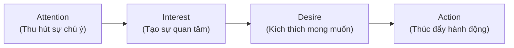
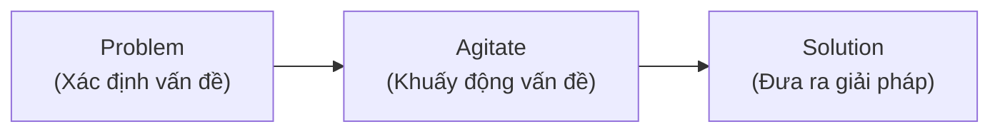
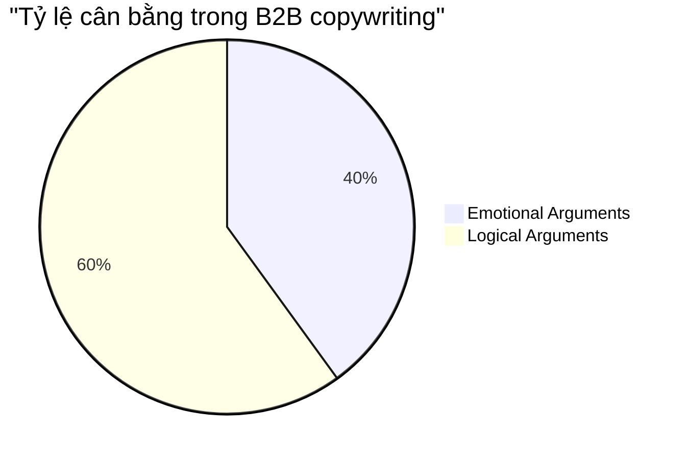
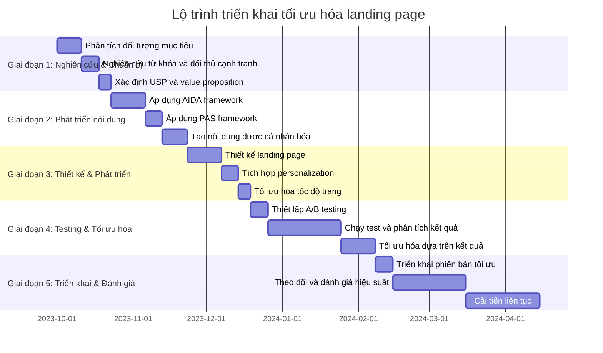

# Tối Ưu Nội Dung Cho SEO & Chuyển Đổi: Copywriting Frameworks và Personalization Cho Landing Page B2B Ngành May Mặc  

## Table of Contents  
1. Giới thiệu  
2. Ứng dụng AIDA Framework cho landing page B2B ngành may mặc  
3. Triển khai PAS Framework hiệu quả  
4. Power words và persuasive language trong ngành may mặc B2B  
5. Chiến lược content personalization cho 3 nhóm khách hàng mục tiêu  
6. A/B testing recommendations cho conversion optimization  
7. Xu hướng toàn cầu và best practices  
8. Kết luận và lộ trình triển khai  

## 1. Giới thiệu  

Trong thị trường B2B ngành may mặc đầy cạnh tranh, việc tối ưu hóa landing page không chỉ là về thiết kế đẹp mắt mà còn là về cách bạn truyền đạt thông điệp. Các copywriting frameworks như AIDA và PAS, kết hợp với chiến lược personalization, đóng vai trò quyết định trong việc chuyển đổi khách truy cập thành khách hàng tiềm năng và cuối cùng là khách hàng thực sự.  

Landing page không nên được xem như một "tài sản đầu tư rồi quên" mà cần được tối ưu hóa liên tục. Theo nghiên cứu, các công ty áp dụng A/B testing tích cực thấy tỷ lệ chuyển đổi tăng trung bình 49%. Điều này đặc biệt quan trọng trong lĩnh vực B2B, nơi có chu kỳ bán hàng dài hơn, quy mô khách hàng nhỏ hơn và quy trình ra quyết định phức tạp hơn so với B2C.  

Bài viết này sẽ cung cấp hướng dẫn chi tiết về cách áp dụng các frameworks copywriting hiệu quả và chiến lược personalization cho landing page B2B ngành may mặc, kèm theo các ví dụ thực tế và khuyến nghị có thể triển khai ngay.  

## 2. Ứng dụng AIDA Framework cho landing page B2B ngành may mặc  

AIDA là một trong những mô hình marketing cổ điển được biết đến rộng rãi nhất, đặc biệt hiệu quả trong việc hướng dẫn khách hàng tiềm năng từ nhận thức ban đầu đến hành động cuối cùng. Mô hình này bao gồm bốn giai đoạn: Attention (Sự chú ý), Interest (Sự quan tâm), Desire (Mong muốn) và Action (Hành động).  

### 2.1. Attention (Thu hút sự chú ý)  

Giai đoạn đầu tiên là thu hút sự chú ý của khách hàng tiềm năng. Đây là bước quan trọng nhất vì nếu bạn không thể thu hút sự chú ý của họ, họ sẽ không bao giờ tiến đến các giai đoạn tiếp theo.  

**Cách áp dụng:**  

1. **Sử dụng headline mạnh mẽ:** Headline nên ngắn gọn, rõ ràng và tập trung vào một vấn đề cụ thể mà khách hàng đang gặp phải.  

2. **Tạo visual impact:** Sử dụng hình ảnh chất lượng cao liên quan đến ngành may mặc, như dây chuyền sản xuất hiện đại hoặc sản phẩm hoàn thiện.  

3. **Đưa ra số liệu ấn tượng:** Sử dụng số liệu thống kê để tạo độ tin cậy và thu hút sự chú ý.  

**Ví dụ cụ thể cho ngành may mặc B2B:**  

- **Headline:** "Giảm 40% Chi Phí Sản Xuất Với Giải Pháp Quản Lý Chuỗi Cung Ứng Thông Minh"  
- **Subheadline:** "Đã giúp 500+ doanh nghiệp may mặc tại Đông Nam Á tối ưu hóa quy trình sản xuất"  
- **Visual:** Hình ảnh so sánh "trước và sau" của một nhà máy may mặc, với biểu đồ hiển thị sự cải thiện về hiệu suất  

Theo nghiên cứu, headline có chứa từ ngữ gây cảm xúc có hiệu suất tốt hơn 30% so với những headline không có. Vì vậy, hãy cân nhắc sử dụng các từ như "Đột phá", "Chuyển đổi" hoặc "Tối ưu hóa" trong headline của bạn.  

### 2.2. Interest (Tạo sự quan tâm)  

Sau khi thu hút được sự chú ý, bạn cần duy trì và phát triển sự quan tâm của khách hàng tiềm năng bằng cách cung cấp thông tin có giá trị và liên quan.  

**Cách áp dụng:**  

1. **Xác định vấn đề cụ thể:** Nêu rõ những thách thức mà doanh nghiệp may mặc đang phải đối mặt.  

2. **Cung cấp thông tin có giá trị:** Chia sẻ kiến thức chuyên ngành và xu hướng mới nhất trong lĩnh vực may mặc.  

3. **Sử dụng storytelling:** Kể câu chuyện về cách các doanh nghiệp khác đã vượt qua những thách thức tương tự.  

**Ví dụ cụ thể cho ngành may mặc B2B:**  

- **Đoạn văn mở đầu:** "Trong bối cảnh cạnh tranh toàn cầu ngày càng gay gắt, các doanh nghiệp may mặc đang phải đối mặt với áp lực giảm chi phí sản xuất trong khi vẫn duy trì chất lượng sản phẩm. Theo báo cáo của McKinsey, 67% doanh nghiệp may mặc tại Châu Á đang gặp khó khăn trong việc cân bằng giữa chi phí và chất lượng."  

- **Case study ngắn:** "Công ty ABC, một nhà sản xuất hàng may mặc hàng đầu tại Việt Nam, đã giảm 35% thời gian sản xuất và 25% chi phí vận hành sau 6 tháng áp dụng giải pháp của chúng tôi."  

- **Infographic:** Biểu đồ so sánh các chỉ số hiệu suất trước và sau khi áp dụng giải pháp.  

| Chỉ số | Trước khi áp dụng | Sau khi áp dụng | Cải thiện |  
|--------|-------------------|-----------------|-----------|  
| Thời gian sản xuất | 45 ngày | 29 ngày | -35% |  
| Chi phí vận hành | 100% | 75% | -25% |  
| Tỷ lệ lỗi sản phẩm | 8.5% | 2.3% | -73% |  
| ROI | 1.5x | 3.2x | +113% |  

Personalization là chìa khóa để kết nối với người đọc hoặc khách hàng tiềm năng, thể hiện rằng bạn hiểu nhu cầu của họ. Hãy cung cấp đủ thông tin để giữ họ tham gia, nhưng đừng làm quá tải hoặc đưa ra những điểm không liên quan.  

### 2.3. Desire (Kích thích mong muốn)  

Ở giai đoạn này, bạn cần chuyển sự quan tâm của khách hàng tiềm năng thành mong muốn sở hữu sản phẩm hoặc dịch vụ của bạn.  

**Cách áp dụng:**  

1. **Nhấn mạnh lợi ích:** Tập trung vào cách giải pháp của bạn giải quyết vấn đề cụ thể của khách hàng và mang lại giá trị.  

2. **Sử dụng social proof:** Đưa ra các testimonial, case study và đánh giá từ khách hàng hiện tại.  

3. **Tạo cảm giác cấp bách:** Sử dụng các yếu tố như ưu đãi giới hạn thời gian hoặc số lượng giới hạn.  

**Ví dụ cụ thể cho ngành may mặc B2B:**  

- **Đoạn văn về lợi ích:** "Giải pháp Quản lý Chuỗi Cung ứng Thông minh của chúng tôi không chỉ giúp bạn giảm chi phí sản xuất mà còn tối ưu hóa toàn bộ quy trình từ đặt hàng nguyên liệu đến giao hàng thành phẩm. Với hệ thống dự báo nhu cầu dựa trên AI, bạn có thể giảm tới 40% hàng tồn kho và tăng 30% tốc độ đáp ứng đơn hàng."  

- **Testimonial:** "Giải pháp của công ty đã giúp chúng tôi tiết kiệm hơn 500 triệu đồng chi phí vận hành mỗi tháng và giảm thời gian hoàn thành đơn hàng từ 45 ngày xuống còn 30 ngày." - Nguyễn Văn A, Giám đốc Sản xuất, Công ty May XYZ  

- **Ưu đãi giới hạn:** "Đăng ký demo miễn phí trong tháng này và nhận gói tư vấn tối ưu hóa quy trình sản xuất trị giá 50 triệu đồng."  

Theo nghiên cứu, việc cung cấp một sản phẩm mà khách hàng thực sự muốn là chìa khóa để chuyển sự quan tâm thành mong muốn. Hãy tạo một pitch và hỗ trợ nó bằng những lợi ích cụ thể để biến sự quan tâm của họ thành mong muốn.  

### 2.4. Action (Thúc đẩy hành động)  

Giai đoạn cuối cùng là thúc đẩy khách hàng tiềm năng thực hiện hành động cụ thể, như đăng ký demo, liên hệ với đội ngũ bán hàng hoặc yêu cầu báo giá.  

**Cách áp dụng:**  

1. **Sử dụng CTA rõ ràng:** Call-to-action nên nổi bật, dễ thấy và có nội dung rõ ràng về hành động cần thực hiện.  

2. **Giảm thiểu rủi ro:** Cung cấp bảo đảm, chính sách hoàn tiền hoặc dùng thử miễn phí để giảm bớt lo ngại của khách hàng.  

3. **Tạo cảm giác cấp bách:** Sử dụng các yếu tố như thời hạn ưu đãi hoặc số lượng giới hạn.  

**Ví dụ cụ thể cho ngành may mặc B2B:**  

- **CTA chính:** "Đăng Ký Demo Miễn Phí Ngay"  
- **CTA phụ:** "Tải Xuống Case Study"  
- **Giảm thiểu rủi ro:** "Cam kết hoàn tiền 100% trong 30 ngày nếu không hài lòng"  
- **Tạo cảm giác cấp bách:** "Chỉ còn 5 slot demo miễn phí trong tháng này"  

Kết thúc pitch hoặc nội dung của bạn với một CTA rõ ràng và ngắn gọn. Hãy trực tiếp về các bước tiếp theo mà bạn muốn khách hàng tiềm năng thực hiện. Đừng làm họ bối rối với quá nhiều lựa chọn hoặc một lời kết mơ hồ như "Hãy cho tôi biết bạn nghĩ gì".  

### 2.5. Flow giữa các giai đoạn AIDA  

Để đảm bảo hiệu quả tối đa, các giai đoạn của AIDA cần được kết nối một cách mượt mà và logic. Dưới đây là một số gợi ý để tạo flow tốt giữa các giai đoạn:  

1. **Từ Attention đến Interest:** Sử dụng headline gây chú ý để dẫn dắt người đọc vào nội dung chi tiết hơn. Ví dụ, sau headline "Giảm 40% Chi Phí Sản Xuất", tiếp tục với đoạn văn giải thích cụ thể về cách thức giảm chi phí.  

2. **Từ Interest đến Desire:** Sau khi cung cấp thông tin và dữ liệu, chuyển sang các câu chuyện thành công và testimonial để tạo kết nối cảm xúc. Ví dụ, "Không chỉ có số liệu, hãy nghe câu chuyện từ Công ty XYZ..."  

3. **Từ Desire đến Action:** Khi đã xây dựng được mong muốn, hãy tạo cảm giác cấp bách và cung cấp CTA rõ ràng. Ví dụ, "Đã đến lúc đưa doanh nghiệp của bạn lên tầm cao mới. Đăng ký demo ngay hôm nay."  

AIDA là một công cụ đa năng có thể được sử dụng trong nhiều tình huống marketing và quảng cáo khác nhau. Tuy nhiên, nó có thể không phải lúc nào cũng là lựa chọn tốt nhất. Ví dụ, khi bạn muốn tạo nhận thức về thương hiệu thay vì chuyển đổi khách hàng tiềm năng, hoặc khi bạn đang tiếp thị cho một đối tượng đã biết đến thương hiệu của bạn.  

## 3. Triển khai PAS Framework hiệu quả  

PAS (Problem-Agitate-Solution) là một trong những công thức copywriting được sử dụng rộng rãi nhất cho mọi ngành công nghiệp. Nó tập trung vào việc xác định vấn đề khách hàng đang gặp phải, khuấy động vấn đề đó, và sau đó đưa ra giải pháp.  

### 3.1. Problem (Xác định vấn đề)  

Giai đoạn đầu tiên là xác định rõ ràng vấn đề mà sản phẩm hoặc dịch vụ của bạn giải quyết. Đây là bước quan trọng để tạo sự đồng cảm với khách hàng tiềm năng.  

**Cách áp dụng:**  

1. **Nghiên cứu thị trường:** Xác định những thách thức phổ biến nhất mà các doanh nghiệp may mặc B2B đang gặp phải.  

2. **Sử dụng ngôn ngữ của khách hàng:** Mô tả vấn đề bằng chính ngôn ngữ mà khách hàng sử dụng.  

3. **Đưa ra số liệu:** Sử dụng số liệu thống kê để chứng minh mức độ nghiêm trọng của vấn đề.  

**Ví dụ cụ thể cho ngành may mặc B2B:**  

- **Headline xác định vấn đề:** "Đang Vật Lộn Với Chi Phí Sản Xuất Tăng Cao và Thời Gian Giao Hàng Chậm Trễ?"  

- **Đoạn văn mô tả vấn đề:** "Trong bối cảnh giá nguyên liệu tăng 25% và chi phí vận chuyển tăng 300% sau đại dịch, các doanh nghiệp may mặc đang phải đối mặt với áp lực kép: giảm chi phí sản xuất trong khi vẫn đảm bảo chất lượng và thời gian giao hàng."  

- **Số liệu thống kê:** "Theo báo cáo của McKinsey, 78% nhà máy may mặc tại Đông Nam Á gặp khó khăn trong việc quản lý đơn hàng đa quốc gia, dẫn đến 35% đơn hàng bị giao trễ và 15% khách hàng không quay lại."  

PAS framework hoạt động bằng cách xác định một vấn đề: Khách hàng ở giai đoạn này nhận ra họ có một vấn đề nhưng có thể chưa hiểu đầy đủ về ý nghĩa hoặc các giải pháp tiềm năng của nó.  

### 3.2. Agitate (Khuấy động vấn đề)  

Sau khi xác định vấn đề, bước tiếp theo là khuấy động nó, làm cho nó trở nên cấp bách và đáng lo ngại hơn. Mục đích là tạo ra phản ứng cảm xúc mạnh mẽ.  

**Cách áp dụng:**  

1. **Mô tả hậu quả:** Nêu rõ những hậu quả tiêu cực nếu vấn đề không được giải quyết.  

2. **Sử dụng ngôn ngữ cảm xúc:** Dùng các từ ngữ gợi cảm xúc để tăng cường tác động.  

3. **Kể câu chuyện:** Chia sẻ câu chuyện về những doanh nghiệp đã gặp phải hậu quả nghiêm trọng do không giải quyết vấn đề kịp thời.  

**Ví dụ cụ thể cho ngành may mặc B2B:**  

- **Đoạn văn khuấy động vấn đề:** "Mỗi ngày trễ hạn giao hàng không chỉ đồng nghĩa với các khoản phạt hợp đồng lên đến hàng trăm triệu đồng mà còn làm sứt mẻ uy tín thương hiệu của bạn. Trong một thị trường cạnh tranh khốc liệt, nơi các đối thủ luôn sẵn sàng thay thế, việc mất đi một khách hàng lớn có thể dẫn đến sự sụt giảm doanh thu 20-30% trong năm tới."  

- **Câu chuyện cảnh báo:** "Công ty May XYZ, từng là nhà cung cấp hàng đầu cho các thương hiệu thời trang châu Âu, đã mất 3 hợp đồng lớn trị giá 5 triệu USD trong vòng 6 tháng do liên tục giao hàng trễ hạn. Kết quả là họ buộc phải cắt giảm 200 nhân viên và đóng cửa một nhà máy."  

- **Sử dụng ngôn ngữ cảm xúc:** "Cảm giác bất lực khi nhìn đơn hàng dồn ứ, áp lực từ khách hàng ngày càng tăng, và nỗi lo về tương lai của doanh nghiệp có thể trở thành ác mộng hàng đêm của bạn."  

Khuấy động các điểm đau: Tăng cường phản ứng cảm xúc làm cho vấn đề cảm thấy cấp bách và quan trọng.  

### 3.3. Solution (Đưa ra giải pháp)  

Sau khi đã xác định và khuấy động vấn đề, bước cuối cùng là giới thiệu giải pháp của bạn như một cách hiệu quả để giải quyết vấn đề đó.  

**Cách áp dụng:**  

1. **Giới thiệu giải pháp:** Trình bày rõ ràng về sản phẩm hoặc dịch vụ của bạn và cách nó giải quyết vấn đề.  

2. **Nhấn mạnh lợi ích:** Tập trung vào những lợi ích cụ thể mà giải pháp của bạn mang lại.  

3. **Cung cấp bằng chứng:** Đưa ra các case study, testimonial hoặc số liệu để chứng minh hiệu quả của giải pháp.  

**Ví dụ cụ thể cho ngành may mặc B2B:**  

- **Giới thiệu giải pháp:** "Giải pháp Quản lý Chuỗi Cung ứng Thông minh của chúng tôi tích hợp công nghệ AI và IoT để tối ưu hóa toàn bộ quy trình sản xuất, từ dự báo nhu cầu, quản lý nguyên liệu đến lập kế hoạch sản xuất và giao hàng."  

- **Nhấn mạnh lợi ích:** "Với giải pháp của chúng tôi, bạn có thể:  
  - Giảm 30% chi phí sản xuất thông qua việc tối ưu hóa sử dụng nguyên liệu  
  - Cắt giảm 40% thời gian giao hàng nhờ quy trình sản xuất hiệu quả hơn  
  - Tăng 25% khả năng đáp ứng đơn hàng gấp mà không làm gián đoạn kế hoạch sản xuất hiện tại"  

- **Case study:** "Công ty May ABC đã triển khai giải pháp của chúng tôi vào tháng 6/2022. Sau 3 tháng, họ đã:  
  - Giảm 28% chi phí sản xuất  
  - Cắt giảm 35% thời gian giao hàng  
  - Tăng 20% công suất sản xuất mà không cần đầu tư thêm máy móc  
  - Đạt ROI 300% trong vòng 6 tháng"  

Đưa ra giải pháp: Giới thiệu sản phẩm hoặc dịch vụ của bạn như câu trả lời dứt khoát cho vấn đề của họ.  

### 3.4. Transition từ problem đến solution  

Việc chuyển tiếp từ việc mô tả vấn đề sang giới thiệu giải pháp cần được thực hiện một cách mượt mà và thuyết phục. Dưới đây là một số kỹ thuật hiệu quả:  

1. **Sử dụng câu hỏi chuyển tiếp:** "Vậy làm thế nào để vượt qua những thách thức này và đưa doanh nghiệp của bạn lên một tầm cao mới?"  

2. **Tạo tương phản:** "Trong khi nhiều doanh nghiệp đang vật lộn với những vấn đề trên, một số ít đã tìm ra con đường mới để thành công. Bí quyết của họ là gì?"  

3. **Sử dụng từ chuyển tiếp:** "May mắn thay", "Tin vui là", "Đã đến lúc"  

**Ví dụ cụ thể cho ngành may mặc B2B:**  

- **Chuyển tiếp bằng câu hỏi:** "Vậy làm thế nào để doanh nghiệp may mặc của bạn có thể vừa giảm chi phí sản xuất vừa đảm bảo chất lượng và thời gian giao hàng trong bối cảnh đầy thách thức hiện nay?"  

- **Chuyển tiếp bằng tương phản:** "Trong khi 78% nhà máy may mặc đang gặp khó khăn, 22% còn lại không chỉ tồn tại mà còn phát triển mạnh mẽ. Điểm khác biệt nằm ở việc họ đã áp dụng một cách tiếp cận hoàn toàn mới đối với quản lý chuỗi cung ứng."  

- **Chuyển tiếp bằng từ kết nối:** "May mắn thay, giờ đây đã có một giải pháp toàn diện giúp các doanh nghiệp may mặc vượt qua những thách thức này và chuyển đổi chúng thành lợi thế cạnh tranh."  

PAS là một công thức copywriting hiệu quả cho các sản phẩm hoặc dịch vụ giải quyết các vấn đề thực tế hoặc giải quyết các điểm đau cụ thể. Nó đặc biệt hiệu quả cho các trang đích, chiến dịch email và thư bán hàng.  

## 4. Power words và persuasive language trong ngành may mặc B2B  

Power words là những từ ngữ gây cảm xúc mạnh mẽ, thu hút sự chú ý và thúc đẩy hành động. Chúng là công cụ quan trọng trong copywriting, giúp tăng cường sức mạnh thuyết phục của nội dung.  

### 4.1. 30 power words phù hợp với ngành may mặc B2B  

Power words tác động đến cảm xúc và ham muốn cơ bản của con người, như sợ hãi, tham lam và tò mò. Trong marketing B2B, chúng cũng có thể thu hút đến những khát vọng và điểm đau chuyên nghiệp, như hiệu quả, đổi mới và hiệu quả chi phí.  

Dưới đây là 30 power words đặc biệt hiệu quả cho ngành may mặc B2B:  

| Nhóm | Power Words | Ứng dụng |  
|------|-------------|----------|  
| **Hiệu quả & Tối ưu** | Tối ưu hóa, Hiệu quả, Tiết kiệm, Nâng cao, Tăng tốc | "Tối ưu hóa quy trình cắt vải giúp tiết kiệm 30% nguyên liệu" |  
| **Đổi mới & Công nghệ** | Đột phá, Cách mạng, Tiên tiến, Thông minh, Tự động hóa | "Công nghệ cắt laser tiên tiến giúp tăng độ chính xác lên 99.8%" |  
| **Độc quyền & Giá trị** | Độc quyền, Cao cấp, Chuyên biệt, Tùy chỉnh, Đẳng cấp | "Giải pháp tùy chỉnh cho doanh nghiệp may mặc xuất khẩu" |  
| **Tin cậy & An toàn** | Đảm bảo, Chứng minh, Tin cậy, Bảo mật, An toàn | "Quy trình sản xuất đảm bảo đáp ứng tiêu chuẩn REACH của EU" |  
| **Cấp bách & Thời gian** | Ngay lập tức, Nhanh chóng, Kịp thời, Khẩn cấp, Giới hạn | "Giải pháp nhanh chóng giúp đáp ứng đơn hàng khẩn cấp" |  
| **Kết quả & Thành công** | Chuyển đổi, Thành công, Đạt được, Vượt trội, Tăng trưởng | "Chuyển đổi từ sản xuất thủ công sang tự động hóa" |  

Theo nghiên cứu, các công ty sử dụng A/B testing tích cực thấy tỷ lệ chuyển đổi tăng trung bình 49%. Vì vậy, việc thử nghiệm các power words khác nhau trong headline và CTA có thể giúp xác định những từ nào hiệu quả nhất với đối tượng mục tiêu của bạn.  

### 4.2. Cách sử dụng emotional triggers  

Emotional triggers (yếu tố kích thích cảm xúc) là những yếu tố trong nội dung của bạn gợi lên phản ứng cảm xúc từ người đọc. Trong marketing B2B, mặc dù quyết định mua hàng thường được coi là dựa trên logic, nhưng cảm xúc vẫn đóng vai trò quan trọng.  

**Cách áp dụng emotional triggers trong ngành may mặc B2B:**  

1. **Nỗi sợ mất mát:** Nhấn mạnh những rủi ro khi không áp dụng giải pháp của bạn.  
   - Ví dụ: "Mỗi phút máy dừng hoạt động có thể khiến bạn mất hàng triệu đồng. Bạn có thể chấp nhận rủi ro đó?"  

2. **Khát vọng thành công:** Mô tả viễn cảnh thành công khi sử dụng giải pháp của bạn.  
   - Ví dụ: "Hãy tưởng tượng nhà máy của bạn hoạt động 24/7 với hiệu suất tối đa, đáp ứng mọi đơn hàng đúng hạn và vượt mọi chỉ tiêu."  

3. **Tự hào và danh tiếng:** Nhấn mạnh cách giải pháp của bạn có thể nâng cao danh tiếng của doanh nghiệp.  
   - Ví dụ: "Trở thành nhà cung cấp ưu tiên cho các thương hiệu thời trang hàng đầu thế giới nhờ chất lượng sản phẩm vượt trội."  

4. **Cảm giác an toàn:** Nhấn mạnh tính ổn định và đáng tin cậy của giải pháp.  
   - Ví dụ: "Hệ thống dự báo nhu cầu dựa trên AI giúp bạn luôn chủ động trong mọi tình huống thị trường."  

5. **Cảm giác thuộc về:** Tạo cảm giác là một phần của nhóm tiên phong.  
   - Ví dụ: "Tham gia cùng 500+ nhà sản xuất hàng đầu đã áp dụng công nghệ này và đang dẫn đầu thị trường."  

Behavioral triggers (yếu tố kích thích hành vi) là chìa khóa trong marketing B2B. Hãy thử nghiệm các phiên bản khác nhau của email hoặc nội dung được cá nhân hóa dựa trên hành động của người dùng.  

### 4.3. Cách sử dụng logic appeals  

Logic appeals (lập luận logic) là những lập luận dựa trên sự thật, số liệu và lý luận để thuyết phục người đọc. Trong marketing B2B, đây là yếu tố quan trọng để xây dựng niềm tin và độ tin cậy.  

**Cách áp dụng logic appeals trong ngành may mặc B2B:**  

1. **Sử dụng số liệu và thống kê:** Cung cấp dữ liệu cụ thể về hiệu quả của giải pháp.  
   - Ví dụ: "Giải pháp của chúng tôi đã giúp giảm 28% chi phí sản xuất và tăng 35% năng suất cho 200+ nhà máy may mặc tại Đông Nam Á."  

2. **Trình bày ROI rõ ràng:** Chỉ ra giá trị đầu tư cụ thể.  
   - Ví dụ: "Với mức đầu tư X, bạn có thể tiết kiệm Y chi phí mỗi tháng, đạt ROI 300% trong vòng 6 tháng."  

3. **So sánh trước và sau:** Cung cấp dữ liệu so sánh trước và sau khi áp dụng giải pháp.  
   - Ví dụ: "Trước khi áp dụng giải pháp, Công ty ABC mất 45 ngày để hoàn thành một đơn hàng. Sau khi áp dụng, thời gian giảm xuống còn 30 ngày."  

4. **Giải thích quy trình:** Mô tả cách giải pháp hoạt động một cách logic và rõ ràng.  
   - Ví dụ: "Hệ thống hoạt động qua 3 bước: (1) Thu thập dữ liệu từ các điểm trong quy trình sản xuất, (2) Phân tích dữ liệu bằng AI để xác định điểm nghẽn, (3) Đề xuất giải pháp tối ưu hóa."  

5. **Trích dẫn nghiên cứu và chuyên gia:** Sử dụng ý kiến của chuyên gia và nghiên cứu để hỗ trợ lập luận.  
   - Ví dụ: "Theo báo cáo của McKinsey, các doanh nghiệp may mặc áp dụng công nghệ tự động hóa có khả năng tăng lợi nhuận lên 40% so với đối thủ."  

A/B testing giúp bạn hiểu những gì thực sự hiệu quả trong các chiến dịch của bạn, thay vì dựa vào giả định. Đó là về việc liên tục cải thiện, tinh chỉnh và tối ưu hóa từng bước trong hành trình của người mua.  

### 4.4. Balance giữa emotional và logical arguments  

Trong marketing B2B, việc cân bằng giữa lập luận cảm xúc và logic là rất quan trọng. Mặc dù quyết định mua hàng B2B thường được coi là dựa trên logic, nhưng nghiên cứu cho thấy cảm xúc vẫn đóng vai trò quan trọng.  

**Cách cân bằng giữa emotional và logical arguments:**  

1. **Sử dụng cảm xúc để thu hút, logic để thuyết phục:** Bắt đầu bằng emotional triggers để thu hút sự chú ý, sau đó sử dụng logic appeals để xây dựng niềm tin.  

2. **Kết hợp storytelling với dữ liệu:** Kể câu chuyện về khách hàng đã thành công (emotional) và hỗ trợ bằng số liệu cụ thể (logical).  

3. **Sử dụng ngôn ngữ cảm xúc kết hợp với dữ liệu:** Kết hợp power words với số liệu thống kê.  

4. **Cân nhắc đối tượng mục tiêu:** Điều chỉnh tỷ lệ giữa emotional và logical arguments dựa trên đối tượng mục tiêu (ví dụ: nhà quản lý cấp cao có thể quan tâm nhiều hơn đến ROI, trong khi người dùng cuối có thể quan tâm đến tính dễ sử dụng).  

**Ví dụ cụ thể cho ngành may mặc B2B:**  

- **Kết hợp cảm xúc và logic trong headline:** "Giải Phóng Tiềm Năng Sản Xuất: Tăng 35% Năng Suất Với Giải Pháp Quản Lý Thông Minh"  

- **Kết hợp storytelling với dữ liệu:** "Công ty May XYZ đã từng đứng trước nguy cơ mất hợp đồng 2 triệu USD do liên tục giao hàng trễ hạn. Sau khi áp dụng giải pháp của chúng tôi, họ không chỉ giữ được hợp đồng mà còn giảm 30% thời gian sản xuất, tiết kiệm 25% chi phí vận hành và tăng 20% công suất."  

- **Sử dụng ngôn ngữ cảm xúc kết hợp với dữ liệu:** "Đột phá giới hạn sản xuất với công nghệ cắt vải tiên tiến, giúp giảm 40% thời gian cắt và tiết kiệm 30% nguyên liệu."  

Tỷ lệ cân bằng giữa emotional và logical arguments có thể được minh họa như sau:  

Theo nghiên cứu, các headline có từ ngữ gây cảm xúc có hiệu suất tốt hơn 30% so với những headline không có. Tuy nhiên, trong B2B marketing, logic appeals vẫn đóng vai trò quan trọng hơn so với B2C marketing.  

## 5. Chiến lược content personalization cho 3 nhóm khách hàng mục tiêu  

Personalization (cá nhân hóa) trong marketing B2B không chỉ là sử dụng tên người nhận trong email mà còn là cung cấp nội dung phù hợp dựa trên hành vi và sở thích của người dùng. Nhu cầu về personalization trong marketing B2B cao hơn bao giờ hết, với khách hàng mong đợi trải nghiệm được cá nhân hóa ở mỗi bước.  

### 5.1. Cách tạo dynamic content cho 3 nhóm khách hàng mục tiêu  

Dynamic content là nội dung thay đổi dựa trên các yếu tố như hành vi người dùng, vị trí địa lý, hoặc thông tin nhân khẩu học. Đây là một công cụ mạnh mẽ để cá nhân hóa trải nghiệm của khách hàng.  

**Phân đoạn 3 nhóm khách hàng mục tiêu trong ngành may mặc B2B:**  

1. **Nhà sản xuất quy mô nhỏ và vừa (SMEs):**  
   - Doanh thu: < 50 tỷ đồng/năm  
   - Số lượng nhân viên: < 200  
   - Đặc điểm: Ngân sách hạn chế, cần giải pháp chi phí thấp, dễ triển khai  

2. **Nhà sản xuất quy mô lớn:**  
   - Doanh thu: 50-500 tỷ đồng/năm  
   - Số lượng nhân viên: 200-1000  
   - Đặc điểm: Cần giải pháp toàn diện, tích hợp với hệ thống hiện có  

3. **Tập đoàn đa quốc gia:**  
   - Doanh thu: > 500 tỷ đồng/năm  
   - Số lượng nhân viên: > 1000  
   - Đặc điểm: Cần giải pháp enterprise-level, hỗ trợ đa ngôn ngữ, đa vùng  

**Chiến lược tạo dynamic content cho từng nhóm:**  

| Yếu tố | Nhà sản xuất quy mô nhỏ và vừa | Nhà sản xuất quy mô lớn | Tập đoàn đa quốc gia |  
|--------|--------------------------------|------------------------|----------------------|  
| **Headline** | "Giải Pháp Tiết Kiệm Chi Phí Cho Doanh Nghiệp May Mặc Vừa và Nhỏ" | "Tối Ưu Hóa Quy Trình Sản Xuất Cho Nhà Máy May Quy Mô Lớn" | "Giải Pháp Quản Lý Chuỗi Cung Ứng Toàn Cầu Cho Tập Đoàn May Mặc" |  
| **Value Proposition** | Tập trung vào chi phí thấp, ROI nhanh, dễ triển khai | Tập trung vào tối ưu hóa quy trình, tích hợp hệ thống, tăng năng suất | Tập trung vào quản lý toàn cầu, tuân thủ quy định, bảo mật dữ liệu |  
| **Case Studies** | Hiển thị case study của các SME tương tự | Hiển thị case study của các nhà sản xuất quy mô lớn | Hiển thị case study của các tập đoàn đa quốc gia |  
| **Pricing Information** | Hiển thị gói SME với chi tiết giá | Hiển thị gói Enterprise với "Liên hệ để nhận báo giá" | Hiển thị "Giải pháp tùy chỉnh" với "Liên hệ đội ngũ tư vấn" |  
| **CTA** | "Dùng Thử Miễn Phí 30 Ngày" | "Đăng Ký Demo 1:1" | "Tư Vấn Giải Pháp Tùy Chỉnh" |  

Việc phân đoạn đối tượng B2B của bạn (ví dụ: SMB so với Enterprise, người ra quyết định so với người có ảnh hưởng) và chạy A/B test trong các phân đoạn này sẽ giúp bạn xác định điều gì phù hợp với từng nhóm.  

### 5.2. Personalization tokens có thể sử dụng  

Personalization tokens là các biến được sử dụng trong email marketing và trên website để thay thế bằng thông tin cụ thể của người nhận hoặc người dùng.  

**Các personalization tokens hiệu quả cho ngành may mặc B2B:**  

1. **Tokens cơ bản:**  
   - {{first_name}}: Tên người nhận  
   - {{company_name}}: Tên công ty  
   - {{industry}}: Ngành công nghiệp cụ thể (ví dụ: may mặc thể thao, thời trang cao cấp)  

2. **Tokens dựa trên hành vi:**  
   - {{last_visited_page}}: Trang cuối cùng mà người dùng đã truy cập  
   - {{downloaded_resource}}: Tài liệu mà người dùng đã tải xuống  
   - {{product_interest}}: Sản phẩm hoặc giải pháp mà người dùng đã thể hiện sự quan tâm  

3. **Tokens dựa trên thông tin doanh nghiệp:**  
   - {{company_size}}: Quy mô công ty (nhỏ, vừa, lớn)  
   - {{production_capacity}}: Công suất sản xuất  
   - {{export_markets}}: Thị trường xuất khẩu chính  

4. **Tokens dựa trên vị trí trong sales funnel:**  
   - {{funnel_stage}}: Giai đoạn trong sales funnel (awareness, consideration, decision)  
   - {{days_since_last_interaction}}: Số ngày kể từ lần tương tác cuối cùng  
   - {{previous_purchases}}: Các sản phẩm hoặc dịch vụ đã mua trước đó  

**Ví dụ cụ thể về cách sử dụng personalization tokens:**  

- **Email subject line:** "{{first_name}}, Giải Pháp Tối Ưu Cho {{industry}} Tại {{company_name}}"  

- **Landing page headline:** "Chào {{first_name}}, Khám Phá Cách {{company_name}} Có Thể Tăng Năng Suất Với Giải Pháp {{product_interest}}"  

- **CTA được cá nhân hóa:** "Xem Cách {{company_name}} Có Thể Tiết Kiệm {{estimated_savings}} Mỗi Tháng"  

Personalization là chìa khóa để kết nối với người đọc hoặc khách hàng tiềm năng, thể hiện rằng bạn hiểu nhu cầu của họ.  

### 5.3. UTM parameters-based content adaptation  

UTM parameters là các tham số được thêm vào URL để theo dõi hiệu quả của các chiến dịch marketing. Chúng cũng có thể được sử dụng để điều chỉnh nội dung dựatrên nguồn traffic.  

**Chiến lược sử dụng UTM parameters cho content adaptation:**  

1. **Dựa trên nguồn traffic:**  
   - utm_source=google: Hiển thị nội dung nhấn mạnh các từ khóa đã được tìm kiếm  
   - utm_source=linkedin: Hiển thị nội dung liên quan đến networking và industry insights  
   - utm_source=email: Hiển thị nội dung liên quan đến chủ đề email  

2. **Dựa trên chiến dịch:**  
   - utm_campaign=sustainability: Nhấn mạnh các giải pháp bền vững  
   - utm_campaign=cost_reduction: Tập trung vào ROI và tiết kiệm chi phí  
   - utm_campaign=automation: Nhấn mạnh các tính năng tự động hóa  

3. **Dựa trên phân đoạn khách hàng:**  
   - utm_content=sme: Hiển thị nội dung phù hợp với SMEs  
   - utm_content=enterprise: Hiển thị nội dung phù hợp với doanh nghiệp lớn  
   - utm_content=global: Hiển thị nội dung phù hợp với tập đoàn đa quốc gia  

**Ví dụ cụ thể về UTM parameters-based content adaptation:**  

- **URL:** example.com/landing-page?utm_source=linkedin&utm_campaign=sustainability&utm_content=enterprise  

- **Content adaptation:**  
  - Headline: "Giải Pháp Sản Xuất Bền Vững Cho Doanh Nghiệp May Mặc Quy Mô Lớn"  
  - Case studies: Hiển thị case studies về các doanh nghiệp lớn đã áp dụng thành công giải pháp bền vững  
  - CTA: "Khám Phá Cách Doanh Nghiệp Của Bạn Có Thể Đạt Được Mục Tiêu Phát Triển Bền Vững"  

Sử dụng UTM tags và dữ liệu firmographic để chạy A/B test có mục tiêu, đảm bảo rằng bạn đang tối ưu hóa cho các phân đoạn người dùng cụ thể và nguồn traffic liên quan đến trang web B2B của bạn.  

### 5.4. Cách personalize CTA và offers  

Call-to-Action (CTA) và offers là những yếu tố quan trọng ảnh hưởng trực tiếp đến tỷ lệ chuyển đổi. Việc cá nhân hóa chúng có thể làm tăng đáng kể hiệu quả.  

**Chiến lược personalize CTA:**  

1. **Dựa trên giai đoạn trong sales funnel:**  
   - Awareness: "Tìm Hiểu Thêm Về Giải Pháp"  
   - Consideration: "Xem Demo Sản Phẩm"  
   - Decision: "Nhận Báo Giá Chi Tiết"  

2. **Dựa trên quy mô doanh nghiệp:**  
   - SMEs: "Dùng Thử Miễn Phí 30 Ngày"  
   - Doanh nghiệp lớn: "Đăng Ký Demo 1:1"  
   - Tập đoàn đa quốc gia: "Tư Vấn Giải Pháp Tùy Chỉnh"  

3. **Dựa trên hành vi trước đó:**  
   - Đã xem demo: "Nhận Báo Giá Ngay"  
   - Đã tải whitepaper: "Đăng Ký Webinar Chuyên Sâu"  
   - Đã tham gia webinar: "Lên Lịch Tư Vấn 1:1"  

**Chiến lược personalize offers:**  

1. **Dựa trên quy mô doanh nghiệp:**  
   - SMEs: "Giảm 20% Cho Gói SME Trong Tháng Này"  
   - Doanh nghiệp lớn: "Tặng Miễn Phí Module Báo Cáo Nâng Cao"  
   - Tập đoàn đa quốc gia: "Tư Vấn Miễn Phí Giải Pháp Tùy Chỉnh"  

2. **Dựa trên thách thức cụ thể:**  
   - Chi phí cao: "Tiết Kiệm 30% Chi Phí Sản Xuất"  
   - Thời gian giao hàng: "Giảm 40% Thời Gian Giao Hàng"  
   - Chất lượng: "Giảm 80% Tỷ Lệ Lỗi Sản Phẩm"  

3. **Dựa trên vị trí địa lý:**  
   - Việt Nam: "Hỗ Trợ Đáp Ứng Tiêu Chuẩn Xuất Khẩu EU"  
   - Trung Quốc: "Giải Pháp Tối Ưu Cho Sản Xuất Quy Mô Lớn"  
   - Bangladesh: "Tăng Năng Suất Với Chi Phí Thấp"  

**Ví dụ cụ thể về personalized CTA và offers:**  

- **Cho SME đang ở giai đoạn consideration:**  
  - CTA: "Xem Demo Giải Pháp Cho Doanh Nghiệp Vừa và Nhỏ"  
  - Offer: "Đăng Ký Demo và Nhận Miễn Phí Báo Cáo 'Top 10 Chiến Lược Giảm Chi Phí Cho Nhà Máy May Quy Mô Nhỏ'"  

- **Cho doanh nghiệp lớn đang ở giai đoạn decision:**  
  - CTA: "Nhận Báo Giá Chi Tiết Cho Doanh Nghiệp Của Bạn"  
  - Offer: "Ký Hợp Đồng Trong Tháng Này và Nhận Miễn Phí 3 Tháng Sử Dụng Module Báo Cáo Nâng Cao"  

- **Cho tập đoàn đa quốc gia đã tham gia webinar:**  
  - CTA: "Lên Lịch Tư Vấn Giải Pháp Tùy Chỉnh"  
  - Offer: "Đăng Ký Tư Vấn và Nhận Miễn Phí Đánh Giá Chi Tiết Về Chuỗi Cung Ứng Hiện Tại"  

Việc thử nghiệm các CTA khác nhau (wording, màu sắc nút, vị trí) là một trong những yếu tố quan trọng cần thử nghiệm để tối ưu hóa tỷ lệ chuyển đổi.  

## 6. A/B testing recommendations cho conversion optimization  

A/B testing (còn được gọi là split testing hoặc bucket testing) là một phương pháp so sánh hai phiên bản của một trang web hoặc ứng dụng để xác định phiên bản nào hoạt động tốt hơn. Nó hoạt động bằng cách hiển thị hai biến thể của một trang cho người dùng một cách ngẫu nhiên và sử dụng phân tích thống kê để xác định biến thể nào đạt kết quả tốt hơn cho mục tiêu chuyển đổi của bạn.  

### 6.1. 5 elements cần test cho conversion optimization  

Trong marketing B2B, một số yếu tố nhất định mang lại kết quả đáng kể hơn khi được tối ưu hóa. Ưu tiên thử nghiệm các yếu tố có tác động trực tiếp đến việc tạo lead.  

**5 elements quan trọng cần test cho landing page B2B ngành may mặc:**  

1. **Call-to-Action (CTA):**  
   - Vị trí: Trên cùng, giữa trang, cuối trang  
   - Màu sắc: Xanh, đỏ, cam, xanh lá  
   - Kích thước: Nhỏ, vừa, lớn  
   - Nội dung: "Đăng Ký Demo", "Nhận Báo Giá", "Tư Vấn Miễn Phí"  

2. **Headlines:**  
   - Tập trung vào vấn đề: "Đang Vật Lộn Với Chi Phí Sản Xuất Tăng Cao?"  
   - Tập trung vào giải pháp: "Giảm 30% Chi Phí Sản Xuất Với Giải Pháp Quản Lý Thông Minh"  
   - Tập trung vào kết quả: "500+ Doanh Nghiệp May Mặc Đã Tăng 35% Năng Suất"  

3. **Forms:**  
   - Số lượng trường: 3 trường vs 5 trường vs 7 trường  
   - Vị trí: Bên phải nội dung vs dưới nội dung  
   - Thiết kế: Single-step vs multi-step  
   - Yêu cầu thông tin: Chỉ email vs email + số điện thoại vs thông tin đầy đủ  

4. **Social Proof:**  
   - Loại: Testimonials vs case studies vs logos khách hàng  
   - Vị trí: Trên cùng vs giữa trang vs cuối trang  
   - Format: Text vs video vs infographic  

5. **Content Layout:**  
   - Thiết kế: Single-column vs two-column  
   - Visual: Nhiều hình ảnh vs nhiều text  
   - Content blocks: Ngắn và nhiều section vs dài và ít section  

Theo nghiên cứu, ngay cả những điều chỉnh nhỏ đối với trang đích của bạn cũng có thể cải thiện đáng kể tỷ lệ chuyển đổi. A/B testing là chìa khóa để khám phá những thay đổi tinh tế trong các yếu tố trang đích của bạn có thể tạo ra sự khác biệt lớn.  

### 6.2. Các biến thể cần thử nghiệm  

Để mỗi yếu tố được test hiệu quả, bạn cần xác định các biến thể cụ thể để so sánh. Dưới đây là các biến thể đề xuất cho từng yếu tố:  

**1. Call-to-Action (CTA):**  

| Yếu tố | Biến thể A | Biến thể B | Biến thể C |  
|--------|------------|------------|------------|  
| **Nội dung** | "Đăng Ký Demo Ngay" | "Nhận Tư Vấn Miễn Phí" | "Khám Phá Giải Pháp" |  
| **Màu sắc** | Xanh dương | Cam | Xanh lá |  
| **Vị trí** | Trên cùng bên phải | Giữa trang sau value proposition | Cuối trang sau testimonials |  
| **Kích thước** | Nhỏ (100x30px) | Vừa (150x40px) | Lớn (200x50px) |  

**Ví dụ test CTA:**  
- **Biến thể A:** CTA màu xanh dương, kích thước vừa, nội dung "Đăng Ký Demo Ngay", đặt trên cùng bên phải  
- **Biến thể B:** CTA màu cam, kích thước lớn, nội dung "Nhận Tư Vấn Miễn Phí", đặt giữa trang sau value proposition  

**2. Headlines:**  

| Yếu tố | Biến thể A | Biến thể B | Biến thể C |  
|--------|------------|------------|------------|  
| **Approach** | Problem-focused: "Đang Vật Lộn Với Chi Phí Sản Xuất Tăng Cao?" | Solution-focused: "Giảm 30% Chi Phí Sản Xuất Với Giải Pháp Quản Lý Thông Minh" | Result-focused: "500+ Doanh Nghiệp May Mặc Đã Tăng 35% Năng Suất" |  
| **Độ dài** | Ngắn (5-7 từ) | Vừa (8-12 từ) | Dài (13-20 từ) |  
| **Tone** | Formal: "Tối Ưu Hóa Quy Trình Sản Xuất May Mặc" | Conversational: "Bạn Muốn Giảm Chi Phí Sản Xuất?" | Urgent: "Đừng Để Chi Phí Sản Xuất Cao Làm Giảm Lợi Nhuận!" |  

**Ví dụ test Headlines:**  
- **Biến thể A:** "Đang Vật Lộn Với Chi Phí Sản Xuất Tăng Cao?" (Problem-focused, ngắn, conversational)  
- **Biến thể B:** "Giảm 30% Chi Phí Sản Xuất Với Giải Pháp Quản Lý Thông Minh Trong 90 Ngày" (Solution-focused, dài, formal)  

**3. Forms:**  

| Yếu tố | Biến thể A | Biến thể B | Biến thể C |  
|--------|------------|------------|------------|  
| **Số lượng trường** | 3 trường (Tên, Email, Công ty) | 5 trường (Tên, Email, Công ty, Số điện thoại, Vị trí) | 7 trường (Tên, Email, Công ty, Số điện thoại, Vị trí, Quy mô công ty, Nhu cầu) |  
| **Thiết kế** | Single-step | Multi-step (2 steps) | Multi-step (3 steps) |  
| **Vị trí** | Bên phải nội dung | Dưới nội dung | Pop-up sau 30 giây |  

**Ví dụ test Forms:**  
- **Biến thể A:** Form 3 trường, single-step, đặt bên phải nội dung  
- **Biến thể B:** Form 5 trường, multi-step (2 steps), đặt dưới nội dung  

**4. Social Proof:**  

| Yếu tố | Biến thể A | Biến thể B | Biến thể C |  
|--------|------------|------------|------------|  
| **Loại** | Testimonials (quotes từ khách hàng) | Case studies (với số liệu cụ thể) | Logos của khách hàng nổi tiếng |  
| **Vị trí** | Ngay sau value proposition | Giữa trang, trước CTA | Cuối trang, sau CTA |  
| **Format** | Text quotes | Video testimonials | Infographic case studies |  

**Ví dụ test Social Proof:**  
- **Biến thể A:** 3 text quotes từ khách hàng, đặt ngay sau value proposition  
- **Biến thể B:** 1 video testimonial và 1 infographic case study, đặt giữa trang, trước CTA  

**5. Content Layout:**  

| Yếu tố | Biến thể A | Biến thể B | Biến thể C |  
|--------|------------|------------|------------|  
| **Thiết kế** | Single-column | Two-column (nội dung bên trái, form bên phải) | Z-pattern layout |  
| **Visual ratio** | 30% hình ảnh, 70% text | 50% hình ảnh, 50% text | 70% hình ảnh, 30% text |  
| **Content blocks** | Nhiều section ngắn | Ít section dài | Accordion-style expandable sections |  

**Ví dụ test Content Layout:**  
- **Biến thể A:** Single-column, 30% hình ảnh, nhiều section ngắn  
- **Biến thể B:** Two-column, 50% hình ảnh, ít section dài  

Cách hiệu quả và được khuyến nghị nhất để thực hiện A/B testing trang đích là thực hiện một thay đổi tại một thời điểm. Bằng cách đó, bạn có một đại diện chính xác về kết quả của mỗi thay đổi, và bạn có thể kiểm tra chúng một cách độc lập.  

### 6.3. Metrics để đo lường thành công  

Để đánh giá hiệu quả của các biến thể trong A/B testing, bạn cần xác định các metrics phù hợp để đo lường thành công.  

**Metrics quan trọng cho A/B testing landing page B2B ngành may mặc:**  

1. **Conversion Metrics:**  
   - Conversion Rate: Tỷ lệ khách truy cập thực hiện hành động mong muốn (đăng ký demo, điền form, v.v.)  
   - Form Completion Rate: Tỷ lệ người dùng hoàn thành form sau khi bắt đầu điền  
   - CTA Click-through Rate: Tỷ lệ người dùng nhấp vào CTA  

2. **Engagement Metrics:**  
   - Time on Page: Thời gian trung bình người dùng dành trên trang  
   - Scroll Depth: Độ sâu cuộn trang của người dùng  
   - Bounce Rate: Tỷ lệ người dùng rời trang mà không tương tác  

3. **Lead Quality Metrics:**  
   - Lead-to-Customer Rate: Tỷ lệ lead chuyển thành khách hàng  
   - Sales-Qualified Lead Rate: Tỷ lệ lead đủ điều kiện để chuyển cho sales  
   - Customer Lifetime Value (CLV): Giá trị vòng đời của khách hàng  

4. **Technical Metrics:**  
   - Page Load Time: Thời gian tải trang  
   - Mobile Responsiveness: Hiệu suất trên thiết bị di động  
   - Form Error Rate: Tỷ lệ lỗi khi điền form  

**Bảng mục tiêu cho các metrics chính:**  

| Metric | Mục tiêu hiện tại | Mục tiêu cải thiện | Phương pháp đo lường |  
|--------|-------------------|-------------------|----------------------|  
| Conversion Rate | 3.5% | >5% | Google Analytics, CRM |  
| Form Completion Rate | 45% | >60% | Form analytics tool |  
| Time on Page | 1:45 | >2:30 | Google Analytics |  
| Bounce Rate | 65% | <50% | Google Analytics |  
| Lead-to-Customer Rate | 8% | >12% | CRM, sales data |  
| Page Load Time | 3.2s | <2s | Google PageSpeed Insights |  

Trong B2B, thành công metrics nên được gắn chặt với các mục tiêu kinh doanh chính và các giai đoạn của sales funnel. Các metrics này có thể bao gồm tỷ lệ chuyển đổi (ví dụ: đăng ký demo, hoàn thành form lead), pipeline velocity (thời gian để chuyển lead giữa các giai đoạn), engagement metrics (tỷ lệ nhấp chuột, thời lượng phiên) và account-based metrics (số lượng lead hoặc cơ hội đủ điều kiện được tạo ra).  

### 6.4. Best practices cho A/B testing  

Để đảm bảo A/B testing mang lại kết quả đáng tin cậy và có giá trị, bạn nên tuân thủ một số best practices sau:  

1. **Bắt đầu với giả thuyết rõ ràng:**  
   - Thay vì thử nghiệm ngẫu nhiên hai phiên bản của một yếu tố (ví dụ: trang đích hoặc email), hãy hình thành giả thuyết dựa trên dữ liệu trước đó hoặc hành vi người dùng.  
   - Ví dụ: "Chúng tôi tin rằng việc giảm số lượng trường trong form từ 7 xuống 5 sẽ làm tăng tỷ lệ hoàn thành form lên 20% vì nó giảm ma sát cho người dùng."  

2. **Test một yếu tố tại một thời điểm:**  
   - Cách hiệu quả nhất để thực hiện A/B testing là thực hiện một thay đổi tại một thời điểm.  
   - Điều này giúp bạn xác định chính xác yếu tố nào tạo ra sự khác biệt trong hiệu suất.  

3. **Đảm bảo kích thước mẫu đủ lớn:**  
   - Tính toán kích thước mẫu trong B2B nên tính đến chu kỳ bán hàng dài hơn và thị trường mục tiêu nhỏ hơn so với B2C.  
   - Sử dụng công cụ tính toán kích thước mẫu A/B, nhưng xem xét các yếu tố như lưu lượng truy cập dự kiến, tỷ lệ chuyển đổi cơ sở và hiệu ứng tối thiểu có thể phát hiện.  

4. **Chạy test đủ lâu:**  
   - Do khối lượng traffic nhỏ hơn và chu kỳ bán hàng dài hơn, các bài test B2B nên chạy cho đến khi đạt được ý nghĩa thống kê, điều này thường có thể mất nhiều tuần hoặc thậm chí nhiều tháng.  
   - Một quy tắc chung là chạy test trong ít nhất một chu kỳ bán hàng đầy đủ hoặc cho đến khi bạn đã thu thập đủ chuyển đổi.  

5. **Phân đoạn kết quả:**  
   - Phân đoạn kết quả test dựa trên các tiêu chí như quy mô công ty, ngành công nghiệp hoặc vị trí trong buying stage.  
   - Điều này giúp bạn hiểu những gì phù hợp với từng phân đoạn khách hàng cụ thể.  

6. **Theo dõi micro-conversions:**  
   - Với sự phức tạp của sales B2B, hãy tập trung vào micro-conversions (ví dụ: người dùng tải xuống whitepaper) cũng như conversions cuối cùng (ví dụ: ký hợp đồng).  
   - Bản chất đa điểm tiếp xúc của sales B2B làm cho việc theo dõi toàn bộ hành trình của người mua trở nên quan trọng.  

7. **Ưu tiên các yếu tố có tác động cao:**  
   - Ưu tiên trong A/B testing B2B nên tập trung vào các lĩnh vực có tác động cao gần với conversions hơn, như lead generation forms, CTAs, landing pages và messaging.  
   - Bạn có thể sử dụng framework như mô hình ICE (Impact, Confidence, Ease) để đánh giá các yếu tố nào có khả năng tạo ra insights có giá trị nhất với nỗ lực tối thiểu.  

8. **Sử dụng heatmapping:**  
   - Heatmapping là một công cụ không thể thiếu để định hướng ý tưởng A/B testing của bạn đúng hướng.  
   - Nó giúp bạn hiểu cách người dùng tương tác với trang của bạn và xác định các khu vực cần cải thiện.  

Trong A/B testing, không có thất bại thực sự - chỉ có cơ hội để học hỏi. Mỗi bài test, cho dù nó cho kết quả tích cực, tiêu cực hay trung tính, đều cung cấp insights có giá trị về người dùng của bạn và giúp tinh chỉnh chiến lược testing của bạn.  

## 7. Xu hướng toàn cầu và best practices  

Để tối ưu hóa landing page B2B ngành may mặc một cách hiệu quả, việc nắm bắt các xu hướng toàn cầu và áp dụng best practices từ các thương hiệu hàng đầu là rất quan trọng.  

### 7.1. Xu hướng toàn cầu trong ngành may mặc B2B  

**1. Sản xuất bền vững và trách nhiệm xã hội:**  

Các thương hiệu thời trang toàn cầu ngày càng chú trọng đến tính bền vững và trách nhiệm xã hội trong chuỗi cung ứng của họ.  

- **Ví dụ:** Patagonia với dự án Worn Wear cho phép người tiêu dùng bán lại và mua quần áo đã qua sử dụng và được sửa chữa hoàn toàn. Phân tích dữ liệu nâng cao và công nghệ cá nhân hóa eCommerce đã giúp Patagonia xác định cả nhu cầu của người tiêu dùng đối với thời trang bền vững và nhắm mục tiêu đến những người mua ủng hộ những nỗ lực đó.  

- **Ứng dụng cho landing page:** Nhấn mạnh các giải pháp giúp giảm lãng phí nguyên liệu, tiết kiệm năng lượng và đảm bảo tuân thủ các tiêu chuẩn lao động.  

**2. Tự động hóa và AI trong sản xuất:**  

Các nhà sản xuất may mặc toàn cầu đang áp dụng công nghệ tự động hóa và AI để tối ưu hóa quy trình sản xuất.  

- **Ví dụ:** PVH Corp (sở hữu Calvin Klein và Tommy Hilfiger) đã triển khai AI trong dự báo xu hướng thời trang, giúp giảm tồn kho và tăng khả năng đáp ứng nhu cầu thị trường.  

- **Ứng dụng cho landing page:** Nhấn mạnh các tính năng AI và tự động hóa trong giải pháp của bạn, với các case study cụ thể về cách chúng cải thiện hiệu quả sản xuất.  

**3. Cá nhân hóa trải nghiệm khách hàng:**  

Cá nhân hóa không chỉ quan trọng trong B2C mà còn trong B2B, đặc biệt là khi các nhà mua hàng B2B ngày càng mong đợi trải nghiệm được cá nhân hóa tương tự như khi họ mua sắm cá nhân.  

- **Ví dụ:** Uniqlo Nhật Bản cá nhân hóa trải nghiệm dựa trên vùng nguyên liệu, trong khi H&M EU điều chỉnh nội dung động theo quy định REACH.  

- **Ứng dụng cho landing page:** Triển khai các chiến lược cá nhân hóa như đã thảo luận trong phần 5, với nội dung động dựa trên vị trí địa lý, quy mô doanh nghiệp và nhu cầu cụ thể.  

**4. Quản lý chuỗi cung ứng thời gian thực:**  

Khả năng theo dõi và quản lý chuỗi cung ứng trong thời gian thực đang trở thành một yêu cầu thiết yếu trong ngành may mặc toàn cầu.  

- **Ví dụ:** Shenzhou International (Trung Quốc) đã triển khai hệ thống IoT giám sát nhiệt độ xưởng real-time, giúp tăng năng suất 28%.  

- **Ứng dụng cho landing page:** Nhấn mạnh các tính năng theo dõi thời gian thực và khả năng phản ứng nhanh với các vấn đề trong chuỗi cung ứng.  

**5. Tuân thủ quy định đa quốc gia:**  

Với chuỗi cung ứng toàn cầu, việc tuân thủ các quy định khác nhau ở các quốc gia khác nhau là một thách thức lớn.  

- **Ví dụ:** Các nhà sản xuất xuất khẩu sang EU phải tuân thủ quy định REACH về hóa chất, trong khi xuất khẩu sang Mỹ phải tuân thủ các tiêu chuẩn của CPSC.  

- **Ứng dụng cho landing page:** Nhấn mạnh cách giải pháp của bạn giúp doanh nghiệp tuân thủ các quy định khác nhau và dễ dàng điều chỉnh theo các yêu cầu mới.  

### 7.2. Best practices từ các thương hiệu hàng đầu  

**1. Chiến lược nội dung thông minh:**  

Các thương hiệu B2B hàng đầu đang sử dụng nội dung có giá trị để thu hút và giáo dục khách hàng tiềm năng.  

- **Ví dụ:** Inditex (sở hữu Zara) cung cấp các báo cáo chi tiết về xu hướng thị trường và best practices trong quản lý chuỗi cung ứng cho các đối tác B2B.  

- **Ứng dụng cho landing page:** Cung cấp nội dung có giá trị như whitepapers, webinars và case studies để thu hút khách hàng tiềm năng và xây dựng uy tín.  

**2. Thiết kế UX tập trung vào người dùng:**  

Trải nghiệm người dùng (UX) tốt là yếu tố quan trọng để tăng tỷ lệ chuyển đổi.  

- **Ví dụ:** Một chiến lược eCommerce thông minh có thể giúp cải thiện trải nghiệm mua hàng và tăng doanh số theo nhiều cách quan trọng. Một trang web tốt có thể giúp dễ dàng truy cập hướng dẫn mua hàng, lưu trữ danh mục sản phẩm có thể tìm kiếm cao và cung cấp nhiều kênh trực tuyến để đặt hàng và hỗ trợ.  

- **Ứng dụng cho landing page:** Đảm bảo thiết kế rõ ràng, dễ điều hướng và tối ưu hóa cho cả desktop và mobile.  

**3. Tích hợp social proof mạnh mẽ:**  

Social proof là yếu tố quan trọng trong quyết định mua hàng B2B.  

- **Ví dụ:** Không đâu social proof quan trọng hơn trên landing page. Trên landing page, bạn phải truyền đạt giá trị một cách nhanh chóng. Bất kỳ sai sót nào, dù nhỏ đến đâu, đều có thể làm giảm tỷ lệ chuyển đổi.  

- **Ứng dụng cho landing page:** Tích hợp testimonials, case studies và logos của khách hàng nổi tiếng để xây dựng niềm tin.  

**4. Tối ưu hóa tốc độ trang:**  

Tốc độ trang là yếu tố quan trọng ảnh hưởng đến trải nghiệm người dùng và tỷ lệ chuyển đổi.  

- **Ví dụ:** Theo Google, 53% trường hợp rời bỏ trang xảy ra do tốc độ trang.  

- **Ứng dụng cho landing page:** Tối ưu hóa hình ảnh, sử dụng CDN và giảm thiểu JavaScript không cần thiết để cải thiện tốc độ trang.  

**5. Chiến lược A/B testing liên tục:**  

Các thương hiệu hàng đầu liên tục thử nghiệm và tối ưu hóa landing page của họ.  

- **Ví dụ:** A/B testing giúp bạn hiểu những gì thực sự hiệu quả trong các chiến dịch của bạn, thay vì dựa vào giả định. Đó là về việc liên tục cải thiện, tinh chỉnh và tối ưu hóa từng bước trong hành trình của người mua.  

- **Ứng dụng cho landing page:** Triển khai chiến lược A/B testing liên tục như đã thảo luận trong phần 6, với lịch trình thử nghiệm định kỳ và quy trình cải tiến dựa trên dữ liệu.  

### 7.3. Case studies toàn cầu  

**Case Study 1: Patagonia - Sản xuất bền vững**  

Patagonia là một ví dụ xuất sắc về cách một thương hiệu có thể tích hợp tính bền vững vào chiến lược marketing B2B của mình.  

- **Chiến lược:** Một trong những chiến dịch nổi bật nhất của họ là dự án Worn Wear, cho phép người tiêu dùng bán lại và mua quần áo đã qua sử dụng và được sửa chữa hoàn toàn.  

- **Kết quả:** Phân tích dữ liệu nâng cao và công nghệ cá nhân hóa eCommerce đã giúp Patagonia xác định cả nhu cầu của người tiêu dùng đối với thời trang bền vững và nhắm mục tiêu đến những người mua ủng hộ những nỗ lực đó.  

- **Bài học cho landing page B2B:** Nhấn mạnh các giá trị bền vững và trách nhiệm xã hội trong giải pháp của bạn, đặc biệt là khi nhắm mục tiêu đến các thương hiệu thời trang có ý thức về môi trường.  

**Case Study 2: Inditex (Zara) - Quản lý chuỗi cung ứng thời gian thực**  

Inditex, công ty mẹ của Zara, nổi tiếng với khả năng đưa sản phẩm từ thiết kế đến cửa hàng trong vòng vài tuần, một phần nhờ vào hệ thống quản lý chuỗi cung ứng tiên tiến.  

- **Chiến lược:** Inditex đã triển khai hệ thống RFID trong toàn bộ chuỗi cung ứng, cho phép theo dõi sản phẩm trong thời gian thực từ nhà máy đến cửa hàng.  

- **Kết quả:** Giảm 30% thời gian từ thiết kế đến cửa hàng, giảm 20% hàng tồn kho và tăng 15% doanh số bán hàng.  

- **Bài học cho landing page B2B:** Nhấn mạnh khả năng theo dõi thời gian thực và tính linh hoạt của giải pháp của bạn, với các case study cụ thể về cách chúng cải thiện hiệu quả chuỗi cung ứng.  

**Case Study 3: H&M - Cá nhân hóa trải nghiệm B2B**  

H&M đã triển khai chiến lược cá nhân hóa mạnh mẽ cho các đối tác B2B của mình.  

- **Chiến lược:** H&M đã tạo ra một cổng thông tin B2B được cá nhân hóa, nơi các đối tác có thể truy cập thông tin và dịch vụ phù hợp với nhu cầu cụ thể của họ.  

- **Kết quả:** Tăng 25% tỷ lệ tương tác của đối tác, giảm 30% thời gian xử lý đơn hàng và tăng 20% sự hài lòng của đối tác.  

- **Bài học cho landing page B2B:** Triển khai các chiến lược cá nhân hóa như đã thảo luận trong phần 5, với nội dung động dựa trên vị trí địa lý, quy mô doanh nghiệp và nhu cầu cụ thể.  

## 8. Kết luận và lộ trình triển khai  

Việc tối ưu hóa landing page B2B ngành may mặc thông qua việc áp dụng các copywriting frameworks như AIDA và PAS, kết hợp với chiến lược personalization và A/B testing, là một quá trình liên tục đòi hỏi sự kiên nhẫn, phân tích dữ liệu và liên tục cải tiến.  

### 8.1. Tóm tắt các điểm chính  

**1. AIDA Framework:**  
- Thu hút sự chú ý với headlines mạnh mẽ và visual impact  
- Tạo sự quan tâm bằng cách xác định vấn đề cụ thể và cung cấp thông tin có giá trị  
- Kích thích mong muốn thông qua lợi ích, social proof và cảm giác cấp bách  
- Thúc đẩy hành động với CTA rõ ràng và giảm thiểu rủi ro  

**2. PAS Framework:**  
- Xác định vấn đề mà khách hàng đang gặp phải  
- Khuấy động vấn đề bằng cách mô tả hậu quả tiêu cực  
- Giới thiệu giải pháp của bạn như cách hiệu quả để giải quyết vấn đề  

**3. Power Words và Persuasive Language:**  
- Sử dụng power words phù hợp với ngành may mặc B2B  
- Cân bằng giữa emotional triggers và logic appeals  
- Điều chỉnh ngôn ngữ theo đối tượng mục tiêu  

**4. Content Personalization:**  
- Phân đoạn khách hàng dựa trên quy mô, nhu cầu và vị trí trong sales funnel  
- Sử dụng personalization tokens để cá nhân hóa trải nghiệm  
- Điều chỉnh nội dung dựa trên UTM parameters  
- Cá nhân hóa CTA và offers theo từng phân đoạn khách hàng  

**5. A/B Testing:**  
- Test các yếu tố quan trọng như CTA, headlines, forms, social proof và content layout  
- Xác định các biến thể cụ thể để so sánh  
- Sử dụng các metrics phù hợp để đo lường thành công  
- Tuân thủ best practices như test một yếu tố tại một thời điểm và đảm bảo kích thước mẫu đủ lớn  

**6. Xu Hướng Toàn Cầu và Best Practices:**  
- Nắm bắt các xu hướng như sản xuất bền vững, tự động hóa và AI, cá nhân hóa trải nghiệm  
- Áp dụng best practices từ các thương hiệu hàng đầu  
- Học hỏi từ các case studies toàn cầu  

### 8.2. Lộ trình triển khai  

Dưới đây là lộ trình triển khai được đề xuất để tối ưu hóa landing page B2B ngành may mặc:  

### 8.3. Các yếu tố thành công  

Để đảm bảo thành công trong việc tối ưu hóa landing page B2B ngành may mặc, bạn nên tập trung vào các yếu tố sau:  

1. **Data-Driven Decision Making:**  
   - Sử dụng dữ liệu để định hướng mọi quyết định  
   - Thiết lập các KPI rõ ràng và theo dõi chúng một cách nhất quán  
   - Phân tích dữ liệu thường xuyên để xác định các cơ hội cải tiến  

2. **Customer-Centric Approach:**  
   - Hiểu rõ nhu cầu và thách thức của khách hàng  
   - Tạo nội dung giải quyết các pain points cụ thể  
   - Liên tục thu thập feedback và điều chỉnh theo đó  

3. **Continuous Optimization:**  
   - Xem việc tối ưu hóa là một quá trình liên tục, không phải một dự án một lần  
   - Thiết lập chu kỳ A/B testing định kỳ  
   - Cập nhật nội dung thường xuyên để phản ánh các xu hướng mới và nhu cầu của khách hàng  

4. **Cross-Functional Collaboration:**  
   - Đảm bảo sự hợp tác giữa các bộ phận marketing, sales và product  
   - Chia sẻ insights và kết quả với toàn bộ team  
   - Tận dụng chuyên môn từ các bộ phận khác nhau  

5. **Technology Integration:**  
   - Sử dụng các công cụ phù hợp cho personalization, A/B testing và phân tích  
   - Đảm bảo tích hợp liền mạch giữa các công cụ  
   - Cập nhật công nghệ thường xuyên để tận dụng các tính năng mới  

### 8.4. Kết luận  

Tối ưu hóa landing page B2B ngành may mặc thông qua việc áp dụng các copywriting frameworks như AIDA và PAS, kết hợp với chiến lược personalization và A/B testing, là một quá trình đòi hỏi sự kiên nhẫn, phân tích dữ liệu và liên tục cải tiến. Tuy nhiên, kết quả đạt được - tăng tỷ lệ chuyển đổi, cải thiện chất lượng lead và tăng ROI - hoàn toàn xứng đáng với nỗ lực.  

Bằng cách tuân theo lộ trình triển khai được đề xuất và tập trung vào các yếu tố thành công, bạn có thể tạo ra một landing page hiệu quả thu hút khách hàng tiềm năng, tạo sự quan tâm và mong muốn, và cuối cùng thúc đẩy họ thực hiện hành động mong muốn.  

Hãy nhớ rằng, trong A/B testing, không có thất bại thực sự - chỉ có cơ hội để học hỏi. Mỗi bài test, cho dù nó cho kết quả tích cực, tiêu cực hay trung tính, đều cung cấp insights có giá trị về người dùng của bạn và giúp tinh chỉnh chiến lược của bạn.  

Cuối cùng, hãy luôn cập nhật các xu hướng mới nhất trong ngành may mặc B2B và điều chỉnh chiến lược của bạn theo đó. Bằng cách này, bạn có thể đảm bảo rằng landing page của bạn luôn phù hợp, hấp dẫn và hiệu quả trong việc chuyển đổi khách truy cập thành khách hàng.