# Phát Triển Các Yếu Tố Tăng Độ Tin Cậy cho Landing Page B2B Ngành May Mặc  

## Mục lục  
1. Giới thiệu  
2. Testimonials & Case Studies  
3. Trust Badges & Certifications  
4. Social Proof Elements  
5. Trust-Building Copy  
6. Visual Trust Elements  
7. Tối ưu hóa theo phân khúc khách hàng  
8. Triển khai kỹ thuật với NextJS và Tailwind CSS  
9. Đo lường hiệu quả  
10. Kết luận  

## 1. Giới thiệu  

Trong thị trường B2B ngành may mặc, việc xây dựng niềm tin là yếu tố then chốt để chuyển đổi khách hàng tiềm năng thành đối tác lâu dài. Theo nghiên cứu, gần 90% người tiêu dùng chỉ mua hàng từ các thương hiệu họ tin tưởng. Đối với doanh nghiệp B2B, thách thức lớn nhất là tìm cách tạo ra sự tin cậy và uy tín cần thiết để chuyển đổi những khách hàng tiềm năng thành người mua.  

Báo cáo này sẽ cung cấp hướng dẫn toàn diện về cách phát triển các yếu tố tăng độ tin cậy cho landing page B2B trong ngành may mặc, tập trung vào:  

- Cấu trúc và định dạng tối ưu cho testimonials và case studies  
- Chứng nhận và huy hiệu tin cậy phù hợp với ngành may mặc  
- Các yếu tố social proof hiệu quả  
- Nội dung xây dựng niềm tin  
- Yếu tố trực quan tăng độ tin cậy  

Tất cả các đề xuất đều được thiết kế để triển khai dễ dàng với NextJS và Tailwind CSS, tối ưu hóa cho chuyển đổi trong môi trường B2B.  

## 2. Testimonials & Case Studies  

### 2.1 Template chuẩn cho testimonial  

Testimonials hiệu quả là một trong những công cụ xây dựng niềm tin mạnh mẽ nhất. Chúng hoạt động bằng cách cung cấp bằng chứng xã hội rằng người khác đã sử dụng và hài lòng với sản phẩm hoặc dịch vụ của bạn.  

#### Cấu trúc chuẩn:  

| Thành phần | Mô tả | Độ dài tối ưu |  
|------------|-------|--------------|  
| Trích dẫn chính | Phát biểu trực tiếp từ khách hàng | 25-40 từ |  
| Thông tin định lượng | Kết quả cụ thể (%, số liệu) | 10-15 từ |  
| Thông tin người đánh giá | Tên, chức danh, công ty | 5-10 từ |  
| Hình ảnh | Ảnh đại diện hoặc logo công ty | 100x100px |  

Theo nghiên cứu, testimonials trên trang bán hàng có thể tăng tỷ lệ chuyển đổi lên đến 34%. Đặc biệt, người tham gia nghiên cứu đặc biệt nhạy cảm với những testimonial bắt đầu bằng một số dè dặt sau đó chuyển sang sự tự tin về sản phẩm (ví dụ: "Tôi không nghĩ điều này sẽ hiệu quả với tôi, nhưng khi tôi thử nó, tôi đã rất vui vì đã chuyển đổi").  

#### Format hiệu quả:  

```markdown  
"[Trích dẫn trực tiếp từ khách hàng nêu bật vấn đề ban đầu và giải pháp]"  

**Kết quả:** [Số liệu cụ thể, ví dụ: Giảm 30% thời gian sản xuất]  

[Tên người đánh giá] | [Chức danh] tại [Công ty]  
```  

Các nghiên cứu eyetracking cho thấy mọi người quan tâm đến người viết testimonial: chức danh và tổ chức của tác giả. Nếu bạn có khán giả toàn cầu, một testimonial phù hợp có thể thiết lập sự liên quan và chứng minh rằng công ty thực sự có thể hoạt động ở những nơi như Brazil hoặc Ý.  

### 2.2 Ba mẫu testimonial từ các nhóm khách hàng khác nhau  

#### Mẫu 1: Nhà sản xuất lớn (Enterprise)  

```markdown  
"Trước khi hợp tác với [Công ty bạn], việc theo dõi tuân thủ OEKO-TEX® trên 12 dây chuyền sản xuất là cơn ác mộng về giấy tờ. Giờ đây, nền tảng quản lý chuỗi cung ứng của họ giúp chúng tôi theo dõi mọi thứ trong thời gian thực."  

**Kết quả:** Giảm 40% thời gian xử lý tài liệu, đạt chứng nhận OEKO-TEX® STANDARD 100 cho toàn bộ danh mục sản phẩm trong 6 tháng.  

Nguyễn Minh Tuấn | Giám đốc Vận hành tại Dệt may Việt Thắng  
```  

Testimonial này hiệu quả vì nó bắt đầu với một vấn đề cụ thể mà nhiều nhà sản xuất lớn gặp phải (quản lý chứng nhận trên nhiều dây chuyền), cung cấp giải pháp, và kết thúc với kết quả định lượng rõ ràng. Nó cũng đề cập đến chứng nhận OEKO-TEX®, một tiêu chuẩn quan trọng trong ngành dệt may.  

#### Mẫu 2: Thương hiệu thời trang vừa và nhỏ (SME)  

```markdown  
"Là một thương hiệu thời trang bền vững mới nổi, chúng tôi cần chứng minh cam kết của mình với khách hàng. [Công ty bạn] không chỉ cung cấp nguyên liệu đạt chuẩn GOTS mà còn hỗ trợ chúng tôi xây dựng quy trình truy xuất nguồn gốc minh bạch."  

**Kết quả:** Tăng 85% độ tin cậy của khách hàng, giảm 20% chi phí marketing nhờ truyền miệng.  

Trần Thị Mai | Nhà sáng lập tại Eco Fashion Vietnam  
```  

Testimonial này nhấn mạnh vào nhu cầu xây dựng niềm tin của thương hiệu vừa và nhỏ, đề cập đến chứng nhận GOTS (một tiêu chuẩn hàng đầu cho dệt may hữu cơ), và kết quả tập trung vào lợi ích kinh doanh (tăng niềm tin, giảm chi phí marketing).  

#### Mẫu 3: Nhà bán lẻ/Phân phối  

```markdown  
"Tôi đã hoài nghi khi [Công ty bạn] tuyên bố có thể cắt giảm 30% thời gian giao hàng mà không ảnh hưởng đến chất lượng. Sau 3 tháng thử nghiệm, tôi phải thừa nhận họ đã vượt quá cam kết."  

**Kết quả:** Giảm 35% thời gian từ đặt hàng đến giao hàng, tỷ lệ hoàn hàng giảm từ 8% xuống 2.5%.  

Lê Văn Hùng | Giám đốc Thu mua tại Fashion Retail Group  
```  

Testimonial này sử dụng cấu trúc "hoài nghi ban đầu → kết quả tích cực", một định dạng mà nghiên cứu cho thấy đặc biệt hiệu quả. Nó cũng cung cấp số liệu cụ thể về cải thiện hiệu suất chuỗi cung ứng, một yếu tố quan trọng đối với nhà bán lẻ.  

### 2.3 Mini case study template (100-150 từ)  

Case studies là một công cụ tiếp thị nội dung quan trọng được sử dụng bởi các đội ngũ bán hàng để đi sâu hơn vào những câu chuyện thành công hấp dẫn nhất của thương hiệu. Chúng đặc biệt hữu ích nếu khách hàng của bạn đến từ các ngành công nghiệp khác nhau, vì càng có nhiều sự đa dạng trong case studies, bạn càng có khả năng giải quyết nhiều mối quan tâm khác nhau về sản phẩm hoặc dịch vụ của mình.  

#### Template chuẩn (100-150 từ):  

```markdown  
## [Tên công ty khách hàng]: [Tiêu đề ngắn gọn về kết quả chính]  

### THÁCH THỨC  
[1-2 câu mô tả vấn đề cụ thể khách hàng đang đối mặt trước khi sử dụng giải pháp của bạn]  

### GIẢI PHÁP  
[2-3 câu mô tả cách tiếp cận của bạn và các tính năng cụ thể đã triển khai]  

### KẾT QUẢ  
- [Kết quả định lượng #1 với % hoặc số liệu cụ thể]  
- [Kết quả định lượng #2 với % hoặc số liệu cụ thể]  
- [Tác động kinh doanh dài hạn]  

> "[Trích dẫn ngắn từ khách hàng xác nhận giá trị]" - [Tên], [Chức danh]  
```  

Một case study hiệu quả sẽ:  
- Đặt người đọc vào vị trí khách hàng, không cần thêm thắt. Khách hàng tiềm năng có thể hình dung cách họ có thể tương tác với doanh nghiệp của bạn.  
- Mang lại giá trị của bạn, bằng cách đặt lợi ích vào ngữ cảnh và định lượng kết quả.  

#### Ví dụ mini case study:  

```markdown  
## Dệt May ABC: Tăng 40% hiệu suất sản xuất trong 90 ngày  

### THÁCH THỨC  
Dệt May ABC đang vật lộn với việc theo dõi hiệu suất trên 8 dây chuyền sản xuất, dẫn đến thời gian chết cao và lãng phí nguyên liệu 15%.  

### GIẢI PHÁP  
Triển khai hệ thống quản lý sản xuất tích hợp với theo dõi thời gian thực và phân tích dự đoán. Đào tạo 25 quản lý sản xuất về quy trình mới trong 2 tuần.  

### KẾT QUẢ  
- Giảm 40% thời gian chết trên dây chuyền sản xuất  
- Giảm 12% lãng phí nguyên liệu  
- ROI đạt 320% trong vòng 90 ngày đầu tiên  

> "Hệ thống không chỉ cải thiện hiệu suất mà còn thay đổi hoàn toàn cách chúng tôi đưa ra quyết định dựa trên dữ liệu." - Trần Văn Nam, COO  
```  

### 2.4 Layout recommendations cho testimonials section  

Việc đặt testimonials một cách chiến lược trên trang web, trang đích và tài liệu tiếp thị của bạn là rất quan trọng. Dưới đây là các khuyến nghị layout hiệu quả:  

#### Grid Layout (Desktop):  

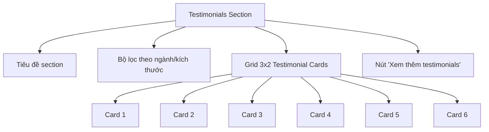

#### Testimonial Card Structure:  

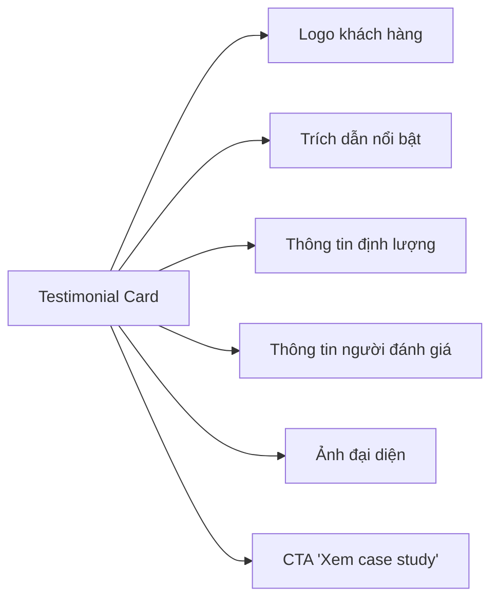

#### Carousel Layout (Mobile):  

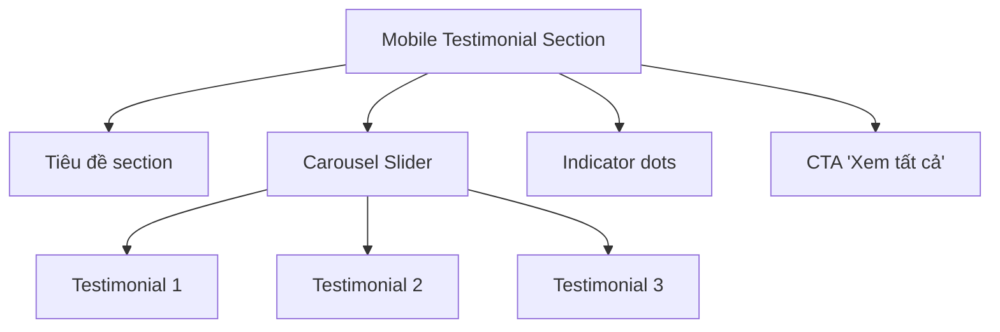

#### Các nguyên tắc bố trí hiệu quả:  

1. **Phân cụm theo ngành**: Cho phép khách truy cập lọc testimonials theo ngành liên quan đến họ  
2. **Xen kẽ định dạng**: Kết hợp văn bản, video và infographic để tăng sự đa dạng  
3. **Hiển thị số lượng**: Hiển thị tổng số testimonials (ví dụ: "Xem tất cả 48 testimonials")  
4. **Social proof tích hợp**: Hiển thị số lượt xem/chia sẻ của mỗi testimonial  
5. **Tính xác thực**: Thêm liên kết đến LinkedIn của người đánh giá khi có thể  

Theo nghiên cứu, việc đặt testimonials ở vị trí chiến lược trên trang web có thể tăng tỷ lệ chuyển đổi lên đến 34%.  

## 3. Trust Badges & Certifications  

### 3.1 Các loại chứng nhận/chứng chỉ phù hợp với ngành may mặc B2B  

Chứng nhận là một cách tuyệt vời để truyền đạt sự đầu tư của bạn vào sản xuất và sản phẩm có suy nghĩ. Đối với các công ty B2B, chứng nhận có thể giúp họ đánh dấu khi bán cho các doanh nghiệp yêu cầu hoặc ưa thích mức độ xác minh của bên thứ ba này.  

#### Bảng chứng nhận quan trọng cho ngành may mặc:  

| Loại chứng nhận | Mô tả | Ví dụ cụ thể | Tác động đến niềm tin |  
|-----------------|-------|--------------|------------------------|  
| **Chất lượng & An toàn** | Kiểm tra chất độc hại trong vải và phụ liệu | OEKO-TEX® STANDARD 100 | Đảm bảo sản phẩm an toàn cho người tiêu dùng |  
| **Bền vững & Hữu cơ** | Xác minh nguồn gốc hữu cơ và bền vững | GOTS (Global Organic Textile Standard) | Chứng minh cam kết môi trường |  
| **Quy trình sản xuất** | Đánh giá quy trình sản xuất | ISO 9001, STeP by OEKO-TEX® | Đảm bảo chất lượng nhất quán |  
| **Trách nhiệm xã hội** | Đánh giá điều kiện lao động và quyền con người | OEKO-TEX® RESPONSIBLE BUSINESS | Chứng minh thực hành đạo đức |  
| **Quản lý môi trường** | Hệ thống quản lý môi trường | ISO 14001 | Chứng minh cam kết bền vững |  
| **Truy xuất nguồn gốc** | Xác minh nguồn gốc nguyên liệu | OEKO-TEX® MADE IN GREEN | Minh bạch chuỗi cung ứng |  

Các chứng nhận này đặc biệt có giá trị trong các lĩnh vực sau:  

1. **Sản xuất vải bền vững**: Đảm bảo sợi trong bất kỳ sản phẩm hoặc bao bì nguyên sinh nào đều đến từ rừng được chứng nhận FSC® hoặc PEFC và không có khả năng lấy từ rừng cổ xưa và đang bị đe dọa.  

2. **Nhựa tái chế**: Sản xuất màng nhựa dẻo tái chế, nơi hỗn hợp màng được đo lường thông qua cân bằng khối lượng, với mục tiêu tổng thể là sử dụng càng nhiều nội dung tái chế sau tiêu dùng càng tốt.  

3. **Bao bì có thể tái chế**: Bao bì và sản phẩm có thể tái chế dễ bị nhầm lẫn với các sản phẩm tiêu chuẩn không thể tái chế.  

Tuy nhiên, cần lưu ý rằng chứng nhận không phải là viên đạn bạc. Chúng phục vụ hai mục đích chính: (1) tiếp thị và xây dựng thương hiệu và (2) kiểm toán bên thứ ba. Chi phí ban đầu và phí hàng năm liên quan đến chứng nhận là đáng kể, nhưng chúng có thể có ROI tích cực nếu bạn tin rằng chúng sẽ làm tăng doanh số và lòng trung thành của khách hàng.  

### 3.2 Cách trình bày logos đối tác/khách hàng (social proof)  

Hiển thị logo của các công ty bạn đã làm việc cùng là một tín hiệu tin cậy tuyệt vời cho khách hàng tiềm năng. Dưới đây là các phương pháp hiệu quả để trình bày logos đối tác:  

#### Layout Grid:  

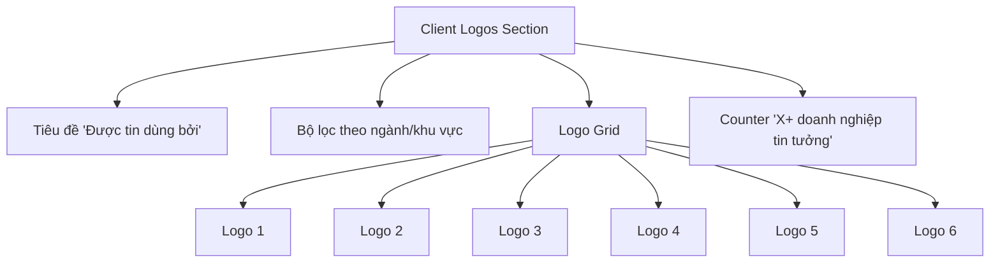

#### Các nguyên tắc trình bày hiệu quả:  

1. **Nhóm theo ngành**: Phân nhóm logos theo ngành công nghiệp để khách truy cập dễ dàng tìm thấy các công ty tương tự  
2. **Hiệu ứng hover**: Thêm thông tin bổ sung khi di chuột qua mỗi logo (ví dụ: tên công ty, ngành, thời gian hợp tác)  
3. **Đồng nhất về kích thước**: Đảm bảo tất cả logos có cùng kích thước và định dạng để tạo cảm giác chuyên nghiệp  
4. **Cập nhật thường xuyên**: Thêm logos mới khi có khách hàng mới để thể hiện sự phát triển  
5. **Liên kết đến case studies**: Cho phép người dùng nhấp vào logos để xem case studies chi tiết  

Trang đích CultureAmp cho thấy họ đánh giá cao niềm tin như thế nào. Các khách hàng hàng đầu của họ được liệt kê ngay dưới fold, thậm chí trên các yếu tố chính như testimonials, so sánh sản phẩm và tuyên bố sứ mệnh. Họ biết rằng khách truy cập sẽ cảm thấy thoải mái nếu họ biết rằng CultureAmp đã được những thương hiệu lớn nhất mà họ biết đến tin cậy.  

### 3.3 Security badges & privacy certification suggestions  

Huy hiệu bảo mật là một trong những tín hiệu tin cậy quan trọng nhất, đặc biệt khi khách hàng cần cung cấp thông tin nhạy cảm. Một ví dụ điển hình là huy hiệu "Norton Secured" thường được đặt trên trang thanh toán. Người tiêu dùng tự nhiên miễn cưỡng nhập thông tin thẻ tín dụng hoặc dữ liệu nhạy cảm khác trực tuyến, vì vậy huy hiệu đó giúp họ cảm thấy an toàn hơn nhiều.  

#### Các huy hiệu bảo mật quan trọng cho B2B may mặc:  

| Loại huy hiệu | Mô tả | Vị trí đặt | Tác động |  
|---------------|-------|------------|----------|  
| **SSL Certificate** | Hiển thị "https" và biểu tượng khóa | Thanh địa chỉ, footer | Đảm bảo kết nối an toàn |  
| **PCI Compliance** | Tuân thủ tiêu chuẩn bảo mật thẻ | Trang thanh toán | Bảo vệ giao dịch |  
| **GDPR Compliance** | Tuân thủ quy định bảo vệ dữ liệu | Privacy policy, forms | Bảo vệ dữ liệu cá nhân |  
| **Norton/McAfee Secure** | Quét virus và malware | Footer, checkout | Đảm bảo trang web an toàn |  
| **TrustArc (TRUSTe)** | Chứng nhận quyền riêng tư | Forms, footer | Xây dựng niềm tin về dữ liệu |  

Đảm bảo rằng URL thương hiệu của bạn bắt đầu bằng "https", điều này cho biết mã hóa SSL. Nếu không, khách truy cập có thể phải đối mặt với cảnh báo của Google nói rằng, "Trang web này không an toàn! Quay lại an toàn?" Các trang thương mại điện tử cũng có thể muốn thêm huy hiệu tin cậy "mã hóa SSL 256-bit".  

### 3.4 Industry association memberships cần hiển thị  

Hiển thị thành viên hiệp hội ngành là một cách hiệu quả để xây dựng uy tín và thể hiện cam kết với các tiêu chuẩn ngành. Đặt huy hiệu BBB trên trang web của bạn cho thấy bạn được hỗ trợ bởi một nguồn trung lập. Tất nhiên, thậm chí còn tốt hơn nếu bạn có thể hiển thị xếp hạng A+.  

#### Các hiệp hội ngành may mặc B2B quan trọng:  

| Hiệp hội | Lợi ích hiển thị | Vị trí đặt |  
|----------|------------------|------------|  
| **Better Cotton Initiative** | Cam kết với thực hành cotton bền vững | Product pages, About Us |  
| **Sustainable Apparel Coalition** | Cam kết với tính bền vững trong ngành may mặc | About Us, Sustainability page |  
| **AAFA (American Apparel & Footwear Association)** | Tuân thủ tiêu chuẩn ngành | Footer, About Us |  
| **EURATEX (European Apparel and Textile Confederation)** | Uy tín tại thị trường châu Âu | Regional pages, About Us |  
| **VITAS (Vietnam Textile and Apparel Association)** | Kết nối địa phương tại Việt Nam | About Us, Partners page |  

Hiển thị thành viên hiệp hội không chỉ tăng cường uy tín mà còn thể hiện cam kết của bạn với các tiêu chuẩn ngành và thực hành tốt nhất.  

## 4. Social Proof Elements  

### 4.1 Download/usage statistics presentation (design & copy)  

Thống kê sử dụng là một hình thức bằng chứng xã hội mạnh mẽ, đặc biệt trong môi trường B2B. QuickBooks Payroll là một ví dụ tuyệt vời về doanh nghiệp đi thẳng vào niềm tin. Ngay khi bạn truy cập trang web của họ, bạn sẽ thấy ba sự kiện chính, trong đó có "1.4 triệu doanh nghiệp đã sử dụng QuickBooks Payroll".  

#### Cách trình bày thống kê hiệu quả:  

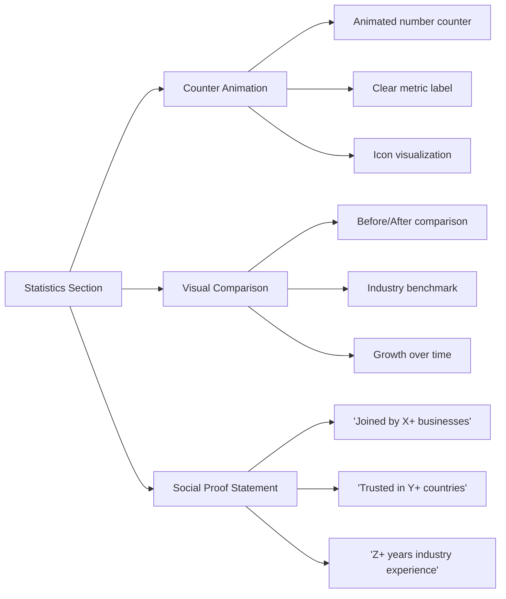

#### Mẫu copy hiệu quả cho thống kê:  

| Loại thống kê | Mẫu copy | Hiệu ứng trực quan |  
|---------------|----------|-------------------|  
| **Số lượng khách hàng** | "Đồng hành cùng 500+ nhà sản xuất may mặc trên toàn cầu" | Counter animation từ 0 đến 500+ |  
| **Khối lượng sản xuất** | "Quản lý 2M+ sản phẩm may mặc mỗi năm" | Animated progress bar |  
| **Tiết kiệm thời gian** | "Giúp khách hàng tiết kiệm trung bình 15+ giờ mỗi tuần" | Đồng hồ đếm ngược animation |  
| **Tỷ lệ hài lòng** | "97% khách hàng đánh giá dịch vụ của chúng tôi 'Xuất sắc'" | Radial progress circle |  
| **Phạm vi toàn cầu** | "Hiện diện tại 35+ quốc gia, 5 châu lục" | Interactive map highlight |  

Theo nghiên cứu, doanh nghiệp có "đánh giá xuất sắc" thấy chi tiêu tăng 31%, và 92% khách hàng có nhiều khả năng sử dụng doanh nghiệp địa phương nếu nó có xếp hạng ít nhất 4 sao.  

### 4.2 "Được tin dùng bởi" section layout  

Section "Được tin dùng bởi" là một cách hiệu quả để tận dụng uy tín của các thương hiệu nổi tiếng mà bạn đã làm việc cùng. SEMrush quảng bá sự phổ biến của dịch vụ của mình bằng cách sử dụng các doanh nghiệp nổi tiếng.  

#### Layout hiệu quả:  

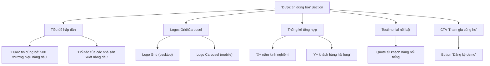

#### Các nguyên tắc thiết kế hiệu quả:  

1. **Phân cấp trực quan**: Đặt các thương hiệu lớn/nổi tiếng nhất ở vị trí nổi bật  
2. **Nhóm theo ngành**: Tổ chức logos theo ngành liên quan đến khách truy cập  
3. **Hiệu ứng hover**: Hiển thị thông tin bổ sung khi di chuột qua mỗi logo  
4. **Liên kết đến case studies**: Cho phép người dùng nhấp vào logos để xem chi tiết  
5. **Cập nhật thường xuyên**: Thêm logos mới để thể hiện sự phát triển liên tục  

Một ví dụ tốt là cách ZineOne sử dụng giải thưởng. ZineOne đã nhận được giải thưởng từ Gartner trong ba lĩnh vực khác nhau, mỗi lĩnh vực đều liên quan đến dịch vụ họ cung cấp. Hãy đảm bảo nêu bật bất kỳ sự công nhận nào phản ánh giá trị bạn cung cấp cho khách hàng.  

### 4.3 Client logos gallery layout & design  

Bố cục gallery logos khách hàng cần được thiết kế để tạo ấn tượng mạnh mẽ và xây dựng niềm tin ngay lập tức. Dưới đây là các khuyến nghị thiết kế:  

#### Layout options:  

| Layout | Ưu điểm | Phù hợp với |  
|--------|---------|-------------|  
| **Grid layout** | Hiển thị nhiều logos cùng lúc | Desktop, nhiều khách hàng |  
| **Carousel slider** | Tiết kiệm không gian, tương tác | Mobile, limited space |  
| **Marquee scrolling** | Dynamic, thu hút sự chú ý | Danh sách dài logos |  
| **Interactive map** | Hiển thị phạm vi địa lý | Global businesses |  
| **Filterable gallery** | Cho phép lọc theo ngành/khu vực | Diverse client base |  

#### Nguyên tắc thiết kế:  

1. **Nhất quán về kích thước**: Đảm bảo tất cả logos có cùng chiều cao để tạo cảm giác chuyên nghiệp  
2. **Không gian trắng**: Để đủ khoảng trắng giữa các logos để tránh cảm giác lộn xộn  
3. **Grayscale với hover color**: Hiển thị logos ở dạng grayscale, chuyển sang màu khi hover  
4. **Responsive design**: Đảm bảo gallery hiển thị tốt trên tất cả thiết bị  
5. **Tối ưu hóa tốc độ tải**: Nén hình ảnh để đảm bảo tải nhanh  

Một ví dụ tốt là trang đích của CultureAmp, nơi các khách hàng hàng đầu được liệt kê ngay dưới fold, thậm chí trên các yếu tố chính như testimonials và tuyên bố sứ mệnh.  

### 4.4 User ratings & reviews display format  

Đánh giá và nhận xét của người dùng là một trong những hình thức bằng chứng xã hội mạnh mẽ nhất. Một trong những điều đầu tiên mà người mua tham khảo khi mua sắm trực tuyến là đánh giá của người mua.  

#### Format hiển thị hiệu quả:  

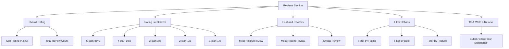

#### Các nguyên tắc hiển thị đánh giá:  

1. **Hiển thị tổng quan**: Luôn hiển thị xếp hạng trung bình và tổng số đánh giá  
2. **Phân tích chi tiết**: Hiển thị phân bố xếp hạng (bao nhiêu 5 sao, 4 sao, v.v.)  
3. **Đánh giá nổi bật**: Hiển thị đánh giá hữu ích nhất ở vị trí nổi bật  
4. **Tính xác thực**: Hiển thị thông tin người đánh giá (tên, chức danh, công ty)  
5. **Phản hồi**: Hiển thị phản hồi của công ty đối với đánh giá tiêu cực  

Theo nghiên cứu, hầu hết người tiêu dùng trong nhóm tuổi 18 đến 24 mong đợi hơn 200 đánh giá cho mỗi sản phẩm. Số lượng đánh giá mong đợi trung bình là 112.  

## 5. Trust-Building Copy  

### 5.1 Privacy & data usage statements mẫu  

Chính sách quyền riêng tư là một yếu tố quan trọng trong việc xây dựng niềm tin. Khách truy cập của bạn có thể không bao giờ đọc chính sách quyền riêng tư của bạn, nhưng hầu hết các trang web đều được yêu cầu về mặt pháp lý phải có một chính sách. Dù có yêu cầu hay không, việc không có chính sách là một dấu hiệu đáng ngờ.  

#### Mẫu statement ngắn gọn:  

```markdown  
## Cam Kết Bảo Mật Dữ Liệu  

Tại [Tên công ty], chúng tôi coi trọng quyền riêng tư của bạn. Chúng tôi cam kết:  

- **Bảo vệ thông tin**: Mọi dữ liệu được mã hóa bằng công nghệ SSL 256-bit  
- **Minh bạch**: Chúng tôi không bao giờ bán dữ liệu của bạn cho bên thứ ba  
- **Kiểm soát**: Bạn có thể yêu cầu xóa dữ liệu bất kỳ lúc nào  
- **Tuân thủ**: Chúng tôi tuân thủ đầy đủ GDPR và các quy định bảo vệ dữ liệu  

[Xem Chính Sách Đầy Đủ](#) | [Liên Hệ Đội Bảo Mật](#)  
```  

#### Nguyên tắc viết hiệu quả:  

1. **Ngôn ngữ đơn giản**: Tránh thuật ngữ pháp lý phức tạp  
2. **Định dạng dễ đọc**: Sử dụng bullet points và đoạn ngắn  
3. **Minh bạch**: Nêu rõ cách bạn sử dụng dữ liệu  
4. **Quyền kiểm soát**: Nhấn mạnh quyền kiểm soát của người dùng đối với dữ liệu của họ  
5. **Liên hệ**: Cung cấp thông tin liên hệ cho các câu hỏi về quyền riêng tư  

Nếu bạn phải yêu cầu thông tin từ người dùng, hãy cung cấp lý do tại sao bạn đang đưa ra yêu cầu. Một nghiên cứu năm 1978 của Langer và Chanowitz phát hiện ra rằng, khi mọi người được cung cấp lý do (ví dụ: "bởi vì" hoặc "để"), họ có nhiều khả năng tuân thủ các yêu cầu và tin tưởng rằng những yêu cầu đó là hợp pháp.  

### 5.2 Money-back guarantee wording (nếu có)  

Bảo đảm hoàn tiền là một công cụ mạnh mẽ để xây dựng niềm tin, đặc biệt trong môi trường B2B nơi các quyết định mua hàng thường liên quan đến rủi ro cao hơn.  

#### Mẫu bảo đảm hoàn tiền:  

```markdown  
## Cam Kết Hài Lòng 100%  

Chúng tôi tin tưởng vào chất lượng dịch vụ của mình. Nếu bạn không hoàn toàn hài lòng trong vòng 30 ngày đầu tiên:  

✓ **Hoàn tiền 100%** không cần lý do  
✓ **Quy trình đơn giản** - không có câu hỏi phức tạp  
✓ **Hỗ trợ chuyển đổi** sang giải pháp khác nếu cần  

Chúng tôi chỉ thành công khi bạn thành công. Đó là lý do tại sao chúng tôi loại bỏ mọi rủi ro cho bạn.  

[Chi Tiết Chính Sách](#) | [Liên Hệ Hỗ Trợ](#)  
```  

#### Các yếu tố quan trọng cần bao gồm:  

1. **Thời hạn cụ thể**: Nêu rõ khoảng thời gian bảo đảm (30 ngày, 60 ngày, v.v.)  
2. **Điều kiện rõ ràng**: Nêu rõ bất kỳ điều kiện nào (nếu có)  
3. **Quy trình đơn giản**: Nhấn mạnh quy trình hoàn tiền dễ dàng  
4. **Lý do tự tin**: Giải thích tại sao bạn có thể đưa ra bảo đảm này  
5. **Xóa bỏ rủi ro**: Nhấn mạnh việc loại bỏ rủi ro cho khách hàng  

Bảo đảm hoàn tiền hoạt động bằng cách giảm rủi ro cảm nhận và thể hiện sự tự tin vào sản phẩm hoặc dịch vụ của bạn.  

### 5.3 Anti-spam commitment wording  

Cam kết chống spam là một yếu tố quan trọng để xây dựng niềm tin, đặc biệt khi thu thập địa chỉ email hoặc thông tin liên hệ khác.  

#### Mẫu cam kết chống spam:  

```markdown  
## Cam Kết Không Spam  

Khi bạn chia sẻ email với chúng tôi:  

✓ **Không spam** - chúng tôi ghét spam cũng như bạn  
✓ **Kiểm soát tần suất** - bạn chọn nhận bao nhiêu email  
✓ **Nội dung giá trị** - chỉ gửi thông tin hữu ích và liên quan  
✓ **Dễ dàng hủy đăng ký** - một cú nhấp chuột, không có câu hỏi  

Chúng tôi tôn trọng hộp thư đến của bạn và sự tin tưởng của bạn.  

[Xem Chính Sách Email](#) | [Tùy Chỉnh Tùy Chọn](#)  
```  

#### Nguyên tắc viết hiệu quả:  

1. **Ngôn ngữ đơn giản**: Sử dụng ngôn ngữ rõ ràng, dễ hiểu  
2. **Cam kết cụ thể**: Nêu rõ những gì người dùng có thể mong đợi  
3. **Trao quyền kiểm soát**: Nhấn mạnh quyền kiểm soát của người dùng  
4. **Tính minh bạch**: Trung thực về cách bạn sẽ sử dụng thông tin liên hệ  
5. **Đặt gần form**: Đặt cam kết này gần các form thu thập email  

Cam kết chống spam giúp giảm lo lắng của người dùng về việc chia sẻ thông tin liên hệ và tăng tỷ lệ chuyển đổi form.  

### 5.4 FAQ entries để tăng trust  

FAQ (Câu hỏi thường gặp) là một công cụ mạnh mẽ để xây dựng niềm tin bằng cách giải quyết các mối quan tâm và câu hỏi phổ biến. Cung cấp truy cập dễ dàng vào FAQ, trang hỗ trợ và diễn đàn. Nói cách khác, không ẩn thông tin này sau tường đăng nhập và làm cho nó có sẵn cho cả khách hàng tiềm năng và hiện tại.  

#### Các câu hỏi quan trọng để tăng niềm tin:  

| Loại câu hỏi | Ví dụ | Tại sao tăng niềm tin |  
|--------------|-------|------------------------|  
| **Bảo mật dữ liệu** | "Dữ liệu của chúng tôi được bảo vệ như thế nào?" | Giải quyết lo ngại về bảo mật |  
| **Quy trình làm việc** | "Quy trình làm việc với [Công ty] như thế nào?" | Tạo sự minh bạch về quy trình |  
| **Chứng nhận & Tuân thủ** | "Các chứng nhận nào [Công ty] đã đạt được?" | Xác nhận uy tín và tuân thủ |  
| **Hỗ trợ & Dịch vụ** | "Làm thế nào để nhận hỗ trợ khi cần?" | Đảm bảo hỗ trợ liên tục |  
| **Giá trị & ROI** | "Làm thế nào để đo lường ROI từ dịch vụ của bạn?" | Chứng minh giá trị kinh doanh |  

#### Format hiệu quả cho FAQ:  

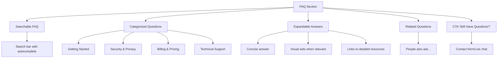

#### Nguyên tắc viết FAQ hiệu quả:  

1. **Trung thực**: Trả lời câu hỏi một cách trung thực, không né tránh  
2. **Cập nhật**: Thường xuyên cập nhật FAQ với câu hỏi mới  
3. **Ngôn ngữ đơn giản**: Tránh thuật ngữ kỹ thuật phức tạp  
4. **Hữu ích**: Cung cấp câu trả lời thực sự giải quyết vấn đề  
5. **Dễ điều hướng**: Tổ chức FAQ theo danh mục logic  

Bằng cách trả lời những lo ngại này trước, trang web có thể đảm bảo với người dùng không chắc chắn rằng công ty có thể (và sẽ) có thể giải quyết bất kỳ vấn đề tiềm ẩn nào, tiếp tục xây dựng niềm tin và trao quyền cho người dùng trong nỗ lực thuyết phục đồng nghiệp hoặc sếp của họ.  

## 6. Visual Trust Elements  

### 6.1 HTTPS & security indicators  

Các chỉ báo bảo mật trực quan là những tín hiệu tin cậy quan trọng giúp khách truy cập cảm thấy an toàn khi tương tác với trang web của bạn. Một trang web chuyên nghiệp cho thấy khách truy cập rằng bạn coi trọng doanh nghiệp và hình ảnh của mình.  

#### Các chỉ báo bảo mật quan trọng:  

| Chỉ báo | Mô tả | Vị trí đặt |  
|---------|-------|------------|  
| **HTTPS Padlock** | Biểu tượng khóa trong thanh địa chỉ | Browser address bar |  
| **SSL Badge** | Huy hiệu chứng nhận SSL | Footer, checkout pages |  
| **Security Seals** | Norton, McAfee, TrustGuard | Footer, forms |  
| **Payment Icons** | Visa, Mastercard, PayPal | Checkout, pricing pages |  
| **GDPR Compliance** | Biểu tượng tuân thủ GDPR | Forms, cookie notices |  

#### Hiển thị hiệu quả:  

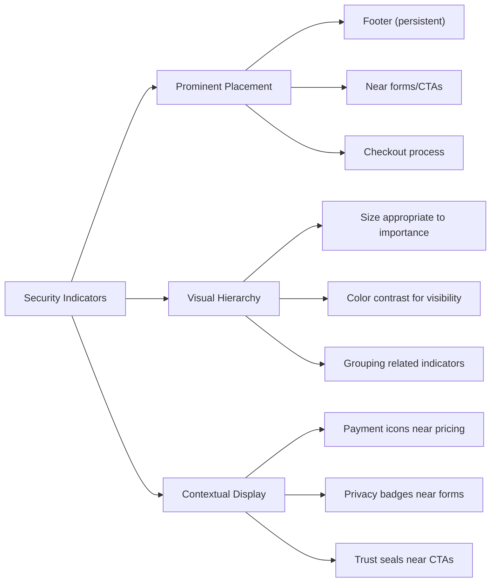

Đảm bảo rằng trang web của bạn có chứng chỉ SSL là một cách tuyệt vời để cho khách hàng tiềm năng biết rằng bất kỳ thông tin nào họ cung cấp cho bạn đều an toàn.  

### 6.2 Professional design elements  

Thiết kế chuyên nghiệp là một tín hiệu tin cậy quan trọng. Đầu tư vào thiết kế chất lượng, tùy chỉnh. Nếu trang web của bạn trông như thể nó được dựng lên một cách cẩu thả với ít sự quan tâm và chú ý đến chi tiết, đó chính xác là những gì khách truy cập sẽ nghĩ về bạn và sản phẩm của bạn.  

#### Các yếu tố thiết kế chuyên nghiệp:  

| Yếu tố | Mô tả | Tác động đến niềm tin |  
|--------|-------|------------------------|  
| **Clean Navigation** | Điều hướng đơn giản, trực quan | Gợi ý minh bạch và làm cho khách truy cập thoải mái hơn khi điền form hoặc hoàn tất giao dịch |  
| **Page Loading Speed** | Trang web tải nhanh | Một cách để tạo ấn tượng đầu tiên tốt là có một trang web tải nhanh. Một trang web phản hồi nhanh gợi ý một thương hiệu phản hồi nhanh |  
| **Responsive Design** | Hiển thị tốt trên mọi thiết bị | Thể hiện sự chuyên nghiệp và quan tâm đến trải nghiệm người dùng |  
| **Consistent Branding** | Màu sắc, font chữ nhất quán | Tạo cảm giác chuyên nghiệp và đáng tin cậy |  
| **High-Quality Images** | Hình ảnh rõ nét, chuyên nghiệp | Phản ánh chất lượng sản phẩm/dịch vụ |  

#### Nguyên tắc thiết kế hiệu quả:  

1. **Không gian trắng**: Sử dụng không gian trắng để tạo cảm giác gọn gàng, dễ đọc  
2. **Typography**: Sử dụng font chữ dễ đọc, chuyên nghiệp  
3. **Color psychology**: Sử dụng màu sắc phù hợp với ngành và thông điệp  
4. **Visual hierarchy**: Hướng dẫn người dùng đến thông tin quan trọng nhất  
5. **Consistency**: Duy trì thiết kế nhất quán trên tất cả các trang  

Một trang web được thiết kế chuyên nghiệp không chỉ tăng niềm tin mà còn cải thiện trải nghiệm người dùng tổng thể, dẫn đến tỷ lệ chuyển đổi cao hơn.  

### 6.3 Brand consistency elements  

Tính nhất quán của thương hiệu là một yếu tố quan trọng trong việc xây dựng niềm tin. Khi một công ty rõ ràng về việc nó là ai và nó đại diện cho điều gì, và người dùng phù hợp với điều đó, công ty sẽ tạo ra một hợp âm sẽ cộng hưởng với những người dùng đó lâu sau một tương tác kỹ thuật số duy nhất.  

#### Các yếu tố nhất quán thương hiệu:  

| Yếu tố | Mô tả | Triển khai |  
|--------|-------|------------|  
| **Logo Placement** | Vị trí logo nhất quán | Header, favicon, footer |  
| **Color Scheme** | Bảng màu thương hiệu | Buttons, accents, backgrounds |  
| **Typography** | Hệ thống font chữ nhất quán | Headings, body text, CTAs |  
| **Voice & Tone** | Phong cách viết nhất quán | All copy, emails, notifications |  
| **Visual Style** | Phong cách hình ảnh, icon | Images, illustrations, icons |  

#### Triển khai hiệu quả:  

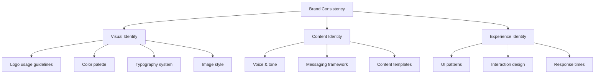

Tính nhất quán của thương hiệu tạo ra cảm giác quen thuộc và đáng tin cậy, giúp khách hàng cảm thấy thoải mái hơn khi tương tác với thương hiệu của bạn.  

### 6.4 Human elements (team photos, author bio, etc.)  

Yếu tố con người là một phần quan trọng của việc xây dựng niềm tin. Người tham gia nghiên cứu của chúng tôi cho biết việc nhìn thấy vị trí vật lý và con người đằng sau sản phẩm hoặc dịch vụ củng cố niềm tin của họ rằng doanh nghiệp là hợp pháp.  

#### Các yếu tố con người hiệu quả:  

| Yếu tố | Mô tả | Vị trí đặt |  
|--------|-------|------------|  
| **Team Photos** | Hình ảnh chuyên nghiệp của team | About Us, Team page |  
| **Leadership Bios** | Tiểu sử của lãnh đạo công ty | Leadership page |  
| **Author Information** | Thông tin tác giả blog/content | Blog posts, articles |  
| **Customer Support Faces** | Hình ảnh đội ngũ hỗ trợ | Contact, Support pages |  
| **Office/Facility Photos** | Hình ảnh văn phòng, cơ sở sản xuất | About Us, Locations pages |  

#### Nguyên tắc hiển thị hiệu quả:  

1. **Authenticity**: Sử dụng hình ảnh thực, không phải stock photos  
2. **Professionalism**: Đảm bảo chất lượng hình ảnh chuyên nghiệp  
3. **Personality**: Thể hiện văn hóa và cá tính của công ty  
4. **Diversity**: Thể hiện sự đa dạng của team  
5. **Context**: Hiển thị team trong môi trường làm việc thực tế  

Các trang này là cơ hội tuyệt vời để trưng bày hình ảnh của nhân viên công ty và cơ sở của nó (nếu có), và cũng là những điểm khác biệt cụ thể (như giá trị công ty hoặc đổi mới công nghệ).  

Trang "About Us" hoặc "Team" là một trong những trang được truy cập nhiều nhất, đặc biệt là trong tiếp thị B2B, vì khách hàng tiềm năng muốn xem họ đang mua từ ai hoặc họ sẽ làm việc với ai.  

## 7. Tối ưu hóa theo phân khúc khách hàng  

### 7.1 Điều chỉnh testimonials cho nhà sản xuất lớn  

Nhà sản xuất lớn thường quan tâm đến khả năng mở rộng, tuân thủ và tích hợp hệ thống. Testimonials nên được điều chỉnh để phản ánh những ưu tiên này.  

#### Template testimonial cho nhà sản xuất lớn:  

```markdown  
"[Vấn đề quy mô lớn] là thách thức lớn nhất của chúng tôi với [X] nhà máy tại [Y] quốc gia. [Công ty bạn] đã triển khai [giải pháp] chỉ trong [thời gian], giúp chúng tôi [kết quả chính]."  

**Kết quả cụ thể:**  
- [Số liệu cải thiện hiệu suất] trên [số lượng] dây chuyền sản xuất  
- [Số liệu tuân thủ] đạt được trong [thời gian]  
- ROI [X]% trong [thời gian]  

[Tên] | [Chức danh cấp cao] tại [Công ty lớn, nổi tiếng]  
```  

#### Các yếu tố cần nhấn mạnh:  

1. **Quy mô triển khai**: Số lượng nhà máy, dây chuyền, quốc gia  
2. **Tuân thủ tiêu chuẩn**: Đạt được chứng nhận, tuân thủ quy định  
3. **Tích hợp hệ thống**: Khả năng tích hợp với hệ thống hiện có  
4. **ROI rõ ràng**: Số liệu ROI cụ thể, thời gian hoàn vốn  
5. **Hỗ trợ toàn cầu**: Khả năng hỗ trợ hoạt động toàn cầu  

### 7.2 Điều chỉnh case studies cho thương hiệu vừa và nhỏ  

Thương hiệu vừa và nhỏ thường quan tâm đến chi phí, tính linh hoạt và thời gian triển khai nhanh. Case studies nên được điều chỉnh để phản ánh những ưu tiên này.  

#### Template case study cho SME (120-150 từ):  

```markdown  
## [Tên thương hiệu]: Từ [thách thức] đến [kết quả] trong [thời gian]  

### THÁCH THỨC  
[Thương hiệu] đang phát triển nhanh chóng với [X] SKUs và [Y] kênh bán hàng, nhưng gặp khó khăn với [vấn đề cụ thể] dẫn đến [hậu quả].  

### GIẢI PHÁP  
- Triển khai [giải pháp] với chi phí [Z]% thấp hơn các giải pháp enterprise  
- Đào tạo toàn bộ team chỉ trong [thời gian ngắn]  
- Tùy chỉnh [tính năng] để phù hợp với quy trình hiện tại  

### KẾT QUẢ  
- Tăng [metric kinh doanh chính] lên [X]% trong [thời gian ngắn]  
- Tiết kiệm [Y]% chi phí vận hành  
- Mở rộng sang [thị trường/kênh mới] mà không cần thêm nhân sự  

> "Giải pháp không chỉ phù hợp với ngân sách mà còn phát triển cùng chúng tôi." - [Tên], [Chức danh]  
```  

#### Các yếu tố cần nhấn mạnh:  

1. **Chi phí hợp lý**: ROI cao, chi phí ban đầu thấp  
2. **Triển khai nhanh**: Thời gian đi vào hoạt động ngắn  
3. **Tính linh hoạt**: Khả năng tùy chỉnh, mở rộng  
4. **Hỗ trợ cá nhân hóa**: Dịch vụ khách hàng cá nhân hóa  
5. **Kết quả nhanh chóng**: Thời gian đến khi có kết quả ngắn  

### 7.3 Điều chỉnh social proof cho nhà bán lẻ/phân phối  

Nhà bán lẻ và phân phối thường quan tâm đến tốc độ giao hàng, chất lượng sản phẩm và dịch vụ khách hàng. Social proof nên được điều chỉnh để phản ánh những ưu tiên này.  

#### Layout social proof cho nhà bán lẻ/phân phối:  

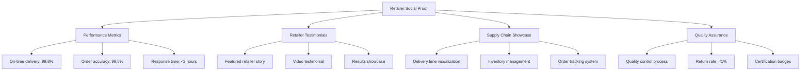

#### Các yếu tố cần nhấn mạnh:  

1. **Tốc độ giao hàng**: Thời gian giao hàng, tỷ lệ đúng hẹn  
2. **Chất lượng sản phẩm**: Tỷ lệ lỗi, tỷ lệ hoàn hàng  
3. **Dịch vụ khách hàng**: Thời gian phản hồi, giải quyết vấn đề  
4. **Tính linh hoạt**: Khả năng đáp ứng nhu cầu thay đổi  
5. **Tích hợp hệ thống**: Khả năng tích hợp với hệ thống bán lẻ  

## 8. Triển khai kỹ thuật với NextJS và Tailwind CSS  

### 8.1 Testimonials & Case Studies Components  

Dưới đây là các ví dụ về cách triển khai các thành phần testimonials và case studies bằng NextJS và Tailwind CSS:  

#### Testimonial Card Component:  

```jsx  
// components/TestimonialCard.js  
import Image from 'next/image';  
import { useState } from 'react';  

export default function TestimonialCard({ testimonial }) {  
  const [showDetails, setShowDetails] = useState(false);  
  
  return (  
    <div className="bg-white rounded-lg shadow-lg p-6 transition-all duration-300 hover:shadow-xl">  
      {/* Logo */}  
      <div className="mb-4 h-12">  
        <Image   
          src={testimonial.companyLogo}   
          alt={`${testimonial.companyName} logo`}  
          width={120}  
          height={48}  
          objectFit="contain"  
        />  
      </div>  
      
      {/* Quote */}  
      <p className="text-gray-700 italic mb-4">"{testimonial.quote}"</p>  
      
      {/* Results */}  
      <div className="bg-gray-50 p-3 rounded mb-4">  
        <p className="font-semibold text-gray-800">Kết quả:</p>  
        <p className="text-gray-700">{testimonial.results}</p>  
      </div>  
      
      {/* Author */}  
      <div className="flex items-center">  
        <div className="w-12 h-12 mr-4 rounded-full overflow-hidden">  
          <Image   
            src={testimonial.authorImage}   
            alt={testimonial.authorName}  
            width={48}  
            height={48}  
            className="rounded-full"  
          />  
        </div>  
        <div>  
          <p className="font-bold text-gray-900">{testimonial.authorName}</p>  
          <p className="text-gray-600">{testimonial.authorTitle} tại {testimonial.companyName}</p>  
        </div>  
      </div>  
      
      {/* View Case Study Button */}  
      <button   
        className="mt-4 text-blue-600 hover:text-blue-800 flex items-center"  
        onClick={() => setShowDetails(!showDetails)}  
      >  
        {showDetails ? 'Ẩn chi tiết' : 'Xem case study'}  
        <svg xmlns="http://www.w3.org/2000/svg" className="h-4 w-4 ml-1" fill="none" viewBox="0 0 24 24" stroke="currentColor">  
          <path strokeLinecap="round" strokeLinejoin="round" strokeWidth={2} d="M9 5l7 7-7 7" />  
        </svg>  
      </button>  
      
      {/* Case Study Details */}  
      {showDetails && (  
        <div className="mt-4 pt-4 border-t border-gray-200">  
          <h4 className="font-bold text-lg mb-2">Case Study</h4>  
          <div className="mb-3">  
            <h5 className="font-semibold text-gray-800">Thách thức:</h5>  
            <p className="text-gray-700">{testimonial.challenge}</p>  
          </div>  
          <div className="mb-3">  
            <h5 className="font-semibold text-gray-800">Giải pháp:</h5>  
            <p className="text-gray-700">{testimonial.solution}</p>  
          </div>  
          <div>  
            <h5 className="font-semibold text-gray-800">Kết quả chi tiết:</h5>  
            <ul className="list-disc pl-5 text-gray-700">  
              {testimonial.detailedResults.map((result, index) => (  
                <li key={index}>{result}</li>  
              ))}  
            </ul>  
          </div>  
        </div>  
      )}  
    </div>  
  );  
}  
```  

#### Testimonials Grid Section:  

```jsx  
// components/TestimonialsSection.js  
import { useState } from 'react';  
import TestimonialCard from './TestimonialCard';  

export default function TestimonialsSection({ testimonials }) {  
  const [filter, setFilter] = useState('all');  
  const [visibleCount, setVisibleCount] = useState(6);  
  
  // Filter testimonials based on industry  
  const filteredTestimonials = filter === 'all'   
    ? testimonials   
    : testimonials.filter(t => t.industry === filter);  
  
  // Get visible testimonials  
  const visibleTestimonials = filteredTestimonials.slice(0, visibleCount);  
  
  return (  
    <section className="py-12 bg-gray-50">  
      <div className="container mx-auto px-4">  
        <h2 className="text-3xl font-bold text-center mb-8">Khách hàng nói gì về chúng tôi</h2>  
        
        {/* Filters */}  
        <div className="flex flex-wrap justify-center mb-8">  
          <button   
            className={`mx-2 mb-2 px-4 py-2 rounded-full ${filter === 'all' ? 'bg-blue-600 text-white' : 'bg-white text-gray-800'}`}  
            onClick={() => setFilter('all')}  
          >  
            Tất cả  
          </button>  
          <button   
            className={`mx-2 mb-2 px-4 py-2 rounded-full ${filter === 'manufacturing' ? 'bg-blue-600 text-white' : 'bg-white text-gray-800'}`}  
            onClick={() => setFilter('manufacturing')}  
          >  
            Nhà sản xuất  
          </button>  
          <button   
            className={`mx-2 mb-2 px-4 py-2 rounded-full ${filter === 'retail' ? 'bg-blue-600 text-white' : 'bg-white text-gray-800'}`}  
            onClick={() => setFilter('retail')}  
          >  
            Bán lẻ  
          </button>  
          <button   
            className={`mx-2 mb-2 px-4 py-2 rounded-full ${filter === 'brand' ? 'bg-blue-600 text-white' : 'bg-white text-gray-800'}`}  
            onClick={() => setFilter('brand')}  
          >  
            Thương hiệu  
          </button>  
        </div>  
        
        {/* Testimonials Grid */}  
        <div className="grid grid-cols-1 md:grid-cols-2 lg:grid-cols-3 gap-6">  
          {visibleTestimonials.map((testimonial, index) => (  
            <TestimonialCard key={index} testimonial={testimonial} />  
          ))}  
        </div>  
        
        {/* Load More Button */}  
        {visibleCount < filteredTestimonials.length && (  
          <div className="text-center mt-8">  
            <button   
              className="bg-blue-600 hover:bg-blue-700 text-white px-6 py-3 rounded-lg"  
              onClick={() => setVisibleCount(visibleCount + 6)}  
            >  
              Xem thêm testimonials  
            </button>  
          </div>  
        )}  
        
        {/* Total Count */}  
        <p className="text-center text-gray-600 mt-4">  
          Hiển thị {visibleCount > filteredTestimonials.length ? filteredTestimonials.length : visibleCount}   
          trong tổng số {filteredTestimonials.length} testimonials  
        </p>  
      </div>  
    </section>  
  );  
}  
```  

### 8.2 Trust Badges & Certifications Components  

Dưới đây là cách triển khai phần hiển thị chứng nhận và huy hiệu tin cậy:  

#### Certifications Grid Component:  

```jsx  
// components/CertificationsGrid.js  
import Image from 'next/image';  
import { useState } from 'react';  

export default function CertificationsGrid({ certifications }) {  
  const [activeId, setActiveId] = useState(null);  
  
  return (  
    <section className="py-12 bg-white">  
      <div className="container mx-auto px-4">  
        <h2 className="text-3xl font-bold text-center mb-2">Chứng nhận & Tiêu chuẩn</h2>  
        <p className="text-center text-gray-600 mb-8">Cam kết của chúng tôi với chất lượng và bền vững</p>  
        
        <div className="grid grid-cols-2 md:grid-cols-3 lg:grid-cols-4 gap-6">  
          {certifications.map((cert) => (  
            <div   
              key={cert.id}  
              className="bg-gray-50 rounded-lg p-4 flex flex-col items-center transition-all duration-300 hover:shadow-lg cursor-pointer"  
              onClick={() => setActiveId(activeId === cert.id ? null : cert.id)}  
            >  
              <div className="h-16 w-full flex items-center justify-center mb-4">  
                <Image   
                  src={cert.logo}   
                  alt={cert.name}  
                  width={120}  
                  height={64}  
                  objectFit="contain"  
                />  
              </div>  
              <h3 className="font-semibold text-center mb-2">{cert.name}</h3>  
              
              {activeId === cert.id && (  
                <div className="mt-3 text-sm text-gray-700">  
                  <p>{cert.description}</p>  
                  <a   
                    href={cert.learnMoreUrl}   
                    className="text-blue-600 hover:text-blue-800 mt-2 inline-block"  
                    target="_blank"  
                    rel="noopener noreferrer"  
                  >  
                    Tìm hiểu thêm  
                  </a>  
                </div>  
              )}  
            </div>  
          ))}  
        </div>  
      </div>  
    </section>  
  );  
}  
```  

#### Security Badges Component:  

```jsx  
// components/SecurityBadges.js  
import Image from 'next/image';  

export default function SecurityBadges() {  
  const securityBadges = [  
    { id: 1, name: 'SSL Secured', logo: '/images/ssl-badge.svg', tooltip: 'Trang web này được bảo mật bằng SSL 256-bit' },  
    { id: 2, name: 'GDPR Compliant', logo: '/images/gdpr-badge.svg', tooltip: 'Chúng tôi tuân thủ quy định GDPR về bảo vệ dữ liệu' },  
    { id: 3, name: 'PCI Compliant', logo: '/images/pci-badge.svg', tooltip: 'Giao dịch của bạn được bảo vệ theo tiêu chuẩn PCI DSS' },  
    { id: 4, name: 'Norton Secured', logo: '/images/norton-badge.svg', tooltip: 'Trang web được bảo vệ bởi Norton Security' },  
  ];  
  
  return (  
    <div className="flex flex-wrap items-center justify-center gap-4 py-4 bg-gray-50 border-t border-gray-200">  
      {securityBadges.map((badge) => (  
        <div   
          key={badge.id}  
          className="relative group"  
        >  
          <div className="h-10 w-24 flex items-center justify-center">  
            <Image   
              src={badge.logo}   
              alt={badge.name}  
              width={80}  
              height={40}  
              objectFit="contain"  
            />  
          </div>  
          
          {/* Tooltip */}  
          <div className="absolute bottom-full left-1/2 transform -translate-x-1/2 mb-2 px-3 py-2 bg-gray-800 text-white text-xs rounded opacity-0 invisible group-hover:opacity-100 group-hover:visible transition-all duration-300 w-48 text-center">  
            {badge.tooltip}  
            <div className="absolute top-full left-1/2 transform -translate-x-1/2 border-4 border-transparent border-t-gray-800"></div>  
          </div>  
        </div>  
      ))}  
    </div>  
  );  
}  
```  

### 8.3 Social Proof Components  

Dưới đây là cách triển khai các thành phần social proof:  

#### Client Logos Component:  

```jsx  
// components/ClientLogos.js  
import Image from 'next/image';  
import { useState } from 'react';  

export default function ClientLogos({ clients }) {  
  const [activeId, setActiveId] = useState(null);  
  
  return (  
    <section className="py-12 bg-gray-50">  
      <div className="container mx-auto px-4">  
        <h2 className="text-3xl font-bold text-center mb-2">Được tin dùng bởi</h2>  
        <p className="text-center text-gray-600 mb-8">Hơn 500+ doanh nghiệp hàng đầu đã lựa chọn chúng tôi</p>  
        
        {/* Industry Filters */}  
        <div className="flex flex-wrap justify-center mb-8">  
          <button className="mx-2 mb-2 px-4 py-2 bg-blue-600 text-white rounded-full">Tất cả</button>  
          <button className="mx-2 mb-2 px-4 py-2 bg-white text-gray-800 rounded-full">Nhà sản xuất</button>  
          <button className="mx-2 mb-2 px-4 py-2 bg-white text-gray-800 rounded-full">Thương hiệu</button>  
          <button className="mx-2 mb-2 px-4 py-2 bg-white text-gray-800 rounded-full">Bán lẻ</button>  
        </div>  
        
        {/* Logos Grid */}  
        <div className="grid grid-cols-2 sm:grid-cols-3 md:grid-cols-4 lg:grid-cols-6 gap-6">  
          {clients.map((client) => (  
            <div   
              key={client.id}  
              className="bg-white rounded-lg p-4 flex items-center justify-center h-24 transition-all duration-300 hover:shadow-lg cursor-pointer relative group"  
              onMouseEnter={() => setActiveId(client.id)}  
              onMouseLeave={() => setActiveId(null)}  
            >  
              <Image   
                src={client.logo}   
                alt={client.name}  
                width={120}  
                height={60}  
                objectFit="contain"  
                className="transition-opacity duration-300 group-hover:opacity-80"  
              />  
              
              {/* Hover Popup */}  
              {activeId === client.id && (  
                <div className="absolute top-full left-1/2 transform -translate-x-1/2 mt-2 bg-white shadow-xl rounded-lg p-4 z-10 w-64">  
                  <h3 className="font-bold text-gray-900 mb-1">{client.name}</h3>  
                  <p className="text-gray-600 text-sm mb-2">{client.industry}</p>  
                  <p className="text-gray-700 text-sm mb-3">{client.description}</p>  
                  <div className="flex justify-between">  
                    <a   
                      href={`/case-studies/${client.slug}`}  
                      className="text-blue-600 hover:text-blue-800 text-sm"  
                    >  
                      Xem case study  
                    </a>  
                    <span className="text-gray-500 text-sm">  
                      {client.since}  
                    </span>  
                  </div>  
                </div>  
              )}  
            </div>  
          ))}  
        </div>  
      </div>  
    </section>  
  );  
}  
```  

#### Statistics Counter Component:  

```jsx  
// components/StatisticsCounter.js  
import { useEffect, useState, useRef } from 'react';  

function CounterAnimation({ end, duration = 2000, prefix = '', suffix = '' }) {  
  const [count, setCount] = useState(0);  
  const countRef = useRef(null);  
  
  useEffect(() => {  
    const observer = new IntersectionObserver(  
      ([entry]) => {  
        if (entry.isIntersecting) {  
          let startTime;  
          const startValue = 0;  
          
          const step = (timestamp) => {  
            if (!startTime) startTime = timestamp;  
            const progress = Math.min((timestamp - startTime) / duration, 1);  
            const currentCount = Math.floor(progress * (end - startValue) + startValue);  
            
            setCount(currentCount);  
            
            if (progress < 1) {  
              window.requestAnimationFrame(step);  
            }  
          };  
          
          window.requestAnimationFrame(step);  
          observer.disconnect();  
        }  
      },  
      { threshold: 0.1 }  
    );  
    
    if (countRef.current) {  
      observer.observe(countRef.current);  
    }  
    
    return () => {  
      if (countRef.current) {  
        observer.disconnect();  
      }  
    };  
  }, [end, duration]);  
  
  return (  
    <div ref={countRef} className="text-4xl font-bold text-blue-600">  
      {prefix}{count.toLocaleString()}{suffix}  
    </div>  
  );  
}  

export default function StatisticsCounter() {  
  const stats = [  
    { id: 1, label: 'Khách hàng hài lòng', value: 500, suffix: '+' },  
    { id: 2, label: 'Sản phẩm quản lý mỗi năm', value: 2, suffix: 'M+' },  
    { id: 3, label: 'Quốc gia', value: 35, suffix: '+' },  
    { id: 4, label: 'Tỷ lệ hài lòng', value: 97, suffix: '%' },  
  ];  
  
  return (  
    <section className="py-16 bg-white">  
      <div className="container mx-auto px-4">  
        <div className="grid grid-cols-1 md:grid-cols-2 lg:grid-cols-4 gap-8">  
          {stats.map((stat) => (  
            <div key={stat.id} className="text-center">  
              <CounterAnimation   
                end={stat.value}   
                prefix={stat.prefix || ''}   
                suffix={stat.suffix || ''}   
              />  
              <p className="text-gray-600 mt-2">{stat.label}</p>  
            </div>  
          ))}  
        </div>  
      </div>  
    </section>  
  );  
}  
```  

### 8.4 Trust-Building Copy Components  

Dưới đây là cách triển khai các thành phần copy xây dựng niềm tin:  

#### Privacy Policy Component:  

```jsx  
// components/PrivacyStatement.js  
export default function PrivacyStatement() {  
  return (  
    <div className="bg-gray-50 border border-gray-200 rounded-lg p-6 mb-8">  
      <h3 className="text-xl font-bold text-gray-900 mb-4">Cam Kết Bảo Mật Dữ Liệu</h3>  
      
      <p className="text-gray-700 mb-4">  
        Tại [Tên công ty], chúng tôi coi trọng quyền riêng tư của bạn. Chúng tôi cam kết:  
      </p>  
      
      <ul className="space-y-2 mb-4">  
        <li className="flex items-start">  
          <svg className="h-5 w-5 text-green-500 mr-2 mt-0.5" fill="none" viewBox="0 0 24 24" stroke="currentColor">  
            <path strokeLinecap="round" strokeLinejoin="round" strokeWidth={2} d="M5 13l4 4L19 7" />  
          </svg>  
          <span className="text-gray-700">  
            <strong>Bảo vệ thông tin:</strong> Mọi dữ liệu được mã hóa bằng công nghệ SSL 256-bit  
          </span>  
        </li>  
        <li className="flex items-start">  
          <svg className="h-5 w-5 text-green-500 mr-2 mt-0.5" fill="none" viewBox="0 0 24 24" stroke="currentColor">  
            <path strokeLinecap="round" strokeLinejoin="round" strokeWidth={2} d="M5 13l4 4L19 7" />  
          </svg>  
          <span className="text-gray-700">  
            <strong>Minh bạch:</strong> Chúng tôi không bao giờ bán dữ liệu của bạn cho bên thứ ba  
          </span>  
        </li>  
        <li className="flex items-start">  
          <svg className="h-5 w-5 text-green-500 mr-2 mt-0.5" fill="none" viewBox="0 0 24 24" stroke="currentColor">  
            <path strokeLinecap="round" strokeLinejoin="round" strokeWidth={2} d="M5 13l4 4L19 7" />  
          </svg>  
          <span className="text-gray-700">  
            <strong>Kiểm soát:</strong> Bạn có thể yêu cầu xóa dữ liệu bất kỳ lúc nào  
          </span>  
        </li>  
        <li className="flex items-start">  
          <svg className="h-5 w-5 text-green-500 mr-2 mt-0.5" fill="none" viewBox="0 0 24 24" stroke="currentColor">  
            <path strokeLinecap="round" strokeLinejoin="round" strokeWidth={2} d="M5 13l4 4L19 7" />  
          </svg>  
          <span className="text-gray-700">  
            <strong>Tuân thủ:</strong> Chúng tôi tuân thủ đầy đủ GDPR và các quy định bảo vệ dữ liệu  
          </span>  
        </li>  
      </ul>  
      
      <div className="flex space-x-4">  
        <a   
          href="/privacy-policy"   
          className="text-blue-600 hover:text-blue-800 flex items-center"  
        >  
          Xem Chính Sách Đầy Đủ  
          <svg className="h-4 w-4 ml-1" fill="none" viewBox="0 0 24 24" stroke="currentColor">  
            <path strokeLinecap="round" strokeLinejoin="round" strokeWidth={2} d="M9 5l7 7-7 7" />  
          </svg>  
        </a>  
        <a   
          href="/contact"   
          className="text-blue-600 hover:text-blue-800 flex items-center"  
        >  
          Liên Hệ Đội Bảo Mật  
          <svg className="h-4 w-4 ml-1" fill="none" viewBox="0 0 24 24" stroke="currentColor">  
            <path strokeLinecap="round" strokeLinejoin="round" strokeWidth={2} d="M9 5l7 7-7 7" />  
          </svg>  
        </a>  
      </div>  
    </div>  
  );  
}  
```  

#### FAQ Component:  

```jsx  
// components/FAQSection.js  
import { useState } from 'react';  

export default function FAQSection({ faqs }) {  
  const [openIndex, setOpenIndex] = useState(null);  
  
  const toggleFAQ = (index) => {  
    setOpenIndex(openIndex === index ? null : index);  
  };  
  
  return (  
    <section className="py-12 bg-white">  
      <div className="container mx-auto px-4">  
        <h2 className="text-3xl font-bold text-center mb-2">Câu hỏi thường gặp</h2>  
        <p className="text-center text-gray-600 mb-8">Giải đáp những thắc mắc phổ biến</p>  
        
        {/* Search Bar */}  
        <div className="max-w-2xl mx-auto mb-8">  
          <div className="relative">  
            <input   
              type="text"   
              placeholder="Tìm kiếm câu hỏi..."   
              className="w-full px-4 py-3 border border-gray-300 rounded-lg focus:outline-none focus:ring-2 focus:ring-blue-500"  
            />  
            <svg   
              className="absolute right-3 top-3 h-6 w-6 text-gray-400"   
              fill="none"   
              viewBox="0 0 24 24"   
              stroke="currentColor"  
            >  
              <path strokeLinecap="round" strokeLinejoin="round" strokeWidth={2} d="M21 21l-6-6m2-5a7 7 0 11-14 0 7 7 0 0114 0z" />  
            </svg>  
          </div>  
        </div>  
        
        {/* FAQ Categories */}  
        <div className="flex flex-wrap justify-center mb-8">  
          <button className="mx-2 mb-2 px-4 py-2 bg-blue-600 text-white rounded-full">Tất cả</button>  
          <button className="mx-2 mb-2 px-4 py-2 bg-white text-gray-800 rounded-full">Bảo mật & Quyền riêng tư</button>  
          <button className="mx-2 mb-2 px-4 py-2 bg-white text-gray-800 rounded-full">Quy trình làm việc</button>  
          <button className="mx-2 mb-2 px-4 py-2 bg-white text-gray-800 rounded-full">Chứng nhận & Tuân thủ</button>  
        </div>  
        
        {/* FAQ Accordion */}  
        <div className="max-w-3xl mx-auto">  
          {faqs.map((faq, index) => (  
            <div   
              key={index}  
              className="border-b border-gray-200 py-4"  
            >  
              <button  
                className="flex justify-between items-center w-full text-left focus:outline-none"  
                onClick={() => toggleFAQ(index)}  
              >  
                <h3 className="text-lg font-semibold text-gray-900">{faq.question}</h3>  
                <svg   
                  className={`h-6 w-6 text-gray-500 transform transition-transform ${openIndex === index ? 'rotate-180' : ''}`}   
                  fill="none"   
                  viewBox="0 0 24 24"   
                  stroke="currentColor"  
                >  
                  <path strokeLinecap="round" strokeLinejoin="round" strokeWidth={2} d="M19 9l-7 7-7-7" />  
                </svg>  
              </button>  
              
              {openIndex === index && (  
                <div className="mt-3 text-gray-700">  
                  <p>{faq.answer}</p>  
                  {faq.links && (  
                    <div className="mt-2">  
                      {faq.links.map((link, linkIndex) => (  
                        <a   
                          key={linkIndex}  
                          href={link.url}  
                          className="text-blue-600 hover:text-blue-800 block mt-1"  
                        >  
                          {link.text}  
                        </a>  
                      ))}  
                    </div>  
                  )}  
                </div>  
              )}  
            </div>  
          ))}  
        </div>  
        
        {/* Still Have Questions */}  
        <div className="text-center mt-8">  
          <p className="text-gray-700 mb-4">Vẫn còn thắc mắc?</p>  
          <a   
            href="/contact"  
            className="inline-block bg-blue-600 hover:bg-blue-700 text-white px-6 py-3 rounded-lg"  
          >  
            Liên hệ với chúng tôi  
          </a>  
        </div>  
      </div>  
    </section>  
  );  
}  
```  

## 9. Đo lường hiệu quả  

Để đảm bảo các yếu tố tăng độ tin cậy đang hoạt động hiệu quả, việc đo lường và phân tích là rất quan trọng. Dưới đây là các chỉ số chính cần theo dõi:  

### 9.1 Chỉ số đo lường hiệu quả  

| Chỉ số | Mô tả | Benchmark |  
|--------|-------|-----------|  
| **Tỷ lệ chuyển đổi (Conversion Rate)** | Phần trăm khách truy cập thực hiện hành động mong muốn | 2.35% là mức trung bình tốt |  
| **Thời gian trên trang (Time on Page)** | Thời gian người dùng dành cho trang có testimonials | 50-60 giây là mức tốt |  
| **Tỷ lệ thoát (Bounce Rate)** | Phần trăm người dùng rời đi sau khi xem một trang | 25-70% là mức tốt |  
| **Tỷ lệ nhấp (Click-Through Rate)** | Tỷ lệ người dùng nhấp vào CTA sau khi xem testimonials | 1-1.5% là mức chấp nhận được |  
| **Số lượng leads/sales** | Số lượng khách hàng tiềm năng hoặc bán hàng | Phụ thuộc vào ngành |  

### 9.2 Phương pháp đo lường  

#### A/B Testing:  

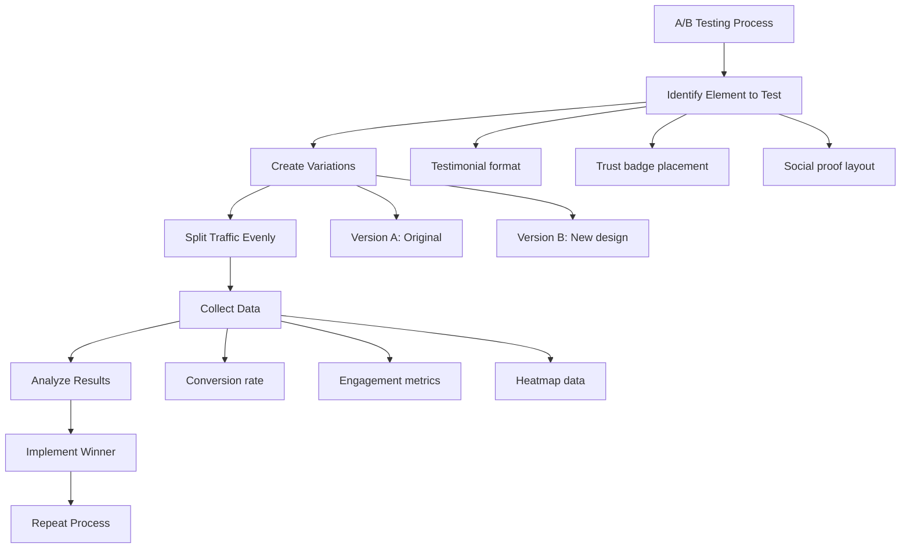

#### Heatmaps & Session Recordings:  

Sử dụng công cụ như Hotjar hoặc Crazy Egg để:  
1. Tạo heatmaps cho các trang có testimonials và trust badges  
2. Phân tích cách người dùng tương tác với các yếu tố tin cậy  
3. Xác định các yếu tố nào thu hút sự chú ý nhiều nhất  

#### Surveys & Feedback:  

1. **Exit Intent Surveys**: "Điều gì khiến bạn chưa quyết định hôm nay?"  
2. **Post-Purchase Surveys**: "Yếu tố nào giúp bạn tin tưởng chúng tôi nhất?"  
3. **NPS Surveys**: Đo lường mức độ sẵn sàng giới thiệu  

### 9.3 Tối ưu hóa liên tục  

Dựa trên dữ liệu thu thập được, thực hiện các điều chỉnh để cải thiện hiệu quả:  

1. **Testimonials**: Thử nghiệm các định dạng khác nhau (văn bản, video, infographic)  
2. **Trust Badges**: Điều chỉnh vị trí và kích thước để tối đa hóa tác động  
3. **Social Proof**: Cập nhật thường xuyên với số liệu và khách hàng mới  
4. **Copy**: Tinh chỉnh ngôn ngữ dựa trên phản hồi của người dùng  

Theo dõi các chỉ số này theo thời gian sẽ giúp bạn hiểu được hiệu quả của các yếu tố tăng độ tin cậy và cải thiện chúng liên tục.  

## 10. Kết luận  

Xây dựng niềm tin là yếu tố then chốt trong marketing B2B ngành may mặc. Thông qua việc triển khai chiến lược các yếu tố tăng độ tin cậy, bạn có thể tạo ra landing page không chỉ thu hút khách truy cập mà còn chuyển đổi họ thành khách hàng trung thành.  

### Tóm tắt các yếu tố chính:  

1. **Testimonials & Case Studies**:  
   - Sử dụng cấu trúc chuẩn với trích dẫn trực tiếp, kết quả định lượng và thông tin người đánh giá  
   - Điều chỉnh nội dung theo phân khúc khách hàng (nhà sản xuất lớn, SME, nhà bán lẻ)  
   - Trình bày trong layout grid hoặc carousel với bộ lọc theo ngành  

2. **Trust Badges & Certifications**:  
   - Ưu tiên chứng nhận ngành may mặc như OEKO-TEX®, GOTS, ISO 9001  
   - Hiển thị logos đối tác theo grid với hiệu ứng hover thông tin  
   - Đặt security badges ở vị trí chiến lược (footer, forms, checkout)  

3. **Social Proof Elements**:  
   - Trình bày thống kế với counter animations và visualizations  
   - Tạo section "Được tin dùng bởi" với logos khách hàng nổi bật  
   - Hiển thị đánh giá với xếp hạng trung bình và phân bố  

4. **Trust-Building Copy**:  
   - Viết privacy statements rõ ràng, minh bạch  
   - Cung cấp bảo đảm hoàn tiền với điều kiện cụ thể  
   - Tạo FAQ toàn diện giải quyết các lo ngại phổ biến  

5. **Visual Trust Elements**:  
   - Đảm bảo HTTPS và hiển thị các chỉ báo bảo mật  
   - Thiết kế chuyên nghiệp với navigation đơn giản, tốc độ tải nhanh  
   - Thêm yếu tố con người với hình ảnh team và cơ sở sản xuất  

### Các bước triển khai:  

1. **Đánh giá hiện trạng**: Xác định các yếu tố tin cậy hiện có và thiếu sót  
2. **Ưu tiên triển khai**: Tập trung vào các yếu tố có tác động lớn nhất trước  
3. **Thiết kế & Phát triển**: Sử dụng NextJS và Tailwind CSS để triển khai  
4. **Đo lường & Tối ưu**: Theo dõi hiệu quả và điều chỉnh liên tục  

Bằng cách triển khai các yếu tố tăng độ tin cậy một cách chiến lược, bạn không chỉ cải thiện trải nghiệm người dùng mà còn tăng cường kết quả kinh doanh thông qua tỷ lệ chuyển đổi cao hơn và khách hàng trung thành hơn.