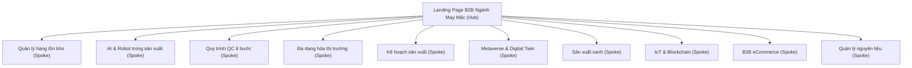
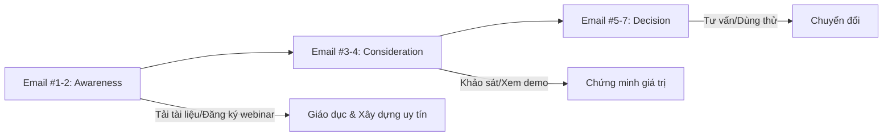
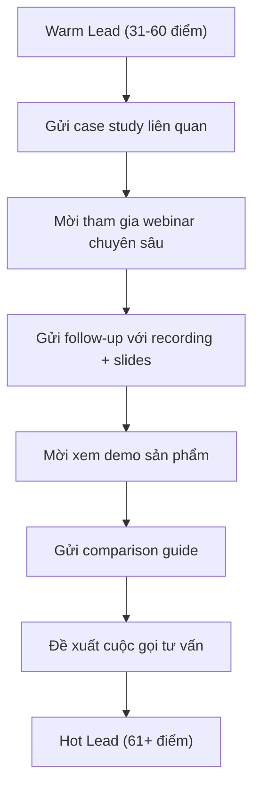
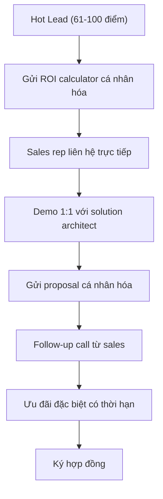
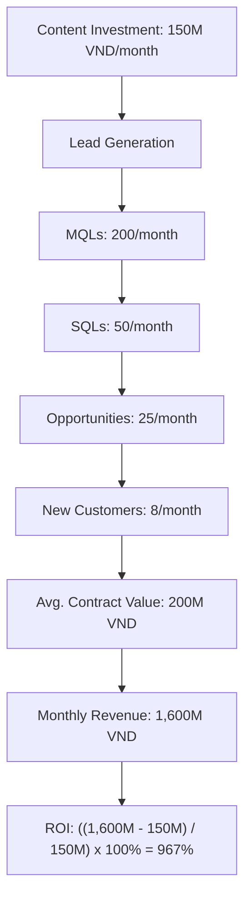

# Kế Hoạch Nội Dung Bổ Sung Cho Landing Page B2B Ngành May Mặc Việt Nam  

## Table of Contents  
1. Giới thiệu  
2. Blog Content Strategy  
3. Email Nurturing Sequence  
4. Social Media Campaign  
5. Lead Scoring Follow-Up  
6. Performance Measurement  
7. Kết luận  

## 1. Giới thiệu  

Ngành dệt may Việt Nam đang trên đà phát triển mạnh mẽ với mục tiêu xuất khẩu đạt 47-48 tỷ USD vào năm 2025, tăng 3-4 tỷ USD so với năm 2024. Trong bối cảnh cạnh tranh toàn cầu ngày càng gay gắt, các doanh nghiệp B2B trong lĩnh vực may mặc cần chiến lược nội dung hiệu quả để thu hút và nuôi dưỡng khách hàng tiềm năng. Kế hoạch nội dung bổ sung này được thiết kế nhằm tối ưu hóa landing page B2B và quy trình lead nurturing, giúp doanh nghiệp may mặc Việt Nam nâng cao hiệu quả marketing, tăng cường chuyển đổi và xây dựng mối quan hệ bền vững với khách hàng.  

Dựa trên phân tích thị trường dệt may Việt Nam và xu hướng công nghệ toàn cầu, kế hoạch này tập trung vào năm thành phần chính: chiến lược nội dung blog, chuỗi email nurturing, chiến dịch mạng xã hội, theo dõi lead scoring và đo lường hiệu suất. Mỗi thành phần được thiết kế để bổ trợ cho nhau, tạo nên một hệ sinh thái nội dung toàn diện nhằm thu hút và chuyển đổi khách hàng tiềm năng trong ngành may mặc B2B.  

Với việc ngành dệt may đang đẩy mạnh ứng dụng công nghệ như AI, robot và công nghệ 3D vào quy trình sản xuất, đồng thời hướng tới sản xuất xanh và bền vững, kế hoạch nội dung này sẽ giúp doanh nghiệp nắm bắt cơ hội, vượt qua thách thức và khẳng định vị thế trong chuỗi cung ứng toàn cầu.  

## 2. Blog Content Strategy  

### 2.1 Phân tích thị trường và đối tượng mục tiêu  

Trước khi đi vào chi tiết các chủ đề blog, cần hiểu rõ bối cảnh thị trường dệt may Việt Nam và đối tượng khách hàng mục tiêu (ICP - Ideal Customer Profile). Theo dữ liệu từ Vinatex, ngành dệt may Việt Nam đang đối mặt với nhiều thách thức như:  

- Chi phí tiền lương cao dẫn đến khó khăn trong cạnh tranh về giá  
- Năng suất lao động thấp do hạn chế về máy móc và công nghệ hiện đại  
- Thiếu liên kết trong chuỗi cung ứng, phụ thuộc vào nhập khẩu nguyên liệu  
- Cần cân bằng và đa dạng hóa thị trường, khách hàng và sản phẩm  

Đối tượng khách hàng mục tiêu (ICP) của các doanh nghiệp B2B ngành may mặc thường bao gồm:  
- Giám đốc sản xuất/vận hành tại các công ty dệt may vừa và lớn  
- Quản lý chuỗi cung ứng và mua hàng  
- Giám đốc công nghệ/chuyển đổi số  
- Chủ doanh nghiệp may mặc vừa và nhỏ  

### 2.2 10 Chủ đề bài blog kéo traffic  

Dựa trên phân tích trên, dưới đây là 10 chủ đề blog được thiết kế để thu hút traffic từ ICP và tối ưu hóa lead scoring:  

#### 1. **"Quản lý hàng tồn kho thông minh: Giải pháp tối ưu cho doanh nghiệp dệt may 2025"**  
- **Keywords**: Quản lý hàng tồn kho, tối ưu chi phí, NetSuite Inventory Management, FIFO  
- **Cấu trúc**:  
  - Giới thiệu về tầm quan trọng của quản lý hàng tồn kho trong ngành dệt may  
  - Thách thức trong quản lý hàng tồn kho của doanh nghiệp dệt may Việt Nam  
  - 5 giải pháp quản lý hàng tồn kho hiệu quả (bao gồm phần mềm và quy trình)  
  - Case study: Doanh nghiệp giảm 30% chi phí tồn kho nhờ áp dụng công nghệ  
  - Hướng dẫn triển khai hệ thống quản lý hàng tồn kho thông minh  
  - Kết luận và CTA  
- **Độ dài**: 2,000-2,500 từ  
- **Dữ liệu hỗ trợ**: Theo NetSuite, việc tối ưu hóa mức tồn kho và đảm bảo tính sẵn có của sản phẩm giúp doanh nghiệp giữ chi phí tồn kho ở mức thấp mà vẫn đáp ứng được yêu cầu của khách hàng.  

#### 2. **"Ứng dụng AI và Robot trong sản xuất dệt may: Xu hướng không thể đảo ngược năm 2025"**  
- **Keywords**: AI trong dệt may, robot hóa sản xuất, công nghệ 3D, tự động hóa, năng suất lao động  
- **Cấu trúc**:  
  - Giới thiệu về tình hình ứng dụng công nghệ trong ngành dệt may toàn cầu  
  - Phân tích từ Vinatex về xu hướng AI và robot hóa trong sản xuất  
  - 5 ứng dụng cụ thể của AI và robot trong quy trình sản xuất dệt may  
  - Case study: May 10 tăng năng suất 20% nhờ ứng dụng công nghệ  
  - ROI khi đầu tư vào AI và robot hóa  
  - Lộ trình triển khai cho doanh nghiệp vừa và nhỏ  
  - Kết luận và CTA  
- **Độ dài**: 2,500-3,000 từ  
- **Dữ liệu hỗ trợ**: Theo VITAS, việc sử dụng robot không chỉ giảm lao động thủ công mà còn tăng cường tính ổn định và hiệu quả của quá trình sản xuất.  

#### 3. **"8 Bước trong quy trình kiểm tra chất lượng sản phẩm may mặc: Tiêu chuẩn quốc tế 2025"**  
- **Keywords**: Kiểm tra chất lượng may mặc, QC dệt may, tiêu chuẩn quốc tế, quy trình 8 bước  
- **Cấu trúc**:  
  - Giới thiệu về tầm quan trọng của kiểm tra chất lượng trong ngành may mặc  
  - Chi tiết 8 bước trong quy trình kiểm tra chất lượng sản phẩm may mặc  
  - Tiêu chuẩn quốc tế và yêu cầu của thị trường xuất khẩu  
  - Công nghệ và công cụ hỗ trợ kiểm tra chất lượng  
  - Hướng dẫn triển khai quy trình kiểm tra chất lượng  
  - Kết luận và CTA  
- **Độ dài**: 2,000-2,500 từ  
- **Dữ liệu hỗ trợ**: Quy trình kiểm tra chất lượng sản phẩm may mặc đóng vai trò then chốt trong việc đảm bảo sản phẩm đáp ứng các tiêu chuẩn về chất lượng, an toàn và tính thẩm mỹ.  

#### 4. **"Chiến lược đa dạng hóa thị trường xuất khẩu dệt may: Cơ hội từ chính sách thuế mới của Mỹ 2025"**  
- **Keywords**: Đa dạng hóa thị trường, xuất khẩu dệt may, chính sách thuế Mỹ, thị phần dệt may  
- **Cấu trúc**:  
  - Giới thiệu về tình hình xuất khẩu dệt may Việt Nam  
  - Phân tích chính sách thuế mới của Mỹ và tác động đến thị trường dệt may  
  - Cơ hội cho doanh nghiệp dệt may Việt Nam khi Trung Quốc mất lợi thế  
  - Chiến lược đa dạng hóa thị trường xuất khẩu  
  - Case study: Doanh nghiệp thành công khi mở rộng thị trường  
  - Kết luận và CTA  
- **Độ dài**: 2,000-2,500 từ  
- **Dữ liệu hỗ trợ**: Theo ông Cầm, "Hiện thị phần của dệt may Việt Nam tại Mỹ chỉ chiếm gần 20%, trong khi Trung Quốc luôn dẫn đầu với thị phần trên 20%, nhưng trong năm tới với chính sách mới dưới thời Tổng thống Donald Trump, hàng dệt may của Trung Quốc xuất khẩu vào Mỹ có thể phải chịu 60% thuế và các loại phí khác, sẽ khiến Trung Quốc mất dần lợi thế, kỳ vọng dệt may Việt Nam có thể giành lại thị phần tốt hơn tại Mỹ".  

#### 5. **"Lập kế hoạch sản xuất thông minh cho ngành may: Tối ưu hóa nguồn lực và đáp ứng đơn hàng đúng hẹn"**  
- **Keywords**: Kế hoạch sản xuất ngành may, tối ưu hóa nguồn lực, quản lý đơn hàng, giao hàng đúng hẹn  
- **Cấu trúc**:  
  - Giới thiệu về tầm quan trọng của kế hoạch sản xuất trong ngành may  
  - Thách thức trong lập kế hoạch sản xuất của doanh nghiệp dệt may Việt Nam  
  - Quy trình lập kế hoạch sản xuất hiệu quả  
  - Công cụ và phần mềm hỗ trợ lập kế hoạch sản xuất  
  - Case study: Doanh nghiệp tăng 15% hiệu suất nhờ kế hoạch sản xuất thông minh  
  - Kết luận và CTA  
- **Độ dài**: 2,000-2,500 từ  
- **Dữ liệu hỗ trợ**: Trong ngành may mặc, tối ưu hóa kế hoạch sản xuất có vai trò quyết định đến thành công và cạnh tranh của doanh nghiệp.  

#### 6. **"Metaverse và Digital Twin: Tương lai của ngành dệt may B2B Việt Nam"**  
- **Keywords**: Metaverse trong dệt may, Digital Twin, virtual showroom, phygital, B2B eCommerce  
- **Cấu trúc**:  
  - Giới thiệu về khái niệm Metaverse và Digital Twin  
  - Ứng dụng của Metaverse trong ngành dệt may B2B  
  - Lợi ích của Metaverse đối với doanh nghiệp dệt may  
  - Case study: Các thương hiệu lớn đã ứng dụng Metaverse  
  - Lộ trình triển khai Metaverse cho doanh nghiệp dệt may Việt Nam  
  - Kết luận và CTA  
- **Độ dài**: 2,500-3,000 từ  
- **Dữ liệu hỗ trợ**: Metaverse là không gian thực tế ảo mô phỏng môi trường thực hoặc tưởng tượng. Người dùng tương tác với môi trường này và những người khác như thể họ đang hiện diện về mặt vật lý, sử dụng các đại diện kỹ thuật số gọi là avatar. Ngành dệt may và thời trang B2B có thể tận dụng metaverse như một công cụ mạnh mẽ cho tiếp thị và dự báo xu hướng.  

#### 7. **"Sản xuất xanh trong ngành dệt may: Từ nguyên liệu đến vận chuyển"**  
- **Keywords**: Sản xuất xanh, dệt may bền vững, giảm phát thải CO2, ESG  
- **Cấu trúc**:  
  - Giới thiệu về xu hướng sản xuất xanh trong ngành dệt may toàn cầu  
  - Thách thức và cơ hội cho doanh nghiệp dệt may Việt Nam  
  - 5 giải pháp sản xuất xanh từ nguyên liệu đến vận chuyển  
  - Case study: May 10 giảm 20.000 tấn CO2 nhờ chuyển đổi năng lượng  
  - Lợi ích kinh tế và thương hiệu khi áp dụng sản xuất xanh  
  - Kết luận và CTA  
- **Độ dài**: 2,000-2,500 từ  
- **Dữ liệu hỗ trợ**: Năm 2025, công ty May 10 dự kiến tiết giảm 20.000 tấn CO2 nhờ chuyển đổi năng lượng, sử dụng năng lượng mặt trời, và triển khai các giải pháp tiết kiệm nguyên nhiên vật liệu nhằm thúc đẩy sản xuất xanh.  

#### 8. **"IoT và Blockchain trong quản lý chuỗi cung ứng dệt may: Giải pháp truy xuất nguồn gốc toàn diện"**  
- **Keywords**: IoT trong dệt may, blockchain, truy xuất nguồn gốc, quản lý chuỗi cung ứng  
- **Cấu trúc**:  
  - Giới thiệu về tầm quan trọng của truy xuất nguồn gốc trong ngành dệt may  
  - Ứng dụng của IoT và blockchain trong quản lý chuỗi cung ứng  
  - Lợi ích của truy xuất nguồn gốc đối với doanh nghiệp dệt may  
  - Case study: Doanh nghiệp áp dụng thành công IoT và blockchain  
  - Hướng dẫn triển khai hệ thống truy xuất nguồn gốc  
  - Kết luận và CTA  
- **Độ dài**: 2,500-3,000 từ  
- **Dữ liệu hỗ trợ**: IoT giúp chia sẻ dữ liệu, quản lý hàng tồn kho, bảo mật và hiệu quả hoạt động cao hơn, tạo nên trải nghiệm khách hàng gắn kết. IoT tạo điều kiện theo dõi và hậu cần tốt hơn để bạn có thể đáp ứng nhu cầu của khách hàng đúng thời hạn.  

#### 9. **"B2B eCommerce trong ngành dệt may: Xu hướng không thể bỏ qua năm 2025"**  
- **Keywords**: B2B eCommerce, thương mại điện tử B2B, đặt hàng trực tuyến, digital showroom  
- **Cấu trúc**:  
  - Giới thiệu về xu hướng B2B eCommerce trong ngành dệt may toàn cầu  
  - Lợi ích của B2B eCommerce đối với doanh nghiệp dệt may  
  - 5 mô hình B2B eCommerce phổ biến trong ngành dệt may  
  - Case study: Doanh nghiệp tăng 30% doanh thu nhờ B2B eCommerce  
  - Hướng dẫn triển khai B2B eCommerce cho doanh nghiệp dệt may  
  - Kết luận và CTA  
- **Độ dài**: 2,000-2,500 từ  
- **Dữ liệu hỗ trợ**: B2B hay còn gọi là B-to-B, là viết tắt của Business to Business. Đây là hình thức giao dịch giữa các doanh nghiệp với nhau, chẳng hạn như nhà sản xuất với nhà phân phối hoặc nhà phân phối với nhà bán lẻ. Thương mại điện tử là một trong những mô hình chính của B2B và hoạt động thực sự hiệu quả.  

#### 10. **"Quản lý nguyên liệu thô trong ngành may mặc: Chiến lược tối ưu chi phí và đảm bảo chất lượng"**  
- **Keywords**: Quản lý nguyên liệu thô, tối ưu chi phí, đảm bảo chất lượng, ABC analysis  
- **Cấu trúc**:  
  - Giới thiệu về tầm quan trọng của quản lý nguyên liệu thô trong ngành may mặc  
  - Thách thức trong quản lý nguyên liệu thô của doanh nghiệp dệt may Việt Nam  
  - 5 chiến lược quản lý nguyên liệu thô hiệu quả  
  - Công cụ và phần mềm hỗ trợ quản lý nguyên liệu thô  
  - Case study: Doanh nghiệp giảm 20% chi phí nguyên liệu nhờ quản lý hiệu quả  
  - Kết luận và CTA  
- **Độ dài**: 2,000-2,500 từ  
- **Dữ liệu hỗ trợ**: Quản lý hàng tồn kho nguyên liệu thô hiệu quả giúp doanh nghiệp kiểm soát chi phí. Tích trữ quá nhiều nguyên liệu làm tăng chi phí vốn và chi phí lưu trữ, trong khi tích trữ quá ít có thể dẫn đến việc mua khẩn cấp với giá cao hơn hoặc ngừng sản xuất.  

### 2.3 Content Calendar Template (3 Tháng)  

Dưới đây là kế hoạch nội dung chi tiết cho 3 tháng đầu tiên, bao gồm thời gian xuất bản, định dạng nội dung, kênh phân phối và keywords chính:  

| Tuần | Chủ đề | Định dạng | Kênh phân phối | Keywords chính |  
|------|--------|-----------|----------------|----------------|  
| Tháng 1 - Tuần 1 | Quản lý hàng tồn kho thông minh | Blog + Infographic | Website, LinkedIn, Email | Quản lý hàng tồn kho, tối ưu chi phí, NetSuite |  
| Tháng 1 - Tuần 2 | Ứng dụng AI và Robot trong sản xuất | Blog + Video interview | Website, YouTube, LinkedIn | AI trong dệt may, robot hóa, tự động hóa |  
| Tháng 1 - Tuần 3 | 8 Bước trong quy trình kiểm tra chất lượng | Blog + Checklist PDF | Website, Email, Facebook | QC dệt may, tiêu chuẩn quốc tế, quy trình 8 bước |  
| Tháng 1 - Tuần 4 | Chiến lược đa dạng hóa thị trường xuất khẩu | Blog + Market report | Website, LinkedIn, Zalo OA | Xuất khẩu dệt may, chính sách thuế Mỹ |  
| Tháng 2 - Tuần 1 | Lập kế hoạch sản xuất thông minh | Blog + Template Excel | Website, Email, LinkedIn | Kế hoạch sản xuất, tối ưu hóa nguồn lực |  
| Tháng 2 - Tuần 2 | Metaverse và Digital Twin | Blog + Webinar | Website, YouTube, LinkedIn | Metaverse, Digital Twin, virtual showroom |  
| Tháng 2 - Tuần 3 | Sản xuất xanh trong ngành dệt may | Blog + Case study PDF | Website, LinkedIn, Email | Sản xuất xanh, giảm phát thải CO2 |  
| Tháng 2 - Tuần 4 | IoT và Blockchain trong quản lý chuỗi cung ứng | Blog + Infographic | Website, LinkedIn, Zalo OA | IoT, blockchain, truy xuất nguồn gốc |  
| Tháng 3 - Tuần 1 | B2B eCommerce trong ngành dệt may | Blog + Demo video | Website, YouTube, LinkedIn | B2B eCommerce, đặt hàng trực tuyến |  
| Tháng 3 - Tuần 2 | Quản lý nguyên liệu thô | Blog + ROI calculator | Website, Email, LinkedIn | Quản lý nguyên liệu, tối ưu chi phí |  
| Tháng 3 - Tuần 3 | Recap: Top 5 xu hướng công nghệ dệt may 2025 | Blog + Infographic | Website, All channels | Công nghệ dệt may, xu hướng 2025 |  
| Tháng 3 - Tuần 4 | Success story: Doanh nghiệp chuyển đổi số thành công | Blog + Video testimonial | Website, All channels | Chuyển đổi số, case study, ROI |  

### 2.4 Internal Linking Strategy  

Chiến lược liên kết nội bộ giúp tăng cường SEO và dẫn dắt người đọc từ blog đến landing page chính. Dưới đây là chiến lược liên kết nội bộ chi tiết:  

#### 2.4.1 Mô hình Hub-and-Spoke  

Tạo cấu trúc nội dung theo mô hình Hub-and-Spoke, trong đó:  
- **Hub (Trung tâm)**: Landing page chính về giải pháp B2B cho ngành may mặc  
- **Spokes (Nhánh)**: Các bài blog chuyên sâu về từng chủ đề cụ thể  



#### 2.4.2 Anchor Text Strategy  

Sử dụng anchor text phù hợp để tạo liên kết tự nhiên từ blog đến landing page:  

| Loại Anchor Text | Ví dụ | Tỷ lệ sử dụng |  
|------------------|-------|---------------|  
| Exact Match | "Giải pháp B2B cho ngành may mặc" | 20% |  
| Partial Match | "Giải pháp toàn diện cho doanh nghiệp dệt may" | 30% |  
| Branded | "Giải pháp [Tên thương hiệu] cho ngành may mặc" | 25% |  
| Generic | "Tìm hiểu thêm", "Khám phá ngay" | 15% |  
| Contextual | "Theo nghiên cứu từ Vinatex...", "Như đã đề cập trong báo cáo..." | 10% |  

#### 2.4.3 Cross-Linking Between Blog Posts  

Tạo liên kết chéo giữa các bài blog để tăng thời gian đọc và giảm tỷ lệ thoát:  

- Bài về "Quản lý hàng tồn kho" liên kết đến bài "Quản lý nguyên liệu thô" và "IoT trong chuỗi cung ứng"  
- Bài về "AI và Robot" liên kết đến bài "Metaverse" và "Kế hoạch sản xuất thông minh"  
- Bài về "Sản xuất xanh" liên kết đến bài "Chiến lược đa dạng hóa thị trường" và "B2B eCommerce"  

#### 2.4.4 Contextual Linking  

Đặt liên kết trong ngữ cảnh phù hợp để tăng tỷ lệ click:  

```  
"Việc áp dụng [AI và robot hóa trong sản xuất dệt may](#) không chỉ giúp tăng năng suất mà còn giảm chi phí nhân công đáng kể. Để triển khai hiệu quả, doanh nghiệp cần [giải pháp toàn diện về chuyển đổi số](#landing-page-link) phù hợp với quy mô và đặc thù sản xuất."  
```  

#### 2.4.5 CTA Placement  

Đặt CTA (Call-to-Action) tại các vị trí chiến lược trong bài viết:  
- Giữa bài viết sau khi trình bày vấn đề  
- Cuối mỗi phần chính  
- Cuối bài viết  
- Dạng popup khi người đọc cuộn được 70% bài viết  

Ví dụ CTA:  
- "Tải ngay báo cáo đầy đủ về xu hướng công nghệ dệt may 2025"  
- "Đăng ký tư vấn miễn phí về giải pháp quản lý hàng tồn kho"  
- "Tham gia webinar: Chuyển đổi số trong ngành may mặc - Ngày 15/xx/2025"  

## 3. Email Nurturing Sequence  

### 3.1 Phân tích hành vi khách hàng B2B ngành may mặc  

Trước khi thiết kế chuỗi email nurturing, cần hiểu rõ hành vi và quy trình ra quyết định của khách hàng B2B trong ngành may mặc:  

- Chu kỳ mua hàng dài và phức tạp hơn so với B2C  
- Quyết định dựa trên tính toán phù hợp hơn là quyết định đột ngột  
- Khách hàng có sự chọn lọc cao với nhiều tiêu chí  
- Giao dịch thường được thực hiện trong thời gian dài, giúp các bên hiểu cách làm việc và tư duy của nhau  

### 3.2 7 Email Template Series  

Dưới đây là chuỗi 7 email nurturing được thiết kế để chuyển đổi leads sau khi họ download tài liệu từ landing page:  

#### Email #1: Welcome & Confirmation  
- **Subject Line**: "[Tên công ty] - Cảm ơn bạn đã tải tài liệu về [Tên tài liệu]"  
- **Thời gian gửi**: Ngay sau khi download  
- **Mục đích**: Xác nhận download và thiết lập mối quan hệ  
- **Content Outline**:  
  - Lời cảm ơn cá nhân hóa  
  - Xác nhận link download (phòng trường hợp chưa tải thành công)  
  - Giới thiệu ngắn gọn về công ty và giải pháp  
  - Gợi ý 2-3 tài liệu liên quan  
  - CTA: "Tải thêm tài liệu liên quan"  
- **Personalization**: Tên người nhận, tên công ty, tên tài liệu đã tải  

#### Email #2: Educational Content  
- **Subject Line**: "5 xu hướng công nghệ đang thay đổi ngành dệt may Việt Nam"  
- **Thời gian gửi**: +3 ngày sau email #1  
- **Mục đích**: Giáo dục và xây dựng uy tín  
- **Content Outline**:  
  - Giới thiệu về 5 xu hướng công nghệ trong ngành dệt may  
  - Dữ liệu và thống kê từ Vinatex và VITAS  
  - Chia sẻ case study ngắn về doanh nghiệp đã áp dụng thành công  
  - CTA: "Đăng ký tham gia webinar miễn phí"  
- **Personalization**: Phân khúc theo quy mô doanh nghiệp (SME vs Enterprise)  

#### Email #3: Problem-Solution  
- **Subject Line**: "[Tên người nhận], doanh nghiệp của bạn có đang gặp phải thách thức này?"  
- **Thời gian gửi**: +5 ngày sau email #2  
- **Mục đích**: Xác định pain points và cung cấp giải pháp  
- **Content Outline**:  
  - Nêu 3-4 thách thức phổ biến trong ngành dệt may (dựa trên tài liệu đã tải)  
  - Giải pháp cho từng thách thức  
  - Mini case study về doanh nghiệp đã vượt qua thách thức  
  - CTA: "Trả lời khảo sát ngắn để nhận báo cáo chuyên sâu"  
- **Personalization**: Dựa trên hành vi tương tác với email trước  

#### Email #4: Social Proof  
- **Subject Line**: "Cách May 10 tăng 20% năng suất nhờ [Giải pháp XYZ]"  
- **Thời gian gửi**: +7 ngày sau email #3  
- **Mục đích**: Xây dựng niềm tin thông qua bằng chứng xã hội  
- **Content Outline**:  
  - Case study chi tiết về doanh nghiệp thành công  
  - Testimonial từ khách hàng hiện tại  
  - Số liệu ROI cụ thể  
  - CTA: "Xem demo giải pháp"  
- **Personalization**: Dựa trên ngành nghề cụ thể (may mặc, dệt, nhuộm)  

#### Email #5: Exclusive Offer  
- **Subject Line**: "Ưu đãi đặc biệt dành riêng cho [Tên công ty]: Tư vấn miễn phí + Giảm 15%"  
- **Thời gian gửi**: +10 ngày sau email #4  
- **Mục đích**: Chuyển đổi thông qua ưu đãi hấp dẫn  
- **Content Outline**:  
  - Giới thiệu ưu đãi đặc biệt có thời hạn  
  - Nhấn mạnh giá trị và lợi ích  
  - Testimonial ngắn từ khách hàng  
  - CTA: "Đặt lịch tư vấn miễn phí"  
- **Personalization**: Ưu đãi dựa trên quy mô doanh nghiệp và nhu cầu  

#### Email #6: Industry Update  
- **Subject Line**: "Cập nhật mới nhất: Chính sách thuế Mỹ và cơ hội cho dệt may Việt Nam"  
- **Thời gian gửi**: +14 ngày sau email #5  
- **Mục đích**: Cung cấp giá trị và duy trì kết nối  
- **Content Outline**:  
  - Cập nhật về chính sách thuế mới của Mỹ  
  - Phân tích tác động đến ngành dệt may Việt Nam  
  - Chiến lược ứng phó cho doanh nghiệp  
  - CTA: "Tải whitepaper đầy đủ"  
- **Personalization**: Dựa trên thị trường xuất khẩu chính  

#### Email #7: Final Conversion Push  
- **Subject Line**: "[Tên người nhận], đây là bước cuối cùng để tối ưu hóa hoạt động của [Tên công ty]"  
- **Thời gian gửi**: +21 ngày sau email #6  
- **Mục đích**: Thúc đẩy chuyển đổi cuối cùng  
- **Content Outline**:  
  - Tóm tắt giá trị của giải pháp  
  - Nhắc lại ưu đãi sắp hết hạn  
  - Testimonial mạnh mẽ từ khách hàng  
  - FAQ ngắn gọn  
  - CTA: "Đăng ký dùng thử" hoặc "Đặt lịch demo"  
- **Personalization**: Dựa trên tất cả tương tác trước đó  

### 3.3 Content Outline Chi Tiết cho Email #3  

```markdown  
Subject: [Tên người nhận], doanh nghiệp của bạn có đang gặp phải thách thức này?  

Chào [Tên người nhận],  

Cảm ơn bạn đã quan tâm đến [Tên tài liệu đã tải]. Qua trao đổi với nhiều doanh nghiệp dệt may tại Việt Nam, chúng tôi nhận thấy 3 thách thức lớn mà nhiều công ty đang phải đối mặt:  

## Thách thức #1: Quản lý đơn hàng nhỏ với yêu cầu QC khắt khe  
✅ 78% doanh nghiệp dệt may gặp khó khăn với đơn hàng dưới 5,000 SP nhưng yêu cầu QC cao  
✅ Áp lực giao hàng đúng hẹn 99.9% từ khách hàng quốc tế  

➡️ Giải pháp: Hệ thống MES tự động hóa QC kết hợp với quy trình 8 bước đã giúp Công ty May ABC giảm 35% thời gian kiểm tra chất lượng mà vẫn đảm bảo tiêu chuẩn.  

## Thách thức #2: Chi phí tồn kho cao và quản lý nguyên liệu kém hiệu quả  
✅ Trung bình 23% vốn của doanh nghiệp dệt may bị "đóng băng" trong hàng tồn kho  
✅ 45% doanh nghiệp gặp tình trạng thiếu nguyên liệu đột xuất  

➡️ Giải pháp: Phần mềm dự báo nguyên liệu thông minh kết hợp với quy trình FIFO đã giúp Công ty XYZ giảm 28% chi phí tồn kho trong 6 tháng.  

## Thách thức #3: Khó khăn trong việc đa dạng hóa thị trường xuất khẩu  
✅ 65% doanh nghiệp dệt may Việt Nam phụ thuộc vào 1-2 thị trường chính  
✅ Rào cản về tiêu chuẩn và quy định khác nhau giữa các thị trường  

➡️ Giải pháp: Hệ thống quản lý tuân thủ và chứng nhận tự động đã giúp Công ty DEF mở rộng từ 2 lên 5 thị trường xuất khẩu trong vòng 1 năm.  

[Tên người nhận], doanh nghiệp của bạn đang gặp phải thách thức nào trong số này? Hoặc có thách thức khác mà chúng tôi chưa đề cập?  

👉 [Trả lời khảo sát ngắn 2 phút] để nhận ngay báo cáo chuyên sâu về giải pháp phù hợp với doanh nghiệp của bạn.  

Trân trọng,  
[Tên người gửi]  
[Chức danh]  
[Công ty]  
[Thông tin liên hệ]  

P.S: Báo cáo chuyên sâu này thường có giá 2.000.000 VNĐ, nhưng chúng tôi sẽ gửi MIỄN PHÍ cho bạn khi hoàn thành khảo sát trước ngày [Ngày hết hạn].  
```  

### 3.4 CTA Progression trong Series  

Chiến lược CTA trong chuỗi email được thiết kế để dần dần đưa leads từ giai đoạn nhận thức đến giai đoạn quyết định:  

| Email # | Giai đoạn | CTA | Mục tiêu |  
|---------|-----------|-----|----------|  
| #1 | Awareness | "Tải thêm tài liệu liên quan" | Giáo dục và xây dựng nhận thức |  
| #2 | Awareness | "Đăng ký tham gia webinar miễn phí" | Tương tác sâu hơn, xây dựng uy tín |  
| #3 | Consideration | "Trả lời khảo sát ngắn để nhận báo cáo chuyên sâu" | Thu thập thông tin, xác định nhu cầu |  
| #4 | Consideration | "Xem demo giải pháp" | Chứng minh giá trị sản phẩm |  
| #5 | Decision | "Đặt lịch tư vấn miễn phí" | Tương tác trực tiếp với sales |  
| #6 | Consideration/Decision | "Tải whitepaper đầy đủ" | Cung cấp thông tin chuyên sâu |  
| #7 | Decision | "Đăng ký dùng thử" hoặc "Đặt lịch demo" | Chuyển đổi cuối cùng |  



### 3.5 Thời gian gửi tối ưu  

Dựa trên phân tích hành vi khách hàng B2B trong ngành may mặc, dưới đây là thời gian gửi email tối ưu:  

| Ngày trong tuần | Thời gian | Lý do |  
|-----------------|-----------|-------|  
| Thứ Ba | 9:00 - 10:00 | Đầu tuần làm việc, sau khi xử lý email tồn đọng từ thứ Hai |  
| Thứ Tư | 14:00 - 15:00 | Giữa tuần, thời điểm năng suất cao |  
| Thứ Năm | 10:00 - 11:00 | Trước khi lập kế hoạch cho tuần sau |  

Tránh gửi email vào:  
- Thứ Hai: Người nhận bận xử lý công việc tồn đọng từ cuối tuần  
- Thứ Sáu chiều: Người nhận tập trung hoàn thành công việc trong tuần  
- Cuối tuần: Tỷ lệ mở email thấp  

**Lưu ý**: Thời gian gửi có thể điều chỉnh dựa trên dữ liệu phân tích từ các chiến dịch email trước đó.  

## 4. Social Media Campaign  

### 4.1 Phân tích nền tảng mạng xã hội cho B2B ngành may mặc  

Trước khi xây dựng chiến dịch mạng xã hội, cần phân tích đặc điểm và ưu điểm của từng nền tảng đối với đối tượng B2B ngành may mặc:  

#### LinkedIn  
- **Đối tượng**: Chuyên gia ngành, giám đốc điều hành, quản lý cấp cao  
- **Ưu điểm**: Nền tảng B2B chuyên nghiệp, khả năng targeting theo ngành nghề và chức danh  
- **Loại nội dung phù hợp**: Industry insights, case studies, whitepapers, thought leadership  

#### Facebook  
- **Đối tượng**: Chủ doanh nghiệp vừa và nhỏ, quản lý cấp trung  
- **Ưu điểm**: Phổ biến tại Việt Nam, chi phí quảng cáo hợp lý, tương tác cao  
- **Loại nội dung phù hợp**: Company culture, customer stories, event announcements, visual content  

#### Zalo OA  
- **Đối tượng**: Đối tác và khách hàng Việt Nam  
- **Ưu điểm**: Nền tảng nhắn tin phổ biến tại Việt Nam, tỷ lệ mở tin nhắn cao  
- **Loại nội dung phù hợp**: Quick updates, promotions, event invitations, customer support  

### 4.2 Content Themes cho 3 Platforms  

#### LinkedIn Content Themes  
1. **Industry Insights**: Phân tích xu hướng và dự báo ngành dệt may  
2. **Technology Showcase**: Giới thiệu công nghệ mới trong sản xuất dệt may  
3. **Case Studies**: Chia sẻ câu chuyện thành công của khách hàng  
4. **Thought Leadership**: Bài viết từ lãnh đạo công ty về tầm nhìn ngành  
5. **Data Visualization**: Infographics về số liệu và thống kê ngành  

#### Facebook Content Themes  
1. **Behind-the-Scenes**: Hình ảnh và video về hoạt động công ty  
2. **Customer Success**: Chia sẻ phản hồi và testimonial từ khách hàng  
3. **Event Coverage**: Bài viết về sự kiện, hội thảo, triển lãm  
4. **Educational Content**: Tips và tricks cho doanh nghiệp dệt may  
5. **Community Engagement**: Polls, Q&A, và nội dung tương tác  

#### Zalo OA Content Themes  
1. **Flash Updates**: Thông tin ngắn gọn về sản phẩm và dịch vụ mới  
2. **Exclusive Offers**: Ưu đãi đặc biệt dành cho followers  
3. **Event Reminders**: Nhắc nhở về webinar, hội thảo sắp diễn ra  
4. **Quick Tips**: Mẹo ngắn gọn về quản lý sản xuất dệt may  
5. **Customer Support**: Hỗ trợ khách hàng và giải đáp thắc mắc  

### 4.3 10 Post Ideas cho mỗi Platform  

#### LinkedIn Post Ideas  
1. **Industry Report**: "Báo cáo: Xuất khẩu dệt may Việt Nam 2025 - Dự báo đạt 48 tỷ USD"  
2. **Expert Interview**: "Phỏng vấn độc quyền: CEO Vinatex chia sẻ về xu hướng AI trong sản xuất"  
3. **Case Study**: "Case Study: May 10 tăng 20% năng suất nhờ ứng dụng robot hóa"  
4. **Infographic**: "Infographic: 5 xu hướng công nghệ đang thay đổi ngành dệt may"  
5. **Whitepaper Promotion**: "Whitepaper mới: Chiến lược đa dạng hóa thị trường xuất khẩu dệt may"  
6. **Webinar Announcement**: "Webinar: Metaverse và tương lai của ngành dệt may B2B - Đăng ký ngay"  
7. **Poll**: "Poll: Thách thức lớn nhất của doanh nghiệp dệt may Việt Nam năm 2025 là gì?"  
8. **Industry News Analysis**: "Phân tích: Tác động của chính sách thuế mới của Mỹ đến dệt may Việt Nam"  
9. **Thought Leadership**: "Bài viết từ CEO: 5 dự đoán về tương lai ngành dệt may trong 5 năm tới"  
10. **Product Demo Teaser**: "Video: Sneak peek giải pháp quản lý hàng tồn kho thông minh"  

#### Facebook Post Ideas  
1. **Behind-the-Scenes**: "Một ngày làm việc tại [Tên công ty] - Đội ngũ R&D phát triển giải pháp mới"  
2. **Customer Testimonial**: "Khách hàng nói gì về chúng tôi? - Phỏng vấn Giám đốc sản xuất Công ty XYZ"  
3. **Event Coverage**: "Hình ảnh: [Tên công ty] tại Triển lãm Dệt may Việt Nam 2025"  
4. **Tips & Tricks**: "5 mẹo quản lý hàng tồn kho hiệu quả cho doanh nghiệp dệt may"  
5. **Team Spotlight**: "Gặp gỡ đội ngũ: Phỏng vấn Trưởng phòng Giải pháp Công nghệ"  
6. **Before-After Transformation**: "Trước và sau khi áp dụng giải pháp của chúng tôi - Nhà máy ABC"  
7. **Interactive Poll**: "Bạn đang sử dụng phần mềm nào để quản lý sản xuất? Chia sẻ với chúng tôi"  
8. **Quick Tutorial**: "Video hướng dẫn: Cách thiết lập kế hoạch sản xuất trong 5 phút"  
9. **CSR Activities**: "Chương trình trách nhiệm xã hội: [Tên công ty] hỗ trợ đào tạo kỹ năng cho lao động ngành may"  
10. **Fun Facts**: "Bạn có biết? 10 sự thật thú vị về ngành dệt may Việt Nam"  

#### Zalo OA Post Ideas  
1. **Flash Sale**: "FLASH SALE 24H: Giảm 20% phí triển khai giải pháp quản lý hàng tồn kho"  
2. **Webinar Reminder**: "Nhắc nhở: Webinar 'Chuyển đổi số trong ngành may mặc' diễn ra sau 2 giờ nữa"  
3. **Quick Tips**: "Tip nhanh: 3 cách giảm chi phí tồn kho mà không ảnh hưởng đến sản xuất"  
4. **New Feature Alert**: "Tính năng mới: Dự báo nhu cầu nguyên liệu bằng AI - Khám phá ngay"  
5. **FAQ**: "Câu hỏi thường gặp: Làm thế nào để triển khai ERP trong doanh nghiệp dệt may?"  
6. **Customer Support**: "Cần hỗ trợ? Chat với chúng tôi ngay để được tư vấn miễn phí"  
7. **Document Download**: "Tải ngay: Template Excel lập kế hoạch sản xuất cho ngành may"  
8. **Exclusive Invitation**: "Mời bạn tham dự: Hội thảo kín về chiến lược xuất khẩu dệt may 2025"  
9. **Quick Poll**: "Khảo sát nhanh: Doanh nghiệp bạn đã áp dụng công nghệ nào trong sản xuất?"  
10. **Success Metrics**: "Con số ấn tượng: Khách hàng của chúng tôi giảm 30% chi phí tồn kho trong 3 tháng"  

### 4.4 Hashtag Strategy  

Chiến lược hashtag hiệu quả giúp tăng khả năng tiếp cận và tìm kiếm nội dung. Dưới đây là chiến lược hashtag cho từng nền tảng:  

#### LinkedIn Hashtag Strategy  
- **Industry Hashtags**: #DệtMayViệtNam #TextileIndustry #ApparelManufacturing  
- **Technology Hashtags**: #IndustryFourPointZero #AIinTextile #DigitalTransformation  
- **Event Hashtags**: #VietnamTexSummit #TextileExpo2025  
- **Branded Hashtags**: #[TênCôngTy]Solutions #[TênCôngTy]Insights  
- **Trending Hashtags**: #SustainableFashion #SupplyChainOptimization  

**Số lượng hashtag tối ưu**: 3-5 hashtag/post  

#### Facebook Hashtag Strategy  
- **Vietnamese Hashtags**: #NgànhDệtMay #CôngNghệMayMặc #XuấtKhẩuDệtMay  
- **Community Hashtags**: #DoanhnghiệpDệtMay #MayMặcViệtNam  
- **Campaign Hashtags**: #ChuyểnĐổiSốNgànhMay #TươngLaiDệtMay  
- **Branded Hashtags**: #[TênCôngTy]Vietnam #[TênCôngTy]ForTextile  
- **Location Hashtags**: #DệtMayHCM #TextileHanoi  

**Số lượng hashtag tối ưu**: 5-7 hashtag/post  

#### Zalo OA Hashtag Strategy  
Zalo OA không hỗ trợ hashtag như LinkedIn và Facebook, nhưng có thể sử dụng từ khóa tìm kiếm trong nội dung:  
- **Từ khóa ngành**: "dệt may", "may mặc", "xuất khẩu dệt may"  
- **Từ khóa sản phẩm**: "quản lý hàng tồn kho", "ERP dệt may", "phần mềm quản lý"  
- **Từ khóa sự kiện**: "webinar dệt may", "hội thảo chuyển đổi số"  

### 4.5 Visual Content Recommendations  

Nội dung hình ảnh đóng vai trò quan trọng trong chiến dịch mạng xã hội. Dưới đây là khuyến nghị về nội dung hình ảnh cho từng nền tảng:  

#### LinkedIn Visual Content  
- **Infographics**: Thiết kế chuyên nghiệp, dữ liệu rõ ràng, màu sắc doanh nghiệp  
- **Data Visualizations**: Biểu đồ và đồ thị minh họa số liệu ngành  
- **Professional Photos**: Hình ảnh chất lượng cao về sản phẩm và dịch vụ  
- **Executive Portraits**: Hình ảnh chuyên nghiệp của lãnh đạo công ty  
- **Slide Decks**: Trình bày ngắn gọn về industry insights  

**Kích thước tối ưu**: 1200 x 627 pixels cho hình ảnh đơn  

#### Facebook Visual Content  
- **Carousel Posts**: Nhiều hình ảnh trong một bài đăng để kể câu chuyện  
- **Behind-the-Scenes Photos**: Hình ảnh thực tế về hoạt động công ty  
- **Video Clips**: Video ngắn 60-90 giây về sản phẩm hoặc dịch vụ  
- **Animated GIFs**: GIF minh họa quy trình hoặc tính năng  
- **Customer Photos**: Hình ảnh từ khách hàng sử dụng sản phẩm  

**Kích thước tối ưu**: 1200 x 630 pixels cho hình ảnh đơn, tỷ lệ 16:9 cho video  

#### Zalo OA Visual Content  
- **Simple Graphics**: Hình ảnh đơn giản, dễ đọc trên màn hình nhỏ  
- **Product Screenshots**: Ảnh chụp màn hình sản phẩm với chú thích rõ ràng  
- **Event Banners**: Banner sự kiện với thông tin thời gian và địa điểm  
- **QR Codes**: Mã QR để tải tài liệu hoặc đăng ký sự kiện  
- **Promotional Graphics**: Hình ảnh quảng cáo ưu đãi với CTA rõ ràng  

**Kích thước tối ưu**: 800 x 450 pixels, tối ưu cho màn hình điện thoại  

### 4.6 Paid Promotion Suggestions  

Để tăng cường hiệu quả của chiến dịch mạng xã hội, dưới đây là các đề xuất về quảng cáo trả phí:  

#### LinkedIn Paid Promotion  
- **Sponsored Content**: Quảng bá bài viết có giá trị cao như case studies và whitepapers  
- **Message Ads**: Gửi tin nhắn trực tiếp đến decision makers trong ngành dệt may  
- **Lead Gen Forms**: Thu thập leads thông qua form được tích hợp sẵn  
- **Targeting Options**:  
  - Industry: Textile & Apparel Manufacturing  
  - Job Titles: Production Manager, Operations Director, CEO, CTO  
  - Company Size: 50+ employees  
  - Location: Vietnam (focus on industrial zones)  
- **Budget Recommendation**: 15-20 triệu VNĐ/tháng  

#### Facebook Paid Promotion  
- **Boosted Posts**: Tăng cường tiếp cận cho bài viết có tương tác cao  
- **Carousel Ads**: Quảng cáo nhiều sản phẩm hoặc tính năng trong một quảng cáo  
- **Video Ads**: Quảng cáo video ngắn về case study hoặc demo sản phẩm  
- **Targeting Options**:  
  - Custom Audiences: Website visitors, email subscribers  
  - Lookalike Audiences: Based on existing customers  
  - Interests: Business, manufacturing, textile industry  
  - Location: Major industrial cities in Vietnam  
- **Budget Recommendation**: 10-15 triệu VNĐ/tháng  

#### Zalo OA Paid Promotion  
- **Zalo Ads**: Quảng cáo trong Zalo Feed và Zalo Article  
- **Official Account Promotion**: Quảng bá Zalo OA để tăng followers  
- **Sponsored Messages**: Gửi tin nhắn quảng cáo đến đối tượng mục tiêu  
- **Targeting Options**:  
  - Demographics: Business owners, managers  
  - Location: Vietnam (nationwide)  
  - Interests: Business, manufacturing  
- **Budget Recommendation**: 5-10 triệu VNĐ/tháng  

## 5. Lead Scoring Follow-Up  

### 5.1 Thiết lập hệ thống Lead Scoring  

Trước khi xây dựng chiến lược follow-up dựa trên lead score, cần thiết lập hệ thống chấm điểm lead phù hợp với ngành may mặc B2B:  

#### Demographic Scoring (Thông tin nhân khẩu học)  
| Tiêu chí | Điểm |  
|----------|------|  
| Chức danh (C-level, Director) | 20 |  
| Chức danh (Manager) | 15 |  
| Chức danh (Staff) | 5 |  
| Quy mô công ty (>500 nhân viên) | 20 |  
| Quy mô công ty (100-500 nhân viên) | 15 |  
| Quy mô công ty (<100 nhân viên) | 10 |  
| Ngành nghề (Dệt may) | 20 |  
| Ngành nghề (Liên quan đến dệt may) | 10 |  
| Ngành nghề (Khác) | 0 |  

#### Behavioral Scoring (Hành vi)  
| Hành vi | Điểm |  
|---------|------|  
| Tải whitepaper/ebook | 15 |  
| Đăng ký webinar | 20 |  
| Tham gia webinar | 25 |  
| Xem demo sản phẩm | 30 |  
| Truy cập trang pricing | 35 |  
| Truy cập blog | 5 |  
| Mở email | 5 |  
| Click link trong email | 10 |  
| Điền form liên hệ | 40 |  
| Tương tác trên social media | 5 |  

#### Lead Score Classification  
| Phân loại | Điểm | Định nghĩa |  
|-----------|------|-----------|  
| Cold Lead | 0-30 | Mới biết đến thương hiệu, chưa có tương tác nhiều |  
| Warm Lead | 31-60 | Đã tương tác với nội dung, có thể quan tâm đến giải pháp |  
| Hot Lead | 61-100 | Đã thể hiện sự quan tâm rõ ràng, có khả năng chuyển đổi cao |  
| Sales-Ready Lead | >100 | Sẵn sàng để sales tiếp cận trực tiếp |  

### 5.2 Trigger-based Content Delivery  

Dựa trên lead score, thiết lập hệ thống gửi nội dung tự động khi lead đạt đến ngưỡng điểm nhất định:  

#### Cold Leads (0-30 điểm)  
| Trigger | Content Delivery | Mục tiêu |  
|---------|------------------|----------|  
| Mới đăng ký nhận newsletter | "Cẩm nang xuất khẩu dệt may 2025" | Giáo dục và xây dựng nhận thức |  
| Truy cập blog 3+ lần | "5 xu hướng công nghệ dệt may 2025" | Tăng cường nhận thức về giải pháp |  
| Tương tác trên social media | "Infographic: Thách thức của ngành dệt may Việt Nam" | Xây dựng mối quan hệ |  
| Mở 2+ email | "Checklist: Đánh giá mức độ sẵn sàng chuyển đổi số" | Tự đánh giá nhu cầu |  

#### Warm Leads (31-60 điểm)  
| Trigger | Content Delivery | Mục tiêu |  
|---------|------------------|----------|  
| Tải whitepaper | "Case study: Doanh nghiệp tương tự với bạn" | Chứng minh giá trị thực tế |  
| Tham gia webinar | "Slide deck + Recording webinar" | Củng cố thông tin đã chia sẻ |  
| Truy cập trang sản phẩm | "Video demo sản phẩm" | Giới thiệu tính năng chi tiết |  
| Click link trong 3+ email | "Comparison guide: Giải pháp của chúng tôi vs. đối thủ" | Hỗ trợ đánh giá giải pháp |  

#### Hot Leads (61-100 điểm)  
| Trigger | Content Delivery | Mục tiêu |  
|---------|------------------|----------|  
| Xem demo sản phẩm | "ROI calculator cá nhân hóa" | Chứng minh giá trị đầu tư |  
| Truy cập trang pricing | "Tư vấn giải pháp + báo giá cá nhân hóa" | Hỗ trợ quyết định mua hàng |  
| Điền form liên hệ | "Lịch hẹn với chuyên gia tư vấn" | Kết nối trực tiếp với sales |  
| Score tăng 20+ điểm trong 7 ngày | "Ưu đãi đặc biệt có thời hạn" | Tạo cảm giác khẩn cấp |  

#### Sales-Ready Leads (>100 điểm)  
| Trigger | Content Delivery | Mục tiêu |  
|---------|------------------|----------|  
| Đạt ngưỡng 100 điểm | "Cuộc gọi từ sales representative" | Tiếp cận trực tiếp |  
| Tham gia demo 1:1 | "Proposal cá nhân hóa + implementation plan" | Hỗ trợ quyết định cuối cùng |  
| Yêu cầu báo giá | "Hợp đồng + ưu đãi đặc biệt" | Thúc đẩy ký kết |  
| Tương tác với 3+ sản phẩm | "Bundle deal phù hợp với nhu cầu" | Tối đa hóa giá trị đơn hàng |  

### 5.3 Personalized Content dựa trên Profile Data  

Cá nhân hóa nội dung dựa trên dữ liệu hồ sơ của lead để tăng tính liên quan và hiệu quả:  

#### Theo Chức danh  
| Chức danh | Personalized Content | Messaging Focus |  
|-----------|----------------------|-----------------|  
| CEO/Owner | "Báo cáo: ROI của chuyển đổi số trong ngành dệt may" | Tập trung vào lợi nhuận và tăng trưởng dài hạn |  
| COO/Operations Director | "Whitepaper: Tối ưu hóa quy trình sản xuất dệt may" | Tập trung vào hiệu quả vận hành và giảm chi phí |  
| CTO/IT Director | "Technical guide: Tích hợp hệ thống trong doanh nghiệp dệt may" | Tập trung vào khía cạnh kỹ thuật và tích hợp |  
| Production Manager | "Hướng dẫn: Tăng năng suất sản xuất với công nghệ mới" | Tập trung vào cải thiện quy trình sản xuất |  
| Supply Chain Manager | "Case study: Tối ưu hóa chuỗi cung ứng dệt may" | Tập trung vào quản lý chuỗi cung ứng |  

#### Theo Quy mô Doanh nghiệp  
| Quy mô | Personalized Content | Messaging Focus |  
|--------|----------------------|-----------------|  
| Enterprise (>500 nhân viên) | "Enterprise solution: Giải pháp toàn diện cho doanh nghiệp lớn" | Tập trung vào khả năng mở rộng và tích hợp |  
| Mid-size (100-500 nhân viên) | "Mid-market solution: Cân bằng chi phí và hiệu quả" | Tập trung vào ROI và tính linh hoạt |  
| SMB (<100 nhân viên) | "SMB package: Giải pháp phù hợp với ngân sách" | Tập trung vào chi phí thấp và triển khai nhanh |  

#### Theo Loại Sản xuất  
| Loại sản xuất | Personalized Content | Messaging Focus |  
|---------------|----------------------|-----------------|  
| FOB | "FOB optimization: Quản lý đơn hàng FOB hiệu quả" | Tập trung vào quản lý nguyên liệu và logistics |  
| CMT | "CMT solution: Tối ưu hóa quy trình may" | Tập trung vào năng suất và chất lượng |  
| ODM/OBM | "Design-to-delivery: Giải pháp cho ODM/OBM" | Tập trung vào quản lý thiết kế và phát triển sản phẩm |  

### 5.4 Re-engagement Campaigns cho Cold Leads  

Chiến dịch tái kết nối với cold leads giúp kích hoạt lại những leads đã không tương tác trong một thời gian:  

#### Email Re-engagement  
| Thời gian không tương tác | Subject Line | Content Focus | Incentive |  
|---------------------------|--------------|---------------|-----------|  
| 30 ngày | "Chúng tôi nhớ bạn, [Tên] - Cập nhật mới nhất về ngành dệt may" | Industry updates | Free industry report |  
| 60 ngày | "Bạn đã bỏ lỡ: 3 xu hướng công nghệ mới trong ngành dệt may" | New features & trends | Free webinar access |  
| 90 ngày | "Ưu đãi đặc biệt dành riêng cho [Tên công ty]: 15% off" | Special offer | 15% discount |  

#### Retargeting Ads  
- **Facebook/Instagram**: Hiển thị quảng cáo cho cold leads với nội dung giáo dục và ưu đãi  
- **LinkedIn**: Quảng cáo case study và success stories liên quan đến ngành của lead  
- **Google Display Network**: Banner ads nhắc nhở về giải pháp và lợi ích  

#### SMS/Zalo Re-engagement  
| Thời gian không tương tác | Message | CTA |  
|---------------------------|---------|-----|  
| 45 ngày | "Chào [Tên], chúng tôi có báo cáo mới về [chủ đề quan tâm]. Tải ngay: [link]" | Download report |  
| 75 ngày | "Webinar độc quyền: [Chủ đề]. Đăng ký miễn phí: [link]" | Register for webinar |  
| 120 ngày | "Ưu đãi cuối: 20% off giải pháp [Tên sản phẩm] cho [Tên công ty]. Chỉ còn 48h: [link]" | Claim offer |  

#### Direct Outreach  
- **Personalized Email**: Email cá nhân từ sales representative  
- **Phone Call**: Cuộc gọi follow-up từ sales team  
- **LinkedIn Connection**: Kết nối cá nhân từ account executive  

### 5.5 Conversion Paths cho Warm & Hot Leads  

Thiết lập các con đường chuyển đổi rõ ràng cho warm và hot leads để tối đa hóa tỷ lệ chuyển đổi:  

#### Warm Leads Conversion Path  


#### Hot Leads Conversion Path  


## 6. Performance Measurement  

### 6.1 KPIs Chính Cần Theo Dõi  

Để đánh giá hiệu quả của kế hoạch nội dung bổ sung, cần theo dõi các KPI chính sau:  

#### Blog Content KPIs  
| KPI | Target | Frequency | Importance |  
|-----|--------|-----------|------------|  
| Organic traffic | +15% MoM | Monthly | High |  
| Avg. time on page | >3 minutes | Weekly | Medium |  
| Bounce rate | <40% | Weekly | High |  
| Conversion rate (blog to lead) | >3% | Monthly | High |  
| Social shares | >50 per post | Per post | Medium |  
| Backlinks | >5 per post | Monthly | Medium |  
| Keyword rankings | Top 10 for target keywords | Monthly | High |  

#### Email Nurturing KPIs  
| KPI | Target | Frequency | Importance |  
|-----|--------|-----------|------------|  
| Open rate | >25% | Per email | High |  
| Click-through rate | >8% | Per email | High |  
| Conversion rate | >5% | Per sequence | High |  
| Unsubscribe rate | <0.5% | Per email | Medium |  
| Reply rate | >1% | Per email | Medium |  
| Forward rate | >0.5% | Per email | Low |  
| Revenue attributed | >100M VND | Monthly | High |  

#### Social Media KPIs  
| KPI | Target | Frequency | Importance |  
|-----|--------|-----------|------------|  
| Engagement rate (LinkedIn) | >3% | Weekly | High |  
| Engagement rate (Facebook) | >5% | Weekly | High |  
| Zalo OA open rate | >60% | Per message | High |  
| Follower growth | +10% MoM | Monthly | Medium |  
| Click-through to website | >2% | Per post | High |  
| Lead generation | >50 leads/month | Monthly | High |  
| Cost per lead (paid) | <500,000 VND | Monthly | High |  

#### Lead Scoring KPIs  
| KPI | Target | Frequency | Importance |  
|-----|--------|-----------|------------|  
| Lead score progression | +10 points/month | Monthly | High |  
| MQL to SQL conversion | >25% | Monthly | High |  
| SQL to opportunity | >50% | Monthly | High |  
| Opportunity to customer | >30% | Monthly | High |  
| Lead velocity | +15% MoM | Monthly | Medium |  
| Average sales cycle | <60 days | Quarterly | Medium |  
| Customer acquisition cost | <15M VND | Quarterly | High |  

### 6.2 Reporting Template  

Dưới đây là mẫu báo cáo hàng tháng để theo dõi hiệu quả của kế hoạch nội dung:  

#### Monthly Performance Dashboard  

| Metric | Current Month | Previous Month | % Change | Target | Status |  
|--------|---------------|----------------|----------|--------|--------|  
| **Traffic & Engagement** |  
| Total website visits | | | | | |  
| Blog traffic | | | | | |  
| Avg. time on site | | | | | |  
| Bounce rate | | | | | |  
| **Lead Generation** |  
| Total new leads | | | | | |  
| Blog conversion rate | | | | | |  
| Email conversion rate | | | | | |  
| Social media conversion rate | | | | | |  
| **Lead Nurturing** |  
| Email open rate | | | | | |  
| Email CTR | | | | | |  
| Lead score progression | | | | | |  
| MQL to SQL conversion | | | | | |  
| **Social Media** |  
| LinkedIn engagement | | | | | |  
| Facebook engagement | | | | | |  
| Zalo OA performance | | | | | |  
| Social media leads | | | | | |  
| **Revenue Impact** |  
| Pipeline generated | | | | | |  
| Revenue attributed | | | | | |  
| ROI | | | | | |  
| Customer acquisition cost | | | | | |  

#### Content Performance Analysis  

| Content Title | Format | Publish Date | Traffic | Leads | Conversion Rate | Avg. Time | Social Shares |  
|--------------|--------|--------------|---------|-------|-----------------|-----------|--------------|  
| | | | | | | | |  
| | | | | | | | |  
| | | | | | | | |  

#### Lead Scoring Distribution  

| Lead Score Range | # of Leads | % of Total | MoM Change | Actions |  
|------------------|------------|------------|------------|---------|  
| 0-30 (Cold) | | | | |  
| 31-60 (Warm) | | | | |  
| 61-100 (Hot) | | | | |  
| >100 (Sales-Ready) | | | | |  

### 6.3 A/B Testing Plan  

Để liên tục cải thiện hiệu quả của kế hoạch nội dung, cần thực hiện các bài kiểm tra A/B:  

#### Email A/B Testing  

| Test Element | Variation A | Variation B | Metric | Duration | Sample Size |  
|--------------|-------------|-------------|--------|----------|-------------|  
| Subject Line | Có tên công ty | Không có tên công ty | Open rate | 7 days | 1,000 leads |  
| CTA Button | "Tải ngay" | "Nhận bản demo" | CTR | 7 days | 1,000 leads |  
| Email Length | <300 words | >500 words | Conversion rate | 14 days | 2,000 leads |  
| Sending Time | 9:00 AM | 2:00 PM | Open rate | 7 days | 1,000 leads |  
| Personalization | Chỉ tên | Tên + công ty + ngành | Response rate | 14 days | 2,000 leads |  

#### Landing Page A/B Testing  

| Test Element | Variation A | Variation B | Metric | Duration | Sample Size |  
|--------------|-------------|-------------|--------|----------|-------------|  
| Headline | Problem-focused | Solution-focused | Conversion rate | 14 days | 2,000 visitors |  
| Form Length | 3 fields | 5 fields | Form completion | 14 days | 2,000 visitors |  
| Hero Image | Product image | Customer image | Time on page | 14 days | 2,000 visitors |  
| CTA Button | "Đăng ký ngay" | "Bắt đầu miễn phí" | CTR | 14 days | 2,000 visitors |  
| Social Proof | Logos | Testimonials | Conversion rate | 14 days | 2,000 visitors |  

#### Social Media A/B Testing  

| Test Element | Variation A | Variation B | Metric | Duration | Sample Size |  
|--------------|-------------|-------------|--------|----------|-------------|  
| Post Time | Morning | Afternoon | Engagement rate | 14 days | 10 posts each |  
| Visual Type | Static image | Video | CTR | 14 days | 10 posts each |  
| Caption Length | <100 characters | >200 characters | Engagement rate | 14 days | 10 posts each |  
| Hashtag Count | 3 hashtags | 7 hashtags | Reach | 14 days | 10 posts each |  
| CTA Placement | Beginning | End | CTR | 14 days | 10 posts each |  

### 6.4 ROI Calculation Framework  

Để đánh giá hiệu quả đầu tư của kế hoạch nội dung, cần thiết lập framework tính toán ROI:  

#### Cost Tracking  

| Cost Category | Items | Monthly Budget (VND) |  
|---------------|-------|----------------------|  
| Content Creation | Blog writing, design, video production | 30,000,000 |  
| Email Marketing | Email platform, design, copywriting | 15,000,000 |  
| Social Media | Content creation, management | 20,000,000 |  
| Paid Promotion | LinkedIn, Facebook, Zalo ads | 30,000,000 |  
| Tools & Software | CRM, analytics, design tools | 15,000,000 |  
| Personnel | Content manager, designer, copywriter | 40,000,000 |  
| **Total** | | **150,000,000** |  

#### Revenue Attribution  

| Revenue Source | Attribution Model | Tracking Method |  
|----------------|-------------------|-----------------|  
| Direct conversions | Last-click | UTM parameters + CRM |  
| Assisted conversions | Multi-touch | Google Analytics + CRM |  
| Upsells/Cross-sells | First-touch | CRM + Customer surveys |  
| Retention/Renewals | Position-based | CRM + Customer feedback |  

#### ROI Calculation Formula  

```  
ROI = ((Revenue attributed to content - Cost of content) / Cost of content) x 100%  
```  

#### ROI Visualization  



## 7. Kết luận  

Kế hoạch nội dung bổ sung cho landing page B2B ngành may mặc này được thiết kế dựa trên phân tích kỹ lưỡng về thị trường dệt may Việt Nam, xu hướng công nghệ và hành vi khách hàng B2B. Với mục tiêu xuất khẩu dệt may đạt 47-48 tỷ USD vào năm 2025, ngành dệt may Việt Nam đang đứng trước cơ hội lớn để phát triển và khẳng định vị thế trên thị trường toàn cầu.  

Kế hoạch này bao gồm 5 thành phần chính, mỗi thành phần đều được thiết kế để bổ trợ cho nhau, tạo nên một hệ sinh thái nội dung toàn diện:  

1. **Blog Content Strategy**: 10 chủ đề blog được thiết kế để thu hút traffic từ ICP và tối ưu hóa lead scoring, với kế hoạch nội dung chi tiết cho 3 tháng đầu tiên.  

2. **Email Nurturing Sequence**: Chuỗi 7 email nurturing được thiết kế để chuyển đổi leads sau khi họ download tài liệu từ landing page, với chiến lược CTA progression từ awareness đến decision.  

3. **Social Media Campaign**: Chiến dịch mạng xã hội trên 3 nền tảng chính (LinkedIn, Facebook, Zalo OA) với content themes, post ideas, hashtag strategy và visual content recommendations phù hợp với từng nền tảng.  

4. **Lead Scoring Follow-Up**: Hệ thống chấm điểm lead và chiến lược follow-up dựa trên lead score, bao gồm trigger-based content delivery, personalized content và re-engagement campaigns.  

5. **Performance Measurement**: Các KPI chính cần theo dõi, reporting template, A/B testing plan và ROI calculation framework để đánh giá hiệu quả của kế hoạch nội dung.  

### Tóm tắt các điểm chính  

| Thành phần | Điểm chính | Lợi ích |  
|------------|------------|---------|  
| Blog Content | 10 chủ đề blog, content calendar 3 tháng, internal linking strategy | Tăng traffic, xây dựng uy tín, thu hút leads |  
| Email Nurturing | 7 email template series, CTA progression, thời gian gửi tối ưu | Nuôi dưỡng leads, tăng tỷ lệ chuyển đổi |  
| Social Media | Content themes cho 3 platforms, 10 post ideas, hashtag strategy | Tăng nhận thức thương hiệu, tiếp cận đối tượng mục tiêu |  
| Lead Scoring | Trigger-based content, personalized content, re-engagement campaigns | Tối ưu hóa quy trình chuyển đổi, tăng tỷ lệ chuyển đổi |  
| Performance Measurement | KPIs chính, reporting template, A/B testing, ROI calculation | Đánh giá hiệu quả, cải thiện liên tục |  

### Các bước triển khai tiếp theo  

1. **Tháng 1**: Thiết lập cơ sở hạ tầng (CRM, email platform, analytics), phát triển nội dung blog đầu tiên, thiết kế email templates.  

2. **Tháng 2**: Triển khai chiến dịch mạng xã hội, thiết lập hệ thống lead scoring, bắt đầu gửi email nurturing.  

3. **Tháng 3**: Phân tích kết quả ban đầu, thực hiện A/B testing, điều chỉnh chiến lược dựa trên dữ liệu.  

4. **Tháng 4-6**: Mở rộng nội dung blog, tối ưu hóa email nurturing, tăng cường chiến dịch mạng xã hội, cải thiện hệ thống lead scoring.  

Với việc triển khai kế hoạch nội dung bổ sung này, doanh nghiệp B2B ngành may mặc có thể tối ưu hóa landing page và quy trình lead nurturing, từ đó tăng cường chuyển đổi và xây dựng mối quan hệ bền vững với khách hàng. Đây là yếu tố quan trọng để doanh nghiệp nắm bắt cơ hội, vượt qua thách thức và khẳng định vị thế trong chuỗi cung ứng toàn cầu.